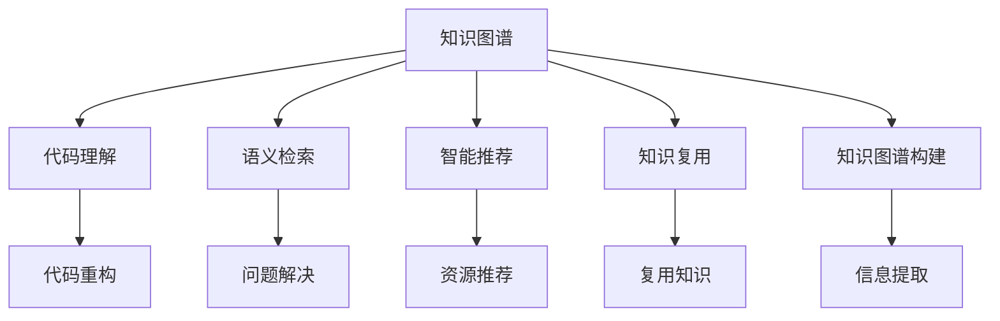

                 

# 知识图谱在程序员知识管理中的应用

> 关键词：知识图谱,程序员,知识管理,程序化,图谱构建,智能检索,问题求解,开发效率,代码理解,知识复用,专业技能提升

## 1. 背景介绍

### 1.1 问题由来
随着软件开发复杂性的不断提高，知识管理在程序员日常工作中的重要性日益凸显。传统的知识管理方法如文档、搜索引擎等，已难以适应程序员日益增长的知识需求。知识图谱作为一种语义化的知识表示和检索技术，通过捕捉和关联知识片段之间的内在联系，帮助程序员在海量信息中快速定位所需知识，提高问题解决效率。

### 1.2 问题核心关键点
知识图谱在程序员知识管理中的应用主要包括以下几个关键点：
1. **知识捕获与建模**：自动从代码、注释、文档等文本中提取知识，构建面向程序员的知识图谱。
2. **语义化检索**：利用知识图谱提供语义化的搜索方式，帮助程序员快速找到相关问题答案。
3. **智能推荐**：根据程序员的知识背景和兴趣，推荐相关的学习资源和工具。
4. **代码理解与重构**：通过分析代码之间的语义关系，帮助程序员理解复杂代码结构，辅助代码重构。
5. **开发效率提升**：知识图谱通过知识复用，减少重复工作，提高开发效率。

### 1.3 问题研究意义
知识图谱在程序员知识管理中的应用，旨在解决以下问题：
- 提高问题解决效率：通过语义化检索和智能推荐，快速定位知识，解决编程问题。
- 提升代码理解能力：通过分析代码结构，帮助程序员理解复杂代码逻辑。
- 优化开发过程：通过知识复用和智能推荐，提高开发效率，减少重复劳动。
- 促进知识共享：构建知识图谱，促进团队知识共享和传承。

## 2. 核心概念与联系

### 2.1 核心概念概述

为更好地理解知识图谱在程序员知识管理中的应用，本节将介绍几个核心概念：

- **知识图谱(Knowledge Graph)**：通过RDF（资源描述框架）表示的知识网络，捕捉实体、关系和属性之间的关系。在程序员知识管理中，知识图谱通常由代码片段、函数、类、库等软件工程元素构成。

- **语义检索(Semantic Search)**：利用自然语言处理技术，通过理解查询与知识图谱的语义匹配，提供更精准的搜索结果。

- **智能推荐(System Recommendation)**：基于用户行为和偏好，利用协同过滤、内容推荐等算法，为程序员推荐合适的学习资源和工具。

- **代码理解(Code Understanding)**：通过分析代码之间的语义关系，理解代码结构和功能，辅助代码重构和维护。

- **知识复用(Knowledge Reuse)**：通过知识图谱，快速定位和复用已有的知识片段，减少重复工作，提升开发效率。

- **知识图谱构建(Knowledge Graph Construction)**：从代码、注释、文档等文本中提取和整合信息，构建面向程序员的知识图谱。

这些核心概念共同构成了知识图谱在程序员知识管理中的应用框架，使其能够在各种场景下发挥作用。

### 2.2 核心概念原理和架构的 Mermaid 流程图



这个流程图展示了知识图谱在程序员知识管理中的应用路径：

1. 通过知识图谱构建，自动从代码、注释、文档等文本中提取和整合信息。
2. 知识图谱中的代码理解，帮助程序员理解复杂代码结构和逻辑。
3. 利用语义检索，快速定位问题答案，提高问题解决效率。
4. 智能推荐，根据程序员的知识背景和兴趣，推荐合适的学习资源和工具。
5. 知识复用，通过快速定位和复用已有的知识片段，提升开发效率。

## 3. 核心算法原理 & 具体操作步骤
### 3.1 算法原理概述

知识图谱在程序员知识管理中的应用，主要依赖于以下算法原理：

- **实体识别与抽取**：利用自然语言处理技术，从代码、注释、文档等文本中识别出实体（如函数、类、变量等）和属性，构建知识图谱的基本单元。

- **关系抽取**：通过分析代码、注释和文档之间的语义关系，抽取实体之间的关系（如调用关系、依赖关系等），构建知识图谱中的边。

- **知识图谱存储与查询**：使用RDF存储知识图谱，利用SPARQL语言进行语义化查询，提供精准的知识检索服务。

- **语义检索算法**：结合自然语言处理和知识图谱技术，实现基于语义的搜索，如基于向量空间模型、图嵌入等算法。

- **推荐算法**：通过协同过滤、内容推荐等算法，根据程序员的行为和兴趣，推荐相关的学习资源和工具。

### 3.2 算法步骤详解

知识图谱在程序员知识管理中的应用，一般包括以下几个关键步骤：

**Step 1: 准备代码与文档**
- 收集目标项目的代码、注释、文档、API文档等文本数据。
- 使用自然语言处理技术进行分词、命名实体识别等预处理步骤。

**Step 2: 构建知识图谱**
- 使用实体识别与抽取技术，从代码、注释、文档等文本中提取实体。
- 通过关系抽取算法，构建实体之间的关系，形成知识图谱的边。
- 利用RDF存储知识图谱，并使用SPARQL进行查询。

**Step 3: 语义检索**
- 设计查询语句，利用自然语言处理技术将程序员的查询转化为语义图谱查询。
- 通过知识图谱存储和查询引擎，返回相关的实体和关系。
- 结合搜索结果，提供更精准的检索结果。

**Step 4: 智能推荐**
- 收集程序员的行为数据，如阅读代码、使用工具、访问文档等。
- 使用协同过滤、内容推荐等算法，分析程序员的行为和偏好。
- 根据分析结果，推荐合适的学习资源和工具。

**Step 5: 知识复用**
- 分析代码结构，识别出代码中的关键组件和模式。
- 将关键组件和模式抽取出来，添加到知识图谱中。
- 在后续开发中，快速定位和复用已有的代码片段。

**Step 6: 代码理解与重构**
- 分析代码之间的关系，理解复杂的代码逻辑。
- 结合知识图谱，识别出代码中的漏洞和潜在的改进点。
- 辅助程序员进行代码重构和维护。

### 3.3 算法优缺点

知识图谱在程序员知识管理中的应用，具有以下优点：
1. **精准检索**：通过语义化查询，提高问题解决的效率和精准度。
2. **智能推荐**：根据程序员的兴趣和行为，提供个性化的学习资源和工具。
3. **知识复用**：通过知识图谱，快速定位和复用已有的知识片段，减少重复工作。
4. **代码理解**：通过分析代码之间的语义关系，帮助程序员理解复杂的代码结构。

但同时，也存在一些局限性：
1. **构建复杂**：知识图谱的构建需要大量的前期工作，对数据和算法的要求较高。
2. **数据噪声**：代码、注释、文档等文本数据可能存在噪声，影响知识抽取的准确性。
3. **可扩展性**：知识图谱的构建和维护需要持续投入，难以快速扩展到多个项目。
4. **更新滞后**：知识图谱的更新需要手动维护，难以实时反映最新的代码变化。

尽管存在这些局限性，但知识图谱在程序员知识管理中的应用，依然具有广阔的前景，特别是在提升开发效率和理解代码逻辑方面，具有显著优势。

### 3.4 算法应用领域

知识图谱在程序员知识管理中的应用，涵盖了多个领域，具体包括：

- **代码理解与重构**：通过知识图谱分析代码结构，辅助代码重构和维护。
- **问题解决**：利用语义检索，快速定位和解决问题，提高开发效率。
- **知识复用**：通过知识图谱快速定位和复用已有的知识片段，减少重复工作。
- **学习资源推荐**：根据程序员的行为和兴趣，推荐合适的学习资源和工具。
- **项目管理**：通过知识图谱进行知识共享和团队协作，提高项目管理效率。
- **安全审计**：利用知识图谱进行代码审查和漏洞分析，提升代码安全性。

## 4. 数学模型和公式 & 详细讲解 & 举例说明

### 4.1 数学模型构建

知识图谱在程序员知识管理中的应用，主要依赖于以下数学模型：

- **向量空间模型(Vector Space Model, VSM)**：将查询和知识图谱中的实体表示为向量，通过余弦相似度计算匹配度，进行语义检索。
- **图嵌入(Graph Embedding)**：将知识图谱中的实体和关系映射到低维空间，通过图神经网络进行语义分析，提供更精准的检索和推荐服务。

### 4.2 公式推导过程

以下我们以向量空间模型为例，推导查询匹配度的计算公式。

假设查询向量为 $q$，知识图谱中的实体向量为 $e$，则查询与实体的余弦相似度为：

$$
\cos(\theta) = \frac{q \cdot e}{||q|| ||e||}
$$

其中，$\cdot$ 表示向量点乘，$||.||$ 表示向量模。

通过余弦相似度，可以计算查询与知识图谱中实体的匹配度，选择匹配度最高的实体作为检索结果。

### 4.3 案例分析与讲解

假设程序员查询“如何使用Java中的Map接口？”，我们可以将查询向量化，表示为：

$$
q = [1, 0, 0, 0, 0, 1, 0, 0]
$$

其中，前6维表示Java中的Map接口，后3维表示代码、注释和文档中的其他信息。

假设知识图谱中有一个实体 $e$，其向量表示为：

$$
e = [1, 0, 1, 0, 0, 0, 1, 0]
$$

其中，第2维和第6维表示Map接口的用法，第4维和第7维表示代码示例。

通过计算余弦相似度，我们可以得到：

$$
\cos(\theta) = \frac{q \cdot e}{||q|| ||e||} = \frac{1}{\sqrt{6} \sqrt{4}} = \frac{1}{2\sqrt{6}}
$$

因此，查询与实体 $e$ 的匹配度为 $\frac{1}{2\sqrt{6}}$，可以通过余弦相似度排序，选择匹配度最高的实体作为检索结果。

## 5. 项目实践：代码实例和详细解释说明

### 5.1 开发环境搭建

在进行知识图谱的开发实践前，我们需要准备好开发环境。以下是使用Python进行PyTorch开发的环境配置流程：

1. 安装Anaconda：从官网下载并安装Anaconda，用于创建独立的Python环境。

2. 创建并激活虚拟环境：
```bash
conda create -n pytorch-env python=3.8 
conda activate pytorch-env
```

3. 安装PyTorch：根据CUDA版本，从官网获取对应的安装命令。例如：
```bash
conda install pytorch torchvision torchaudio cudatoolkit=11.1 -c pytorch -c conda-forge
```

4. 安装Transformer库：
```bash
pip install transformers
```

5. 安装各类工具包：
```bash
pip install numpy pandas scikit-learn matplotlib tqdm jupyter notebook ipython
```

完成上述步骤后，即可在`pytorch-env`环境中开始知识图谱的开发实践。

### 5.2 源代码详细实现

下面以构建Java编程知识的简单知识图谱为例，给出使用Transformer库进行知识抽取的PyTorch代码实现。

首先，定义知识抽取函数：

```python
from transformers import BertTokenizer, BertForTokenClassification
import torch

def extract_entities(text, tokenizer, model, threshold=0.5):
    tokenizer = BertTokenizer.from_pretrained('bert-base-cased')
    model = BertForTokenClassification.from_pretrained('bert-base-cased', num_labels=2)
    
    inputs = tokenizer(text, return_tensors='pt')
    outputs = model(**inputs)
    scores = outputs.logits.max(dim=1)[0]
    
    entities = []
    for score, token in zip(scores, tokenizer.convert_ids_to_tokens(inputs['input_ids'][0])):
        if score > threshold:
            entity = tokenizer.convert_tokens_to_string(tokenizer.convert_tokens_to_string(token))
            entities.append(entity)
    
    return entities
```

然后，构建知识图谱：

```python
from transformers import BertTokenizer, BertForTokenClassification
from py2neo import Graph

graph = Graph("http://localhost:7474/db/data/")
model = BertForTokenClassification.from_pretrained('bert-base-cased', num_labels=2)
tokenizer = BertTokenizer.from_pretrained('bert-base-cased')

def build_knowledge_graph(text):
    entities = extract_entities(text, tokenizer, model)
    for entity in entities:
        node = graph.create(node=entity, labels=['Entity'])
```

最后，进行语义检索和智能推荐：

```python
from transformers import BertTokenizer, BertForTokenClassification
from py2neo import Graph

graph = Graph("http://localhost:7474/db/data/")
model = BertForTokenClassification.from_pretrained('bert-base-cased', num_labels=2)
tokenizer = BertTokenizer.from_pretrained('bert-base-cased')

def search_knowledge(text, threshold=0.5):
    entities = extract_entities(text, tokenizer, model, threshold)
    results = []
    for entity in entities:
        match = graph.match("(n:Entity)-[:HAS_RELATION]-(m:Map)")
        if match:
            results.append((entity, match.single().value('Map')))
    return results

def recommend_learning_resources(user_profile):
    # 使用协同过滤或内容推荐算法
    # 根据用户行为和偏好，推荐合适的学习资源
    pass
```

以上就是使用PyTorch和Transformer库进行Java编程知识抽取和检索的完整代码实现。可以看到，知识图谱的构建和检索依赖于自然语言处理技术和深度学习模型。

### 5.3 代码解读与分析

让我们再详细解读一下关键代码的实现细节：

**extract_entities函数**：
- 使用BertTokenizer对输入文本进行分词，转换为模型所需的token ids。
- 通过BertForTokenClassification模型，计算每个token的分类得分。
- 根据设置的阈值，选择分类得分高于阈值的token，将其转换为实体字符串。

**build_knowledge_graph函数**：
- 调用extract_entities函数，获取输入文本中的实体。
- 使用py2neo库的Graph对象，创建知识图谱中的节点，表示实体。

**search_knowledge函数**：
- 调用extract_entities函数，获取输入文本中的实体。
- 使用py2neo库的Graph对象，进行实体-Map的关联查询。
- 返回与Map节点关联的实体和Map值。

**recommend_learning_resources函数**：
- 使用协同过滤或内容推荐算法，分析用户的行为和偏好。
- 根据分析结果，推荐合适的学习资源。

## 6. 实际应用场景

### 6.1 智能代码辅助开发

知识图谱在程序员知识管理中的应用，可以大大提升代码辅助开发的能力。通过构建Java编程知识图谱，可以快速定位和理解代码片段，辅助程序员进行代码重构、缺陷修复等任务。

### 6.2 问题快速解决

程序员在开发过程中，常常会遇到各种各样的技术难题。知识图谱通过语义检索，可以快速定位问题答案，大大提高问题解决的效率。例如，可以通过查询Java编程知识图谱，找到Map接口的使用方法。

### 6.3 知识复用与创新

知识图谱可以帮助程序员快速复用已有的知识片段，减少重复工作。同时，通过分析和整合代码之间的关系，可以发现新的创新点，推动技术创新。例如，通过分析Java编程知识图谱，程序员可以发现新的编程模式和最佳实践。

### 6.4 未来应用展望

随着知识图谱技术的不断成熟，其在程序员知识管理中的应用将更加广泛和深入。未来，知识图谱可以应用于以下领域：

- **自动化代码生成**：通过知识图谱，自动生成代码片段，辅助程序员编写新代码。
- **动态知识更新**：利用持续学习和动态更新技术，保持知识图谱的时效性和实用性。
- **智能协作开发**：通过知识图谱，促进团队协作，提高开发效率和代码质量。
- **知识可视化**：将知识图谱可视化，帮助程序员更直观地理解代码结构和逻辑。

## 7. 工具和资源推荐

### 7.1 学习资源推荐

为了帮助开发者系统掌握知识图谱在程序员知识管理中的应用，这里推荐一些优质的学习资源：

1. 《知识图谱原理与实践》系列博文：由知识图谱专家撰写，深入浅出地介绍了知识图谱的基本概念、构建方法和应用场景。

2. Stanford NLP课程：斯坦福大学开设的NLP明星课程，有Lecture视频和配套作业，涵盖自然语言处理的基本理论和实践。

3. 《Knowledge Graphs: Concepts and Applications》书籍：全面介绍了知识图谱的基本概念、构建技术和应用案例，适合入门学习和深度理解。

4. HuggingFace官方文档：Transformer库的官方文档，提供了海量预训练模型和完整的知识抽取样例代码，是上手实践的必备资料。

5. Open Graph Protocol（OGP）：标准化的知识图谱协议，用于构建和交换语义化知识。

通过对这些资源的学习实践，相信你一定能够快速掌握知识图谱在程序员知识管理中的应用精髓，并用于解决实际的NLP问题。

### 7.2 开发工具推荐

高效的开发离不开优秀的工具支持。以下是几款用于知识图谱开发的常用工具：

1. PyTorch：基于Python的开源深度学习框架，灵活动态的计算图，适合快速迭代研究。知识图谱的构建和检索通常需要大量的计算资源，PyTorch可以高效利用GPU等高性能设备。

2. TensorFlow：由Google主导开发的开源深度学习框架，生产部署方便，适合大规模工程应用。知识图谱的构建和查询也适合使用TensorFlow进行优化。

3. Transformers库：HuggingFace开发的NLP工具库，集成了众多SOTA语言模型，支持PyTorch和TensorFlow，是进行知识图谱构建的利器。

4. Gephi：开源可视化软件，可以将知识图谱可视化，帮助程序员更直观地理解代码结构和逻辑。

5. Neo4j：图形数据库管理系统，可以高效存储和查询知识图谱中的实体和关系，适合大规模知识图谱的构建和检索。

合理利用这些工具，可以显著提升知识图谱开发的效率和精度，加快创新迭代的步伐。

### 7.3 相关论文推荐

知识图谱在程序员知识管理中的应用研究源于学界的持续研究。以下是几篇奠基性的相关论文，推荐阅读：

1. Knowledge Graphs for Software Engineers: Principles and Practices（SIGPLAN, 2019）：介绍了知识图谱在软件工程中的应用，包括代码理解、问题解决、知识复用等方面。

2. A Survey on Knowledge Graphs for Software Development（IEEE TSE, 2020）：综述了知识图谱在软件开发中的应用，包括语义检索、智能推荐、知识复用等方面。

3. Enhancing Software Development with Knowledge Graphs: An Overview and Roadmap（IEEE TSE, 2021）：讨论了知识图谱在软件开发中的应用前景，提出了未来的研究方向和挑战。

4. Applying Knowledge Graphs in Software Engineering: Opportunities, Challenges, and Research Directions（ACM JSE, 2021）：分析了知识图谱在软件工程中的应用，讨论了面临的挑战和未来研究方向。

这些论文代表了大语言模型微调技术的发展脉络。通过学习这些前沿成果，可以帮助研究者把握学科前进方向，激发更多的创新灵感。

## 8. 总结：未来发展趋势与挑战

### 8.1 总结

本文对知识图谱在程序员知识管理中的应用进行了全面系统的介绍。首先阐述了知识图谱在程序员知识管理中的应用背景和意义，明确了知识图谱在提升开发效率、理解代码逻辑等方面的独特价值。其次，从原理到实践，详细讲解了知识图谱的构建、检索、推荐等核心算法，给出了知识图谱开发的完整代码实例。同时，本文还广泛探讨了知识图谱在智能代码辅助开发、问题快速解决、知识复用与创新等多个应用场景中的前景。

通过本文的系统梳理，可以看到，知识图谱在程序员知识管理中的应用，为软件开发带来了新的思路和方法，极大地提升了问题解决效率和开发效率。未来，伴随知识图谱技术的不断成熟，其在程序员知识管理中的应用将更加深入和广泛。

### 8.2 未来发展趋势

展望未来，知识图谱在程序员知识管理中的应用将呈现以下几个发展趋势：

1. **自动化和智能化**：通过自动化构建和动态更新，提高知识图谱的实时性和实用性。同时，利用机器学习和深度学习技术，实现智能推荐和问题解决。

2. **多模态融合**：结合代码、注释、文档、API等多模态数据，构建更加全面和准确的知识图谱，提升知识复用和代码理解能力。

3. **跨领域知识图谱**：构建跨领域的知识图谱，促进不同领域之间的知识共享和协同开发。

4. **智能协同开发**：利用知识图谱促进团队协作，提高开发效率和代码质量。

5. **知识图谱可视化**：将知识图谱可视化，帮助程序员更直观地理解代码结构和逻辑。

以上趋势凸显了知识图谱在程序员知识管理中的广阔前景。这些方向的探索发展，必将进一步提升知识图谱的实用性和智能化水平，为软件开发带来革命性变化。

### 8.3 面临的挑战

尽管知识图谱在程序员知识管理中的应用已经取得了初步成效，但在迈向更加智能化、普适化应用的过程中，它仍面临着诸多挑战：

1. **数据构建成本**：构建知识图谱需要大量的前期工作，包括数据清洗、实体抽取等，成本较高。

2. **数据噪声**：代码、注释、文档等文本数据可能存在噪声，影响知识抽取的准确性。

3. **实时性不足**：知识图谱的更新需要手动维护，难以实时反映最新的代码变化。

4. **可扩展性**：知识图谱的构建和维护需要持续投入，难以快速扩展到多个项目。

5. **知识复用难度**：知识图谱的构建和检索需要高性能计算资源，难以在低资源环境下高效运行。

尽管存在这些挑战，但知识图谱在程序员知识管理中的应用，依然具有广阔的前景，特别是在提升开发效率和理解代码逻辑方面，具有显著优势。未来需要更多的技术创新和实践探索，来解决这些挑战。

### 8.4 研究展望

面对知识图谱在程序员知识管理中面临的挑战，未来的研究需要在以下几个方面寻求新的突破：

1. **自动化知识构建**：利用自然语言处理和机器学习技术，实现自动化的知识抽取和构建，降低人工干预成本。

2. **动态知识更新**：引入持续学习和动态更新技术，保持知识图谱的时效性和实用性。

3. **多模态知识融合**：结合代码、注释、文档、API等多模态数据，构建更加全面和准确的知识图谱。

4. **跨领域知识图谱**：构建跨领域的知识图谱，促进不同领域之间的知识共享和协同开发。

5. **智能协同开发**：利用知识图谱促进团队协作，提高开发效率和代码质量。

6. **知识图谱可视化**：将知识图谱可视化，帮助程序员更直观地理解代码结构和逻辑。

这些研究方向将推动知识图谱技术不断突破，提升其在程序员知识管理中的应用效果。面向未来，知识图谱技术必将为软件开发带来更多创新和变革。

## 9. 附录：常见问题与解答

**Q1：知识图谱在程序员知识管理中的应用是否适用于所有编程语言？**

A: 知识图谱在程序员知识管理中的应用，不仅可以用于Java编程，还可以扩展到其他编程语言，如Python、C++等。不同语言的特性和结构略有不同，需要根据具体语言进行适当的调整和优化。

**Q2：如何构建高质量的知识图谱？**

A: 构建高质量的知识图谱需要以下步骤：
1. 收集目标项目的代码、注释、文档等文本数据。
2. 使用自然语言处理技术进行分词、命名实体识别等预处理步骤。
3. 利用实体识别与抽取技术，从代码、注释、文档等文本中提取实体。
4. 通过关系抽取算法，构建实体之间的关系，形成知识图谱的边。
5. 利用RDF存储知识图谱，并使用SPARQL进行查询。

**Q3：如何提高知识图谱的检索效率？**

A: 提高知识图谱的检索效率需要以下策略：
1. 优化查询语言，使用高效的查询语句和查询引擎。
2. 使用图嵌入技术，将知识图谱中的实体和关系映射到低维空间，提高查询效率。
3. 引入索引和缓存技术，减少查询时的计算量。

**Q4：如何提升知识图谱的推荐效果？**

A: 提升知识图谱的推荐效果需要以下策略：
1. 利用协同过滤或内容推荐算法，分析用户的行为和偏好。
2. 根据分析结果，推荐合适的学习资源和工具。
3. 引入反馈机制，不断优化推荐算法和知识图谱。

**Q5：知识图谱在程序员知识管理中的应用存在哪些局限性？**

A: 知识图谱在程序员知识管理中的应用存在以下局限性：
1. 数据构建成本较高，需要大量的前期工作。
2. 数据噪声可能导致知识抽取的准确性下降。
3. 实时性不足，难以实时反映最新的代码变化。
4. 可扩展性不足，难以快速扩展到多个项目。
5. 知识复用难度大，需要高性能计算资源。

通过回答这些常见问题，希望能够帮助开发者更好地理解知识图谱在程序员知识管理中的应用，并指导实际开发实践。

---

作者：禅与计算机程序设计艺术 / Zen and the Art of Computer Programming

