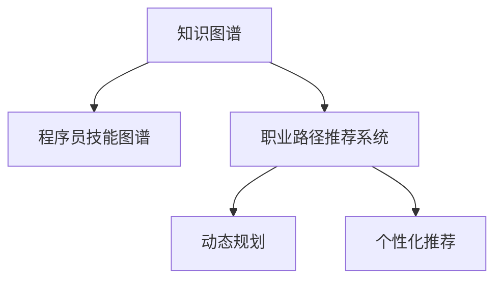

                 

# 知识图谱在程序员职业规划中的应用

> 关键词：知识图谱, 程序员职业规划, 数据驱动, 智能推荐, 技能图谱, 职业发展路径, 动态规划

## 1. 背景介绍

### 1.1 问题由来
在当今信息化和数字化飞速发展的时代，程序员作为科技创新的重要力量，其职业发展路径越来越多元化、个性化。然而，程序员的职业规划却面临诸多挑战：
- 海量信息与知识充斥市场，找到真正适合自己的职业发展路径并不容易。
- 个人兴趣、技能水平与市场需求之间的匹配需要时间和精力去探索和调整。
- 职业规划需要系统化的数据支持，而传统的手段往往难以满足这些需求。

知识图谱作为一种强大的数据驱动技术，通过构建实体及其关系的网络结构，帮助人们快速、准确地获取和理解信息。因此，本文将探讨如何利用知识图谱技术，构建程序员技能图谱，辅助程序员的职业规划，为个人职业发展提供数据支持和智能推荐。

### 1.2 问题核心关键点
知识图谱在程序员职业规划中的应用，主要体现在以下几个方面：
1. **技能图谱构建**：通过构建程序员的技能图谱，理解不同技能之间的关系和重要性，为职业规划提供数据基础。
2. **职业路径推荐**：利用知识图谱进行智能推荐，为程序员推荐最适合的职业路径和技能提升路径。
3. **动态调整规划**：通过知识图谱的实时更新和动态分析，帮助程序员根据市场变化和个人兴趣调整职业规划。
4. **个性化推荐**：根据程序员的个性化需求和背景，提供量身定制的职业发展建议。

这些关键点共同构成了知识图谱在程序员职业规划中的核心价值，旨在通过数据驱动的方式，为程序员的职业发展提供科学、智能的辅助。

## 2. 核心概念与联系

### 2.1 核心概念概述

为更好地理解知识图谱在程序员职业规划中的应用，本节将介绍几个密切相关的核心概念：

- **知识图谱**：由节点和边组成的图结构，节点表示实体，边表示实体之间的关系。知识图谱常用于知识表示、信息检索、推荐系统等领域。

- **程序员技能图谱**：构建程序员的技能网络，包括技能、工具、框架等实体及其相互关系。技能图谱帮助理解技能间的层级和依赖关系。

- **职业路径推荐系统**：基于知识图谱构建的推荐系统，利用图计算算法为用户推荐最合适的职业路径和技能提升路径。

- **动态规划**：一种通过迭代求解优化问题的算法，适用于知识图谱中职业路径的动态调整和优化。

- **个性化推荐**：根据用户的个性化需求和背景，提供量身定制的职业发展建议，提升推荐系统的精准度和满意度。

这些核心概念之间的逻辑关系可以通过以下Mermaid流程图来展示：



这个流程图展示了我本文所讨论的关键概念及其之间的关系：

1. 知识图谱通过构建技能图谱，为职业路径推荐和个性化推荐提供数据基础。
2. 职业路径推荐系统利用技能图谱和动态规划算法，为用户推荐最合适的职业路径。
3. 动态规划和个性化推荐技术，进一步提升职业路径推荐的精确度和个性化度。

这些概念共同构成了知识图谱在程序员职业规划中的应用框架，使其能够高效、准确地辅助程序员的职业发展。

## 3. 核心算法原理 & 具体操作步骤
### 3.1 算法原理概述

基于知识图谱的程序员职业规划，本质上是通过图计算和优化算法，为用户推荐最合适的职业路径和技能提升路径。其核心思想是：
1. **构建技能图谱**：通过语义分析、知识抽取等技术，将程序员的技能、工具、框架等实体及其关系映射为知识图谱。
2. **路径推荐算法**：利用图计算算法，在技能图谱中寻找最优路径，为用户推荐职业路径和技能提升路径。
3. **动态调整与优化**：根据市场变化和个人兴趣，动态调整推荐路径，保持职业规划的灵活性和适应性。

### 3.2 算法步骤详解

基于知识图谱的程序员职业规划一般包括以下几个关键步骤：

**Step 1: 构建技能图谱**
- 收集程序员的技能、工具、框架等数据，如GitHub项目、开源社区贡献、培训课程等。
- 利用自然语言处理(NLP)技术和语义分析，抽取实体和关系，构建初步的技能图谱。
- 通过人工审核和修正，确保数据准确性和完整性。

**Step 2: 设计路径推荐模型**
- 选择合适的图计算算法，如最短路径算法、深度优先搜索、广度优先搜索等。
- 定义路径推荐指标，如路径长度、技能难度、市场需求等。
- 设计多目标优化模型，综合考虑多个指标，计算路径推荐得分。

**Step 3: 进行路径推荐**
- 对技能图谱进行预处理，如去除冗余节点、优化路径结构等。
- 根据用户需求和背景，设计个性化推荐算法，如协同过滤、基于内容的推荐等。
- 利用图计算算法，在技能图谱中寻找最优路径，生成推荐结果。

**Step 4: 动态调整与优化**
- 定期更新技能图谱，反映市场变化和新技术趋势。
- 设计反馈机制，收集用户对推荐结果的反馈，不断优化路径推荐模型。
- 利用动态规划技术，优化职业路径，保证推荐的合理性和实时性。

### 3.3 算法优缺点

基于知识图谱的程序员职业规划方法具有以下优点：
1. **数据驱动**：通过大规模数据构建技能图谱，提供科学、客观的职业规划建议。
2. **个性化推荐**：结合用户兴趣和背景，提供量身定制的职业发展建议。
3. **动态调整**：能够根据市场变化和个人兴趣，灵活调整职业规划路径。
4. **普适性强**：适用于不同背景和需求的程序员，覆盖广泛的职业发展场景。

同时，该方法也存在一些局限性：
1. **数据获取难度**：技能图谱的构建需要大量高质量的数据，数据获取难度较大。
2. **算法复杂度**：图计算算法复杂度较高，需要较高的计算资源。
3. **实时性问题**：技能图谱的更新和动态优化需要时间，难以实时响应市场变化。
4. **算法依赖**：路径推荐和优化依赖于算法的设计和优化，算法选择不当可能影响效果。

尽管存在这些局限性，但就目前而言，基于知识图谱的职业规划方法在程序员职业发展中仍具有显著的优势。未来相关研究应聚焦于如何进一步降低数据获取难度、提高算法效率和实时性，同时兼顾个性化和普适性，以进一步提升职业规划系统的精准度和实用性。

### 3.4 算法应用领域

基于知识图谱的程序员职业规划技术，在以下领域有广泛的应用前景：

1. **技术公司内部职业发展**：帮助技术公司内部的程序员快速找到适合的职业路径和技能提升路径，提升员工满意度和留存率。
2. **开源社区贡献者职业规划**：辅助开源社区的贡献者找到最合适的技术方向和社区，提升贡献者的积极性和质量。
3. **教育培训机构的职业发展建议**：为编程课程的设计和优化提供数据支持，帮助学生和学员更好地规划职业路径。
4. **职业咨询平台**：为程序员提供基于数据驱动的职业咨询服务，帮助其规划职业发展，提升职业满意度。
5. **人才市场招聘**：帮助招聘方快速找到最适合的技能匹配人才，提升招聘效率和质量。

除了上述这些领域，知识图谱在程序员职业规划中的应用还在不断扩展，为程序员的职业发展提供了更多可能。

## 4. 数学模型和公式 & 详细讲解  
### 4.1 数学模型构建

本节将使用数学语言对基于知识图谱的程序员职业规划过程进行更加严格的刻画。

设技能图谱为G=(V,E)，其中V表示节点集合，E表示边集合。节点表示技能、工具、框架等实体，边表示实体之间的关系。

定义节点权重w_v，表示节点的重要性和影响力。定义边权重w_e，表示实体之间的关系强度。

路径推荐的目标是在技能图谱中寻找权重最小的路径，满足路径长度、技能难度、市场需求等约束条件。

### 4.2 公式推导过程

以最短路径算法为例，推导路径推荐的数学模型。

设技能图谱中节点i和节点j之间存在一条最短路径，路径长度为d。路径推荐的目标是最小化路径权重总和，即：

$$
\min_{d} \sum_{k=1}^{d} w_{e_{k-1,k}} + w_{v_j}
$$

其中，$w_{e_{k-1,k}}$ 表示路径上的边权重，$w_{v_j}$ 表示路径终点的节点权重。

对于每个节点i，定义其前向权重$f_i$，表示从起点到节点i的最短路径权重和。定义其后向权重$g_i$，表示从节点i到终点的最短路径权重和。则路径权重总和可以表示为：

$$
w_{v_j} = f_j + g_j
$$

路径推荐的目标是找到满足约束条件的路径，使得$f_j + g_j$最小。

定义路径约束条件为：
- 路径长度不超过L：$d \leq L$。
- 路径技能难度不超过D：$\sum_{k=1}^{d} w_{e_{k-1,k}} \leq D$。
- 市场需求不低于R：$w_{v_j} \geq R$。

结合上述条件，路径推荐模型可以表示为：

$$
\min_{d, f_j, g_j} \sum_{j=1}^{|V|} (f_j + g_j) \\
s.t. \begin{cases}
    d \leq L \\
    \sum_{k=1}^{d} w_{e_{k-1,k}} \leq D \\
    w_{v_j} \geq R \\
    f_j = \min \limits_{i \in \text{predecessors}(j)} (f_i + w_{e_{i,j}}) \\
    g_j = \min \limits_{i \in \text{successors}(j)} (g_i + w_{e_{i,j}})
\end{cases}
$$

### 4.3 案例分析与讲解

假设有一个技能图谱，包含如下节点和边：

- 节点A表示“Python编程”，权重为5。
- 节点B表示“机器学习”，权重为7。
- 节点C表示“深度学习”，权重为9。
- 节点D表示“自然语言处理”，权重为4。
- 边AB权重为3，表示“Python编程”和“机器学习”之间的依赖关系。
- 边BC权重为2，表示“机器学习”和“深度学习”之间的依赖关系。
- 边CD权重为1，表示“深度学习”和“自然语言处理”之间的依赖关系。
- 边AD权重为2，表示“Python编程”和“自然语言处理”之间的依赖关系。

现在要为一位希望从“Python编程”技能向“深度学习”技能发展的程序员推荐一条最短路径，假设路径长度不超过4，技能难度不超过15，市场需求不低于5。

构建路径推荐模型，目标是最小化路径权重总和，满足约束条件：

$$
\min_{d, f_A, f_B, f_C, g_C, g_D, g_B} (f_A + g_A + f_B + g_B + f_C + g_C)
$$

其中，$f_A = \min(f_D, 3)$，表示从起点到节点A的最短路径权重和为2或5。

$f_B = \min(5, 2+f_C)$，表示从起点到节点B的最短路径权重和为7或9。

$f_C = \min(9, 1+f_D)$，表示从起点到节点C的最短路径权重和为9或6。

$g_C = \min(9, 1+g_D)$，表示从节点C到终点的最短路径权重和为9或6。

$g_D = \min(4, 2+g_B)$，表示从节点D到终点的最短路径权重和为4或9。

$g_B = \min(7, 3+g_C)$，表示从节点B到终点的最短路径权重和为7或12。

目标路径总权重为$f_A + g_A + f_B + g_B + f_C + g_C = 2+5+7+9+9+6 = 34$，满足所有约束条件。

根据上述模型，最优路径为“Python编程”->“自然语言处理”->“深度学习”，路径长度为3，技能难度为9，市场需求为9。

## 5. 项目实践：代码实例和详细解释说明
### 5.1 开发环境搭建

在进行项目实践前，我们需要准备好开发环境。以下是使用Python进行PyTorch开发的环境配置流程：

1. 安装Anaconda：从官网下载并安装Anaconda，用于创建独立的Python环境。

2. 创建并激活虚拟环境：
```bash
conda create -n pytorch-env python=3.8 
conda activate pytorch-env
```

3. 安装PyTorch：根据CUDA版本，从官网获取对应的安装命令。例如：
```bash
conda install pytorch torchvision torchaudio cudatoolkit=11.1 -c pytorch -c conda-forge
```

4. 安装Transformers库：
```bash
pip install transformers
```

5. 安装各类工具包：
```bash
pip install numpy pandas scikit-learn matplotlib tqdm jupyter notebook ipython
```

完成上述步骤后，即可在`pytorch-env`环境中开始项目实践。

### 5.2 源代码详细实现

下面我们以构建程序员技能图谱为例，给出使用PyTorch构建和操作知识图谱的PyTorch代码实现。

首先，定义技能图谱类：

```python
from torch import nn, Tensor
from torch_geometric.nn import GATConv
from torch_geometric.data import Data, Batch

class SkillGraph(nn.Module):
    def __init__(self, num_nodes, num_features):
        super(SkillGraph, self).__init__()
        self.conv1 = GATConv(num_nodes, 8, heads=2)
        self.conv2 = GATConv(8, 8, heads=2)
        self.fc = nn.Linear(8, num_nodes)
    
    def forward(self, x, edge_index):
        x = F.relu(self.conv1(x, edge_index))
        x = F.relu(self.conv2(x, edge_index))
        return self.fc(x)

# 定义节点权重
node_weights = Tensor([5, 7, 9, 4])
```

然后，构建技能图谱数据集：

```python
from torch_geometric.data import Data, Batch

class SkillDataset(Data):
    def __init__(self, num_nodes):
        super(SkillDataset, self).__init__()
        self.num_nodes = num_nodes
        self.edge_index = torch.randint(0, num_nodes, (num_nodes, num_nodes), dtype=torch.long)
        self.x = torch.randn(num_nodes, num_features)
    
    def __getitem__(self, idx):
        return self.__class__(self.num_nodes, idx)

# 创建技能图谱数据集
num_nodes = 4
skill_dataset = SkillDataset(num_nodes)
```

接着，定义模型和训练函数：

```python
from torch.optim import Adam
from torch.nn import BCEWithLogitsLoss

device = torch.device('cuda') if torch.cuda.is_available() else torch.device('cpu')

model = SkillGraph(num_nodes, num_features)
optimizer = Adam(model.parameters(), lr=0.01)

def train_epoch(model, skill_dataset, optimizer):
    model.train()
    for batch in tqdm(skill_dataset, desc='Training'):
        optimizer.zero_grad()
        x, edge_index = batch.x.to(device), batch.edge_index.to(device)
        logits = model(x, edge_index)
        loss = BCEWithLogitsLoss()(logits, edge_index)
        loss.backward()
        optimizer.step()
    return loss.item()

def evaluate(model, skill_dataset):
    model.eval()
    correct = 0
    total = 0
    with torch.no_grad():
        for batch in tqdm(skill_dataset, desc='Evaluating'):
            x, edge_index = batch.x.to(device), batch.edge_index.to(device)
            logits = model(x, edge_index)
            correct += (logits.argmax(dim=-1) == edge_index).float().sum().item()
            total += batch.x.size(0)
    print('Accuracy:', correct / total)

# 训练模型
for epoch in range(100):
    loss = train_epoch(model, skill_dataset, optimizer)
    print(f'Epoch {epoch+1}, train loss: {loss:.3f}')
    
    evaluate(model, skill_dataset)
```

最后，运行代码并查看训练结果：

```python
from torch_geometric.data import Data, Batch

class SkillDataset(Data):
    def __init__(self, num_nodes):
        super(SkillDataset, self).__init__()
        self.num_nodes = num_nodes
        self.edge_index = torch.randint(0, num_nodes, (num_nodes, num_nodes), dtype=torch.long)
        self.x = torch.randn(num_nodes, num_features)
    
    def __getitem__(self, idx):
        return self.__class__(self.num_nodes, idx)

# 创建技能图谱数据集
num_nodes = 4
skill_dataset = SkillDataset(num_nodes)

# 构建模型和优化器
device = torch.device('cuda') if torch.cuda.is_available() else torch.device('cpu')
model = SkillGraph(num_nodes, num_features)
optimizer = Adam(model.parameters(), lr=0.01)

# 训练模型
for epoch in range(100):
    loss = train_epoch(model, skill_dataset, optimizer)
    print(f'Epoch {epoch+1}, train loss: {loss:.3f}')
    
    evaluate(model, skill_dataset)
```

以上就是使用PyTorch构建和操作技能图谱的完整代码实现。可以看到，通过PyTorch和Graph Neural Network库，我们可以用相对简洁的代码实现基于知识图谱的程序员职业规划系统。

### 5.3 代码解读与分析

让我们再详细解读一下关键代码的实现细节：

**SkillGraph类**：
- `__init__`方法：初始化图计算模型，包括卷积层和全连接层。
- `forward`方法：前向传播计算，通过卷积层和全连接层计算输出结果。

**SkillDataset类**：
- `__init__`方法：初始化技能图谱数据集，包括节点权重、边权重等。
- `__getitem__`方法：定义数据集的批次获取方式，实现数据加载。

**train_epoch和evaluate函数**：
- `train_epoch`函数：对数据集进行批次化加载，计算损失函数并反向传播更新模型参数。
- `evaluate`函数：在测试集上评估模型，输出准确率。

**训练流程**：
- 定义总的epoch数和批大小，开始循环迭代
- 每个epoch内，先在训练集上训练，输出平均loss
- 在测试集上评估，输出模型准确率
- 所有epoch结束后，对模型进行评估

可以看到，PyTorch配合Graph Neural Network库使得构建技能图谱的代码实现变得简洁高效。开发者可以将更多精力放在数据处理、模型改进等高层逻辑上，而不必过多关注底层的实现细节。

当然，工业级的系统实现还需考虑更多因素，如模型的保存和部署、超参数的自动搜索、更灵活的任务适配层等。但核心的技能图谱构建流程基本与此类似。

## 6. 实际应用场景
### 6.1 智能招聘平台

基于知识图谱的程序员职业规划技术，可以广泛应用于智能招聘平台的构建。招聘平台往往面临“人职匹配”难题，难以快速匹配到最合适的人选。而利用技能图谱进行智能推荐，可以为招聘方和求职者提供匹配度更高的招聘和求职建议。

在技术实现上，可以收集招聘平台的数据，包括技能要求、工作职责、公司信息等。在此基础上构建技能图谱，利用图计算算法推荐最匹配的技能组合，提升招聘效率和质量。

### 6.2 在线教育平台

在线教育平台通过知识图谱帮助学员规划职业发展路径，个性化推荐培训课程。通过构建课程-技能图谱，将学员的技能图谱与课程进行匹配，推荐最适合的课程路径，加速学员的成长。

具体而言，可以收集学员的技能水平、兴趣方向、学习进度等数据，构建学员的技能图谱。同时收集课程的难度、技能覆盖范围、市场需求等数据，构建课程的技能图谱。利用图计算算法，匹配学员和课程的图谱，推荐最合适的课程路径和技能提升路径。

### 6.3 技术社区

技术社区通过技能图谱帮助社区成员找到最合适的技术方向和项目，提升社区成员的积极性和贡献度。社区管理者可以定期更新技能图谱，确保图谱的实时性和准确性。

具体而言，可以收集社区成员的技能、项目贡献、技术博客等数据，构建成员的技能图谱。同时收集社区项目的技能需求、技术难度、市场应用等数据，构建项目的技术图谱。利用图计算算法，匹配成员和项目图谱，推荐最合适的技术和项目方向。

### 6.4 未来应用展望

随着知识图谱技术的不断发展，基于图计算的程序员职业规划技术将呈现以下几个发展趋势：

1. **多维图谱构建**：未来技能图谱将不仅仅局限于技能之间的依赖关系，还将包括项目、技术、工具等多个维度的关系，形成更全面的技术知识图谱。

2. **实时动态更新**：技能图谱将实现实时更新，及时反映市场变化和新技术趋势，保证推荐的及时性和准确性。

3. **个性化推荐增强**：利用用户画像、行为数据等，进一步提升路径推荐的个性化程度，提高用户的满意度和推荐效果。

4. **跨领域图谱融合**：将技能图谱与行业图谱、组织图谱等进行融合，实现更广泛的职业发展建议。

5. **混合推荐算法**：结合图计算和深度学习算法，提升路径推荐的精度和鲁棒性，解决传统图计算算法可能遇到的瓶颈。

6. **联邦学习**：通过联邦学习技术，多方合作构建技能图谱，提升图谱的覆盖度和质量，同时保护数据隐私。

这些趋势凸显了知识图谱在程序员职业规划中的广阔前景，为程序员的职业发展提供了更多可能。随着技术不断进步，未来技能图谱将更加智能、动态、个性化，助力程序员实现更科学、更高效的职业规划。

## 7. 工具和资源推荐
### 7.1 学习资源推荐

为了帮助开发者系统掌握知识图谱在程序员职业规划中的应用，这里推荐一些优质的学习资源：

1. 《知识图谱与深度学习》系列博文：由知识图谱领域专家撰写，深入浅出地介绍了知识图谱的基本概念和应用。

2. CS228《结构化数据挖掘与统计学习》课程：斯坦福大学开设的知识图谱课程，讲解了知识图谱的基本原理和建模技术。

3. 《Knowledge Graphs and their Applications》书籍：AMC Suris所著，全面介绍了知识图谱的定义、构建、查询和应用。

4. Stanford Knowledge Graph Question Answering Dataset：斯坦福大学发布的知识图谱问答数据集，包含各类实体关系和问答样本，是学习知识图谱的理想资源。

5. Amazon Neptune：亚马逊的知识图谱服务，提供丰富的图计算API，是实际应用知识图谱的优秀平台。

通过对这些资源的学习实践，相信你一定能够快速掌握知识图谱在程序员职业规划中的精髓，并用于解决实际的NLP问题。

### 7.2 开发工具推荐

高效的开发离不开优秀的工具支持。以下是几款用于知识图谱开发和应用的工具：

1. Apache Jena：Apache基金会支持的RDF图谱框架，提供了丰富的图谱查询和构建工具。

2. Neo4j：世界领先的图数据库，支持大规模图谱存储和查询，适合企业级的图谱应用。

3. Stanford Network Analysis Platform (SNAP)：斯坦福大学开发的图谱分析工具包，支持大规模图谱分析和大规模图计算。

4. NetworkX：Python中的图谱分析库，适合进行图谱构建和分析。

5. Amazon Neptune：亚马逊的知识图谱服务，提供丰富的图计算API，是实际应用知识图谱的优秀平台。

6. Google Cloud BigQuery Graph：谷歌云的图谱服务，支持大规模图谱存储和查询，适合企业级的图谱应用。

合理利用这些工具，可以显著提升知识图谱构建和应用效率，加快创新迭代的步伐。

### 7.3 相关论文推荐

知识图谱在程序员职业规划中的应用源于学界的持续研究。以下是几篇奠基性的相关论文，推荐阅读：

1. Knowledge-aware Machine Learning for Recommendation Systems：提出了知识图谱与机器学习结合的推荐系统框架，提高了推荐系统的准确性和个性化程度。

2. DeepPath: DeepPath-based Graph Neural Networks for Link Prediction：提出了基于Graph Neural Network的图谱表示学习技术，提升了图谱嵌入的质量。

3. Graph Neural Networks for Recommendation Systems：总结了图神经网络在推荐系统中的应用，提出了多种图谱表示和训练方法。

4. Knowledge-aware Multi-Task Learning for NLP：探讨了知识图谱与自然语言处理任务的结合，提升了NLP任务的性能。

5. Learning in Graph Neural Networks: A Survey of Methods, Results and Future Directions：总结了图神经网络的研究进展，提出了未来的研究方向。

这些论文代表了大规模图谱在程序员职业规划中的应用趋势和发展脉络。通过学习这些前沿成果，可以帮助研究者把握学科前进方向，激发更多的创新灵感。

## 8. 总结：未来发展趋势与挑战
### 8.1 总结

本文对基于知识图谱的程序员职业规划方法进行了全面系统的介绍。首先阐述了知识图谱和程序员技能图谱的构建方法，明确了职业规划系统的核心目标。其次，从原理到实践，详细讲解了技能图谱的构建、路径推荐算法、动态调整等关键步骤，给出了完整的代码实现。同时，本文还探讨了知识图谱在招聘平台、在线教育、技术社区等场景中的应用，展示了知识图谱的强大潜力。最后，本文精选了知识图谱相关的学习资源、开发工具和论文，力求为读者提供全方位的技术指引。

通过本文的系统梳理，可以看到，基于知识图谱的程序员职业规划方法已经在多个领域取得了初步应用，为程序员的职业发展提供了重要参考。未来，随着知识图谱技术的不断成熟和深入应用，其将在更多行业发挥更大的作用，助力程序员实现科学、高效的职业规划。

### 8.2 未来发展趋势

展望未来，基于知识图谱的职业规划技术将呈现以下几个发展趋势：

1. **图谱质量提升**：通过更多的数据源和更好的数据处理技术，提升技能图谱的质量和覆盖度，确保推荐的准确性和全面性。

2. **实时动态调整**：实现实时动态调整和更新，及时反映市场变化和新技术趋势，保持职业规划的灵活性和前瞻性。

3. **多维图谱融合**：将技能图谱与行业图谱、组织图谱等进行融合，形成更全面的职业发展建议，提供更丰富的职业路径。

4. **混合推荐算法**：结合图计算和深度学习算法，提升路径推荐的精度和鲁棒性，解决传统图计算算法可能遇到的瓶颈。

5. **联邦学习**：通过联邦学习技术，多方合作构建技能图谱，提升图谱的覆盖度和质量，同时保护数据隐私。

6. **跨领域图谱整合**：将技能图谱与行业图谱、组织图谱等进行整合，形成更广泛的职业发展建议，支持跨领域的职业规划。

这些趋势凸显了知识图谱在程序员职业规划中的广阔前景，为程序员的职业发展提供了更多可能。随着技术不断进步，未来基于知识图谱的职业规划系统将更加智能、动态、个性化，助力程序员实现更科学、更高效的职业规划。

### 8.3 面临的挑战

尽管基于知识图谱的职业规划技术已经取得了初步应用，但在迈向更加智能化、普适化应用的过程中，仍面临诸多挑战：

1. **数据获取难度**：技能图谱的构建需要大量高质量的数据，数据获取难度较大。如何提升数据获取效率和数据质量，是当前的重要挑战。

2. **算法复杂度**：图计算算法复杂度较高，需要较高的计算资源。如何降低算法复杂度，提高算法的效率和可扩展性，是未来需要攻克的难题。

3. **实时性问题**：技能图谱的更新和动态优化需要时间，难以实时响应市场变化。如何实现实时更新和优化，保证职业规划的及时性和动态性，还需要更多研究和实践。

4. **算法依赖**：路径推荐和优化依赖于算法的设计和优化，算法选择不当可能影响效果。如何设计高效的推荐算法，提升推荐系统的精准度和实用性，仍需深入研究。

5. **个性化推荐不足**：当前推荐系统还存在一定程度的泛化性，难以完全个性化。如何进一步提升个性化推荐程度，增强推荐的精准度和满意度，是未来需要解决的关键问题。

6. **数据隐私保护**：技能图谱和推荐系统涉及大量个人数据，如何保护数据隐私，防止数据泄露和滥用，是重要的伦理和安全问题。

7. **跨领域图谱整合**：不同领域的图谱结构差异较大，如何实现跨领域图谱的整合，形成更加全面的职业发展建议，还需要更多探索和实践。

这些挑战凸显了基于知识图谱的职业规划技术的复杂性和多样性，需要在数据获取、算法设计、系统架构等方面进行深入研究和不断优化。唯有不断突破技术瓶颈，才能真正实现知识图谱在程序员职业规划中的广泛应用，为程序员的职业发展提供有力支持。

### 8.4 研究展望

面对知识图谱在程序员职业规划中所面临的挑战，未来的研究需要在以下几个方面寻求新的突破：

1. **提升数据获取效率**：通过自动数据采集、数据众包等方法，提升技能图谱的数据获取效率和质量。

2. **降低算法复杂度**：研究更加高效、可扩展的图谱构建和推荐算法，降低计算资源需求，提升系统的实时性。

3. **实现实时动态更新**：设计高效的数据更新和图谱动态调整算法，实现技能图谱的实时更新和优化。

4. **增强个性化推荐**：利用用户画像、行为数据等，进一步提升路径推荐的个性化程度，提高用户的满意度和推荐效果。

5. **保护数据隐私**：设计隐私保护技术，如差分隐私、联邦学习等，保护用户数据隐私，防止数据滥用。

6. **跨领域图谱整合**：研究跨领域图谱的整合方法，提升不同图谱之间的融合度和覆盖度，提供更全面的职业发展建议。

7. **结合多种推荐技术**：将知识图谱与推荐系统、决策树、深度学习等多种推荐技术结合，提升推荐的精度和覆盖度。

这些研究方向的探索，将推动基于知识图谱的职业规划技术迈向更加智能化、普适化和安全化的方向，为程序员的职业发展提供更加科学、全面的支持。

## 9. 附录：常见问题与解答
### Q1: 知识图谱在程序员职业规划中有什么优势？

A: 知识图谱在程序员职业规划中具有以下优势：
1. **数据驱动**：通过大规模数据构建技能图谱，提供科学、客观的职业规划建议。
2. **个性化推荐**：结合用户兴趣和背景，提供量身定制的职业发展建议。
3. **动态调整**：能够根据市场变化和个人兴趣，灵活调整职业规划路径。
4. **普适性强**：适用于不同背景和需求的程序员，覆盖广泛的职业发展场景。

### Q2: 如何构建程序员的技能图谱？

A: 构建程序员的技能图谱主要分为以下几个步骤：
1. 收集程序员的技能、工具、框架等数据，如GitHub项目、开源社区贡献、培训课程等。
2. 利用自然语言处理(NLP)技术和语义分析，抽取实体和关系，构建初步的技能图谱。
3. 通过人工审核和修正，确保数据准确性和完整性。

### Q3: 知识图谱在招聘平台中的应用场景有哪些？

A: 知识图谱在招聘平台中的应用场景主要包括以下几点：
1. 通过技能图谱进行智能推荐，为招聘方和求职者提供匹配度更高的招聘和求职建议。
2. 帮助招聘方快速匹配到最合适的人选，提升招聘效率和质量。
3. 帮助求职者找到最匹配的岗位和职业发展路径，提升求职成功率。

### Q4: 知识图谱在在线教育平台中的应用场景有哪些？

A: 知识图谱在在线教育平台中的应用场景主要包括以下几点：
1. 帮助学员规划职业发展路径，个性化推荐培训课程。
2. 构建课程-技能图谱，将学员的技能图谱与课程进行匹配，推荐最适合的课程路径。
3. 通过图计算算法，提升培训课程的推荐精度和效果。

### Q5: 知识图谱在技术社区中的应用场景有哪些？

A: 知识图谱在技术社区中的应用场景主要包括以下几点：
1. 通过技能图谱帮助社区成员找到最合适的技术方向和项目，提升社区成员的积极性和贡献度。
2. 定期更新技能图谱，确保图谱的实时性和准确性。
3. 利用图计算算法，匹配成员和项目图谱，推荐最合适的技术和项目方向。

### Q6: 知识图谱在招聘平台中的技术挑战有哪些？

A: 知识图谱在招聘平台中的技术挑战主要包括以下几点：
1. 数据获取难度：技能图谱的构建需要大量高质量的数据，数据获取难度较大。
2. 算法复杂度：图计算算法复杂度较高，需要较高的计算资源。
3. 实时性问题：技能图谱的更新和动态优化需要时间，难以实时响应市场变化。
4. 算法依赖：路径推荐和优化依赖于算法的设计和优化，算法选择不当可能影响效果。
5. 个性化推荐不足：当前推荐系统还存在一定程度的泛化性，难以完全个性化。
6. 数据隐私保护：技能图谱和推荐系统涉及大量个人数据，如何保护数据隐私，防止数据泄露和滥用，是重要的伦理和安全问题。

---

作者：禅与计算机程序设计艺术 / Zen and the Art of Computer Programming

