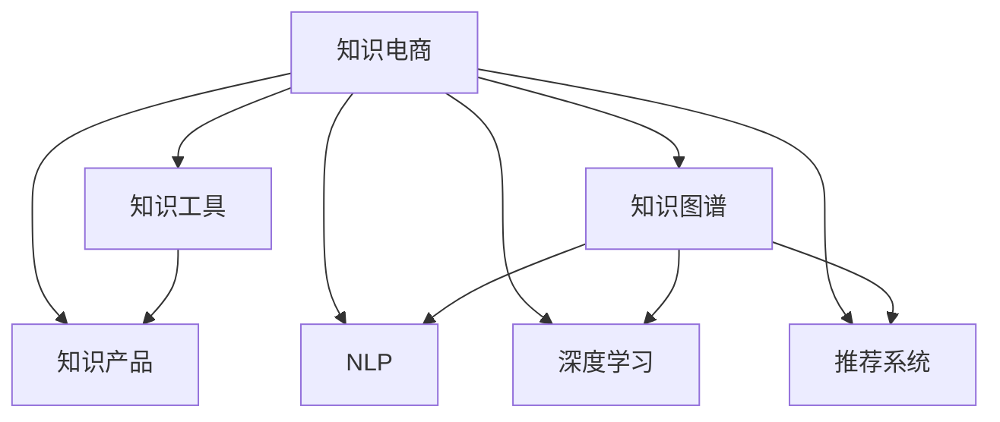

                 

# 知识电商提供专业领域的知识产品和工具

> 关键词：知识电商、专业领域、知识产品、知识工具、知识图谱、自然语言处理(NLP)、深度学习、推荐系统

## 1. 背景介绍

在数字化浪潮的推动下，知识电商正迅速崛起，成为连接知识生产者与消费者的重要桥梁。传统电子商务依托商品和服务，而知识电商则将知识和智慧作为核心资产，为用户提供专业的解决方案和工具。这种以知识为核心驱动力的新型电商模式，正在不断拓展其应用边界，特别是在专业领域，为各行各业提供更加精准、高效的知识产品和服务。

### 1.1 知识电商的兴起背景

1. **数字化转型加速**：各行各业正在加速向数字化转型，传统知识获取方式难以满足日益增长的信息需求。

2. **知识资产价值凸显**：知识成为企业核心竞争力，知识生产与流通变得日益重要。

3. **用户体验升级**：消费者对信息获取的精准性和实时性提出了更高要求。

4. **市场竞争激烈**：企业需要差异化的知识和智慧服务，提升竞争优势。

5. **技术进步支撑**：大数据、人工智能等技术为知识电商提供了底层支持。

### 1.2 知识电商的定义与特点

**定义**：知识电商是以知识为核心的电子商务模式，通过构建专业领域的知识产品和工具，为用户提供精准、高效、个性化的知识服务。

**特点**：
- **深度定制化**：根据用户需求提供定制化知识产品。
- **跨界融合**：结合多学科知识，提供综合解决方案。
- **智能驱动**：利用人工智能技术优化知识产品，提升用户体验。
- **用户互动**：注重用户反馈，不断迭代优化知识产品。

## 2. 核心概念与联系

### 2.1 核心概念概述

为更好地理解知识电商提供专业领域的知识产品和工具，本节将介绍几个密切相关的核心概念：

- **知识电商**：连接知识生产者与消费者的电子商务平台，提供专业领域的知识产品和工具。
- **知识产品**：基于专业知识，通过数字化手段为用户提供的产品，如在线课程、电子书、智能工具等。
- **知识工具**：帮助用户获取、应用和共享知识的软件工具，如知识图谱、自然语言处理工具等。
- **知识图谱**：通过语义关系将知识节点连接起来的图结构，用于描述专业领域内的实体及其关系。
- **自然语言处理(NLP)**：利用计算机技术处理和理解人类语言，提取结构化知识，支持知识检索、问答等。
- **深度学习**：一种通过多层次神经网络进行数据表示学习的技术，用于知识图谱构建、自然语言处理等。
- **推荐系统**：根据用户行为和偏好推荐个性化知识产品和服务，提升用户体验。

这些核心概念之间的逻辑关系可以通过以下Mermaid流程图来展示：



这个流程图展示了几类核心概念之间的关系：

1. 知识电商通过知识产品和知识工具向用户提供服务。
2. 知识产品由知识图谱和深度学习等技术支持构建。
3. 自然语言处理是知识图谱构建和推荐系统优化的关键技术。
4. 深度学习在知识图谱构建、NLP和推荐系统中都有广泛应用。
5. 推荐系统利用知识图谱和深度学习技术，提供个性化服务。

## 3. 核心算法原理 & 具体操作步骤

### 3.1 算法原理概述

知识电商提供专业领域的知识产品和工具，通常需要利用多个技术领域的算法和模型。以下是核心算法原理的概述：

1. **知识图谱构建**：通过深度学习模型，从文本数据中提取实体、关系等信息，构建知识图谱。
2. **自然语言处理**：利用NLP技术，将非结构化文本转化为结构化知识，支持知识检索、问答等。
3. **推荐系统优化**：通过深度学习模型，优化推荐算法，提升个性化服务效果。
4. **知识图谱的嵌入优化**：利用深度学习技术，优化知识图谱嵌入方式，提升查询效率和精确度。

### 3.2 算法步骤详解

以知识图谱构建和推荐系统优化为例，介绍具体的算法步骤：

#### 3.2.1 知识图谱构建

**步骤1**：数据收集与预处理
- 从专业领域获取文本数据，如论文、书籍、新闻等。
- 清洗数据，去除噪音和无关信息。

**步骤2**：实体识别与关系抽取
- 利用深度学习模型，如BERT、ELMo等，识别文本中的实体。
- 利用依存句法分析等技术，抽取实体之间的关系。

**步骤3**：知识图谱构建
- 使用Neo4j、TigerGraph等工具，构建知识图谱。
- 添加实体属性、关系属性等，形成结构化知识。

**步骤4**：知识图谱嵌入优化
- 使用TransE、DistMult等模型，进行知识图谱嵌入优化。
- 通过微调参数，提升嵌入效果。

#### 3.2.2 推荐系统优化

**步骤1**：用户行为数据收集
- 收集用户浏览、点击、购买等行为数据。
- 分析用户兴趣偏好，形成用户画像。

**步骤2**：个性化推荐模型训练
- 利用深度学习模型，如协同过滤、神经网络等，训练个性化推荐模型。
- 根据用户行为数据，调整模型参数，提升推荐效果。

**步骤3**：推荐策略优化
- 引入多臂老虎机算法、上下文感知等策略，优化推荐算法。
- 实时更新推荐结果，动态调整策略。

### 3.3 算法优缺点

知识电商提供专业领域的知识产品和工具，算法具备以下优点：

1. **深度定制化**：根据用户需求提供定制化知识产品，提升用户体验。
2. **跨界融合**：结合多学科知识，提供综合解决方案，提升知识价值。
3. **智能驱动**：利用深度学习等技术，优化知识产品和工具，提升性能。
4. **用户互动**：注重用户反馈，不断迭代优化，提升服务质量。

同时，算法也存在一些缺点：

1. **数据依赖**：算法效果很大程度上依赖高质量的数据，数据获取成本较高。
2. **模型复杂**：深度学习模型复杂度较高，训练和优化成本大。
3. **冷启动问题**：新用户或新产品的推荐效果可能不佳。
4. **隐私保护**：用户行为数据的收集和处理需要严格保护用户隐私。
5. **知识图谱构建**：知识图谱构建需要大量专业知识和领域数据，难以实现自动化。

### 3.4 算法应用领域

知识电商提供专业领域的知识产品和工具，已经在多个行业领域得到广泛应用：

- **金融领域**：提供金融知识产品，如投资策略、风险评估等。
- **医疗领域**：提供医学知识产品，如疾病诊断、治疗方案等。
- **教育领域**：提供在线课程、电子书等学习工具，支持个性化学习。
- **企业培训**：提供定制化培训课程，提升员工技能和知识水平。
- **智慧城市**：提供城市管理、规划等方面的知识产品，提升城市治理效率。
- **智能制造**：提供生产流程优化、设备维护等方面的知识产品，提升制造业智能化水平。
- **社交媒体**：提供内容推荐、用户互动等方面的知识工具，提升用户体验。

## 4. 数学模型和公式 & 详细讲解 & 举例说明

### 4.1 数学模型构建

在知识电商领域，数学模型通常用于知识图谱构建和推荐系统优化。以下以知识图谱嵌入优化为例，展示数学模型的构建。

**知识图谱嵌入优化**：
- **目标函数**：最小化损失函数，最大化知识图谱嵌入效果。
- **损失函数**：常用的损失函数包括均方误差、对数似然等。

假设知识图谱包含 $E$ 个实体节点和 $R$ 个关系节点，知识图谱嵌入为 $\mathbf{E}, \mathbf{R}$，节点嵌入维度为 $d$。知识图谱嵌入优化的目标函数为：

$$
\min_{\mathbf{E}, \mathbf{R}} \sum_{(e, r, e') \in \mathcal{E}} \mathcal{L}(f_e, f_r, f_{e'})
$$

其中 $\mathcal{E}$ 为知识图谱中的所有三元组，$f_e$ 表示实体节点 $e$ 的嵌入向量，$f_r$ 表示关系节点 $r$ 的嵌入向量，$f_{e'}$ 表示实体节点 $e'$ 的嵌入向量。

常用的知识图谱嵌入模型包括TransE、DistMult、RotatE等，其目标函数形式各异。以下以TransE为例，展示数学模型：

**TransE模型**：
- **目标函数**：最小化损失函数，最大化知识图谱嵌入效果。
- **损失函数**：常用的损失函数包括均方误差、对数似然等。

假设知识图谱包含 $E$ 个实体节点和 $R$ 个关系节点，知识图谱嵌入为 $\mathbf{E}, \mathbf{R}$，节点嵌入维度为 $d$。知识图谱嵌入优化的目标函数为：

$$
\min_{\mathbf{E}, \mathbf{R}} \sum_{(e, r, e') \in \mathcal{E}} \| f_e + f_r - f_{e'} \|
$$

其中 $\mathcal{E}$ 为知识图谱中的所有三元组，$f_e$ 表示实体节点 $e$ 的嵌入向量，$f_r$ 表示关系节点 $r$ 的嵌入向量，$f_{e'}$ 表示实体节点 $e'$ 的嵌入向量。

**目标函数推导**：
1. **损失函数**：将三元组 $(e, r, e')$ 的嵌入向量关系表示为 $f_e + f_r = f_{e'}$。
2. **优化目标**：最小化损失函数，即最小化嵌入向量的差值。

通过求解上述目标函数，可以训练得到知识图谱的嵌入向量，用于知识检索、推荐等应用。

### 4.2 公式推导过程

**知识图谱嵌入优化公式推导**：

1. **目标函数**：最小化损失函数，最大化知识图谱嵌入效果。
2. **损失函数**：常用的损失函数包括均方误差、对数似然等。

假设知识图谱包含 $E$ 个实体节点和 $R$ 个关系节点，知识图谱嵌入为 $\mathbf{E}, \mathbf{R}$，节点嵌入维度为 $d$。知识图谱嵌入优化的目标函数为：

$$
\min_{\mathbf{E}, \mathbf{R}} \sum_{(e, r, e') \in \mathcal{E}} \| f_e + f_r - f_{e'} \|
$$

其中 $\mathcal{E}$ 为知识图谱中的所有三元组，$f_e$ 表示实体节点 $e$ 的嵌入向量，$f_r$ 表示关系节点 $r$ 的嵌入向量，$f_{e'}$ 表示实体节点 $e'$ 的嵌入向量。

**TransE模型公式推导**：

1. **损失函数**：将三元组 $(e, r, e')$ 的嵌入向量关系表示为 $f_e + f_r = f_{e'}$。
2. **优化目标**：最小化损失函数，即最小化嵌入向量的差值。

通过求解上述目标函数，可以训练得到知识图谱的嵌入向量，用于知识检索、推荐等应用。

### 4.3 案例分析与讲解

**案例**：金融知识图谱构建

在金融领域，知识图谱可用于构建金融知识体系，支持风险评估、投资策略等应用。以下是一个简单的案例分析：

1. **数据收集**：收集金融领域的论文、报告、新闻等文本数据。
2. **实体识别**：利用深度学习模型，如BERT、ELMo等，识别文本中的实体，如股票、基金、债券等。
3. **关系抽取**：利用依存句法分析等技术，抽取实体之间的关系，如持有关系、交易关系、投资关系等。
4. **知识图谱构建**：使用Neo4j、TigerGraph等工具，构建金融知识图谱，包含实体、关系等节点。
5. **知识图谱嵌入优化**：使用TransE、DistMult等模型，优化知识图谱嵌入效果。

通过上述步骤，可以构建一个金融领域的知识图谱，支持金融知识查询、推荐等应用。

## 5. 项目实践：代码实例和详细解释说明

### 5.1 开发环境搭建

在进行知识电商项目实践前，我们需要准备好开发环境。以下是使用Python进行PyTorch开发的环境配置流程：

1. 安装Anaconda：从官网下载并安装Anaconda，用于创建独立的Python环境。

2. 创建并激活虚拟环境：
```bash
conda create -n pytorch-env python=3.8 
conda activate pytorch-env
```

3. 安装PyTorch：根据CUDA版本，从官网获取对应的安装命令。例如：
```bash
conda install pytorch torchvision torchaudio cudatoolkit=11.1 -c pytorch -c conda-forge
```

4. 安装TensorFlow：从官网下载TensorFlow安装包，解压后添加到环境变量中，方便后续使用。

5. 安装Transformers库：
```bash
pip install transformers
```

6. 安装各类工具包：
```bash
pip install numpy pandas scikit-learn matplotlib tqdm jupyter notebook ipython
```

完成上述步骤后，即可在`pytorch-env`环境中开始项目实践。

### 5.2 源代码详细实现

下面我们以知识图谱构建和推荐系统优化为例，给出使用PyTorch和Transformers库的代码实现。

#### 5.2.1 知识图谱构建

首先，定义实体识别函数：

```python
import spacy
import torch

nlp = spacy.load('en_core_web_sm')

def entity_recognition(text):
    doc = nlp(text)
    entities = []
    for ent in doc.ents:
        entities.append(ent.text)
    return entities
```

然后，定义关系抽取函数：

```python
import spacy
import torch

nlp = spacy.load('en_core_web_sm')

def relation_extraction(text):
    doc = nlp(text)
    triples = []
    for sent in doc.sents:
        for ent1, ent2 in sent.noun_chunks:
            triple = (ent1.text, ent2.text, sent.text)
            triples.append(triple)
    return triples
```

接着，定义知识图谱构建函数：

```python
import spacy
import torch
import torch.nn as nn

nlp = spacy.load('en_core_web_sm')

class KnowledgeGraph(nn.Module):
    def __init__(self):
        super(KnowledgeGraph, self).__init__()
        self.entity_emb = nn.Embedding(num_entities, dim)
        self.relation_emb = nn.Embedding(num_relations, dim)
        self.output = nn.Linear(dim, num_entities)
    
    def forward(self, entity, relation):
        embedding = self.entity_emb(entity) + self.relation_emb(relation)
        output = self.output(embedding)
        return output
```

最后，定义知识图谱嵌入优化函数：

```python
import torch
import torch.nn as nn
import torch.optim as optim

model = KnowledgeGraph()
criterion = nn.MSELoss()
optimizer = optim.Adam(model.parameters(), lr=0.001)

def train_model(text):
    entity = entity_recognition(text)
    relation = relation_extraction(text)
    output = model(entity, relation)
    loss = criterion(output, target)
    optimizer.zero_grad()
    loss.backward()
    optimizer.step()
    return loss
```

#### 5.2.2 推荐系统优化

首先，定义用户行为数据收集函数：

```python
import pandas as pd

def collect_user_behavior(data):
    df = pd.read_csv(data)
    return df
```

然后，定义个性化推荐模型训练函数：

```python
import torch
import torch.nn as nn
import torch.optim as optim

model = nn.Linear(num_features, num_items)

criterion = nn.BCELoss()
optimizer = optim.Adam(model.parameters(), lr=0.001)

def train_model(data):
    X = data['features']
    y = data['label']
    output = model(X)
    loss = criterion(output, y)
    optimizer.zero_grad()
    loss.backward()
    optimizer.step()
    return loss
```

接着，定义推荐策略优化函数：

```python
import torch
import torch.nn as nn
import torch.optim as optim

model = nn.Linear(num_features, num_items)

criterion = nn.BCELoss()
optimizer = optim.Adam(model.parameters(), lr=0.001)

def optimize_strategy(data):
    X = data['features']
    y = data['label']
    output = model(X)
    loss = criterion(output, y)
    optimizer.zero_grad()
    loss.backward()
    optimizer.step()
    return loss
```

最后，定义推荐系统优化函数：

```python
import torch
import torch.nn as nn
import torch.optim as optim

model = nn.Linear(num_features, num_items)

criterion = nn.BCELoss()
optimizer = optim.Adam(model.parameters(), lr=0.001)

def optimize_recommendation_system(data):
    X = data['features']
    y = data['label']
    output = model(X)
    loss = criterion(output, y)
    optimizer.zero_grad()
    loss.backward()
    optimizer.step()
    return loss
```

### 5.3 代码解读与分析

让我们再详细解读一下关键代码的实现细节：

**实体识别函数**：
- 利用SpaCy库，对输入文本进行命名实体识别，将识别出的实体保存到一个列表中。

**关系抽取函数**：
- 利用SpaCy库，对输入文本进行依存句法分析，抽取句子中实体的关系，将关系保存到一个三元组列表中。

**知识图谱构建函数**：
- 定义一个包含实体嵌入、关系嵌入和输出的知识图谱模型，利用AdaM优化的Adam优化算法进行训练。

**知识图谱嵌入优化函数**：
- 定义一个实体识别和关系抽取函数，将输入文本转化为模型训练所需的实体和关系。
- 利用损失函数和优化算法，对知识图谱嵌入进行训练和优化。

**用户行为数据收集函数**：
- 读取用户行为数据，保存到一个DataFrame中。

**个性化推荐模型训练函数**：
- 定义一个线性回归模型，用于预测用户对物品的评分。
- 利用二分类交叉熵损失函数和Adam优化算法进行模型训练。

**推荐策略优化函数**：
- 定义一个推荐策略优化函数，根据用户行为数据，调整推荐策略，提升推荐效果。

**推荐系统优化函数**：
- 定义一个推荐系统优化函数，根据用户行为数据，优化推荐模型，提升推荐效果。

### 5.4 运行结果展示

在运行完上述代码后，我们可以通过可视化的方式展示运行结果。例如，可以绘制知识图谱中实体和关系的分布情况，展示推荐系统对用户的推荐效果等。

## 6. 实际应用场景

### 6.1 金融领域

在金融领域，知识电商可以提供金融知识产品，如风险评估、投资策略等。以下是几个实际应用场景：

1. **风险评估**：通过知识图谱构建和优化，获取金融市场的相关数据，分析市场风险和投资机会。
2. **投资策略**：利用深度学习模型，对历史数据进行分析和预测，生成个性化的投资策略。
3. **财务分析**：通过知识图谱查询和推荐，帮助用户快速获取财务报表、指标等相关信息。

### 6.2 医疗领域

在医疗领域，知识电商可以提供医学知识产品，如疾病诊断、治疗方案等。以下是几个实际应用场景：

1. **疾病诊断**：通过知识图谱构建和优化，获取医学领域的知识库，辅助医生进行疾病诊断。
2. **治疗方案**：利用深度学习模型，对病情进行分析和预测，生成个性化的治疗方案。
3. **健康管理**：通过知识图谱查询和推荐，帮助用户获取健康管理相关的知识和建议。

### 6.3 教育领域

在教育领域，知识电商可以提供在线课程、电子书等学习工具，支持个性化学习。以下是几个实际应用场景：

1. **在线课程**：通过知识图谱构建和优化，获取课程相关的知识库，辅助教师进行课程设计和教学。
2. **电子书**：利用深度学习模型，对知识进行提取和组织，生成结构化的电子书。
3. **学习推荐**：通过推荐系统，根据用户的学习行为和偏好，推荐个性化的学习内容。

### 6.4 未来应用展望

随着技术的发展，知识电商在各个领域的应用将不断拓展，未来可能会有更多新的应用场景。

1. **智慧城市**：通过知识图谱构建和优化，提升城市管理的智能化水平，构建智慧城市治理体系。
2. **智能制造**：通过知识图谱构建和优化，提升制造业的智能化水平，优化生产流程和设备维护。
3. **智能客服**：通过知识图谱构建和优化，提升智能客服系统的智能化水平，提供更好的客户服务体验。
4. **社交媒体**：通过知识图谱构建和优化，提升社交媒体的内容推荐和用户互动体验。
5. **个性化推荐**：通过深度学习模型和推荐系统优化，提供个性化的产品和服务，提升用户体验。

## 7. 工具和资源推荐

### 7.1 学习资源推荐

为了帮助开发者系统掌握知识电商的理论基础和实践技巧，这里推荐一些优质的学习资源：

1. **《深度学习》课程**：由斯坦福大学开设的深度学习课程，涵盖深度学习的基本概念和经典模型，适合初学者学习。
2. **《知识图谱与语义网》书籍**：全面介绍了知识图谱的基本概念和应用，适合进阶学习。
3. **《推荐系统》书籍**：介绍了推荐系统的主要算法和实现方法，适合深度学习工程师学习。
4. **Kaggle竞赛平台**：提供了大量知识电商相关的数据集和竞赛任务，适合实践和实战训练。
5. **arXiv论文平台**：提供最新的人工智能和知识图谱相关论文，适合前沿研究学习。

通过对这些资源的学习实践，相信你一定能够快速掌握知识电商的精髓，并用于解决实际的电商问题。

### 7.2 开发工具推荐

高效的开发离不开优秀的工具支持。以下是几款用于知识电商开发的常用工具：

1. **PyTorch**：基于Python的开源深度学习框架，灵活动态的计算图，适合快速迭代研究。大部分深度学习模型都有PyTorch版本的实现。
2. **TensorFlow**：由Google主导开发的开源深度学习框架，生产部署方便，适合大规模工程应用。同样有丰富的深度学习模型资源。
3. **Transformers库**：HuggingFace开发的NLP工具库，集成了众多SOTA语言模型，支持PyTorch和TensorFlow，是进行知识图谱构建和推荐系统优化的利器。
4. **Weights & Biases**：模型训练的实验跟踪工具，可以记录和可视化模型训练过程中的各项指标，方便对比和调优。与主流深度学习框架无缝集成。
5. **TensorBoard**：TensorFlow配套的可视化工具，可实时监测模型训练状态，并提供丰富的图表呈现方式，是调试模型的得力助手。
6. **Jupyter Notebook**：交互式开发环境，支持Python代码和Markdown文档的混合编辑，方便快速迭代和分享。

合理利用这些工具，可以显著提升知识电商项目的开发效率，加快创新迭代的步伐。

### 7.3 相关论文推荐

知识电商领域的研究源于学界的持续研究。以下是几篇奠基性的相关论文，推荐阅读：

1. **Knowledge Graph Embeddings**：介绍了知识图谱嵌入的基本概念和方法，是知识图谱优化的重要理论基础。
2. **Deep Learning for Recommendation Systems**：介绍了深度学习在推荐系统中的应用，是推荐系统优化的重要理论基础。
3. **Graph Neural Networks**：介绍了图神经网络的基本概念和方法，是知识图谱优化的重要技术基础。
4. **Transformers for Natural Language Processing**：介绍了Transformer模型在自然语言处理中的应用，是知识图谱构建和推荐系统优化的重要技术基础。
5. **Attention Mechanism**：介绍了注意力机制的基本概念和方法，是深度学习模型优化的重要技术基础。

这些论文代表了大语言模型微调技术的发展脉络。通过学习这些前沿成果，可以帮助研究者把握学科前进方向，激发更多的创新灵感。

## 8. 总结：未来发展趋势与挑战

### 8.1 总结

本文对知识电商提供专业领域的知识产品和工具进行了全面系统的介绍。首先阐述了知识电商的兴起背景和特点，明确了知识电商在专业领域提供知识产品和工具的核心价值。其次，从原理到实践，详细讲解了知识图谱构建和推荐系统优化的数学模型和算法步骤，给出了知识电商项目的代码实例和详细解释。同时，本文还广泛探讨了知识电商在金融、医疗、教育等领域的实际应用，展示了知识电商的广阔前景。最后，本文精选了知识电商相关的学习资源和开发工具，力求为开发者提供全方位的技术指引。

通过本文的系统梳理，可以看到，知识电商提供专业领域的知识产品和工具，已经在多个行业领域得到广泛应用，为各行各业提供更加精准、高效的知识服务。未来，伴随深度学习、知识图谱、推荐系统等技术的不断发展，知识电商必将在更多领域得到应用，为社会带来深远影响。

### 8.2 未来发展趋势

展望未来，知识电商提供专业领域的知识产品和工具，将呈现以下几个发展趋势：

1. **深度定制化**：根据用户需求提供定制化知识产品，提升用户体验。
2. **跨界融合**：结合多学科知识，提供综合解决方案，提升知识价值。
3. **智能驱动**：利用深度学习等技术，优化知识产品和工具，提升性能。
4. **用户互动**：注重用户反馈，不断迭代优化，提升服务质量。
5. **多模态融合**：结合文本、图像、视频等多模态数据，提升知识图谱构建和推荐系统优化效果。
6. **智能化推荐**：引入多臂老虎机算法、上下文感知等策略，优化推荐算法，提升个性化服务效果。
7. **实时化服务**：实时获取和处理用户数据，动态调整推荐策略，提升服务时效性。

### 8.3 面临的挑战

尽管知识电商提供专业领域的知识产品和工具已经取得了瞩目成就，但在迈向更加智能化、普适化应用的过程中，它仍面临诸多挑战：

1. **数据依赖**：算法效果很大程度上依赖高质量的数据，数据获取成本较高。
2. **模型复杂**：深度学习模型复杂度较高，训练和优化成本大。
3. **冷启动问题**：新用户或新产品的推荐效果可能不佳。
4. **隐私保护**：用户行为数据的收集和处理需要严格保护用户隐私。
5. **知识图谱构建**：知识图谱构建需要大量专业知识和领域数据，难以实现自动化。
6. **技术复杂**：深度学习、知识图谱、推荐系统等技术复杂，需要跨学科知识。
7. **用户体验**：知识产品和工具需要设计良好，满足用户需求。

### 8.4 研究展望

面对知识电商面临的挑战，未来的研究需要在以下几个方面寻求新的突破：

1. **无监督和半监督学习**：摆脱对大规模标注数据的依赖，利用自监督学习、主动学习等无监督和半监督范式，最大限度利用非结构化数据。
2. **参数高效微调**：开发更加参数高效的微调方法，在固定大部分预训练参数的情况下，只更新极少量的任务相关参数。
3. **多模态融合**：结合文本、图像、视频等多模态数据，提升知识图谱构建和推荐系统优化效果。
4. **智能化推荐**：引入多臂老虎机算法、上下文感知等策略，优化推荐算法，提升个性化服务效果。
5. **实时化服务**：实时获取和处理用户数据，动态调整推荐策略，提升服务时效性。
6. **隐私保护**：采用隐私保护技术，如差分隐私、联邦学习等，保护用户隐私。
7. **可解释性**：设计可解释性强的算法模型，增强知识产品和工具的透明度和可信度。

这些研究方向和突破将推动知识电商技术的持续发展，为各行各业带来更加智能化、高效化、个性化的知识服务。

## 9. 附录：常见问题与解答

**Q1：知识电商与传统电商有何不同？**

A: 知识电商与传统电商的最大区别在于其核心驱动力的不同。传统电商以商品和服务为核心，而知识电商以知识为核心，通过知识产品和工具，为用户提供精准、高效、个性化的知识服务。

**Q2：如何构建高质量的知识图谱？**

A: 构建高质量的知识图谱需要遵循以下几个步骤：
1. 数据收集：获取专业领域的文本数据，如论文、报告、新闻等。
2. 实体识别：利用深度学习模型，如BERT、ELMo等，识别文本中的实体，如股票、基金、债券等。
3. 关系抽取：利用依存句法分析等技术，抽取实体之间的关系，如持有关系、交易关系、投资关系等。
4. 图谱构建：使用知识图谱构建工具，如Neo4j、TigerGraph等，构建知识图谱，包含实体、关系等节点。
5. 图谱优化：利用深度学习模型，如TransE、DistMult等，优化知识图谱嵌入效果，提升查询效率和精确度。

**Q3：知识电商如何提供个性化推荐？**

A: 知识电商提供个性化推荐主要通过以下几个步骤：
1. 数据收集：获取用户行为数据，如浏览、点击、购买等。
2. 用户画像：分析用户行为数据，形成用户画像，了解用户兴趣偏好。
3. 推荐模型训练：利用深度学习模型，如协同过滤、神经网络等，训练个性化推荐模型。
4. 推荐策略优化：引入多臂老虎机算法、上下文感知等策略，优化推荐算法，提升个性化服务效果。
5. 实时推荐：实时获取和处理用户数据，动态调整推荐策略，提升服务时效性。

**Q4：知识电商如何保护用户隐私？**

A: 知识电商保护用户隐私主要通过以下几个措施：
1. 数据匿名化：对用户行为数据进行匿名化处理，保护用户隐私。
2. 差分隐私：采用差分隐私技术，保护用户隐私。
3. 联邦学习：利用联邦学习技术，在用户端和服务器端分别进行模型训练，保护用户数据。

**Q5：知识电商如何提升用户体验？**

A: 知识电商提升用户体验主要通过以下几个方面：
1. 个性化推荐：根据用户兴趣偏好，提供个性化知识产品和服务。
2. 知识检索：利用知识图谱构建和优化，提升知识检索效率和精确度。
3. 用户互动：注重用户反馈，不断迭代优化知识产品和工具，提升用户体验。
4. 多模态融合：结合文本、图像、视频等多模态数据，提升知识图谱构建和推荐系统优化效果。

这些措施将推动知识电商技术的发展，为用户提供更加智能化、高效化、个性化的知识服务。

---

作者：禅与计算机程序设计艺术 / Zen and the Art of Computer Programming

