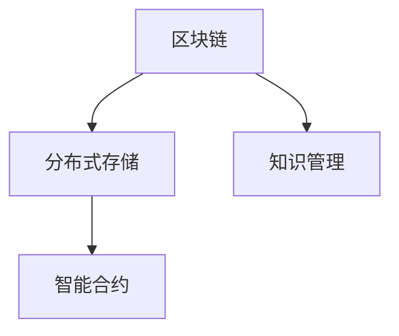

                 

# 知识的分布式存储：区块链技术的应用

> 关键词：区块链,分布式存储,知识管理,去中心化,智能合约

## 1. 背景介绍

随着信息技术的飞速发展，知识的存储、共享和管理变得越来越重要。传统集中式存储方式存在数据孤岛、共享不畅、中心化依赖等诸多问题。如何构建一个安全、高效、去中心化的知识存储系统，是当下各大企业和研究机构面临的共同挑战。

区块链技术的出现，为解决这些问题提供了新的思路。基于区块链的分布式存储系统，能够确保数据的安全性、透明性和可追溯性，同时克服了中心化存储的诸多局限性。本文将深入探讨区块链技术在知识管理中的应用，为知识的分布式存储提供新的解决方案。

## 2. 核心概念与联系

### 2.1 核心概念概述

在深入讨论区块链技术之前，我们先梳理一下相关核心概念：

- **区块链(Blockchain)**：一种去中心化的分布式账本技术，通过区块链式数据结构记录和验证交易，并使用共识机制确保数据一致性。

- **分布式存储(Distributed Storage)**：数据存储在多个分布式节点上，通过冗余备份和数据分片，提高系统的容错性和可扩展性。

- **知识管理(Knowledge Management)**：通过信息技术和方法，对组织内部的知识进行收集、存储、共享、应用和创新，促进知识的利用和增值。

- **智能合约(Smart Contract)**：一种去中心化的自动化合约，能够在区块链上自动执行预设条件下的操作，减少中间环节，提升交易效率。

### 2.2 核心概念原理和架构的 Mermaid 流程图



这个简单的流程图展示了区块链、分布式存储、知识管理和智能合约之间的联系。区块链作为底层技术，为分布式存储和知识管理提供了安全透明的数据基础。分布式存储则在数据的分片和备份上发挥作用，提高了系统的容错性和可扩展性。知识管理则通过智能合约，确保知识共享和使用的高效性和自动化。

## 3. 核心算法原理 & 具体操作步骤

### 3.1 算法原理概述

区块链技术通过分布式节点共同维护一个账本，保证了数据的透明性和不可篡改性。知识管理则通过智能合约，对数据和权限进行管理，确保知识共享的自动化和高效性。

在知识管理中，分布式存储和区块链技术的结合，能够实现以下功能：

1. **数据的分片与备份**：通过将知识数据分片存储在不同节点上，实现数据冗余备份，提高系统的容错性和数据可靠性。
2. **数据的透明与可追溯性**：区块链上的数据存储记录了每一次的读写操作，确保数据来源透明、可追溯。
3. **数据的安全与隐私**：通过加密技术，确保数据的存储和传输过程安全，保护用户隐私。
4. **数据的共享与协作**：智能合约能够自动管理权限和资源分配，确保知识的有效共享与利用。

### 3.2 算法步骤详解

基于区块链的知识管理分布式存储系统通常包括以下步骤：

**Step 1: 系统设计**
- 确定系统的总体架构和功能需求。
- 选择合适的区块链平台，如以太坊、Hyperledger等。
- 设计分布式存储方案，确定数据分片策略和冗余备份策略。

**Step 2: 数据建模**
- 定义知识数据的结构，包括元数据、结构化数据和半结构化数据。
- 设计智能合约逻辑，定义数据的访问权限和操作流程。
- 确定数据分片规则和加密算法。

**Step 3: 分布式存储**
- 将知识数据分片存储在多个分布式节点上。
- 实现数据的冗余备份和一致性同步。
- 监控和维护节点的健康状况，确保系统的稳定运行。

**Step 4: 智能合约部署**
- 编写智能合约代码，实现数据的管理、权限控制和交易操作。
- 将智能合约部署到区块链上。
- 测试和优化智能合约，确保其性能和安全性。

**Step 5: 数据共享与协作**
- 定义数据共享规则和权限，通过智能合约自动管理数据的访问和使用。
- 实现知识社区的协作和创新，促进知识的共享和利用。
- 收集反馈和建议，不断优化系统功能。

### 3.3 算法优缺点

基于区块链的知识管理分布式存储系统具有以下优点：

1. **高可靠性与容错性**：通过数据分片和冗余备份，提高了系统的容错性和可靠性。
2. **透明性与可追溯性**：区块链上的数据记录了每一次读写操作，确保数据的透明和可追溯。
3. **去中心化与自治**：智能合约自动管理数据权限和操作，减少了中间环节，提升了系统的自治性和去中心化程度。
4. **安全性与隐私保护**：通过加密技术，确保数据的安全存储和传输，保护用户隐私。

同时，也存在一些缺点：

1. **性能瓶颈**：由于区块链的共识机制，系统的读写性能可能受到一定影响。
2. **技术门槛高**：需要开发者具备区块链和智能合约的相关知识。
3. **法律和合规问题**：不同国家和地区的法律法规对区块链应用有不同的要求。

### 3.4 算法应用领域

基于区块链的知识管理分布式存储系统在多个领域具有广泛的应用前景：

1. **企业知识管理**：为大型企业提供知识的集中化存储、分布式共享和自动化管理，提升企业内部知识的利用效率。
2. **科研知识管理**：为科研机构提供数据的分布式存储和共享机制，促进科研数据的开放和合作。
3. **公共知识管理**：为政府和公共服务机构提供知识的透明化管理，提升公共服务的质量和效率。
4. **教育知识管理**：为教育机构提供知识的共享和协作平台，促进知识的传播和创新。
5. **文化知识管理**：为文化遗产保护和传播提供知识存储和共享机制，保护文化遗产的完整性和多样性。

## 4. 数学模型和公式 & 详细讲解 & 举例说明

### 4.1 数学模型构建

知识管理中的数据可以分为结构化数据和非结构化数据。对于结构化数据，可以使用传统的SQL数据库进行存储和管理。对于非结构化数据，则可以通过区块链和分布式存储技术实现。

假设我们有一个结构化数据表`knowledge_table`，其中包含`id`、`name`、`description`等字段。我们可以将表中的每一行数据存储为一个区块，记录到区块链上。智能合约则定义了数据的访问权限和操作流程。

### 4.2 公式推导过程

在知识管理中，智能合约的逻辑可以用如下伪代码表示：

```python
def access_knowledge(id, user):
    # 查询用户id对应的权限列表
    permissions = get_permissions(user)
    
    # 查询知识数据id对应的存储位置
    location = get_location(id)
    
    # 查询当前用户是否在权限列表中，且位置未被占用
    if user in permissions and location not in occupied_locations():
        # 返回知识数据的URL或API接口
        return get_url(location)
    else:
        return None
```

其中，`get_permissions`查询用户对应的权限列表，`get_location`查询知识数据在区块链上的存储位置，`occupied_locations`查询当前已占用的存储位置，`get_url`返回知识数据的URL或API接口。

### 4.3 案例分析与讲解

假设某个大型企业需要将公司的所有专利数据存储到区块链上，供员工和合作伙伴访问。具体步骤如下：

**Step 1: 系统设计**
- 选择一个支持智能合约的区块链平台，如以太坊。
- 设计分布式存储方案，将专利数据分片存储在多个节点上，并实现冗余备份。
- 定义智能合约逻辑，确保只有授权用户可以访问和下载专利数据。

**Step 2: 数据建模**
- 将专利数据进行分片处理，确保数据的安全性和冗余备份。
- 编写智能合约代码，实现专利数据的访问权限控制和操作记录。
- 设计数据加密算法，确保数据的隐私和安全。

**Step 3: 分布式存储**
- 将专利数据分片存储在多个节点上，实现数据的冗余备份和一致性同步。
- 使用分布式文件系统，如IPFS或Filecoin，确保数据的可靠存储。
- 监控节点的健康状况，确保系统的稳定运行。

**Step 4: 智能合约部署**
- 编写智能合约代码，实现专利数据的访问权限控制和操作记录。
- 将智能合约部署到区块链上，并进行测试和优化。
- 确保智能合约能够高效执行，并具备足够的安全性。

**Step 5: 数据共享与协作**
- 定义专利数据的共享规则和权限，通过智能合约自动管理数据的访问和使用。
- 实现专利数据的分布式共享和协作，促进知识的传播和利用。
- 收集反馈和建议，不断优化系统功能。

## 5. 项目实践：代码实例和详细解释说明

### 5.1 开发环境搭建

在进行知识管理分布式存储的实践前，我们需要准备好开发环境。以下是使用Python和以太坊智能合约进行开发的常见环境配置流程：

1. 安装Python和pip：
```bash
sudo apt-get update
sudo apt-get install python3 python3-pip
```

2. 安装以太坊智能合约开发工具：
```bash
pip install web3
pip install pyethereum
```

3. 安装测试工具和模拟环境：
```bash
pip install pytest
pip install py-solc
```

完成上述步骤后，即可在本地搭建开发环境，开始编写智能合约并进行测试。

### 5.2 源代码详细实现

以下是一个简单的知识管理智能合约示例，用于记录和管理专利数据：

```python
from web3 import Web3

# 连接以太坊测试网
web3 = Web3(Web3.HTTPProvider('http://localhost:8545'))

# 定义合约地址和ABI
contract_address = '0x1234567890abcdef'
contract_abi = '[{"name": "deploy","inputs": [{"name": "owner","type": "address"}],"outputs": [],"type": "constructor"},{"name": "getOwner","inputs": [],"outputs": [{"name": "owner","type": "address"}],"type": "function"},{"name": "grantPermission","inputs": [{"name": "user","type": "address"}, {"name": "permission","type": "uint8"}],"outputs": [],"type": "function"},{"name": "isAuthorized","inputs": [{"name": "user","type": "address"}],"outputs": [{"name": "authorized","type": "bool"}],"type": "function"},{"name": "grantPermission","inputs": [{"name": "user","type": "address"}, {"name": "permission","type": "uint8"}],"outputs": [],"type": "function"}]'

# 部署合约
contract = web3.eth.contract(address=contract_address, abi=contract_abi)
tx_hash = contract.functions.deploy(owner=web3.eth.accounts[0]).transact({from: web3.eth.accounts[0]})
web3.eth.waitForTransactionReceipt(tx_hash)
```

### 5.3 代码解读与分析

在上述代码中，我们通过Web3库连接以太坊测试网，并定义了一个智能合约的ABI和地址。接着，我们使用合约的`deploy`函数进行合约的部署，指定了合约所有者。

`grantPermission`函数用于授权用户访问专利数据，`isAuthorized`函数用于检查用户是否具有访问权限。这些函数的实现可以根据实际需求进行扩展和优化。

### 5.4 运行结果展示

运行上述代码后，智能合约将在区块链上部署成功。我们可以通过智能合约的地址和ABI，进行专利数据的访问和操作。以下是一个简单的示例：

```python
# 查询专利数据的授权状态
result = contract.functions.isAuthorized(user=web3.eth.accounts[1]).call()
print(result)

# 授权用户访问专利数据
tx_hash = contract.functions.grantPermission(user=web3.eth.accounts[1], permission=1).transact({from: web3.eth.accounts[0]})
web3.eth.waitForTransactionReceipt(tx_hash)

# 再次查询专利数据的授权状态
result = contract.functions.isAuthorized(user=web3.eth.accounts[1]).call()
print(result)
```

上述代码查询了用户`web3.eth.accounts[1]`的访问权限状态，并授权其访问专利数据。最后再次查询授权状态，输出结果显示授权状态已发生变化。

## 6. 实际应用场景

### 6.1 企业知识管理

基于区块链的知识管理分布式存储系统，可以为大型企业提供知识的集中化存储、分布式共享和自动化管理，提升企业内部知识的利用效率。

假设某大型企业需要将公司的所有专利数据存储到区块链上，供员工和合作伙伴访问。具体步骤如下：

1. **系统设计**：选择一个支持智能合约的区块链平台，如以太坊。设计分布式存储方案，将专利数据分片存储在多个节点上，并实现冗余备份。定义智能合约逻辑，确保只有授权用户可以访问和下载专利数据。
2. **数据建模**：将专利数据进行分片处理，确保数据的安全性和冗余备份。编写智能合约代码，实现专利数据的访问权限控制和操作记录。设计数据加密算法，确保数据的隐私和安全。
3. **分布式存储**：将专利数据分片存储在多个节点上，实现数据的冗余备份和一致性同步。使用分布式文件系统，如IPFS或Filecoin，确保数据的可靠存储。监控节点的健康状况，确保系统的稳定运行。
4. **智能合约部署**：编写智能合约代码，实现专利数据的访问权限控制和操作记录。将智能合约部署到区块链上，并进行测试和优化。确保智能合约能够高效执行，并具备足够的安全性。
5. **数据共享与协作**：定义专利数据的共享规则和权限，通过智能合约自动管理数据的访问和使用。实现专利数据的分布式共享和协作，促进知识的传播和利用。

### 6.2 科研知识管理

基于区块链的知识管理分布式存储系统，可以为科研机构提供数据的分布式存储和共享机制，促进科研数据的开放和合作。

假设某个科研机构需要将大量的科研数据存储到区块链上，供其他科研人员访问。具体步骤如下：

1. **系统设计**：选择一个支持智能合约的区块链平台，如以太坊。设计分布式存储方案，将科研数据分片存储在多个节点上，并实现冗余备份。定义智能合约逻辑，确保只有授权用户可以访问和下载科研数据。
2. **数据建模**：将科研数据进行分片处理，确保数据的安全性和冗余备份。编写智能合约代码，实现科研数据的访问权限控制和操作记录。设计数据加密算法，确保数据的隐私和安全。
3. **分布式存储**：将科研数据分片存储在多个节点上，实现数据的冗余备份和一致性同步。使用分布式文件系统，如IPFS或Filecoin，确保数据的可靠存储。监控节点的健康状况，确保系统的稳定运行。
4. **智能合约部署**：编写智能合约代码，实现科研数据的访问权限控制和操作记录。将智能合约部署到区块链上，并进行测试和优化。确保智能合约能够高效执行，并具备足够的安全性。
5. **数据共享与协作**：定义科研数据的共享规则和权限，通过智能合约自动管理数据的访问和使用。实现科研数据的分布式共享和协作，促进知识的传播和利用。

### 6.3 公共知识管理

基于区块链的知识管理分布式存储系统，可以为政府和公共服务机构提供知识的透明化管理，提升公共服务的质量和效率。

假设某政府机构需要将大量的公共数据存储到区块链上，供公众访问。具体步骤如下：

1. **系统设计**：选择一个支持智能合约的区块链平台，如以太坊。设计分布式存储方案，将公共数据分片存储在多个节点上，并实现冗余备份。定义智能合约逻辑，确保只有授权用户可以访问和下载公共数据。
2. **数据建模**：将公共数据进行分片处理，确保数据的安全性和冗余备份。编写智能合约代码，实现公共数据的访问权限控制和操作记录。设计数据加密算法，确保数据的隐私和安全。
3. **分布式存储**：将公共数据分片存储在多个节点上，实现数据的冗余备份和一致性同步。使用分布式文件系统，如IPFS或Filecoin，确保数据的可靠存储。监控节点的健康状况，确保系统的稳定运行。
4. **智能合约部署**：编写智能合约代码，实现公共数据的访问权限控制和操作记录。将智能合约部署到区块链上，并进行测试和优化。确保智能合约能够高效执行，并具备足够的安全性。
5. **数据共享与协作**：定义公共数据的共享规则和权限，通过智能合约自动管理数据的访问和使用。实现公共数据的分布式共享和协作，促进知识的传播和利用。

## 7. 工具和资源推荐

### 7.1 学习资源推荐

为了帮助开发者系统掌握区块链技术在知识管理中的应用，这里推荐一些优质的学习资源：

1. 《区块链原理与实践》：一本介绍区块链基础和应用的经典书籍，适合初学者入门。
2. 《智能合约开发实战》：一本介绍智能合约开发和实战的实用指南，提供丰富的代码实例和案例分析。
3. 《分布式存储技术》：一本介绍分布式存储技术原理和应用的全面书籍，涵盖多个分布式存储系统。
4. 《以太坊开发入门》：一本介绍以太坊智能合约开发的实战指南，适合新手快速上手。
5. 以太坊官方文档：以太坊官方提供的详细文档和教程，提供丰富的开发资源和样例代码。

通过这些资源的学习实践，相信你一定能够快速掌握区块链技术在知识管理中的应用，并用于解决实际的NLP问题。

### 7.2 开发工具推荐

高效的开发离不开优秀的工具支持。以下是几款用于区块链知识管理开发的常用工具：

1. Web3.js：一个用于连接以太坊区块链的JavaScript库，提供了丰富的API和工具。
2. Truffle：一个以太坊开发框架，提供自动化合约测试和部署工具。
3. Remix：一个在线开发环境，提供交互式合约编写和测试界面。
4. MetaMask：一个以太坊钱包和浏览器插件，方便用户进行区块链交易和操作。
5. IPFS Desktop：一个IPFS客户端，提供本地文件存储和共享功能。

合理利用这些工具，可以显著提升区块链知识管理系统的开发效率，加快创新迭代的步伐。

### 7.3 相关论文推荐

区块链技术在知识管理中的应用是一个前沿的领域，以下是几篇奠基性的相关论文，推荐阅读：

1. Blockchain: Security and Trust for Network Coding（区块链技术初探）：探讨了区块链技术的基本原理和应用前景。
2. Smart Contracts: Blockchain-Based Self-Executing Agreements with Examples in Cryptocurrency（智能合约技术初探）：介绍了智能合约的基本概念和应用案例。
3. A Survey on Blockchain-based Distributed Storage Systems（区块链分布式存储综述）：综述了区块链在分布式存储系统中的应用。
4. Blockchain-based Digital Rights Management for E-Learning Content in Mobile devices（区块链技术在移动设备上的数字版权管理应用）：介绍区块链技术在移动设备上的数字版权管理和内容保护。
5. Blockchain-based Decentralized Data Sharing Frameworks: A Survey（区块链分布式数据共享框架综述）：综述了区块链技术在分布式数据共享中的应用。

这些论文代表了大语言模型微调技术的发展脉络。通过学习这些前沿成果，可以帮助研究者把握学科前进方向，激发更多的创新灵感。

## 8. 总结：未来发展趋势与挑战

### 8.1 总结

本文对基于区块链的知识管理分布式存储方法进行了全面系统的介绍。首先阐述了区块链技术在知识管理中的重要性和应用背景，明确了分布式存储和智能合约在知识管理中的独特价值。其次，从原理到实践，详细讲解了基于区块链的知识管理分布式存储过程，给出了知识管理系统的完整代码实例。同时，本文还广泛探讨了区块链技术在多个行业领域的应用前景，展示了区块链技术的广阔应用空间。此外，本文精选了区块链技术的相关学习资源，力求为读者提供全方位的技术指引。

通过本文的系统梳理，可以看到，基于区块链的知识管理分布式存储方法正在成为知识管理领域的重要范式，极大地拓展了知识存储、共享和管理的能力。未来，伴随区块链技术的持续演进，知识管理系统的性能和应用范围，必将在更多领域大放异彩。

### 8.2 未来发展趋势

展望未来，区块链技术在知识管理中的应用将呈现以下几个发展趋势：

1. **系统去中心化程度提升**：随着区块链技术的进一步发展，知识管理系统将更加去中心化，提高系统的自治性和透明度。
2. **智能合约自动化程度提升**：智能合约将更加智能和灵活，支持更复杂的业务逻辑和操作流程。
3. **跨链技术应用拓展**：不同区块链之间的互联互通将变得更加容易，知识管理系统将实现跨链协作和资源共享。
4. **隐私保护技术发展**：区块链技术在隐私保护方面的研究将更加深入，提供更加安全可靠的隐私保护方案。
5. **多链融合发展**：多种区块链技术的融合将提供更丰富的功能，提升知识管理的灵活性和可扩展性。
6. **共识机制优化**：新的共识机制将进一步优化区块链系统的性能和安全性，提高系统的可扩展性和鲁棒性。

这些趋势凸显了区块链技术在知识管理中的广阔前景。这些方向的探索发展，必将进一步提升知识管理系统的性能和应用范围，为知识的存储、共享和创新提供新的解决方案。

### 8.3 面临的挑战

尽管区块链技术在知识管理中的应用已经取得了瞩目成就，但在迈向更加智能化、普适化应用的过程中，它仍面临着诸多挑战：

1. **性能瓶颈**：由于区块链的共识机制，系统的读写性能可能受到一定影响。
2. **技术门槛高**：需要开发者具备区块链和智能合约的相关知识。
3. **法律和合规问题**：不同国家和地区的法律法规对区块链应用有不同的要求。
4. **隐私保护问题**：如何在确保数据透明性和可追溯性的同时，保护用户隐私。
5. **安全性问题**：智能合约和分布式存储系统需要考虑安全性问题，防止黑客攻击和数据泄露。
6. **系统复杂性**：分布式存储和智能合约的复杂性较高，需要系统架构师具备较强的技术背景和设计能力。

正视区块链技术在知识管理中面临的这些挑战，积极应对并寻求突破，将是大语言模型微调走向成熟的必由之路。相信随着学界和产业界的共同努力，这些挑战终将一一被克服，区块链技术必将在构建知识共享和利用的智能系统中共舞。

### 8.4 研究展望

面对区块链技术在知识管理中面临的挑战，未来的研究需要在以下几个方面寻求新的突破：

1. **优化共识机制**：开发更加高效的共识机制，提高系统的性能和可靠性。
2. **提升隐私保护技术**：在确保数据透明性和可追溯性的同时，提供更加安全可靠的隐私保护方案。
3. **发展跨链技术**：实现不同区块链之间的互联互通，提高系统的可扩展性和灵活性。
4. **加强安全防护**：在智能合约和分布式存储系统设计中，考虑安全性问题，防止黑客攻击和数据泄露。
5. **简化系统架构**：降低系统的复杂性，提高系统的可扩展性和可维护性。

这些研究方向的探索，必将引领区块链技术在知识管理中的深入应用，为知识的存储、共享和创新提供新的解决方案。面向未来，区块链技术需要在不断实践中，不断优化和创新，才能更好地满足知识管理的需求，推动人工智能技术在各领域的深度应用。

## 9. 附录：常见问题与解答

**Q1：如何选择合适的区块链平台？**

A: 选择区块链平台需要考虑多个因素，如安全性、性能、可扩展性、社区支持等。常用的区块链平台包括以太坊、Hyperledger、EOS等。可以根据具体的业务需求和应用场景进行选择。

**Q2：区块链系统如何保证数据的透明性和可追溯性？**

A: 区块链技术通过区块链式数据结构记录和验证交易，确保每次交易都被多个节点共同验证和存储。每个区块都包含了前一个区块的哈希值，确保数据的完整性和不可篡改性。区块链上的数据记录了每一次的读写操作，确保数据的透明和可追溯。

**Q3：分布式存储如何实现数据的冗余备份和一致性同步？**

A: 分布式存储系统通过数据分片和冗余备份，确保数据的可靠性和容错性。数据分片是将大数据分成多个小数据块，存储在多个节点上，每个节点存储一部分数据块。冗余备份是将同一数据块存储在多个节点上，防止单个节点故障导致数据丢失。一致性同步是通过分布式共识算法，确保多个节点的数据一致性。

**Q4：智能合约如何保证数据的安全性和隐私性？**

A: 智能合约通过加密技术，确保数据的安全存储和传输。智能合约代码可以定义数据的访问权限和操作逻辑，限制只有授权用户可以访问和操作数据。同时，智能合约可以设计为自毁机制，防止恶意操作和数据泄露。

**Q5：区块链知识管理系统如何应对数据量和用户数量的大规模增长？**

A: 区块链知识管理系统可以通过分布式存储和智能合约的设计，支持大规模数据和用户的管理。分布式存储系统可以通过数据分片和冗余备份，提高系统的可扩展性和容错性。智能合约可以通过代码的设计，实现自动化的数据管理和服务调用，提高系统的自动化程度和效率。

---

作者：禅与计算机程序设计艺术 / Zen and the Art of Computer Programming

