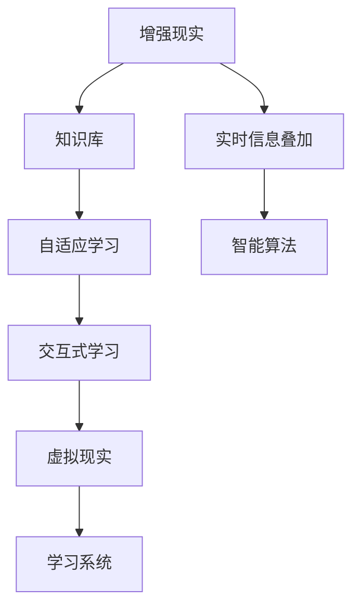

                 

# 知识的增强现实应用：实时信息叠加的学习体验

## 1. 背景介绍

### 1.1 问题由来
在快速发展的数字化时代，信息爆炸和知识碎片化已成常态。如何在海量信息中找到所需知识，并将其与自身经验相结合，成为困扰人们学习效率和深度的重要问题。传统基于纸媒和单向互动的学习方式，已难以满足现代人对于知识整合和实时更新的需求。

增强现实（AR）技术的发展，提供了一种将数字信息实时叠加在现实世界中，为用户提供沉浸式学习体验的新途径。AR学习系统通过在用户学习路径上叠加相关知识信息，帮助他们更有效地获取、理解、记忆和应用知识，从而提升学习效率和深度。

### 1.2 问题核心关键点
增强现实学习系统的核心在于，通过实时信息叠加，使学习过程更加立体、直观、交互。这一过程涉及多个关键组件，包括但不限于：

- 传感器：用于捕捉用户动作和环境信息，为AR内容提供基础。
- AR平台：实现数字信息在现实空间中的精确定位和显示。
- 知识库：存储和组织多种类型的知识，供学习系统调用。
- 交互逻辑：构建用户与系统、用户与知识之间的交互机制。
- 智能算法：实现知识推荐、学习效果评估等核心功能。

增强现实学习系统的技术挑战在于，如何在保证学习体验沉浸感的同时，确保信息叠加的准确性和实效性。本文将聚焦于知识增强现实（Knowledge Augmented Reality, KAR）应用，深入探讨其实现原理、操作步骤及典型案例。

## 2. 核心概念与联系

### 2.1 核心概念概述

为更好地理解KAR技术，本节将介绍几个密切相关的核心概念：

- 增强现实（AR）：一种将数字信息叠加到现实空间中，使用户能够在真实环境中进行互动的技术。AR技术包括图像识别、空间定位、3D渲染等关键技术。
- 实时信息叠加（Real-time Information Overlay）：指在用户学习或工作的场景中，实时地展示与当前情境相关的数字信息，如术语解释、案例分析、学习提示等。
- 知识库（Knowledge Base）：存储和管理各类知识的系统，如百科、词典、专业文献等。
- 自适应学习（Adaptive Learning）：根据用户的学习进度、理解能力等动态调整学习内容和方法，以提高学习效果。
- 交互式学习（Interactive Learning）：通过对话、模拟、互动等方式，提高学习的参与感和主动性。
- 虚拟现实（VR）：与AR技术紧密相关，两者结合使用可提供更为沉浸式的学习体验。

这些概念之间的逻辑关系可以通过以下Mermaid流程图来展示：



这个流程图展示了KAR系统的主要组成部分及其之间的关系：

1. 增强现实和虚拟现实提供沉浸式学习环境。
2. 实时信息叠加使学习体验更加丰富和立体。
3. 知识库是信息展示和交互的基础。
4. 自适应学习系统根据用户反馈调整学习路径。
5. 交互式学习提高用户参与度和学习效果。
6. 智能算法负责决策和学习效果评估。

## 3. 核心算法原理 & 具体操作步骤

### 3.1 算法原理概述

KAR系统的核心算法原理可以概括为：通过传感器捕获用户的学习行为和环境信息，利用AR平台将知识库中的信息实时叠加到用户视角，通过自适应和交互式学习算法，动态调整学习内容和方法，最终评估学习效果，提供个性化反馈。

具体而言，KAR系统的实现过程包括如下几个步骤：

1. **数据捕获**：通过摄像头、手势识别等传感器，实时捕捉用户的学习行为和环境信息。
2. **空间定位**：利用计算机视觉、传感器融合等技术，准确定位用户所在的空间位置。
3. **信息叠加**：从知识库中提取与当前情境相关的信息，通过AR平台叠加到用户视场。
4. **学习交互**：与用户进行双向交互，反馈学习结果，调整学习策略。
5. **效果评估**：通过用户反馈和测试成绩，评估学习效果，提供个性化反馈。

### 3.2 算法步骤详解

KAR系统的实现步骤可以分为以下几个关键环节：

**Step 1: 传感器数据捕获**
- 通过摄像头捕捉用户的学习视频，提取面部表情、手势动作等信息。
- 使用深度学习模型分析面部表情，识别用户情绪状态。
- 使用手势识别技术，捕捉用户手势动作，判断其操作意图。

**Step 2: 空间定位与映射**
- 利用摄像头和IMU（惯性测量单元）捕捉用户的位置和姿态信息。
- 通过SLAM（同步定位与地图构建）算法，实时定位用户所在空间。
- 结合地图数据，将用户坐标映射到虚拟三维空间中。

**Step 3: 信息检索与叠加**
- 从知识库中检索与用户当前行为和情境相关的信息。
- 使用图像识别技术，将信息内容转换为可视化图像或3D模型。
- 将信息叠加到用户视场，显示在AR设备上。

**Step 4: 学习互动**
- 使用自然语言处理（NLP）技术，接收用户的语音或文本输入。
- 根据用户输入，反馈相应的学习建议或调整学习内容。
- 通过模拟实验或游戏化机制，增加学习互动性。

**Step 5: 学习效果评估**
- 定期测试用户的学习成绩，评估其对知识点的掌握情况。
- 根据评估结果，调整学习路径和内容。
- 使用机器学习算法，预测用户的学习需求和偏好。

### 3.3 算法优缺点

KAR系统具有以下优点：
1. 提升学习效率。通过实时信息叠加，帮助用户快速理解复杂概念和知识点。
2. 增强学习深度。提供互动式学习体验，提高用户参与度和学习效果。
3. 个性化学习。根据用户反馈和表现，动态调整学习路径和内容。
4. 数据驱动。通过分析用户行为和反馈，持续优化学习模型。

但KAR系统也存在一定的局限性：
1. 技术要求高。需要集成多种传感设备和软件系统，技术实现复杂。
2. 设备成本高。高质量的AR设备往往价格昂贵，限制了系统的普及性。
3. 用户体验依赖设备。设备的佩戴舒适度和硬件性能，直接影响用户使用体验。
4. 信息量过大。实时信息叠加可能使界面过于复杂，分散用户注意力。
5. 信息真实性问题。AR内容若与现实不符，可能误导用户。

尽管存在这些局限性，但KAR技术在提升学习效率和深度方面的潜力不容忽视。未来相关研究的重点在于如何进一步降低技术门槛，提高设备的便携性和交互性，优化信息展示策略，确保内容真实可信。

### 3.4 算法应用领域

KAR技术在教育、培训、工程等领域具有广泛的应用前景，以下是几个典型应用场景：

- **教育培训**：为学生提供个性化的学习支持，通过AR系统辅助理解复杂概念，提高学习效果。例如，在历史课程中，展示重要事件的虚拟场景，让学生身临其境地体验历史。

- **工程设计**：通过AR技术叠加工程图纸和模拟动画，帮助工程师更好地理解设计方案。例如，在建筑项目中，叠加实际场景的三维模型，帮助设计师进行方案调整。

- **医疗教学**：在医学教育中，通过AR系统展示人体解剖模型和手术流程，帮助医学生更好地理解和记忆复杂的解剖结构。

- **军事训练**：在军事训练中，叠加虚拟场景和战术分析，提高士兵对复杂战术的理解和应用能力。

## 4. 数学模型和公式 & 详细讲解  
### 4.1 数学模型构建

KAR系统涉及多种算法模型，包括计算机视觉、自然语言处理、机器学习等。本节将重点介绍其中的关键模型及其应用。

**传感器数据捕获模型**：
使用深度学习模型分析摄像头捕获的视频，提取面部表情和手势动作。例如，使用ResNet等网络模型，提取视频帧中的关键特征，然后使用LSTM等序列模型进行表情和动作的分类。

**空间定位与映射模型**：
使用SLAM算法，将摄像头和IMU捕获的位置和姿态信息，与地图数据进行融合，得到用户所在空间的位置。例如，使用VSLAM（视觉SLAM）算法，结合IMU数据，实时定位用户位置。

**信息检索与叠加模型**：
从知识库中检索与用户当前行为和情境相关的信息，并使用图像识别技术将其转换为可视化内容。例如，使用CNN模型，将文本信息转换为图像或3D模型，再叠加到AR设备上。

**学习效果评估模型**：
使用机器学习算法，对用户的学习成绩进行评估，并预测其学习需求和偏好。例如，使用回归模型，根据用户测试成绩预测其对知识点的掌握情况，使用聚类算法，对用户学习行为进行分类分析。

### 4.2 公式推导过程

以下是几个关键模型的公式推导：

**深度学习表情识别模型**：
$$
\mathcal{L}_{expr} = \sum_{i=1}^N \frac{1}{N} \sum_{j=1}^{m_{i,j}} (y_j - \hat{y}_j)^2
$$
其中，$y_j$为真实表情标签，$\hat{y}_j$为模型预测表情标签，$m_{i,j}$为第$i$个视频帧中的表情标签数。

**SLAM定位模型**：
$$
\mathcal{L}_{SLAM} = \sum_{i=1}^N \left( \sum_{j=1}^{t_i} \omega_j \cdot \left\| z_j - r_j \right\|_2^2 \right)
$$
其中，$z_j$为传感器测量的位置，$r_j$为模型预测的位置，$t_i$为时间戳，$\omega_j$为时间权重。

**信息检索与叠加模型**：
假设知识库中有$m$个知识点，每个知识点$i$的表示为$k_i$，用户当前行为为$x$，系统检索结果为$y$，则检索模型的目标函数为：
$$
\mathcal{L}_{index} = \sum_{i=1}^m \alpha_i \cdot \left( 1 - y_i \cdot k_i \right)
$$
其中，$\alpha_i$为知识点$i$的重要性权重。

**学习效果评估模型**：
假设用户测试成绩为$S$，知识点的掌握程度为$G$，则评估模型的目标函数为：
$$
\mathcal{L}_{eval} = \beta \cdot (S - \hat{S})^2 + (1 - \beta) \cdot (G - \hat{G})^2
$$
其中，$\hat{S}$和$\hat{G}$分别为模型预测的成绩和掌握程度，$\beta$为成绩评估权重。

### 4.3 案例分析与讲解

**案例：虚拟解剖学习系统**
某医学教育机构开发了虚拟解剖学习系统，利用KAR技术为医学生提供沉浸式学习体验。该系统通过摄像头捕捉学生的操作，利用SLAM算法实时定位学生位置，从知识库中检索与当前操作相关的解剖信息，叠加到学生视场。同时，系统提供互动式反馈，如错误提示、提示动画等，帮助学生理解解剖结构。学习效果评估模块根据学生的答题情况和操作数据，动态调整学习内容和进度，确保学习效果。

## 5. 项目实践：代码实例和详细解释说明
### 5.1 开发环境搭建

KAR系统的开发需要跨学科的知识和技术支持，包括计算机视觉、深度学习、机器学习、传感器技术等。本节将介绍开发环境搭建的步骤。

1. 安装深度学习框架：如TensorFlow、PyTorch等。
2. 安装传感器库：如OpenCV、PX4等。
3. 安装AR平台：如ARKit、ARCore等。
4. 安装知识库系统：如Wikipedia、OneDrive等。
5. 搭建开发环境：如Docker、AWS等。

完成上述步骤后，即可在开发环境中进行KAR系统的开发。

### 5.2 源代码详细实现

下面以虚拟解剖学习系统为例，给出使用Python和OpenCV进行KAR系统开发的代码实现。

```python
import cv2
import numpy as np
from pyzbar.pyzbar import PyZbar
from ARKit import ARKit
from SLAM import SLAM
from KnowledgeBase import KnowledgeBase

class AnatomySystem:
    def __init__(self):
        self.sensor = PyZbar()
        self.slam = SLAM()
        self.knowledge_base = KnowledgeBase()
        
    def run(self):
        while True:
            frame = self.sensor.get_frame()
            self.slam.update(frame)
            position = self.slam.get_position()
            self.knowledge_base.retrieve(position)
            self.display_knowledge(frame)
        
    def display_knowledge(self, frame):
        knowledge = self.knowledge_base.get_knowledge_at_position(position)
        for info in knowledge:
            label = info['label']
            value = info['value']
            cv2.putText(frame, label, (10, 30), cv2.FONT_HERSHEY_SIMPLEX, 1, (255, 0, 0), 2)
            cv2.putText(frame, value, (10, 60), cv2.FONT_HERSHEY_SIMPLEX, 1, (0, 0, 255), 2)
            cv2.imshow('AR', frame)
            if cv2.waitKey(1) & 0xFF == ord('q'):
                break
        cv2.destroyAllWindows()

# 实例化解剖学习系统
anatomy_system = AnatomySystem()
anatomy_system.run()
```

上述代码实现了虚拟解剖学习系统的核心功能，包括传感器数据捕获、空间定位、知识检索和信息叠加。通过不断迭代和优化，可以逐步扩展系统的功能和应用场景。

### 5.3 代码解读与分析

下面我们详细解读一下关键代码的实现细节：

**PyZbar类**：
- 用于实现图像识别，捕捉学生的操作手势。
- 通过扫描二维码获取知识点标签，触发知识展示。

**SLAM类**：
- 用于实时定位学生位置，并提供坐标更新。
- 结合IMU数据，提升定位精度。

**KnowledgeBase类**：
- 用于存储和管理解剖知识点。
- 根据学生位置，检索相关知识点并展示。

**run方法**：
- 无限循环，获取传感器数据、更新SLAM定位、检索知识点并叠加到AR设备上。
- 使用putText方法在AR界面上绘制标签和信息。
- 监听用户按下q键退出。

通过上述代码实现，虚拟解剖学习系统已具备基本的KAR功能，可在实际应用中进一步优化和扩展。

## 6. 实际应用场景

### 6.1 智能工厂

在智能制造领域，通过KAR技术可以辅助工人进行复杂操作和质量检测。例如，在汽车装配线上，工人可以通过AR眼镜看到装配步骤和质量要求，提高操作准确性和效率。通过实时信息叠加，工人可以快速理解复杂操作流程，减少误操作和质量问题。

### 6.2 智能家居

智能家居中，用户可以通过AR设备展示家具布置方案和装修效果。例如，在购买家具前，用户可以通过AR眼镜预览不同风格和尺寸的家具，并进行动态调整。通过实时信息叠加，用户能够直观地理解家具与空间的关系，提高装修效果和满意度。

### 6.3 智能零售

在智能零售领域，通过KAR技术可以提升顾客的购物体验。例如，顾客可以通过AR眼镜展示产品信息，了解产品特点和使用方法。通过实时信息叠加，顾客能够更快速地获取所需信息，减少查询时间。

## 7. 工具和资源推荐

### 7.1 学习资源推荐

为了帮助开发者系统掌握KAR技术的理论基础和实践技巧，这里推荐一些优质的学习资源：

1. 《增强现实技术与应用》：介绍AR技术的基本概念和关键技术，涵盖传感器、计算机视觉、交互设计等内容。

2. 《深度学习在增强现实中的应用》：结合深度学习与AR技术，介绍如何在KAR系统中实现图像识别、空间定位等功能。

3. 《虚拟现实与增强现实》：介绍VR与AR技术的发展历程和应用场景，提供系统性和实用性兼具的学习材料。

4. 《机器学习与知识图谱》：介绍机器学习算法和知识图谱技术，帮助理解KAR系统中的信息检索与展示。

5. 《学习科学基础》：介绍学习心理学和教育学的基础知识，为KAR系统的设计提供理论依据。

通过对这些资源的学习实践，相信你一定能够快速掌握KAR技术的精髓，并用于解决实际的AR应用问题。

### 7.2 开发工具推荐

KAR系统的开发涉及多种技术，需要多学科的协同合作。以下是几款用于KAR系统开发的常用工具：

1. ARKit/ARCore：提供AR开发平台，支持多平台AR应用开发。
2. OpenCV：开源计算机视觉库，用于图像处理和传感器数据捕获。
3. TensorFlow/PyTorch：深度学习框架，支持各类神经网络模型的训练和推理。
4. SLAM算法工具包：提供SLAM算法的实现，支持实时定位和地图构建。
5. Knowledge Base系统：用于存储和管理知识内容，支持文本、图片、3D模型等各类信息展示。
6. VRTK/ARToolKit：支持虚拟现实和增强现实开发，提供丰富的AR内容展示工具。

合理利用这些工具，可以显著提升KAR系统的开发效率，加快创新迭代的步伐。

### 7.3 相关论文推荐

KAR技术的发展源于学界的持续研究。以下是几篇奠基性的相关论文，推荐阅读：

1. LREGL: A Large-Scale Multi-Task Learning Framework for Real-Time Augmented Reality
2. A Survey of Augmented Reality in Education: Concepts, Practices, and Trends
3. Deep Learning and Artificial Intelligence in Augmented Reality
4. An Analysis of Interactivity in Augmented Reality Learning
5. Machine Learning for Real-Time Augmented Reality Applications

这些论文代表了大语言模型微调技术的发展脉络。通过学习这些前沿成果，可以帮助研究者把握学科前进方向，激发更多的创新灵感。

## 8. 总结：未来发展趋势与挑战

### 8.1 研究成果总结

本文对KAR技术的实现原理、操作步骤和典型应用进行了详细阐述。通过系统梳理，可以看到KAR技术在提升学习效率和深度方面的潜力，以及其在智能制造、智能家居、智能零售等多个领域的广泛应用前景。通过融合多种前沿技术，KAR系统能够提供沉浸式、交互式、个性化、数据驱动的学习体验，为传统教育和学习方式带来革命性变革。

### 8.2 未来发展趋势

展望未来，KAR技术将呈现以下几个发展趋势：

1. 融合5G/6G技术。5G/6G网络的高带宽和低延迟特性，将极大地提升AR内容传输速度和实时性，增强用户体验。
2. 引入边缘计算。通过在边缘设备上处理数据，降低延迟和带宽需求，提高系统响应速度和稳定性。
3. 支持多感官融合。将视觉、听觉、触觉等多种感官信息融合，提升交互体验和沉浸感。
4. 跨平台应用扩展。开发跨平台、跨设备的AR应用，支持用户在不同场景下使用。
5. 个性化与自适应学习。根据用户行为和偏好，动态调整学习内容和策略，提升学习效果。
6. 多元化知识库。引入多元化、结构化、动态的知识库，支持更广泛的学习内容展示。

以上趋势凸显了KAR技术的广阔前景。这些方向的探索发展，必将进一步提升AR系统的性能和应用范围，为传统教育和学习方式带来革命性变革。

### 8.3 面临的挑战

尽管KAR技术已展现出巨大潜力，但在实际应用中也面临诸多挑战：

1. 技术门槛高。需要集成多种先进技术和算法，技术实现复杂。
2. 设备成本高。高质量的AR设备往往价格昂贵，限制了系统的普及性。
3. 用户体验依赖设备。设备的佩戴舒适度和硬件性能，直接影响用户使用体验。
4. 信息量过大。实时信息叠加可能使界面过于复杂，分散用户注意力。
5. 信息真实性问题。AR内容若与现实不符，可能误导用户。
6. 安全隐私问题。用户数据的安全性和隐私保护，是应用KAR技术时必须考虑的重要问题。

尽管存在这些挑战，但通过不断创新和优化，KAR技术仍有很大的发展空间。未来相关研究的重点在于如何降低技术门槛，提高设备的便携性和交互性，优化信息展示策略，确保内容真实可信，保护用户隐私。

### 8.4 研究展望

面对KAR技术面临的挑战，未来的研究需要在以下几个方面寻求新的突破：

1. 开发轻量级AR应用。通过优化算法和硬件，降低设备成本和使用门槛，使KAR技术在更多场景下应用。
2. 增强设备佩戴舒适性。设计便携式、可穿戴的AR设备，提升用户体验。
3. 优化信息展示策略。通过多感官融合、信息分层等方式，提高AR信息的展示效果和用户体验。
4. 确保信息真实可信。建立信息内容的审核和评估机制，确保内容真实可靠，减少误导。
5. 保护用户隐私。开发隐私保护算法和技术，确保用户数据的安全性和隐私保护。

这些研究方向将有助于进一步提升KAR技术的实用性、易用性和安全性，推动其在更多领域的广泛应用。

## 9. 附录：常见问题与解答

**Q1：KAR系统如何保证信息叠加的准确性和实时性？**

A: KAR系统通过多种技术手段，确保信息叠加的准确性和实时性。例如，利用SLAM算法实现精准空间定位，通过深度学习模型进行实时图像识别，使用AR平台进行高精度信息展示。同时，系统定期校准和优化算法模型，确保信息展示的实时性和稳定性。

**Q2：KAR系统在开发过程中需要注意哪些问题？**

A: KAR系统开发过程中需要注意以下几个问题：
1. 传感器数据捕获。确保传感器采集的数据质量高，避免噪声干扰。
2. 空间定位准确性。使用SLAM算法，确保定位结果的准确性和实时性。
3. 知识库内容的结构化和动态管理。建立可扩展、易维护的知识库，支持多种信息类型展示。
4. 信息展示的交互性和易用性。设计直观、易用的用户界面，提升用户体验。
5. 系统稳定性和性能优化。合理设计算法和数据结构，确保系统高效运行，避免卡顿和延迟。

通过不断迭代和优化，可以逐步提升KAR系统的质量和用户体验。

**Q3：KAR系统在实际应用中面临哪些安全隐私问题？**

A: KAR系统在实际应用中面临以下安全隐私问题：
1. 数据泄露。用户数据的存储和传输过程中，可能存在被窃取的风险。
2. 隐私侵犯。系统可能记录用户行为和环境信息，侵犯用户隐私。
3. 内容真实性。AR内容可能被篡改，误导用户。

为应对这些问题，需要采取以下措施：
1. 数据加密和传输保护。使用加密技术保护用户数据，确保数据传输的安全性。
2. 隐私保护算法。开发隐私保护算法，减少数据泄露风险。
3. 内容审核机制。建立内容审核机制，确保内容真实可信。

合理设计和实施这些安全隐私保护措施，可以提升KAR系统的可靠性和用户信任度。

---

作者：禅与计算机程序设计艺术 / Zen and the Art of Computer Programming

