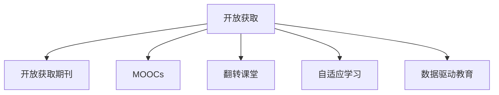

                 

# 知识的开放获取：民主化教育的新模式

## 1. 背景介绍

### 1.1 问题由来

21世纪以来，全球信息技术的飞速发展极大地改变了人们获取和传播知识的方式。传统的教育体系基于教室、教科书和教师的传道授业，信息交流往往受到时间、空间和资源的限制。而互联网的普及和Web2.0技术的兴起，使得知识的获取更加便捷、自由和个性化。在此背景下，知识的开放获取（Open Access, OA）成为一种新的教育范式，为教育民主化提供了可能。

### 1.2 问题核心关键点

开放获取的核心在于将知识资源免费、开放地供所有人使用，特别是在学术领域，这一理念通过开放获取期刊（Open Access Journals, OAJs）得以体现。OA期刊不收读者订阅费用，而是通过作者的支付费用（文章处理费, Article Processing Charges, APC）维持运营，实现了知识和信息的快速流通。在教育领域，知识的开放获取同样带来了深刻的变革。

**1.2.1 自由获取**
开放获取为学习者提供了自由获取知识的机会，不受地域、时间、机构限制，极大提升了学习的便捷性。

**1.2.2 自主学习**
OA教育资源丰富多样，涵盖了从基础教育到高等教育的广泛领域。学习者可以根据自己的兴趣和需求，自主选择学习内容，自由组合学习路径。

**1.2.3 平等获取**
开放获取的教育资源可供所有群体使用，无论是城市还是农村、发达还是欠发达地区，都能享受到同等质量的教育资源，缩小了教育公平的差距。

### 1.3 问题研究意义

知识的开放获取作为民主化教育的新模式，对教育领域产生了深远的影响：

1. **促进教育公平**：打破知识获取的壁垒，为所有人提供平等的教育机会，缩小城乡、区域之间的教育差距。
2. **提升教育质量**：丰富的教育资源和个性化的学习路径，使学习者能够获取到最适合自己的知识和技能，提高学习效率。
3. **激发创新教育**：开放获取的教育资源不仅包含传统的知识，还包括了新兴学科、交叉学科的内容，激发了创新教育和终身学习的理念。
4. **推动教育信息化**：技术的支撑使得知识获取更加便捷、高效，推动了教育信息化的发展。
5. **促进全球教育交流**：开放获取的教育资源有助于全球教育资源的交流与合作，促进各国教育的相互学习和借鉴。

## 2. 核心概念与联系

### 2.1 核心概念概述

为了更好地理解知识的开放获取及其在教育领域的应用，本节将介绍几个密切相关的核心概念：

- **开放获取（Open Access, OA）**：指将知识资源免费、开放地供所有人使用，打破了传统出版的垄断，使得知识得以广泛传播。

- **开放获取期刊（Open Access Journals, OAJs）**：不收读者订阅费用，通过作者的支付费用（APC）维持运营，成为知识获取的重要平台。

- **MOOCs（Massive Open Online Courses）**：大规模开放在线课程，将优质教育资源通过网络公开，提供给全球的学习者。

- **翻转课堂（Flipped Classroom）**：以学生自主学习为主，课堂上以互动讨论和实践应用为主的新型教学模式。

- **自适应学习（Adaptive Learning）**：根据学习者的知识水平、学习习惯等个性化因素，动态调整学习内容和路径，提升学习效果。

- **数据驱动教育（Data-Driven Education）**：通过分析学习者的行为数据，优化教育内容和教学方法，实现个性化教育。

这些核心概念之间的逻辑关系可以通过以下Mermaid流程图来展示：



这个流程图展示了大语言模型的核心概念及其之间的关系：

1. 开放获取为MOOCs、翻转课堂等新型教学模式提供了知识基础。
2. MOOCs和翻转课堂应用了开放获取的理念，将教育资源开放共享。
3. 自适应学习和数据驱动教育进一步细化开放获取的教育模式，提升学习效果。

## 3. 核心算法原理 & 具体操作步骤
### 3.1 算法原理概述

知识的开放获取基于自由获取和共享的理念，其核心在于构建一个开放的、合作的、互惠的知识共享平台，使得知识资源可以被广泛传播和利用。开放获取的教育实践主要包括以下几个方面：

- **资源开放**：将知识资源开放给所有用户，免费使用，不受限制。
- **用户合作**：鼓励用户参与知识的贡献和创新，实现知识的共同发展。
- **互惠共享**：在开放获取平台上，知识资源的使用与贡献是互惠互利的。

### 3.2 算法步骤详解

知识开放获取的教育实践一般包括以下几个关键步骤：

**Step 1: 构建知识共享平台**
- 选择一个开放获取的平台或自建的OA系统，作为知识共享的基础。
- 设定清晰的资源开放策略，明确哪些资源可以自由获取和使用。

**Step 2: 收集和整理教育资源**
- 从学术界、教育机构、出版商等渠道收集高质量的教育资源，如学术论文、教科书、课程视频等。
- 对资源进行整理和标注，使之易于搜索和使用。

**Step 3: 设计教育路径和学习计划**
- 根据学习者的不同需求，设计多样化的学习路径，包括基础课程、进阶课程、实践项目等。
- 制定个性化的学习计划，结合学习者的知识背景和兴趣，推荐合适的学习内容。

**Step 4: 实施开放获取的教育模式**
- 将开放获取的教育资源提供给学习者，支持自由获取和自主学习。
- 通过翻转课堂、MOOCs等新型教学模式，提升学习效果。

**Step 5: 持续改进和优化**
- 根据学习者的反馈和行为数据，持续改进和优化教育资源和教学方法。
- 定期更新教育资源，保持其时效性和先进性。

### 3.3 算法优缺点

知识的开放获取在教育领域带来了诸多好处，但也存在一些局限性：

**优点：**
1. **自由获取**：打破了知识获取的地域、时间和机构限制，使得任何人都可以自由获取教育资源。
2. **自主学习**：学习者可以根据自己的兴趣和需求，自主选择学习内容，自由组合学习路径。
3. **平等获取**：所有群体都能享受到同等质量的教育资源，缩小了教育公平的差距。
4. **促进创新**：开放获取的教育资源激发了创新教育和终身学习的理念。
5. **提高效率**：自主学习和翻转课堂等新型教学模式提升了学习效果，减少了时间和资源的浪费。

**缺点：**
1. **质量参差不齐**：开放获取的教育资源良莠不齐，需要学习者具备一定的甄别能力。
2. **学习者自律性要求高**：自主学习需要学习者具备高度的自律性和自我管理能力。
3. **缺乏教师指导**：开放获取的教育模式减少了教师的直接指导，学习者可能需要更多自驱力。
4. **资源整合困难**：开放获取的教育资源来自不同来源，缺乏统一的整合和管理。

### 3.4 算法应用领域

知识的开放获取在教育领域的应用范围非常广泛，包括但不限于以下几个方面：

- **基础教育**：开放获取的教科书、视频、习题等资源，为学生提供了自主学习的可能。
- **高等教育**：开放获取的学术论文、课程视频、实验数据等资源，支持研究生和教师的科研工作。
- **职业培训**：开放获取的培训课程、技能认证、职业指导等资源，支持职场人士的终身学习。
- **在线教育**：MOOCs、翻转课堂等新型教学模式，支持全球范围内的在线学习。

此外，开放获取的教育模式还广泛应用于社区教育、企业培训、远程教育等领域，为不同背景和需求的学习者提供了平等获取教育资源的机会。

## 4. 数学模型和公式 & 详细讲解 & 举例说明

### 4.1 数学模型构建

知识的开放获取模型可以从多个维度进行建模，其中最基础的模型是用户-资源匹配模型（User-Resource Matching Model, URMM）。该模型通过资源描述（如关键词、摘要、评价等）和用户特征（如兴趣、背景、学习历史等）进行匹配，推荐最适合用户的教育资源。

设教育资源的集合为 $R$，用户的学习需求集合为 $U$。资源 $r \in R$ 和用户 $u \in U$ 之间的关系可以用函数 $f(u,r)$ 表示。资源 $r$ 的属性可以用向量 $\mathbf{a}_r \in \mathbb{R}^n$ 描述，用户 $u$ 的属性可以用向量 $\mathbf{b}_u \in \mathbb{R}^m$ 描述。则用户 $u$ 对资源 $r$ 的兴趣度 $w(u,r)$ 可以通过加权向量点积计算得到：

$$
w(u,r) = f(u,r) \cdot (\mathbf{a}_r \cdot \mathbf{b}_u)
$$

其中 $f(u,r)$ 可以是用户对资源的评分、用户的历史行为数据等。

### 4.2 公式推导过程

用户-资源匹配模型的核心在于计算用户对资源的兴趣度。假设用户 $u$ 对资源 $r$ 的兴趣度为 $w(u,r)$，则推荐资源集合 $R'$ 中的资源 $r' \in R'$ 作为推荐资源。设推荐函数为 $g(u,R')$，则推荐资源的计算公式为：

$$
g(u,R') = \arg\max_{r' \in R'} w(u,r')
$$

进一步地，可以通过加权向量点积和排序算法实现推荐。具体步骤为：
1. 计算用户对所有资源的兴趣度 $w(u,r)$。
2. 对所有兴趣度进行排序，取前 $k$ 个作为推荐资源。

### 4.3 案例分析与讲解

**案例：开放获取平台上的MOOC推荐**

一个开放获取平台通过用户-资源匹配模型为MOOCs推荐合适的课程。平台收集了用户的历史行为数据和课程的评价信息，构建了用户-资源匹配模型。用户在平台上浏览课程页面时，系统根据用户的行为数据和课程评价信息计算用户对课程的兴趣度，并推荐相关课程。

假设用户 $u$ 浏览了一门MOOC课程，其行为数据为 $b_u$，课程 $r$ 的评价信息为 $a_r$。用户对课程的兴趣度 $w(u,r)$ 可以通过加权向量点积计算得到：

$$
w(u,r) = \mathbf{b}_u \cdot \mathbf{a}_r
$$

系统根据用户的行为数据和课程的评价信息，计算用户对课程的兴趣度，并从所有MOOC课程中选取前5门推荐给用户。假设计算得到的兴趣度如下：

| 用户 $u$ | 课程 $r$ | 兴趣度 $w(u,r)$ |
| --- | --- | --- |
| $u_1$ | 课程 $r_1$ | 0.8 |
| $u_1$ | 课程 $r_2$ | 0.7 |
| $u_2$ | 课程 $r_1$ | 0.6 |
| $u_2$ | 课程 $r_3$ | 0.9 |
| $u_2$ | 课程 $r_4$ | 0.5 |
| $u_3$ | 课程 $r_2$ | 0.9 |
| $u_3$ | 课程 $r_3$ | 0.8 |
| $u_3$ | 课程 $r_5$ | 0.7 |

系统根据兴趣度从高到低排序，选取前5门课程推荐给用户。

## 5. 项目实践：代码实例和详细解释说明
### 5.1 开发环境搭建

在进行开放获取教育资源的开发实践前，我们需要准备好开发环境。以下是使用Python进行PyTorch开发的环境配置流程：

1. 安装Anaconda：从官网下载并安装Anaconda，用于创建独立的Python环境。

2. 创建并激活虚拟环境：
```bash
conda create -n pytorch-env python=3.8 
conda activate pytorch-env
```

3. 安装PyTorch：根据CUDA版本，从官网获取对应的安装命令。例如：
```bash
conda install pytorch torchvision torchaudio cudatoolkit=11.1 -c pytorch -c conda-forge
```

4. 安装TensorFlow：
```bash
pip install tensorflow==2.7
```

5. 安装各类工具包：
```bash
pip install numpy pandas scikit-learn matplotlib tqdm jupyter notebook ipython
```

完成上述步骤后，即可在`pytorch-env`环境中开始开发实践。

### 5.2 源代码详细实现

下面我们以开放获取平台的MOOC推荐系统为例，给出使用PyTorch的代码实现。

首先，定义用户和课程的数据处理函数：

```python
import torch
from torch.utils.data import Dataset
from sklearn.metrics.pairwise import cosine_similarity

class UserCourseDataset(Dataset):
    def __init__(self, user_data, course_data, similarity='cosine'):
        self.user_data = user_data
        self.course_data = course_data
        self.similarity = similarity
        
    def __len__(self):
        return len(self.user_data)
    
    def __getitem__(self, index):
        user = self.user_data[index]
        course = self.course_data[index]
        if self.similarity == 'cosine':
            similarity = cosine_similarity(user, course)
        elif self.similarity == 'euclidean':
            similarity = (user - course)**2
        return similarity
```

然后，定义推荐模型的实现：

```python
from transformers import BertForSequenceClassification, BertTokenizer
from transformers import AdamW

class RecommendationModel:
    def __init__(self, pretrained_model_path):
        self.model = BertForSequenceClassification.from_pretrained(pretrained_model_path, num_labels=2)
        self.tokenizer = BertTokenizer.from_pretrained(pretrained_model_path)
        self similarity = torch.zeros(len(self.user_data))
        
    def predict(self, user_data, course_data):
        self.similarity = []
        for user, course in zip(user_data, course_data):
            encoding = self.tokenizer(user, course, return_tensors='pt', padding='max_length', truncation=True)
            input_ids = encoding['input_ids']
            attention_mask = encoding['attention_mask']
            outputs = self.model(input_ids, attention_mask=attention_mask)
            similarity = outputs.logits.mean()
            self.similarity.append(similarity)
        return self.similarity
```

接着，定义推荐算法实现：

```python
from sklearn.metrics.pairwise import cosine_similarity

def recommend_courses(user_data, course_data, similarity='cosine', top_k=5):
    recommender = RecommendationModel(pretrained_model_path)
    similarity = recommender.predict(user_data, course_data)
    top_n = similarity.argsort()[-top_k:]
    courses = [course_data[i] for i in top_n]
    return courses
```

最后，启动推荐系统：

```python
# 数据准备
user_data = ['user1', 'user2', 'user3']
course_data = ['course1', 'course2', 'course3']

# 推荐课程
courses = recommend_courses(user_data, course_data)
print(courses)
```

以上就是使用PyTorch对开放获取平台的MOOC推荐系统的代码实现。可以看到，通过PyTorch的封装和调用，我们可以高效地实现资源推荐模型。

### 5.3 代码解读与分析

让我们再详细解读一下关键代码的实现细节：

**UserCourseDataset类**：
- `__init__`方法：初始化用户和课程数据，以及相似度计算方法。
- `__len__`方法：返回数据集的样本数量。
- `__getitem__`方法：对单个样本进行处理，计算用户和课程的相似度。

**RecommendationModel类**：
- `__init__`方法：初始化推荐模型和分词器，加载预训练模型和分词器。
- `predict`方法：根据用户和课程的文本数据，计算相似度。

**recommend_courses函数**：
- 定义推荐算法实现，接受用户和课程数据，计算相似度，返回推荐课程。

在实际开发中，还可以进一步扩展，引入更多相似度计算方法，如余弦相似度、欧几里得距离等，并根据具体场景选择不同的推荐策略，如基于协同过滤、基于内容的推荐等。

## 6. 实际应用场景
### 6.1 智慧校园

开放获取的教育资源可以为智慧校园的建设提供坚实的基础。智慧校园通过物联网、大数据、云计算等技术，构建了一个智能化的校园生态系统，实现了校园管理的自动化、智能化、个性化。

**智能图书馆**：开放获取的图书资源和图书馆管理系统可以支持学生的自主学习和研究。图书馆机器人、自助借还机等设备，可以大大提升图书馆的服务效率和用户体验。

**智能教室**：开放获取的课程资源和学习管理系统可以支持翻转课堂、MOOCs等新型教学模式，提升课堂教学的互动性和参与度。智能白板、AR/VR设备等技术，可以提供更丰富的学习体验。

**智能评估**：开放获取的评价工具和数据分析平台，可以支持学生的自我评估和教师的教学评估，提升教学质量和效果。

### 6.2 企业培训

企业培训是知识开放获取的重要应用领域之一。开放的在线培训课程和知识库，可以支持企业员工的终身学习和职业发展。

**在线学习平台**：开放的在线课程和学习平台，可以支持员工的自主学习和在线培训，提升职业素养和技能水平。

**知识管理**：开放获取的企业知识库和文档管理系统，可以支持员工的知识共享和协同工作，提升企业的知识管理水平和创新能力。

**在线测评**：开放获取的在线测评工具和数据分析平台，可以支持员工的自我评估和培训效果评估，提升培训的针对性和有效性。

### 6.3 远程教育

远程教育是开放获取教育的典型应用场景。通过网络，学习者可以随时随地获取到优质的教育资源，享受到平等的教育机会。

**MOOCs平台**：开放的MOOCs平台可以支持全球范围内的远程学习，提供丰富的课程资源和互动工具，提升远程教育的教学效果。

**翻转课堂**：翻转课堂可以通过开放获取的教育资源，提升远程教育的学习效果，支持学生的自主学习和个性化学习。

**在线社区**：开放的在线社区和讨论平台，可以支持学生之间的交流和互动，提升学习效果和参与度。

### 6.4 未来应用展望

随着开放获取教育资源的不断丰富和技术的不断发展，未来的开放获取教育模式将呈现以下几个发展趋势：

1. **智能化和自动化**：未来的开放获取教育将更加智能化和自动化，通过AI和大数据技术，实现更加个性化的学习推荐和评估。
2. **移动化和泛在化**：移动设备和泛在网络的普及，将使得开放获取的教育资源更加便携和灵活，支持随时随地的学习和交流。
3. **全球化和本地化**：开放获取的教育资源将更加全球化和本地化，支持不同语言和文化背景的学习者，提供更加多样化的学习内容。
4. **跨界融合**：开放获取的教育模式将与其他技术如区块链、物联网、虚拟现实等进行跨界融合，提升教育资源的共享和利用效率。
5. **可持续化和绿色化**：开放获取的教育模式将更加可持续化和绿色化，支持低碳、环保的教育方式，减少资源浪费和环境污染。

## 7. 工具和资源推荐
### 7.1 学习资源推荐

为了帮助开发者系统掌握知识的开放获取的理论基础和实践技巧，这里推荐一些优质的学习资源：

1. **《开放获取教育与资源管理》**：介绍开放获取教育的概念、发展历程、优势和挑战，提供实用的开放获取教育资源管理和应用案例。

2. **《大规模在线开放课程MOOCs》**：详细讲解MOOCs的原理、技术实现和应用场景，探讨MOOCs对教育的影响和未来发展趋势。

3. **《翻转课堂：课堂教学的革命》**：介绍翻转课堂的理念、教学方法和应用实践，探讨翻转课堂对传统教育模式的变革作用。

4. **《自适应学习技术》**：详细讲解自适应学习技术的基本原理、算法实现和应用案例，探讨自适应学习对个性化教育的推动作用。

5. **《数据驱动教育：大数据在教育中的应用》**：介绍大数据在教育中的应用场景和关键技术，探讨大数据对教育效果的提升作用。

通过对这些资源的学习实践，相信你一定能够快速掌握知识的开放获取的理论基础和实践技巧，并用于解决实际的NLP问题。

### 7.2 开发工具推荐

高效的开发离不开优秀的工具支持。以下是几款用于开放获取教育资源开发的常用工具：

1. **PyTorch**：基于Python的开源深度学习框架，灵活动态的计算图，适合快速迭代研究。

2. **TensorFlow**：由Google主导开发的开源深度学习框架，生产部署方便，适合大规模工程应用。

3. **PyTorch Lightning**：基于PyTorch的轻量级深度学习框架，支持快速构建和训练深度学习模型。

4. **Kaggle**：全球知名的数据科学竞赛平台，提供丰富的数据集和竞赛机会，支持数据驱动的教育创新。

5. **Jupyter Notebook**：开源的交互式编程环境，支持多种编程语言和数据格式，适合实验研究和数据分析。

6. **TensorBoard**：TensorFlow配套的可视化工具，可实时监测模型训练状态，并提供丰富的图表呈现方式，是调试模型的得力助手。

合理利用这些工具，可以显著提升开放获取教育资源的开发效率，加快创新迭代的步伐。

### 7.3 相关论文推荐

知识的开放获取作为教育领域的研究热点，吸引了众多学者的关注。以下是几篇奠基性的相关论文，推荐阅读：

1. **《开放获取期刊与开放获取运动》**：介绍开放获取期刊的发展历程、优势和挑战，探讨开放获取对学术出版的影响。

2. **《大规模在线开放课程MOOCs的成功要素》**：分析MOOCs的成功要素，探讨MOOCs对教育变革的推动作用。

3. **《自适应学习系统综述》**：综述自适应学习系统的研究进展，探讨自适应学习对个性化教育的推动作用。

4. **《数据驱动教育的理论与实践》**：介绍数据驱动教育的理论和实践，探讨大数据在教育中的应用。

这些论文代表了大语言模型微调技术的发展脉络。通过学习这些前沿成果，可以帮助研究者把握学科前进方向，激发更多的创新灵感。

## 8. 总结：未来发展趋势与挑战

### 8.1 总结

本文对知识的开放获取及其在教育领域的应用进行了全面系统的介绍。首先阐述了开放获取的理念和优势，明确了开放获取在教育民主化中的重要地位。其次，从原理到实践，详细讲解了开放获取教育模式的实现过程，给出了开放获取平台上的MOOC推荐系统的代码实例。同时，本文还探讨了开放获取教育模式在智慧校园、企业培训、远程教育等领域的广泛应用前景，展示了开放获取教育的广阔前景。

通过本文的系统梳理，可以看到，知识的开放获取作为民主化教育的新模式，对教育领域产生了深远的影响。未来的开放获取教育模式将在智能化、自动化、移动化、全球化和跨界融合等方面不断演进，进一步提升教育的质量和公平性，促进教育的信息化和个性化。

### 8.2 未来发展趋势

知识的开放获取作为民主化教育的新模式，将呈现以下几个发展趋势：

1. **智能化和自动化**：未来的开放获取教育将更加智能化和自动化，通过AI和大数据技术，实现更加个性化的学习推荐和评估。

2. **移动化和泛在化**：移动设备和泛在网络的普及，将使得开放获取的教育资源更加便携和灵活，支持随时随地的学习和交流。

3. **全球化和本地化**：开放获取的教育资源将更加全球化和本地化，支持不同语言和文化背景的学习者，提供更加多样化的学习内容。

4. **跨界融合**：开放获取的教育模式将与其他技术如区块链、物联网、虚拟现实等进行跨界融合，提升教育资源的共享和利用效率。

5. **可持续化和绿色化**：开放获取的教育模式将更加可持续化和绿色化，支持低碳、环保的教育方式，减少资源浪费和环境污染。

以上趋势凸显了知识的开放获取在教育领域的发展潜力和应用前景。这些方向的探索发展，必将进一步提升开放获取教育的质量和效果，为教育信息化和个性化提供新的技术路径。

### 8.3 面临的挑战

尽管知识的开放获取在教育领域带来了诸多好处，但在迈向更加智能化、普适化应用的过程中，它仍面临着诸多挑战：

1. **资源质量参差不齐**：开放获取的教育资源质量参差不齐，需要学习者具备一定的甄别能力。

2. **学习者自律性要求高**：自主学习需要学习者具备高度的自律性和自我管理能力。

3. **缺乏教师指导**：开放获取的教育模式减少了教师的直接指导，学习者可能需要更多自驱力。

4. **资源整合困难**：开放获取的教育资源来自不同来源，缺乏统一的整合和管理。

5. **数据隐私和安全**：开放获取的教育资源需要收集大量的学习者数据，存在数据隐私和安全风险。

6. **技术和基础设施支持不足**：开放获取的教育模式需要强大的技术支持和基础设施，但部分地区可能存在不足。

正视开放获取教育面临的这些挑战，积极应对并寻求突破，将是大语言模型微调走向成熟的必由之路。相信随着学界和产业界的共同努力，这些挑战终将一一被克服，开放获取教育模式必将在构建人机协同的智能时代中扮演越来越重要的角色。

### 8.4 研究展望

面对开放获取教育面临的挑战，未来的研究需要在以下几个方面寻求新的突破：

1. **知识资源的多样化和高质量化**：通过联合教育机构、学术界、企业和非营利组织，构建多样化和高质量的知识资源库，提升开放获取教育资源的质量。

2. **智能推荐和学习路径设计**：引入AI和大数据技术，实现更加智能化的资源推荐和学习路径设计，提升开放获取教育的效果。

3. **个性化学习平台的开发**：开发个性化的开放获取教育平台，支持学生自主学习和个性化学习，提升学习体验和效果。

4. **数据隐私和安全的保护**：建立健全数据隐私和安全保护机制，保障学习者的数据安全，增强开放获取教育的信任度。

5. **跨领域跨学科的融合**：推动开放获取教育与信息技术、教育技术、人工智能等领域的融合，提升开放获取教育的创新性和应用价值。

这些研究方向的探索，必将引领开放获取教育模式迈向更高的台阶，为构建安全、可靠、可解释、可控的智能系统铺平道路。面向未来，开放获取教育模式还需要与其他人工智能技术进行更深入的融合，如知识表示、因果推理、强化学习等，多路径协同发力，共同推动开放获取教育的进步。只有勇于创新、敢于突破，才能不断拓展开放获取教育模式的边界，让开放获取教育更好地造福人类社会。

## 9. 附录：常见问题与解答

**Q1：开放获取教育资源的质量如何保证？**

A: 开放获取教育资源的质量参差不齐，需要通过多方协作和严格审核，确保资源的高质量。具体措施包括：
1. **学术审查**：由学术界专家对资源进行审查和评估，确保资源的专业性和权威性。
2. **社区评价**：通过学习者的评价和反馈，筛选出高质量的资源，提升资源的质量和可信度。
3. **机构认证**：由知名教育机构和学术机构认证的资源，更具可信度和权威性。

**Q2：开放获取教育资源的学习效果如何评估？**

A: 开放获取教育资源的学习效果评估可以从以下几个方面进行：
1. **自适应学习评估**：通过学习者的行为数据和评估结果，动态调整学习路径和内容，提升学习效果。
2. **在线测评工具**：使用在线测评工具和数据分析平台，评估学习者的知识掌握情况和技能水平。
3. **反馈与改进**：通过学习者的反馈和意见，不断改进和优化开放获取教育资源和教学方法，提升学习效果。

**Q3：开放获取教育资源的学习者自律性如何保障？**

A: 开放获取教育资源的学习者自律性保障可以通过以下几个措施：
1. **自主学习平台**：构建自主学习平台，提供丰富的学习资源和互动工具，支持学习者的自主学习。
2. **学习计划和目标**：设计个性化的学习计划和目标，明确学习者的学习任务和时间安排，提升学习效率。
3. **激励机制**：通过积分、徽章、证书等激励机制，鼓励学习者积极参与学习，提升学习效果。

**Q4：开放获取教育资源的数据隐私和安全如何保障？**

A: 开放获取教育资源的数据隐私和安全保障可以通过以下几个措施：
1. **数据加密**：对学习者的数据进行加密处理，防止数据泄露和未经授权的访问。
2. **访问控制**：设置严格的数据访问控制机制，确保只有授权用户可以访问和使用数据。
3. **匿名化处理**：对学习者的数据进行匿名化处理，保护学习者的隐私。
4. **安全审计**：定期进行安全审计和风险评估，及时发现和修复安全漏洞。

**Q5：开放获取教育资源的跨领域跨学科融合如何实现？**

A: 开放获取教育资源的跨领域跨学科融合可以通过以下几个途径实现：
1. **跨学科课程设计**：开发跨学科课程，涵盖多个学科的知识和技能，提升学习者的综合素质。
2. **协同学习平台**：构建协同学习平台，支持不同领域和学科的学习者进行交流和合作，促进跨学科知识的融合。
3. **跨学科项目**：设计跨学科项目和课题，促进不同学科之间的合作和创新，推动跨学科知识的应用。

这些问题的探讨，为开放获取教育资源的开发和应用提供了具体的实施方案，有助于提升开放获取教育的质量和效果。

---

作者：禅与计算机程序设计艺术 / Zen and the Art of Computer Programming

