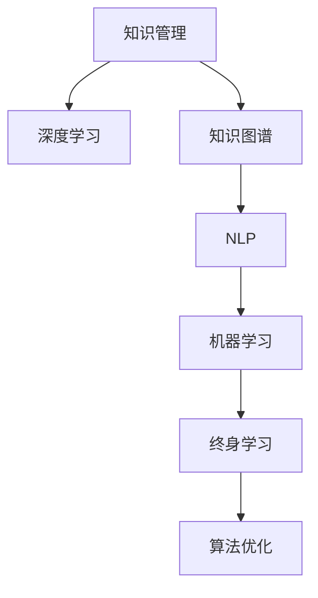

                 

# 知识的快速迭代：终身学习的必要性

> 关键词：知识管理,终身学习,知识图谱,人工智能,自然语言处理(NLP),深度学习,机器学习(ML),深度学习框架,算法优化

## 1. 背景介绍

### 1.1 问题由来
在信息爆炸的现代社会，知识与技术的更新速度之快前所未有。AI领域尤其如此，从深度学习的概念提出到如今的应用遍地开花，不过数十年间的事。而人工智能、自然语言处理(NLP)等领域的快速进步，更是离不开大量的知识储备和技能积累。

然而，随着新技术、新方法的不断涌现，人类知识体系也在不断变化，无法一劳永逸地掌握所有知识。终身学习成为了必不可少的技能。终身学习指的是在一生中不断更新和扩展知识的过程，而技术的迭代和更新，无疑也是这个过程的一部分。本文将探讨终身学习在AI领域的必要性，以及如何通过知识管理、算法优化等手段，支持知识的快速迭代和终身学习。

### 1.2 问题核心关键点
1. **知识管理的挑战**：如何在不断变化的技术和知识中，选择并掌握最前沿的知识和技能？
2. **终身学习的实现**：如何将AI领域的知识体系分为易于理解和快速掌握的部分，通过不断学习和实践，持续更新和扩展自己的知识储备？
3. **知识图谱的应用**：通过构建和利用知识图谱，如何更好地组织和检索知识，加速学习过程？
4. **深度学习框架的优化**：如何优化深度学习框架，支持快速迭代和终身学习？
5. **算法优化与创新**：如何在有限的时间内，通过算法优化和创新，最大化知识利用效率？

这些核心问题构成了本文的研究框架，旨在揭示终身学习在AI领域的重要性，并探讨如何通过技术手段支持这一过程。

## 2. 核心概念与联系

### 2.1 核心概念概述

为更好地理解终身学习和AI领域的知识管理，本节将介绍几个密切相关的核心概念：

- **知识管理(Knowledge Management, KM)**：指对组织和个人知识资源进行规划、获取、创造、存储、共享和应用的过程，以实现知识的持续更新和价值最大化。
- **终身学习(Lifelong Learning)**：指在人的整个生命周期中，不断通过学习新的知识和技能，适应环境变化的过程。
- **知识图谱(Knowledge Graph)**：通过将实体、属性和关系等结构化信息，构建出知识网络图谱，便于知识检索、分析和推理。
- **深度学习(Deep Learning)**：基于神经网络结构，通过多层次的特征提取和处理，实现复杂模式和关系的自动学习。
- **自然语言处理(Natural Language Processing, NLP)**：使用计算机技术处理和理解人类语言，实现信息的自动获取、理解、翻译等。
- **机器学习(Machine Learning, ML)**：通过数据驱动的方法，训练模型自动进行模式识别和决策。

这些核心概念之间的逻辑关系可以通过以下Mermaid流程图来展示：



这个流程图展示了知识管理、深度学习、知识图谱、NLP、机器学习和终身学习之间的关系：

1. 知识管理为深度学习和机器学习提供了知识基础。
2. 深度学习通过多层次的特征提取和处理，帮助机器学习模型学习复杂的模式。
3. 知识图谱通过结构化的方式组织和检索知识，支持NLP和机器学习。
4. NLP使得机器能够理解和生成自然语言，支持知识管理与知识图谱构建。
5. 机器学习通过学习数据和知识，提高预测和决策能力。
6. 终身学习通过不断学习和应用新知识，保持知识体系的更新和扩展。

这些概念共同构成了AI领域的知识生态，其相互作用和迭代，推动了AI技术的快速发展。

## 3. 核心算法原理 & 具体操作步骤

### 3.1 算法原理概述

在AI领域，终身学习尤为重要。这不仅意味着不断更新知识，还意味着持续优化和改进现有的算法和技术。本文将介绍一种典型的终身学习算法——增量学习(Incremental Learning)，其核心思想是通过不断吸收新数据和新知识，更新模型参数，实现知识的快速迭代。

增量学习的基本流程如下：

1. **数据收集**：不断收集新数据和新知识，确保知识体系的时效性和全面性。
2. **模型初始化**：使用已有数据和新数据训练初始模型。
3. **参数更新**：通过增量更新模型参数，适应新数据和新知识的变化。
4. **性能评估**：定期评估模型性能，确保知识更新后的效果。

增量学习的关键在于如何高效地更新模型参数，避免重复计算和资源浪费。以下将详细介绍增量学习的具体步骤和实现方法。

### 3.2 算法步骤详解

#### 3.2.1 数据预处理

增量学习的第一步是数据预处理，将新数据和旧数据进行整合和清洗。

1. **数据格式统一**：将不同来源和格式的数据转换成统一的格式，方便模型处理。
2. **数据清洗**：去除噪声和冗余数据，确保数据质量和一致性。
3. **数据划分**：将数据划分为训练集、验证集和测试集，以评估模型效果。

#### 3.2.2 模型初始化

初始化模型的目的是提供一个良好的起点，避免模型从零开始学习，浪费时间和资源。

1. **使用预训练模型**：利用已有的预训练模型作为初始模型，节省训练时间。
2. **参数调整**：根据新数据的特点，调整模型参数，使其更加适应新任务。

#### 3.2.3 参数更新

参数更新是增量学习的核心步骤，其目标是不断更新模型参数，以适应新数据的到来。

1. **在线学习算法**：使用在线学习算法（如AdaGrad、SGD等）实时更新模型参数，避免一次性处理大量数据。
2. **增量更新策略**：根据新数据的到达顺序，逐批更新模型参数，确保模型能够及时适应新知识。

#### 3.2.4 性能评估

性能评估是增量学习的重要环节，确保模型在不断更新中保持稳定和可靠。

1. **指标定义**：定义适当的评估指标，如准确率、召回率、F1分数等，评估模型效果。
2. **定期测试**：定期在测试集上测试模型，确保新知识的吸收效果。
3. **调整策略**：根据评估结果，调整更新策略，优化模型性能。

### 3.3 算法优缺点

增量学习具有以下优点：

1. **高效性**：通过增量更新模型参数，避免了一次性处理大量数据的资源浪费。
2. **及时性**：能够及时吸收新数据和新知识，保持模型时效性。
3. **可扩展性**：适用于不断增长和变化的数据集，支持终身学习。

同时，增量学习也存在一些缺点：

1. **内存占用**：需要保留旧数据和新数据，导致内存占用较大。
2. **参数退化**：长时间累积的噪声和偏差可能影响模型效果。
3. **更新策略复杂**：选择合适的增量更新策略，需要结合具体问题和数据特点。

### 3.4 算法应用领域

增量学习在AI领域有广泛的应用，如：

1. **推荐系统**：通过用户行为数据的不断累积，实时更新推荐模型，提高推荐效果。
2. **金融预测**：金融市场数据实时变化，使用增量学习实时更新预测模型，提高预测准确性。
3. **医疗诊断**：医疗数据不断更新，通过增量学习实时更新诊断模型，提高诊断效率。
4. **自然语言处理(NLP)**：通过不断累积新文本数据，实时更新语言模型，提升文本理解和生成能力。
5. **计算机视觉**：使用增量学习实时更新图像识别模型，提高识别精度和鲁棒性。

## 4. 数学模型和公式 & 详细讲解 & 举例说明

### 4.1 数学模型构建

增量学习的数学模型可以通过在线学习算法进行构建，以优化模型参数。以AdaGrad算法为例，其基本流程如下：

1. **学习率更新**：根据梯度平方和（G²）更新学习率。
2. **参数更新**：根据更新后的学习率和梯度，更新模型参数。

增量学习模型的形式化描述如下：

$$
\theta_{t+1} = \theta_t - \eta_t \nabla_{\theta_t} \mathcal{L}(\theta_t;D_t)
$$

其中：
- $\theta_t$ 为第$t$步的模型参数。
- $\eta_t$ 为第$t$步的学习率。
- $\nabla_{\theta_t} \mathcal{L}(\theta_t;D_t)$ 为第$t$步的梯度。
- $D_t$ 为前$t$步的训练数据。

### 4.2 公式推导过程

以AdaGrad算法为例，其学习率更新公式为：

$$
\eta_t = \frac{\eta_0}{\sqrt{G_t} + \epsilon}
$$

其中：
- $\eta_0$ 为初始学习率。
- $G_t$ 为累积梯度平方和。
- $\epsilon$ 为避免除零的小数。

参数更新公式为：

$$
\theta_{t+1} = \theta_t - \eta_t \nabla_{\theta_t} \mathcal{L}(\theta_t;D_t)
$$

### 4.3 案例分析与讲解

假设我们有一个文本分类任务，初始模型为BERT，使用AdaGrad算法进行增量学习。

1. **数据预处理**：将新文本数据转换成统一格式，去除噪声和冗余。
2. **模型初始化**：使用已有数据训练初始BERT模型，调整参数以适应新任务。
3. **增量更新**：每次收到新文本数据，使用AdaGrad算法更新BERT模型参数，适应新数据。
4. **性能评估**：定期在测试集上测试模型，确保模型效果。

## 5. 项目实践：代码实例和详细解释说明

### 5.1 开发环境搭建

在进行增量学习实践前，我们需要准备好开发环境。以下是使用Python进行PyTorch开发的环境配置流程：

1. 安装Anaconda：从官网下载并安装Anaconda，用于创建独立的Python环境。
2. 创建并激活虚拟环境：
```bash
conda create -n pytorch-env python=3.8 
conda activate pytorch-env
```

3. 安装PyTorch：根据CUDA版本，从官网获取对应的安装命令。例如：
```bash
conda install pytorch torchvision torchaudio cudatoolkit=11.1 -c pytorch -c conda-forge
```

4. 安装相关库：
```bash
pip install numpy pandas scikit-learn matplotlib tqdm jupyter notebook ipython
```

完成上述步骤后，即可在`pytorch-env`环境中开始增量学习实践。

### 5.2 源代码详细实现

下面我们以文本分类任务为例，给出使用AdaGrad算法对BERT模型进行增量学习的PyTorch代码实现。

```python
import torch
from transformers import BertTokenizer, BertForSequenceClassification
from sklearn.model_selection import train_test_split
from sklearn.metrics import accuracy_score

# 数据预处理
def load_data(file):
    with open(file, 'r', encoding='utf-8') as f:
        data = f.readlines()
    return data

# 构建模型
tokenizer = BertTokenizer.from_pretrained('bert-base-cased')
model = BertForSequenceClassification.from_pretrained('bert-base-cased', num_labels=2)

# 训练数据加载
train_data = load_data('train.txt')
test_data = load_data('test.txt')

# 数据预处理
train_texts, train_labels = [], []
for line in train_data:
    text, label = line.strip().split('\t')
    train_texts.append(text)
    train_labels.append(int(label))

# 划分训练集和验证集
train_texts, val_texts, train_labels, val_labels = train_test_split(train_texts, train_labels, test_size=0.2)

# 增量学习
optimizer = torch.optim.Adagrad(model.parameters(), lr=0.001)
best_accuracy = 0

for epoch in range(100):
    # 前向传播
    for i in range(len(train_texts)):
        inputs = tokenizer(train_texts[i], padding='max_length', max_length=128, truncation=True, return_tensors='pt')
        outputs = model(**inputs)
        loss = outputs.loss
        logits = outputs.logits

        # 反向传播
        optimizer.zero_grad()
        loss.backward()
        optimizer.step()

    # 验证集评估
    val_loss = []
    val_correct = []
    for i in range(len(val_texts)):
        inputs = tokenizer(val_texts[i], padding='max_length', max_length=128, truncation=True, return_tensors='pt')
        outputs = model(**inputs)
        val_loss.append(outputs.loss.item())
        val_logits = outputs.logits
        val_predictions = torch.argmax(val_logits, dim=1)
        val_correct.append(accuracy_score(val_labels[i], val_predictions[i]))

    # 输出结果
    print(f'Epoch {epoch+1}, validation accuracy: {accuracy_score(val_labels, val_predictions)}')
    if accuracy_score(val_labels, val_predictions) > best_accuracy:
        best_accuracy = accuracy_score(val_labels, val_predictions)
        best_model = model

# 测试集评估
test_texts, test_labels = [], []
for line in test_data:
    text, label = line.strip().split('\t')
    test_texts.append(text)
    test_labels.append(int(label))

for i in range(len(test_texts)):
    inputs = tokenizer(test_texts[i], padding='max_length', max_length=128, truncation=True, return_tensors='pt')
    outputs = best_model(**inputs)
    test_logits = outputs.logits
    test_predictions = torch.argmax(test_logits, dim=1)
    print(f'Test accuracy: {accuracy_score(test_labels[i], test_predictions[i])}')
```

在代码中，我们使用AdaGrad算法对BERT模型进行增量学习。每次收到新文本数据，模型参数被更新，以适应新数据。训练过程中，我们使用验证集定期评估模型性能，并在测试集上进行最终评估。

### 5.3 代码解读与分析

让我们再详细解读一下关键代码的实现细节：

- **数据加载与预处理**：通过自定义的`load_data`函数，加载并预处理数据。
- **模型构建**：使用`BertForSequenceClassification`模型，准备文本分类任务。
- **数据划分**：将数据划分为训练集和验证集，以确保模型在不断更新的过程中，能够进行有效的评估。
- **增量学习**：使用AdaGrad算法对模型参数进行增量更新，适应新数据。
- **性能评估**：在验证集上评估模型性能，调整学习策略，确保模型效果。

## 6. 实际应用场景

### 6.1 金融数据处理

金融市场数据是不断变化的，使用增量学习实时更新金融预测模型，能够提高预测准确性，增强金融决策的可靠性。例如，通过增量学习，实时更新股票价格预测模型，能够更好地应对市场波动，减少投资风险。

### 6.2 医疗影像分析

医疗影像数据是动态变化的，增量学习可以实时更新影像分析模型，提高诊断效率和精度。例如，通过增量学习，实时更新X光片分析模型，能够快速检测出病变区域，辅助医生进行诊断。

### 6.3 推荐系统优化

推荐系统需要不断吸收新用户行为数据，使用增量学习实时更新推荐模型，能够提高推荐效果，增强用户体验。例如，通过增量学习，实时更新个性化推荐模型，能够推荐用户更感兴趣的物品，提升推荐系统的智能性。

### 6.4 未来应用展望

随着技术的不断发展，增量学习将有更广泛的应用前景：

1. **自动驾驶**：自动驾驶系统需要不断吸收新环境数据，使用增量学习实时更新模型，提高驾驶安全性。
2. **智能家居**：智能家居设备需要不断吸收用户行为数据，使用增量学习实时更新系统模型，提高用户体验。
3. **物联网**：物联网设备需要不断吸收新数据，使用增量学习实时更新模型，提高数据处理和分析效率。

增量学习将使AI技术在更多领域中发挥重要作用，提升系统智能性和响应速度。

## 7. 工具和资源推荐

### 7.1 学习资源推荐

为了帮助开发者系统掌握增量学习理论和实践，这里推荐一些优质的学习资源：

1. 《在线学习与增量学习》系列博文：由在线学习领域的专家撰写，详细介绍增量学习的原理、算法和应用。
2 《深度学习理论与实践》课程：由斯坦福大学开设的深度学习课程，涵盖增量学习的理论基础和实际应用。
3 《增量学习算法与应用》书籍：全面介绍增量学习算法及其应用，适合深入研究和实践。
4 《Transformers》库的官方文档：Transformers库支持增量学习，提供丰富的样例代码和详细说明。
5 《Keras》增量学习教程：Keras深度学习框架提供了增量学习的实现，适合初学者快速上手。

通过对这些资源的学习实践，相信你一定能够快速掌握增量学习的基本原理和实践方法，并用于解决实际问题。

### 7.2 开发工具推荐

高效的开发离不开优秀的工具支持。以下是几款用于增量学习开发的常用工具：

1. PyTorch：基于Python的开源深度学习框架，灵活动态的计算图，适合快速迭代研究。
2. TensorFlow：由Google主导开发的开源深度学习框架，生产部署方便，适合大规模工程应用。
3. Transformers库：HuggingFace开发的NLP工具库，集成了多个SOTA模型，支持增量学习。
4. Weights & Biases：模型训练的实验跟踪工具，可以记录和可视化模型训练过程中的各项指标，方便对比和调优。
5. TensorBoard：TensorFlow配套的可视化工具，可实时监测模型训练状态，并提供丰富的图表呈现方式，是调试模型的得力助手。

合理利用这些工具，可以显著提升增量学习的开发效率，加快创新迭代的步伐。

### 7.3 相关论文推荐

增量学习的发展离不开学界的持续研究。以下是几篇奠基性的相关论文，推荐阅读：

1. Incremental Learning: A Survey and Taxonomy: 该论文对增量学习算法进行了全面的综述，详细介绍了不同算法的特点和应用场景。
2. Incremental Learning with Linear Models: 提出线性模型增量学习算法，应用于回归和分类任务，取得较好的效果。
3. On Incremental Learning: An Empirical Evaluation: 通过实验评估增量学习算法的效果，提出改进策略，增强模型适应性。
4. Incremental Neural Network Learning: 提出增量神经网络学习算法，应用于图像识别任务，提高模型稳定性和鲁棒性。
5. Incremental Multiclass Learning: 提出增量多分类学习算法，应用于文本分类任务，提升分类精度和效率。

这些论文代表了几十年来增量学习的研究进展，通过学习这些前沿成果，可以帮助研究者把握学科前进方向，激发更多的创新灵感。

## 8. 总结：未来发展趋势与挑战

### 8.1 总结

本文对增量学习的核心概念、算法原理和操作步骤进行了全面系统的介绍。首先阐述了增量学习在AI领域的必要性，明确了增量学习在知识更新和算法优化中的重要地位。其次，从原理到实践，详细讲解了增量学习的数学模型和关键步骤，给出了增量学习任务开发的完整代码实例。同时，本文还广泛探讨了增量学习在金融、医疗、推荐等领域的实际应用前景，展示了增量学习范式的巨大潜力。

通过本文的系统梳理，可以看到，增量学习是AI领域实现终身学习、支持知识快速迭代的重要手段。其高效性、及时性和可扩展性，使得增量学习在各领域中具有广泛的应用前景。未来，伴随深度学习框架和算法技术的不断进步，增量学习必将在更多领域中发挥重要作用，推动AI技术的进一步发展。

### 8.2 未来发展趋势

展望未来，增量学习将呈现以下几个发展趋势：

1. **算法多样化**：除了传统的在线学习算法，未来将涌现更多高效的增量学习算法，如增量GAN、增量强化学习等，应用于更复杂和多样化的任务。
2. **跨领域应用**：增量学习将在更多领域中得到应用，如自动驾驶、医疗诊断、金融预测等，提升系统智能化和实时性。
3. **分布式学习**：增量学习与分布式系统结合，实现多节点并行更新，提高模型更新效率和系统鲁棒性。
4. **自适应学习**：增量学习算法将更加自适应，能够根据数据特点和任务需求，动态调整更新策略，提高学习效果。
5. **联邦学习**：增量学习与联邦学习结合，实现不同节点之间的数据交换和模型更新，提高数据隐私保护和模型协作性。

以上趋势凸显了增量学习技术的广阔前景。这些方向的探索发展，将进一步提升增量学习的效果和应用范围，为AI技术的持续创新提供新的动力。

### 8.3 面临的挑战

尽管增量学习技术已经取得了瞩目成就，但在迈向更加智能化、普适化应用的过程中，它仍面临着诸多挑战：

1. **数据质量问题**：增量学习对数据质量要求较高，数据噪声和偏差可能影响模型效果。
2. **模型更新复杂**：选择合适的增量更新策略，需要结合具体问题和数据特点，增加了模型更新复杂度。
3. **资源消耗**：增量学习需要保存旧数据和新数据，导致内存占用较大，增加系统资源消耗。
4. **算法鲁棒性不足**：增量学习算法在处理异常数据时，容易出现性能波动和鲁棒性不足的问题。

### 8.4 研究展望

面对增量学习所面临的这些挑战，未来的研究需要在以下几个方面寻求新的突破：

1. **数据清洗和预处理**：提出高效的数据清洗和预处理算法，去除噪声和冗余数据，提高数据质量。
2. **增量学习算法优化**：开发更加高效的增量学习算法，适应不同领域和任务需求，增强模型更新效果。
3. **分布式系统优化**：优化增量学习与分布式系统的结合，提高模型更新效率和系统鲁棒性。
4. **联邦学习结合**：将增量学习与联邦学习结合，实现数据隐私保护和模型协作，提升系统安全性。
5. **模型自适应**：开发自适应的增量学习算法，根据数据特点和任务需求，动态调整更新策略，提高学习效果。

这些研究方向的探索，必将引领增量学习技术迈向更高的台阶，为AI技术的持续创新提供新的动力。

## 9. 附录：常见问题与解答

**Q1: 增量学习如何应对数据质量问题？**

A: 增量学习对数据质量要求较高，可以通过以下方法应对数据质量问题：
1. 数据清洗：去除噪声和冗余数据，确保数据质量和一致性。
2. 异常检测：使用异常检测算法，识别并剔除异常数据。
3. 数据增强：通过数据增强技术，丰富训练集多样性，减少数据偏差影响。

**Q2: 增量学习如何选择合适的更新策略？**

A: 增量学习需要根据具体问题和数据特点，选择合适的增量更新策略。常用的增量学习算法包括在线梯度下降、AdaGrad、Adam等。不同的算法适用于不同的数据分布和模型结构，需要根据实际情况进行选择。

**Q3: 增量学习如何提高模型更新效率？**

A: 增量学习可以通过以下方法提高模型更新效率：
1. 分布式学习：使用分布式系统进行增量学习，提高模型更新效率和系统鲁棒性。
2. 增量更新策略：选择合适的增量更新策略，如在线梯度下降、Adam等，提高模型更新效果。
3. 模型压缩：使用模型压缩技术，减小模型参数量，提高模型更新效率。

**Q4: 增量学习如何增强模型鲁棒性？**

A: 增量学习可以通过以下方法增强模型鲁棒性：
1. 数据增强：通过数据增强技术，丰富训练集多样性，增强模型鲁棒性。
2. 对抗训练：使用对抗样本训练模型，提高模型鲁棒性和泛化能力。
3. 参数剪枝：使用参数剪枝技术，减少模型复杂度，增强模型鲁棒性。

**Q5: 增量学习如何在分布式系统中应用？**

A: 增量学习与分布式系统结合，可以实现多节点并行更新，提高模型更新效率和系统鲁棒性。常用的分布式增量学习算法包括 federated learning、Mogi 等，可以应用于不同节点之间的数据交换和模型更新，提高系统性能。

通过这些问题的回答，可以更好地理解增量学习的原理和应用，为解决实际问题提供指导。

