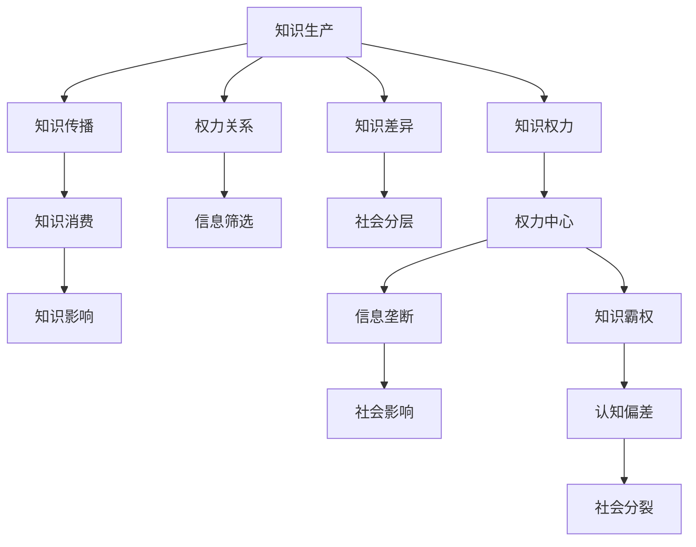

                 

# 知识的政治性：权力与信息的关系

在信息时代，知识的获取、传播、应用已经成为了社会运转的核心动力。然而，知识并非中立的，其背后潜藏着深刻的政治性。这种政治性不仅体现在知识生产、流通的权力关系上，更影响着信息的筛选、解读与利用。本文将深入探讨知识政治性的内涵，剖析权力与信息的关系，并展望未来知识政治性在技术实践中的应用。

## 1. 背景介绍

### 1.1 问题由来

随着信息技术的迅猛发展，知识的形态和获取方式发生了根本性的变革。互联网和大数据技术的普及，使得知识的传播和共享变得前所未有的便利，但也引发了一系列新的挑战。其中，知识政治性是一个不可忽视的重要问题。

知识政治性涉及两个核心方面：

1. **知识生产的权力关系**：在知识生产过程中，谁拥有资源、技术、资金等关键要素，谁就有话语权和控制力。

2. **知识流通的权力关系**：谁能够决定哪些知识被传播、哪些被屏蔽，谁就掌握了社会信息流动的控制权。

这种权力关系在现代社会中表现得尤为明显。例如，社交媒体平台作为信息流动的枢纽，可以决定哪些内容能够被算法推送给用户，从而影响着公众的认知和观点。

### 1.2 问题核心关键点

- **知识与权力的交互**：知识是权力的来源，而权力又决定着知识的流通和利用。
- **信息筛选机制**：算法、人工审核等方式决定了哪些信息可以被用户获取，影响着公共舆论和社会认知。
- **知识差异化现象**：知识获取的不平等导致社会阶层差异化，加剧了社会分裂。
- **伦理道德考量**：知识传播中的伦理道德问题，如隐私保护、假信息扩散等。

## 2. 核心概念与联系

### 2.1 核心概念概述

要理解知识政治性，首先需要明确几个关键概念：

- **知识生产**：指通过研究和探索，获取新知的过程。
- **知识传播**：指通过各种媒介将知识传播给受众。
- **知识消费**：指受众获取、理解和应用知识的过程。
- **知识权力**：指在知识生产、传播、消费过程中，某些群体或个体对知识流动的控制能力。

这些概念之间存在复杂的关系，可以通过以下Mermaid流程图来展示：



这个流程图展示了知识生产和传播过程的权力关系及其对社会的影响。

## 3. 核心算法原理 & 具体操作步骤

### 3.1 算法原理概述

知识政治性的算法原理主要围绕着两个方面：

- **知识筛选算法**：通过算法决定哪些知识被推送给用户。
- **知识传播模型**：通过模型分析知识传播的规律和趋势。

知识筛选算法通常基于用户的兴趣、行为数据进行个性化推荐。知识传播模型则通过对历史数据进行建模，预测未来知识传播的路径和影响。

### 3.2 算法步骤详解

#### 知识筛选算法

1. **用户画像构建**：根据用户的搜索历史、点击行为等数据，构建用户兴趣画像。

2. **内容标签化**：将内容进行分类和标签化，以便算法进行匹配和推荐。

3. **推荐模型训练**：使用机器学习算法（如协同过滤、深度学习等）训练推荐模型，根据用户画像和内容标签进行推荐。

4. **推荐结果排序**：根据用户的实时反馈和历史数据，对推荐结果进行排序，优化推荐效果。

#### 知识传播模型

1. **数据收集**：收集历史的知识传播数据，包括时间、地点、受众等。

2. **数据处理**：对数据进行清洗和预处理，提取特征。

3. **模型训练**：使用统计学习方法（如回归分析、时间序列分析等）训练传播模型，预测知识传播的影响因素。

4. **结果验证**：通过交叉验证等方法验证模型的准确性和稳定性。

### 3.3 算法优缺点

#### 知识筛选算法

- **优点**：
  - 能够实现个性化推荐，提升用户满意度。
  - 能够快速反应用户需求变化，实现动态调整。

- **缺点**：
  - 可能导致信息茧房效应，即用户被限制在特定的信息领域，难以接触到多样化的观点。
  - 算法可能存在偏见，加剧社会分裂。

#### 知识传播模型

- **优点**：
  - 能够预测知识传播的趋势，帮助决策者制定更好的传播策略。
  - 能够分析知识传播的社会影响，识别热点话题和趋势。

- **缺点**：
  - 模型可能存在偏差，导致错误的预测和决策。
  - 模型复杂度较高，需要大量的数据和计算资源。

### 3.4 算法应用领域

知识政治性在多个领域都有广泛应用：

- **社交媒体**：通过算法推荐和传播模型，塑造公众舆论和社会认知。
- **新闻媒体**：通过个性化推荐和内容筛选，提高阅读量和影响力。
- **教育领域**：通过知识筛选算法，推荐适合用户学习的内容，提升教育效果。
- **商业决策**：通过知识传播模型，分析市场趋势，制定营销策略。

## 4. 数学模型和公式 & 详细讲解 & 举例说明

### 4.1 数学模型构建

知识政治性涉及的数学模型主要包括以下几类：

- **协同过滤模型**：基于用户和物品之间的相似度，推荐相似物品或用户。
- **深度学习模型**：通过神经网络对用户行为和内容特征进行建模。
- **时间序列模型**：分析时间依赖性，预测知识传播的趋势。

### 4.2 公式推导过程

以协同过滤模型为例，其基本公式如下：

$$
\hat{r}_{ui} = \sum_{j \in N(u)}\frac{r_{uj} \times a_{ij}}{\sum_{k \in N(u)} r_{uk} \times a_{ik}}
$$

其中，$\hat{r}_{ui}$表示用户 $u$ 对物品 $i$ 的预测评分，$r_{uj}$ 表示用户 $u$ 对物品 $j$ 的实际评分，$a_{ij}$ 表示物品 $i$ 和物品 $j$ 的相似度，$N(u)$ 表示用户 $u$ 的邻居集。

协同过滤模型的核心在于通过用户的历史评分和物品的相似度，预测用户对新物品的评分。

### 4.3 案例分析与讲解

假设我们要为某用户推荐新闻文章。根据协同过滤模型，先找到该用户最常阅读的几篇文章，然后根据这些文章与所有文章之间的相似度，预测新文章对该用户的评分。最后，根据评分排序推荐新闻文章。

## 5. 项目实践：代码实例和详细解释说明

### 5.1 开发环境搭建

项目实践需要以下开发环境：

1. **Python 环境**：使用 Anaconda 或 Miniconda 创建虚拟环境。

2. **数据集准备**：收集用户行为数据和新闻内容数据，进行预处理。

3. **依赖库安装**：安装 scikit-learn、pandas、numpy 等常用库。

4. **模型框架搭建**：选择协同过滤模型或深度学习模型，搭建推荐系统。

### 5.2 源代码详细实现

以协同过滤模型为例，代码实现如下：

```python
import pandas as pd
from scipy.spatial.distance import cosine

# 准备数据集
df = pd.read_csv('user_behavior.csv')
df = df.dropna()

# 计算物品相似度
def similarity_matrix(df):
    sims = pd.DataFrame(columns=df['item'].unique())
    for item in df['item'].unique():
        item_df = df[df['item'] == item]
        sims[item] = item_df['user'].agg(lambda x: cosine(x, df['user'])).values
    return sims

# 协同过滤推荐
def collaborative_filtering(user, df, sims):
    similar_items = sims[sims.index == user]
    item_scores = (df[(df['item'] != user)] * similar_items.values)
    return item_scores.sum() / item_scores.sum()

# 用户行为预测
def predict(user, df, sims):
    user_scores = (df[df['user'] == user] * sims[user].values).sum()
    total_scores = sims.sum().sum()
    return user_scores / total_scores

# 输出推荐结果
user = '12345'
recommended_items = df['item'].sort_values(by=lambda x: predict(user, df, similarity_matrix(df)), ascending=False)
print(recommended_items)
```

### 5.3 代码解读与分析

上述代码实现了基于协同过滤模型的推荐系统。具体步骤如下：

1. **数据准备**：读取用户行为数据，并进行预处理，去除缺失值。

2. **相似度计算**：计算物品之间的相似度矩阵。

3. **协同过滤推荐**：根据用户的历史评分和物品相似度，计算新物品的评分。

4. **用户行为预测**：预测用户对新物品的评分，并根据评分排序推荐。

### 5.4 运行结果展示

运行上述代码，输出推荐结果，展示为用户最可能感兴趣的新闻文章列表。

## 6. 实际应用场景

### 6.1 社交媒体

社交媒体平台通过算法推荐和内容筛选，塑造公众舆论和社会认知。用户在平台上的行为数据被用来训练算法，从而影响用户的关注点和信息来源。

### 6.2 新闻媒体

新闻媒体通过个性化推荐，提升阅读量和影响力。通过内容筛选和推荐算法，媒体能够精准触达目标受众，提高用户参与度和传播效果。

### 6.3 教育领域

教育领域通过知识筛选算法，推荐适合用户学习的内容，提升教育效果。在线教育平台利用推荐系统，为学生提供个性化的学习资源，提升学习效率和满意度。

### 6.4 商业决策

商业决策通过知识传播模型，分析市场趋势，制定营销策略。通过大数据分析，企业能够识别热点话题和趋势，制定更具竞争力的营销策略。

## 7. 工具和资源推荐

### 7.1 学习资源推荐

1. **《推荐系统实战》**：深入讲解推荐系统算法和实践，涵盖协同过滤、深度学习等核心内容。

2. **《深度学习》by Ian Goodfellow**：经典深度学习教材，详细讲解深度学习算法和应用。

3. **Kaggle**：数据科学竞赛平台，提供大量推荐系统和数据科学竞赛案例，便于学习和实践。

### 7.2 开发工具推荐

1. **PyTorch**：深度学习框架，支持动态计算图，适合快速迭代研究。

2. **TensorFlow**：由 Google 主导的开源深度学习框架，生产部署方便，适合大规模工程应用。

3. **Apache Spark**：大数据处理引擎，支持分布式数据处理和机器学习。

4. **Jupyter Notebook**：交互式编程环境，便于数据分析和算法实验。

### 7.3 相关论文推荐

1. **《信息茧房：一种新形式的自由丧失》**：探讨信息茧房现象及其对社会的影响。

2. **《算法偏见：数据科学中的公平性、透明性和责任》**：分析算法偏见问题及其解决方案。

3. **《社交媒体中的信息过滤与知识传播》**：研究社交媒体中的信息过滤机制及其对社会认知的影响。

## 8. 总结：未来发展趋势与挑战

### 8.1 总结

本文对知识政治性的内涵进行了深入探讨，分析了权力与信息的关系。知识政治性不仅存在于技术层面，更深刻地影响着社会结构和文化。未来，随着技术的进步和应用，知识政治性将进一步渗透到社会的各个角落。

### 8.2 未来发展趋势

1. **自动化与智能化**：随着自动化和智能化技术的发展，知识政治性将更加隐蔽和复杂。

2. **跨领域融合**：知识政治性将与其他领域如政治、经济、文化等深度融合，产生新的应用场景。

3. **社会影响扩大**：知识政治性将进一步影响社会公共舆论和社会认知，甚至影响政治决策和经济发展。

### 8.3 面临的挑战

1. **数据隐私保护**：数据隐私和信息安全问题将更加严峻，需要建立完善的隐私保护机制。

2. **算法公平性**：算法偏见问题需要深入研究，并制定相应的公平性评估标准。

3. **技术透明性**：如何提高算法的透明度和可解释性，让用户信任和接受算法决策。

### 8.4 研究展望

未来研究需要关注以下方向：

1. **数据隐私保护技术**：开发更高效、更安全的数据隐私保护技术，保护用户隐私。

2. **算法公平性研究**：深入研究算法公平性问题，制定公平性评估指标，确保算法无偏见。

3. **算法透明性提升**：通过技术手段提高算法的透明性和可解释性，增强用户信任。

4. **跨领域应用研究**：研究知识政治性在政治、经济、文化等领域的应用，推动知识政治性的跨学科研究。

## 9. 附录：常见问题与解答

**Q1: 什么是知识政治性？**

A: 知识政治性指的是在知识生产和传播过程中，权力关系对知识的控制和影响。这种控制和影响不仅体现在知识生产环节，更深刻地影响着信息的流通和利用。

**Q2: 如何理解知识政治性的算法原理？**

A: 知识政治性的算法原理主要围绕着知识筛选和知识传播两个方面展开。通过算法决定哪些知识被推送给用户，哪些知识被传播，从而影响用户的认知和行为。

**Q3: 知识政治性对社会有哪些影响？**

A: 知识政治性对社会的影响是多方面的，包括但不限于：

- **信息茧房效应**：用户被限制在特定的信息领域，难以接触到多样化的观点。
- **社会分层加剧**：知识获取的不平等导致社会阶层差异化，加剧社会分裂。
- **假信息扩散**：算法可能存在偏见，导致错误的推荐和决策，从而传播假信息。

**Q4: 如何应对知识政治性的挑战？**

A: 应对知识政治性的挑战需要从多个方面入手：

- **数据隐私保护**：建立完善的隐私保护机制，保护用户数据安全。
- **算法公平性**：深入研究算法公平性问题，确保算法无偏见。
- **算法透明性**：提高算法的透明性和可解释性，增强用户信任。
- **跨领域应用**：研究知识政治性在政治、经济、文化等领域的应用，推动跨学科研究。

---

作者：禅与计算机程序设计艺术 / Zen and the Art of Computer Programming

