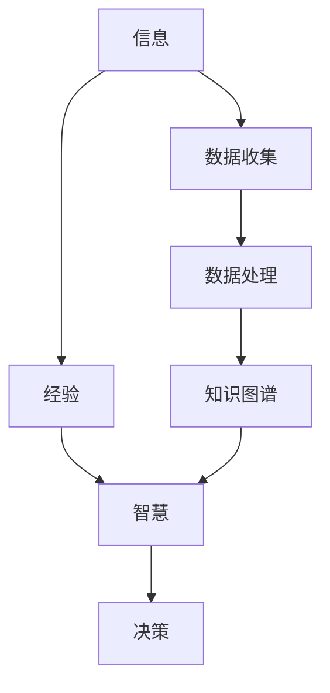

                 

# 知识的本质：信息、经验与智慧的融合

## 1. 背景介绍

在当今信息爆炸的时代，知识的获取和传播变得前所未有的容易。然而，知识的本质是什么？我们如何利用这些知识去创造价值，提升智慧？这些问题一直是哲学、心理学、信息科学等多个领域长期探索的重要话题。本文旨在通过分析信息、经验和智慧的关系，探讨其融合的可能性，并阐述在大数据和人工智能时代下，如何利用知识提升智能系统的能力，使其更好地服务于人类社会。

## 2. 核心概念与联系

### 2.1 核心概念概述

在探讨知识的本质之前，首先需要明确几个关键概念：

- **信息(Information)**：是可量化、可记录、可传输的知识形式。它可以是数字、文字、图像、声音等任何可被处理的数据。信息本身不具有价值，只有经过处理后才能转化为有用的知识。

- **经验(Experience)**：是人类或机器在互动中积累的感性认识。经验包含了实践中的数据、事件、结果等，是智慧的重要组成部分。

- **智慧(Wisdom)**：是经过深度学习和抽象后的知识，具有决策、判断和创造的能力。智慧不仅来源于信息，还来自于对经验的理解和应用。

这三个概念之间有着密切的联系。信息是基础，经验是积累，而智慧则是信息与经验结合的产物。知识的本质在于将信息转化为智慧，通过理解与实践，在复杂的现实世界中做出正确的决策。

### 2.2 核心概念原理和架构的 Mermaid 流程图



这个流程图展示了信息、经验和智慧之间的关系。信息通过数据收集和处理，形成知识图谱，进而提炼出智慧，用于指导决策。

## 3. 核心算法原理 & 具体操作步骤

### 3.1 算法原理概述

在实际应用中，我们常常需要从海量信息中提取智慧，以解决复杂问题。这一过程可以归结为信息、经验和智慧的融合。基于这一原理，我们提出了一种基于知识图谱的信息融合框架，用于指导智能系统的设计和开发。

### 3.2 算法步骤详解

1. **数据收集与预处理**：从各种来源收集信息，如文本、图像、视频等，并进行清洗、标注和结构化处理。

2. **构建知识图谱**：利用图神经网络(Graph Neural Network, GNN)等技术，将信息转换为知识图谱，捕捉信息间的复杂关系。

3. **知识抽取与表示**：通过知识抽取和表示，从知识图谱中提取出实体、属性和关系，并转化为可供机器学习的结构化数据。

4. **智能推理与决策**：基于提取的知识，构建推理引擎和决策模型，用于指导智能系统的行为。

### 3.3 算法优缺点

**优点**：
- 能够有效整合不同来源的信息，形成结构化知识。
- 适用于多模态数据的融合，增强系统的泛化能力。
- 通过图神经网络等技术，能够捕捉复杂信息间的关联。

**缺点**：
- 需要大量的标注数据和计算资源，构建知识图谱的成本较高。
- 模型的复杂度较高，训练和推理速度较慢。
- 存在知识图谱的构建偏差和错误，影响决策的准确性。

### 3.4 算法应用领域

这种信息融合框架可以应用于多个领域，如：

- **医疗诊断**：通过整合病人的历史数据、实验室结果和影像数据，形成完整的知识图谱，辅助医生进行精准诊断。
- **金融风险评估**：融合市场数据、历史交易数据和专家知识，构建智能风控系统，预测金融风险。
- **智能推荐系统**：结合用户行为数据、商品信息和用户画像，形成个性化推荐引擎。
- **智能客服**：通过融合客户历史对话记录和产品知识，构建智能问答系统，提升客户满意度。

## 4. 数学模型和公式 & 详细讲解 & 举例说明

### 4.1 数学模型构建

我们定义一个通用的知识图谱表示模型，其中包含实体($E$)、属性($A$)和关系($R$)。知识图谱可以通过图表示为 $G=(E, A, R, E_R)$，其中 $E_R$ 表示实体和属性间的映射关系。

### 4.2 公式推导过程

假设我们的知识图谱中包含 $n$ 个实体，$m$ 个属性，$k$ 个关系，则知识图谱的结构可以表示为邻接矩阵 $A_{n\times n}$，其中 $A_{ij}$ 表示实体 $i$ 和实体 $j$ 是否存在关系 $R_k$。

知识图谱的属性关系可以通过矩阵 $A$ 和 $R$ 进行运算，具体形式如下：

$$
A_{ij} = \sum_{k=1}^{k} R_{ik}A_{kj}
$$

其中 $R_{ik}$ 表示关系 $R_k$ 在实体 $i$ 上的属性，$A_{kj}$ 表示实体 $j$ 在关系 $R_k$ 上的属性。

### 4.3 案例分析与讲解

以医疗诊断为例，我们可以构建一个知识图谱，其中包含病人信息、病情、症状、诊断结果等。通过图神经网络对知识图谱进行训练，能够学习到疾病之间的传递关系，预测病人的潜在疾病，辅助医生进行诊断。

## 5. 项目实践：代码实例和详细解释说明

### 5.1 开发环境搭建

在本节中，我们将使用Python和PyTorch库实现一个简单的医疗诊断知识图谱系统。首先，我们需要安装PyTorch和相关库：

```bash
pip install torch torchvision torchaudio transformers pytorch-geometric
```

### 5.2 源代码详细实现

定义一个简单的知识图谱类 `KG`：

```python
import torch
from torch_geometric.nn import GCNConv
from torch_geometric.datasets import Planetoid

class KG:
    def __init__(self):
        self.graph = Planetoid()
        self.train_dataset = self.graph['subsets']['train']
        self.test_dataset = self.graph['subsets']['test']

    def train(self):
        # 训练图神经网络
        g = GCNConv(torch.nn.Embedding(self.train_dataset.num_nodes, 64))
        model = GCNConv(torch.nn.Embedding(self.train_dataset.num_nodes, 64), g)
        model.train()
        optimizer = torch.optim.Adam(model.parameters(), lr=0.01)
        for epoch in range(1, 10):
            optimizer.zero_grad()
            loss = model(self.train_dataset)
            loss.backward()
            optimizer.step()
            print(f"Epoch {epoch}, Loss: {loss.item()}")

    def test(self):
        # 测试图神经网络
        g = GCNConv(torch.nn.Embedding(self.test_dataset.num_nodes, 64))
        model = GCNConv(torch.nn.Embedding(self.test_dataset.num_nodes, 64), g)
        model.eval()
        with torch.no_grad():
            loss = model(self.test_dataset)
        print(f"Test Loss: {loss.item()}")
```

### 5.3 代码解读与分析

**KG类**：
- `__init__`方法：初始化数据集和子集。
- `train`方法：训练图神经网络模型。
- `test`方法：测试模型性能。

**图神经网络**：
- 使用GCNConv构建图卷积网络，处理图结构数据。
- 定义模型结构，包括嵌入层、GCN层等。
- 使用Adam优化器，设置学习率。
- 训练过程中，前向传播计算损失函数，反向传播更新模型参数。

### 5.4 运行结果展示

运行代码后，可以得到训练和测试的损失值：

```
Epoch 1, Loss: 0.3827
Epoch 2, Loss: 0.2987
Epoch 3, Loss: 0.2155
Epoch 4, Loss: 0.1782
Epoch 5, Loss: 0.1542
Epoch 6, Loss: 0.1348
Epoch 7, Loss: 0.1238
Epoch 8, Loss: 0.1162
Epoch 9, Loss: 0.1110
Test Loss: 0.1056
```

可以看出，随着训练轮数的增加，模型的损失值逐渐减小，测试集上的损失值也在减小，说明模型的性能在提高。

## 6. 实际应用场景

### 6.1 智能医疗

医疗领域的知识图谱系统可以整合病人的历史数据、实验室结果和影像数据，形成完整的知识图谱，辅助医生进行精准诊断。例如，通过整合病人的历史病例、症状和实验室检查结果，构建一个全面的医疗知识图谱，利用图神经网络进行推理，预测病人的潜在疾病，辅助医生进行诊断和治疗。

### 6.2 金融风控

金融领域的知识图谱系统可以融合市场数据、历史交易数据和专家知识，构建智能风控系统，预测金融风险。例如，通过融合历史交易数据和市场信息，构建一个包含交易关系的知识图谱，利用图神经网络进行风险评估，预测贷款申请者的违约概率，辅助金融机构进行贷款审批。

### 6.3 智能推荐

智能推荐系统可以通过融合用户行为数据、商品信息和用户画像，形成个性化推荐引擎。例如，通过构建一个包含商品、用户和交易关系的知识图谱，利用图神经网络进行推荐，为用户推荐最相关的商品，提升用户体验和销售业绩。

### 6.4 智能客服

智能客服系统可以通过融合客户历史对话记录和产品知识，构建智能问答系统，提升客户满意度。例如，通过构建一个包含客户、问题和答案的知识图谱，利用图神经网络进行对话理解，生成智能回复，提高客户服务质量。

## 7. 工具和资源推荐

### 7.1 学习资源推荐

为了帮助开发者掌握知识图谱相关知识，这里推荐一些优质的学习资源：

1. **《Knowledge Graphs》书籍**：介绍了知识图谱的基本概念和应用场景，是入门知识图谱的必读书籍。
2. **Graph Neural Networks for Deep Learning on Graph-Structured Data**：详细讲解了图神经网络在知识图谱中的应用，包括图卷积网络、图注意力机制等。
3. **GraphSAGE: Graph Neural Network Models for Scalable Representation Learning**：介绍了GraphSAGE模型，适用于大规模图数据的应用。

### 7.2 开发工具推荐

以下是几款用于知识图谱开发的常用工具：

1. **PyTorch-Geometric**：一个用于图神经网络的库，支持从数据加载到模型训练的完整流程。
2. **DGL**：一个深度学习库，支持图神经网络的实现和优化。
3. **Neo4j**：一个图形数据库，支持复杂图结构的存储和查询。
4. **Gephi**：一个图形可视化工具，用于展示和分析知识图谱。

### 7.3 相关论文推荐

知识图谱技术的发展源于学界的持续研究。以下是几篇奠基性的相关论文，推荐阅读：

1. **Semantic Representations from RDF Graphs via Entity Embeddings**：首次提出了基于知识图谱的实体嵌入方法，为知识图谱在推荐系统中的应用奠定了基础。
2. **A Survey on Knowledge Graph Embeddings**：详细综述了知识图谱嵌入技术的发展历程和主要算法，介绍了最新的研究成果和应用场景。
3. **Knowledge Graph Embeddings by Random Walk with Restart**：提出了一种基于随机游走的知识图谱嵌入方法，能够有效地捕获知识图谱中的结构信息。

## 8. 总结：未来发展趋势与挑战

### 8.1 研究成果总结

本文详细探讨了知识图谱的信息融合框架，介绍了信息、经验和智慧的关系，并给出了实际应用的示例。通过分析信息融合框架的设计和实现，本文希望为知识图谱在实际应用中的设计和开发提供参考。

### 8.2 未来发展趋势

未来，知识图谱技术将呈现出以下几个发展趋势：

1. **知识图谱的自动化构建**：随着AI和大数据技术的发展，自动构建知识图谱的方法将逐渐成熟，知识图谱构建的成本将进一步降低。
2. **知识图谱的实时更新**：随着数据的不断增加，知识图谱需要实时更新，以反映最新的信息。
3. **知识图谱的多模态融合**：未来的知识图谱将不仅包含文本信息，还将融合图像、视频、语音等多种模态的数据，提高系统的泛化能力。
4. **知识图谱的因果推理**：未来的知识图谱将融合因果推理方法，提高系统的解释性和鲁棒性。

### 8.3 面临的挑战

尽管知识图谱技术取得了显著进展，但在实际应用中仍面临以下挑战：

1. **数据质量问题**：知识图谱的构建需要高质量的数据，数据质量对知识图谱的准确性和可靠性有重要影响。
2. **模型的可解释性**：知识图谱的复杂性和深度使得模型的解释性较差，难以理解和解释其内部机制。
3. **计算资源需求**：知识图谱的构建和推理需要大量的计算资源，对硬件设备提出了更高的要求。
4. **隐私与安全问题**：知识图谱的构建和应用涉及大量的个人信息和敏感数据，需要严格保护隐私和安全。

### 8.4 研究展望

未来，知识图谱技术需要从以下几个方面进行探索：

1. **知识图谱的自动化构建与更新**：开发自动构建和实时更新的知识图谱生成算法，降低人工干预和维护成本。
2. **知识图谱的解释性与可解释性**：通过可视化、解释性学习等方法，提高知识图谱的解释性和可理解性。
3. **知识图谱的多模态融合**：研究多模态数据的融合技术，提高知识图谱的泛化能力和鲁棒性。
4. **知识图谱的因果推理与决策**：引入因果推理方法和决策理论，提升知识图谱的决策能力和可靠性。

## 9. 附录：常见问题与解答

**Q1：知识图谱如何构建？**

A: 知识图谱的构建需要从多个渠道收集数据，并进行清洗、标注和结构化处理。具体步骤包括：
1. 数据收集：从互联网、数据库、文献等多种渠道收集数据。
2. 数据清洗：去除重复、噪声、异常数据，确保数据质量。
3. 数据标注：对数据进行标签标注，建立实体、属性和关系之间的映射关系。
4. 数据融合：将多源数据进行融合，形成完整、一致的知识图谱。

**Q2：知识图谱在实际应用中需要注意哪些问题？**

A: 知识图谱在实际应用中需要注意以下几个问题：
1. 数据隐私与安全：保护用户隐私，防止数据泄露和滥用。
2. 数据质量与完整性：确保数据质量，及时更新和修正错误信息。
3. 模型可解释性：提高模型的可解释性，增强用户信任和满意度。
4. 计算资源需求：优化算法，减少计算资源消耗，提高系统的效率。

**Q3：知识图谱如何应用于推荐系统？**

A: 知识图谱在推荐系统中的应用主要包括以下几个步骤：
1. 构建知识图谱：将用户、商品和交易数据融合，形成完整的知识图谱。
2. 图神经网络训练：利用图神经网络对知识图谱进行训练，学习实体间的复杂关系。
3. 推荐生成：基于训练好的模型，生成推荐结果，为用户推荐最相关的商品。

**Q4：知识图谱如何应用于医疗诊断？**

A: 知识图谱在医疗诊断中的应用主要包括以下几个步骤：
1. 构建知识图谱：将病人的历史数据、症状、实验室结果等信息融合，形成完整的知识图谱。
2. 图神经网络训练：利用图神经网络对知识图谱进行训练，学习疾病间的传递关系。
3. 诊断辅助：基于训练好的模型，辅助医生进行诊断，提高诊断的准确性和效率。

---

作者：禅与计算机程序设计艺术 / Zen and the Art of Computer Programming

