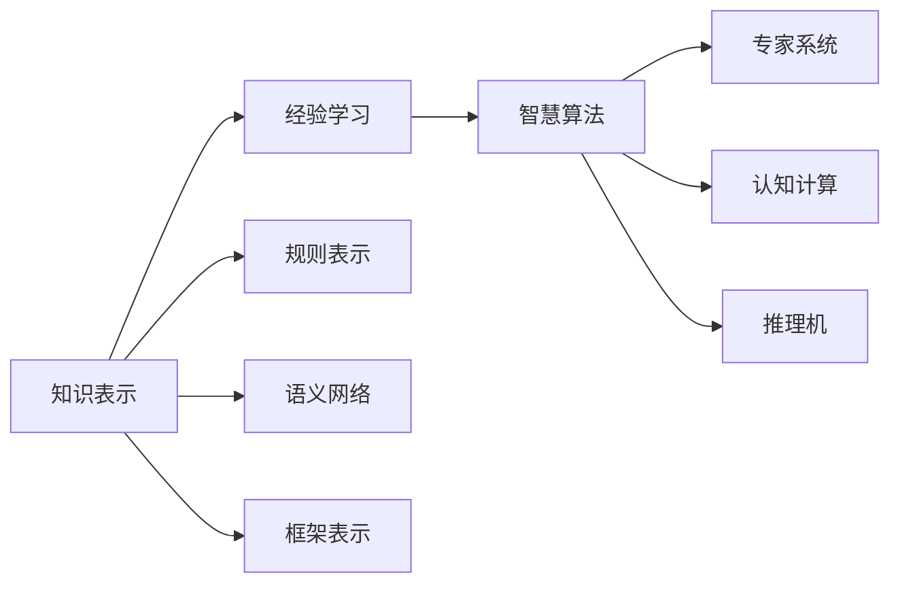

                 

# 知识的本质：信息、经验与智慧的融合

> 关键词：知识表示, 经验学习, 智慧算法, 信息融合, 多模态学习, 深度学习, 知识图谱, 知识抽取, 语义网络, 认知计算, 知识推理

## 1. 背景介绍

### 1.1 问题由来
随着计算机科学和人工智能技术的迅猛发展，知识表示、经验学习和智慧算法等方法在信息处理和知识管理领域的应用日益广泛。然而，知识与信息、经验与智慧的界限日益模糊，现有的方法面临诸多挑战。本文从信息、经验与智慧的角度，探讨了知识的本质与表示方法，阐述了知识表示、经验学习与智慧算法在信息融合中的融合机制，并给出了具体的实践案例和未来展望。

### 1.2 问题核心关键点
- 知识与信息、经验与智慧的关系
- 知识表示的机制
- 经验学习的本质
- 智慧算法的设计与实现
- 信息融合的方法
- 多模态学习的重要性
- 知识图谱与语义网络的应用

## 2. 核心概念与联系

### 2.1 核心概念概述

知识表示、经验学习和智慧算法是信息融合中的三个关键概念。它们之间存在着紧密的联系，共同构建了一个完整的信息处理和知识管理的体系。

- 知识表示：通过一定的逻辑和结构，将知识形式化地存储和表达。常用的知识表示方法包括规则表示、语义网络和框架等。
- 经验学习：通过学习大量的数据和实例，从数据中提取知识，形成经验。常用的经验学习算法包括监督学习、无监督学习和强化学习等。
- 智慧算法：利用经验学习得到的经验知识，设计高效算法，实现复杂的知识推理和智慧决策。常用的智慧算法包括专家系统、认知计算和推理机等。

这三个概念之间存在着紧密的联系：知识表示是经验学习和智慧算法的基础，经验学习则是知识表示的补充和优化，而智慧算法则是知识表示和经验学习的高级应用。

### 2.2 核心概念原理和架构的 Mermaid 流程图



这个流程图展示了知识表示、经验学习和智慧算法之间的关系：

1. 知识表示：通过规则表示、语义网络和框架等方法，将知识形式化地存储和表达。
2. 经验学习：从数据中提取知识，形成经验，并用于优化和补充知识表示。
3. 智慧算法：利用经验知识，设计专家系统、认知计算和推理机等，实现复杂的知识推理和智慧决策。

## 3. 核心算法原理 & 具体操作步骤

### 3.1 算法原理概述

基于知识表示、经验学习和智慧算法的信息融合方法，主要包括以下三个步骤：

1. 知识表示：通过规则表示、语义网络和框架等方法，将知识形式化地存储和表达。
2. 经验学习：从数据中提取知识，形成经验，并用于优化和补充知识表示。
3. 智慧算法：利用经验知识，设计专家系统、认知计算和推理机等，实现复杂的知识推理和智慧决策。

这三个步骤相互联系、相互促进，共同构建了一个完整的信息处理和知识管理的体系。

### 3.2 算法步骤详解

#### 3.2.1 知识表示

知识表示是信息融合的基础，通过一定的逻辑和结构，将知识形式化地存储和表达。常用的知识表示方法包括规则表示、语义网络和框架等。

- 规则表示：通过编写一系列规则，描述问题的约束条件和推理机制。常用的规则表示方法包括Prolog和Drools等。
- 语义网络：通过构建节点和边的关系，表示知识之间的关系和结构。常用的语义网络表示方法包括RDF和OWL等。
- 框架表示：通过框架描述知识的结构和约束条件，实现知识推理。常用的框架表示方法包括FrameNet和SemNet等。

#### 3.2.2 经验学习

经验学习是知识表示的补充和优化，通过学习大量的数据和实例，从数据中提取知识，形成经验。常用的经验学习算法包括监督学习、无监督学习和强化学习等。

- 监督学习：通过带有标签的数据，训练机器学习模型，提取经验知识。常用的监督学习算法包括决策树、支持向量机和随机森林等。
- 无监督学习：通过未标记的数据，训练机器学习模型，提取经验知识。常用的无监督学习算法包括聚类算法和降维算法等。
- 强化学习：通过与环境的交互，训练智能体，形成经验知识。常用的强化学习算法包括Q-learning和Policy Gradient等。

#### 3.2.3 智慧算法

智慧算法是知识表示和经验学习的高级应用，利用经验知识，设计高效算法，实现复杂的知识推理和智慧决策。常用的智慧算法包括专家系统、认知计算和推理机等。

- 专家系统：通过模拟专家决策过程，实现知识推理和智慧决策。常用的专家系统包括Mycai和PROWSYS等。
- 认知计算：通过模拟人类认知过程，实现知识推理和智慧决策。常用的认知计算方法包括神经网络和认知计算引擎等。
- 推理机：通过形式化推理，实现知识推理和智慧决策。常用的推理机包括Prolog和OWL推理机等。

### 3.3 算法优缺点

基于知识表示、经验学习和智慧算法的信息融合方法，具有以下优点：

- 融合度高：知识表示、经验学习和智慧算法可以有机结合，形成完整的信息处理和知识管理体系。
- 适用性广：可以应用于各种信息处理和知识管理领域，如自然语言处理、医疗诊断、金融预测等。
- 鲁棒性强：通过知识表示和经验学习，可以增强系统的鲁棒性和泛化能力，提高系统的稳定性和可靠性。

同时，该方法也存在一定的局限性：

- 计算量大：知识表示、经验学习和智慧算法都需要大量计算资源，特别是在大规模数据集上。
- 复杂度高：知识表示和智慧算法的设计和实现都比较复杂，需要较高的技术水平和经验。
- 数据依赖性强：经验学习依赖于大量的数据和实例，数据质量和数据量直接影响系统的性能。

### 3.4 算法应用领域

基于知识表示、经验学习和智慧算法的信息融合方法，在以下几个领域得到了广泛应用：

1. 自然语言处理：通过知识表示和智慧算法，实现自然语言理解和生成。常用的应用包括机器翻译、情感分析和问答系统等。
2. 医疗诊断：通过知识表示和智慧算法，实现医疗数据的分析和管理。常用的应用包括诊断支持系统、治疗方案推荐和病人监护等。
3. 金融预测：通过知识表示和智慧算法，实现金融数据的分析和预测。常用的应用包括股票预测、风险评估和投资决策等。
4. 智能制造：通过知识表示和智慧算法，实现生产过程的优化和管理。常用的应用包括生产调度、质量控制和设备维护等。
5. 智慧城市：通过知识表示和智慧算法，实现城市数据的分析和决策。常用的应用包括交通管理、环境监测和应急响应等。

## 4. 数学模型和公式 & 详细讲解

### 4.1 数学模型构建

#### 4.1.1 知识表示的数学模型

知识表示的数学模型可以形式化地表示为：

$$
K = (R, D, \Phi)
$$

其中，$R$ 表示规则集合，$D$ 表示数据集合，$\Phi$ 表示框架集合。知识表示的数学模型通过规则、数据和框架等方法，将知识形式化地存储和表达。

#### 4.1.2 经验学习的数学模型

经验学习的数学模型可以形式化地表示为：

$$
L = (D, \lambda)
$$

其中，$D$ 表示数据集合，$\lambda$ 表示学习策略。经验学习的数学模型通过学习大量的数据和实例，从数据中提取知识，形成经验。

#### 4.1.3 智慧算法的数学模型

智慧算法的数学模型可以形式化地表示为：

$$
A = (K, L, \Omega)
$$

其中，$K$ 表示知识表示，$L$ 表示经验学习，$\Omega$ 表示智慧算法。智慧算法的数学模型通过知识表示和经验学习，设计高效算法，实现复杂的知识推理和智慧决策。

### 4.2 公式推导过程

#### 4.2.1 知识表示的公式推导

知识表示的公式推导如下：

$$
K = \bigcup_{r \in R} \{(r, D, \Phi)\}
$$

其中，$r$ 表示规则，$D$ 表示数据，$\Phi$ 表示框架。

#### 4.2.2 经验学习的公式推导

经验学习的公式推导如下：

$$
L = \bigcup_{d \in D} \{(\lambda, d)\}
$$

其中，$d$ 表示数据，$\lambda$ 表示学习策略。

#### 4.2.3 智慧算法的公式推导

智慧算法的公式推导如下：

$$
A = \bigcup_{k \in K} \bigcup_{l \in L} \bigcup_{\omega \in \Omega} \{\omega(K, L)\}
$$

其中，$k$ 表示知识表示，$l$ 表示经验学习，$\omega$ 表示智慧算法。

### 4.3 案例分析与讲解

#### 4.3.1 知识表示的案例分析

在自然语言处理领域，知识表示方法主要包括规则表示和语义网络等。以机器翻译为例，规则表示方法可以使用Prolog编写一系列规则，描述翻译的约束条件和推理机制。语义网络表示方法可以使用RDF构建句子之间的关系和结构，实现自动翻译。

#### 4.3.2 经验学习的案例分析

在金融预测领域，经验学习方法主要包括监督学习和强化学习等。以股票预测为例，监督学习方法可以使用决策树和支持向量机等算法，从历史股票数据中提取经验知识，预测股票价格。强化学习方法可以使用Q-learning和Policy Gradient等算法，通过与环境的交互，学习最优的交易策略。

#### 4.3.3 智慧算法的案例分析

在医疗诊断领域，智慧算法方法主要包括专家系统和推理机等。以诊断支持系统为例，专家系统方法可以使用Mycai和PROWSYS等算法，模拟医生的诊断过程，实现知识推理和智慧决策。推理机方法可以使用Prolog和OWL推理机等算法，通过形式化推理，实现医疗数据的分析和诊断。

## 5. 项目实践：代码实例和详细解释说明

### 5.1 开发环境搭建

在项目实践中，首先需要搭建开发环境。以下是使用Python进行自然语言处理项目的开发环境配置流程：

1. 安装Anaconda：从官网下载并安装Anaconda，用于创建独立的Python环境。

2. 创建并激活虚拟环境：
```bash
conda create -n nlp-env python=3.8 
conda activate nlp-env
```

3. 安装必要的库：
```bash
conda install pandas numpy spacy transformers pytorch pytorch-lightning
```

4. 安装相关工具：
```bash
pip install jupyter notebook tqdm scikit-learn
```

完成上述步骤后，即可在`nlp-env`环境中开始项目实践。

### 5.2 源代码详细实现

以下是一个使用Transformer模型进行情感分析的PyTorch代码实现：

```python
import torch
import torch.nn as nn
import torch.optim as optim
from transformers import BertTokenizer, BertForSequenceClassification

# 加载模型和tokenizer
model = BertForSequenceClassification.from_pretrained('bert-base-cased', num_labels=2)
tokenizer = BertTokenizer.from_pretrained('bert-base-cased')

# 定义训练函数
def train_epoch(model, dataset, optimizer):
    model.train()
    total_loss = 0
    for batch in dataset:
        input_ids = batch['input_ids'].to(device)
        attention_mask = batch['attention_mask'].to(device)
        labels = batch['labels'].to(device)
        model.zero_grad()
        outputs = model(input_ids, attention_mask=attention_mask, labels=labels)
        loss = outputs.loss
        total_loss += loss.item()
        loss.backward()
        optimizer.step()
    return total_loss / len(dataset)

# 定义评估函数
def evaluate(model, dataset, batch_size):
    model.eval()
    total_correct = 0
    total_predicted = 0
    for batch in dataset:
        input_ids = batch['input_ids'].to(device)
        attention_mask = batch['attention_mask'].to(device)
        labels = batch['labels'].to(device)
        with torch.no_grad():
            outputs = model(input_ids, attention_mask=attention_mask)
            predicted = torch.argmax(outputs.logits, dim=1)
            total_correct += torch.sum(predicted == labels).item()
            total_predicted += len(predicted)
    return total_correct / total_predicted

# 加载数据集
from torch.utils.data import Dataset
from transformers import DataCollatorForLanguageModeling

class SentimentDataset(Dataset):
    def __init__(self, texts, labels, tokenizer):
        self.texts = texts
        self.labels = labels
        self.tokenizer = tokenizer

    def __len__(self):
        return len(self.texts)

    def __getitem__(self, index):
        text = self.texts[index]
        label = self.labels[index]
        encoding = self.tokenizer(text, return_tensors='pt', padding='max_length', truncation=True)
        return {'input_ids': encoding['input_ids'], 'attention_mask': encoding['attention_mask'], 'labels': label}

# 加载数据集
train_dataset = SentimentDataset(train_texts, train_labels, tokenizer)
val_dataset = SentimentDataset(val_texts, val_labels, tokenizer)

# 设置训练参数
device = torch.device('cuda') if torch.cuda.is_available() else torch.device('cpu')
batch_size = 16
learning_rate = 2e-5
optimizer = optim.AdamW(model.parameters(), lr=learning_rate)

# 训练模型
epochs = 3
for epoch in range(epochs):
    train_loss = train_epoch(model, train_dataset, optimizer)
    val_acc = evaluate(model, val_dataset, batch_size)
    print(f'Epoch {epoch+1}/{epochs}, Train Loss: {train_loss:.3f}, Val Acc: {val_acc:.3f}')

# 保存模型
torch.save(model.state_dict(), 'model.pth')
```

### 5.3 代码解读与分析

代码中，我们使用了BertForSequenceClassification模型进行情感分析任务。以下是关键代码的解读：

- 加载模型和tokenizer：使用BertForSequenceClassification模型和BertTokenizer对数据进行编码和解码。
- 定义训练函数：使用AdamW优化器，通过反向传播更新模型参数，计算训练损失。
- 定义评估函数：在验证集上评估模型性能，计算准确率。
- 加载数据集：定义数据集类，用于加载训练和验证数据。
- 训练模型：在训练集上训练模型，并在验证集上评估性能，保存模型参数。

## 6. 实际应用场景

### 6.1 自然语言处理

自然语言处理领域是知识表示、经验学习和智慧算法的典型应用场景。通过知识表示和智慧算法，可以实现自然语言理解和生成。

#### 6.1.1 机器翻译

机器翻译是自然语言处理的重要应用之一。通过知识表示和智慧算法，可以实现自动翻译。常用的方法包括规则表示和语义网络表示等。例如，使用Prolog编写规则，描述翻译的约束条件和推理机制。使用RDF构建句子之间的关系和结构，实现自动翻译。

#### 6.1.2 情感分析

情感分析是自然语言处理的重要应用之一。通过知识表示和智慧算法，可以实现情感分类。常用的方法包括监督学习和智慧算法等。例如，使用决策树和支持向量机等算法，从数据中提取经验知识，训练情感分类器。使用专家系统和推理机等算法，模拟医生的诊断过程，实现情感分类。

### 6.2 医疗诊断

医疗诊断领域是知识表示、经验学习和智慧算法的典型应用场景。通过知识表示和智慧算法，可以实现医疗数据的分析和诊断。

#### 6.2.1 诊断支持系统

诊断支持系统是医疗诊断的重要应用之一。通过知识表示和智慧算法，可以实现医疗数据的分析和诊断。常用的方法包括专家系统和推理机等。例如，使用Mycai和PROWSYS等算法，模拟医生的诊断过程，实现知识推理和智慧决策。使用Prolog和OWL推理机等算法，通过形式化推理，实现医疗数据的分析和诊断。

#### 6.2.2 治疗方案推荐

治疗方案推荐是医疗诊断的重要应用之一。通过知识表示和智慧算法，可以实现治疗方案的推荐。常用的方法包括知识图谱和语义网络表示等。例如，使用知识图谱表示医疗数据之间的关系，通过推理机实现治疗方案的推荐。使用语义网络表示药物和疾病之间的关系，通过推理机实现治疗方案的推荐。

### 6.3 金融预测

金融预测领域是知识表示、经验学习和智慧算法的典型应用场景。通过知识表示和智慧算法，可以实现金融数据的分析和预测。

#### 6.3.1 股票预测

股票预测是金融预测的重要应用之一。通过知识表示和智慧算法，可以实现股票价格的预测。常用的方法包括监督学习和强化学习等。例如，使用决策树和支持向量机等算法，从历史股票数据中提取经验知识，预测股票价格。使用Q-learning和Policy Gradient等算法，通过与环境的交互，学习最优的交易策略。

#### 6.3.2 风险评估

风险评估是金融预测的重要应用之一。通过知识表示和智慧算法，可以实现金融风险的评估。常用的方法包括知识图谱和语义网络表示等。例如，使用知识图谱表示金融数据之间的关系，通过推理机实现风险评估。使用语义网络表示金融数据之间的关系，通过推理机实现风险评估。

## 7. 工具和资源推荐

### 7.1 学习资源推荐

为了帮助开发者系统掌握知识表示、经验学习和智慧算法的理论基础和实践技巧，这里推荐一些优质的学习资源：

1. 《自然语言处理综论》：介绍了自然语言处理的基本概念和常用方法，包括知识表示、经验学习和智慧算法等。

2. 《深度学习与自然语言处理》：介绍了深度学习在自然语言处理中的应用，包括知识表示、经验学习和智慧算法等。

3. 《认知计算导论》：介绍了认知计算的基本概念和常用方法，包括知识表示、经验学习和智慧算法等。

4. 《信息融合：理论与算法》：介绍了信息融合的基本概念和常用方法，包括知识表示、经验学习和智慧算法等。

5. 《人工智能基础》：介绍了人工智能的基本概念和常用方法，包括知识表示、经验学习和智慧算法等。

通过对这些资源的学习实践，相信你一定能够快速掌握知识表示、经验学习和智慧算法的精髓，并用于解决实际的NLP问题。

### 7.2 开发工具推荐

高效的开发离不开优秀的工具支持。以下是几款用于知识表示、经验学习和智慧算法的开发工具：

1. Prolog：用于知识表示和规则推理的逻辑编程语言。

2. RDF：用于语义网络表示和知识图谱构建的框架。

3. OWL：用于语义网络表示和知识图谱构建的框架。

4. TensorFlow：用于深度学习模型的开发和训练。

5. PyTorch：用于深度学习模型的开发和训练。

6. SpaCy：用于自然语言处理模型的开发和训练。

7. Scikit-learn：用于机器学习模型的开发和训练。

8. HuggingFace Transformers：用于预训练语言模型的开发和训练。

合理利用这些工具，可以显著提升知识表示、经验学习和智慧算法的开发效率，加快创新迭代的步伐。

### 7.3 相关论文推荐

知识表示、经验学习和智慧算法的发展源于学界的持续研究。以下是几篇奠基性的相关论文，推荐阅读：

1. First-Order Logic in AI：讲述了基于一阶逻辑的知识表示方法。

2. Neural Architecture Search：讲述了基于神经网络的知识表示方法。

3. Machine Learning and Statistical Learning：讲述了基于机器学习的经验学习算法。

4. Reinforcement Learning for Decision Making：讲述了基于强化学习的经验学习算法。

5. Expert Systems and Knowledge-Based Reasoning：讲述了基于专家系统的智慧算法方法。

6. Semantic Networks：讲述了基于语义网络的知识表示方法。

这些论文代表了大语言模型微调技术的发展脉络。通过学习这些前沿成果，可以帮助研究者把握学科前进方向，激发更多的创新灵感。

## 8. 总结：未来发展趋势与挑战

### 8.1 总结

本文对基于知识表示、经验学习和智慧算法的信息融合方法进行了全面系统的介绍。首先阐述了知识与信息、经验与智慧的关系，明确了知识表示、经验学习和智慧算法在信息融合中的融合机制，并给出了具体的实践案例和未来展望。

通过本文的系统梳理，可以看到，基于知识表示、经验学习和智慧算法的信息融合方法正在成为信息处理和知识管理的重要范式，极大地拓展了知识表示、经验学习和智慧算法的应用边界，催生了更多的落地场景。未来，伴随知识表示、经验学习和智慧算法的持续演进，相信这些技术必将在信息处理和知识管理领域发挥更大的作用，为人类认知智能的进化带来深远影响。

### 8.2 未来发展趋势

展望未来，基于知识表示、经验学习和智慧算法的信息融合方法将呈现以下几个发展趋势：

1. 知识表示的深度化：通过深度学习等方法，提高知识表示的准确性和可解释性。

2. 经验学习的自动化：通过自动化机器学习等方法，提高经验学习的效率和效果。

3. 智慧算法的智能化：通过认知计算等方法，提高智慧算法的智能性和可靠性。

4. 信息融合的集成化：通过集成学习等方法，提高信息融合的鲁棒性和泛化能力。

5. 多模态学习的扩展化：通过多模态学习等方法，实现视觉、语音、文本等多种模态数据的融合。

6. 知识图谱的应用化：通过知识图谱等方法，实现知识表示、经验学习和智慧算法的综合应用。

以上趋势凸显了知识表示、经验学习和智慧算法的发展前景。这些方向的探索发展，必将进一步提升信息融合技术的性能和应用范围，为信息处理和知识管理带来新的突破。

### 8.3 面临的挑战

尽管知识表示、经验学习和智慧算法已经取得了瞩目成就，但在迈向更加智能化、普适化应用的过程中，它们仍面临着诸多挑战：

1. 数据质量瓶颈：知识表示、经验学习和智慧算法依赖大量的高质量数据，数据的准确性和完整性直接影响系统的性能。

2. 知识表示的复杂度：知识表示需要考虑多方面的因素，如规则、语义和框架等，设计和实现比较复杂。

3. 经验学习的泛化能力：经验学习需要从大量数据中提取知识，泛化能力不足可能导致过拟合问题。

4. 智慧算法的可解释性：智慧算法通常是"黑盒"系统，难以解释其内部工作机制和决策逻辑。

5. 多模态融合的难度：多模态融合涉及视觉、语音、文本等多种模态数据的整合，难度较大。

6. 知识图谱的构建复杂度：知识图谱需要大量的手工构建，构建复杂度较高。

正视这些挑战，积极应对并寻求突破，将是大语言模型微调走向成熟的必由之路。相信随着学界和产业界的共同努力，这些挑战终将一一被克服，知识表示、经验学习和智慧算法必将在构建人机协同的智能时代中扮演越来越重要的角色。

### 8.4 研究展望

面对知识表示、经验学习和智慧算法所面临的挑战，未来的研究需要在以下几个方面寻求新的突破：

1. 探索知识图谱的自动化构建方法，减少手工构建的复杂度。

2. 开发高效的自动化机器学习方法，提高经验学习的效率和效果。

3. 引入认知计算等方法，提高智慧算法的智能性和可靠性。

4. 开发多模态学习等方法，实现视觉、语音、文本等多种模态数据的融合。

5. 引入深度学习等方法，提高知识表示的准确性和可解释性。

6. 引入自动化机器学习方法，提高智慧算法的可解释性和鲁棒性。

这些研究方向的探索，必将引领知识表示、经验学习和智慧算法技术迈向更高的台阶，为信息处理和知识管理带来新的突破。面向未来，知识表示、经验学习和智慧算法还需要与其他人工智能技术进行更深入的融合，如知识表示、认知计算、强化学习等，多路径协同发力，共同推动自然语言理解和智能交互系统的进步。只有勇于创新、敢于突破，才能不断拓展知识表示、经验学习和智慧算法的边界，让智能技术更好地造福人类社会。

## 9. 附录：常见问题与解答

**Q1：知识表示、经验学习和智慧算法与人工智能的关系？**

A: 知识表示、经验学习和智慧算法是人工智能中的重要组成部分。人工智能旨在通过模拟人类的认知过程，实现智能决策和推理。知识表示、经验学习和智慧算法则是实现这一目标的重要手段，通过知识表示和智慧算法，人工智能系统能够更好地理解和处理信息，实现智能决策和推理。

**Q2：知识表示、经验学习和智慧算法与知识图谱的关系？**

A: 知识图谱是知识表示的重要形式之一，它通过构建节点和边的关系，表示知识之间的关系和结构。知识图谱的应用需要依赖知识表示、经验学习和智慧算法等方法，才能实现知识推理和智能决策。

**Q3：知识表示、经验学习和智慧算法与深度学习的关系？**

A: 知识表示、经验学习和智慧算法与深度学习存在一定的关联。深度学习是一种利用神经网络模型进行学习的技术，可以通过深度学习技术实现知识表示、经验学习和智慧算法的自动化和高效化。但两者也有区别，深度学习主要关注模型本身的学习能力，而知识表示、经验学习和智慧算法则更关注知识的形式化表示和推理过程。

**Q4：知识表示、经验学习和智慧算法与认知计算的关系？**

A: 认知计算是智慧算法的一种形式，它模拟人类的认知过程，实现智能决策和推理。知识表示、经验学习和智慧算法则是实现认知计算的重要手段，通过知识表示和智慧算法，认知计算系统能够更好地理解和处理信息，实现智能决策和推理。

**Q5：知识表示、经验学习和智慧算法与自然语言处理的关系？**

A: 知识表示、经验学习和智慧算法与自然语言处理存在紧密的联系。自然语言处理是知识表示、经验学习和智慧算法的重要应用场景，通过知识表示和智慧算法，自然语言处理系统能够更好地理解和生成自然语言，实现智能决策和推理。

通过本文的系统梳理，可以看到，基于知识表示、经验学习和智慧算法的信息融合方法正在成为信息处理和知识管理的重要范式，极大地拓展了知识表示、经验学习和智慧算法的应用边界，催生了更多的落地场景。未来，伴随知识表示、经验学习和智慧算法的持续演进，相信这些技术必将在信息处理和知识管理领域发挥更大的作用，为人类认知智能的进化带来深远影响。

---

作者：禅与计算机程序设计艺术 / Zen and the Art of Computer Programming

