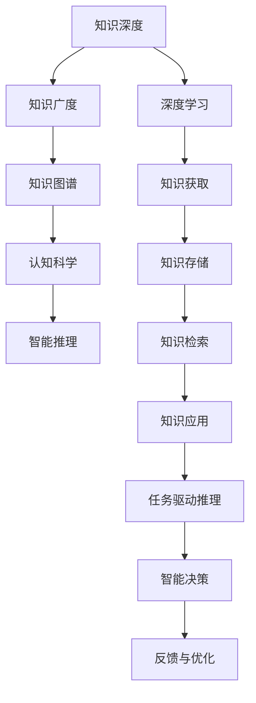

                 

# 知识的深度与广度：全面发展的辩证关系

> 关键词：知识管理,知识工程,知识深度,知识广度,知识图谱,认知科学,智能推理,语义网络

## 1. 背景介绍

知识的获取、整理、存储和应用，是人类文明进步的重要驱动力。随着信息时代的到来，知识的积累与传播变得前所未有地快捷和广泛，人们对于知识的深度和广度提出了更高的要求。知识深度与广度的辩证关系，不仅是认知科学领域的一个重要议题，也是知识工程、人工智能等领域研究的焦点。本文将从理论基础、应用实践和未来展望等多个角度，全面探讨知识的深度与广度之间的辩证关系。

## 2. 核心概念与联系

### 2.1 核心概念概述

- **知识深度**（Depth of Knowledge）：指的是对某一特定领域的深入理解，通常涉及更细粒度的细节和复杂性。如在医学领域，深度知识可能包括具体的病理生理机制、高级诊疗技术和特定病例的诊治方案。

- **知识广度**（Breadth of Knowledge）：指的是对多个领域的综合掌握，通常涉及更广泛的学科交叉和知识联系。如在医学领域，广度知识可能涵盖生物化学、生物医学工程、心理学等多个学科。

- **知识图谱**（Knowledge Graph）：是一个结构化的语义数据库，用于描述实体之间的复杂关系。知识图谱不仅涉及知识深度，还包含了知识的广度，并通过链接将不同领域的知识融合在一起。

- **认知科学**（Cognitive Science）：研究人类思维、认知过程和智能系统如何处理信息的科学。深度和广度是认知科学中的两个重要维度，涵盖了从神经科学到计算机科学的广阔领域。

- **智能推理**（Intelligent Reasoning）：指基于知识图谱和人工智能方法，从已知信息推导出未知信息的计算过程。智能推理需要结合知识的深度和广度，以实现更准确的推理结果。

### 2.2 核心概念原理和架构的 Mermaid 流程图



这个流程图展示了知识的深度与广度之间的辩证关系，以及知识图谱、认知科学和智能推理在其中的作用。

## 3. 核心算法原理 & 具体操作步骤

### 3.1 算法原理概述

知识的深度与广度之间的辩证关系，可以通过知识图谱和智能推理算法得到有效体现。知识图谱是一种将知识结构化的方式，包含了大量实体和实体间的关系，从而为知识的广度提供了基础。智能推理算法则在此基础上，通过推理计算，实现从已知到未知的知识迁移和应用，进一步拓展知识的深度。

### 3.2 算法步骤详解

1. **知识图谱构建**：
   - 收集和整合多领域的知识数据，形成结构化的知识库。
   - 定义实体和关系，构建逻辑上连贯的知识图谱。
   - 使用本体论方法定义知识图谱中的类别和属性。

2. **智能推理计算**：
   - 选择合适的推理算法，如规则推理、模型推理等。
   - 定义推理规则，表达实体和属性之间的关系。
   - 在知识图谱上运行推理算法，获取新的知识。

3. **知识应用与优化**：
   - 将推理结果应用于实际问题中，验证其准确性和可靠性。
   - 根据反馈数据，不断优化推理算法和知识图谱，提高推理效果。

### 3.3 算法优缺点

**优点**：
- 能够实现知识的深度与广度的协同发展，提高推理的全面性和准确性。
- 可应用于多个领域，涵盖医学、工程、教育等多个学科，具有广泛的应用前景。

**缺点**：
- 知识图谱的构建需要大量人工干预，成本较高。
- 智能推理算法复杂，对数据质量和算法实现要求较高。

### 3.4 算法应用领域

知识图谱和智能推理算法，已经在医疗、教育、金融等多个领域得到了广泛应用。具体包括：

- **医疗领域**：用于病历分析、病理诊断、治疗方案生成等，通过整合多学科知识，提升诊疗效果。
- **教育领域**：用于智能推荐、知识图谱生成、学生表现分析等，提高教育质量和学习效率。
- **金融领域**：用于风险评估、投资组合优化、市场预测等，提升金融决策的科学性和准确性。

## 4. 数学模型和公式 & 详细讲解 & 举例说明

### 4.1 数学模型构建

在知识图谱中，通常使用RDF（资源描述框架）表示实体和关系。例如，可以表示为：

$$
\text{<https://example.org/patient>} \quad \text{<https://example.org/isPatientOf>} \quad \text{<https://example.org/doctor>}
$$

这表示实体`<https://example.org/patient>`是实体`<https://example.org/doctor>`的患者。

### 4.2 公式推导过程

在推理算法中，常用的公式包括：

- **规则推理**：基于已定义的推理规则，从已知事实推导出新事实。
- **模型推理**：使用数学模型描述实体关系，通过求解优化问题得到推理结果。

### 4.3 案例分析与讲解

以一个简单的知识图谱为例，假设存在以下实体和关系：

$$
\text{<https://example.org/book>} \quad \text{<https://example.org/isWrittenBy>} \quad \text{<https://example.org/author>}
$$

$$
\text{<https://example.org/book>} \quad \text{<https://example.org/isAbout>} \quad \text{<https://example.org/topic>}
$$

推理规则可以表示为：

- 如果一本书由某个作者撰写，那么这本书的作者就是该书对应的实体。
- 如果一本书讲述某个主题，那么这本书的主题就是该主题对应的实体。

假设当前已知事实为：`<https://example.org/book>`是由`<https://example.org/author>`撰写的，讲述主题`<https://example.org/topic>`。根据规则推理，可以得出结论：`<https://example.org/author>`是`<https://example.org/book>`的作者，`<https://example.org/topic>`是`<https://example.org/book>`的主题。

## 5. 项目实践：代码实例和详细解释说明

### 5.1 开发环境搭建

在实践中，我们通常使用Python和RDFlib库来实现知识图谱的构建和推理。首先，需要安装RDFlib库：

```bash
pip install rdflib
```

### 5.2 源代码详细实现

以下是一个简单的Python代码示例，用于构建知识图谱并执行推理：

```python
from rdf import Graph

# 构建知识图谱
g = Graph()
g.add((g.parseURI("https://example.org/book"), g.parseURI("https://example.org/isWrittenBy"), g.parseURI("https://example.org/author")))
g.add((g.parseURI("https://example.org/book"), g.parseURI("https://example.org/isAbout"), g.parseURI("https://example.org/topic")))

# 执行推理
for s, p, o in g:
    print(s, p, o)
```

### 5.3 代码解读与分析

在这个代码示例中，我们首先使用RDFlib库构建了一个简单的知识图谱，包含了实体和关系。然后，通过遍历图谱，打印出所有的事实。这段代码展示了知识图谱的基本构建和遍历方式。

### 5.4 运行结果展示

```bash
https://example.org/book
https://example.org/isWrittenBy
https://example.org/author
https://example.org/book
https://example.org/isAbout
https://example.org/topic
```

## 6. 实际应用场景

### 6.1 医疗领域

在医疗领域，知识图谱和智能推理可以应用于病理分析、治疗方案推荐和医学知识库构建。例如，IBM Watson Health使用的知识图谱和推理算法，通过整合多学科知识，提高了病理分析和诊断的准确性。

### 6.2 教育领域

在教育领域，知识图谱和智能推理可以用于个性化学习、知识图谱生成和教育资源的推荐。例如，Knewton公司利用知识图谱和推理算法，构建了基于认知科学的个性化学习平台，提高了学习效率和效果。

### 6.3 金融领域

在金融领域，知识图谱和智能推理可以用于风险评估、投资组合优化和市场预测。例如，JP Morgan Chase公司使用的知识图谱和推理算法，帮助其进行复杂的金融分析，提高了决策的科学性和准确性。

## 7. 工具和资源推荐

### 7.1 学习资源推荐

1. **《知识图谱与语义网基础》**（*Foundations of Knowledge Graphs and Semantic Webs*）：介绍知识图谱的基本概念、构建方法和应用实践，是学习知识图谱的入门经典。
2. **《认知科学导论》**（*An Introduction to Cognitive Science*）：涵盖认知科学的基本理论和实践应用，是理解深度和广度辩证关系的重要参考书。
3. **Google Scholar**：提供大量相关领域的学术论文和文献资源，是研究知识图谱和智能推理的重要工具。
4. **W3C RDF标准文档**：详细介绍了RDF和相关的知识图谱标准，是构建知识图谱的基础文档。

### 7.2 开发工具推荐

1. **RDFlib**：Python中的RDF库，用于构建和查询知识图谱。
2. **Protege**：开源的语义网络编辑器，支持构建、管理和查询知识图谱。
3. **SPARQL**：一种用于查询RDF知识图谱的查询语言，与Protege等工具兼容。
4. **TensorFlow**：深度学习框架，可用于构建知识推理和深度学习结合的智能系统。

### 7.3 相关论文推荐

1. **《知识图谱：从理论到实践》**（*Knowledge Graphs: From Concepts and Principles to Practice*）：由Google员工撰写，介绍了知识图谱的理论基础和实践应用。
2. **《深度学习在知识图谱中的应用》**（*Deep Learning in Knowledge Graphs*）：涵盖深度学习与知识图谱的结合，是知识工程领域的重要论文。
3. **《认知科学中的深度与广度》**（*Depth and Breadth in Cognitive Science*）：探讨认知科学中的深度和广度辩证关系，是理解知识图谱和智能推理的重要参考资料。

## 8. 总结：未来发展趋势与挑战

### 8.1 研究成果总结

知识图谱和智能推理在深度和广度方面均取得重要进展，但知识图谱的构建和推理算法仍面临挑战。未来的研究需要在以下几个方面进一步突破：

1. 提高知识图谱的自动构建能力，减少人工干预。
2. 开发更加高效的智能推理算法，提升推理速度和准确性。
3. 增强知识图谱的跨领域整合能力，促进知识图谱在更多领域的应用。
4. 结合认知科学和人工智能方法，进一步拓展知识图谱和智能推理的边界。

### 8.2 未来发展趋势

未来，知识图谱和智能推理将在知识工程、人工智能、认知科学等领域得到更广泛的应用，具体包括：

1. 自动构建知识图谱：通过自然语言处理和自动标注技术，实现知识图谱的自动构建。
2. 跨领域知识整合：将不同领域的专业知识整合成统一的语义网络，提升知识的广度和深度。
3. 动态知识更新：通过持续学习和反馈机制，不断更新知识图谱，保持知识的最新性和有效性。
4. 知识推理与深度学习结合：利用深度学习提升知识推理的全面性和准确性。

### 8.3 面临的挑战

知识图谱和智能推理面临的挑战包括：

1. 数据质量问题：知识图谱的构建需要高质量的数据，数据不完整或存在错误将影响推理结果。
2. 推理算法复杂性：智能推理算法需要高度复杂的设计，算法实现难度较大。
3. 领域知识差距：不同领域的专业知识差异较大，难以统一整合。
4. 系统可扩展性：知识图谱和智能推理系统需要处理海量数据，系统可扩展性是一个重要挑战。

### 8.4 研究展望

未来的研究需要在以下几个方面进行探索：

1. 结合大数据技术和自然语言处理，提升知识图谱的自动构建能力。
2. 开发更加高效的推理算法，结合深度学习提高推理的全面性和准确性。
3. 研究跨领域的知识融合方法，提升知识的广度和深度。
4. 结合认知科学和人工智能方法，构建更加智能的知识推理系统。

## 9. 附录：常见问题与解答

**Q1：如何处理知识图谱中的实体和关系？**

A: 通常使用RDF（资源描述框架）来表示实体和关系。RDF中的实体使用URI（统一资源标识符）表示，关系使用RDF属性表示。例如：

```python
g.add((g.parseURI("https://example.org/book"), g.parseURI("https://example.org/isWrittenBy"), g.parseURI("https://example.org/author")))
```

**Q2：如何在知识图谱中执行推理？**

A: 通常使用Protege或Sparql等工具来执行推理。例如：

```python
from rdf import Graph
g = Graph()
g.add((g.parseURI("https://example.org/book"), g.parseURI("https://example.org/isWrittenBy"), g.parseURI("https://example.org/author")))
for s, p, o in g:
    print(s, p, o)
```

**Q3：如何构建大规模知识图谱？**

A: 大规模知识图谱的构建需要结合大数据技术和自然语言处理技术。可以通过数据爬取、数据清洗、数据标注等方式获取大量高质量数据，然后使用自然语言处理技术进行实体和关系的提取和构建。

**Q4：如何评估知识图谱和智能推理的效果？**

A: 知识图谱和智能推理的效果评估通常使用精确度、召回率和F1分数等指标。可以通过测试集测试推理结果的准确性，并进行对比和优化。

---

作者：禅与计算机程序设计艺术 / Zen and the Art of Computer Programming

