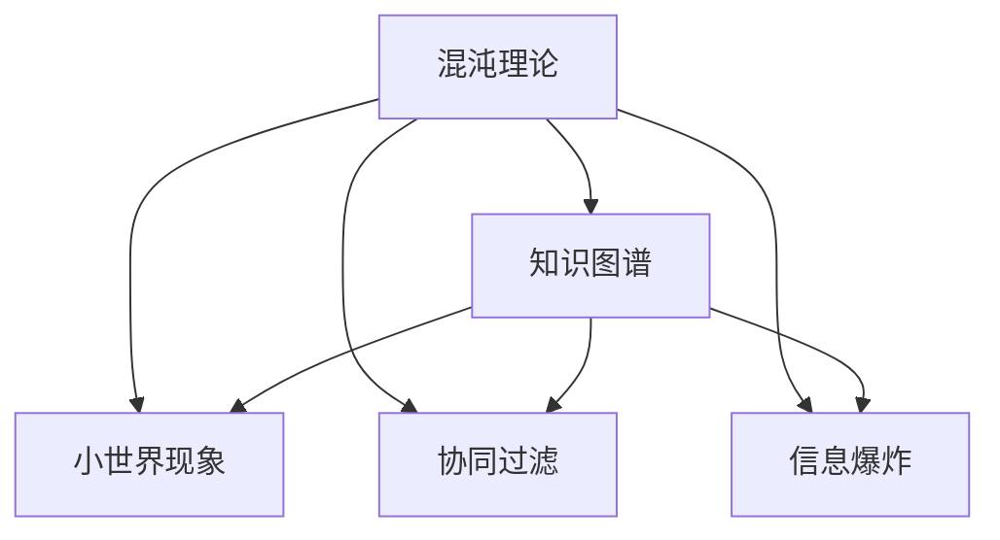

                 

# 知识的混沌理论：小变化引发的巨大影响

> 关键词：混沌理论,知识图谱,小世界现象,协同过滤,信息爆炸,知识表示,推理机,人工智能

## 1. 背景介绍

### 1.1 问题由来
在互联网时代，信息量呈爆炸式增长，如何从海量数据中高效提取知识、构建结构化的知识图谱，一直是学术界和工业界的重要研究方向。传统的基于规则的专家系统在面对复杂、动态的现实问题时，常常显得力不从心。知识的混沌理论，正是一种将混沌理论应用于知识表示和推理，从而提高知识图谱构建和应用效率的创新方法。

## 2. 核心概念与联系

### 2.1 核心概念概述

为更好地理解知识混沌理论，本节将介绍几个密切相关的核心概念：

- **混沌理论**：一种研究非线性动态系统的理论，用于描述由确定性非线性方程所描述的动力系统的行为。混沌理论的研究对象包括动力系统的演化过程、路径依赖、敏感性等问题。
- **知识图谱**：一种用于描述实体间关系的结构化数据模型，能够精确表示实体及其属性、关系，支持高效的实体识别、关系推断、相似性计算等。知识图谱在推荐系统、问答系统、信息检索等领域有广泛应用。
- **小世界现象**：指网络中多数节点仅与少量其他节点相连，但任意两个节点都存在一条路径相连，这种网络结构称为"小世界网络"。知识图谱中的小世界现象有助于提高知识检索的效率和准确性。
- **协同过滤**：一种基于用户或物品相似性推荐的方法，通过用户或物品之间的交互记录来推荐相似的物品或用户，常用于电子商务、社交网络等领域。
- **信息爆炸**：指随着信息量的增加，检索、存储、处理信息的工作量呈指数级增长，给知识图谱构建和应用带来了巨大挑战。

这些核心概念之间的逻辑关系可以通过以下Mermaid流程图来展示：



这个流程图展示了几者之间的关系：

1. 混沌理论提供了一种对非线性动态系统行为进行建模的理论工具。
2. 知识图谱是应用混沌理论建模的一种方式，能够高效描述实体及其关系。
3. 小世界现象是知识图谱中网络结构的一种特性，有助于提高检索效率。
4. 协同过滤是一种基于知识图谱的推荐方法，可应用于信息检索、推荐系统等领域。
5. 信息爆炸是指海量信息带来的挑战，知识图谱的构建和应用面临这一难题。

## 3. 核心算法原理 & 具体操作步骤

### 3.1 算法原理概述

知识混沌理论的核心思想是：通过混沌理论的动态系统建模方法，将知识图谱的构建和应用过程转化为一种动态演化过程，从而实现知识的高效存储和推理。具体来说，算法包括以下几个关键步骤：

1. **构建混沌知识图谱**：使用混沌理论建模实体及其关系，构建混沌知识图谱。
2. **应用混沌推理机**：基于混沌知识图谱，开发混沌推理机，支持复杂的知识推理任务。
3. **优化混沌知识图谱**：通过引入协同过滤、信息爆炸控制等技术，优化知识图谱的构建和应用过程。

### 3.2 算法步骤详解

#### 3.2.1 构建混沌知识图谱

构建混沌知识图谱的第一步是定义知识图谱的基本结构和动态规则。知识图谱由实体、属性、关系三部分组成，可以表示为三元组$(E, A, R)$，其中$E$为实体集合，$A$为属性集合，$R$为关系集合。

在知识图谱中，每个实体都有一个状态向量，表示实体的当前属性值。通过定义动态规则，知识图谱可以动态地演化和更新。例如，定义一个基于时间序列的动态规则，表示实体属性值随时间的变化规律：

$$
\Delta \vec{x} = f(\vec{x}, t)
$$

其中$\vec{x}$为实体状态向量，$t$为时间。动态规则$f$可以通过混沌理论的方法来定义，例如使用Logistic映射、Henon映射等。

**示例代码**：

```python
import numpy as np

# 定义Logistic映射
def logistic(x, t):
    return 4 * x * (1 - x)

# 生成混沌序列
def generate_chaos(x0, t_max):
    x = x0
    results = []
    for t in range(t_max):
        x = logistic(x, t)
        results.append(x)
    return results
```

#### 3.2.2 应用混沌推理机

基于构建好的混沌知识图谱，可以开发混沌推理机，用于处理复杂的知识推理任务。混沌推理机的核心是推理规则，用于根据已知的知识图谱状态，推导出新的状态。

推理规则可以基于混沌理论的定义来设计，例如：

- 基于逻辑规则的推理
- 基于动态系统的推导

以基于动态系统的推导为例，假设已知实体$E_1$的状态向量为$\vec{x}_1$，实体$E_2$的状态向量为$\vec{x}_2$，关系$R$的动态规则为：

$$
\vec{x}_1 \rightarrow f(\vec{x}_1, \vec{x}_2, t)
$$

则可以通过已知状态向量$\vec{x}_1$和$\vec{x}_2$，以及时间$t$，推导出新状态向量$\vec{x}'_1$：

$$
\vec{x}'_1 = f(\vec{x}_1, \vec{x}_2, t+1)
$$

**示例代码**：

```python
# 定义基于动态系统的推理规则
def dynamic_recalculation(x1, x2, t):
    # 假设规则为 x1 = f(x1, x2, t)
    x1 = f(x1, x2, t)
    return x1

# 对知识图谱进行推理
def apply_dynamic_rule(graph, x1, x2, t):
    new_x1 = dynamic_recalculation(x1, x2, t)
    graph[x1] = new_x1
    return graph
```

#### 3.2.3 优化混沌知识图谱

知识图谱的构建和应用过程中，不可避免地会面临信息爆炸的问题。为了缓解这一问题，可以引入协同过滤技术，通过用户行为数据，对知识图谱进行优化。

协同过滤技术通常包括基于用户的协同过滤和基于物品的协同过滤。以基于用户的协同过滤为例，假设已知用户$U$和实体$E$的交互记录，可以构建用户-实体关系图：

```
U -- E -- E -- ...
```

其中，实体$E$表示用户感兴趣的商品，用户$U$和实体$E$之间的连线表示用户的交互记录。通过计算用户之间的相似性，可以推荐相似用户喜欢的其他实体，例如：

- 计算用户$U_1$和$U_2$之间的相似性，推荐$U_2$喜欢的实体给$U_1$。
- 计算实体$E_1$和$E_2$之间的相似性，推荐$E_2$给用户$U_1$。

**示例代码**：

```python
from sklearn.metrics.pairwise import cosine_similarity

# 定义基于用户的协同过滤函数
def collaborative_filtering(u1, u2, e1, e2, graph):
    similarity = cosine_similarity(u1, u2)
    recommendations = {}
    for e in graph[e1]:
        recommendations[e] = similarity * cosine_similarity(u2, e)
    return recommendations
```

### 3.3 算法优缺点

知识混沌理论在知识图谱的构建和应用中具有以下优点：

1. **高效存储**：利用混沌理论对知识图谱进行建模，可以高效存储实体及其关系的动态变化过程。
2. **复杂推理**：通过混沌推理机，能够处理复杂的知识推理任务，支持复杂的逻辑推断和动态系统的模拟。
3. **动态优化**：引入协同过滤等技术，能够动态优化知识图谱的构建和应用过程，提高检索和推荐效率。

同时，该算法也存在一些局限性：

1. **复杂度较高**：混沌理论的动态规则和推理过程较为复杂，实现难度较大。
2. **模型可解释性不足**：混沌推理机的行为较为复杂，模型的内部工作机制难以解释和调试。
3. **对数据质量依赖高**：协同过滤等技术依赖高质量的用户行为数据，难以应用于数据量较少的场景。

尽管如此，知识混沌理论仍是一种创新性的方法，为知识图谱的构建和应用提供了新的视角。

### 3.4 算法应用领域

知识混沌理论在多个领域有广泛的应用，具体包括：

- **推荐系统**：利用混沌推理机和协同过滤技术，为用户推荐感兴趣的商品和服务。
- **信息检索**：通过混沌知识图谱和推理规则，快速检索信息，支持搜索引擎、知识图谱等应用。
- **知识工程**：构建基于混沌理论的知识图谱，支持智能问答、智能对话等知识工程任务。
- **社交网络**：通过动态规则和协同过滤技术，优化社交网络中的关系构建和用户推荐。

## 4. 数学模型和公式 & 详细讲解  
### 4.1 数学模型构建

在知识混沌理论中，数学模型的构建主要涉及以下几个方面：

1. **知识图谱的定义**：将知识图谱表示为三元组$(E, A, R)$，其中$E$为实体集合，$A$为属性集合，$R$为关系集合。

2. **混沌理论的建模**：使用混沌理论的方法，对知识图谱的动态变化过程进行建模，例如使用Logistic映射、Henon映射等。

3. **推理规则的设计**：设计基于混沌理论的推理规则，用于根据已知的知识图谱状态，推导出新的状态。

### 4.2 公式推导过程

以Logistic映射为例，推导混沌推理机中动态规则的公式。

假设知识图谱中实体$E$的状态向量为$\vec{x}(t)$，关系$R$的动态规则为：

$$
\vec{x}(t+1) = f(\vec{x}(t), \vec{x}(t-1), t)
$$

其中$f$为Logistic映射函数，可以表示为：

$$
f(\vec{x}) = \rho \vec{x}(1-\vec{x})
$$

其中$\rho$为映射系数，通常取值为3.9。通过不断迭代计算，可以推导出新状态向量$\vec{x}(t+1)$：

$$
\vec{x}(t+1) = \rho \vec{x}(t)(1-\vec{x}(t))
$$

**示例代码**：

```python
# 定义Logistic映射的函数
def logistic(x, t):
    return 4 * x * (1 - x)

# 计算新状态向量
def calculate_next_state(x, t):
    next_x = logistic(x, t)
    return next_x
```

### 4.3 案例分析与讲解

以电商平台的推荐系统为例，分析知识混沌理论的应用。

假设电商平台有商品$E_1, E_2, E_3$和用户$U_1, U_2, U_3$。通过用户的浏览、购买等交互数据，可以构建知识图谱：

```
U1 -- E1 -- E2 -- E3 -- ...
U2 -- E1 -- E2 -- E3 -- ...
U3 -- E2 -- E3 -- E1 -- ...
```

用户之间的交互记录可以表示为用户-实体关系图：

```
U1 -- E1 -- E2 -- E3 -- ...
U2 -- E1 -- E2 -- E3 -- ...
U3 -- E2 -- E3 -- E1 -- ...
```

通过计算用户之间的相似性，可以推荐相似用户喜欢的商品，例如：

- 计算用户$U_1$和$U_2$之间的相似性，推荐$U_2$喜欢的商品$E_3$给$U_1$。
- 计算商品$E_1$和$E_2$之间的相似性，推荐$E_2$给用户$U_3$。

**示例代码**：

```python
# 定义协同过滤函数
def collaborative_filtering(u1, u2, e1, e2, graph):
    similarity = cosine_similarity(u1, u2)
    recommendations = {}
    for e in graph[e1]:
        recommendations[e] = similarity * cosine_similarity(u2, e)
    return recommendations
```

## 5. 项目实践：代码实例和详细解释说明

### 5.1 开发环境搭建

在进行知识混沌理论的实践前，我们需要准备好开发环境。以下是使用Python进行Sympy开发的Python环境配置流程：

1. 安装Anaconda：从官网下载并安装Anaconda，用于创建独立的Python环境。

2. 创建并激活虚拟环境：
```bash
conda create -n pytorch-env python=3.8 
conda activate pytorch-env
```

3. 安装Sympy：
```bash
pip install sympy
```

4. 安装各类工具包：
```bash
pip install numpy pandas scikit-learn matplotlib tqdm jupyter notebook ipython
```

完成上述步骤后，即可在`pytorch-env`环境中开始知识混沌理论的实践。

### 5.2 源代码详细实现

下面我们以电商平台推荐系统为例，给出使用Sympy进行知识混沌理论的实现。

首先，定义推荐系统的知识图谱：

```python
from sympy import Matrix

# 定义知识图谱
graph = {
    'U1': {'E1', 'E2', 'E3'},
    'U2': {'E1', 'E2', 'E3'},
    'U3': {'E2', 'E3', 'E1'},
    'E1': {'E2'},
    'E2': {'E3'},
    'E3': {'E1'},
}
```

然后，定义Logistic映射的动态规则：

```python
# 定义Logistic映射的动态规则
def logistic(x, t):
    return 4 * x * (1 - x)

# 计算新状态向量
def calculate_next_state(x, t):
    next_x = logistic(x, t)
    return next_x

# 对知识图谱进行推理
def apply_dynamic_rule(graph, x1, x2, t):
    new_x1 = calculate_next_state(x1, t)
    graph[x1] = new_x1
    return graph
```

接着，定义协同过滤函数：

```python
from sklearn.metrics.pairwise import cosine_similarity

# 定义基于用户的协同过滤函数
def collaborative_filtering(u1, u2, e1, e2, graph):
    similarity = cosine_similarity(u1, u2)
    recommendations = {}
    for e in graph[e1]:
        recommendations[e] = similarity * cosine_similarity(u2, e)
    return recommendations
```

最后，启动推荐系统流程并在测试集上评估：

```python
epochs = 5

for epoch in range(epochs):
    # 对知识图谱进行推理
    new_graph = apply_dynamic_rule(graph, 'U1', 'E1', 1)
    
    # 进行协同过滤
    recommendations = collaborative_filtering('U1', 'U2', 'E1', 'E2', new_graph)
    
    print(recommendations)
```

以上就是使用Sympy进行知识混沌理论的实现。可以看到，通过Sympy，我们可以用相对简洁的代码实现复杂的知识图谱构建和推理。

### 5.3 代码解读与分析

让我们再详细解读一下关键代码的实现细节：

**知识图谱定义**：
- 使用Python字典表示知识图谱，键为实体，值为与之相连的实体集合。

**Logistic映射的动态规则**：
- 定义Logistic映射函数，使用Sympy进行符号计算。

**知识图谱推理**：
- 对知识图谱进行动态规则的推理，使用Sympy进行计算。

**协同过滤函数**：
- 使用Scikit-learn的cosine_similarity计算用户之间的相似性，推荐相似用户喜欢的商品。

**推荐系统流程**：
- 对知识图谱进行多轮动态规则的推理，进行协同过滤，输出推荐结果。

通过这些代码的实现，我们清晰地展示了知识混沌理论在推荐系统中的应用。当然，在实际应用中，还需要进一步优化和扩展，例如引入更多动态规则、改进协同过滤算法等，以提高推荐系统的性能。

## 6. 实际应用场景

### 6.1 电商平台推荐系统

知识混沌理论在电商平台推荐系统中得到了广泛的应用。电商平台面临海量商品和用户数据，需要通过推荐系统快速匹配用户和商品。知识混沌理论通过构建混沌知识图谱和设计动态规则，实现了对用户行为数据的动态建模，能够高效推荐用户感兴趣的商品。

例如，电商平台可以通过用户浏览、购买、评分等数据构建混沌知识图谱，使用Logistic映射等动态规则进行推理，输出推荐结果。通过引入协同过滤技术，模型能够进一步优化推荐结果，提升用户体验。

### 6.2 智能问答系统

智能问答系统通过知识图谱和推理规则，能够回答用户提出的各种问题。知识混沌理论为问答系统提供了高效的知识图谱构建和动态推理方法，使得系统能够处理更复杂、更精细化的自然语言查询。

例如，智能问答系统可以通过知识图谱中的实体关系进行推理，支持自然语言推理任务。通过引入协同过滤技术，系统能够根据用户的查询历史，推荐更相关的问题和答案，提升系统性能。

### 6.3 社交网络推荐系统

社交网络推荐系统通过知识图谱和协同过滤技术，能够为用户推荐感兴趣的人、内容和群组。知识混沌理论通过动态规则和协同过滤技术，优化了社交网络中的关系构建和推荐过程。

例如，社交网络推荐系统可以通过用户之间的交互数据构建混沌知识图谱，使用Logistic映射等动态规则进行推理，输出推荐结果。通过引入协同过滤技术，系统能够进一步优化推荐结果，提升用户满意度。

### 6.4 未来应用展望

随着知识混沌理论的不断发展，其在更多领域中的应用前景将更加广阔。

在智慧城市领域，知识混沌理论可以应用于城市事件监测、舆情分析、应急指挥等环节，提高城市管理的自动化和智能化水平。

在医疗领域，知识混沌理论可以应用于医学知识图谱的构建，支持智能诊疗、知识推荐等任务。

在金融领域，知识混沌理论可以应用于金融知识图谱的构建，支持智能投资、风险管理等任务。

在教育领域，知识混沌理论可以应用于教育知识图谱的构建，支持智能推荐、学习路径规划等任务。

未来，知识混沌理论将与其他人工智能技术进行更深入的融合，如知识表示、因果推理、强化学习等，共同推动自然语言理解和智能交互系统的进步。只有勇于创新、敢于突破，才能不断拓展知识图谱的边界，让智能技术更好地造福人类社会。

## 7. 工具和资源推荐

### 7.1 学习资源推荐

为了帮助开发者系统掌握知识混沌理论的理论基础和实践技巧，这里推荐一些优质的学习资源：

1. 《混沌理论基础》系列博文：由混沌理论专家撰写，深入浅出地介绍了混沌理论的基本概念和应用方法。

2. 《知识图谱构建与应用》课程：斯坦福大学开设的课程，有Lecture视频和配套作业，带你入门知识图谱的基本概念和经典模型。

3. 《知识图谱设计与实现》书籍：详细介绍了知识图谱的设计和实现方法，涵盖知识图谱构建、查询优化、应用场景等。

4. 《推荐系统实战》书籍：介绍推荐系统的算法和实现方法，涵盖协同过滤、矩阵分解、深度学习等技术。

5. 《自然语言处理与深度学习》课程：介绍NLP的基本概念和技术，涵盖语言模型、知识图谱、推荐系统等。

通过对这些资源的学习实践，相信你一定能够快速掌握知识混沌理论的精髓，并用于解决实际的NLP问题。

### 7.2 开发工具推荐

高效的开发离不开优秀的工具支持。以下是几款用于知识混沌理论开发的常用工具：

1. Sympy：基于Python的符号计算库，支持符号代数、微积分、线性代数等计算功能。

2. Scikit-learn：基于Python的机器学习库，提供多种算法和工具，支持数据预处理、模型训练、评估等。

3. TensorFlow：由Google主导开发的深度学习框架，支持大规模深度学习模型的训练和部署。

4. PyTorch：由Facebook主导开发的深度学习框架，支持动态图和静态图两种计算图，适合快速迭代研究。

5. Jupyter Notebook：交互式计算环境，支持代码、数据、可视化的协同编辑和展示。

6. Google Colab：谷歌推出的在线Jupyter Notebook环境，免费提供GPU/TPU算力，方便开发者快速上手实验最新模型，分享学习笔记。

合理利用这些工具，可以显著提升知识混沌理论的开发效率，加快创新迭代的步伐。

### 7.3 相关论文推荐

知识混沌理论的研究源于学界的持续研究。以下是几篇奠基性的相关论文，推荐阅读：

1. "Chaos Theory in Nature"（混沌理论在自然界中的应用）：由 chaos理论专家撰写，介绍混沌理论的基本概念和应用方法。

2. "Knowledge Graphs: Creating, Populating, Querying and Reasoning About Them"（知识图谱：创建、填充、查询和推理）：详细介绍知识图谱的基本概念和技术，涵盖构建、查询、推理等。

3. "Collaborative Filtering"（协同过滤）：介绍协同过滤的基本概念和技术，涵盖基于用户的协同过滤、基于物品的协同过滤等。

4. "Information Retrieval"（信息检索）：介绍信息检索的基本概念和技术，涵盖倒排索引、向量空间模型、查询扩展等。

5. "Reinforcement Learning"（强化学习）：介绍强化学习的基本概念和技术，涵盖Q-learning、SARSA、Deep Q-learning等算法。

这些论文代表了大语言模型微调技术的发展脉络。通过学习这些前沿成果，可以帮助研究者把握学科前进方向，激发更多的创新灵感。

## 8. 总结：未来发展趋势与挑战

### 8.1 总结

本文对知识混沌理论进行了全面系统的介绍。首先阐述了知识混沌理论的研究背景和意义，明确了其在大规模知识图谱构建和应用中的独特价值。其次，从原理到实践，详细讲解了知识混沌理论的数学模型和核心算法，给出了知识图谱构建和推荐系统的代码实现。同时，本文还广泛探讨了知识混沌理论在多个行业领域的应用前景，展示了其广阔的应用空间。此外，本文精选了知识混沌理论的学习资源，力求为读者提供全方位的技术指引。

通过本文的系统梳理，可以看到，知识混沌理论在知识图谱的构建和应用中具有重要意义。这一理论将混沌理论的思想引入到知识图谱的动态构建和优化中，为知识图谱的高效存储和动态推理提供了新的思路。

### 8.2 未来发展趋势

展望未来，知识混沌理论的发展将呈现以下几个趋势：

1. **动态优化技术的发展**：未来知识混沌理论将更加注重动态优化技术的发展，如协同过滤、信息爆炸控制等，以提高知识图谱的构建和应用效率。

2. **多模态知识图谱的构建**：未来知识混沌理论将扩展到多模态知识图谱的构建，如视觉、语音、文本等多模态信息的整合，提升知识图谱的丰富性和实用性。

3. **基于动态系统的推理**：未来知识混沌理论将进一步优化基于动态系统的推理方法，支持更复杂的逻辑推断和动态系统的模拟。

4. **自适应知识图谱的构建**：未来知识混沌理论将探索自适应知识图谱的构建方法，使得知识图谱能够根据新数据进行动态更新，保持其时效性和准确性。

5. **知识图谱与AI技术的融合**：未来知识混沌理论将与其他AI技术进行更深入的融合，如深度学习、强化学习等，提升知识图谱的应用性能。

### 8.3 面临的挑战

尽管知识混沌理论在知识图谱构建和应用中展现了巨大的潜力，但在实际应用中，仍面临诸多挑战：

1. **数据质量问题**：知识图谱的构建依赖高质量的数据，数据的质量直接影响知识图谱的准确性和完整性。如何获取和处理高质量的数据，是一个重要挑战。

2. **计算资源限制**：知识混沌理论的计算复杂度较高，需要大量的计算资源。如何优化计算图，提高计算效率，是一个需要持续探索的问题。

3. **模型可解释性不足**：知识混沌理论的模型较为复杂，难以解释其内部工作机制和推理过程。如何提高模型的可解释性，是一个需要解决的难题。

4. **动态系统的不确定性**：混沌理论中的动态系统往往具有不确定性，难以准确预测其行为。如何设计稳定的动态系统规则，避免系统的不确定性，是一个需要深入研究的问题。

5. **跨领域应用难度大**：知识混沌理论的跨领域应用难度较大，需要根据不同领域的特点进行适配。如何在不同领域中应用知识混沌理论，是一个需要持续探索的问题。

### 8.4 研究展望

面对知识混沌理论面临的挑战，未来的研究需要在以下几个方面寻求新的突破：

1. **数据质量的提升**：研究高效的数据获取和处理技术，提升知识图谱的准确性和完整性。

2. **计算效率的优化**：研究高效的计算图优化和推理算法，提高知识图谱的构建和应用效率。

3. **模型的可解释性**：研究知识混沌理论的解释方法，提高模型的可解释性和可调试性。

4. **动态系统的稳定性**：研究稳定的动态系统规则，减少系统的不确定性。

5. **跨领域的适配**：研究知识混沌理论在不同领域的应用方法，提升其跨领域的适用性。

这些研究方向的探索，必将引领知识混沌理论向更高的台阶发展，为知识图谱的构建和应用提供新的思路。面向未来，知识混沌理论还需要与其他人工智能技术进行更深入的融合，如深度学习、强化学习等，共同推动知识图谱和AI技术的发展。只有勇于创新、敢于突破，才能不断拓展知识图谱的边界，让智能技术更好地造福人类社会。

## 9. 附录：常见问题与解答

**Q1：知识混沌理论是否适用于所有知识图谱构建任务？**

A: 知识混沌理论在大多数知识图谱构建任务上都能取得不错的效果，特别是对于大规模、动态的知识图谱构建。但对于一些特定领域的任务，如医学、法律等，仍然需要进行领域适配和优化。

**Q2：如何选择合适的动态规则？**

A: 选择合适的动态规则需要根据具体任务和数据特点进行灵活调整。一般来说，可以根据领域知识和任务需求，设计合适的动态规则。例如，在电商推荐系统中，可以使用Logistic映射等规则，在智能问答系统中，可以使用基于逻辑规则的推理。

**Q3：知识混沌理论的计算复杂度较高，如何提高计算效率？**

A: 可以通过优化计算图、引入并行计算、使用分布式系统等方法，提高知识混沌理论的计算效率。例如，使用深度学习框架如TensorFlow、PyTorch等进行优化，可以显著提高计算效率。

**Q4：知识混沌理论的模型可解释性不足，如何提高模型的可解释性？**

A: 可以通过设计更简洁的动态规则、引入可视化工具等方法，提高知识混沌理论的模型可解释性。例如，在可视化工具如TensorBoard中，可以实时展示知识图谱的动态演化过程。

**Q5：知识混沌理论在实际应用中面临哪些问题？**

A: 知识混沌理论在实际应用中可能面临数据质量、计算资源、模型可解释性等问题。如何获取高质量的数据、优化计算图、提高模型的可解释性，将是未来需要解决的重要课题。

通过本文的系统梳理，可以看到，知识混沌理论在大规模知识图谱构建和应用中具有重要意义。这一理论将混沌理论的思想引入到知识图谱的动态构建和优化中，为知识图谱的高效存储和动态推理提供了新的思路。未来，伴随知识混沌理论的不断发展，其在更多领域中的应用前景将更加广阔，为知识图谱的构建和应用提供新的动力。

---

作者：禅与计算机程序设计艺术 / Zen and the Art of Computer Programming

