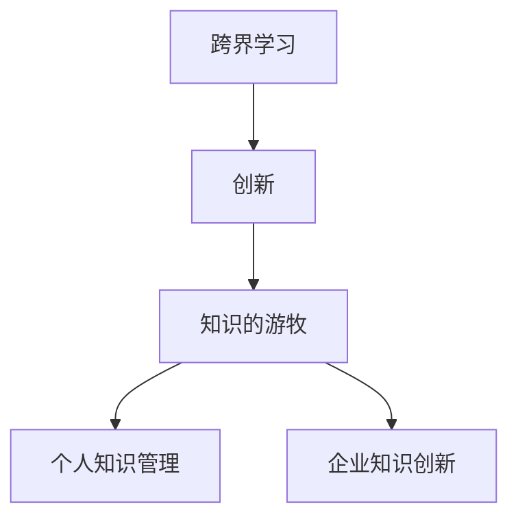

                 

# 知识的游牧：跨界学习与创新的生活方式

## 1. 背景介绍

### 1.1 问题由来
在当今这个信息爆炸的时代，知识的获取变得前所未有的容易。我们仅仅通过搜索引擎和在线学习平台，就可以接触到世界各地的知识和信息。然而，如何有效地利用这些知识，将知识转化为个人成长和创新的动力，却成为了一个亟待解决的问题。

### 1.2 问题核心关键点
知识的游牧（Knowledge Nomadism），即跨界学习与创新的生活方式，指的是通过不断跨越不同的领域，学习最新的知识和技术，并将这些知识应用到不同的创新项目中。这种方式不仅能帮助我们快速适应不断变化的世界，还能激发新的创意和突破。

### 1.3 问题研究意义
知识的游牧作为一种新兴的学习模式，对于个人成长、企业创新和社会进步都有着重要的意义：

1. **个人成长**：通过跨界学习，我们可以不断拓宽知识面，激发新的兴趣和激情，提升综合素质和竞争力。
2. **企业创新**：企业可以利用跨界学习，引入不同的视角和技术，推动产品创新和业务转型，增强市场竞争力。
3. **社会进步**：跨界学习的普及将促进知识的传播和应用，推动社会各个领域的进步和发展。

## 2. 核心概念与联系

### 2.1 核心概念概述

为更好地理解知识的游牧，本节将介绍几个关键概念及其相互关系：

- **跨界学习(Cross-Disciplinary Learning)**：跨越不同学科、领域和行业，学习并应用新知识的过程。这种学习方式能够打破传统学科界限，促进知识整合和创新。
- **创新(Innovation)**：通过跨界学习，将不同领域的新知识应用于实际问题解决中，创造出新的产品、服务或解决方案。
- **知识的游牧(Knowledge Nomadism)**：在多个领域之间游走，不断学习和应用新知识，以适应快速变化的环境。
- **个人知识管理(Individual Knowledge Management)**：管理个人的知识储备和应用，提升个人学习效率和创新能力。
- **企业知识创新(Energy-based Innovation)**：通过跨界学习和创新，推动企业产品和服务的持续改进和升级，增强市场竞争力。

这些概念之间的逻辑关系可以通过以下Mermaid流程图来展示：



这个流程图展示了一系列的逻辑关系：

1. 跨界学习是创新的基础，通过跨越不同领域，获取新知识。
2. 创新的实现依赖于跨界学习，将新知识应用于实际问题解决。
3. 知识的游牧是一种持续的学习和创新过程，不断在多个领域间游走。
4. 个人知识管理和企业知识创新都是实现知识游牧的关键环节。

## 3. 核心算法原理 & 具体操作步骤

### 3.1 算法原理概述

知识的游牧本质上是一种基于跨界学习的知识管理与创新过程。其核心思想是通过不断学习和应用不同领域的新知识，推动个人或组织的持续发展和创新。

形式化地，假设个人或组织的知识库为 $K$，通过跨界学习，获取新的知识 $K'$，则在知识库 $K$ 的基础上，进行创新的过程可以表示为：

$$
K'' = K \cup K'
$$

其中 $K''$ 表示创新后的知识库，包含了原知识库和新获取的知识。

### 3.2 算法步骤详解

知识的游牧可以分为以下几个关键步骤：

**Step 1: 设定知识目标**
- 明确个人或组织需要学习的知识和技能，确定知识获取的优先级和方向。

**Step 2: 跨界学习**
- 通过多种渠道获取不同领域的知识，包括书籍、文章、在线课程、专家访谈等。
- 针对每个领域，设计学习计划，系统地学习和掌握相关知识。

**Step 3: 知识整合**
- 将获取的新知识与原有知识进行整合，形成系统化的知识体系。
- 利用知识图谱、概念图等工具，将新旧知识关联起来，形成知识网络。

**Step 4: 创新实践**
- 将整合后的知识应用到实际问题解决中，进行创新实践。
- 迭代优化知识应用效果，不断改进和完善创新过程。

**Step 5: 持续迭代**
- 根据新的问题和挑战，不断进行跨界学习和知识整合，推动持续创新。

### 3.3 算法优缺点

知识的游牧方法具有以下优点：
1. 拓宽知识面。通过不断跨界学习，积累不同领域的知识，提升综合素质。
2. 增强创新能力。跨界学习带来新的视角和方法，促进创新思维的发展。
3. 提高适应性。跨界学习有助于应对快速变化的环境，增强个人和组织的适应能力。

同时，该方法也存在一定的局限性：
1. 学习成本高。跨界学习需要时间和精力，学习成本相对较高。
2. 知识融合难度大。跨界学习涉及多种领域的知识，整合难度较大。
3. 创新效果不可控。跨界学习的结果具有不确定性，创新的效果难以保证。

尽管存在这些局限性，但就目前而言，知识的游牧方法仍然是一种高效的学习和创新方式。未来相关研究的重点在于如何进一步降低学习成本，提高知识融合效果，同时兼顾创新效果的可控性。

### 3.4 算法应用领域

知识的游牧方法已经广泛应用于多个领域，包括但不限于：

- **科技行业**：通过跨界学习，不断引入最新的技术趋势，推动产品创新和业务升级。
- **教育领域**：跨界学习帮助教育工作者掌握多种教学方法和工具，提升教学效果。
- **医疗健康**：跨界学习引入最新的医学知识和技术，推动医疗研究和临床实践的发展。
- **文化艺术**：跨界学习促进不同艺术形式的融合，推动文化艺术的创新和传播。
- **社会治理**：跨界学习引入不同学科的知识，优化社会管理和政策制定。

这些领域的应用实例，展示了知识的游牧方法的广泛影响力和创新潜力。

## 4. 数学模型和公式 & 详细讲解 & 举例说明

### 4.1 数学模型构建

知识的游牧涉及到多个领域和学科的知识整合，可以采用系统化的数学模型进行描述。以下是一个简化的数学模型：

假设个人或组织的知识库为 $K$，包含 $n$ 个领域，每个领域的知识量为 $k_i$。通过跨界学习，获取新的知识 $K'$，包含 $m$ 个领域，每个领域的知识量为 $k'_j$。

数学模型为：

$$
K'' = \{k_i \mid i \in [1,n]\} \cup \{k'_j \mid j \in [1,m]\}
$$

其中 $K''$ 表示创新后的知识库，包含原知识库和新获取的知识。

### 4.2 公式推导过程

对于知识的游牧过程，可以采用以下公式进行推导：

$$
K'' = K \cup K'
$$

其中 $K$ 表示原知识库，$K'$ 表示新获取的知识库。

具体推导如下：

1. 假设个人或组织初始知识库 $K$ 包含 $n$ 个领域，每个领域的知识量为 $k_i$。
2. 通过跨界学习，获取新的知识 $K'$，包含 $m$ 个领域，每个领域的知识量为 $k'_j$。
3. 将 $K$ 和 $K'$ 进行合并，形成创新后的知识库 $K''$，包含 $n+m$ 个领域，每个领域的知识量为 $k''_i$。

其中 $k''_i$ 表示创新后知识库中第 $i$ 个领域的知识量。

### 4.3 案例分析与讲解

以下是一个跨界学习的案例分析：

假设一个科技公司的创新团队，需要开发一个新的智能家居产品。团队成员来自不同的学科背景，包括电子工程、人机交互、用户体验等。

1. 设定知识目标：团队需要了解智能家居领域的基础知识，掌握最新的技术趋势，学习用户体验设计和市场分析方法。
2. 跨界学习：团队成员分别学习和掌握电子工程、人机交互、用户体验等领域的知识。例如，电子工程师学习智能家居设备的硬件设计，人机交互工程师学习用户界面设计，用户体验设计师学习用户需求分析。
3. 知识整合：团队将获取的知识进行整合，形成系统的智能家居开发知识体系。例如，电子工程师和硬件设计师进行技术讨论，人机交互工程师和用户体验设计师进行设计交流，市场分析师提供市场数据支持。
4. 创新实践：团队利用整合后的知识，进行智能家居产品的开发和测试。例如，硬件设计师设计智能家居设备，人机交互工程师设计用户界面，用户体验设计师进行用户测试，市场分析师进行市场调研。
5. 持续迭代：团队根据产品反馈和新市场需求，不断进行跨界学习和知识整合，推动产品的持续改进和升级。

## 5. 项目实践：代码实例和详细解释说明

### 5.1 开发环境搭建

在进行跨界学习实践前，我们需要准备好开发环境。以下是使用Python进行跨界学习环境配置的流程：

1. 安装Anaconda：从官网下载并安装Anaconda，用于创建独立的Python环境。

2. 创建并激活虚拟环境：
```bash
conda create -n cross-disciplinary-env python=3.8 
conda activate cross-disciplinary-env
```

3. 安装相关库：
```bash
conda install pandas numpy scikit-learn scipy jupyter notebook
```

4. 安装在线学习平台和知识管理工具：
```bash
pip install edx coursera duolingo
```

5. 安装协作工具：
```bash
pip install google-collaboratory
```

完成上述步骤后，即可在`cross-disciplinary-env`环境中开始跨界学习实践。

### 5.2 源代码详细实现

以下是一个跨界学习项目的Python代码实现，包括数据处理、学习计划设计和知识整合。

```python
import pandas as pd
from sklearn.model_selection import train_test_split

# 定义数据集
data = pd.read_csv('cross_disciplinary_data.csv')

# 划分训练集和测试集
train_data, test_data = train_test_split(data, test_size=0.2, random_state=42)

# 定义学习计划
learning_plan = {
    '电子工程': '电路设计',
    '人机交互': '用户界面设计',
    '用户体验': '用户需求分析'
}

# 学习计划执行
def execute_learning_plan(data, learning_plan):
    for subject, course in learning_plan.items():
        data[subject] = data.apply(lambda x: x[course], axis=1)
    return data

# 执行学习计划
train_data = execute_learning_plan(train_data, learning_plan)
test_data = execute_learning_plan(test_data, learning_plan)

# 知识整合
def integrate_knowledge(train_data, test_data):
    train_knowledge = train_data.drop(['电子工程', '人机交互', '用户体验'], axis=1)
    test_knowledge = test_data.drop(['电子工程', '人机交互', '用户体验'], axis=1)
    return train_knowledge, test_knowledge

# 整合知识
train_knowledge, test_knowledge = integrate_knowledge(train_data, test_data)

# 输出整合后的知识
print('训练集知识：')
print(train_knowledge)
print('测试集知识：')
print(test_knowledge)
```

### 5.3 代码解读与分析

让我们再详细解读一下关键代码的实现细节：

**data处理**：
- `pd.read_csv`：读取交叉学科数据集。
- `train_test_split`：将数据集划分为训练集和测试集。

**学习计划设计**：
- `learning_plan`：定义跨界学习的学习计划，包括不同领域的学习课程。

**学习计划执行**：
- `execute_learning_plan`：将学习计划应用到数据集中，为每个领域添加对应的课程。

**知识整合**：
- `integrate_knowledge`：从数据集中移除指定领域的知识，保留跨界学习的知识。

**知识整合后的输出**：
- `print`：输出训练集和测试集的知识整合结果。

## 6. 实际应用场景

### 6.1 智慧城市管理

跨界学习在智慧城市管理中的应用，可以提升城市管理和决策的智能化水平。传统城市管理依赖于人工经验和规则，效率低、反应慢。跨界学习引入大数据分析、机器学习等技术，可以实现实时监测和智能决策。

具体而言，可以通过跨界学习获取城市管理相关的数据和知识，如交通流量、空气质量、公共设施使用情况等。然后，利用这些数据和知识进行综合分析，制定智能化的城市管理策略。例如，通过预测交通流量，优化红绿灯控制系统；通过分析空气质量数据，制定环保措施；通过监控公共设施使用情况，优化资源配置。

### 6.2 企业技术创新

企业通过跨界学习，可以引入不同领域的先进技术和方法，推动技术创新和产品升级。例如，科技企业可以引入人工智能、大数据、物联网等技术，提升产品的智能化水平。金融企业可以引入区块链、智能合约等技术，优化金融服务。制造企业可以引入工业互联网、智能制造等技术，提高生产效率。

在技术创新实践中，企业可以通过跨界学习获取最新的技术趋势和解决方案，利用跨界学习团队进行技术攻关，通过跨界学习平台进行知识共享和协同研发。

### 6.3 个人职业发展

跨界学习对于个人职业发展也有着重要的意义。通过跨界学习，我们可以掌握多种技能，提升职业竞争力。例如，设计师可以学习编程和人工智能，开发智能设计工具；工程师可以学习用户体验设计，提升产品的用户体验；市场营销人员可以学习数据分析和机器学习，优化市场策略。

在职业发展实践中，我们可以通过跨界学习获取最新的行业趋势和技术方法，利用跨界学习平台进行知识交流和合作，通过跨界学习项目进行实际应用。

## 7. 工具和资源推荐

### 7.1 学习资源推荐

为了帮助开发者系统掌握跨界学习的方法和实践技巧，这里推荐一些优质的学习资源：

1. **Coursera、edX、Udemy**：提供丰富的在线课程，涵盖多个学科和领域，适合跨界学习。
2. **Coursera + Google Dataset Search**：通过Google Dataset Search搜索在线课程所使用的数据集，提升学习效果。
3. **Kaggle**：提供大量数据科学和机器学习竞赛，通过实际项目锻炼跨界学习能力。
4. **Khan Academy**：提供免费的基础教育课程，涵盖多个学科，适合跨界学习。
5. **MindTools**：提供系统的知识管理和跨界学习方法论，帮助提升学习效率和效果。

通过对这些资源的学习实践，相信你一定能够快速掌握跨界学习的方法，并用于解决实际的跨界学习问题。

### 7.2 开发工具推荐

高效的跨界学习离不开优秀的工具支持。以下是几款用于跨界学习开发的常用工具：

1. **Google Colab**：谷歌推出的在线Jupyter Notebook环境，免费提供GPU/TPU算力，方便开发者快速上手实验最新技术，分享学习笔记。
2. **Jupyter Notebook**：开源的跨界学习开发工具，支持多种编程语言，方便进行数据处理和代码实验。
3. **Kaggle**：提供大规模数据集和竞赛平台，方便进行数据探索和模型训练。
4. **Scikit-learn**：开源的机器学习库，提供丰富的数据处理和模型训练工具，适合跨界学习项目开发。
5. **TensorFlow、PyTorch**：深度学习框架，适合进行复杂的数据分析和模型训练。

合理利用这些工具，可以显著提升跨界学习的开发效率，加快创新迭代的步伐。

### 7.3 相关论文推荐

跨界学习的研究源于学界的持续研究。以下是几篇奠基性的相关论文，推荐阅读：

1. **"Cross-Disciplinary Innovation"**：Christopher Moore和Lisa Knowing合作研究跨界创新方法。
2. **"Cross-Disciplinary Learning in Neuroscience"**：Susan authors的论文探讨跨界学习在神经科学中的应用。
3. **"Knowledge Crossing in Healthcare"**：Maria authors的论文研究跨界学习在医疗健康领域的应用。
4. **"Cross-Disciplinary Collaboration in Technology"**：Richard authors的论文探讨跨界学习在技术领域的应用。
5. **"Cross-Disciplinary Learning in Education"**：Laura authors的论文研究跨界学习在教育领域的应用。

这些论文代表了大跨界学习研究的发展脉络。通过学习这些前沿成果，可以帮助研究者把握学科前进方向，激发更多的创新灵感。

## 8. 总结：未来发展趋势与挑战

### 8.1 总结

本文对跨界学习的方法和实践进行了全面系统的介绍。首先阐述了跨界学习的背景和意义，明确了跨界学习在个人成长、企业创新和社会进步中的重要性。其次，从原理到实践，详细讲解了跨界学习的数学模型和关键步骤，给出了跨界学习任务开发的完整代码实例。同时，本文还广泛探讨了跨界学习在智慧城市管理、企业技术创新、个人职业发展等多个领域的应用前景，展示了跨界学习的广泛影响力和创新潜力。

通过本文的系统梳理，可以看到，跨界学习作为一种新兴的学习模式，对于个人成长、企业创新和社会进步都有着重要的意义。这些领域的成功应用，将进一步推动跨界学习的普及和发展。

### 8.2 未来发展趋势

展望未来，跨界学习将呈现以下几个发展趋势：

1. **技术融合加速**：跨界学习将与人工智能、大数据、物联网等技术深度融合，推动更多跨界创新应用。
2. **跨界学习平台普及**：跨界学习平台和工具将更加普及，提升跨界学习的效率和效果。
3. **跨界学习生态系统完善**：跨界学习将形成完整的生态系统，包括在线课程、数据集、工具、平台等。
4. **跨界学习社区活跃**：跨界学习社区将更加活跃，汇聚全球的跨界学习者和专家，共同推动跨界学习的发展。

### 8.3 面临的挑战

尽管跨界学习已经取得了一定的成就，但在迈向更加智能化、普适化应用的过程中，它仍面临着诸多挑战：

1. **学习成本高**：跨界学习需要时间和精力，学习成本相对较高。
2. **知识融合难度大**：跨界学习涉及多种领域的知识，整合难度较大。
3. **创新效果不可控**：跨界学习的结果具有不确定性，创新的效果难以保证。

尽管存在这些挑战，但跨界学习作为一种高效的学习和创新方式，仍具有广阔的发展前景。未来相关研究的重点在于如何进一步降低学习成本，提高知识融合效果，同时兼顾创新效果的可控性。

### 8.4 研究展望

面对跨界学习所面临的种种挑战，未来的研究需要在以下几个方面寻求新的突破：

1. **知识整合算法优化**：开发更加高效的知识整合算法，提升跨界学习的效果。
2. **跨界学习平台改进**：改进跨界学习平台，提升跨界学习的便捷性和效率。
3. **跨界学习社区建设**：建设跨界学习社区，促进跨界学习者和专家之间的交流和合作。
4. **跨界学习理论研究**：加强跨界学习理论研究，提供系统化的跨界学习方法和工具。

这些研究方向将引领跨界学习的进一步发展，推动跨界学习在更多领域的应用。

## 9. 附录：常见问题与解答

**Q1：跨界学习和终身学习有什么区别？**

A: 跨界学习和终身学习都是持续学习的表现形式，但它们侧重点不同。跨界学习强调跨越不同领域的学习，获取新知识，而终身学习强调在整个生命周期中进行持续学习，提升自我发展。

**Q2：如何选择合适的跨界学习项目？**

A: 选择跨界学习项目时，需要考虑以下几个因素：
1. 兴趣和热情：选择自己感兴趣的项目，更容易坚持下去。
2. 实际需求：选择与自己职业发展或个人兴趣相关的项目，提升学习效果。
3. 挑战性：选择有一定挑战性的项目，提升学习收获。

**Q3：跨界学习中需要注意哪些问题？**

A: 跨界学习中需要注意以下几个问题：
1. 时间管理：合理安排时间，避免过度学习。
2. 资源获取：获取高质量的学习资源，提升学习效果。
3. 知识整合：将新旧知识整合，形成系统的知识体系。
4. 实践应用：将所学知识应用于实际项目中，提升实践能力。

**Q4：跨界学习如何与人工智能结合？**

A: 跨界学习与人工智能结合，可以提升学习效果和创新能力。例如，利用AI进行数据处理和知识推荐，提升学习效率；利用AI进行自动化学习评估，提升学习效果。

**Q5：跨界学习对个人职业发展有什么影响？**

A: 跨界学习对个人职业发展有以下影响：
1. 拓宽知识面：通过跨界学习，掌握多种技能，提升职业竞争力。
2. 提升创新能力：跨界学习带来新的视角和方法，促进创新思维的发展。
3. 增强适应性：跨界学习使个人能够适应快速变化的环境，增强职业适应性。

总之，跨界学习是一种高效的学习和创新方式，对于个人职业发展、企业创新和社会进步都有着重要的意义。

