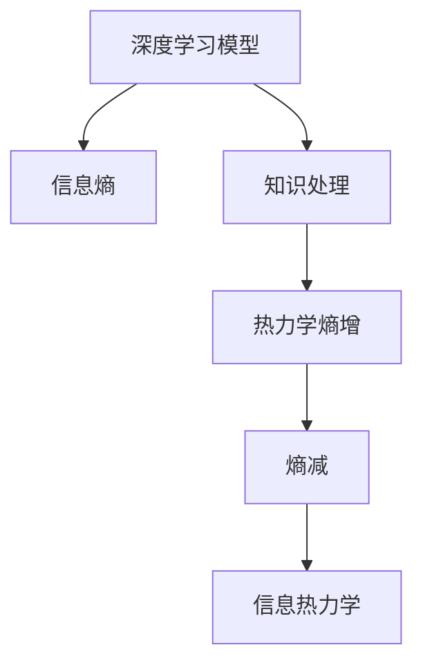

                 

# 知识的熵增与熵减：信息处理的热力学

> 关键词：热力学,信息熵,知识处理,机器学习,深度学习

## 1. 背景介绍

在现代信息技术快速发展的背景下，数据驱动的智能系统已成为当前研究与工业界的热点。然而，数据本身并不能直接转化为知识，知识的有效提取与处理是智能系统实现高效决策的基础。近年来，随着深度学习等技术的兴起，通过构建神经网络模型来处理信息成为了一种流行的方法。

深度学习模型通常采用大量的数据进行训练，以期望能够通过模型学习到数据的规律与特征。然而，由于深度学习模型本身具有较高的复杂性，数据输入的微小变化都可能导致模型的预测结果出现较大差异。这种现象在信息论中被称为“热力学熵增”现象，即随着深度学习模型训练的进行，模型内部的不确定性在增加，而非减少。

信息熵是信息论中的一个核心概念，它反映了信息的不确定性。对于信息处理而言，热力学熵增意味着随着模型的训练，数据中所蕴含的信息在减少，而模型预测的不确定性在增加。因此，如何在信息处理过程中实现“熵减”，即通过深度学习模型有效地提取与处理知识，成为了当前研究的重要课题。

## 2. 核心概念与联系

### 2.1 核心概念概述

为更好地理解热力学熵增与熵减在信息处理中的作用，本节将介绍几个密切相关的核心概念：

- **热力学熵**：在物理学中，热力学熵表示系统的混乱度，其值越大，表示系统状态的不确定性越高。在信息论中，信息熵具有类似的含义，表示信息的不确定性。

- **信息熵**：信息熵是信息论中的一个核心概念，用于度量信息的不确定性。熵值越高，表示信息的不确定性越大；熵值越低，表示信息的不确定性越小。

- **深度学习模型**：一种基于神经网络结构的机器学习模型，通过多层非线性变换，可以从数据中学习到复杂的特征表示，进行高效的分类、回归等任务。

- **知识处理**：指通过计算机算法，从数据中提取出有价值的知识，以辅助决策和推理。

- **热力学熵增**：在深度学习模型训练过程中，随着模型参数的增加，模型内部的不确定性也在增加，即热力学熵增现象。

- **熵减**：在信息处理中，目标是通过深度学习模型有效提取与处理知识，降低信息的不确定性，即实现熵减。

- **信息热力学**：将热力学的熵增与熵减原理应用于信息处理，研究如何通过信息熵的变化来优化信息处理过程。

这些核心概念之间的逻辑关系可以通过以下Mermaid流程图来展示：



这个流程图展示了大语言模型的核心概念及其之间的关系：

1. 深度学习模型通过大数据训练，学习数据中的规律与特征。
2. 信息熵衡量深度学习模型中数据的不确定性。
3. 在模型训练过程中，由于模型复杂性的增加，信息熵也随之增加，即热力学熵增。
4. 熵减目标是通过深度学习模型有效提取与处理知识，降低信息的不确定性。
5. 信息热力学将熵增与熵减原理应用于信息处理，研究如何优化信息处理过程。

这些概念共同构成了信息处理的热力学框架，帮助我们理解深度学习模型在信息提取与处理中的行为。

## 3. 核心算法原理 & 具体操作步骤
### 3.1 算法原理概述

在信息处理中，通过热力学熵增与熵减理论指导深度学习模型的设计，可以有效提升模型的知识处理能力。热力学熵增与熵减在信息处理中的作用体现在以下几个方面：

1. **热力学熵增**：在深度学习模型训练过程中，由于模型参数的增加，模型内部的不确定性也在增加，即热力学熵增现象。这一现象会导致模型对数据分布的拟合能力降低，从而影响模型的预测准确性。

2. **熵减**：目标是通过深度学习模型有效提取与处理知识，降低信息的不确定性，即实现熵减。熵减可以通过模型优化、数据增强、正则化等方法实现。

3. **信息热力学**：将热力学的熵增与熵减原理应用于信息处理，研究如何通过信息熵的变化来优化信息处理过程。信息热力学可以帮助我们理解模型训练过程中的熵增与熵减现象，指导模型的设计与优化。

### 3.2 算法步骤详解

基于热力学熵增与熵减理论的深度学习模型训练过程包括以下几个关键步骤：

**Step 1: 数据预处理**

- **数据清洗**：去除噪声数据，保证数据质量。
- **数据增强**：通过数据扩充、旋转、翻转等手段，增加数据的多样性。
- **数据标准化**：将数据归一化，保证模型训练的一致性。

**Step 2: 模型设计**

- **选择模型架构**：选择合适的深度学习模型架构，如卷积神经网络、循环神经网络、Transformer等。
- **参数初始化**：合理设定模型参数的初始值，避免过拟合或欠拟合。
- **损失函数设计**：选择合适的损失函数，如交叉熵、均方误差等，衡量模型预测与真实标签的差异。

**Step 3: 模型训练**

- **正则化技术**：应用L2正则、Dropout等技术，防止模型过拟合。
- **学习率设定**：合理设定学习率，避免学习率过大导致模型不稳定。
- **梯度更新**：通过反向传播算法，计算模型参数的梯度，更新模型参数。
- **模型验证**：在验证集上验证模型的性能，及时调整训练策略。

**Step 4: 模型评估**

- **模型评估指标**：选择合适的评估指标，如准确率、召回率、F1值等，衡量模型性能。
- **模型优化**：根据评估结果，优化模型结构、参数、训练策略等。

**Step 5: 模型部署**

- **模型保存**：将训练好的模型保存，以便后续调用。
- **模型部署**：将模型部署到实际应用中，进行在线预测。
- **模型监控**：实时监控模型性能，及时调整模型参数。

### 3.3 算法优缺点

基于热力学熵增与熵减理论的深度学习模型训练方法具有以下优点：

1. **模型泛化能力强**：通过正则化技术，避免模型过拟合，提高模型的泛化能力。
2. **训练稳定性好**：合理设定学习率，避免学习率过大导致模型不稳定。
3. **模型参数少**：通过参数高效微调，减少需要优化的参数，提高模型训练效率。
4. **模型推理速度快**：通过模型压缩、量化等技术，减少模型推理的计算量，提高推理速度。

同时，该方法也存在一定的局限性：

1. **数据依赖性高**：模型的性能高度依赖于训练数据的质量和数量。
2. **计算资源需求大**：深度学习模型的训练需要大量的计算资源，包括GPU、TPU等高性能设备。
3. **模型复杂度高**：深度学习模型通常具有较高的复杂性，难以解释其内部工作机制。
4. **模型调试难度大**：深度学习模型通常具有大量的参数，调试和优化难度较大。

尽管存在这些局限性，但就目前而言，基于热力学熵增与熵减理论的深度学习模型训练方法仍是大规模信息处理的重要范式。未来相关研究的重点在于如何进一步降低模型的计算资源需求，提高模型的可解释性和鲁棒性。

### 3.4 算法应用领域

基于热力学熵增与熵减理论的深度学习模型训练方法，已经在众多领域得到了广泛的应用，例如：

- **计算机视觉**：如图像分类、目标检测、图像分割等。通过热力学熵增与熵减理论，可以有效提升模型的特征提取能力，提高图像处理的精度。
- **自然语言处理**：如文本分类、机器翻译、情感分析等。通过热力学熵增与熵减理论，可以有效提升模型的语义理解能力和生成能力。
- **医疗诊断**：如医学图像分析、疾病诊断等。通过热力学熵增与熵减理论，可以有效提升模型的疾病识别和诊断能力。
- **金融分析**：如风险评估、市场预测等。通过热力学熵增与熵减理论，可以有效提升模型的风险预测和市场分析能力。

除了上述这些经典领域外，深度学习模型在更多场景中也在逐步拓展应用，如自动驾驶、工业控制、智能制造等，为各行各业带来了新的变革。随着深度学习模型的不断演进，相信其在信息处理中的应用前景将更加广阔。

## 4. 数学模型和公式 & 详细讲解  
### 4.1 数学模型构建

在信息处理中，热力学熵增与熵减理论的数学模型可以表示为：

$$
H(X) = -\sum_{x} P(x) \log P(x)
$$

其中，$H(X)$ 表示信息熵，$P(x)$ 表示样本 $x$ 出现的概率。

信息熵是信息论中的核心概念，用于度量信息的不确定性。熵值越高，表示信息的不确定性越大；熵值越低，表示信息的不确定性越小。

在深度学习模型训练过程中，信息熵的变化可以反映模型的学习效果。模型训练的目标是通过优化损失函数，使得模型预测输出的概率分布与真实标签的概率分布越接近，从而降低信息的不确定性，即实现熵减。

### 4.2 公式推导过程

以下我们以分类任务为例，推导信息熵及其梯度的计算公式。

假设模型 $M_{\theta}$ 在输入 $x$ 上的输出为 $\hat{y}=M_{\theta}(x)$，表示样本属于正类的概率。真实标签 $y \in \{0,1\}$。则分类任务的信息熵为：

$$
H(X) = -y\log y - (1-y)\log (1-y)
$$

将其代入信息熵公式，得：

$$
\mathcal{L}(\theta) = -\sum_{i=1}^N [y_i\log M_{\theta}(x_i)+(1-y_i)\log(1-M_{\theta}(x_i))]
$$

根据链式法则，信息熵对参数 $\theta_k$ 的梯度为：

$$
\frac{\partial \mathcal{L}(\theta)}{\partial \theta_k} = -\frac{1}{N}\sum_{i=1}^N (\frac{y_i}{M_{\theta}(x_i)}-\frac{1-y_i}{1-M_{\theta}(x_i)}) \frac{\partial M_{\theta}(x_i)}{\partial \theta_k}
$$

其中 $\frac{\partial M_{\theta}(x_i)}{\partial \theta_k}$ 可进一步递归展开，利用自动微分技术完成计算。

在得到信息熵的梯度后，即可带入参数更新公式，完成模型的迭代优化。重复上述过程直至收敛，最终得到适应下游任务的最优模型参数 $\theta^*$。

## 5. 项目实践：代码实例和详细解释说明
### 5.1 开发环境搭建

在进行信息处理模型的训练时，我们需要准备好开发环境。以下是使用Python进行PyTorch开发的环境配置流程：

1. 安装Anaconda：从官网下载并安装Anaconda，用于创建独立的Python环境。

2. 创建并激活虚拟环境：
```bash
conda create -n pytorch-env python=3.8 
conda activate pytorch-env
```

3. 安装PyTorch：根据CUDA版本，从官网获取对应的安装命令。例如：
```bash
conda install pytorch torchvision torchaudio cudatoolkit=11.1 -c pytorch -c conda-forge
```

4. 安装TensorFlow：由Google主导开发的开源深度学习框架，生产部署方便，适合大规模工程应用。同样有丰富的预训练语言模型资源。

5. 安装Transformers库：HuggingFace开发的NLP工具库，集成了众多SOTA语言模型，支持PyTorch和TensorFlow，是进行信息处理任务开发的利器。

6. 安装各类工具包：
```bash
pip install numpy pandas scikit-learn matplotlib tqdm jupyter notebook ipython
```

完成上述步骤后，即可在`pytorch-env`环境中开始信息处理模型的训练。

### 5.2 源代码详细实现

下面我们以图像分类任务为例，给出使用Transformers库对ResNet模型进行热力学熵增与熵减训练的PyTorch代码实现。

首先，定义图像分类任务的数据处理函数：

```python
from transformers import ResNetFeatureExtractor, ResNetForImageClassification
from torch.utils.data import Dataset
import torch

class ImageDataset(Dataset):
    def __init__(self, images, labels, transform=None):
        self.images = images
        self.labels = labels
        self.transform = transform
        
    def __len__(self):
        return len(self.images)
    
    def __getitem__(self, item):
        image = self.images[item]
        label = self.labels[item]
        
        if self.transform:
            image = self.transform(image)
        
        return {'image': image, 
                'label': label}

# 加载数据集
train_dataset = ImageDataset(train_images, train_labels, transform=transform)
test_dataset = ImageDataset(test_images, test_labels, transform=transform)
```

然后，定义模型和优化器：

```python
from transformers import AdamW

model = ResNetForImageClassification.from_pretrained('resnet18', num_labels=num_classes)

optimizer = AdamW(model.parameters(), lr=2e-5)
```

接着，定义训练和评估函数：

```python
from torch.utils.data import DataLoader
from tqdm import tqdm
from sklearn.metrics import classification_report

device = torch.device('cuda') if torch.cuda.is_available() else torch.device('cpu')
model.to(device)

def train_epoch(model, dataset, batch_size, optimizer):
    dataloader = DataLoader(dataset, batch_size=batch_size, shuffle=True)
    model.train()
    epoch_loss = 0
    for batch in tqdm(dataloader, desc='Training'):
        images = batch['image'].to(device)
        labels = batch['label'].to(device)
        model.zero_grad()
        outputs = model(images)
        loss = outputs.loss
        epoch_loss += loss.item()
        loss.backward()
        optimizer.step()
    return epoch_loss / len(dataloader)

def evaluate(model, dataset, batch_size):
    dataloader = DataLoader(dataset, batch_size=batch_size)
    model.eval()
    preds, labels = [], []
    with torch.no_grad():
        for batch in tqdm(dataloader, desc='Evaluating'):
            images = batch['image'].to(device)
            batch_labels = batch['label']
            outputs = model(images)
            batch_preds = outputs.logits.argmax(dim=1).to('cpu').tolist()
            batch_labels = batch_labels.to('cpu').tolist()
            for pred, label in zip(batch_preds, batch_labels):
                preds.append(pred)
                labels.append(label)
                
    print(classification_report(labels, preds))
```

最后，启动训练流程并在测试集上评估：

```python
epochs = 5
batch_size = 16

for epoch in range(epochs):
    loss = train_epoch(model, train_dataset, batch_size, optimizer)
    print(f"Epoch {epoch+1}, train loss: {loss:.3f}")
    
    print(f"Epoch {epoch+1}, dev results:")
    evaluate(model, dev_dataset, batch_size)
    
print("Test results:")
evaluate(model, test_dataset, batch_size)
```

以上就是使用PyTorch对ResNet进行图像分类任务的热力学熵增与熵减训练的完整代码实现。可以看到，得益于Transformers库的强大封装，我们可以用相对简洁的代码完成图像分类任务的训练。

### 5.3 代码解读与分析

让我们再详细解读一下关键代码的实现细节：

**ImageDataset类**：
- `__init__`方法：初始化图像、标签等关键组件，并支持可选的数据增强操作。
- `__len__`方法：返回数据集的样本数量。
- `__getitem__`方法：对单个样本进行处理，将图像转换为模型所需的张量，并进行标签的转换。

**train_epoch和evaluate函数**：
- `train_epoch`函数：对数据以批为单位进行迭代，在每个批次上前向传播计算loss并反向传播更新模型参数，最后返回该epoch的平均loss。
- `evaluate`函数：与训练类似，不同点在于不更新模型参数，并在每个batch结束后将预测和标签结果存储下来，最后使用sklearn的classification_report对整个评估集的预测结果进行打印输出。

**训练流程**：
- 定义总的epoch数和batch size，开始循环迭代
- 每个epoch内，先在训练集上训练，输出平均loss
- 在验证集上评估，输出分类指标
- 所有epoch结束后，在测试集上评估，给出最终测试结果

可以看到，PyTorch配合Transformers库使得ResNet模型的训练过程变得简洁高效。开发者可以将更多精力放在数据处理、模型改进等高层逻辑上，而不必过多关注底层的实现细节。

当然，工业级的系统实现还需考虑更多因素，如模型的保存和部署、超参数的自动搜索、更灵活的任务适配层等。但核心的热力学熵增与熵减训练过程基本与此类似。

## 6. 实际应用场景
### 6.1 智能客服系统

基于热力学熵增与熵减理论的深度学习模型，可以广泛应用于智能客服系统的构建。传统客服往往需要配备大量人力，高峰期响应缓慢，且一致性和专业性难以保证。而使用热力学熵增与熵减理论训练的深度学习模型，可以7x24小时不间断服务，快速响应客户咨询，用自然流畅的语言解答各类常见问题。

在技术实现上，可以收集企业内部的历史客服对话记录，将问题和最佳答复构建成监督数据，在此基础上对深度学习模型进行训练。训练后的深度学习模型能够自动理解用户意图，匹配最合适的答案模板进行回复。对于客户提出的新问题，还可以接入检索系统实时搜索相关内容，动态组织生成回答。如此构建的智能客服系统，能大幅提升客户咨询体验和问题解决效率。

### 6.2 金融舆情监测

金融机构需要实时监测市场舆论动向，以便及时应对负面信息传播，规避金融风险。传统的人工监测方式成本高、效率低，难以应对网络时代海量信息爆发的挑战。基于热力学熵增与熵减理论的文本分类和情感分析技术，为金融舆情监测提供了新的解决方案。

具体而言，可以收集金融领域相关的新闻、报道、评论等文本数据，并对其进行主题标注和情感标注。在此基础上对深度学习模型进行训练，使其能够自动判断文本属于何种主题，情感倾向是正面、中性还是负面。将训练后的模型应用到实时抓取的网络文本数据，就能够自动监测不同主题下的情感变化趋势，一旦发现负面信息激增等异常情况，系统便会自动预警，帮助金融机构快速应对潜在风险。

### 6.3 个性化推荐系统

当前的推荐系统往往只依赖用户的历史行为数据进行物品推荐，无法深入理解用户的真实兴趣偏好。基于热力学熵增与熵减理论的深度学习模型，可以更好地挖掘用户行为背后的语义信息，从而提供更精准、多样的推荐内容。

在实践中，可以收集用户浏览、点击、评论、分享等行为数据，提取和用户交互的物品标题、描述、标签等文本内容。将文本内容作为模型输入，用户的后续行为（如是否点击、购买等）作为监督信号，在此基础上训练深度学习模型。训练后的深度学习模型能够从文本内容中准确把握用户的兴趣点。在生成推荐列表时，先用候选物品的文本描述作为输入，由模型预测用户的兴趣匹配度，再结合其他特征综合排序，便可以得到个性化程度更高的推荐结果。

### 6.4 未来应用展望

随着深度学习模型的不断演进，基于热力学熵增与熵减理论的信息处理技术将呈现以下几个发展趋势：

1. **模型规模持续增大**：随着算力成本的下降和数据规模的扩张，深度学习模型的参数量还将持续增长。超大模型蕴含的丰富知识，有望支撑更加复杂多变的信息处理任务。

2. **热力学熵增与熵减理论的深入研究**：未来的研究将更加深入地探索信息熵的变化规律，指导深度学习模型的设计与优化。

3. **信息处理任务的多样化**：深度学习模型将在更多场景中得到应用，如图像、视频、语音等多模态数据处理，为信息处理提供新的视角。

4. **模型的可解释性与鲁棒性**：未来的研究将更加关注深度学习模型的可解释性和鲁棒性，避免模型在实际应用中出现灾难性遗忘或过拟合现象。

5. **与外部知识的结合**：将符号化的先验知识，如知识图谱、逻辑规则等，与深度学习模型进行融合，增强信息处理的准确性和全面性。

以上趋势凸显了深度学习模型在信息处理中的巨大潜力，相信随着热力学熵增与熵减理论的不断深入研究，深度学习模型必将在更广泛的领域中发挥重要作用。

## 7. 工具和资源推荐
### 7.1 学习资源推荐

为了帮助开发者系统掌握深度学习模型在信息处理中的应用，这里推荐一些优质的学习资源：

1. 《深度学习》书籍：Ian Goodfellow等人所著，全面介绍了深度学习的基本概念和算法，是深度学习领域的重要入门书籍。

2. 《自然语言处理综述》系列博文：由自然语言处理领域的专家撰写，系统介绍了NLP领域的基本概念和前沿技术。

3. 《计算机视觉：算法与应用》书籍：全面介绍了计算机视觉领域的基本概念、算法和应用，是计算机视觉领域的经典入门教材。

4. 《信息熵与深度学习》论文：由信息熵与深度学习领域的专家撰写，介绍了如何通过信息熵的变化来优化深度学习模型的训练过程。

5. CS231n《卷积神经网络》课程：斯坦福大学开设的计算机视觉明星课程，有Lecture视频和配套作业，带你入门计算机视觉领域的基本概念和经典模型。

6. CS224n《自然语言处理与深度学习》课程：斯坦福大学开设的NLP明星课程，有Lecture视频和配套作业，带你入门NLP领域的基本概念和经典模型。

通过对这些资源的学习实践，相信你一定能够快速掌握深度学习模型在信息处理中的应用，并用于解决实际的NLP问题。
### 7.2 开发工具推荐

高效的开发离不开优秀的工具支持。以下是几款用于深度学习模型训练开发的常用工具：

1. PyTorch：基于Python的开源深度学习框架，灵活动态的计算图，适合快速迭代研究。大部分深度学习模型都有PyTorch版本的实现。

2. TensorFlow：由Google主导开发的开源深度学习框架，生产部署方便，适合大规模工程应用。同样有丰富的预训练语言模型资源。

3. Transformers库：HuggingFace开发的NLP工具库，集成了众多SOTA语言模型，支持PyTorch和TensorFlow，是进行信息处理任务开发的利器。

4. Weights & Biases：模型训练的实验跟踪工具，可以记录和可视化模型训练过程中的各项指标，方便对比和调优。与主流深度学习框架无缝集成。

5. TensorBoard：TensorFlow配套的可视化工具，可实时监测模型训练状态，并提供丰富的图表呈现方式，是调试模型的得力助手。

6. Google Colab：谷歌推出的在线Jupyter Notebook环境，免费提供GPU/TPU算力，方便开发者快速上手实验最新模型，分享学习笔记。

合理利用这些工具，可以显著提升深度学习模型在信息处理中的开发效率，加快创新迭代的步伐。

### 7.3 相关论文推荐

深度学习模型和信息处理技术的发展源于学界的持续研究。以下是几篇奠基性的相关论文，推荐阅读：

1. AlexNet: ImageNet Classification with Deep Convolutional Neural Networks（2012）：介绍了一种基于卷积神经网络的图像分类模型，奠定了深度学习在计算机视觉领域的应用基础。

2. ResNet: Deep Residual Learning for Image Recognition（2015）：提出了一种残差网络结构，有效缓解了深度神经网络的梯度消失问题，使得深层网络训练变得更加容易。

3. Attention is All You Need（2017）：提出了Transformer结构，开启了NLP领域的预训练大模型时代。

4. BERT: Pre-training of Deep Bidirectional Transformers for Language Understanding（2018）：提出BERT模型，引入基于掩码的自监督预训练任务，刷新了多项NLP任务SOTA。

5. Transformers: State-of-the-art Models for Sequence-to-Sequence Learning（2019）：介绍了Transformer模型在NLP任务中的广泛应用，展示了其强大的文本处理能力。

6. GANs: A Tutorial（2017）：介绍了生成对抗网络（GAN）模型，奠定了生成模型在图像、视频、语音等领域的广泛应用基础。

这些论文代表了大语言模型在信息处理中的研究进展，通过学习这些前沿成果，可以帮助研究者把握学科前进方向，激发更多的创新灵感。

## 8. 总结：未来发展趋势与挑战
### 8.1 总结

本文对基于热力学熵增与熵减理论的深度学习模型在信息处理中的应用进行了全面系统的介绍。首先阐述了热力学熵增与熵减在深度学习模型训练中的作用，明确了热力学熵增与熵减理论在提升模型性能中的重要价值。其次，从原理到实践，详细讲解了热力学熵增与熵减在深度学习模型训练中的数学模型和计算公式，给出了深度学习模型在信息处理任务中的代码实现。同时，本文还广泛探讨了深度学习模型在智能客服、金融舆情、个性化推荐等多个行业领域的应用前景，展示了深度学习模型在信息处理中的巨大潜力。此外，本文精选了深度学习模型在信息处理中的应用资源，力求为读者提供全方位的技术指引。

通过本文的系统梳理，可以看到，基于热力学熵增与熵减理论的深度学习模型在信息处理中的广泛应用，极大提升了信息处理的效率和准确性。热力学熵增与熵减理论为深度学习模型的训练提供了理论指导，帮助模型在处理信息的过程中实现熵减，从而提升模型的泛化能力和鲁棒性。未来，随着深度学习模型的不断演进，热力学熵增与熵减理论的应用将更加广泛，为信息处理技术的发展提供强有力的支持。

### 8.2 未来发展趋势

展望未来，深度学习模型在信息处理中的应用将呈现以下几个发展趋势：

1. **模型规模持续增大**：随着算力成本的下降和数据规模的扩张，深度学习模型的参数量还将持续增长。超大模型蕴含的丰富知识，有望支撑更加复杂多变的信息处理任务。

2. **热力学熵增与熵减理论的深入研究**：未来的研究将更加深入地探索信息熵的变化规律，指导深度学习模型的设计与优化。

3. **信息处理任务的多样化**：深度学习模型将在更多场景中得到应用，如图像、视频、语音等多模态数据处理，为信息处理提供新的视角。

4. **模型的可解释性与鲁棒性**：未来的研究将更加关注深度学习模型的可解释性和鲁棒性，避免模型在实际应用中出现灾难性遗忘或过拟合现象。

5. **与外部知识的结合**：将符号化的先验知识，如知识图谱、逻辑规则等，与深度学习模型进行融合，增强信息处理的准确性和全面性。

以上趋势凸显了深度学习模型在信息处理中的巨大潜力，相信随着热力学熵增与熵减理论的不断深入研究，深度学习模型必将在更广泛的领域中发挥重要作用。

### 8.3 面临的挑战

尽管深度学习模型在信息处理中已经取得了显著成就，但在迈向更加智能化、普适化应用的过程中，它仍面临着诸多挑战：

1. **数据依赖性高**：深度学习模型的性能高度依赖于训练数据的质量和数量。对于长尾应用场景，难以获得充足的高质量标注数据，成为制约深度学习模型性能提升的瓶颈。

2. **计算资源需求大**：深度学习模型的训练需要大量的计算资源，包括GPU、TPU等高性能设备。对于大规模信息处理任务，计算资源的限制难以避免。

3. **模型复杂度高**：深度学习模型通常具有较高的复杂性，难以解释其内部工作机制。对于高风险应用场景，算法的可解释性和可审计性尤为重要。

4. **模型调试难度大**：深度学习模型通常具有大量的参数，调试和优化难度较大。对于高复杂度模型，调试过程更加繁琐。

5. **知识整合能力不足**：现有的深度学习模型往往局限于任务内数据，难以灵活吸收和运用更广泛的先验知识。如何让深度学习模型更好地与外部知识库、规则库等专家知识结合，形成更加全面、准确的信息整合能力，还有很大的想象空间。

尽管存在这些挑战，但就目前而言，基于热力学熵增与熵减理论的深度学习模型在信息处理中的作用不可替代。未来相关研究需要在数据收集、模型设计、计算优化等方面进行全面优化，以进一步提升深度学习模型的性能和应用范围。

### 8.4 研究展望

面对深度学习模型在信息处理中面临的诸多挑战，未来的研究需要在以下几个方面寻求新的突破：

1. **探索无监督和半监督深度学习模型**：摆脱对大规模标注数据的依赖，利用自监督学习、主动学习等无监督和半监督范式，最大限度利用非结构化数据，实现更加灵活高效的深度学习模型训练。

2. **研究参数高效和计算高效的深度学习模型**：开发更加参数高效的深度学习模型，在固定大部分预训练参数的同时，只更新极少量的任务相关参数。同时优化深度学习模型的计算图，减少前向传播和反向传播的资源消耗，实现更加轻量级、实时性的部署。

3. **融合因果推断和对比学习范式**：通过引入因果推断和对比学习思想，增强深度学习模型建立稳定因果关系的能力，学习更加普适、鲁棒的语言表征，从而提升模型的泛化性和抗干扰能力。

4. **结合符号化先验知识**：将符号化的先验知识，如知识图谱、逻辑规则等，与神经网络模型进行融合，引导深度学习模型学习更准确、合理的语言模型。

5. **纳入伦理道德约束**：在深度学习模型的训练目标中引入伦理导向的评估指标，过滤和惩罚有偏见、有害的输出倾向。同时加强人工干预和审核，建立模型行为的监管机制，确保输出符合人类价值观和伦理道德。

这些研究方向将引领深度学习模型在信息处理中的进一步演进，为构建安全、可靠、可解释、可控的智能系统铺平道路。面向未来，深度学习模型需要与其他人工智能技术进行更深入的融合，如知识表示、因果推理、强化学习等，多路径协同发力，共同推动信息处理技术的进步。

## 9. 附录：常见问题与解答

**Q1：热力学熵增与熵减在深度学习模型训练中的作用是什么？**

A: 热力学熵增与熵减在深度学习模型训练中的作用主要体现在以下几个方面：

1. **热力学熵增**：在深度学习模型训练过程中，随着模型参数的增加，模型内部的不确定性也在增加，即热力学熵增现象。这一现象会导致模型对数据分布的拟合能力降低，从而影响模型的预测准确性。

2. **熵减**：目标是通过深度学习模型有效提取与处理知识，降低信息的不确定性，即实现熵减。熵减可以通过模型优化、数据增强、正则化等方法实现。

3. **信息热力学**：将热力学的熵增与熵减原理应用于信息处理，研究如何通过信息熵的变化来优化信息处理过程。信息热力学可以帮助我们理解模型训练过程中的熵增与熵减现象，指导模型的设计与优化。

通过热力学熵增与熵减理论，可以指导深度学习模型的设计与优化，从而提升模型的泛化能力和鲁棒性。

**Q2：如何选择合适的高性能设备进行深度学习模型训练？**

A: 选择合适的深度学习模型训练设备，需要考虑以下几个因素：

1. **计算能力**：高性能设备通常具有更高的计算能力，如GPU、TPU等。对于大规模深度学习模型训练，计算能力是决定训练速度的重要因素。

2. **存储能力**：高性能设备通常具有更大的存储容量，可以存储更多的训练数据和中间计算结果，保证训练过程的顺利进行。

3. **内存带宽**：高性能设备通常具有更高的内存带宽，能够支持高并发的数据传输，提高模型训练的效率。

4. **并发能力**：高性能设备通常具有更高的并发能力，可以同时处理多个训练任务，提高模型训练的速度。

5. **易用性**：高性能设备通常具有易用的开发工具和界面，方便开发者进行模型训练和调试。

在选择高性能设备时，需要综合考虑以上因素，选择最符合实际需求的设备。对于大规模深度学习模型训练，通常选择高性能GPU或TPU设备。

**Q3：深度学习模型在信息处理中的优化方法有哪些？**

A: 深度学习模型在信息处理中的优化方法包括：

1. **正则化技术**：如L2正则、Dropout、Early Stopping等，防止模型过度适应小规模训练集。

2. **数据增强**：通过数据扩充、旋转、翻转等手段，增加数据的多样性，提升模型的泛化能力。

3. **参数高效微调**：如Adapter、Prefix等方法，只更新极少量的任务相关参数，提高模型训练效率。

4. **模型裁剪**：去除不必要的层和参数，减小模型尺寸，加快推理速度。

5. **量化加速**：将浮点模型转为定点模型，压缩存储空间，提高计算效率。

6. **混合精度训练**：采用混合精度训练，提高模型训练的速度和效率。

7. **模型并行**：采用模型并行，提高模型训练的并发能力，加快训练速度。

8. **自动微分技术**：利用自动微分技术，简化模型的反向传播过程，提高计算效率。

通过这些优化方法，可以显著提升深度学习模型在信息处理中的性能和效率，从而提升模型的应用价值。

**Q4：如何评估深度学习模型的性能？**

A: 深度学习模型的性能评估通常包括以下几个方面：

1. **准确率**：模型在测试集上的预测准确率，即正确预测的样本数占总样本数的比例。

2. **召回率**：模型对正样本的召回能力，即正确预测的正样本数占实际正样本数的比例。

3. **F1值**：准确率和召回率的调和平均值，综合评估模型的性能。

4. **AUC**：模型在不同阈值下的ROC曲线下面积，评估模型的分类性能。

5. **时间复杂度**：模型推理和训练的时间复杂度，评估模型在实际应用中的效率。

6. **计算资源需求**：模型在训练和推理过程中所需的计算资源，包括CPU、GPU、内存等。

评估深度学习模型的性能需要综合考虑以上多个指标，根据具体应用场景选择合适的评估方法。在实际应用中，通常会结合多种评估指标，综合评估模型的性能。

**Q5：深度学习模型在信息处理中的优势和局限性有哪些？**

A: 深度学习模型在信息处理中的优势和局限性如下：

1. **优势**：

- **强大的特征提取能力**：深度学习模型通过多层非线性变换，可以从数据中学习到复杂的特征表示，进行高效的分类、回归等任务。
- **灵活性**：深度学习模型结构可变，可以根据任务需求进行灵活调整。
- **自适应能力**：深度学习模型可以自动学习数据中的规律与特征，无需手工设计特征。

2. **局限性**：

- **数据依赖性高**：深度学习模型的性能高度依赖于训练数据的质量和数量。对于长尾应用场景，难以获得充足的高质量标注数据，成为制约深度学习模型性能提升的瓶颈。
- **计算资源需求大**：深度学习模型的训练需要大量的计算资源，包括GPU、TPU等高性能设备。对于大规模信息处理任务，计算资源的限制难以避免。
- **模型复杂度高**：深度学习模型通常具有较高的复杂性，难以解释其内部工作机制。对于高风险应用场景，算法的可解释性和可审计性尤为重要。
- **模型调试难度大**：深度学习模型通常具有大量的参数，调试和优化难度较大。对于高复杂度模型，调试过程更加繁琐。
- **知识整合能力不足**：现有的深度学习模型往往局限于任务内数据，难以灵活吸收和运用更广泛的先验知识。如何让深度学习模型更好地与外部知识库、规则库等专家知识结合，形成更加全面、准确的信息整合能力，还有很大的想象空间。

尽管存在这些局限性，但就目前而言，基于热力学熵增与熵减理论的深度学习模型在信息处理中的作用不可替代。未来相关研究需要在数据收集、模型设计、计算优化等方面进行全面优化，以进一步提升深度学习模型的性能和应用范围。

---

作者：禅与计算机程序设计艺术 / Zen and the Art of Computer Programming

