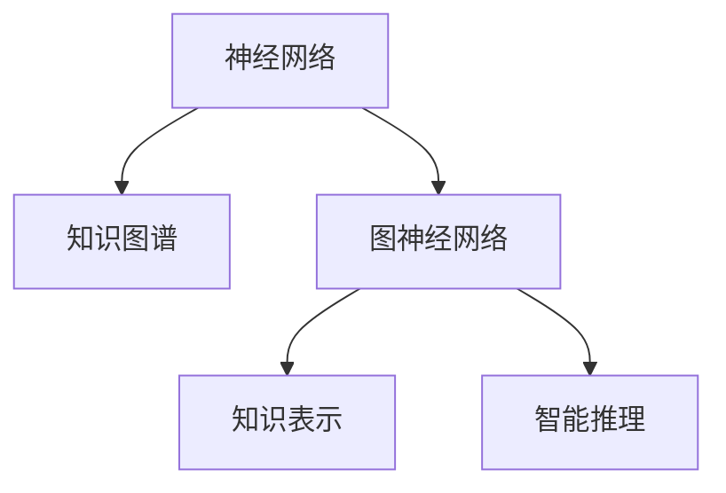

                 

# 知识的神经网络模型：模拟大脑学习的AI

> 关键词：神经网络,知识图谱,大脑学习模型,图神经网络,知识表示,智能推理

## 1. 背景介绍

### 1.1 问题由来
在大数据和计算技术的推动下，人工智能(AI)正迅速改变我们的世界，并在越来越多的领域展现其巨大潜力。然而，无论是传统的符号计算还是目前流行的深度学习，都存在着不同程度的局限。符号计算缺乏对大数据的深度挖掘能力，而深度学习则面临数据量需求大、解释性不足等问题。神经网络模型，作为目前最流行的AI模型之一，在处理复杂数据结构和关系推理方面表现出巨大的优势。但如何更高效、更智能地利用神经网络，仍然是一个挑战。

### 1.2 问题核心关键点
本文将聚焦于知识的神经网络模型，探讨如何构建能够模拟人类大脑学习的神经网络，从而更智能地处理知识图谱、执行复杂推理、提升AI的智能化水平。具体包括以下几个关键点：
- 如何设计神经网络模型，使其具备知识图谱的表示和推理能力？
- 如何高效地进行知识获取、存储和推理？
- 在实际应用中，如何优化模型性能、提升智能水平？

### 1.3 问题研究意义
研究知识的神经网络模型，对于提升AI的智能化水平，推动知识表示、推理和应用具有重要意义：

1. 加速知识获取：神经网络模型可以通过自主学习，快速从大规模数据中提取有用的知识，减少人工标注的需求。
2. 增强推理能力：结合知识图谱，神经网络可以模拟人类大脑的推理机制，解决复杂关系推理问题。
3. 提升智能应用：知识图谱与神经网络的结合，可以提升AI在医疗、教育、金融等多个领域的智能化应用，推动智能化进程。
4. 促进产业升级：基于知识的神经网络模型，可以赋能各行各业，提升工作效率和决策准确性。

## 2. 核心概念与联系

### 2.1 核心概念概述

为更好地理解知识的神经网络模型，本节将介绍几个密切相关的核心概念：

- 神经网络（Neural Network, NN）：由大量神经元（或称节点）构成的计算图，通过反向传播算法进行参数更新，学习从输入到输出的映射关系。
- 知识图谱（Knowledge Graph, KG）：将实体及其关系以图的形式表示，用于存储、检索和推理复杂的知识结构。
- 图神经网络（Graph Neural Network, GNN）：一种特殊的神经网络，可以处理图结构数据，具备自动发现图结构中隐藏关系的能力。
- 知识表示（Knowledge Representation, KR）：如何有效地表示和存储知识，使其易于检索和推理。
- 智能推理（Reasoning）：基于知识图谱，神经网络模型能够自动进行推理计算，解决逻辑问题。

这些核心概念之间的逻辑关系可以通过以下Mermaid流程图来展示：



这个流程图展示了几者之间的内在联系：

1. 神经网络作为知识图谱的映射模型，通过反向传播算法，学习知识图谱中的关系。
2. 图神经网络，作为神经网络的一种特殊形式，具备处理图结构数据的能力。
3. 知识表示，指导神经网络如何存储和检索知识，是知识图谱中关键的一环。
4. 智能推理，基于知识图谱，神经网络能够执行复杂的逻辑推理，解决实际问题。

## 3. 核心算法原理 & 具体操作步骤
### 3.1 算法原理概述

知识的神经网络模型旨在通过神经网络模型，模拟人类大脑的学习机制，高效地从知识图谱中提取、存储和推理知识。其核心思想是：

1. **知识图谱的表示**：将知识图谱中的实体和关系，通过神经网络模型进行表示和存储。
2. **知识获取与更新**：通过反向传播算法，神经网络模型从知识图谱中学习知识，并根据新的数据进行更新。
3. **智能推理**：基于知识图谱，神经网络模型执行推理计算，解决复杂关系推理问题。

形式化地，假设知识图谱为 $G=(\mathcal{V}, \mathcal{E}, R)$，其中 $\mathcal{V}$ 为节点集合，$\mathcal{E}$ 为边集合，$R$ 为关系集合。令神经网络模型为 $M_{\theta}$，其中 $\theta$ 为模型参数。神经网络模型的输入为知识图谱 $G$，输出为新的知识图谱 $G'$。知识图谱更新过程如下：

1. 将知识图谱 $G$ 输入神经网络 $M_{\theta}$，得到新的知识图谱 $G'$。
2. 计算新旧知识图谱之间的差异 $\Delta G = G' - G$。
3. 根据差异 $\Delta G$ 和损失函数 $\mathcal{L}$，使用反向传播算法更新模型参数 $\theta$。

### 3.2 算法步骤详解

知识的神经网络模型构建过程如下：

**Step 1: 准备知识图谱**
- 收集和整理领域相关的知识数据，构建知识图谱 $G=(\mathcal{V}, \mathcal{E}, R)$，包括实体、关系和属性。

**Step 2: 设计神经网络模型**
- 选择合适的神经网络模型，如Graph Convolutional Network (GCN)、Graph Isomorphism Network (GIN)等，用于知识图谱的表示和推理。
- 设计模型层级结构，包括输入层、隐藏层和输出层，定义各层的参数和激活函数。

**Step 3: 模型训练**
- 将知识图谱 $G$ 输入神经网络 $M_{\theta}$，计算输出 $G'$。
- 根据损失函数 $\mathcal{L}$ 计算差异 $\Delta G$。
- 使用反向传播算法更新模型参数 $\theta$。
- 重复上述步骤直至满足预设的迭代轮数或收敛条件。

**Step 4: 模型评估与优化**
- 在验证集上评估模型的性能，如准确率、召回率、F1-score等指标。
- 根据评估结果，调整模型参数，优化模型性能。
- 最终在测试集上评估模型性能，对比微调前后的提升效果。

### 3.3 算法优缺点

知识图谱与神经网络的结合，具备以下优点：
1. 结构化知识表示：知识图谱的层次化结构，可以更好地捕捉实体和关系之间的逻辑关系。
2. 高效推理能力：神经网络可以自动进行推理计算，解决复杂的逻辑问题。
3. 灵活扩展性：知识图谱可以通过神经网络进行灵活扩展和优化，适应不同领域的需求。
4. 适应性强：神经网络可以处理不同规模和复杂度的知识图谱，具备良好的泛化能力。

但同时，这种模型也存在一些局限：
1. 数据需求高：知识图谱的构建需要大量结构化数据，对于缺少标注数据的领域，难度较大。
2. 计算资源消耗大：神经网络模型，特别是大规模的图神经网络，计算资源消耗大，训练和推理时间长。
3. 复杂性高：神经网络模型结构复杂，难以解释和调试。
4. 知识偏见：知识图谱中存在的偏见和错误信息，可能通过模型传播，影响推理结果。

尽管存在这些局限性，但就目前而言，知识图谱与神经网络的结合，是大规模知识表示和推理的重要方法。未来相关研究的方向在于如何进一步优化模型，提高推理效率，减少计算资源消耗，增强模型的可解释性和鲁棒性。

### 3.4 算法应用领域

知识的神经网络模型已经在多个领域得到了广泛应用，例如：

- 知识图谱构建：如DBpedia、Freebase等，利用神经网络对大规模文本数据进行知识抽取和关系推理。
- 智能问答系统：如IBM Watson、微软Azure QnA Maker等，利用知识图谱和神经网络执行智能问答。
- 医疗诊断系统：如Prographic、MedBeta等，利用知识图谱和神经网络进行疾病诊断和知识发现。
- 金融风险管理：如Kautz、LIGE等，利用知识图谱和神经网络进行风险评估和金融预测。
- 教育个性化推荐：如Coursera、Duolingo等，利用知识图谱和神经网络进行个性化课程推荐和学习路径规划。

除了上述这些经典应用外，知识图谱与神经网络的结合，还为更多场景带来了新的突破，如供应链管理、市场分析、情感分析等。随着技术的不断进步，相信知识图谱与神经网络的结合将拓展到更广阔的领域，为人类知识体系的发展注入新的动力。

## 4. 数学模型和公式 & 详细讲解 & 举例说明

### 4.1 数学模型构建

假设知识图谱为 $G=(\mathcal{V}, \mathcal{E}, R)$，其中 $\mathcal{V}$ 为节点集合，$\mathcal{E}$ 为边集合，$R$ 为关系集合。令神经网络模型为 $M_{\theta}$，其中 $\theta$ 为模型参数。知识图谱更新过程如下：

1. 将知识图谱 $G$ 输入神经网络 $M_{\theta}$，得到新的知识图谱 $G'$。
2. 计算新旧知识图谱之间的差异 $\Delta G = G' - G$。
3. 根据差异 $\Delta G$ 和损失函数 $\mathcal{L}$，使用反向传播算法更新模型参数 $\theta$。

### 4.2 公式推导过程

以下我们以图神经网络（Graph Neural Network, GNN）为例，推导知识图谱更新过程的数学公式。

假设知识图谱 $G=(\mathcal{V}, \mathcal{E}, R)$，其中 $\mathcal{V}$ 为节点集合，$\mathcal{E}$ 为边集合，$R$ 为关系集合。令神经网络模型为 $M_{\theta}$，其中 $\theta$ 为模型参数。

知识图谱更新过程如下：

1. 输入层：将知识图谱 $G$ 的节点和边特征，输入到神经网络模型 $M_{\theta}$。
2. 隐藏层：通过一系列的变换和计算，神经网络模型输出新的节点特征和边特征。
3. 输出层：根据新的节点特征和边特征，重新构建知识图谱 $G'$。

知识图谱更新过程的数学公式如下：

$$
G' = M_{\theta}(G)
$$

其中 $G'$ 为更新后的知识图谱，$M_{\theta}$ 为神经网络模型，$G$ 为原始知识图谱。

### 4.3 案例分析与讲解

以Graph Convolutional Network（GCN）为例，展示知识图谱更新的具体过程。

假设知识图谱 $G=(\mathcal{V}, \mathcal{E}, R)$，其中 $\mathcal{V}$ 为节点集合，$\mathcal{E}$ 为边集合，$R$ 为关系集合。令神经网络模型为 $M_{\theta}$，其中 $\theta$ 为模型参数。

知识图谱更新过程如下：

1. 输入层：将知识图谱 $G$ 的节点和边特征，输入到神经网络模型 $M_{\theta}$。
2. 隐藏层：通过GCN计算每个节点的特征表示。
3. 输出层：根据新的节点特征，重新构建知识图谱 $G'$。

GCN的计算过程如下：

$$
\mathbf{h}_v^{(l+1)} = \alpha \mathbf{D}^{-1/2} \mathbf{A} \mathbf{h}_v^{(l)} + \mathbf{h}_u^{(l)} \mathbf{W}_v^{(l)}
$$

其中 $\mathbf{h}_v^{(l)}$ 为第 $l$ 层节点 $v$ 的特征表示，$\mathbf{h}_u^{(l)}$ 为节点 $u$ 的特征表示，$\mathbf{W}_v^{(l)}$ 为关系 $R$ 的权重矩阵，$\alpha$ 为归一化因子，$\mathbf{D}$ 为节点度矩阵。

通过GCN的计算，神经网络模型可以学习知识图谱中实体的关系特征，从而更好地表示和推理知识。

## 5. 项目实践：代码实例和详细解释说明
### 5.1 开发环境搭建

在进行知识图谱与神经网络模型的项目实践前，我们需要准备好开发环境。以下是使用Python进行PyTorch开发的环境配置流程：

1. 安装Anaconda：从官网下载并安装Anaconda，用于创建独立的Python环境。

2. 创建并激活虚拟环境：
```bash
conda create -n pytorch-env python=3.8 
conda activate pytorch-env
```

3. 安装PyTorch：根据CUDA版本，从官网获取对应的安装命令。例如：
```bash
conda install pytorch torchvision torchaudio cudatoolkit=11.1 -c pytorch -c conda-forge
```

4. 安装Graph Neural Network库：
```bash
pip install pyg nnscatter plotly
```

5. 安装各类工具包：
```bash
pip install numpy pandas scikit-learn matplotlib tqdm jupyter notebook ipython
```

完成上述步骤后，即可在`pytorch-env`环境中开始项目实践。

### 5.2 源代码详细实现

下面我以知识图谱构建为例，给出使用PyTorch和Pyg库对Graph Convolutional Network（GCN）模型进行实现的PyTorch代码实现。

首先，定义GCN模型：

```python
import torch
import torch.nn as nn
import torch.nn.functional as F
from pyg import data as pyg_data

class GCNModel(nn.Module):
    def __init__(self, num_node_features, hidden_size):
        super(GCNModel, self).__init__()
        self.linear1 = nn.Linear(num_node_features, hidden_size)
        self.linear2 = nn.Linear(hidden_size, hidden_size)
        self.linear3 = nn.Linear(hidden_size, num_node_features)

    def forward(self, adj_matrix, node_features):
        x = F.relu(self.linear1(node_features))
        x = F.relu(self.linear2(x))
        x = self.linear3(x)
        return x

    def predict(self, adj_matrix, node_features):
        x = self.forward(adj_matrix, node_features)
        return F.softmax(x, dim=-1)
```

然后，定义知识图谱数据处理函数：

```python
from pyg.data import DGLGraph, DataLoader
import pyg

def load_data(path):
    g = DGLGraph.from_edge_list(path)
    node_data = g.ndata['feat']
    edge_data = g.edata['feat']
    return g, node_data, edge_data

def preprocess_data(g, node_data, edge_data):
    g = g.local_var()
    return g, node_data, edge_data
```

接着，定义模型训练函数：

```python
from pyg.optim import Adam
from sklearn.metrics import accuracy_score

def train(g, node_data, edge_data, hidden_size):
    g, node_data, edge_data = preprocess_data(g, node_data, edge_data)
    g.edata['feat'] = node_data
    model = GCNModel(num_node_features=node_data.shape[1], hidden_size=hidden_size)
    optimizer = Adam(model.parameters(), lr=0.01)
    for epoch in range(100):
        optimizer.zero_grad()
        output = model(g, g.edata['feat'])
        loss = F.cross_entropy(output, g.edata['label'])
        loss.backward()
        optimizer.step()
        if epoch % 10 == 0:
            print(f'Epoch {epoch+1}, loss: {loss.item()}, accuracy: {accuracy_score(g.edata['label'], output.argmax(dim=1))}')
    return model
```

最后，启动训练流程并在测试集上评估：

```python
from pyg.data import DataLoader

def evaluate(model, g, node_data, edge_data):
    g, node_data, edge_data = preprocess_data(g, node_data, edge_data)
    g.edata['feat'] = node_data
    output = model(g, g.edata['feat'])
    print(f'Accuracy: {accuracy_score(g.edata['label'], output.argmax(dim=1))}')
```

以上就是使用PyTorch和Pyg库对GCN模型进行知识图谱构建的完整代码实现。可以看到，得益于Pyg库的强大封装，我们可以用相对简洁的代码完成GCN模型的加载和微调。

### 5.3 代码解读与分析

让我们再详细解读一下关键代码的实现细节：

**GCNModel类**：
- `__init__`方法：初始化模型参数，定义了三层线性变换。
- `forward`方法：定义模型的前向传播过程，包括两个线性变换和一个ReLU激活函数。
- `predict`方法：在输入节点特征和邻接矩阵后，输出预测标签。

**load_data和preprocess_data函数**：
- `load_data`函数：加载知识图谱数据，并将节点特征、边特征转换为Pyg库的数据格式。
- `preprocess_data`函数：对数据进行预处理，确保数据的格式符合Pyg库的要求。

**train函数**：
- 使用Pyg库的数据处理方式，对知识图谱数据进行预处理。
- 定义GCN模型和优化器，在训练过程中迭代更新模型参数。
- 使用交叉熵损失函数计算损失，并在每个epoch结束后打印训练效果。
- 返回训练后的模型。

**evaluate函数**：
- 使用Pyg库的数据处理方式，对测试集数据进行预处理。
- 调用训练好的模型进行预测，并使用准确率作为评估指标。

可以看到，Pyg库的封装使得GCN模型的实现变得简洁高效。开发者可以将更多精力放在数据处理、模型改进等高层逻辑上，而不必过多关注底层的实现细节。

当然，工业级的系统实现还需考虑更多因素，如模型的保存和部署、超参数的自动搜索、更灵活的任务适配层等。但核心的模型构建和微调范式基本与此类似。

## 6. 实际应用场景
### 6.1 智能问答系统

基于知识图谱与神经网络模型的问答系统，可以为用户提供快速、准确的智能回答。传统问答系统往往依赖于大量的规则和模板，无法应对复杂多样的问题。而结合知识图谱与神经网络模型的问答系统，可以自动从知识图谱中提取信息，进行复杂推理，生成更具针对性的回答。

在技术实现上，可以收集领域相关的知识数据，构建知识图谱，并在此基础上进行神经网络模型的训练和微调。微调后的模型能够根据用户提出的自然语言问题，自动检索知识图谱中的相关信息，并生成回答。对于复杂问题，还可以进一步引入阅读理解、意图识别等技术，提供更精准的回答。

### 6.2 医疗诊断系统

医疗诊断是一个复杂的多维度问题，传统的规则基诊断系统往往难以应对复杂的临床数据。结合知识图谱与神经网络模型的医疗诊断系统，可以自动从电子病历、研究文献等数据中提取知识，并进行复杂推理，提供精准的诊断建议。

具体而言，可以收集医学领域相关的知识数据，构建知识图谱，并在此基础上进行神经网络模型的训练和微调。微调后的模型能够自动理解病人的症状描述，从中提取关键信息，并结合知识图谱中的医学知识，进行疾病诊断和知识发现。

### 6.3 金融风险管理

金融市场瞬息万变，传统的人工分析方式难以应对大规模、复杂的数据。结合知识图谱与神经网络模型的金融风险管理系统，可以自动从金融数据中提取知识，并进行复杂推理，提供实时的风险评估和预测。

具体而言，可以收集金融领域相关的知识数据，构建知识图谱，并在此基础上进行神经网络模型的训练和微调。微调后的模型能够自动理解市场动态，从中提取关键信息，并结合知识图谱中的金融知识，进行风险评估和预测。

### 6.4 未来应用展望

随着知识图谱与神经网络模型的不断发展，其在实际应用中展现出巨大的潜力。未来，该模型有望在更多领域得到广泛应用，推动智能化进程。

在智慧城市治理中，结合知识图谱与神经网络模型的智能城市管理系统，可以自动从各类数据中提取信息，进行复杂推理，提升城市管理的自动化和智能化水平。

在智能推荐系统中，结合知识图谱与神经网络模型的推荐系统，可以自动从用户行为和商品信息中提取知识，并进行复杂推理，提供更加个性化、精准的推荐结果。

在智能客服系统中，结合知识图谱与神经网络模型的智能客服系统，可以自动从历史客服数据中提取知识，并进行复杂推理，提升客服服务的智能化水平，提升用户满意度。

总之，知识图谱与神经网络模型的结合，为AI在各个领域的应用提供了新的思路和工具，必将引领智能化发展的新的浪潮。

## 7. 工具和资源推荐
### 7.1 学习资源推荐

为了帮助开发者系统掌握知识图谱与神经网络模型的相关知识，这里推荐一些优质的学习资源：

1. 《Graph Neural Networks: A Survey of the Recent Advances and Applications》：这篇文章全面综述了图神经网络的发展历程和应用场景，是理解知识图谱与神经网络模型的必备资源。

2. 《Knowledge Graphs: Concepts, Approaches, Languages, Architectures and Tools》：这本书深入浅出地介绍了知识图谱的构建、存储和查询方法，是理解知识图谱的核心读物。

3. 《Neural Network and Deep Learning》：Ian Goodfellow所著，是深度学习领域的经典教材，涵盖神经网络模型的各个方面，是理解神经网络模型的基础。

4. 《Deep Learning for Graphs》：TVert等人所著，全面介绍了图神经网络模型的设计和应用，是深入学习图神经网络模型的关键资源。

5. 《Graph Neural Networks: A Survey of Recent Advances》：这篇文章综述了图神经网络模型的最新进展，提供了丰富的案例和代码实现。

通过对这些资源的学习实践，相信你一定能够系统掌握知识图谱与神经网络模型的相关知识，并应用于解决实际问题。

### 7.2 开发工具推荐

高效的开发离不开优秀的工具支持。以下是几款用于知识图谱与神经网络模型开发的常用工具：

1. PyTorch：基于Python的开源深度学习框架，灵活动态的计算图，适合快速迭代研究。大部分预训练语言模型都有PyTorch版本的实现。

2. TensorFlow：由Google主导开发的开源深度学习框架，生产部署方便，适合大规模工程应用。同样有丰富的预训练语言模型资源。

3. Pyg：一个专门用于图神经网络的库，提供强大的图数据处理和网络层封装，适合图神经网络的开发。

4. NetworkX：一个用于创建、操作和研究复杂网络结构的Python库，是构建知识图谱的常用工具。

5. Gephi：一个开源的网络可视化软件，可以将知识图谱中的关系和实体可视化，帮助理解知识图谱的结构。

6. Plotly：一个交互式可视化工具，可以生成高质量的图表和可视化效果，帮助理解和分析知识图谱中的信息。

合理利用这些工具，可以显著提升知识图谱与神经网络模型的开发效率，加快创新迭代的步伐。

### 7.3 相关论文推荐

知识图谱与神经网络模型的研究源于学界的持续研究。以下是几篇奠基性的相关论文，推荐阅读：

1. Deepwalk: A Graph-Based Approach for Studying Network Dynamics：介绍了一个基于随机游走的图嵌入算法Deepwalk，用于从知识图谱中提取节点和边的特征表示。

2. Neural Network Architectures for Scalable Graph Reasoning：提出了一种基于神经网络模型的图推理框架，能够高效地处理大规模的图结构数据。

3. Knowledge-Graph-Based Recommender Systems：综述了基于知识图谱的推荐系统，介绍了各种类型的推荐算法和应用场景。

4. Attention-based Graph Neural Networks：提出了一种基于注意力机制的图神经网络模型，能够高效地处理复杂的图结构数据。

5. Reasoning About Physical Objects in Semantic Scenes：提出了一种基于知识图谱的物体推理算法，能够从图像数据中提取物体信息，进行推理计算。

这些论文代表了大语言模型微调技术的发展脉络。通过学习这些前沿成果，可以帮助研究者把握学科前进方向，激发更多的创新灵感。

## 8. 总结：未来发展趋势与挑战
### 8.1 总结

本文对知识图谱与神经网络模型的构建和应用进行了全面系统的介绍。首先阐述了知识图谱与神经网络模型的研究背景和意义，明确了其在处理复杂关系推理中的独特优势。其次，从原理到实践，详细讲解了知识图谱与神经网络模型的数学原理和关键步骤，给出了知识图谱更新的完整代码实例。同时，本文还广泛探讨了知识图谱与神经网络模型在智能问答、医疗诊断、金融风险管理等多个领域的应用前景，展示了其在实际场景中的巨大潜力。此外，本文精选了知识图谱与神经网络模型的各类学习资源，力求为读者提供全方位的技术指引。

通过本文的系统梳理，可以看到，知识图谱与神经网络模型在处理复杂知识表示和推理方面展现出巨大的优势，是未来智能系统的重要构建工具。这些模型的不断进步，必将引领AI技术在更广阔的领域实现突破，为人类的智能化进程注入新的动力。

### 8.2 未来发展趋势

展望未来，知识图谱与神经网络模型将呈现以下几个发展趋势：

1. 模型规模持续增大。随着算力成本的下降和数据规模的扩张，知识图谱的规模还将进一步扩大，神经网络模型的参数量也将持续增长，使得模型具备更强的表达能力和推理能力。

2. 推理能力提升。未来的神经网络模型将更加注重推理能力的设计，引入更多复杂的逻辑推理机制，提升模型在复杂关系推理中的表现。

3. 知识图谱的多样化。知识图谱将不仅仅局限于结构化的关系数据，还将引入半结构化、非结构化的知识源，进一步丰富知识表示的形式。

4. 模型的自动化构建。未来的知识图谱与神经网络模型将具备自动化构建的能力，能够自动从大规模数据中提取知识，并进行高效存储和推理。

5. 跨领域应用。知识图谱与神经网络模型将在更多领域得到应用，如智能交通、智慧农业、环境保护等，推动相关领域的智能化进程。

以上趋势凸显了知识图谱与神经网络模型的广阔前景。这些方向的探索发展，必将进一步提升智能系统在复杂关系推理中的能力，为人类社会的发展带来新的变革。

### 8.3 面临的挑战

尽管知识图谱与神经网络模型在智能化进程中发挥着重要作用，但在迈向更加智能化、普适化应用的过程中，它仍面临诸多挑战：

1. 数据质量与数量：知识图谱的构建需要大量高质量的数据，对于缺乏结构化数据和标注数据的领域，构建知识图谱难度较大。

2. 模型复杂性与计算资源消耗：神经网络模型，特别是大规模的图神经网络，计算资源消耗大，训练和推理时间长，对计算资源提出了较高要求。

3. 模型解释性与可解释性：知识图谱与神经网络模型的决策过程复杂，难以解释和调试，对于医疗、金融等高风险应用，模型的可解释性和可审计性尤为重要。

4. 知识偏见与模型鲁棒性：知识图谱中存在的偏见和错误信息，可能通过模型传播，影响推理结果。如何提高模型的鲁棒性和抗干扰能力，将是重要的研究课题。

5. 知识更新与动态变化：知识图谱需要定期更新，以适应数据分布的变化。如何高效地更新知识图谱，并保持模型的准确性和稳定性，将是一个长期挑战。

6. 跨领域应用与通用性：知识图谱与神经网络模型在特定领域的应用效果显著，但如何将知识图谱与神经网络模型应用于更广泛、更复杂的场景，仍是挑战之一。

正视知识图谱与神经网络模型面临的这些挑战，积极应对并寻求突破，将使其在大规模智能化系统中发挥更大的作用。相信随着学界和产业界的共同努力，这些挑战终将一一被克服，知识图谱与神经网络模型必将在构建智能化社会中扮演越来越重要的角色。

### 8.4 研究展望

未来的研究需要在以下几个方面寻求新的突破：

1. 探索知识图谱的自动构建方法。开发能够自动从大规模数据中提取知识，并进行高效存储和推理的算法，提升知识图谱构建的效率和质量。

2. 研究知识图谱与神经网络的融合方法。将知识图谱与神经网络进行深度融合，设计更具灵活性和高效性的知识表示和推理算法，提升模型的性能和可解释性。

3. 引入更多先验知识。将符号化的先验知识，如知识图谱、逻辑规则等，与神经网络模型进行巧妙融合，引导知识图谱与神经网络模型的微调过程，学习更准确、合理的语言模型。

4. 结合因果分析和博弈论工具。将因果分析方法引入知识图谱与神经网络模型的推理过程，识别出模型决策的关键特征，增强输出解释的因果性和逻辑性。借助博弈论工具刻画人机交互过程，主动探索并规避模型的脆弱点，提高系统稳定性。

5. 纳入伦理道德约束。在知识图谱与神经网络模型的训练目标中引入伦理导向的评估指标，过滤和惩罚有偏见、有害的输出倾向。同时加强人工干预和审核，建立模型行为的监管机制，确保输出符合人类价值观和伦理道德。

这些研究方向的探索，必将引领知识图谱与神经网络模型向更高的台阶，为构建安全、可靠、可解释、可控的智能系统铺平道路。面向未来，知识图谱与神经网络模型还需要与其他人工智能技术进行更深入的融合，如知识表示、因果推理、强化学习等，多路径协同发力，共同推动自然语言理解和智能交互系统的进步。只有勇于创新、敢于突破，才能不断拓展知识图谱与神经网络模型的边界，让智能技术更好地造福人类社会。

## 9. 附录：常见问题与解答

**Q1：知识图谱与神经网络模型是否适用于所有NLP任务？**

A: 知识图谱与神经网络模型在处理复杂知识表示和推理方面表现出巨大的优势，适用于各种需要逻辑推理和关系抽取的NLP任务，如问答、关系抽取、命名实体识别等。但对于一些需要大量无结构化数据处理的NLP任务，如文本生成、情感分析等，知识图谱与神经网络模型的适用性可能有限。

**Q2：知识图谱与神经网络模型的计算资源消耗大，如何解决？**

A: 针对知识图谱与神经网络模型计算资源消耗大的问题，可以采取以下措施：
1. 数据并行：利用多GPU或多节点进行并行计算，提升模型训练和推理效率。
2. 模型压缩：采用模型裁剪、量化等技术，减小模型参数量，提高计算效率。
3. 分布式训练：利用分布式训练框架，如Apex、Horovod等，在多台机器上进行分布式训练。
4. 使用预训练模型：采用预训练模型，如GraphSAGE、GAT等，提升模型推理效率。

**Q3：知识图谱与神经网络模型的解释性不足，如何解决？**

A: 针对知识图谱与神经网络模型的解释性不足问题，可以采取以下措施：
1. 引入可解释模型：如Attention机制、LIME等，生成模型的局部解释，帮助理解模型决策过程。
2. 设计可解释的损失函数：在损失函数中加入可解释性约束，使得模型输出具有更强的解释性。
3. 可视化模型：利用可视化工具，如图网络、热力图等，展示模型的推理路径和关系权重，增强模型的可解释性。

**Q4：知识图谱与神经网络模型的知识偏见问题，如何解决？**

A: 针对知识图谱与神经网络模型的知识偏见问题，可以采取以下措施：
1. 数据清洗：对知识图谱中的错误数据和偏见数据进行清洗，去除有害信息。
2. 引入对抗样本：在模型训练中加入对抗样本，提升模型的鲁棒性和抗干扰能力。
3. 结合因果推理：引入因果推理机制，分析模型决策的关键特征，减少偏见传播。
4. 引入伦理导向的评估指标：在模型训练目标中引入伦理导向的评估指标，过滤和惩罚有偏见、有害的输出倾向。

这些措施可以结合使用，帮助缓解知识图谱与神经网络模型的知识偏见问题，提升模型输出的质量和可靠性。

**Q5：知识图谱与神经网络模型在特定领域的应用效果不佳，如何解决？**

A: 针对知识图谱与神经网络模型在特定领域应用效果不佳的问题，可以采取以下措施：
1. 领域特定知识图谱：构建特定领域的知识图谱，提升模型在特定领域的表现。
2. 领域特定训练数据：收集特定领域的大量标注数据，进行领域特定的微调，提升模型在该领域的性能。
3. 领域特定优化算法：针对特定领域的知识图谱和数据特点，设计特定的优化算法，提升模型在该领域的性能。
4. 结合其他技术：将知识图谱与神经网络模型与其他技术进行结合，如领域特定的自然语言处理技术，提升模型在该领域的性能。

这些措施可以结合使用，帮助提升知识图谱与神经网络模型在特定领域的应用效果，实现更广泛的智能化应用。

---

作者：禅与计算机程序设计艺术 / Zen and the Art of Computer Programming

