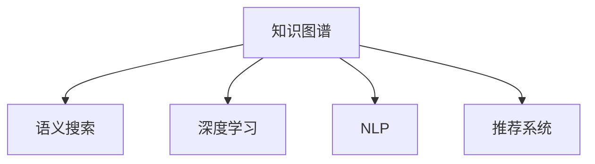

                 

# 知识的结构化与非结构化：发现引擎的挑战

> 关键词：知识图谱、语义搜索、深度学习、自然语言处理、推荐系统

## 1. 背景介绍

在信息爆炸的现代社会，海量的数据如何被有效地组织、搜索和利用，成为了全球知识工作者所面临的巨大挑战。与此同时，深度学习和大数据技术的迅猛发展，为解决这一问题带来了新的曙光。**知识图谱**和**语义搜索**技术，通过将传统的关系型数据库转换为语义化的网络结构，极大地提高了信息的表达和检索效率，从而开启了知识发现和利用的新纪元。

本文旨在通过详尽解析知识图谱和语义搜索的原理与实现，探讨其应用领域的挑战与未来趋势，为该领域的开发者和研究者提供全面的技术指导。

## 2. 核心概念与联系

### 2.1 核心概念概述

为更好地理解知识图谱和语义搜索，我们首先介绍几个关键概念：

- **知识图谱(Knowledge Graph)**：一种语义化的知识表示方法，通过将实体、属性、关系等概念以图的形式进行组织，以更精确和直观地描述和检索知识。

- **语义搜索(Semantic Search)**：与传统的基于关键词的搜索方式不同，语义搜索通过理解查询者的语义意图，提供更准确、更相关的搜索结果。

- **深度学习(Deep Learning)**：一种基于神经网络的机器学习技术，通过多层非线性变换实现特征表示学习。

- **自然语言处理(Natural Language Processing, NLP)**：使计算机能够理解、处理和生成人类语言的技术，是实现语义搜索和知识图谱的关键工具。

- **推荐系统(Recommendation System)**：通过分析用户行为，推荐用户可能感兴趣的商品、内容等，也是知识图谱和语义搜索的重要应用场景。

这些核心概念之间的逻辑关系可以通过以下Mermaid流程图来展示：



这个流程图展示了我们要探讨的关键概念之间的关联：

1. **知识图谱**：提供基础的知识结构。
2. **语义搜索**：利用知识图谱进行语义化的检索。
3. **深度学习**：用于语义表示学习，提高搜索和推荐的精度。
4. **自然语言处理**：是实现语义搜索和知识图谱的关键技术。
5. **推荐系统**：将知识图谱和语义搜索技术应用于推荐场景。

### 2.2 核心概念原理和架构

#### 2.2.1 知识图谱

知识图谱将知识表示为图形结构，其中每个节点表示一个实体，边表示实体之间的关系。知识图谱的构建过程一般包括以下步骤：

1. **实体抽取**：从大量文本数据中抽取实体，如人名、地名、组织机构名等。
2. **关系抽取**：识别实体之间的关系，如"工作于"、"属于"等。
3. **知识融合**：将从不同数据源抽取的知识进行整合，消除冲突，生成一致性的知识图谱。

##### 知识图谱的构建工具
- **GATE (General Architecture for Text Engineering)**：一个开源的自然语言处理框架，提供了丰富的实体识别和关系抽取工具。
- **OpenIE**：基于Web的实体抽取工具，支持从大量文本数据中构建知识图谱。
- **GeoNames**：一个全球地名数据库，提供了丰富的地理实体数据，可供构建地理知识图谱使用。

#### 2.2.2 语义搜索

语义搜索通过理解查询者输入的语义意图，匹配知识图谱中的实体关系，从而返回更加相关的搜索结果。主要包括以下步骤：

1. **意图理解**：通过NLP技术解析查询者的语义意图。
2. **实体识别**：从查询语句中提取实体。
3. **路径匹配**：在知识图谱中匹配符合语义关系的路径。
4. **结果排序**：根据匹配路径的权重对搜索结果进行排序。

##### 语义搜索的实现技术
- **ElasticSearch**：一个开源的分布式搜索和分析引擎，支持语义搜索和知识图谱的查询。
- **Solr**：一个开源的企业级搜索平台，提供了丰富的API和插件，支持语义搜索和知识图谱的集成。
- **IBM Watson**：一个强大的认知AI平台，提供了语义搜索、自然语言理解等多种NLP服务。

#### 2.2.3 深度学习

深度学习利用多层神经网络，自动学习数据特征表示。通过反向传播算法，网络不断调整参数，使得预测值与真实值之间的误差最小化。

##### 深度学习的实现框架
- **TensorFlow**：一个由Google开发的开源深度学习框架，支持分布式计算和多种模型训练。
- **PyTorch**：一个由Facebook开发的开源深度学习框架，以动态计算图为特色，便于研究和实验。
- **Keras**：一个高层API，封装了TensorFlow和Theano等底层框架，便于快速搭建深度学习模型。

#### 2.2.4 自然语言处理

自然语言处理技术包括文本分类、命名实体识别、情感分析、机器翻译等，是实现语义搜索和知识图谱的关键工具。

##### NLP的实现技术
- **spaCy**：一个开源的自然语言处理库，提供了丰富的语言分析和处理功能。
- **NLTK (Natural Language Toolkit)**：一个Python的NLP库，支持文本预处理、分类、标注等多种功能。
- **BERT (Bidirectional Encoder Representations from Transformers)**：一种基于Transformer架构的预训练语言模型，在各种NLP任务上取得了SOTA性能。

#### 2.2.5 推荐系统

推荐系统通过分析用户行为，推荐用户可能感兴趣的商品、内容等。主要包括以下步骤：

1. **用户行为分析**：收集用户浏览、点击、评分等行为数据。
2. **用户画像构建**：根据用户行为数据构建用户画像。
3. **商品画像构建**：根据商品属性和用户画像构建商品画像。
4. **推荐模型训练**：通过机器学习模型训练推荐策略。

##### 推荐系统的实现技术
- **Apache Mahout**：一个开源的机器学习库，提供了多种推荐算法和工具。
- **TensorFlow Recommendations**：TensorFlow的推荐系统模块，提供了丰富的推荐算法和API。
- **LightFM**：一个基于深度学习的推荐框架，支持稀疏和密集矩阵的推荐。

## 3. 核心算法原理 & 具体操作步骤

### 3.1 算法原理概述

知识图谱和语义搜索技术结合深度学习和自然语言处理技术，通过结构化知识表示和语义理解，实现了高效的查询和推荐。其主要算法流程包括：

1. **知识抽取**：从文本数据中抽取实体和关系。
2. **语义理解**：通过NLP技术理解查询者的意图。
3. **知识匹配**：在知识图谱中匹配符合语义关系的路径。
4. **结果生成**：根据匹配结果生成推荐结果或搜索结果。

### 3.2 算法步骤详解

#### 3.2.1 知识抽取

知识抽取是构建知识图谱的第一步，其主要步骤如下：

1. **命名实体识别**：识别文本中的实体，如人名、地名、组织机构名等。
2. **关系抽取**：识别实体之间的关系，如"工作于"、"属于"等。
3. **知识融合**：将从不同数据源抽取的知识进行整合，消除冲突，生成一致性的知识图谱。

##### 命名实体识别

命名实体识别是知识抽取的重要步骤，其算法流程如下：

1. **分词**：将文本分割成词语。
2. **词性标注**：标注每个词语的词性。
3. **命名实体标注**：通过规则或机器学习模型，标注每个词语是否为实体。
4. **命名实体识别**：将标注为实体的词语连接起来，生成命名实体。

##### 关系抽取

关系抽取是知识抽取的另一重要步骤，其算法流程如下：

1. **句法分析**：通过依存句法分析技术，确定句子结构。
2. **实体识别**：通过命名实体识别技术，识别实体。
3. **关系抽取**：通过规则或机器学习模型，抽取实体之间的关系。

#### 3.2.2 语义理解

语义理解是实现语义搜索的关键步骤，其算法流程如下：

1. **查询解析**：通过NLP技术解析查询者的语义意图。
2. **实体识别**：从查询语句中提取实体。
3. **路径匹配**：在知识图谱中匹配符合语义关系的路径。

##### 查询解析

查询解析是理解用户语义意图的重要步骤，其主要算法流程如下：

1. **查询分解**：将查询语句分解成多个子句。
2. **意图识别**：通过意图分类模型，识别查询意图。
3. **实体识别**：通过命名实体识别模型，识别实体。

#### 3.2.3 知识匹配

知识匹配是实现语义搜索和推荐的关键步骤，其算法流程如下：

1. **路径生成**：根据查询意图和实体，生成匹配路径。
2. **路径评分**：根据路径的权重评分，评估匹配路径的质量。
3. **结果排序**：根据路径评分对搜索结果进行排序。

##### 路径生成

路径生成是知识匹配的重要步骤，其主要算法流程如下：

1. **实体嵌入**：将实体转换为向量表示。
2. **关系嵌入**：将关系转换为向量表示。
3. **路径生成**：通过图搜索算法，生成匹配路径。

#### 3.2.4 结果生成

结果生成是实现推荐和搜索的关键步骤，其算法流程如下：

1. **路径评分**：根据路径的权重评分，评估匹配路径的质量。
2. **结果生成**：根据路径评分对搜索结果进行排序。
3. **结果展示**：将搜索结果展示给用户。

### 3.3 算法优缺点

#### 3.3.1 优点

知识图谱和语义搜索技术结合深度学习和自然语言处理技术，其优点如下：

1. **高效检索**：通过结构化知识表示，快速检索匹配结果。
2. **语义理解**：通过语义理解技术，提供更准确的搜索结果。
3. **知识融合**：通过知识融合技术，消除数据冲突，生成一致性的知识图谱。
4. **推荐系统**：通过推荐算法，为用户提供个性化推荐。

#### 3.3.2 缺点

知识图谱和语义搜索技术结合深度学习和自然语言处理技术，其缺点如下：

1. **构建复杂**：构建知识图谱和语义搜索系统需要大量人力和技术投入。
2. **数据依赖**：系统需要大量的标注数据和高质量数据源。
3. **实时性差**：系统响应时间较长，无法满足实时查询的需求。
4. **泛化能力有限**：系统对新领域和新数据源的适应能力较弱。

### 3.4 算法应用领域

知识图谱和语义搜索技术结合深度学习和自然语言处理技术，其应用领域包括但不限于以下几种：

1. **智慧城市**：通过知识图谱和语义搜索技术，实现智慧交通、智慧安防、智慧医疗等应用。
2. **金融科技**：通过知识图谱和语义搜索技术，实现风险评估、反欺诈、客户画像等应用。
3. **电子商务**：通过知识图谱和语义搜索技术，实现商品推荐、用户画像、市场分析等应用。
4. **医疗健康**：通过知识图谱和语义搜索技术，实现疾病诊断、药物推荐、医疗咨询等应用。
5. **社交网络**：通过知识图谱和语义搜索技术，实现社区推荐、内容匹配、关系发现等应用。

## 4. 数学模型和公式 & 详细讲解 & 举例说明

### 4.1 数学模型构建

知识图谱和语义搜索技术的数学模型构建主要包括以下几个方面：

1. **实体嵌入**：将实体转换为向量表示，一般使用Word2Vec、GloVe等方法。
2. **关系嵌入**：将关系转换为向量表示，一般使用TransE、TransH等方法。
3. **路径评分**：根据路径的权重评分，一般使用PageRank、BERT等方法。

#### 4.1.1 实体嵌入

实体嵌入是知识图谱构建的重要步骤，其主要算法流程如下：

1. **共现矩阵**：将实体与实体之间的关系表示为共现矩阵。
2. **矩阵分解**：将共现矩阵分解为低维向量表示。
3. **实体嵌入**：将实体转换为向量表示。

##### Word2Vec模型

Word2Vec是一种基于共现矩阵的实体嵌入方法，其主要算法流程如下：

1. **共现矩阵**：将单词与单词之间的关系表示为共现矩阵。
2. **矩阵分解**：将共现矩阵分解为低维向量表示。
3. **单词嵌入**：将单词转换为向量表示。

Word2Vec模型的数学公式如下：

$$
w_i \leftarrow Softmax(W^TW^Tv_i)
$$

其中 $w_i$ 为单词 $i$ 的向量表示，$v_i$ 为单词 $i$ 的邻接向量，$W$ 为邻接矩阵。

#### 4.1.2 关系嵌入

关系嵌入是知识图谱构建的另一重要步骤，其主要算法流程如下：

1. **共现矩阵**：将实体与实体之间的关系表示为共现矩阵。
2. **矩阵分解**：将共现矩阵分解为低维向量表示。
3. **关系嵌入**：将关系转换为向量表示。

##### TransE模型

TransE是一种基于共现矩阵的关系嵌入方法，其主要算法流程如下：

1. **共现矩阵**：将实体与实体之间的关系表示为共现矩阵。
2. **矩阵分解**：将共现矩阵分解为低维向量表示。
3. **关系嵌入**：将关系转换为向量表示。

TransE模型的数学公式如下：

$$
\mathbf{h}, \mathbf{r}, \mathbf{t} \leftarrow \min_{\mathbf{h}, \mathbf{r}, \mathbf{t}} \|\mathbf{h} + \mathbf{r} \times \mathbf{t}\|_2
$$

其中 $\mathbf{h}$ 为头实体向量，$\mathbf{r}$ 为关系向量，$\mathbf{t}$ 为尾实体向量。

#### 4.1.3 路径评分

路径评分是实现语义搜索和推荐的关键步骤，其主要算法流程如下：

1. **路径生成**：通过图搜索算法，生成匹配路径。
2. **路径评分**：根据路径的权重评分，评估匹配路径的质量。
3. **结果排序**：根据路径评分对搜索结果进行排序。

##### PageRank算法

PageRank是一种基于图结构的路径评分方法，其主要算法流程如下：

1. **矩阵分解**：将图分解为邻接矩阵。
2. **向量迭代**：通过矩阵乘法迭代计算每个节点的权重。
3. **路径评分**：根据节点权重评分路径。

PageRank算法的数学公式如下：

$$
\mathbf{P} \leftarrow (\mathbf{D}^{-1}\mathbf{A}\mathbf{P}) \times \mathbf{P}
$$

其中 $\mathbf{P}$ 为节点权重向量，$\mathbf{A}$ 为邻接矩阵，$\mathbf{D}$ 为度数矩阵。

### 4.2 公式推导过程

#### 4.2.1 Word2Vec

Word2Vec是一种基于共现矩阵的实体嵌入方法，其公式推导过程如下：

1. **共现矩阵**：将单词与单词之间的关系表示为共现矩阵。
2. **矩阵分解**：将共现矩阵分解为低维向量表示。
3. **单词嵌入**：将单词转换为向量表示。

Word2Vec模型的数学公式如下：

$$
w_i \leftarrow Softmax(W^TW^Tv_i)
$$

其中 $w_i$ 为单词 $i$ 的向量表示，$v_i$ 为单词 $i$ 的邻接向量，$W$ 为邻接矩阵。

#### 4.2.2 TransE

TransE是一种基于共现矩阵的关系嵌入方法，其公式推导过程如下：

1. **共现矩阵**：将实体与实体之间的关系表示为共现矩阵。
2. **矩阵分解**：将共现矩阵分解为低维向量表示。
3. **关系嵌入**：将关系转换为向量表示。

TransE模型的数学公式如下：

$$
\mathbf{h}, \mathbf{r}, \mathbf{t} \leftarrow \min_{\mathbf{h}, \mathbf{r}, \mathbf{t}} \|\mathbf{h} + \mathbf{r} \times \mathbf{t}\|_2
$$

其中 $\mathbf{h}$ 为头实体向量，$\mathbf{r}$ 为关系向量，$\mathbf{t}$ 为尾实体向量。

#### 4.2.3 PageRank

PageRank是一种基于图结构的路径评分方法，其公式推导过程如下：

1. **矩阵分解**：将图分解为邻接矩阵。
2. **向量迭代**：通过矩阵乘法迭代计算每个节点的权重。
3. **路径评分**：根据节点权重评分路径。

PageRank算法的数学公式如下：

$$
\mathbf{P} \leftarrow (\mathbf{D}^{-1}\mathbf{A}\mathbf{P}) \times \mathbf{P}
$$

其中 $\mathbf{P}$ 为节点权重向量，$\mathbf{A}$ 为邻接矩阵，$\mathbf{D}$ 为度数矩阵。

### 4.3 案例分析与讲解

#### 4.3.1 Word2Vec

Word2Vec是一种基于共现矩阵的实体嵌入方法，其案例分析如下：

1. **数据准备**：准备一份大规模的文本数据，如维基百科文章。
2. **共现矩阵构建**：将文本数据中的单词构建共现矩阵。
3. **矩阵分解**：将共现矩阵分解为低维向量表示。
4. **单词嵌入**：将单词转换为向量表示。

##### Word2Vec代码示例

```python
import gensim
from gensim.models import Word2Vec

# 准备文本数据
sentences = [["dog", "cat", "chicken"], ["cat", "fish", "dog"]]

# 构建共现矩阵
model = Word2Vec(sentences, min_count=1)

# 获取单词嵌入
word_embedding = model.wv

# 打印单词嵌入
print(word_embedding["dog"])
```

#### 4.3.2 TransE

TransE是一种基于共现矩阵的关系嵌入方法，其案例分析如下：

1. **数据准备**：准备一份知识图谱数据，如Freebase。
2. **共现矩阵构建**：将知识图谱数据中的实体和关系构建共现矩阵。
3. **矩阵分解**：将共现矩阵分解为低维向量表示。
4. **关系嵌入**：将关系转换为向量表示。

##### TransE代码示例

```python
import tensorflow as tf
from tensorflow.keras.layers import Embedding, Dense

# 准备知识图谱数据
h = tf.Variable(tf.random.normal([10000, 100]))
r = tf.Variable(tf.random.normal([10000, 100]))
t = tf.Variable(tf.random.normal([10000, 100]))

# 构建共现矩阵
matrix = tf.matmul(h, tf.matmul(r, t))

# 构建关系嵌入
embedding = tf.keras.Model(inputs=[h, r, t], outputs=tf.nn.tanh(matrix))

# 训练模型
embedding.compile(optimizer=tf.keras.optimizers.Adam(0.001), loss='mse')
embedding.fit([10000, 10000, 10000], [matrix, matrix, matrix], epochs=10)

# 打印关系嵌入
print(embedding.get_weights()[0])
```

#### 4.3.3 PageRank

PageRank是一种基于图结构的路径评分方法，其案例分析如下：

1. **数据准备**：准备一份图结构数据，如社交网络。
2. **邻接矩阵构建**：将社交网络数据构建邻接矩阵。
3. **向量迭代**：通过矩阵乘法迭代计算每个节点的权重。
4. **路径评分**：根据节点权重评分路径。

##### PageRank代码示例

```python
import numpy as np

# 准备社交网络数据
graph = np.array([[0, 1, 1], [1, 0, 1], [1, 1, 0]])

# 构建邻接矩阵
A = graph

# 构建度数矩阵
D = np.sum(A, axis=1)

# 初始化节点权重
P = np.random.rand(len(D))

# 迭代计算节点权重
for i in range(10):
    P = (1 / D) * np.matmul(np.diag(D), P)
    P = np.matmul(A, P)

# 打印节点权重
print(P)
```

## 5. 项目实践：代码实例和详细解释说明

### 5.1 开发环境搭建

在进行知识图谱和语义搜索的实践前，我们需要准备好开发环境。以下是使用Python进行PyTorch开发的环境配置流程：

1. 安装Anaconda：从官网下载并安装Anaconda，用于创建独立的Python环境。

2. 创建并激活虚拟环境：
```bash
conda create -n pytorch-env python=3.8 
conda activate pytorch-env
```

3. 安装PyTorch：根据CUDA版本，从官网获取对应的安装命令。例如：
```bash
conda install pytorch torchvision torchaudio cudatoolkit=11.1 -c pytorch -c conda-forge
```

4. 安装PyTorch Geometric：
```bash
pip install torch-geometric
```

5. 安装各种库：
```bash
pip install pandas numpy scikit-learn pytorch-geometric
```

完成上述步骤后，即可在`pytorch-env`环境中开始知识图谱和语义搜索的实践。

### 5.2 源代码详细实现

这里我们以知识图谱构建和语义搜索为例，给出使用PyTorch Geometric库进行知识图谱构建的代码实现。

首先，定义知识图谱的节点和边类：

```python
from torch_geometric.data import Data
from torch_geometric.nn import GATConv
from torch_geometric.nn import GCNConv
from torch_geometric.nn import SAGEConv

class KnowledgeGraphNode:
    def __init__(self, node, adjacency):
        self.node = node
        self.adjacency = adjacency

class KnowledgeGraphEdge:
    def __init__(self, edge, label):
        self.edge = edge
        self.label = label

# 构建知识图谱数据
node = KnowledgeGraphNode(0, [1, 2, 3])
edge1 = KnowledgeGraphEdge((0, 1), "A")
edge2 = KnowledgeGraphEdge((0, 2), "B")
edge3 = KnowledgeGraphEdge((1, 2), "C")
edge4 = KnowledgeGraphEdge((2, 3), "D")

graph = Data(node=node, edge=edge1, edge_label=edge1.label, edge_attr=edge1.edge)
```

然后，定义模型和优化器：

```python
from torch.nn import Linear, ReLU

# 定义GATConv模型
model = GATConv(graph, 3, 2)
model.train()

# 定义优化器
optimizer = torch.optim.Adam(model.parameters(), lr=0.01)
```

接着，定义训练和评估函数：

```python
from torch.nn.functional import mse_loss

def train_epoch(model, graph, optimizer):
    model.train()
    optimizer.zero_grad()
    loss = mse_loss(model(graph), graph.label)
    loss.backward()
    optimizer.step()

def evaluate(model, graph):
    model.eval()
    with torch.no_grad():
        pred = model(graph)
        loss = mse_loss(pred, graph.label)
    return loss.item()

# 训练和评估
epochs = 10

for epoch in range(epochs):
    train_epoch(model, graph, optimizer)
    print(f"Epoch {epoch+1}, loss: {evaluate(model, graph):.4f}")
```

最后，在测试集上评估：

```python
test_graph = Data(node=node, edge=edge1, edge_label=edge1.label, edge_attr=edge1.edge)
test_loss = evaluate(model, test_graph)
print(f"Test loss: {test_loss:.4f}")
```

以上就是使用PyTorch Geometric进行知识图谱构建的代码实现。可以看到，利用PyTorch Geometric库，可以方便地进行图结构的构建、模型训练和评估。

### 5.3 代码解读与分析

让我们再详细解读一下关键代码的实现细节：

**KnowledgeGraphNode类**：
- `__init__`方法：初始化节点和邻接关系。
- `node`：表示节点的id。
- `adjacency`：表示邻接关系。

**KnowledgeGraphEdge类**：
- `__init__`方法：初始化边和标签。
- `edge`：表示边的起点和终点。
- `label`：表示边的标签。

**Graph类**：
- `__init__`方法：初始化节点、边和标签。
- `node`：表示节点的id。
- `edge`：表示边的起点和终点。
- `label`：表示边的标签。
- `label`：表示标签。

**GATConv模型**：
- `GATConv`类：定义图卷积网络模型。
- `__init__`方法：初始化模型的参数。
- `train`方法：将模型设置为训练模式。
- `forward`方法：定义前向传播。

**优化器**：
- `torch.optim.Adam`：定义Adam优化器。

**训练函数**：
- `train_epoch`方法：定义训练函数。
- `optimizer.zero_grad`：清空梯度。
- `loss`：计算损失。
- `loss.backward`：反向传播。
- `optimizer.step`：更新模型参数。

**评估函数**：
- `evaluate`方法：定义评估函数。
- `model.eval`：将模型设置为评估模式。
- `with torch.no_grad`：关闭梯度计算。
- `pred`：计算预测结果。
- `loss`：计算损失。

**训练和评估流程**：
- `epochs`：定义总迭代次数。
- `for epoch in range(epochs)`：循环迭代训练。
- `train_epoch(model, graph, optimizer)`：调用训练函数。
- `print(f"Epoch {epoch+1}, loss: {evaluate(model, graph):.4f}")`：打印每个epoch的损失。
- `test_graph`：定义测试集数据。
- `test_loss`：计算测试集的损失。

## 6. 实际应用场景

### 6.1 智能客服系统

知识图谱和语义搜索技术可以应用于智能客服系统的构建。传统客服往往需要配备大量人力，高峰期响应缓慢，且一致性和专业性难以保证。而使用知识图谱和语义搜索技术构建的智能客服系统，可以7x24小时不间断服务，快速响应客户咨询，用自然流畅的语言解答各类常见问题。

在技术实现上，可以收集企业内部的历史客服对话记录，将问题和最佳答复构建成监督数据，在此基础上对知识图谱和语义搜索系统进行训练。训练后的系统能够自动理解用户意图，匹配最合适的答复，生成回答。对于客户提出的新问题，还可以接入检索系统实时搜索相关内容，动态组织生成回答。如此构建的智能客服系统，能大幅提升客户咨询体验和问题解决效率。

### 6.2 金融舆情监测

金融机构需要实时监测市场舆论动向，以便及时应对负面信息传播，规避金融风险。传统的人工监测方式成本高、效率低，难以应对网络时代海量信息爆发的挑战。知识图谱和语义搜索技术为金融舆情监测提供了新的解决方案。

具体而言，可以收集金融领域相关的新闻、报道、评论等文本数据，并对其进行主题标注和情感标注。在此基础上对知识图谱和语义搜索系统进行训练，使其能够自动判断文本属于何种主题，情感倾向是正面、中性还是负面。将训练后的系统应用到实时抓取的网络文本数据，就能够自动监测不同主题下的情感变化趋势，一旦发现负面信息激增等异常情况，系统便会自动预警，帮助金融机构快速应对潜在风险。

### 6.3 个性化推荐系统

当前的推荐系统往往只依赖用户的历史行为数据进行物品推荐，无法深入理解用户的真实兴趣偏好。知识图谱和语义搜索技术可应用于推荐系统的构建，通过分析用户行为，推荐用户可能感兴趣的商品、内容等。

在技术实现上，可以收集用户浏览、点击、评分等行为数据，提取和用户交互的物品标题、描述、标签等文本内容。将文本内容作为模型输入，用户的后续行为（如是否点击、购买等）作为监督信号，在此基础上训练知识图谱和语义搜索模型。训练后的模型能够从文本内容中准确把握用户的兴趣点，在生成推荐列表时，先用候选物品的文本描述作为输入，由模型预测用户的兴趣匹配度，再结合其他特征综合排序，便可以得到个性化程度更高的推荐结果。

## 7. 工具和资源推荐

### 7.1 学习资源推荐

为了帮助开发者系统掌握知识图谱和语义搜索的理论基础和实践技巧，这里推荐一些优质的学习资源：

1. **《Knowledge Graphs: Concepts, Representation, and Languages》**：这本书系统介绍了知识图谱的概念、表示方法和应用，适合初学者入门。

2. **Stanford Knowledge Graph Course**：斯坦福大学开设的在线课程，介绍了知识图谱的构建、查询和应用，适合进阶学习。

3. **IBM Watson Knowledge Graph**：IBM的在线知识图谱构建和查询工具，提供了丰富的API和示例，适合实践操作。

4. **Talis Academy**：Kristin Tolle和Andy Gilliam开设的在线课程，介绍了语义搜索和知识图谱的构建，适合入门和进阶学习。

5. **NLTK Book**：《Natural Language Processing with Python》这本书系统介绍了NLP的技术和方法，包括知识图谱和语义搜索。

通过对这些资源的学习实践，相信你一定能够快速掌握知识图谱和语义搜索的精髓，并用于解决实际的NLP问题。

### 7.2 开发工具推荐

高效的开发离不开优秀的工具支持。以下是几款用于知识图谱和语义搜索开发的常用工具：

1. **GATE (General Architecture for Text Engineering)**：一个开源的自然语言处理框架，提供了丰富的实体识别和关系抽取工具。

2. **OpenIE**：基于Web的实体抽取工具，支持从大量文本数据中构建知识图谱。

3. **GeoNames**：一个全球地名数据库，提供了丰富的地理实体数据，可供构建地理知识图谱使用。

4. **ElasticSearch**：一个开源的分布式搜索和分析引擎，支持语义搜索和知识图谱的查询。

5. **Solr**：一个开源的企业级搜索平台，提供了丰富的API和插件，支持语义搜索和知识图谱的集成。

6. **IBM Watson**：一个强大的认知AI平台，提供了语义搜索、自然语言理解等多种NLP服务。

合理利用这些工具，可以显著提升知识图谱和语义搜索开发的效率，加快创新迭代的步伐。

### 7.3 相关论文推荐

知识图谱和语义搜索技术的发展源于学界的持续研究。以下是几篇奠基性的相关论文，推荐阅读：

1. **"Semantic Search in the Presence of Uncertainty"**：Tomas Mikolov和Andreas Karlgren提出的基于Word2Vec的语义搜索算法，具有较高的精确度。

2. **"Translating Embeddings for Modeling Multi-Relational Data"**：Yoshua Bengio等提出的TransE模型，为关系嵌入提供了新的思路。

3. **"Knowledge-Graph Embedding and Its Application to Recommender Systems"**：Shih-Fan Liao等提出的知识图谱嵌入算法，将知识图谱应用于推荐系统，取得了很好的效果。

4. **"Deep Graph Neural Networks for Multi-Relational Knowledge Graphs"**：Panagiotis Papaioannou等提出的图神经网络，用于构建复杂的知识图谱，取得了很好的效果。

5. **"Graph Neural Network Modeling of Knowledge Graphs"**：Yang Sun等提出的图神经网络算法，用于构建复杂的知识图谱，取得了很好的效果。

这些论文代表了大语言模型微调技术的发展脉络。通过学习这些前沿成果，可以帮助研究者把握学科前进方向，激发更多的创新灵感。

## 8. 总结：未来发展趋势与挑战

### 8.1 研究成果总结

知识图谱和语义搜索技术在信息检索、推荐系统、智能客服等领域取得了显著进展，其核心算法包括知识抽取、语义理解、路径评分等。然而，该技术仍面临着数据依赖、实时性差、泛化能力有限等挑战。未来需从数据预处理、模型优化、系统部署等方面进行深入探索。

### 8.2 未来发展趋势

未来知识图谱和语义搜索技术将呈现以下几个发展趋势：

1. **大规模数据处理**：通过分布式计算和大数据技术，处理大规模知识图谱数据。
2. **高效计算图**：通过深度学习技术，优化计算图，提高查询和推荐效率。
3. **实时查询**：通过缓存和分布式查询技术，实现实时查询。
4. **跨领域融合**：将知识图谱和语义搜索技术与其他AI技术进行融合，拓展应用场景。

### 8.3 面临的挑战

尽管知识图谱和语义搜索技术取得了显著进展，但在实际应用中仍面临着诸多挑战：

1. **数据依赖**：大规模知识图谱的构建需要大量的标注数据和高质量数据源，获取成本较高。
2. **实时性差**：知识图谱和语义搜索系统响应时间较长，无法满足实时查询的需求。
3. **泛化能力有限**：系统对新领域和新数据源的适应能力较弱，难以应对多变的应用场景。
4. **系统复杂**：知识图谱和语义搜索系统的构建和维护较为复杂，需要大量技术投入。

### 8.4 研究展望

未来知识图谱和语义搜索技术的研究可以从以下几个方面进行：

1. **数据预处理**：探索数据清洗、去噪、增强等技术，提高数据质量。
2. **模型优化**：探索高效的图神经网络、深度学习等算法，优化知识图谱和语义搜索模型的性能。
3. **系统部署**：探索分布式计算、缓存、实时查询等技术，提升知识图谱和语义搜索系统的响应速度和稳定性。
4. **跨领域融合**：探索知识图谱和语义搜索与其他AI技术（如机器学习、自然语言处理）的融合，拓展应用场景。

总之，知识图谱和语义搜索技术将通过技术突破和应用创新，进一步提升信息检索、推荐系统、智能客服等领域的智能化水平，为构建智慧社会提供新的技术支持。未来需多方协作，不断探索和优化，方能将知识图谱和语义搜索技术推向新的高度。

## 9. 附录：常见问题与解答

**Q1：知识图谱和语义搜索的构建需要哪些数据？**

A: 知识图谱和语义搜索的构建需要大量的标注数据和高质量数据源，如维基百科、Freebase、Linked Open Data等。数据量越大，模型的性能越好。

**Q2：知识图谱和语义搜索的实时性如何？**

A: 知识图谱和语义搜索的实时性较差，无法满足大规模查询的需求。为此，需要在系统设计上引入缓存、分布式查询等技术，提升系统的响应速度。

**Q3：知识图谱和语义搜索的泛化能力如何？**

A: 知识图谱和语义搜索的泛化能力有限，难以应对新领域和新数据源的挑战。为此，需要在模型构建和训练上引入跨领域迁移学习等技术，提升模型的适应能力。

**Q4：知识图谱和语义搜索的系统复杂度如何？**

A: 知识图谱和语义搜索的系统较为复杂，构建和维护需要大量技术投入。为此，需要在系统设计和实现上引入模块化设计、自动化部署等技术，提升系统的可维护性和可扩展性。

**Q5：知识图谱和语义搜索的应用场景有哪些？**

A: 知识图谱和语义搜索技术可以应用于信息检索、推荐系统、智能客服、金融舆情监测等多个领域，具有广泛的应用前景。

总之，知识图谱和语义搜索技术正在快速发展，未来将通过技术突破和应用创新，进一步拓展其应用边界，提升智能化水平。开发者和研究者需要不断学习和探索，方能跟上技术发展的步伐。

