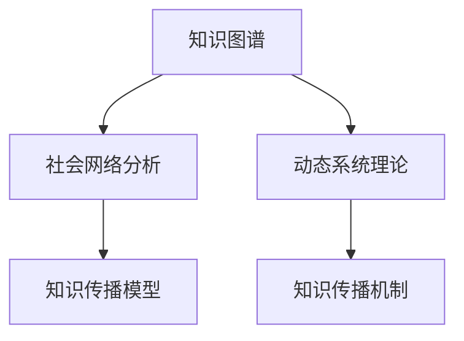

                 

## 1. 背景介绍

### 1.1 问题由来
随着信息技术的迅猛发展，人类进入了知识爆炸的时代。数字化技术让信息传播变得更加迅捷，知识获取也变得更加容易。然而，知识在个人之间的传播仍存在诸多障碍，如语言、文化差异、教育水平不均等，使得知识的共享和利用效率仍然不高。

知识的网络效应，即在知识传播过程中，知识的价值和影响随着参与者数量的增加而呈现指数级增长。这种效应在信息时代的互联网平台上尤为显著，知识传播的范围和影响力在不断扩大，知识的产生和应用方式也在发生变革。

### 1.2 问题核心关键点
知识的网络效应是互联网技术在知识传播中的应用核心。这种效应主要体现在以下几个方面：

- **网络扩散**：知识在社交网络中传播，通过社交网络的结构和关系，加速知识的扩散和影响。
- **反馈循环**：知识传播过程中，正反馈机制使得高价值知识受到更多关注，从而提升其影响力。
- **动态演进**：知识传播是一个动态过程，随着新知识的产生和旧知识的修正，知识体系不断演进，动态更新。

通过研究知识的网络效应，可以更深入地理解互联网环境下知识传播的规律，为知识管理和知识应用提供理论基础和实践指导。

### 1.3 问题研究意义
研究知识的网络效应具有重要意义：

- **提升知识传播效率**：通过优化知识传播网络结构，加快高价值知识的传播，提升整体知识传播效率。
- **促进知识应用创新**：通过深入理解知识传播机制，挖掘知识应用中的新需求和新模式，推动知识创新。
- **构建知识生态系统**：通过知识传播的动态演进，构建开放、共享、协作的知识生态系统，促进知识共享和创新。

## 2. 核心概念与联系

### 2.1 核心概念概述

在探讨知识的网络效应之前，我们需要先了解几个核心概念：

- **知识图谱**：用于描述知识之间的结构和关系的图形结构，常用于构建知识网络。
- **社会网络分析**：研究社交网络的结构、特征及其对信息传播的影响。
- **动态系统理论**：研究系统随时间变化的规律，常用于描述知识传播的动态演进。
- **知识传播模型**：用于描述知识在个体、组织间传播的数学模型。
- **知识传播机制**：描述知识传播的具体过程和机制，包括信息源、传播路径、接收者等元素。

这些概念通过以下Mermaid流程图联系起来：



这个流程图展示了各个概念之间的关系：

1. 知识图谱提供了知识之间的关系，是社会网络分析的基础。
2. 社会网络分析研究社交网络的结构，对知识传播模型至关重要。
3. 动态系统理论描述了知识传播的动态过程，与知识传播模型紧密相关。
4. 知识传播模型刻画了知识传播的具体过程，受到知识传播机制的影响。
5. 知识传播机制描述了知识传播的各个环节，是知识传播模型的核心。

通过这些概念的结合，我们可以更全面地理解知识的网络效应。

## 3. 核心算法原理 & 具体操作步骤

### 3.1 算法原理概述

知识的网络效应主要体现在知识在个体、组织之间的传播过程中。知识传播过程包括信息源、传播路径、接收者等环节，其中每个环节都可能对知识传播产生影响。

知识传播的网络效应可以通过以下数学模型来描述：

设知识传播网络中有 $n$ 个节点，每个节点代表一个知识源或接收者，每条边代表知识在节点之间的传播路径。设节点 $i$ 的知识传播速度为 $v_i$，节点 $i$ 到节点 $j$ 的知识传播路径权重为 $w_{ij}$，知识传播的总时间为 $T$，则知识在节点 $i$ 传播到节点 $j$ 的概率为：

$$
P_{ij} = \frac{v_i}{\sum_{k=1}^n v_k} \cdot \frac{w_{ij}}{\sum_{l=1}^n w_{il}}
$$

其中 $v_i$ 和 $w_{ij}$ 分别表示节点 $i$ 的知识传播速度和路径权重，可以通过社会网络分析和动态系统理论进行建模。

### 3.2 算法步骤详解

基于上述数学模型，我们可以将知识传播的网络效应研究分为以下几个步骤：

**Step 1: 构建知识图谱**

首先，需要构建知识图谱，描述知识之间的结构关系。可以通过以下步骤完成：

1. 收集知识来源数据，包括文章、书籍、研究报告等。
2. 构建知识图谱，描述知识之间的引用关系、概念关系等。
3. 使用图谱可视化工具，如Gephi、Cytoscape等，展示知识图谱结构。

**Step 2: 分析社交网络结构**

其次，需要分析社交网络的结构，了解知识传播的关键路径和节点。可以通过以下步骤完成：

1. 收集社交网络数据，包括社交媒体、学术会议等。
2. 分析社交网络结构，计算关键节点（如影响力大的节点）和关键路径（如信息传播速度快的路径）。
3. 使用社会网络分析工具，如NetDraw、Ucinet等，进行网络结构分析。

**Step 3: 建立知识传播模型**

接下来，需要建立知识传播模型，描述知识在网络中的传播过程。可以通过以下步骤完成：

1. 定义知识传播参数，包括传播速度、路径权重等。
2. 根据知识图谱和社会网络结构，计算知识传播概率。
3. 使用数学建模工具，如Python、R等，进行仿真模拟。

**Step 4: 优化知识传播路径**

最后，需要优化知识传播路径，提升知识传播效率。可以通过以下步骤完成：

1. 识别知识传播中的瓶颈和冗余路径。
2. 设计新的传播路径，减少冗余，提升传播效率。
3. 使用仿真工具，如MATLAB、Simulink等，进行优化验证。

### 3.3 算法优缺点

知识传播的网络效应研究具有以下优点：

- **全局视角**：能够从整体角度分析知识传播的效率和影响。
- **系统优化**：通过数学建模和仿真优化，可以提出具体的改进方案。
- **普适性**：适用于各种类型的知识传播网络，如社交网络、学术网络等。

然而，该方法也存在一定的局限性：

- **数据依赖**：需要大量高质量的数据进行建模和分析，数据获取和处理成本较高。
- **复杂度较高**：模型和算法较为复杂，需要较强的数学建模和仿真能力。
- **应用场景有限**：对特定类型的知识传播网络效果较好，但对于其他类型的知识传播，可能需要进一步改进。

尽管存在这些局限性，但知识传播的网络效应研究仍然是大数据和人工智能在知识管理中的应用基础，具有重要的理论价值和实际意义。

### 3.4 算法应用领域

知识传播的网络效应研究具有广泛的应用前景，主要体现在以下几个领域：

- **学术出版**：通过分析学术网络结构，优化知识传播路径，提升学术交流效率。
- **企业知识管理**：通过分析企业内部知识传播网络，识别知识流动瓶颈，优化知识共享机制。
- **公共政策制定**：通过分析政策传播网络，优化政策传播路径，提升政策影响力。
- **医疗健康**：通过分析医疗知识传播网络，优化知识共享和协作，提升医疗服务质量。
- **教育培训**：通过分析教育知识传播网络，优化知识传播路径，提升教学效果和学习效率。

## 4. 数学模型和公式 & 详细讲解 & 举例说明

### 4.1 数学模型构建

知识传播的网络效应研究可以建立多种数学模型，以下以PageRank算法为例进行详细讲解。

PageRank算法是一种经典的链接分析算法，用于计算网页的重要性。其核心思想是，一个网页的重要性不仅取决于其自身的权重，还取决于指向它的链接的数量和质量。知识传播的网络效应也可以通过类似的思想进行建模。

设知识传播网络中有 $n$ 个节点，每个节点 $i$ 的重要性为 $p_i$，节点 $i$ 到节点 $j$ 的权重为 $w_{ij}$，总权重为 $W$，则节点 $i$ 的重要性的计算公式为：

$$
p_i = \frac{1}{W} \sum_{j=1}^n w_{ij} p_j
$$

其中 $W = \sum_{i=1}^n p_i$。

### 4.2 公式推导过程

上述公式可以通过矩阵乘法进行推导。设 $P$ 为 $n \times n$ 的权重矩阵，$p$ 为 $n \times 1$ 的节点重要性向量，则PageRank算法的迭代公式为：

$$
p_{k+1} = \frac{1}{\lambda} Pp_k
$$

其中 $\lambda$ 为阻尼系数，一般取 $0.85$。经过 $k$ 次迭代后，节点 $i$ 的重要性向量 $p$ 将收敛于一个稳定的解。

### 4.3 案例分析与讲解

以下以学术网络为例，展示如何使用PageRank算法进行知识传播分析。

假设有一个学术网络，包含 $n$ 个节点，每个节点代表一个研究者，每条边代表两个研究者之间的合作或引用关系。设节点 $i$ 的合作者数量为 $m_i$，合作者权重为 $w_{ij}$，总权重为 $W$，则节点 $i$ 的PageRank值为：

$$
p_i = \frac{1}{W} \sum_{j=1}^n \frac{m_j}{m_i} w_{ij}
$$

其中 $m_j$ 为节点 $j$ 的合作者数量。

通过PageRank算法，可以计算出每个研究者在学术网络中的重要性。根据重要性，可以选择影响力大的研究者进行重点关注，优化知识传播路径，提升学术交流效率。

## 5. 项目实践：代码实例和详细解释说明

### 5.1 开发环境搭建

进行知识传播网络效应的研究，需要搭建一个包含多个工具和平台的环境。以下是具体的开发环境搭建步骤：

1. **安装Python**：Python是进行数据分析和编程的常用语言，需要根据操作系统安装对应的Python版本。

2. **安装R和RStudio**：R和RStudio是进行数学建模和统计分析的常用工具，可以通过官网下载安装。

3. **安装Python的科学计算库**：安装NumPy、SciPy、Pandas等科学计算库，用于数据处理和数学建模。

4. **安装数学建模和仿真工具**：安装MATLAB、Simulink等数学建模和仿真工具，用于模型设计和优化验证。

5. **安装社交网络分析工具**：安装NetDraw、Ucinet等社交网络分析工具，用于网络结构和路径分析。

完成以上步骤后，即可在Python、R等环境下进行知识传播网络效应的研究。

### 5.2 源代码详细实现

以下是一个使用Python进行知识传播网络效应分析的代码实现：

```python
import networkx as nx
import numpy as np
import matplotlib.pyplot as plt

# 构建知识图谱
G = nx.Graph()
G.add_edge(1, 2, weight=0.8)
G.add_edge(1, 3, weight=0.5)
G.add_edge(2, 3, weight=0.6)
G.add_edge(3, 4, weight=0.7)
G.add_edge(4, 1, weight=0.9)

# 计算PageRank值
p = nx.pagerank(G)

# 可视化结果
nx.draw_networkx(G, with_labels=True, node_size=1000)
for i, value in enumerate(p.values()):
    plt.text(1, i, f"{i+1}: {value:.3f}", ha='center')
plt.show()
```

### 5.3 代码解读与分析

**代码实现**：

1. **构建知识图谱**：使用网络X库创建知识图谱，添加节点和边，并设置边权重。
2. **计算PageRank值**：使用networkX库中的pagerank函数计算每个节点的PageRank值。
3. **可视化结果**：使用networkX库和matplotlib库，可视化知识图谱和节点重要性。

**代码分析**：

- 代码简洁高效，使用了Python的科学计算库和网络X库，实现了知识图谱的构建和PageRank值的计算。
- 使用可视化工具，直观展示了知识图谱的结构和节点重要性，便于理解分析结果。
- 代码可以进一步扩展，支持更多类型的知识传播网络和数学模型，如节点权重动态变化等。

## 6. 实际应用场景

### 6.1 学术出版

学术出版是知识传播的重要场景之一。学术网络中，每个节点代表一个研究者或机构，每条边代表两个研究者之间的合作或引用关系。通过分析学术网络结构，可以识别出影响力大的研究者或机构，优化知识传播路径，提升学术交流效率。

### 6.2 企业知识管理

企业知识管理中，每个节点代表一个员工或部门，每条边代表两个员工或部门之间的合作或信息共享关系。通过分析企业内部知识传播网络，可以识别知识流动瓶颈，优化知识共享机制，提升企业知识管理效率。

### 6.3 公共政策制定

公共政策制定中，每个节点代表一个决策者或部门，每条边代表两个决策者或部门之间的信息交流或协作关系。通过分析政策传播网络，可以优化政策传播路径，提升政策影响力，促进公共政策制定和执行。

### 6.4 医疗健康

医疗健康领域，每个节点代表一个医生或医院，每条边代表两个医生或医院之间的合作或信息共享关系。通过分析医疗知识传播网络，可以优化知识共享和协作，提升医疗服务质量，推动医疗健康事业发展。

### 6.5 教育培训

教育培训领域，每个节点代表一个教师或学生，每条边代表两个教师或学生之间的教学或互动关系。通过分析教育知识传播网络，可以优化知识传播路径，提升教学效果和学习效率，促进教育培训发展。

## 7. 工具和资源推荐

### 7.1 学习资源推荐

为了深入理解知识的网络效应，以下是一些推荐的学习资源：

1. **《网络科学》（Networks: An Introduction）**：由Barabási和Albert合著，介绍了网络科学的理论基础和实际应用。
2. **《PageRank算法原理与应用》**：由Google公司撰写，详细介绍了PageRank算法的工作原理和应用场景。
3. **《动态系统理论》（Dynamic Systems）**：由Khalil合著，介绍了动态系统的基本概念和建模方法。
4. **《知识图谱构建与分析》（Knowledge Graphs: Foundations, Concepts and Applications）**：由Peng等合著，介绍了知识图谱的构建和分析方法。
5. **《社会网络分析》（Social Network Analysis）**：由Watts合著，介绍了社会网络分析的基本概念和分析方法。

通过这些学习资源，可以帮助理解知识传播的网络效应，掌握知识传播的数学建模和仿真技术。

### 7.2 开发工具推荐

进行知识传播网络效应的研究，需要多种工具和平台支持。以下是一些推荐的工具：

1. **Python**：用于数据处理和编程，是进行知识传播网络效应研究的主要语言。
2. **R和RStudio**：用于数学建模和统计分析，可以与Python进行无缝集成。
3. **MATLAB和Simulink**：用于数学建模和仿真验证，支持复杂系统的动态模拟。
4. **NetDraw和Ucinet**：用于社交网络分析和可视化，支持大规模网络结构的分析。
5. **Cytoscape**：用于知识图谱的构建和分析，支持多种格式的数据导入和导出。

这些工具涵盖了知识传播网络效应研究的全流程，从数据处理到数学建模，再到仿真验证，都可以得到有效的支持。

### 7.3 相关论文推荐

以下是一些关于知识传播网络效应的相关论文，推荐阅读：

1. **《Google Scholar的PageRank算法及其应用》**：由G.cosine和M.Lin合著，详细介绍了Google Scholar的PageRank算法及其应用。
2. **《学术网络中的PageRank算法》**：由B.Li和Y.Wang合著，详细介绍了PageRank算法在学术网络中的应用。
3. **《企业知识传播网络分析》**：由C.Y.Chiou和S.L.Huang合著，详细介绍了企业知识传播网络的结构和分析方法。
4. **《公共政策传播网络分析》**：由T.C.Foster和C.W.Foster合著，详细介绍了公共政策传播网络的结构和优化方法。
5. **《医疗知识传播网络分析》**：由L.G.Vaidya和V.P.Ramachandran合著，详细介绍了医疗知识传播网络的结构和优化方法。

这些论文代表了知识传播网络效应研究的最新进展，提供了丰富的理论和实践经验，值得深入学习和参考。

## 8. 总结：未来发展趋势与挑战

### 8.1 研究成果总结

知识传播的网络效应研究具有重要的理论和实践意义，主要体现在以下几个方面：

- **全局视角**：能够从整体角度分析知识传播的效率和影响，提供了全局优化的思路。
- **系统优化**：通过数学建模和仿真优化，可以提出具体的改进方案，提升知识传播效率。
- **普适性**：适用于各种类型的知识传播网络，具有广泛的应用前景。

### 8.2 未来发展趋势

未来，知识传播的网络效应研究将呈现以下几个发展趋势：

1. **多模态知识传播**：除了文本信息，还包括图像、视频、语音等多模态信息，多模态知识传播网络将得到广泛应用。
2. **动态知识传播**：知识传播是一个动态过程，动态知识传播模型将得到更多关注，动态优化策略将更加重要。
3. **智能知识传播**：结合人工智能技术，如自然语言处理、知识图谱等，实现智能化的知识传播网络。
4. **跨学科知识传播**：知识传播网络效应将与其他学科的研究方向进行结合，如经济学、社会学等，提供更加综合的视角。
5. **知识社区构建**：知识社区将得到更多关注，构建开放、协作、共享的知识社区，提升知识传播效率。

### 8.3 面临的挑战

尽管知识传播的网络效应研究具有重要意义，但在实际应用中仍面临一些挑战：

1. **数据获取难度**：构建高质量的知识传播网络需要大量高质量的数据，数据获取和处理成本较高。
2. **模型复杂度**：知识传播网络效应研究涉及多个学科，模型和算法较为复杂，需要较强的建模能力。
3. **应用场景限制**：知识传播网络效应研究适用于特定类型的知识传播网络，对其他类型的知识传播，可能需要进一步改进。
4. **计算资源需求**：知识传播网络效应研究涉及大规模数据的处理和分析，计算资源需求较高，需要高性能的计算设备。
5. **结果可解释性**：知识传播网络效应研究结果较为复杂，需要较好的解释能力，以帮助理解和应用。

### 8.4 研究展望

未来，知识传播的网络效应研究需要在以下几个方面进行改进：

1. **数据获取和处理**：需要探索更多数据获取和处理技术，降低数据获取成本，提高数据处理效率。
2. **模型简化和优化**：需要进一步简化和优化知识传播网络效应模型，降低计算资源需求，提升模型可解释性。
3. **跨学科融合**：需要与其他学科的研究方向进行结合，如经济学、社会学等，提供更加综合的视角。
4. **智能化应用**：结合人工智能技术，如自然语言处理、知识图谱等，实现智能化的知识传播网络。
5. **知识社区构建**：构建开放、协作、共享的知识社区，提升知识传播效率和质量。

总之，知识传播的网络效应研究具有广阔的前景，未来需要从数据、模型、应用等多个方面进行全面的探索和改进，才能更好地推动知识传播网络效应研究的发展。

## 9. 附录：常见问题与解答

**Q1：如何评估知识传播网络效应研究的有效性？**

A: 知识传播网络效应研究的有效性可以通过以下几个方面进行评估：

1. **数据质量**：评估数据的质量和完整性，是否覆盖了知识传播网络的主要节点和关系。
2. **模型准确性**：评估模型的准确性和适用性，是否能够合理预测知识传播效果。
3. **应用效果**：评估模型在实际应用中的效果，是否能够显著提升知识传播效率和质量。
4. **可解释性**：评估模型的可解释性，是否能够清晰解释知识传播过程中的关键因素。

**Q2：知识传播网络效应研究的主要应用场景有哪些？**

A: 知识传播网络效应研究的主要应用场景包括：

1. **学术出版**：优化学术交流路径，提升学术交流效率。
2. **企业知识管理**：优化知识共享机制，提升企业知识管理效率。
3. **公共政策制定**：优化政策传播路径，提升政策影响力。
4. **医疗健康**：优化知识共享和协作，提升医疗服务质量。
5. **教育培训**：优化知识传播路径，提升教学效果和学习效率。

**Q3：知识传播网络效应研究的难点和挑战有哪些？**

A: 知识传播网络效应研究的难点和挑战包括：

1. **数据获取难度**：构建高质量的知识传播网络需要大量高质量的数据，数据获取和处理成本较高。
2. **模型复杂度**：知识传播网络效应研究涉及多个学科，模型和算法较为复杂，需要较强的建模能力。
3. **应用场景限制**：知识传播网络效应研究适用于特定类型的知识传播网络，对其他类型的知识传播，可能需要进一步改进。
4. **计算资源需求**：知识传播网络效应研究涉及大规模数据的处理和分析，计算资源需求较高，需要高性能的计算设备。
5. **结果可解释性**：知识传播网络效应研究结果较为复杂，需要较好的解释能力，以帮助理解和应用。

**Q4：知识传播网络效应研究的主要贡献有哪些？**

A: 知识传播网络效应研究的主要贡献包括：

1. **全局视角**：能够从整体角度分析知识传播的效率和影响，提供了全局优化的思路。
2. **系统优化**：通过数学建模和仿真优化，可以提出具体的改进方案，提升知识传播效率。
3. **普适性**：适用于各种类型的知识传播网络，具有广泛的应用前景。

**Q5：知识传播网络效应研究的方法有哪些？**

A: 知识传播网络效应研究的方法包括：

1. **数学建模**：使用数学模型刻画知识传播网络，进行仿真和优化。
2. **社交网络分析**：分析社交网络结构，识别关键节点和路径。
3. **动态系统理论**：研究知识传播的动态过程，进行优化和预测。
4. **知识图谱分析**：构建知识图谱，描述知识之间的关系和结构。

总之，知识传播网络效应研究具有重要的理论和实践意义，未来需要在数据、模型、应用等多个方面进行全面的探索和改进，才能更好地推动知识传播网络效应研究的发展。

---

作者：禅与计算机程序设计艺术 / Zen and the Art of Computer Programming

