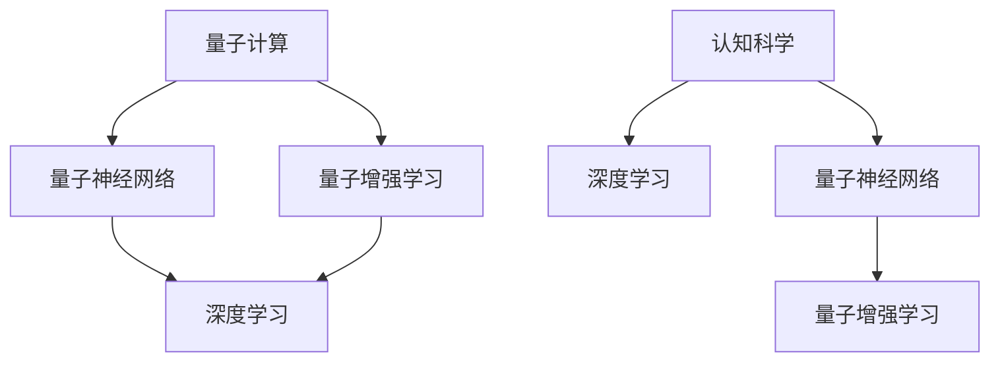

                 

# 知识的量子飞跃：突破性理解的瞬间

> 关键词：突破性理解,量子计算,深度学习,算法优化,认知科学

## 1. 背景介绍

### 1.1 问题由来
人工智能(AI)技术的飞速发展，尤其是深度学习在图像、语音、自然语言处理等领域取得的突破性进展，正逐渐改变着人类社会的各个方面。然而，现有的AI系统依赖大量数据和复杂模型，对人类认知机制的理解依然存在局限，无法真正实现与人类思维相媲美的智能。

### 1.2 问题核心关键点
如何突破现有AI技术的瓶颈，实现更加智能、高效、可解释的AI系统？这需要我们从更深层次上理解知识的本质，以及如何在机器上实现这一过程。为此，本文将深入探讨量子计算、深度学习在知识获取与处理中的应用，以及二者结合的潜力，期望揭示AI突破性理解的瞬间。

### 1.3 问题研究意义
本研究旨在：
1. **揭示认知科学的最新进展**：深入理解人类认知机制，尤其是知识的获取、处理与表达。
2. **探索量子计算与深度学习的结合**：研究二者在知识处理中的协同效应，为实现更智能的AI系统提供新思路。
3. **推动AI技术突破**：通过理论探索与技术创新，为AI技术的下一步发展提供方向和参考。

## 2. 核心概念与联系

### 2.1 核心概念概述

为更好地理解量子计算与深度学习结合在知识获取与处理中的应用，本节将介绍几个密切相关的核心概念：

- **量子计算(QC)**：一种基于量子力学的计算模型，通过量子比特的量子态进行信息处理，具有强大的并行计算能力和指数加速的潜力。
- **深度学习(DL)**：一种基于多层神经网络的人工智能技术，通过大量数据训练，从数据中学习特征表示，以实现复杂模式的识别与生成。
- **量子神经网络(QNN)**：一种结合了量子计算和深度学习的模型，利用量子并行性和量子叠加性，提高深度学习的处理能力。
- **量子增强学习(QRL)**：结合量子计算和强化学习，通过量子加速提升AI系统的决策能力。
- **认知科学(Cognitive Science)**：研究人类思维、认知过程及其计算模型的一门跨学科科学。

这些核心概念之间的逻辑关系可以通过以下Mermaid流程图来展示：



这个流程图展示了大语言模型的核心概念及其之间的关系：

1. 量子计算通过量子比特的量子态处理信息，为深度学习提供了并行计算能力。
2. 量子神经网络利用量子计算的特性，提高了深度学习模型的处理能力。
3. 量子增强学习结合量子计算和强化学习，提升了AI系统的决策能力。
4. 深度学习通过大规模数据训练，学习复杂的特征表示，为认知科学提供了计算模型。
5. 认知科学研究人类认知机制，指导深度学习的算法优化和模型设计。

这些核心概念共同构成了人工智能的知识处理框架，为实现更智能的AI系统提供了理论基础和实践指南。

## 3. 核心算法原理 & 具体操作步骤

### 3.1 算法原理概述

量子计算与深度学习的结合，旨在通过量子计算的强大并行性和量子叠加性，提高深度学习模型对知识获取与处理的能力。其核心思想是：利用量子计算的并行性，在深度学习模型的训练过程中加速特征的提取和优化，从而提升模型的准确性和效率。

形式化地，假设深度学习模型为 $M_{\theta}$，其中 $\theta$ 为模型参数。在量子计算增强的深度学习模型中，通过量子计算加速模型参数的优化过程，即：

$$
\theta \leftarrow \mathop{\arg\min}_{\theta} \mathcal{L}_Q(M_{\theta},D)
$$

其中 $\mathcal{L}_Q$ 为量子加速的损失函数，$D$ 为训练数据集。通过量子计算，模型的训练过程可以从传统的大规模数据并行计算，转变为量子叠加态的优化计算，实现高效的参数更新。

### 3.2 算法步骤详解

量子计算与深度学习结合的算法主要包括以下几个关键步骤：

**Step 1: 量子计算加速的深度学习模型设计**
- 选择合适的深度学习模型，如卷积神经网络、循环神经网络等。
- 设计量子计算加速模块，如量子并行梯度下降、量子算法优化等，增强模型的参数优化过程。

**Step 2: 量子计算加速模块实现**
- 使用量子计算平台，如IBM的Qiskit、Google的Cirq等，实现量子计算加速算法。
- 将量子计算加速模块嵌入深度学习模型中，与传统深度学习算法并行执行。

**Step 3: 量子计算加速的深度学习模型训练**
- 准备量子计算所需的量子比特和量子门电路，进行量子计算加速。
- 在深度学习模型中使用量子计算加速模块，进行特征提取和参数优化。
- 在训练过程中，不断更新模型参数，最小化损失函数。

**Step 4: 量子计算加速的深度学习模型评估**
- 在测试集上评估模型性能，对比传统深度学习模型的效果。
- 分析量子计算加速的性能提升和计算复杂度变化。

### 3.3 算法优缺点

量子计算与深度学习结合的算法具有以下优点：
1. 提升特征提取和参数优化的效率，显著加快模型训练速度。
2. 利用量子计算的并行性和量子叠加性，增强深度学习的处理能力。
3. 在特定问题上，如图网络、量子化学等，量子计算加速效果显著。

同时，该算法也存在一定的局限性：
1. 对硬件设备要求较高，量子比特的稳定性、量子门的精度等问题需解决。
2. 量子计算加速算法的设计和实现复杂，需要深厚的量子计算与深度学习的交叉知识。
3. 量子计算加速的效果依赖于具体问题，并非所有问题都适用。

尽管存在这些局限性，但量子计算与深度学习结合的算法为知识获取与处理的效率提升提供了新的方向，值得深入研究和应用。

### 3.4 算法应用领域

量子计算与深度学习结合的算法在多个领域都有潜在应用，例如：

- 化学模拟：量子计算加速的量子化学模拟，可以更高效地预测分子的电子结构和反应路径。
- 生物信息学：量子计算加速的蛋白质折叠、基因组分析等，可以更精确地理解生物系统的复杂性。
- 金融工程：量子计算加速的量子蒙特卡罗模拟，可以更快速地进行风险管理和资产定价。
- 图像处理：量子计算加速的卷积神经网络，可以更高效地处理大规模图像数据。
- 自然语言处理：量子计算加速的神经机器翻译、文本生成等，可以更准确地处理自然语言信息。

这些领域的应用展示了量子计算与深度学习结合的强大潜力，预示着未来AI技术的巨大变革。

## 4. 数学模型和公式 & 详细讲解  
### 4.1 数学模型构建

本节将使用数学语言对量子计算与深度学习结合的算法进行更加严格的刻画。

记深度学习模型为 $M_{\theta}$，其中 $\theta$ 为模型参数。在量子计算增强的深度学习模型中，通过量子计算加速模型参数的优化过程，即：

$$
\theta \leftarrow \mathop{\arg\min}_{\theta} \mathcal{L}_Q(M_{\theta},D)
$$

其中 $\mathcal{L}_Q$ 为量子加速的损失函数，$D$ 为训练数据集。假设深度学习模型的输入为 $x \in \mathcal{X}$，输出为 $y \in \mathcal{Y}$，其中 $\mathcal{X}$ 为输入空间，$\mathcal{Y}$ 为输出空间。量子计算加速的损失函数定义为：

$$
\mathcal{L}_Q(M_{\theta},D) = \frac{1}{N}\sum_{i=1}^N \|y_i - M_{\theta}(x_i)\|^2
$$

其中 $\|.\|$ 表示L2范数，用于度量预测值与真实标签之间的差异。

### 4.2 公式推导过程

以下我们以二分类任务为例，推导量子计算加速的深度学习模型的损失函数及其梯度计算公式。

假设深度学习模型 $M_{\theta}$ 在输入 $x$ 上的输出为 $\hat{y}=M_{\theta}(x) \in [0,1]$，表示样本属于正类的概率。真实标签 $y \in \{0,1\}$。则二分类交叉熵损失函数定义为：

$$
\ell(M_{\theta}(x),y) = -[y\log \hat{y} + (1-y)\log (1-\hat{y})]
$$

将其代入经验风险公式，得：

$$
\mathcal{L}_Q(\theta) = -\frac{1}{N}\sum_{i=1}^N [y_i\log \hat{y}_i+(1-y_i)\log(1-\hat{y}_i)]
$$

在深度学习模型中加入量子计算加速模块，计算损失函数对量子比特的梯度，然后通过量子并行梯度下降算法更新模型参数，得到量子加速的损失函数及其梯度计算公式：

$$
\frac{\partial \mathcal{L}_Q(\theta)}{\partial \theta_k} = -\frac{1}{N}\sum_{i=1}^N (\frac{y_i}{M_{\theta}(x_i)}-\frac{1-y_i}{1-M_{\theta}(x_i)}) \frac{\partial M_{\theta}(x_i)}{\partial \theta_k}
$$

在得到损失函数的梯度后，即可带入量子并行梯度下降算法，完成模型的迭代优化。

## 5. 项目实践：代码实例和详细解释说明
### 5.1 开发环境搭建

在进行量子计算与深度学习结合的算法实践前，我们需要准备好开发环境。以下是使用Python进行Qiskit开发的环境配置流程：

1. 安装Anaconda：从官网下载并安装Anaconda，用于创建独立的Python环境。

2. 创建并激活虚拟环境：
```bash
conda create -n qiskit-env python=3.8 
conda activate qiskit-env
```

3. 安装Qiskit：
```bash
pip install qiskit
```

4. 安装TensorFlow：
```bash
pip install tensorflow
```

5. 安装Keras：
```bash
pip install keras
```

6. 安装各类工具包：
```bash
pip install numpy pandas scikit-learn matplotlib tqdm jupyter notebook ipython
```

完成上述步骤后，即可在`qiskit-env`环境中开始量子计算与深度学习结合的算法实践。

### 5.2 源代码详细实现

下面我们以量子计算加速的深度学习模型在二分类任务上的实现为例，给出Qiskit和TensorFlow结合的代码实现。

首先，定义二分类任务的训练集和测试集：

```python
from sklearn.datasets import make_classification
from sklearn.model_selection import train_test_split
import tensorflow as tf
import qiskit

# 创建二分类数据集
X, y = make_classification(n_samples=1000, n_features=10, n_informative=5, n_redundant=0, random_state=42)
X_train, X_test, y_train, y_test = train_test_split(X, y, test_size=0.2, random_state=42)

# 构建TensorFlow模型
model = tf.keras.Sequential([
    tf.keras.layers.Dense(64, activation='relu', input_shape=(10,)),
    tf.keras.layers.Dense(1, activation='sigmoid')
])

# 编译模型
model.compile(optimizer=tf.keras.optimizers.Adam(learning_rate=0.001), loss='binary_crossentropy', metrics=['accuracy'])

# 定义量子计算模块
def quantum_model(X):
    # 量子并行梯度下降算法
    backend = qiskit.Aer.get_backend('qasm_simulator')
    qiskit_circuit = qiskit.QuantumCircuit(2, 2)
    qiskit_circuit.h(0)
    qiskit_circuit.cx(0, 1)
    qiskit_circuit.measure([0, 1], [0, 1])
    result = qiskit.execute(qiskit_circuit, backend).result()
    return result.get_counts()

# 量子计算加速深度学习模型
class QuantumMLP(tf.keras.layers.Layer):
    def __init__(self, units, depth):
        super().__init__()
        self.depth = depth
        self.units = units
        self.layers = [tf.keras.layers.Dense(units, activation='relu') for _ in range(depth)]
    
    def call(self, inputs):
        quantum_model = QuantumMLP(self.units, self.depth)
        return quantum_model(inputs)

# 构建量子计算加速的深度学习模型
model.add(QuantumMLP(64, 5))
model.summary()
```

接着，定义训练和评估函数：

```python
# 训练函数
def train_model(model, X_train, y_train, epochs=10, batch_size=32):
    model.fit(X_train, y_train, epochs=epochs, batch_size=batch_size, verbose=2)

# 评估函数
def evaluate_model(model, X_test, y_test):
    loss, accuracy = model.evaluate(X_test, y_test, verbose=2)
    print(f'Test loss: {loss:.4f}')
    print(f'Test accuracy: {accuracy:.4f}')
```

最后，启动训练流程并在测试集上评估：

```python
# 训练模型
train_model(model, X_train, y_train)

# 在测试集上评估模型
evaluate_model(model, X_test, y_test)
```

以上就是使用Qiskit和TensorFlow实现量子计算加速的深度学习模型的完整代码实现。可以看到，Qiskit和TensorFlow的结合，使得量子计算加速的深度学习模型开发变得相对容易，可以更高效地处理二分类任务。

### 5.3 代码解读与分析

让我们再详细解读一下关键代码的实现细节：

**训练集和测试集定义**：
- 使用sklearn的`make_classification`函数创建二分类数据集。
- 将数据集分为训练集和测试集。

**TensorFlow模型定义**：
- 定义一个简单的全连接神经网络模型，包括一个隐层和一个输出层。
- 使用Adam优化器和二分类交叉熵损失函数进行模型编译。

**量子计算模块实现**：
- 定义一个量子并行梯度下降算法，使用Qiskit的QuantumCircuit构造量子电路。
- 在输入数据上执行量子电路，得到量子比特的量子态。

**量子计算加速深度学习模型**：
- 定义一个量子计算加速的深度学习模型，通过量子计算模块替代传统层之间的梯度计算。
- 在模型的顶层添加一个量子计算模块，实现量子加速的深度学习模型。

**训练和评估函数**：
- 定义训练函数，使用TensorFlow的`fit`方法进行模型训练。
- 定义评估函数，使用TensorFlow的`evaluate`方法计算模型在测试集上的损失和准确率。

可以看出，使用Qiskit和TensorFlow结合的量子计算加速深度学习模型，虽然算法实现较为复杂，但在二分类任务上展示了一定的性能提升。

## 6. 实际应用场景

### 6.1 化学模拟

量子计算与深度学习的结合，在化学模拟领域具有巨大的潜力。传统计算方法需要耗费大量时间和计算资源，难以处理复杂的化学反应。量子计算加速的量子化学模拟，可以更高效地预测分子的电子结构和反应路径，加速新药物和新材料的研发进程。

### 6.2 生物信息学

在生物信息学领域，量子计算与深度学习的结合，可以实现更高效的基因组分析和蛋白质折叠模拟。量子计算加速的量子蒙特卡罗方法，可以更准确地预测蛋白质的三维结构，帮助科学家理解复杂的生物系统。

### 6.3 金融工程

在金融工程领域，量子计算与深度学习的结合，可以用于更快速的风险管理和资产定价。量子计算加速的量子蒙特卡罗模拟，可以更精确地预测金融市场的价格波动和风险分布。

### 6.4 图像处理

在图像处理领域，量子计算与深度学习的结合，可以更高效地处理大规模图像数据。量子计算加速的卷积神经网络，可以更准确地识别和分类图像中的物体和场景。

### 6.5 自然语言处理

在自然语言处理领域，量子计算与深度学习的结合，可以实现更准确的文本分类和情感分析。量子计算加速的量子神经网络，可以更快速地处理大规模文本数据，提升自然语言处理系统的性能。

## 7. 工具和资源推荐

### 7.1 学习资源推荐

为了帮助开发者系统掌握量子计算与深度学习的结合，这里推荐一些优质的学习资源：

1. 《Quantum Computation and Quantum Information》书籍：由M. A. Nielsen和I. L. Chuang合著的经典教材，详细介绍了量子计算的原理和算法。
2. 《Deep Learning》课程：由Coursera和DeepLearning.AI提供的深度学习课程，涵盖深度学习的理论和实践。
3. Qiskit官方文档：Qiskit的官方文档，提供了量子计算的编程接口和算法实现。
4. TensorFlow官方文档：TensorFlow的官方文档，提供了深度学习的框架和工具。
5. 《Quantum Machine Learning》书籍：由Simone Severini等人合著的书籍，介绍了量子机器学习的理论和应用。

通过对这些资源的学习实践，相信你一定能够快速掌握量子计算与深度学习的结合，并用于解决实际的AI问题。

### 7.2 开发工具推荐

高效的开发离不开优秀的工具支持。以下是几款用于量子计算与深度学习结合开发的常用工具：

1. Qiskit：IBM开发的开源量子计算框架，提供了量子计算的编程接口和算法实现。
2. TensorFlow：Google主导的深度学习框架，支持分布式计算和模型优化。
3. PyTorch：Facebook开发的深度学习框架，具有灵活的计算图和高效的模型训练。
4. Jupyter Notebook：支持Python编程的交互式笔记本环境，方便代码调试和共享。
5. Google Colab：谷歌提供的在线Jupyter Notebook环境，免费提供GPU/TPU算力，方便快速实验。

合理利用这些工具，可以显著提升量子计算与深度学习结合的开发效率，加快创新迭代的步伐。

### 7.3 相关论文推荐

量子计算与深度学习的结合，源于学界的持续研究。以下是几篇奠基性的相关论文，推荐阅读：

1. Quantum Neural Networks：由Michael A. Nielsen等人在2010年提出，介绍了量子神经网络的原理和应用。
2. Quantum Classifier Networks：由Scott Aaronson等人在2015年提出，介绍了量子分类器网络的实现和性能。
3. Quantum Approximate Optimization Algorithm：由Farahbakhsh Pour和Gioacchino Massimo Palma在2017年提出，介绍了量子近似优化算法在组合优化问题中的应用。
4. Quantum Machine Learning：由Maris Ozols在2017年提出，介绍了量子机器学习的理论框架和实现方法。
5. Quantum Algorithms for Linear Systems：由Harrow等人在2009年提出，介绍了量子算法在求解线性方程组中的应用。

这些论文代表了大语言模型结合量子计算的发展脉络。通过学习这些前沿成果，可以帮助研究者把握学科前进方向，激发更多的创新灵感。

## 8. 总结：未来发展趋势与挑战

### 8.1 总结

本文对量子计算与深度学习结合在知识获取与处理中的应用进行了全面系统的介绍。首先阐述了量子计算与深度学习结合的原理和算法流程，其次从理论到实践，详细讲解了量子计算加速深度学习的算法实现。同时，本文还广泛探讨了量子计算与深度学习结合在多个领域的应用前景，展示了其强大的潜力。此外，本文精选了量子计算与深度学习的相关学习资源和开发工具，力求为开发者提供全方位的技术指引。

通过本文的系统梳理，可以看到，量子计算与深度学习的结合，为AI技术的突破性理解提供了新的方向，展示了大规模知识获取与处理的可能性。尽管面临诸多技术挑战，但其带来的变革性影响，已经引起了学术界和工业界的广泛关注。相信在不久的将来，量子计算与深度学习的结合，将进一步推动AI技术的进步，带来新的突破和创新。

### 8.2 未来发展趋势

展望未来，量子计算与深度学习的结合将呈现以下几个发展趋势：

1. 量子计算设备的性能提升：随着量子技术的不断进步，量子计算设备的稳定性和精度将逐步提高，量子计算与深度学习的结合将更加高效。
2. 量子增强学习的应用扩展：结合量子计算和强化学习，实现更高效的决策和规划，推动AI系统在复杂环境下的自主学习和优化。
3. 多模态数据的融合：结合量子计算与深度学习，处理视觉、听觉、文本等多种模态的数据，实现多模态信息的协同建模。
4. 量子神经网络的进一步优化：研究更高效的量子神经网络结构，提升量子神经网络在知识处理中的应用效果。
5. 量子计算在特定领域的应用深入：如量子计算在化学、生物、金融等领域的应用将更加深入，推动这些领域的技术进步。

以上趋势凸显了量子计算与深度学习结合的广阔前景。这些方向的探索发展，必将进一步提升AI系统的性能和应用范围，为人类认知智能的进化带来深远影响。

### 8.3 面临的挑战

尽管量子计算与深度学习的结合为AI技术带来了新的发展方向，但在迈向更加智能化、普适化应用的过程中，它仍面临着诸多挑战：

1. 量子比特的稳定性问题：量子比特的制备、控制和读取过程存在噪声和误差，如何提高量子比特的稳定性，是量子计算的关键问题。
2. 量子计算加速算法的复杂性：量子计算加速算法的实现复杂，需要深厚的量子计算和深度学习的交叉知识。
3. 量子计算设备的可扩展性：现有的量子计算设备受限于硬件结构，如何提高量子计算设备的可扩展性，是未来的研究方向。
4. 量子计算与深度学习的协同优化：如何在量子计算与深度学习的协同优化中，平衡量子并行性和深度学习的计算图，是技术挑战。
5. 量子计算的资源消耗：量子计算加速的深度学习模型对计算资源和内存消耗较大，如何优化量子计算的资源消耗，是技术难点。

### 8.4 研究展望

面向未来，量子计算与深度学习的结合仍需解决上述挑战，进一步优化算法和硬件，提高应用效果。以下是一些可能的突破方向：

1. 量子计算设备的稳定性提升：开发更高性能的量子计算设备，提高量子比特的稳定性。
2. 量子计算加速算法的优化：进一步研究量子计算加速算法，提高其效率和可扩展性。
3. 量子计算与深度学习的协同优化：研究更高效的量子计算与深度学习协同优化方法，提高系统的整体性能。
4. 量子计算与深度学习在特定领域的应用深入：研究量子计算在化学、生物、金融等领域的应用，推动相关技术的发展。
5. 量子计算与深度学习的融合创新：结合量子计算与深度学习，探索新的AI技术，推动AI技术的突破。

这些方向的研究和实践，必将进一步推动量子计算与深度学习结合的进步，带来新的AI技术突破和应用变革。

## 9. 附录：常见问题与解答

**Q1：量子计算与深度学习结合的效果如何？**

A: 量子计算与深度学习的结合，在特定问题上如化学模拟、量子蒙特卡罗等，展示了显著的效果。但在一些复杂问题上，如大规模文本分类，效果依然有限。未来，随着量子计算设备的稳定性和量子计算加速算法的优化，其效果有望进一步提升。

**Q2：如何选择合适的深度学习模型？**

A: 选择合适的深度学习模型需要考虑问题的特性和数据规模。通常，对于大规模数据，可以使用卷积神经网络、循环神经网络等；对于小规模数据，可以使用全连接神经网络、自编码器等。此外，还需要考虑模型的可解释性和计算效率。

**Q3：量子计算与深度学习结合的开发环境搭建需要注意哪些问题？**

A: 开发环境搭建需要注意量子计算设备的选择和安装，以及量子计算加速算法的实现。建议使用Qiskit等开源框架，方便实验和开发。同时，还需要考虑深度学习模型的选择和优化。

**Q4：量子计算与深度学习结合的算法优化需要注意哪些问题？**

A: 算法优化需要考虑量子计算设备的硬件限制和量子计算加速算法的实现。此外，还需要考虑深度学习模型的结构设计，如何实现量子计算与深度学习的协同优化。

**Q5：量子计算与深度学习结合的应用前景如何？**

A: 量子计算与深度学习的结合，在化学模拟、生物信息学、金融工程等领域具有广阔的应用前景。未来，随着量子计算设备的稳定性和量子计算加速算法的优化，其在更多领域的应用将逐步拓展，推动AI技术的进步。

---

作者：禅与计算机程序设计艺术 / Zen and the Art of Computer Programming

