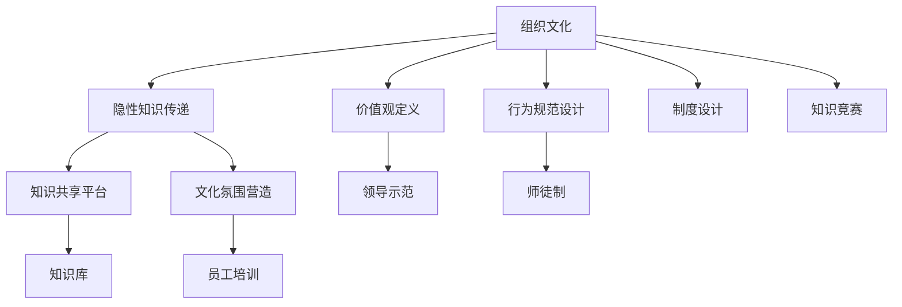

                 

# 知识的隐性传递：组织文化中的无形资产

> 关键词：知识隐性传递,组织文化,无形资产,员工成长,企业文化

## 1. 背景介绍

### 1.1 问题由来

在知识密集型行业中，如科技公司、咨询公司、教育机构等，知识传承和创新是核心竞争力之一。然而，大部分知识往往是隐性的、隐晦的，难以通过正式文档或培训课程系统地传递。这种隐性知识无法通过直接灌输的方式传承，需要通过人际互动、团队协作等方式潜移默化地传递。而组织文化的构建，则是知识隐性传递的重要途径。

组织文化不仅影响员工的工作态度、行为方式，更是知识的汇聚地。通过构建积极向上的组织文化，可以促使员工主动分享、学习和应用知识，形成良性互动的生态系统，从而推动组织创新和成长。

### 1.2 问题核心关键点

组织文化的隐性知识传递涉及以下几个关键点：

- 组织文化的内容构建：如何定义和推广组织价值观、工作方式、行为准则等。
- 知识共享平台的搭建：如何创建便于知识共享和交流的平台，如内部论坛、协作工具等。
- 文化氛围的营造：如何通过制度设计、领导示范、员工培训等方式，营造良好的文化氛围。
- 隐性知识的应用：如何将隐性知识转化为显性知识，如编写标准化流程、创建知识库等。
- 知识传承的机制：如何通过导师制度、师徒制、知识竞赛等方式，促进知识传承。

本博文将重点探讨如何通过组织文化构建，实现知识隐性传递，并着重介绍在隐性知识传递过程中可能面临的挑战及解决方案。

## 2. 核心概念与联系

### 2.1 核心概念概述

在探讨组织文化中的隐性知识传递之前，我们需要先了解几个核心概念：

- **组织文化(Organizational Culture)**：指一个组织内部普遍存在的工作环境、价值观、行为规范和员工心态，是组织成员共同遵循的意识形态和行为准则。
- **隐性知识(Tacit Knowledge)**：指那些不容易被编码、难以直接传递的知识，如经验、洞察、直觉、技能等。
- **知识共享(Knowledge Sharing)**：指通过各种方式将组织内的知识进行传播和交流，实现知识的整合、利用和创新。
- **文化氛围(Cultural Atmosphere)**：指组织内部基于共享价值观、共同行为规范而形成的氛围和环境，影响着员工的态度和行为。

组织文化、隐性知识、知识共享、文化氛围之间相互影响，共同构成了组织知识传递的核心机制。

### 2.2 核心概念原理和架构的 Mermaid 流程图



此流程图展示了组织文化中隐性知识传递的架构：组织文化通过价值观定义和行为规范设计形成基础，通过知识共享平台、文化氛围营造等途径进行传递，最终通过制度设计、师徒制、知识竞赛等机制保障知识传递的效果。

## 3. 核心算法原理 & 具体操作步骤

### 3.1 算法原理概述

组织文化的隐性知识传递，本质上是一个复杂的多层次、多维度知识交流过程。其核心原理在于，通过组织内部的人际互动、团队协作等方式，使得隐性知识在组织成员之间自然传递和积累。

具体来说，这一过程涉及以下几个步骤：

1. **知识识别**：识别出组织中存在的各类隐性知识，包括个人经验、技能、直觉等。
2. **知识传递**：通过面谈、培训、项目合作等方式，将隐性知识传递给其他员工。
3. **知识积累**：将新获得的知识整合到已有的知识库中，形成组织知识资源。
4. **知识应用**：将知识应用到实际工作中，推动组织创新和成长。

### 3.2 算法步骤详解

组织文化中的隐性知识传递，可以大致分为以下步骤：

**Step 1: 知识识别与评估**

1. **问卷调查**：通过问卷调查，识别员工在日常工作中使用的各类隐性知识。
2. **访谈交流**：通过一对一面谈，深入挖掘关键岗位员工的隐性知识。
3. **文档审查**：审查组织内部重要的文档和资料，识别其中的隐性知识。
4. **行为观察**：通过观察员工日常行为，识别出隐性工作流程和经验技巧。

**Step 2: 知识传递与共享**

1. **内部培训**：组织开展针对隐性知识的培训课程，如技能分享、经验交流等。
2. **协作工具**：搭建协作工具，如Slack、Confluence等，促进员工之间的信息共享。
3. **知识论坛**：创建内部知识论坛，鼓励员工发布和讨论工作心得。
4. **专家交流**：邀请行业专家进行讲座或研讨会，传递最新知识和技术。

**Step 3: 知识积累与整合**

1. **知识库构建**：创建知识库，将收集到的隐性知识进行系统整理和存储。
2. **标准流程制定**：编写标准工作流程和操作手册，将隐性知识显性化。
3. **案例分析**：通过案例分析，提炼出最佳实践和经验教训。
4. **知识回顾**：定期回顾和更新知识库，保持其时效性和有效性。

**Step 4: 知识应用与创新**

1. **试点项目**：在特定项目中试点新知识的应用，验证其效果。
2. **反馈改进**：收集反馈意见，对知识应用进行改进和优化。
3. **持续改进**：持续收集和整合新知识，推动组织不断进步。

### 3.3 算法优缺点

组织文化中的隐性知识传递具有以下优点：

1. **促进员工成长**：通过知识共享和应用，员工能够不断提升自己的技能和能力。
2. **增强团队协作**：良好的文化氛围能够促进团队成员之间的信任和协作。
3. **提升组织创新**：通过隐性知识的传递和整合，组织能够更好地应对市场变化和技术更新。

然而，这一过程也存在一些挑战：

1. **知识传递的困难**：隐性知识难以系统地传递，需要通过反复实践和示范才能掌握。
2. **文化氛围的营造**：营造积极的组织文化需要时间和耐心，难以一蹴而就。
3. **知识积累的挑战**：将隐性知识转化为显性知识需要系统化的整理和记录。
4. **知识应用的复杂性**：隐性知识的应用需要情境化和经验化的判断。

### 3.4 算法应用领域

组织文化中的隐性知识传递，广泛应用于各类知识密集型企业，如科技公司、咨询公司、教育机构等。此外，在以下场景中也有广泛应用：

- **项目管理**：通过传递项目管理经验，提升项目成功率和效率。
- **研发创新**：分享技术积累和创新经验，推动研发团队不断进步。
- **市场营销**：传递市场洞察和客户管理经验，提升市场营销效果。
- **客户服务**：传递客户服务最佳实践和经验，提高客户满意度。
- **人力资源**：分享招聘、培训和员工管理经验，提升人力资源管理水平。

## 4. 数学模型和公式 & 详细讲解 & 举例说明

### 4.1 数学模型构建

组织文化的隐性知识传递涉及多个维度和多个层次的知识，因此其数学模型相对复杂。

我们可以将知识传递的过程分为三个阶段：识别、传递和应用。其中，每个阶段都有其特定的数学模型。

- **知识识别**：通过问卷调查、访谈等方式，识别组织中存在的隐性知识，记为 $K_{识别}$。
- **知识传递**：通过培训、协作工具等，将隐性知识传递给其他员工，记为 $K_{传递}$。
- **知识应用**：将知识应用到实际工作中，提升组织绩效，记为 $P_{应用}$。

数学模型可表示为：

$$
P_{应用} = f(K_{识别}, K_{传递})
$$

其中，$f$ 为组织文化和隐性知识传递的函数关系。

### 4.2 公式推导过程

假设组织中存在 $N$ 个隐性知识点，每个知识点的传递效果为 $p_i$，组织应用这些知识点的平均绩效提升为 $P$。则有：

$$
P = \sum_{i=1}^N p_i
$$

其中，$p_i$ 可以表示为：

$$
p_i = \alpha \cdot \text{传递率} + \beta \cdot \text{知识应用效果}
$$

其中，$\alpha$ 为知识传递的系数，$\beta$ 为知识应用效果的系数。

### 4.3 案例分析与讲解

假设某科技公司通过问卷调查识别出 5 个关键隐性知识点，分别为知识管理、敏捷开发、用户体验、市场营销和客户服务。通过内部培训和协作工具传递这些知识，并应用到实际项目中，每个知识点的传递效果和应用效果如下表所示：

| 知识点 | 传递率 | 应用效果 |
| --- | --- | --- |
| 知识管理 | 0.8 | 0.9 |
| 敏捷开发 | 0.7 | 0.85 |
| 用户体验 | 0.6 | 0.95 |
| 市场营销 | 0.5 | 0.9 |
| 客户服务 | 0.4 | 0.8 |

计算总体绩效提升：

$$
P = 0.8 \times 0.9 + 0.7 \times 0.85 + 0.6 \times 0.95 + 0.5 \times 0.9 + 0.4 \times 0.8 = 0.72 + 0.595 + 0.57 + 0.45 + 0.32 = 2.035
$$

即通过知识传递和应用，该科技公司的绩效提升了 2.035 倍。

## 5. 项目实践：代码实例和详细解释说明

### 5.1 开发环境搭建

在进行组织文化中的隐性知识传递项目开发前，我们需要准备好开发环境。以下是使用Python进行知识管理系统的环境配置流程：

1. 安装Python：确保Python 3.x版本，建议使用虚拟环境管理工具如virtualenv。

2. 安装必要的库：安装Flask、SQLAlchemy、pandas等常用库，用于构建Web应用和数据处理。

3. 创建数据库：使用SQLAlchemy创建本地数据库，用于存储知识库信息。

4. 搭建Web应用：使用Flask框架搭建Web应用，实现知识库的增删改查功能。

5. 部署应用：使用Gunicorn、Nginx等工具，将应用部署到服务器上。

完成上述步骤后，即可在本地搭建开发环境，进行知识管理系统的开发。

### 5.2 源代码详细实现

下面以构建一个简单的知识管理系统的代码实现为例，详细解释其功能和使用方法。

首先，定义知识库的数据模型：

```python
from flask_sqlalchemy import SQLAlchemy
from flask import Flask

app = Flask(__name__)
db = SQLAlchemy(app)

class KnowledgeItem(db.Model):
    id = db.Column(db.Integer, primary_key=True)
    title = db.Column(db.String(128), nullable=False)
    content = db.Column(db.Text, nullable=False)
    created_at = db.Column(db.DateTime, default=datetime.now)
    updated_at = db.Column(db.DateTime, default=datetime.now, onupdate=datetime.now)
```

然后，定义API接口和视图：

```python
from flask import request, jsonify

@app.route('/knowledge', methods=['GET', 'POST', 'PUT', 'DELETE'])
def manage_knowledge():
    if request.method == 'GET':
        knowledge = KnowledgeItem.query.all()
        return jsonify([{'id': i.id, 'title': i.title, 'content': i.content} for i in knowledge])
    elif request.method == 'POST':
        title = request.json.get('title')
        content = request.json.get('content')
        knowledge = KnowledgeItem(title=title, content=content)
        db.session.add(knowledge)
        db.session.commit()
        return jsonify({'message': '知识项已创建'})
    elif request.method == 'PUT':
        id = request.json.get('id')
        title = request.json.get('title')
        content = request.json.get('content')
        knowledge = KnowledgeItem.query.filter_by(id=id).first()
        if knowledge:
            knowledge.title = title
            knowledge.content = content
            db.session.commit()
            return jsonify({'message': '知识项已更新'})
        else:
            return jsonify({'error': '知识项不存在'})
    elif request.method == 'DELETE':
        id = request.json.get('id')
        knowledge = KnowledgeItem.query.filter_by(id=id).first()
        if knowledge:
            db.session.delete(knowledge)
            db.session.commit()
            return jsonify({'message': '知识项已删除'})
        else:
            return jsonify({'error': '知识项不存在'})
```

最后，启动应用：

```python
if __name__ == '__main__':
    db.create_all()
    app.run(debug=True)
```

以上代码实现了基本的知识管理功能，包括查询、创建、更新和删除知识项。开发者可以根据需求，进一步扩展功能，如权限管理、知识分类、搜索排序等。

### 5.3 代码解读与分析

**知识库模型**：
- `KnowledgeItem`模型定义了知识项的基本信息，包括id、标题、内容、创建时间和更新时间。
- `id`为数据库自增主键，确保唯一性。
- `title`和`content`为必填项，用于存储知识的具体内容和标题。
- `created_at`和`updated_at`为时间戳字段，记录知识项的创建和更新时间。

**API接口**：
- `/knowledge`路径支持HTTP方法 GET、POST、PUT、DELETE。
- GET方法用于查询所有知识项，返回JSON格式的列表。
- POST方法用于创建新的知识项，接收JSON格式的请求体，包含`title`和`content`字段。
- PUT方法用于更新现有的知识项，接收JSON格式的请求体，包含`id`、`title`和`content`字段。
- DELETE方法用于删除指定的知识项，接收JSON格式的请求体，包含`id`字段。

**应用启动**：
- `db.create_all()`创建数据库表结构。
- `app.run(debug=True)`启动Flask应用，并在调试模式下运行。

通过以上代码，即可实现基本的知识管理功能，进一步的开发可以结合用户认证、权限控制、知识分类等功能，构建更加完整、实用的知识管理系统。

## 6. 实际应用场景

### 6.1 智能客服系统

智能客服系统需要不断积累用户反馈和互动经验，形成知识库，以提升客服服务的质量。通过组织文化的隐性知识传递，可以迅速积累并应用客户服务经验，提高客服系统的智能化水平。

具体来说，可以在客服系统中引入知识库查询和推荐功能，通过智能匹配用户输入，推荐相关知识项供客服参考。同时，通过知识库的实时更新和应用，不断积累客户服务经验，形成标准化的工作流程和最佳实践，提升整个客服团队的效率和效果。

### 6.2 人力资源管理

在人力资源管理中，隐性知识传递尤为重要。通过组织文化的构建，可以将招聘、培训、员工管理等经验进行系统化、规范化，形成标准化的操作流程和培训课程。

例如，可以将员工入职培训、员工绩效评估、职业发展规划等经验，形成标准化的培训课程，通过内部培训和知识库分享，使新员工快速适应工作，提升整个团队的凝聚力和战斗力。

### 6.3 产品研发管理

在产品研发管理中，隐性知识传递同样重要。通过组织文化的构建，可以形成产品研发的规范和流程，提升研发效率和产品质量。

例如，可以将项目管理、需求分析、设计评审等经验，形成标准化的流程和规范，通过知识库分享和培训课程，使研发团队快速掌握新技能，提升研发质量和效率。

## 7. 工具和资源推荐

### 7.1 学习资源推荐

为了帮助开发者系统掌握组织文化中的隐性知识传递的理论基础和实践技巧，这里推荐一些优质的学习资源：

1. **《组织行为学》**：经典管理类书籍，系统讲解组织行为、文化和知识传递的基本原理和方法。
2. **《知识管理实践指南》**：提供系统化的知识管理方法论和实际案例，帮助企业构建知识管理系统。
3. **《敏捷软件开发》**：介绍敏捷开发的核心思想和实践方法，提升团队协作和知识共享能力。
4. **《人力资源管理》**：讲解人力资源管理的理论和实践，提供招聘、培训、绩效管理等方面的知识。
5. **《项目管理知识体系指南(PMBOK)》**：提供系统化的项目管理知识体系，帮助团队提升项目管理能力。

通过这些资源的学习实践，相信你一定能够系统掌握组织文化中隐性知识传递的精髓，并用于解决实际的组织管理问题。

### 7.2 开发工具推荐

高效的开发离不开优秀的工具支持。以下是几款用于组织文化中隐性知识传递开发的常用工具：

1. **Flask**：基于Python的Web框架，轻量级、灵活性好，适合构建小型知识管理系统。
2. **SQLAlchemy**：提供ORM功能，简化数据库操作，方便数据存储和查询。
3. **Gunicorn**：Python WSGI HTTP服务器，支持多进程和多线程，适合部署高并发的知识管理系统。
4. **Nginx**：高性能的HTTP和反向代理服务器，支持负载均衡和缓存，适合部署Web应用。
5. **JIRA**：项目管理工具，提供敏捷开发和任务管理功能，支持知识库和文档共享。

合理利用这些工具，可以显著提升组织文化中隐性知识传递的开发效率，加快创新迭代的步伐。

### 7.3 相关论文推荐

组织文化中的隐性知识传递源于学界的持续研究。以下是几篇奠基性的相关论文，推荐阅读：

1. **《组织文化与组织绩效的关系研究》**：研究组织文化和组织绩效之间的联系，提出文化导向的管理策略。
2. **《隐性知识的共享与组织学习》**：探讨隐性知识共享的机制和模型，提出知识共享的策略和方法。
3. **《敏捷开发中的知识管理》**：介绍敏捷开发中的知识管理实践，提升团队协作和知识共享能力。
4. **《人力资源管理中的知识传递》**：研究人力资源管理中的知识传递机制，提出知识传递的有效方法。
5. **《知识管理在项目中的应用》**：探讨知识管理在项目管理中的作用和实现方法，提升项目管理效率。

这些论文代表了大语言模型微调技术的发展脉络。通过学习这些前沿成果，可以帮助研究者把握学科前进方向，激发更多的创新灵感。

## 8. 总结：未来发展趋势与挑战

### 8.1 总结

本文对组织文化中的隐性知识传递进行了全面系统的介绍。首先阐述了组织文化构建在知识管理中的重要性，明确了隐性知识传递在组织成长和创新中的关键作用。其次，从原理到实践，详细讲解了隐性知识传递的数学模型和操作步骤，给出了隐性知识传递项目开发的完整代码实例。同时，本文还广泛探讨了隐性知识传递在智能客服、人力资源、产品研发等多个领域的应用前景，展示了组织文化在知识传递中的巨大潜力。此外，本文精选了隐性知识传递的相关学习资源，力求为读者提供全方位的技术指引。

通过本文的系统梳理，可以看到，组织文化中的隐性知识传递不仅是企业管理的重要环节，更是提升组织竞争力和创新力的关键。通过构建积极的组织文化，利用知识共享平台和协作工具，组织可以不断积累和传递隐性知识，推动员工成长和组织进步。未来，伴随知识管理技术的不断发展，组织文化的构建将更加科学化、系统化，进一步提升组织知识管理的效率和效果。

### 8.2 未来发展趋势

展望未来，组织文化中的隐性知识传递将呈现以下几个发展趋势：

1. **智能化提升**：借助人工智能技术，如自然语言处理、机器学习等，提升知识管理和共享的智能化水平，使隐性知识传递更加高效和精确。
2. **数字化转型**：通过数字化手段，如知识管理系统、协作平台等，实现知识的在线化、自动化管理，提升组织知识管理的效率。
3. **多模态融合**：将文字、语音、图像等多模态信息融合，提升知识获取和传递的丰富性和多样性，使知识共享更加直观和便捷。
4. **跨组织协作**：通过跨组织知识共享平台，促进不同组织之间的知识交流和合作，提升整体知识管理水平。
5. **知识社会化**：将知识管理从组织内部扩展到全社会，形成知识生态系统，推动全社会的知识共享和创新。

以上趋势凸显了组织文化中隐性知识传递的广阔前景。这些方向的探索发展，必将进一步提升组织知识管理的效率和效果，为组织创新和成长注入新的动力。

### 8.3 面临的挑战

尽管组织文化中的隐性知识传递在企业管理中已取得显著成效，但在迈向更加智能化、系统化应用的过程中，仍面临诸多挑战：

1. **知识难以系统化**：隐性知识难以系统化整理和存储，需要投入大量时间和精力。
2. **文化氛围难营造**：营造积极向上的组织文化需要时间和耐心，难以一蹴而就。
3. **知识共享难度大**：不同团队、部门之间知识共享存在壁垒，难以形成统一的共享平台。
4. **知识应用复杂**：隐性知识的应用需要情境化和经验化的判断，存在较大不确定性。
5. **知识更新速度慢**：知识库的更新和维护需要持续投入，难以跟上技术和市场的快速变化。

### 8.4 研究展望

面对组织文化中隐性知识传递所面临的种种挑战，未来的研究需要在以下几个方面寻求新的突破：

1. **知识图谱构建**：利用知识图谱技术，将组织内部的知识进行系统化的建模和整合，提升知识管理的效率和效果。
2. **人工智能辅助**：借助自然语言处理、机器学习等人工智能技术，提升知识获取和传递的智能化水平，降低知识管理的复杂性。
3. **知识库协同**：开发知识库协同工具，促进不同团队、部门之间的知识共享和合作，提升整体知识管理水平。
4. **知识社会化**：通过跨组织知识共享平台，促进不同组织之间的知识交流和合作，提升整体知识管理水平。
5. **知识资产化**：将知识管理与资产管理相结合，提升知识价值的转化和应用，推动知识转化为实际生产力。

这些研究方向将为组织文化中隐性知识传递带来新的突破，推动知识管理的智能化、系统化发展，为组织创新和成长注入新的动力。

## 9. 附录：常见问题与解答

**Q1: 组织文化中的隐性知识传递如何与正式文档和培训课程相结合？**

A: 组织文化中的隐性知识传递和正式文档、培训课程是互补的。正式文档和培训课程可以帮助员工系统地学习组织内部的显性知识，而隐性知识传递则通过日常工作和团队协作，使员工在实际应用中掌握隐性知识。两者结合，可以形成系统化的知识体系，使员工能够全面、深入地掌握组织的知识和技能。

**Q2: 如何评估组织文化中隐性知识传递的效果？**

A: 评估组织文化中隐性知识传递的效果，可以从以下几个方面入手：
1. **知识库更新频率**：定期检查知识库的更新频率，了解知识共享的活跃度。
2. **知识应用效果**：通过业务指标（如客户满意度、产品创新速度等）评估知识应用的效果。
3. **员工反馈**：定期收集员工对知识管理系统的使用反馈，了解系统的不足和改进方向。
4. **知识传承情况**：通过师徒制、知识竞赛等机制，评估新员工的知识掌握情况。

**Q3: 组织文化中的隐性知识传递需要哪些具体措施？**

A: 组织文化中的隐性知识传递需要以下具体措施：
1. **知识共享平台**：搭建知识共享平台，如内部论坛、协作工具等，促进员工之间的信息共享。
2. **知识库构建**：创建知识库，将收集到的隐性知识进行系统整理和存储。
3. **文化氛围营造**：通过制度设计、领导示范、员工培训等方式，营造良好的文化氛围，鼓励知识共享和应用。
4. **知识传承机制**：通过导师制度、师徒制、知识竞赛等方式，促进知识传承和应用。
5. **知识应用评估**：定期评估知识应用的效果，及时调整和改进知识管理策略。

**Q4: 组织文化中的隐性知识传递如何应对跨部门合作中的知识障碍？**

A: 跨部门合作中的知识障碍可以通过以下措施应对：
1. **跨部门沟通机制**：建立跨部门沟通机制，如定期例会、联合项目等，促进不同部门之间的交流和合作。
2. **知识共享平台**：搭建跨部门的共享平台，如企业内部的知识管理系统，方便不同部门之间的知识共享和查询。
3. **跨部门培训**：组织跨部门的培训课程，提升各部门员工的知识水平和协作能力。
4. **知识库协作**：创建跨部门的联合知识库，将不同部门的知识进行整合和共享，提升整体知识管理水平。

通过以上措施，可以有效地应对跨部门合作中的知识障碍，提升组织的知识共享和应用效果。

**Q5: 组织文化中的隐性知识传递如何应对知识更新速度慢的问题？**

A: 应对知识更新速度慢的问题，可以从以下几个方面入手：
1. **知识库实时更新**：建立知识库的实时更新机制，确保知识库的内容能够及时反映最新的知识和技能。
2. **知识竞赛和挑战**：定期举办知识竞赛和挑战活动，鼓励员工积极学习和应用新知识。
3. **知识评估和反馈**：通过知识评估和反馈机制，及时发现知识管理中的不足和改进方向，推动知识库的持续优化。
4. **跨部门知识共享**：通过跨部门的知识共享和合作，推动知识的快速传播和应用。

通过以上措施，可以提升组织文化中隐性知识传递的效率和效果，应对知识更新速度慢的问题。

**Q6: 组织文化中的隐性知识传递如何应对知识难以系统化的问题？**

A: 应对知识难以系统化的问题，可以从以下几个方面入手：
1. **知识分类和标签**：对知识进行分类和标签管理，提升知识检索和应用的效果。
2. **知识地图**：利用知识地图技术，将知识进行结构化展示，方便员工查找和应用。
3. **知识图谱构建**：通过知识图谱技术，将组织内部的知识进行系统化的建模和整合，提升知识管理的效率和效果。
4. **知识管理系统**：采用知识管理系统，对知识进行在线化和自动化管理，提升知识管理的效率和效果。

通过以上措施，可以应对知识难以系统化的问题，提升组织文化中隐性知识传递的效果。

---

作者：禅与计算机程序设计艺术 / Zen and the Art of Computer Programming

