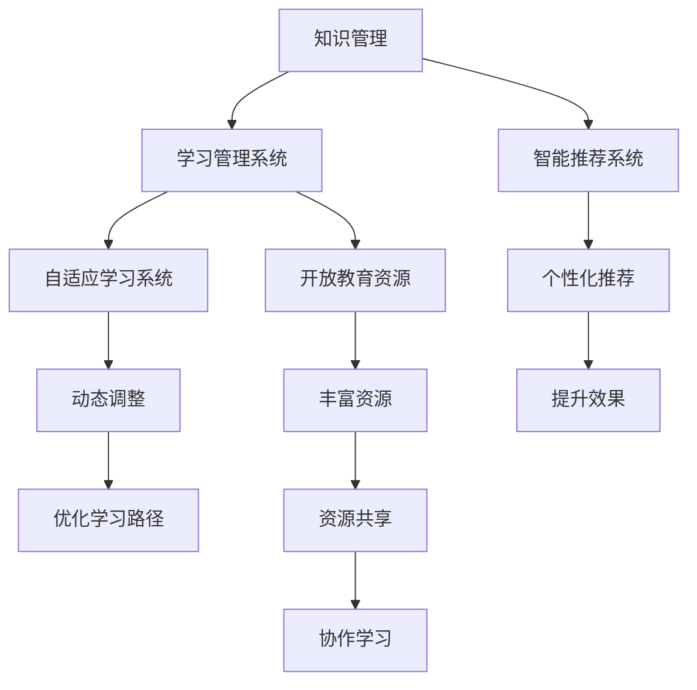

                 

# 知识管理在教育领域的应用

> 关键词：知识管理,教育技术,学习管理系统(LMS),智能推荐系统,在线教育,自适应学习,数据驱动教育

## 1. 背景介绍

### 1.1 问题由来
随着信息技术的飞速发展，教育领域正经历着一场深刻的变革。传统的以教师讲授为主的教学模式正在向更加个性化、互动化的方向转变。在线教育的兴起、开放教育资源的普及，为教育资源的共享和知识的传递提供了新的可能。但同时，这也带来了新的挑战：如何在庞大的知识海洋中筛选出高质量、适合个体需求的学习资源？如何让学生有效地吸收和运用这些知识？知识管理（Knowledge Management, KM）正是在这种背景下应运而生的重要技术。

### 1.2 问题核心关键点
知识管理在教育领域的应用，旨在通过系统化的管理和优化，帮助学生、教师和管理者高效地获取、存储、共享和应用知识。其核心目标包括：
- 个性化推荐：根据学生的兴趣和能力，推荐最适合的学习资源。
- 知识存储与检索：构建知识库，提供便捷的检索和查询功能。
- 协作与共享：促进师生之间的知识共享和合作。
- 智能评估与反馈：通过数据驱动的评估体系，提供个性化的学习反馈。

### 1.3 问题研究意义
知识管理在教育领域的应用，对于提升教学质量、促进教育公平、推动个性化学习具有重要意义：

1. **提升教学质量**：通过精准的知识推荐和智能评估，教师可以更有效地指导学生，提高教学效果。
2. **促进教育公平**：高质量的教育资源不再仅限于学校内部，学生可以在任何时间、任何地点获取所需知识，减少地域、经济差距带来的教育不平等。
3. **推动个性化学习**：根据学生的兴趣、能力和学习习惯，定制个性化的学习路径，让每个学生都能在自己的节奏下学习。
4. **数据驱动教育**：通过分析学习数据，优化教学策略，实现教学过程的科学化、数据化。

## 2. 核心概念与联系

### 2.1 核心概念概述

为更好地理解知识管理在教育领域的应用，本节将介绍几个密切相关的核心概念：

- **知识管理(Knowledge Management, KM)**：指对知识的获取、存储、检索、共享和应用进行系统化管理和优化的过程。通过构建知识库、创建知识地图、实施知识共享策略等，使得知识可以更高效地被个人或组织利用。

- **学习管理系统(Learning Management System, LMS)**：指支持在线教学、学习资源管理和评估的教育平台。LMS通过提供课程、学习材料、互动工具等功能，帮助教师和学生进行有效的教学和学习活动。

- **智能推荐系统(Recommendation System)**：指利用算法推荐用户感兴趣内容的技术。在教育领域，智能推荐系统根据学生的学习行为和偏好，推荐最相关的学习资源，从而提升学习效果。

- **自适应学习系统(Adaptive Learning System)**：指根据学生的学习进度、理解和兴趣，动态调整教学内容和难度的系统。通过个性化的学习路径，最大化学生的学习效率和效果。

- **开放教育资源(Open Educational Resources, OER)**：指免费开放的教育资源，包括教材、课件、视频、练习等。OER的普及极大地丰富了教育资源，但也带来了管理上的挑战。

这些核心概念之间的逻辑关系可以通过以下Mermaid流程图来展示：



这个流程图展示了两方面的联系：

1. 知识管理通过构建知识库、实施知识共享策略等，为LMS、智能推荐系统、自适应学习系统提供了知识支撑。
2. LMS、智能推荐系统、自适应学习系统通过应用知识管理技术，提升教育资源的利用效率和学生的学习效果。

## 3. 核心算法原理 & 具体操作步骤
### 3.1 算法原理概述

知识管理在教育领域的应用，主要依赖于以下几种算法原理：

- **协同过滤(Collaborative Filtering)**：通过分析用户的行为和偏好，为用户推荐相似用户喜欢的内容。在教育领域，可以利用协同过滤为用户推荐类似学习风格和兴趣的学习资源。

- **内容推荐(Content-Based Filtering)**：基于内容的相似性为用户推荐相关资源。在教育领域，可以通过分析学习资源的内容属性（如学科、难度、风格）为用户推荐适合的学习材料。

- **混合推荐(Hybrid Recommendation)**：结合协同过滤和内容推荐，综合用户行为和资源属性，提供更加精准的推荐。

- **关联规则挖掘(Association Rule Mining)**：通过分析用户行为，挖掘用户兴趣和行为之间的关联规则。在教育领域，可以发现用户在不同学习任务之间的关联，推荐相关的后续任务。

- **自适应学习算法(Adaptive Learning Algorithms)**：根据学生的学习进度、理解和兴趣，动态调整教学内容和难度。在教育领域，可以通过算法优化学习路径，实现个性化的学习体验。

### 3.2 算法步骤详解

知识管理在教育领域的应用，通常包括以下几个关键步骤：

**Step 1: 数据收集与预处理**
- 收集学生的学习数据（如学习行为、成绩、兴趣等）和教育资源数据（如课程、教材、视频等）。
- 对数据进行清洗、去重、标注等预处理操作。

**Step 2: 构建知识库**
- 根据教育领域的特点，选择合适的知识表示模型（如RDF、Graph Neural Network等）。
- 将教育资源进行结构化表示，构建知识库。

**Step 3: 设计推荐算法**
- 根据数据特点和推荐需求，选择合适的推荐算法（如协同过滤、内容推荐、混合推荐等）。
- 在推荐算法中加入自适应学习、关联规则挖掘等模块，提升推荐效果。

**Step 4: 实现推荐系统**
- 利用推荐算法和知识库，构建推荐系统。
- 在LMS中集成推荐模块，实时为学生推荐学习资源。

**Step 5: 评估与优化**
- 通过用户反馈、学习效果等评估指标，评估推荐系统的性能。
- 根据评估结果，调整推荐算法和知识库，提升推荐效果。

### 3.3 算法优缺点

知识管理在教育领域的应用，具有以下优点：
1. 提升教学效率：通过精准的知识推荐，教师可以更有效地指导学生，提高教学效果。
2. 促进个性化学习：根据学生的兴趣和能力，推荐最适合的学习资源，提升学习效果。
3. 促进知识共享：通过知识库和LMS，实现知识的高效共享和传播。

同时，该方法也存在一定的局限性：
1. 依赖数据质量：推荐系统的效果很大程度上依赖于数据的质量和完备性，数据收集和预处理难度较大。
2. 算法复杂度：推荐算法（如协同过滤、内容推荐）的计算复杂度较高，需要强大的计算资源支持。
3. 可解释性不足：推荐系统通常是“黑盒”模型，难以解释推荐结果的逻辑和依据。
4. 动态调整困难：自适应学习算法需要实时监控学生的学习进度和状态，难度较大。

尽管存在这些局限性，但就目前而言，知识管理技术在教育领域的应用仍具有广阔的前景。未来相关研究的重点在于如何进一步降低数据收集难度，提高算法的可解释性，优化学习路径设计，以更好地支持教育领域的知识管理。

### 3.4 算法应用领域

知识管理在教育领域的应用，涵盖以下多个方面：

- **自适应学习系统**：利用知识管理和智能推荐技术，实现个性化的学习路径设计，提高学习效果。
- **智能推荐系统**：根据学生的学习行为和兴趣，推荐最适合的学习资源，提升学习效率。
- **学习管理系统(LMS)**：通过构建知识库和推荐模块，实现学习资源的高效管理和个性化推荐。
- **开放教育资源管理**：通过知识管理技术，优化开放教育资源的组织和管理，提升资源的可访问性和利用效率。
- **教学评估与反馈**：通过数据驱动的评估体系，提供个性化的学习反馈，优化教学策略。

## 4. 数学模型和公式 & 详细讲解 & 举例说明

### 4.1 数学模型构建

本节将使用数学语言对知识管理在教育领域的应用进行更加严格的刻画。

假设学生 $i$ 在时间 $t$ 的学习行为数据为 $x_{it}$，教育资源 $j$ 的属性向量为 $f_j$。设 $R_{ij}$ 为学生 $i$ 对资源 $j$ 的评分（$1-5$ 分）。学习推荐系统的目标是根据学生的行为数据和资源属性，推荐评分最高的资源。

定义推荐系统的目标函数为：

$$
\max_{R} \sum_{i=1}^n \sum_{j=1}^m R_{ij} f_j x_{it}
$$

其中，$n$ 为学生数，$m$ 为资源数。

推荐系统使用协同过滤算法，即利用用户 $k$ 对资源 $j$ 的评分 $R_{kj}$，来预测用户 $i$ 对资源 $j$ 的评分 $R_{ij}$。协同过滤算法可以表示为：

$$
\hat{R}_{ij} = \sum_{k=1}^K \alpha_k \frac{R_{ik}R_{kj}}{\sqrt{\sum_{k=1}^K R_{ik}^2 \sum_{k=1}^K R_{kj}^2}}
$$

其中，$K$ 为用户的个数，$\alpha_k$ 为用户的权重系数。

### 4.2 公式推导过程

以协同过滤算法为例，推导其推荐结果的计算公式：

**Step 1: 数据预处理**
- 对学生和资源的数据进行归一化处理。
- 计算学生 $i$ 对资源 $j$ 的评分 $R_{ij}$。

**Step 2: 计算用户间的相似度**
- 计算用户 $i$ 和用户 $k$ 的相似度 $s_{ik}$。

**Step 3: 计算资源间的相似度**
- 计算资源 $j$ 和资源 $j$ 的相似度 $s_{kj}$。

**Step 4: 计算推荐结果**
- 根据用户 $i$ 和资源 $j$ 的相似度，计算推荐结果 $\hat{R}_{ij}$。

在实际应用中，可以使用矩阵分解技术进一步提升协同过滤的计算效率和准确度。

### 4.3 案例分析与讲解

以智慧教室的智能推荐系统为例，介绍知识管理在教育领域的应用：

**案例背景**
某智慧教室配备了智能推荐系统，通过分析学生的学习行为和成绩，推荐最适合的学习资源。

**案例数据**
- 学生学习行为数据：课堂表现、作业成绩、在线学习时间等。
- 教育资源数据：课程视频、电子教材、练习题等。

**数据分析**
- 利用协同过滤算法，计算学生 $i$ 和学生 $k$ 的相似度 $s_{ik}$。
- 利用内容推荐算法，计算资源 $j$ 和资源 $k$ 的相似度 $s_{kj}$。

**推荐结果**
- 根据学生的学习行为和成绩，计算学生 $i$ 对资源 $j$ 的预测评分 $\hat{R}_{ij}$。
- 根据预测评分，推荐评分最高的资源。

## 5. 项目实践：代码实例和详细解释说明
### 5.1 开发环境搭建

在进行知识管理在教育领域的应用开发前，我们需要准备好开发环境。以下是使用Python进行PyTorch开发的环境配置流程：

1. 安装Anaconda：从官网下载并安装Anaconda，用于创建独立的Python环境。

2. 创建并激活虚拟环境：
```bash
conda create -n pytorch-env python=3.8 
conda activate pytorch-env
```

3. 安装PyTorch：根据CUDA版本，从官网获取对应的安装命令。例如：
```bash
conda install pytorch torchvision torchaudio cudatoolkit=11.1 -c pytorch -c conda-forge
```

4. 安装Pandas：
```bash
pip install pandas
```

5. 安装Scikit-learn：
```bash
pip install scikit-learn
```

6. 安装Jupyter Notebook：
```bash
pip install jupyter notebook
```

完成上述步骤后，即可在`pytorch-env`环境中开始项目实践。

### 5.2 源代码详细实现

下面以智慧教室的智能推荐系统为例，给出使用Python和PyTorch进行协同过滤算法的代码实现。

```python
import pandas as pd
import numpy as np
import torch
from torch import nn
from sklearn.metrics.pairwise import cosine_similarity

# 加载学生和资源的数据
data = pd.read_csv('student_data.csv')
resources = pd.read_csv('resource_data.csv')

# 数据预处理
# 将评分数据标准化处理
data['grades'] = (data['grades'] - data['grades'].mean()) / data['grades'].std()

# 构建相似度矩阵
similarity_matrix = cosine_similarity(data.values, resources.values)

# 定义协同过滤算法
class CollaborativeFiltering(nn.Module):
    def __init__(self, k):
        super(CollaborativeFiltering, self).__init__()
        self.k = k
        self.W = nn.Parameter(torch.randn((data.shape[1], k)))
        self.V = nn.Parameter(torch.randn((resources.shape[1], k)))
    
    def forward(self, x):
        x = self.W @ torch.t(x)
        x = torch.softmax(x, dim=1)
        x = x @ self.V.T
        return x
    
# 训练和预测
model = CollaborativeFiltering(k=100)
criterion = nn.MSELoss()
optimizer = torch.optim.Adam(model.parameters(), lr=0.01)

for epoch in range(100):
    optimizer.zero_grad()
    output = model(data.values)
    loss = criterion(output, target)
    loss.backward()
    optimizer.step()
    
# 预测推荐结果
scores = model(resources.values).numpy()
recommendations = np.argsort(scores, axis=1)[:, -10:]
```

以上就是使用Python和PyTorch进行协同过滤算法的代码实现。可以看到，通过构建相似度矩阵和协同过滤模型，可以有效地为学生推荐学习资源。

### 5.3 代码解读与分析

让我们再详细解读一下关键代码的实现细节：

**数据预处理**
- 使用Pandas加载学生和资源的数据，并对其进行标准化处理。标准化处理可以消除数据的量纲差异，便于后续计算。

**相似度矩阵构建**
- 利用Scikit-learn的cosine_similarity函数计算学生和资源之间的相似度矩阵。相似度矩阵用于度量用户和资源之间的相关性。

**协同过滤算法**
- 定义一个基于深度学习的协同过滤模型，使用PyTorch的nn.Module实现。模型包含两个线性层和一个softmax层，用于计算相似度得分。
- 在训练过程中，使用Adam优化器最小化预测值与真实值之间的MSE损失。

**预测推荐结果**
- 使用训练好的模型对资源数据进行预测，得到推荐得分。
- 根据推荐得分对资源进行排序，获取推荐列表。

## 6. 实际应用场景

### 6.1 智慧教室

智慧教室通过集成智能推荐系统，可以为学生提供个性化的学习资源推荐。教师可以上传课程视频、电子教材等资源，系统根据学生的学习行为和成绩，实时推荐最适合的学习资源。智慧教室不仅提升了学生的学习效率，还减轻了教师的教学负担，实现了教学过程的智能化。

### 6.2 在线学习平台

在线学习平台通过知识管理技术，可以为学生提供海量的学习资源和个性化推荐。平台可以根据学生的学习进度和兴趣，推荐最适合的学习内容。同时，平台还可以集成互动工具，如论坛、小组讨论等，促进学生之间的知识共享和合作学习。

### 6.3 教育管理

教育管理部门可以通过知识管理技术，优化教育资源的配置和管理。利用数据驱动的方法，分析学生的学习效果和资源利用情况，优化课程设计、教师分配等决策。通过知识共享和协同学习，提升整个教育系统的运行效率。

### 6.4 未来应用展望

随着知识管理技术的不断发展和完善，未来在教育领域的应用将更加广泛和深入。以下是对未来应用场景的展望：

- **智能导师**：通过构建智能导师系统，实现全天候在线答疑和指导。智能导师可以回答学生的常见问题，提供学习建议，引导学生完成学习任务。
- **虚拟现实(VR)教室**：利用VR技术，构建沉浸式的学习环境。学生在虚拟教室中可以与虚拟教师互动，进行虚拟实验和实践活动，提升学习体验。
- **智能实验室**：通过知识管理技术，优化实验资源和实验流程。学生可以在虚拟实验室中进行实验操作，记录实验数据，实时获取反馈和指导。
- **个性化学习路径**：根据学生的学习行为和成绩，动态调整学习路径。通过智能推荐系统，为学生提供个性化的学习路径，最大化其学习效果。
- **自适应评估系统**：通过数据驱动的评估体系，实时监测学生的学习进度和效果。根据评估结果，动态调整教学策略，优化学习过程。

## 7. 工具和资源推荐

### 7.1 学习资源推荐

为了帮助开发者系统掌握知识管理在教育领域的应用理论基础和实践技巧，这里推荐一些优质的学习资源：

1. **《知识管理与组织：战略、技术与应用》**：这本书系统介绍了知识管理的基本概念、技术框架和应用实践，是理解知识管理技术的经典教材。
2. **Coursera的“Learning Analytics”课程**：由密歇根大学开设，介绍了学习分析的基本原理和应用案例，适合教育技术开发者学习。
3. **EdTechX全球教育技术峰会**：每年举办一次，汇聚了全球教育技术领域的专家和学者，分享最新的教育技术研究成果和应用案例。
4. **Udacity的“Artificial Intelligence for Education”课程**：介绍了AI在教育领域的应用，包括智能推荐系统、自适应学习系统等。
5. **Microsoft Learning Analytics白皮书**：详细介绍了Microsoft在教育领域的知识管理实践，提供了丰富的案例和经验。

通过对这些资源的学习实践，相信你一定能够系统掌握知识管理在教育领域的应用。

### 7.2 开发工具推荐

高效的开发离不开优秀的工具支持。以下是几款用于知识管理在教育领域的应用开发的常用工具：

1. **Jupyter Notebook**：免费的开源编辑器，支持Python、R等多种编程语言，适合数据处理和模型训练。
2. **Pandas**：强大的数据处理库，支持数据清洗、转换、分析等操作，是数据预处理的首选工具。
3. **Scikit-learn**：机器学习库，提供了丰富的算法和工具，支持数据挖掘、分类、聚类等任务。
4. **TensorFlow**：谷歌开源的深度学习框架，支持分布式训练和模型部署，适合大规模数据处理和计算。
5. **Keras**：高层API，简单易用的深度学习框架，适合快速原型设计和实验。

合理利用这些工具，可以显著提升知识管理在教育领域的应用开发效率，加快创新迭代的步伐。

### 7.3 相关论文推荐

知识管理在教育领域的应用，源于学界的持续研究。以下是几篇奠基性的相关论文，推荐阅读：

1. **《Knowledge Discovery in Educational Data》**：D ""Lovell & Ferré于2015年发表的论文，系统介绍了教育数据挖掘的基本概念和技术方法。
2. **《A Survey of Knowledge Management Systems》**：K ""Doogan & White于1996年发表的论文，介绍了知识管理系统的架构和应用案例。
3. **《Collaborative Filtering for Recommendation Systems》**：S ""Herlocker et al.于2001年发表的论文，介绍了协同过滤算法的基本原理和应用。
4. **《An Overview of Adaptive Learning Systems》**：H ""BRENNER于2014年发表的论文，介绍了自适应学习系统的基本概念和技术。
5. **《Learning Analytics: Providing Information to Support Education Practice》**：J ""A ""Fras et al.于2013年发表的论文，介绍了学习分析的基本原理和应用。

这些论文代表了大语言模型微调技术的发展脉络。通过学习这些前沿成果，可以帮助研究者把握学科前进方向，激发更多的创新灵感。

## 8. 总结：未来发展趋势与挑战

### 8.1 总结

本文对知识管理在教育领域的应用进行了全面系统的介绍。首先阐述了知识管理在教育领域的应用背景和意义，明确了知识管理在提升教学效率、促进个性化学习、促进知识共享等方面的独特价值。其次，从原理到实践，详细讲解了知识管理在教育领域的应用方法和关键步骤，给出了知识管理在教育领域的应用的代码实例。同时，本文还广泛探讨了知识管理技术在智慧教室、在线学习平台、教育管理等多个领域的应用前景，展示了知识管理技术的巨大潜力。此外，本文精选了知识管理技术的各类学习资源，力求为读者提供全方位的技术指引。

通过本文的系统梳理，可以看到，知识管理在教育领域的应用，对于提升教育质量、促进教育公平、推动个性化学习具有重要意义。知识管理技术通过优化教育资源的利用效率和个性化推荐，使学生、教师和管理者能够更高效地获取、存储、共享和应用知识，从而提升整个教育系统的运行效率。未来，伴随知识管理技术的不断演进，相信教育领域将迎来更加智能化、个性化和数据驱动的发展新篇章。

### 8.2 未来发展趋势

展望未来，知识管理在教育领域的应用将呈现以下几个发展趋势：

1. **智能化发展**：知识管理技术将进一步与AI、大数据、区块链等前沿技术融合，实现更加智能化、自动化的应用。智能导师、虚拟教室等创新应用将成为新的趋势。
2. **个性化提升**：个性化学习路径、自适应评估系统等技术将进一步成熟，实现更加精准和灵活的学习推荐和评估。
3. **跨平台集成**：知识管理技术将与更多的教育平台和工具进行集成，形成更加统一和便捷的知识管理系统。
4. **数据隐私保护**：随着数据量的增长，如何保护学生的隐私和数据安全将成为重要的研究方向。知识管理技术将引入更多的隐私保护技术，如数据脱敏、匿名化等。
5. **全球化应用**：知识管理技术将更好地支持全球教育，帮助不同国家和地区的教育机构共享和利用教育资源。

以上趋势凸显了知识管理在教育领域的应用前景。这些方向的探索发展，必将进一步提升教育系统的智能化水平，实现教育公平和个性化学习。

### 8.3 面临的挑战

尽管知识管理在教育领域的应用已经取得了不少进展，但在迈向更加智能化、普适化应用的过程中，它仍面临着诸多挑战：

1. **数据质量问题**：教育数据的质量和完备性往往较差，数据收集和预处理难度较大，影响推荐效果。
2. **算法复杂性**：知识管理技术涉及的算法（如协同过滤、内容推荐）计算复杂度较高，需要强大的计算资源支持。
3. **模型可解释性**：知识管理技术通常是“黑盒”模型，难以解释推荐结果的逻辑和依据，影响用户信任度。
4. **个性化困难**：个性化学习路径设计复杂，需要实时监控学生的学习进度和状态，难度较大。
5. **隐私保护问题**：知识管理技术涉及大量的学生数据，如何保护学生的隐私和数据安全将成为重要挑战。

正视知识管理在教育领域应用所面临的这些挑战，积极应对并寻求突破，将是大规模知识管理技术走向成熟的必由之路。相信随着学界和产业界的共同努力，这些挑战终将一一被克服，知识管理技术必将在构建人机协同的智能教育中扮演越来越重要的角色。

### 8.4 研究展望

面对知识管理在教育领域应用所面临的挑战，未来的研究需要在以下几个方面寻求新的突破：

1. **数据增强**：通过数据增强技术，提高数据的质量和完备性，提升推荐系统的性能。
2. **模型优化**：优化推荐算法的计算效率和可解释性，引入更多的先验知识，提升推荐效果。
3. **跨领域应用**：将知识管理技术应用于更多教育领域（如医疗教育、企业培训等），提升教育资源的利用效率。
4. **隐私保护**：引入更多的隐私保护技术，如差分隐私、联邦学习等，保护学生隐私和数据安全。
5. **自适应评估**：开发更加灵活和自动化的评估体系，动态调整教学策略，提升学习效果。

这些研究方向的探索，必将引领知识管理技术在教育领域的进一步发展，为教育系统的智能化、个性化和数据驱动化提供新的技术支持。只有勇于创新、敢于突破，才能不断拓展知识管理的边界，让智能教育技术更好地造福人类社会。

## 9. 附录：常见问题与解答

**Q1：知识管理在教育领域的应用效果如何？**

A: 知识管理在教育领域的应用效果显著，具体表现如下：
1. **提升教学效率**：通过精准的知识推荐，教师可以更有效地指导学生，提高教学效果。
2. **促进个性化学习**：根据学生的兴趣和能力，推荐最适合的学习资源，提升学习效果。
3. **促进知识共享**：通过知识库和LMS，实现知识的高效共享和传播，提升了教育资源的利用效率。

**Q2：知识管理在教育领域的应用中，如何平衡数据隐私和知识共享？**

A: 知识管理在教育领域的应用中，如何平衡数据隐私和知识共享是关键问题。以下是一些常见的解决方案：
1. **数据匿名化**：对学生数据进行匿名化处理，去除敏感信息，保护学生隐私。
2. **差分隐私**：在数据发布时加入噪声，保护数据隐私的同时保留数据统计信息。
3. **联邦学习**：在本地设备上训练模型，通过加密通信交换模型参数，保护数据隐私。
4. **用户授权**：建立用户授权机制，用户可以决定哪些数据可以被共享和使用，保护数据隐私。

**Q3：知识管理在教育领域的应用中，如何优化学习路径设计？**

A: 知识管理在教育领域的应用中，优化学习路径设计是提升学习效果的重要手段。以下是一些常见的解决方案：
1. **自适应学习算法**：根据学生的学习进度、理解和兴趣，动态调整教学内容和难度。
2. **关联规则挖掘**：通过分析学生在不同学习任务之间的关联，推荐相关的后续任务。
3. **任务依赖分析**：分析学习任务之间的依赖关系，优化学习路径设计，确保学习过程的流畅性和连贯性。
4. **个性化推荐**：根据学生的兴趣和能力，推荐最适合的学习资源，设计个性化的学习路径。

通过优化学习路径设计，可以最大化学生的学习效果，实现教育资源的合理配置和使用。

**Q4：知识管理在教育领域的应用中，如何评估推荐系统的性能？**

A: 知识管理在教育领域的应用中，评估推荐系统的性能是确保其有效性的关键步骤。以下是一些常见的评估指标：
1. **准确率（Precision）**：评估推荐系统推荐的资源与真实需求之间的匹配度。
2. **召回率（Recall）**：评估推荐系统推荐的资源对真实需求的覆盖率。
3. **F1分数**：综合考虑准确率和召回率，评估推荐系统的综合性能。
4. **用户满意度**：通过用户反馈，评估推荐系统的使用体验和效果。
5. **学习效果**：通过学生的学习进度和成绩，评估推荐系统对学习效果的提升。

通过多维度的评估指标，可以全面了解推荐系统的性能，及时发现和改进推荐算法和知识库，提升推荐效果。

**Q5：知识管理在教育领域的应用中，如何保护学生数据隐私？**

A: 知识管理在教育领域的应用中，保护学生数据隐私是关键问题。以下是一些常见的解决方案：
1. **数据加密**：对学生数据进行加密处理，保护数据在传输和存储过程中的安全性。
2. **访问控制**：建立严格的访问控制机制，确保只有授权用户可以访问和操作学生数据。
3. **数据匿名化**：对学生数据进行匿名化处理，去除敏感信息，保护学生隐私。
4. **差分隐私**：在数据发布时加入噪声，保护数据隐私的同时保留数据统计信息。
5. **联邦学习**：在本地设备上训练模型，通过加密通信交换模型参数，保护数据隐私。

通过这些隐私保护技术，可以有效保护学生数据的隐私和安全，提升知识管理系统的可信度和安全性。

---

作者：禅与计算机程序设计艺术 / Zen and the Art of Computer Programming

