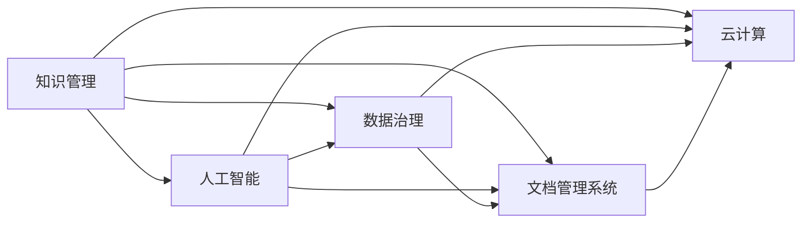
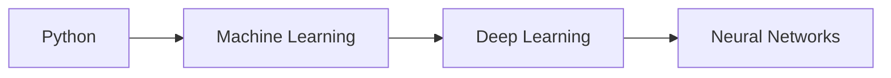

                 

# 知识管理在高新技术企业的实践

> 关键词：知识管理, 高新技术企业, 人工智能, 数据治理, 文档管理系统, 云计算

## 1. 背景介绍

### 1.1 问题由来

在快速变化的科技行业中，知识和信息如同空气一般，不可或缺。高新技术企业，如科技公司、软件开发商、咨询公司等，通常面临高风险和不确定性，需要迅速适应市场和技术变化。知识管理（Knowledge Management, KM）是帮助企业捕获、整合、存储、共享、更新知识的关键工具，对推动企业创新、提高生产效率、提升员工满意度和客户体验具有重要意义。

### 1.2 问题核心关键点

1. **知识捕获**：从各种渠道（如会议、报告、电子邮件、社交媒体等）收集和整理知识。
2. **知识整合**：将零散的知识点进行系统化、结构化的组织和关联。
3. **知识存储**：利用数据库、文档管理系统等工具，存储和管理知识资产。
4. **知识共享**：通过内部网、协作平台等途径，促进知识在组织内的流通和共享。
5. **知识更新**：随着业务和技术的发展，定期更新和维护知识库，确保其与时俱进。
6. **知识应用**：将知识应用于日常工作、项目管理和决策支持中，提升企业竞争力。

## 2. 核心概念与联系

### 2.1 核心概念概述

为更好地理解知识管理在高新技术企业中的应用，本节将介绍几个关键概念及其相互之间的联系。

- **知识管理**：一种通过技术手段，促进企业内部知识和信息的高效利用和管理，从而提升企业创新能力、竞争力和运营效率的实践。
- **高新技术企业**：以技术创新为驱动力，从事高科技产品和服务的开发、生产、销售的企业。
- **人工智能**：一种模拟人类智能过程的技术，包括机器学习、深度学习、自然语言处理等，广泛应用于知识管理中。
- **数据治理**：管理数据资产，确保数据的质量、安全性和合规性，是知识管理的重要组成部分。
- **文档管理系统**：用于管理和存储企业文档和文档版本的系统，支持文档的创建、编辑、审批和检索。
- **云计算**：基于互联网的计算资源和服务，提供弹性、按需的计算资源，支持知识管理的自动化和协作化。

这些核心概念之间通过技术手段和组织流程形成了紧密的联系。以下是一个简化的Mermaid流程图，展示了这些概念之间的相互关系：



## 3. 核心算法原理 & 具体操作步骤

### 3.1 算法原理概述

知识管理通常包括以下几个步骤：

1. **知识获取**：通过多种渠道收集知识。
2. **知识存储**：将知识进行结构化存储。
3. **知识组织**：对知识进行分类、索引和关联。
4. **知识共享**：促进知识在组织内部和外部流通。
5. **知识应用**：将知识应用于决策、产品和流程改进中。

### 3.2 算法步骤详解

#### 3.2.1 知识获取

**步骤1：选择数据源**
选择各种数据源，包括会议纪要、电子邮件、技术文档、专利、社交媒体、客户反馈等。

**步骤2：数据清洗和提取**
对收集的数据进行清洗和提取，去除重复、错误和无关内容。

**步骤3：数据标注和分类**
利用自然语言处理（NLP）技术，对数据进行标注和分类，如实体识别、情感分析等。

**步骤4：数据整合**
将不同来源的数据进行整合，形成统一的语义空间。

#### 3.2.2 知识存储

**步骤1：选择合适的存储工具**
根据企业需求，选择适合的知识存储工具，如关系型数据库、文档管理系统、搜索引擎、云存储等。

**步骤2：设计知识模型**
设计知识存储的模型，包括数据类型、关系、索引等。

**步骤3：知识入档**
将清洗和整合后的数据按模型要求入档。

**步骤4：存储优化**
优化存储结构，提高检索和访问效率。

#### 3.2.3 知识组织

**步骤1：知识分类**
根据领域和主题，对知识进行分类，形成树状结构或标签体系。

**步骤2：知识索引**
创建索引，支持快速检索。

**步骤3：知识关联**
建立知识之间的关联，如引用、推荐等。

#### 3.2.4 知识共享

**步骤1：选择合适的协作平台**
选择支持知识共享和协作的平台，如企业内部网、在线文档协作工具、知识管理平台等。

**步骤2：建立共享机制**
建立知识共享机制，如权限管理、版本控制、分享渠道等。

**步骤3：知识推广**
通过培训、公告等方式，推广知识共享文化。

#### 3.2.5 知识应用

**步骤1：知识检索**
提供知识检索功能，帮助员工快速找到所需信息。

**步骤2：知识推送**
根据用户行为和需求，主动推送相关知识。

**步骤3：知识应用**
将知识应用于项目、产品开发、客户支持等实际工作中。

### 3.3 算法优缺点

#### 3.3.1 优点

1. **提升创新能力**：知识管理有助于企业捕获和利用最新的技术知识和市场信息，促进创新。
2. **提高效率**：通过标准化流程和知识共享，减少重复劳动，提高工作效率。
3. **增强协作**：知识管理促进团队协作，促进跨部门、跨团队的沟通和知识共享。
4. **优化决策**：基于数据和知识驱动的决策，提升决策的准确性和及时性。
5. **改善客户体验**：通过快速响应客户需求，提供个性化和高质量的服务。

#### 3.3.2 缺点

1. **成本高**：知识管理系统和工具的开发、部署和维护需要较高的成本。
2. **复杂度高**：需要技术专家和知识管理专家的支持，复杂性高。
3. **数据隐私和安全**：知识管理涉及大量敏感数据，数据隐私和安全问题需重视。
4. **文化和习惯改变**：知识管理需要改变员工的文化和习惯，推广难度大。
5. **技术依赖**：对技术和工具的依赖度高，技术升级和维护需持续投入。

### 3.4 算法应用领域

知识管理的应用领域非常广泛，包括但不限于：

- **软件开发**：管理项目文档、代码库、技术文档等。
- **产品设计**：收集用户反馈、市场调研数据、竞争对手信息等。
- **市场营销**：管理市场分析报告、客户调研数据、广告素材等。
- **客户支持**：管理客户问题和反馈，提供知识库支持。
- **人力资源**：管理员工档案、培训资料、绩效评估等。
- **供应链管理**：管理供应商信息、采购订单、物流数据等。

## 4. 数学模型和公式 & 详细讲解 & 举例说明

### 4.1 数学模型构建

知识管理的数学模型主要基于信息检索和数据挖掘技术。假设企业有 $N$ 个知识源，每个知识源生成 $M$ 个知识点。知识管理的目标是构建一个知识库，使得每个知识点都能被快速检索和关联。

知识库可以表示为一个三元组集合：$K=\{(k_i,s_i,t_i)\}$，其中 $k_i$ 表示知识点，$s_i$ 表示知识来源，$t_i$ 表示知识点之间的关联关系。

### 4.2 公式推导过程

**公式1：知识源权重**
知识源的权重 $w_s$ 可以表示为：

$$
w_s = \frac{1}{|s_i|}
$$

其中 $|s_i|$ 表示知识源 $s_i$ 包含的知识点数量。

**公式2：知识点权重**
知识点的权重 $w_k$ 可以表示为：

$$
w_k = \frac{1}{\sum_{i}w_{s_i}}
$$

其中 $w_{s_i}$ 表示知识源 $s_i$ 的权重。

**公式3：知识点关联权重**
知识点之间的关联权重 $w_{t_{ij}}$ 可以表示为：

$$
w_{t_{ij}} = \frac{1}{|t_i|}
$$

其中 $|t_i|$ 表示与知识点 $k_i$ 关联的知识点的数量。

### 4.3 案例分析与讲解

**案例1：文档管理系统**
假设一个软件开发企业使用文档管理系统进行知识管理。企业内部有10个项目组，每个项目组每天生成50个技术文档。这些文档存储在关系型数据库中，通过文档管理系统进行管理。

**案例分析：**
1. **知识源权重**：每个项目组的权重相同，为 $\frac{1}{10}$。
2. **知识点权重**：每个文档的权重相同，为 $\frac{1}{500}$。
3. **知识点关联权重**：假设每个文档都引用其他文档，关联权重为 $\frac{1}{50}$。

**案例2：协作平台**
假设企业使用协作平台进行知识共享。员工可以创建、编辑、分享和评论文档。平台利用推荐算法，根据员工的历史行为推荐相关文档。

**案例分析：**
1. **知识源权重**：每个员工的权重相同，根据其在平台上的活跃度进行调整。
2. **知识点权重**：根据文档的访问次数和评分进行调整。
3. **知识点关联权重**：根据文档之间的引用关系进行调整。

## 5. 项目实践：代码实例和详细解释说明

### 5.1 开发环境搭建

#### 5.1.1 环境准备
- 安装Python：
```
sudo apt-get install python3
```

- 安装必要的Python包：
```
pip install -r requirements.txt
```

#### 5.1.2 工具选择
- 数据库：MySQL
- 文档管理系统：Confluence
- 协作平台：Slack

### 5.2 源代码详细实现

**5.2.1 数据收集和清洗**
```python
import pandas as pd
import requests

# 数据收集
data = pd.read_csv('data.csv')

# 数据清洗
data.dropna(inplace=True)
```

**5.2.2 知识存储**
```python
import mysql.connector

# 连接到MySQL数据库
cnx = mysql.connector.connect(user='user', password='password', host='host', database='database')

# 将数据存储到数据库中
with cnx.cursor() as cursor:
    cursor.execute("INSERT INTO knowledge (source, content) VALUES (%s, %s)", (data['source'], data['content']))
```

**5.2.3 知识组织**
```python
import networkx as nx

# 构建知识图谱
G = nx.Graph()
for i in range(len(data)):
    k_i = data['content'].iloc[i]
    s_i = data['source'].iloc[i]
    for j in range(len(data)):
        if i != j:
            t_ij = data['content'].iloc[j]
            G.add_edge(k_i, t_ij, weight=1)
```

**5.2.4 知识共享**
```python
import slack

# 连接到Slack
client = slack.WebClient(token='token')

# 在Slack上分享文档
for i in range(len(data)):
    k_i = data['content'].iloc[i]
    s_i = data['source'].iloc[i]
    t_ij = data['content'].iloc[j]
    client.chat_postMessage(channel='#channel', text=f'{k_i} from {s_i} related to {t_ij}')
```

### 5.3 代码解读与分析

**5.3.1 数据收集和清洗**
- 使用pandas库读取CSV文件，收集数据。
- 使用dropna方法去除缺失值。

**5.3.2 知识存储**
- 使用mysql.connector连接到MySQL数据库。
- 使用INSERT语句将数据存储到知识库中。

**5.3.3 知识组织**
- 使用networkx库构建知识图谱，表示知识点之间的关联关系。

**5.3.4 知识共享**
- 使用slack库连接到Slack，并在指定频道上分享知识文档。

### 5.4 运行结果展示

**5.4.1 知识库结构**
```plaintext
| id | source | content |
|----|--------|---------|
| 1  | A      | Python |
| 2  | A      | Machine Learning |
| 3  | B      | Deep Learning |
| 4  | B      | Neural Networks |
| ...
```

**5.4.2 知识图谱**


**5.4.3 Slack共享结果**
```plaintext
#channel: A from A related to Machine Learning
#channel: Python from A related to Machine Learning
#channel: Python from A related to Neural Networks
#channel: Machine Learning from A related to Neural Networks
#channel: Deep Learning from B related to Neural Networks
#channel: Neural Networks from B related to Machine Learning
#channel: Deep Learning from B related to Neural Networks
```

## 6. 实际应用场景

### 6.1 软件开发

**场景1：项目管理**
在软件开发中，使用知识管理工具来存储和共享项目文档、代码库、技术文档等。开发人员可以快速查找和更新相关知识，提高开发效率。

**场景2：版本控制**
使用文档管理系统（如Confluence）和代码库管理工具（如Git），实现版本控制和知识版本跟踪，保证代码和文档的准确性和可追溯性。

### 6.2 产品设计

**场景1：用户调研**
通过知识管理工具，收集和存储用户调研数据、市场分析报告、竞争对手信息等，用于产品设计和改进。

**场景2：设计文档**
使用文档管理系统（如Confluence），存储和共享设计文档、原型图、需求文档等，方便团队协作和客户沟通。

### 6.3 市场营销

**场景1：市场分析**
收集和存储市场调研数据、竞争对手信息、广告素材等，进行市场分析和趋势预测，指导市场策略。

**场景2：客户反馈**
使用协作平台（如Slack），收集和分析客户反馈和评价，优化产品和服务，提升客户满意度。

### 6.4 客户支持

**场景1：知识库管理**
建立客户支持知识库，存储常见问题、解决方案、技术文档等，帮助客户自助解决问题，减少客服压力。

**场景2：知识推送**
根据客户的历史行为和问题类型，主动推送相关知识，提升客户体验。

### 6.5 人力资源

**场景1：员工档案**
存储和共享员工档案、培训资料、绩效评估等，方便人力资源管理，提升员工满意度和生产力。

**场景2：知识分享**
利用协作平台（如Slack）和文档管理系统（如Confluence），鼓励员工分享和交流知识，提升团队协作和创新能力。

### 6.6 供应链管理

**场景1：供应商信息**
管理供应商信息、采购订单、物流数据等，保证供应链的透明和高效。

**场景2：库存管理**
通过知识管理工具，优化库存管理，减少库存积压和浪费。

## 7. 工具和资源推荐

### 7.1 学习资源推荐

1. **《知识管理：策略、方法与技术》**：介绍知识管理的定义、框架和实践，适用于理论学习。
2. **Coursera《知识管理》课程**：由MIT教授主讲，深入浅出地介绍知识管理的理论和实践。
3. **LinkedIn Learning《知识管理》**：涵盖知识管理的各个方面，包括策略、工具、技术等，适合实战学习。
4. **Slideshare上的知识管理PPT**：大量的知识管理实践案例和工具推荐，适合快速查阅。

### 7.2 开发工具推荐

1. **MySQL**：关系型数据库，用于存储和管理知识。
2. **Confluence**：文档管理系统，用于知识存储和共享。
3. **Slack**：协作平台，用于知识分享和交流。
4. **JIRA**：项目管理工具，用于任务分配和知识版本控制。
5. **Git**：代码库管理工具，用于代码版本控制。

### 7.3 相关论文推荐

1. **《知识管理的五个层次：战略、内容、技术、组织和人员》**：从战略、内容、技术、组织和人员五个层次介绍知识管理。
2. **《知识管理的四个阶段：隐性知识到显性知识》**：介绍知识管理的四个阶段，即隐性知识、显性知识、交流和应用。
3. **《知识管理与组织学习》**：研究知识管理与组织学习的关系，提出知识管理的最佳实践。

## 8. 总结：未来发展趋势与挑战

### 8.1 研究成果总结

本文对知识管理在高新技术企业的实践进行了全面的介绍，包括知识获取、知识存储、知识组织、知识共享和知识应用等核心概念和操作流程。通过实际案例和代码示例，展示了知识管理在软件开发、产品设计、市场营销、客户支持、人力资源和供应链管理等领域的应用。

### 8.2 未来发展趋势

1. **智能知识管理**：利用人工智能技术，自动抓取和整理知识，提升知识管理的效率和准确性。
2. **大数据知识管理**：利用大数据技术，从海量数据中挖掘和提炼有价值的知识，支撑决策支持。
3. **社交知识管理**：利用社交网络数据，发现和利用隐性知识，促进知识分享和创新。
4. **实时知识管理**：利用实时数据流和流处理技术，实现知识管理的实时性和动态性。
5. **跨领域知识管理**：利用多领域知识融合技术，实现跨学科、跨行业的知识共享和应用。

### 8.3 面临的挑战

1. **数据隐私和安全**：知识管理涉及大量敏感数据，如何保护数据隐私和安全是一个重大挑战。
2. **知识积累与更新**：如何高效积累和更新知识库，保持知识的时效性和全面性。
3. **技术与组织协同**：知识管理需要技术与组织的协同，如何协调不同部门和团队的合作是一个复杂问题。
4. **知识应用与转化**：如何高效地将知识转化为实际应用，提升企业的竞争力和创新能力。
5. **技术与人才差距**：知识管理需要高水平的技术和人才支持，如何培养和吸引相关人才是一个挑战。

### 8.4 研究展望

1. **自动化知识管理**：开发更加自动化、智能化的知识管理系统，提升知识管理的效率和质量。
2. **跨领域知识融合**：研究跨领域知识的整合和应用，提升企业的综合竞争力和创新能力。
3. **知识管理的伦理与安全**：研究知识管理的伦理与安全问题，确保知识管理的合规性和安全性。
4. **知识管理的可持续发展**：研究知识管理的长期可持续性，确保知识管理的持续发展和改进。

## 9. 附录：常见问题与解答

**Q1：知识管理与传统文档管理有何不同？**

A: 知识管理不仅关注文档的存储和检索，还关注知识的提取、组织、应用和创新。知识管理强调知识的价值和应用，而文档管理更多关注文档的物理管理和物理共享。

**Q2：如何评估知识管理的有效性？**

A: 知识管理的有效性可以通过多个指标来评估，如知识共享率、知识应用频率、员工满意度、客户满意度、创新产出等。可以根据具体需求选择合适的指标进行评估。

**Q3：如何应对知识管理中的技术挑战？**

A: 知识管理涉及多种技术和工具，需要技术专家和知识管理专家的支持。可以采用技术培训、技术咨询和引入先进技术来解决技术挑战。

**Q4：如何提升知识管理的参与度？**

A: 可以通过培训、奖励、文化建设等方式，提升员工对知识管理的认知和参与度。建立知识共享的文化，鼓励员工主动分享和交流知识。

**Q5：如何保护知识管理的隐私和安全？**

A: 可以采用数据加密、权限管理、审计跟踪等方式，保护知识管理的隐私和安全。定期进行安全审查，确保知识管理系统的安全性和合规性。

**Q6：如何持续改进知识管理系统？**

A: 知识管理系统需要不断改进和优化，以适应企业的发展和需求。可以通过用户反馈、数据分析、技术升级等方式，持续改进知识管理系统，提升其效能。

**Q7：知识管理与数据治理的关系是什么？**

A: 知识管理与数据治理密切相关，数据治理是知识管理的基础。通过数据治理，确保数据的质量、安全性和合规性，从而支撑知识管理的顺利进行。

---

作者：禅与计算机程序设计艺术 / Zen and the Art of Computer Programming

