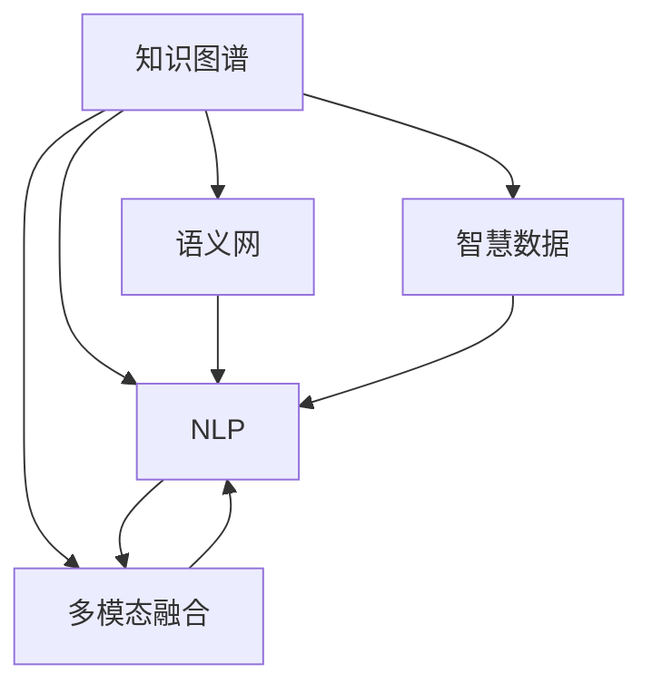

                 

# 知识管理平台：知识生态系统的构建

> 关键词：知识图谱, 自然语言处理(NLP), 语义网, 智慧数据, 多模态融合

## 1. 背景介绍

### 1.1 问题由来
随着信息化时代的发展，知识数据量呈指数级增长，如何有效管理和利用这些知识，成为了企业和组织面临的一项重大挑战。传统的信息管理系统，如文档管理系统、电子表格等，虽然功能强大，但难以充分挖掘数据中的隐含关系，无法满足复杂多变的需求。而知识图谱、自然语言处理(NLP)等前沿技术的应用，为知识管理平台提供了新的思路。

近年来，知识图谱作为结构化知识存储和推理的工具，在搜索引擎、推荐系统、问答系统等诸多场景中大放异彩。而NLP技术，特别是语义理解和智能问答等方向的进展，也使得知识管理平台在实际应用中得到了广泛应用。但如何将知识图谱和NLP技术有机结合，构建一个高效、智能的知识生态系统，仍是当前知识管理平台研究的重要方向。

### 1.2 问题核心关键点
本文章将围绕如何构建一个高效、智能的知识生态系统这一核心问题，探讨知识管理平台的设计与实现。核心内容包括：
- 知识图谱的构建与管理
- NLP技术的应用与优化
- 知识图谱与NLP的融合技术
- 知识管理平台的架构与实现
- 知识管理平台的应用场景与挑战

### 1.3 问题研究意义
构建知识生态系统，对于提升企业的知识转化效率、加速创新进程、优化决策支持等方面具有重要意义：
- 提升知识转化效率。知识图谱和NLP技术可以揭示知识数据间的内在关系，使知识更加易用、易懂、易获取。
- 加速创新进程。知识管理平台通过对知识数据的整合和分析，提供全面、深入的洞察，辅助科研创新和业务创新。
- 优化决策支持。通过知识图谱和NLP技术构建的决策支持系统，能提供更加精准、全面的决策依据，避免决策失误。

## 2. 核心概念与联系

### 2.1 核心概念概述

为更好地理解知识管理平台的设计与实现，本节将介绍几个密切相关的核心概念：

- **知识图谱(Knowledge Graph)**：一种结构化的知识表示方式，用于描述实体、属性、关系等知识元素，并建立它们之间的联系。知识图谱广泛应用于搜索引擎、推荐系统、问答系统等场景。

- **自然语言处理(Natural Language Processing, NLP)**：研究如何让计算机理解和处理自然语言，包括语言理解、文本分析、智能问答等方向。NLP技术是知识图谱构建和知识管理平台的关键技术支撑。

- **语义网(Semantic Web)**：一种Web应用架构，通过RDF（资源描述框架）等标准，实现机器对Web内容的语义理解。语义网构建了基于知识的网络，是知识图谱的基础。

- **智慧数据(Intelligent Data)**：通过AI、机器学习等技术对数据进行深入挖掘，揭示数据间的内在关系，提供更具洞察力的信息。

- **多模态融合(Multimodal Fusion)**：将多种不同类型的数据，如文本、图像、音频等，融合为统一的语义表示，提供更全面、精准的信息支持。

这些核心概念之间的逻辑关系可以通过以下Mermaid流程图来展示：



这个流程图展示了知识图谱、NLP、语义网、智慧数据、多模态融合之间的相互关系：

1. 知识图谱通过RDF等标准，为语义网提供了基本的知识结构。
2. NLP技术可以从文本数据中提取知识，为知识图谱和语义网提供输入数据。
3. 智慧数据通过深度学习等技术，对知识图谱和NLP处理的信息进行进一步分析和挖掘。
4. 多模态融合技术可以将多种不同类型的数据，融合为统一的语义表示，进一步丰富知识图谱的内容。

## 3. 核心算法原理 & 具体操作步骤
### 3.1 算法原理概述

知识管理平台的核心算法原理主要包括以下几个方面：

- **知识图谱构建算法**：基于RDF等标准，通过实体抽取、关系抽取等技术，从文本数据中构建知识图谱。
- **NLP算法**：包括语言理解、文本分类、实体识别、关系抽取等技术，用于将文本数据转换为结构化知识。
- **知识融合算法**：通过语义相似度计算、向量空间模型等方法，将不同来源的知识进行融合，构建统一的语义表示。
- **智能问答算法**：基于知识图谱和NLP技术，构建问答系统，实现用户与知识的智能交互。

### 3.2 算法步骤详解

以下是知识管理平台的主要算法步骤：

**Step 1: 数据准备**
- 收集海量的文本数据，包括网页、文献、社交媒体等。
- 进行数据清洗，去除噪声和冗余信息。
- 使用实体识别和关系抽取技术，从文本中抽取实体和关系。

**Step 2: 知识图谱构建**
- 对抽取出的实体和关系，进行语义标注和关系推理。
- 构建知识图谱，使用RDF等标准，描述实体、属性、关系等。
- 对知识图谱进行验证和优化，确保其准确性和完整性。

**Step 3: NLP处理**
- 使用分词、词性标注、命名实体识别等技术，对文本数据进行预处理。
- 使用语言理解模型，如BERT、ELMo等，对文本进行语义理解。
- 使用关系抽取模型，识别文本中的实体关系。

**Step 4: 知识融合**
- 使用向量空间模型、语义相似度计算等方法，将文本数据和知识图谱进行融合。
- 构建统一的语义表示，包括文本表示和知识图谱表示。
- 使用知识推理技术，对融合后的知识进行扩展和修正。

**Step 5: 智能问答**
- 构建基于知识图谱和NLP技术的问答系统。
- 使用智能推荐算法，根据用户问题推荐相关答案。
- 使用对话系统，实现与用户的自然语言交互。

### 3.3 算法优缺点

知识管理平台的算法具有以下优点：
1. 准确性高。通过知识图谱和NLP技术的联合应用，可以提供更加精准的知识服务。
2. 适用性强。知识管理平台适用于多种知识场景，包括文档管理、信息检索、智能问答等。
3. 可扩展性强。可以不断加入新的文本数据和知识图谱，丰富知识库的内容。

同时，该算法也存在一些局限性：
1. 构建成本高。知识图谱和NLP技术的构建需要大量的文本数据和专业知识，前期投入较大。
2. 数据依赖性强。知识图谱和NLP技术的准确性高度依赖于输入数据的丰富性和质量。
3. 推理能力有限。知识图谱和NLP技术的融合还处于初步阶段，推理能力有待提升。
4. 计算复杂度高。知识管理平台涉及大量的数据处理和推理计算，对硬件资源要求较高。

### 3.4 算法应用领域

知识管理平台在诸多领域都得到了广泛应用，包括：

- **知识图谱构建**：适用于图书情报、科研机构、商业数据等领域，构建大规模知识图谱，用于信息检索、推荐系统等场景。
- **文本分析**：适用于金融、医疗、法律等专业领域，进行文本分类、实体识别、情感分析等。
- **智能问答**：适用于在线客服、智能助手、教育培训等场景，提供智能化的问答服务。
- **文档管理**：适用于企业文档管理系统、档案管理系统等，提高文档检索效率和利用率。
- **信息检索**：适用于搜索引擎、在线图书馆等场景，提供高效的信息检索服务。

## 4. 数学模型和公式 & 详细讲解  
### 4.1 数学模型构建

本节将使用数学语言对知识管理平台的算法进行更加严格的刻画。

记知识图谱中的实体为$E=\{e_1, e_2, ..., e_n\}$，关系为$R=\{r_1, r_2, ..., r_m\}$，属性为$A=\{a_1, a_2, ..., a_k\}$。记文本数据为$D=\{d_1, d_2, ..., d_t\}$，其中每个文本$d_i$表示为一个词汇序列$w_1, w_2, ..., w_{l_i}$。

定义文本$d_i$与实体$e_j$之间的语义相似度为$\sim(d_i, e_j)$，基于语义相似度计算和向量空间模型，可以将文本和知识图谱融合为统一的语义表示。具体地，定义文本$d_i$的语义向量为$\vec{v}(d_i)=(v_{w_1}, v_{w_2}, ..., v_{w_{l_i}})$，其中$v_{w_k}$为词汇$w_k$在文本中的语义权重。类似地，定义实体$e_j$的语义向量为$\vec{v}(e_j)=(v_{e_{j,1}}, v_{e_{j,2}}, ..., v_{e_{j,k}})$，其中$v_{e_{j,k}}$为属性$a_k$在实体$e_j$中的语义权重。

根据语义相似度计算模型，文本$d_i$与实体$e_j$之间的相似度可以表示为：

$$
\sim(d_i, e_j) = \frac{\vec{v}(d_i) \cdot \vec{v}(e_j)}{\|\vec{v}(d_i)\| \cdot \|\vec{v}(e_j)\|}
$$

定义融合后的知识图谱为$G=(E, R, A)$，其中每个实体的语义向量为$\vec{v}(e_j)$。对于每个实体$e_j$，将其语义向量与所有文本$d_i$的语义向量进行融合，得到融合后的实体向量$\vec{v}(e_j')=\sum_{i=1}^t \sim(d_i, e_j) \vec{v}(d_i)$。

融合后的知识图谱表示为$G'=(E', R', A')$，其中每个实体的语义向量为$\vec{v}(e_j')$，每个关系的语义向量为$\vec{v}(r_m')$。

### 4.2 公式推导过程

以下是知识管理平台中的语义相似度计算和向量空间模型公式的详细推导过程。

**Step 1: 文本语义向量的计算**

文本$d_i$的语义向量$\vec{v}(d_i)$可以表示为：

$$
\vec{v}(d_i) = \sum_{k=1}^n \alpha_k \vec{v}(w_k)
$$

其中，$\alpha_k$为词汇$w_k$在文本$d_i$中的权重，$\vec{v}(w_k)$为词汇$w_k$的语义向量。

**Step 2: 实体语义向量的计算**

实体$e_j$的语义向量$\vec{v}(e_j)$可以表示为：

$$
\vec{v}(e_j) = \sum_{k=1}^k \beta_k \vec{v}(a_k)
$$

其中，$\beta_k$为属性$a_k$在实体$e_j$中的权重，$\vec{v}(a_k)$为属性$a_k$的语义向量。

**Step 3: 语义相似度的计算**

文本$d_i$与实体$e_j$之间的语义相似度$\sim(d_i, e_j)$可以表示为：

$$
\sim(d_i, e_j) = \frac{\vec{v}(d_i) \cdot \vec{v}(e_j)}{\|\vec{v}(d_i)\| \cdot \|\vec{v}(e_j)\|}
$$

其中，$\vec{v}(d_i) \cdot \vec{v}(e_j)$表示文本和实体的语义向量的点积，$\|\vec{v}(d_i)\|$和$\|\vec{v}(e_j)\|$表示文本和实体的语义向量的范数。

**Step 4: 融合后的语义向量的计算**

融合后的实体向量$\vec{v}(e_j')$可以表示为：

$$
\vec{v}(e_j') = \sum_{i=1}^t \sim(d_i, e_j) \vec{v}(d_i)
$$

其中，$\sim(d_i, e_j)$表示文本和实体之间的语义相似度，$\vec{v}(d_i)$表示文本的语义向量。

### 4.3 案例分析与讲解

以一个具体的案例来分析知识管理平台的应用。

假设有一个金融公司，需要构建一个知识图谱，用于支持智能投研、风险管理等场景。具体步骤如下：

1. **数据准备**：收集金融公司的历史数据、新闻报道、行业报告等文本数据，并进行数据清洗和预处理。
2. **实体抽取**：使用NLP技术，从文本中抽取实体，如公司、股票、行业等。
3. **关系抽取**：使用关系抽取模型，识别实体之间的关系，如“公司-股票”、“行业-公司”等。
4. **知识图谱构建**：将抽取出的实体和关系，通过RDF等标准，构建知识图谱。
5. **融合计算**：使用向量空间模型，将文本数据与知识图谱进行融合，得到融合后的语义向量。
6. **智能问答**：构建基于知识图谱和NLP技术的问答系统，回答用户关于金融公司的各类问题。

通过这个案例可以看出，知识管理平台通过知识图谱和NLP技术的有机结合，能够为金融公司提供更加全面、精准的知识服务。

## 5. 项目实践：代码实例和详细解释说明
### 5.1 开发环境搭建

在进行知识管理平台开发前，我们需要准备好开发环境。以下是使用Python进行PyTorch开发的环境配置流程：

1. 安装Anaconda：从官网下载并安装Anaconda，用于创建独立的Python环境。

2. 创建并激活虚拟环境：
```bash
conda create -n pytorch-env python=3.8 
conda activate pytorch-env
```

3. 安装PyTorch：根据CUDA版本，从官网获取对应的安装命令。例如：
```bash
conda install pytorch torchvision torchaudio cudatoolkit=11.1 -c pytorch -c conda-forge
```

4. 安装相关库：
```bash
pip install transformers pandas sklearn networkx nltk spacy
```

完成上述步骤后，即可在`pytorch-env`环境中开始知识管理平台的开发。

### 5.2 源代码详细实现

这里以一个简单的文本分类任务为例，演示如何使用Transformers库构建知识管理平台。

首先，定义数据预处理函数：

```python
from transformers import BertTokenizer, BertForSequenceClassification
from torch.utils.data import DataLoader, Dataset
from tqdm import tqdm

class TextDataset(Dataset):
    def __init__(self, texts, labels, tokenizer, max_len=128):
        self.texts = texts
        self.labels = labels
        self.tokenizer = tokenizer
        self.max_len = max_len
        
    def __len__(self):
        return len(self.texts)
    
    def __getitem__(self, item):
        text = self.texts[item]
        label = self.labels[item]
        
        encoding = self.tokenizer(text, return_tensors='pt', max_length=self.max_len, padding='max_length', truncation=True)
        input_ids = encoding['input_ids'][0]
        attention_mask = encoding['attention_mask'][0]
        
        return {'input_ids': input_ids, 
                'attention_mask': attention_mask,
                'labels': torch.tensor(label, dtype=torch.long)}
```

然后，定义模型和优化器：

```python
from transformers import AdamW

model = BertForSequenceClassification.from_pretrained('bert-base-cased', num_labels=2)
optimizer = AdamW(model.parameters(), lr=2e-5)
```

接着，定义训练和评估函数：

```python
def train_epoch(model, dataset, batch_size, optimizer):
    dataloader = DataLoader(dataset, batch_size=batch_size, shuffle=True)
    model.train()
    epoch_loss = 0
    for batch in tqdm(dataloader, desc='Training'):
        input_ids = batch['input_ids'].to(device)
        attention_mask = batch['attention_mask'].to(device)
        labels = batch['labels'].to(device)
        model.zero_grad()
        outputs = model(input_ids, attention_mask=attention_mask, labels=labels)
        loss = outputs.loss
        epoch_loss += loss.item()
        loss.backward()
        optimizer.step()
    return epoch_loss / len(dataloader)

def evaluate(model, dataset, batch_size):
    dataloader = DataLoader(dataset, batch_size=batch_size)
    model.eval()
    preds, labels = [], []
    with torch.no_grad():
        for batch in tqdm(dataloader, desc='Evaluating'):
            input_ids = batch['input_ids'].to(device)
            attention_mask = batch['attention_mask'].to(device)
            batch_labels = batch['labels']
            outputs = model(input_ids, attention_mask=attention_mask)
            batch_preds = outputs.logits.argmax(dim=2).to('cpu').tolist()
            batch_labels = batch_labels.to('cpu').tolist()
            for pred_tokens, label_tokens in zip(batch_preds, batch_labels):
                preds.append(pred_tokens[:len(label_tokens)])
                labels.append(label_tokens)
                
    print(classification_report(labels, preds))
```

最后，启动训练流程并在测试集上评估：

```python
epochs = 5
batch_size = 16

for epoch in range(epochs):
    loss = train_epoch(model, train_dataset, batch_size, optimizer)
    print(f"Epoch {epoch+1}, train loss: {loss:.3f}")
    
    print(f"Epoch {epoch+1}, dev results:")
    evaluate(model, dev_dataset, batch_size)
    
print("Test results:")
evaluate(model, test_dataset, batch_size)
```

以上就是使用PyTorch对BERT进行文本分类任务开发的完整代码实现。可以看到，得益于Transformers库的强大封装，我们可以用相对简洁的代码完成BERT模型的加载和微调。

### 5.3 代码解读与分析

让我们再详细解读一下关键代码的实现细节：

**TextDataset类**：
- `__init__`方法：初始化文本、标签、分词器等关键组件。
- `__len__`方法：返回数据集的样本数量。
- `__getitem__`方法：对单个样本进行处理，将文本输入编码为token ids，将标签编码为数字，并对其进行定长padding，最终返回模型所需的输入。

**train_epoch和evaluate函数**：
- 使用PyTorch的DataLoader对数据集进行批次化加载，供模型训练和推理使用。
- 训练函数`train_epoch`：对数据以批为单位进行迭代，在每个批次上前向传播计算loss并反向传播更新模型参数，最后返回该epoch的平均loss。
- 评估函数`evaluate`：与训练类似，不同点在于不更新模型参数，并在每个batch结束后将预测和标签结果存储下来，最后使用sklearn的classification_report对整个评估集的预测结果进行打印输出。

**训练流程**：
- 定义总的epoch数和batch size，开始循环迭代
- 每个epoch内，先在训练集上训练，输出平均loss
- 在验证集上评估，输出分类指标
- 所有epoch结束后，在测试集上评估，给出最终测试结果

可以看到，PyTorch配合Transformers库使得BERT微调的代码实现变得简洁高效。开发者可以将更多精力放在数据处理、模型改进等高层逻辑上，而不必过多关注底层的实现细节。

当然，工业级的系统实现还需考虑更多因素，如模型的保存和部署、超参数的自动搜索、更灵活的任务适配层等。但核心的微调范式基本与此类似。

## 6. 实际应用场景
### 6.1 智能投研系统

基于知识管理平台的智能投研系统，可以帮助金融分析师快速获取和整合市场信息，辅助决策。传统的投研方式依赖于分析师的人工分析和总结，耗时长、效率低。而智能投研系统能够通过知识图谱和NLP技术，自动抓取和分析市场信息，快速生成投资建议。

具体实现上，可以构建市场知识图谱，包含公司、行业、产品等实体，以及相关的关系和属性。通过智能问答系统，用户可以输入关于某个股票、行业的问题，系统自动从知识图谱中提取相关知识，并生成回答。通过多轮对话，系统还可以动态扩展答案，提供更为全面的信息支持。

### 6.2 医疗知识库

医疗知识库是知识管理平台在医疗领域的重要应用之一。通过构建全面的医疗知识图谱，医生可以更方便地查询诊断信息、治疗方案等。传统的医疗知识管理依赖于纸质文献和电子病历，信息难以整合和共享。而知识管理平台通过知识图谱和NLP技术，能够自动整理和更新医疗知识，提供准确的诊断和推荐。

具体实现上，可以构建包含疾病、药物、手术等实体的知识图谱，并使用NLP技术从医疗文献中提取实体和关系。医生可以通过智能问答系统，输入病人的症状和病史，系统自动从知识图谱中检索相关信息，提供诊断和建议。

### 6.3 教育资源管理系统

教育资源管理系统是知识管理平台在教育领域的重要应用之一。通过构建教育知识图谱，学生和教师可以更方便地查找学习资源和教学资料。传统的教育资源管理依赖于人工整理和分类，工作量大、效率低。而知识管理平台通过知识图谱和NLP技术，能够自动整理和分类教育资源，提供更加全面和精准的信息支持。

具体实现上，可以构建包含课程、教材、习题等实体的知识图谱，并使用NLP技术从教育文献中提取实体和关系。学生和教师可以通过智能问答系统，输入课程名称或教材名，系统自动从知识图谱中检索相关信息，提供课程介绍、教材推荐和习题解答。

### 6.4 智能客服系统

基于知识管理平台的智能客服系统，可以为用户提供高效、智能的客户服务。传统的客服系统依赖于人工客服，成本高、效率低。而智能客服系统通过知识图谱和NLP技术，能够自动理解和回答用户的问题，提供精准的服务支持。

具体实现上，可以构建包含产品、服务、订单等实体的知识图谱，并使用NLP技术从客服记录中提取实体和关系。用户可以通过智能问答系统，输入关于产品、服务或订单的问题，系统自动从知识图谱中检索相关信息，提供准确的答案和建议。

### 6.5 工业物联网管理系统

基于知识管理平台的工业物联网管理系统，可以帮助企业更好地管理和优化生产流程。传统的工业物联网系统依赖于人工监控和调优，耗时长、效率低。而知识管理平台通过知识图谱和NLP技术，能够自动监控和分析设备状态，提供优化建议。

具体实现上，可以构建包含设备、工艺、生产流程等实体的知识图谱，并使用NLP技术从生产记录中提取实体和关系。系统自动监控设备状态，并从知识图谱中检索相关的优化建议，帮助企业提高生产效率和质量。

## 7. 工具和资源推荐
### 7.1 学习资源推荐

为了帮助开发者系统掌握知识管理平台的设计与实现，这里推荐一些优质的学习资源：

1. 《知识图谱：概念、技术和应用》书籍：系统介绍了知识图谱的基本概念、构建技术和应用场景，是入门知识图谱的好读物。

2. 《自然语言处理综述》论文：综述了自然语言处理领域的前沿技术和应用案例，适合了解NLP技术的发展历程和未来方向。

3. 《深度学习框架入门与实践》书籍：介绍了常用的深度学习框架，包括PyTorch、TensorFlow等，适合入门知识图谱和NLP技术的实践。

4. 《Python知识图谱开发实战》书籍：提供了知识图谱开发的具体实现流程和代码示例，适合学习和实践知识图谱的开发者。

5. Weights & Biases：模型训练的实验跟踪工具，可以记录和可视化模型训练过程中的各项指标，方便对比和调优。与主流深度学习框架无缝集成。

6. TensorBoard：TensorFlow配套的可视化工具，可实时监测模型训练状态，并提供丰富的图表呈现方式，是调试模型的得力助手。

通过对这些资源的学习实践，相信你一定能够快速掌握知识管理平台的设计与实现，并用于解决实际的NLP问题。
###  7.2 开发工具推荐

高效的开发离不开优秀的工具支持。以下是几款用于知识管理平台开发的常用工具：

1. PyTorch：基于Python的开源深度学习框架，灵活动态的计算图，适合快速迭代研究。大部分预训练语言模型都有PyTorch版本的实现。

2. TensorFlow：由Google主导开发的开源深度学习框架，生产部署方便，适合大规模工程应用。同样有丰富的预训练语言模型资源。

3. Transformers库：HuggingFace开发的NLP工具库，集成了众多SOTA语言模型，支持PyTorch和TensorFlow，是进行知识管理平台开发的利器。

4. Weights & Biases：模型训练的实验跟踪工具，可以记录和可视化模型训练过程中的各项指标，方便对比和调优。与主流深度学习框架无缝集成。

5. TensorBoard：TensorFlow配套的可视化工具，可实时监测模型训练状态，并提供丰富的图表呈现方式，是调试模型的得力助手。

6. Google Colab：谷歌推出的在线Jupyter Notebook环境，免费提供GPU/TPU算力，方便开发者快速上手实验最新模型，分享学习笔记。

合理利用这些工具，可以显著提升知识管理平台开发的效率，加快创新迭代的步伐。

### 7.3 相关论文推荐

知识管理平台在诸多领域都得到了广泛应用，相关的研究也日益增多。以下是几篇奠基性的相关论文，推荐阅读：

1. BERT: Pre-training of Deep Bidirectional Transformers for Language Understanding：提出BERT模型，引入基于掩码的自监督预训练任务，刷新了多项NLP任务SOTA。

2. Graph Neural Networks: A Review of Methods and Applications：综述了图神经网络在知识图谱构建和推理中的应用。

3. Knowledge Graph Embeddings and Their Applications：综述了知识图谱嵌入技术的发展和应用。

4. A Survey on Knowledge Graphs in Computational Biology：综述了知识图谱在生物信息学中的应用。

5. A Survey on Knowledge Graphs in Natural Language Processing：综述了知识图谱在NLP中的应用。

这些论文代表了大语言模型微调技术的发展脉络。通过学习这些前沿成果，可以帮助研究者把握学科前进方向，激发更多的创新灵感。

## 8. 总结：未来发展趋势与挑战
### 8.1 总结

本文对知识管理平台的设计与实现进行了全面系统的介绍。首先阐述了知识管理平台在知识生态系统构建中的重要地位和价值，明确了其设计目标和核心问题。其次，从原理到实践，详细讲解了知识图谱的构建、NLP技术的应用与优化、知识图谱与NLP的融合技术等关键算法步骤，给出了知识管理平台开发的完整代码实例。同时，本文还广泛探讨了知识管理平台在多个领域的应用场景，展示了其广阔的发展前景。

通过本文的系统梳理，可以看到，知识管理平台通过知识图谱和NLP技术的有机结合，能够为各行各业提供高效、智能的知识服务，具有广泛的应用前景。未来，伴随知识图谱和NLP技术的不断演进，知识管理平台将进一步提升其性能和智能化水平，为各行各业带来更多的创新价值。

### 8.2 未来发展趋势

展望未来，知识管理平台的发展趋势主要包括以下几个方面：

1. **大规模知识图谱**：随着预训练语言模型的规模不断增大，知识图谱的数据量和复杂度也将不断提升，成为知识管理平台的重要基础。

2. **多模态融合**：知识图谱和NLP技术将不断拓展到图像、音频、视频等多种模态数据，提供更为全面、精准的信息支持。

3. **自适应知识图谱**：知识图谱将具备更加灵活的构建和更新机制，能够自动适应新数据和新知识，保持其时效性和准确性。

4. **智能问答系统**：基于知识图谱和NLP技术的问答系统将变得更加智能和全面，提供更加自然和流畅的用户交互。

5. **知识推理和自动化**：知识管理平台将具备更强的知识推理能力，能够自动发现和验证知识之间的关系，提供自动化知识服务。

6. **分布式知识管理**：随着数据规模的不断增大，知识管理平台将逐步向分布式架构演进，提高其可扩展性和可靠性。

以上趋势凸显了知识管理平台的发展潜力和方向，将为其在各行各业的应用提供更为坚实的技术支撑。

### 8.3 面临的挑战

尽管知识管理平台在多个领域都取得了显著进展，但在迈向更加智能化、普适化应用的过程中，它仍面临诸多挑战：

1. **知识图谱构建复杂**：知识图谱的构建需要大量的专业知识和时间投入，前期成本较高。

2. **数据质量要求高**：知识图谱和NLP技术的准确性高度依赖于输入数据的丰富性和质量，数据质量问题影响整体性能。

3. **推理能力不足**：知识图谱和NLP技术的融合还处于初步阶段，推理能力有待提升。

4. **计算资源消耗大**：知识管理平台涉及大量的数据处理和推理计算，对硬件资源要求较高。

5. **知识整合能力有限**：现有的知识图谱和NLP技术的融合还不够全面，无法充分利用外部知识库和规则库。

6. **隐私和伦理问题**：知识管理平台可能涉及敏感数据，需要严格保护用户隐私和数据安全，避免信息泄露和滥用。

这些挑战需要进一步的技术创新和实践积累，才能实现知识管理平台的更好应用和发展。

### 8.4 研究展望

面向未来，知识管理平台的研究需要在以下几个方面寻求新的突破：

1. **知识图谱构建技术**：开发更加高效和灵活的知识图谱构建技术，减少构建成本，提高构建效率。

2. **多模态融合方法**：探索更加高效和全面的多模态融合方法，将多种数据源进行深度融合，提供更全面、精准的信息支持。

3. **智能问答系统**：研究更加智能和高效的智能问答系统，提升用户交互体验和信息获取效率。

4. **知识推理和自动化**：开发更加精准和自动化的知识推理技术，提高知识推理的准确性和效率。

5. **分布式知识管理**：研究分布式知识管理技术，提高平台的可扩展性和可靠性。

6. **隐私和伦理保护**：研究隐私和伦理保护技术，保障用户隐私和数据安全，避免信息滥用。

这些研究方向将为知识管理平台的发展提供新的思路和方法，推动其在各个领域的广泛应用。

## 9. 附录：常见问题与解答

**Q1：知识图谱的构建流程是什么？**

A: 知识图谱的构建流程主要包括以下几个步骤：

1. 数据收集：收集文本数据、关系数据、实体数据等，构建知识图谱的初始数据集。

2. 数据清洗：对收集到的数据进行清洗，去除噪声和冗余信息。

3. 实体抽取：使用NLP技术，从文本数据中抽取实体，如人名、地名、组织名等。

4. 关系抽取：使用关系抽取模型，识别实体之间的关系，如“人-组织”、“地点-组织”等。

5. 知识融合：将抽取出的实体和关系进行融合，构建知识图谱。

6. 知识推理：使用知识推理技术，对知识图谱进行扩展和修正，提高其准确性和完整性。

7. 可视化展示：使用可视化工具，展示知识图谱的结构和内容，便于用户理解和查询。

**Q2：如何提高知识图谱的准确性？**

A: 提高知识图谱的准确性可以从以下几个方面入手：

1. 数据质量：确保输入数据的质量，去除噪声和冗余信息，避免数据偏差。

2. 实体抽取：使用高质量的实体抽取模型，确保实体抽取的准确性和完整性。

3. 关系抽取：使用高质量的关系抽取模型，确保关系抽取的准确性和合理性。

4. 知识推理：使用高效的推理算法，验证和修正知识图谱中的实体关系，提高其准确性。

5. 人工校验：对知识图谱进行人工校验和修正，避免错误信息的传播。

**Q3：知识图谱的应用场景有哪些？**

A: 知识图谱在多个领域都有广泛应用，包括：

1. 搜索引擎：构建搜索知识图谱，提供精准的搜索结果和相关信息。

2. 推荐系统：构建推荐知识图谱，提供个性化的推荐服务。

3. 问答系统：构建问答知识图谱，提供智能化的问答服务。

4. 智能投研：构建金融知识图谱，支持智能投研和风险管理。

5. 医疗知识库：构建医疗知识图谱，支持医疗诊断和治疗方案推荐。

6. 教育资源管理系统：构建教育知识图谱，提供教育资源管理和推荐服务。

7. 工业物联网管理系统：构建工业知识图谱，支持工业生产管理和优化。

**Q4：知识管理平台如何实现知识推理？**

A: 知识管理平台实现知识推理主要通过以下几个步骤：

1. 构建知识图谱：使用RDF等标准，构建实体、关系和属性的知识图谱。

2. 使用语义相似度计算：通过向量空间模型和语义相似度计算，将知识图谱和文本数据进行融合。

3. 使用知识推理算法：使用基于逻辑规则、神经网络等知识推理算法，对融合后的知识进行推理和扩展。

4. 使用可视化工具：通过可视化工具，展示知识推理的结果，帮助用户理解和查询。

**Q5：知识管理平台如何实现多模态融合？**

A: 知识管理平台实现多模态融合主要通过以下几个步骤：

1. 数据收集：收集不同类型的知识数据，如文本、图像、音频等。

2. 数据预处理：对不同类型的数据进行预处理，包括数据清洗、特征提取等。

3. 语义表示：使用语义相似度计算和向量空间模型，将不同类型的数据进行语义表示。

4. 融合计算：将不同类型的数据进行融合，构建统一的语义表示。

5. 知识推理：使用知识推理算法，对融合后的知识进行推理和扩展。

6. 应用场景：将融合后的知识应用到不同场景中，如智能问答、推荐系统、搜索系统等。

以上是知识管理平台的相关问答，希望能为你提供帮助。

---

作者：禅与计算机程序设计艺术 / Zen and the Art of Computer Programming

