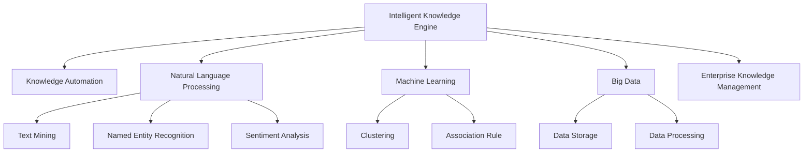

                 

# 知识管理的AI化未来:智能知识引擎和知识自动化

> 关键词：知识管理,智能知识引擎,知识自动化,自然语言处理(NLP),机器学习(ML),大数据(Big Data),企业知识管理(EKM)

## 1. 背景介绍

### 1.1 问题由来

在知识经济时代，企业知识的积累和利用变得越来越重要。然而，传统的知识管理方式往往存在数据孤岛、信息过载、知识流失等问题。如何通过高效的知识管理手段，将海量的知识数据转化为易于获取和应用的信息，成为众多企业面临的挑战。

随着人工智能(AI)技术的快速发展，智能知识引擎和知识自动化的概念应运而生。通过AI技术，实现对海量知识数据的深度挖掘、关联分析和智能化推荐，使得知识管理变得更加高效和智能。AI化的知识管理不仅能够帮助企业更迅速地响应市场变化，还能有效提升企业的决策质量和创新能力。

### 1.2 问题核心关键点

智能知识引擎和知识自动化的核心关键点在于如何通过AI技术实现知识的高效获取、存储、整合和利用。关键技术包括：

- **自然语言处理(NLP)**：通过文本挖掘、实体识别、情感分析等NLP技术，从非结构化文本中提取结构化知识，建立语义模型。
- **机器学习(ML)**：通过训练模型，实现对知识数据的高效分类、推荐和关联分析，构建知识图谱。
- **大数据(Big Data)**：通过大数据技术，高效处理和存储海量知识数据，构建分布式知识仓库。
- **企业知识管理(EKM)**：通过协同工作平台、知识图谱等工具，实现知识的高效共享、利用和传承。

这些技术手段共同构成了智能知识引擎和知识自动化的技术框架，为企业提供了高效、智能的知识管理解决方案。

## 2. 核心概念与联系

### 2.1 核心概念概述

为更好地理解智能知识引擎和知识自动化的工作原理和优化方向，本节将介绍几个关键概念：

- **智能知识引擎**：通过AI技术构建的知识管理平台，能够自动识别、分类、关联、推荐知识，实现知识的智能存储和利用。
- **知识自动化**：利用AI技术自动化处理知识管理任务，如文本摘要、信息抽取、知识关联、智能推荐等，提升知识管理的效率和质量。
- **自然语言处理(NLP)**：研究计算机如何理解和处理人类语言的技术，包括文本挖掘、实体识别、情感分析、语义分析等，是构建智能知识引擎的基础。
- **机器学习(ML)**：通过训练数据模型，实现对知识数据的自动分类、聚类、关联分析等，构建知识图谱，实现知识的知识库、推荐系统等。
- **大数据(Big Data)**：通过分布式计算、存储和处理技术，实现对海量知识数据的有效管理和分析，为智能知识引擎提供数据支撑。
- **企业知识管理(EKM)**：通过协同工具、知识图谱等技术手段，实现知识的共享、利用和传承，提升企业知识利用效率。

这些概念之间的逻辑关系可以通过以下Mermaid流程图来展示：



这个流程图展示了你关注的核心概念及其之间的关系：

1. 智能知识引擎通过自然语言处理(NLP)和机器学习(ML)技术，对知识数据进行深度挖掘和智能化处理。
2. 知识自动化利用智能知识引擎的成果，自动完成知识管理的各项任务，提升效率。
3. NLP包括文本挖掘、实体识别等，从非结构化数据中提取结构化知识。
4. ML包括聚类、关联分析等，对知识数据进行分类、推荐等处理。
5. 大数据技术提供海量数据存储和处理能力，支持智能知识引擎的数据需求。
6. EKM通过协同工具、知识图谱等技术，实现知识的高效共享和利用。

这些概念共同构成了智能知识引擎和知识自动化的技术框架，使得知识管理变得更加高效、智能和全面。

## 3. 核心算法原理 & 具体操作步骤
### 3.1 算法原理概述

智能知识引擎和知识自动化的核心算法主要涉及自然语言处理(NLP)和机器学习(ML)技术。其核心思想是：通过NLP技术提取和处理文本数据，建立语义模型；再通过ML技术训练模型，对知识数据进行深度学习和关联分析，构建知识图谱，实现知识的智能存储和利用。

形式化地，假设我们有一个知识库$K=\{k_1, k_2, \ldots, k_N\}$，其中$k_i$为知识数据。我们的目标是构建一个智能知识引擎$E$，能够自动识别、分类、关联、推荐知识，提升知识管理的效率和质量。具体步骤如下：

1. **知识提取**：通过NLP技术，从知识库中提取结构化知识，构建语义模型$M$。
2. **知识分类**：通过ML技术，训练分类器$C$，对知识数据进行自动分类，得到分类结果$Y$。
3. **知识关联**：通过ML技术，训练关联模型$R$，实现知识之间的关联分析，得到关联关系$R'$。
4. **知识推荐**：通过ML技术，训练推荐模型$R$，根据用户需求，对知识进行智能推荐。

### 3.2 算法步骤详解

智能知识引擎和知识自动化的实现步骤如下：

**Step 1: 准备知识数据**

- 收集并预处理知识数据，清洗噪音和重复信息。
- 将知识数据标准化，转化为可供NLP和ML技术处理的格式。

**Step 2: 知识提取**

- 使用NLP技术，对知识数据进行文本挖掘、实体识别、情感分析等处理。
- 构建语义模型$M$，用于表示知识的结构和语义关系。

**Step 3: 知识分类**

- 使用ML技术，训练分类器$C$，对知识数据进行自动分类。
- 使用训练好的分类器$C$，对知识数据进行分类，得到分类结果$Y$。

**Step 4: 知识关联**

- 使用ML技术，训练关联模型$R$，对知识数据进行关联分析。
- 使用训练好的关联模型$R$，对知识数据进行关联，得到关联关系$R'$。

**Step 5: 知识推荐**

- 使用ML技术，训练推荐模型$R$，根据用户需求，对知识进行智能推荐。
- 使用训练好的推荐模型$R$，对用户进行知识推荐，并提供推荐结果。

**Step 6: 知识存储和利用**

- 使用大数据技术，构建分布式知识仓库，存储和管理知识数据。
- 通过协同工具和知识图谱等技术手段，实现知识的共享和利用。

### 3.3 算法优缺点

智能知识引擎和知识自动化具有以下优点：

- **高效性**：通过自动化处理，显著提升知识管理的效率，减少人工干预。
- **智能化**：利用AI技术，实现对知识数据的深度挖掘和智能化处理，提高知识管理的质量。
- **可扩展性**：基于分布式计算和大数据技术，能够处理和存储海量知识数据，具备良好扩展性。
- **灵活性**：通过ML技术，灵活调整知识管理策略，适应不同应用场景的需求。

同时，该方法也存在一些局限性：

- **数据依赖**：智能知识引擎和知识自动化的效果很大程度上取决于数据质量，获取高质量数据成本较高。
- **模型复杂度**：构建知识图谱和推荐系统需要复杂的ML模型，需要较高的计算资源和专业知识。
- **技术门槛**：实现智能知识引擎和知识自动化需要掌握NLP、ML、大数据等技术，对技术要求较高。
- **隐私风险**：知识管理过程中涉及大量用户数据，隐私保护和数据安全问题需重点关注。

尽管存在这些局限性，但就目前而言，智能知识引擎和知识自动化仍是知识管理领域的重要方向。未来相关研究的重点在于如何进一步降低数据依赖，提高模型的可解释性和安全性，同时兼顾数据利用效率和技术可扩展性。

### 3.4 算法应用领域

智能知识引擎和知识自动化技术在诸多领域得到了广泛应用，具体包括：

- **企业知识管理(EKM)**：通过智能知识引擎，帮助企业实现知识的自动提取、分类、关联和推荐，提升知识利用效率。
- **科研知识管理**：通过智能知识引擎，帮助科研机构对海量科研文献进行智能化管理，加速科研成果的转化和应用。
- **医疗知识管理**：通过智能知识引擎，帮助医疗机构对电子病历、医学文献等知识数据进行深度挖掘和智能化分析，提升医疗服务质量。
- **金融知识管理**：通过智能知识引擎，帮助金融机构对金融市场数据进行智能分析，辅助投资决策。
- **教育知识管理**：通过智能知识引擎，帮助教育机构对海量教学资源进行智能化管理，提升教学质量和学习效果。
- **社交媒体知识管理**：通过智能知识引擎，帮助社交媒体平台对用户评论、帖子等数据进行智能化分析，提升内容推荐和用户互动效果。

这些应用领域展示了智能知识引擎和知识自动化的强大潜力和广阔前景。未来，伴随技术的发展和应用场景的拓展，相信智能知识引擎和知识自动化技术将带来更多创新突破，加速知识管理的智能化进程。

## 4. 数学模型和公式 & 详细讲解 & 举例说明
### 4.1 数学模型构建

智能知识引擎和知识自动化的数学模型构建主要涉及自然语言处理(NLP)和机器学习(ML)的数学框架。以下以企业知识管理(EKM)为例，简要说明其数学模型构建过程。

假设企业知识管理系统的输入为知识库$K=\{k_1, k_2, \ldots, k_N\}$，输出为智能推荐结果$R$。我们的目标是通过NLP和ML技术，构建知识管理模型$M$，实现知识的高效管理和智能推荐。

**Step 1: 知识提取**

- 通过NLP技术，提取知识库$K$中的文本信息，构建语义模型$M_1$。
- 使用文本挖掘技术，识别出知识库$K$中的实体$E$和关系$R$。

**Step 2: 知识分类**

- 使用ML技术，训练分类器$C_1$，对知识库$K$中的知识进行分类，得到分类结果$Y$。
- 使用训练好的分类器$C_1$，对知识库$K$中的知识进行分类，得到分类结果$Y_1$。

**Step 3: 知识关联**

- 使用ML技术，训练关联模型$R_1$，对知识库$K$中的知识进行关联分析，得到关联关系$R'$。
- 使用训练好的关联模型$R_1$，对知识库$K$中的知识进行关联，得到关联关系$R'$。

**Step 4: 知识推荐**

- 使用ML技术，训练推荐模型$R_2$，对知识库$K$中的知识进行智能推荐。
- 使用训练好的推荐模型$R_2$，对用户需求进行知识推荐，得到推荐结果$R$。

**Step 5: 知识存储和利用**

- 使用大数据技术，构建分布式知识仓库，存储和管理知识库$K$。
- 通过协同工具和知识图谱等技术手段，实现知识的共享和利用。

### 4.2 公式推导过程

以下以企业知识管理(EKM)中的知识推荐系统为例，简要说明其公式推导过程。

假设知识库$K$中每个知识数据$k_i$的表示为$\vec{k}_i$，用户需求表示为$\vec{u}$，推荐结果$R$表示为$\vec{r}$。推荐系统的目标是最大化用户满意度和知识匹配度，即：

$$
\max_{R} \text{user satisfaction} \times \text{knowledge relevance}
$$

其中，用户满意度可以通过用户评价数据$U$计算得到，知识匹配度可以通过知识库中知识的相关度$R'$计算得到。

具体公式如下：

$$
\text{user satisfaction} = \frac{\sum_{u \in U} u}{\max_u u}
$$

$$
\text{knowledge relevance} = \prod_{k \in K} \frac{\vec{k}_i \cdot \vec{u}}{\max_k \vec{k}_i \cdot \vec{u}}
$$

其中，$\vec{k}_i \cdot \vec{u}$表示知识$k_i$与用户需求$\vec{u}$的相似度。

推荐系统通过训练数据模型$R_2$，最大化上述目标函数，得到推荐结果$R$。

### 4.3 案例分析与讲解

假设我们有一个图书管理系统，需要根据用户的阅读历史和兴趣标签，推荐用户可能感兴趣的书籍。

**Step 1: 知识提取**

- 从图书管理系统中的用户评价数据和书籍信息中，提取文本信息。
- 使用NLP技术，识别出书籍信息中的实体和关系，构建语义模型$M_1$。

**Step 2: 知识分类**

- 使用ML技术，训练分类器$C_1$，将书籍信息分类为文学、历史、科技等类别。
- 使用训练好的分类器$C_1$，对书籍信息进行分类，得到分类结果$Y_1$。

**Step 3: 知识关联**

- 使用ML技术，训练关联模型$R_1$，识别出书籍信息中的关联关系，如作者、出版社等。
- 使用训练好的关联模型$R_1$，对书籍信息进行关联，得到关联关系$R'$。

**Step 4: 知识推荐**

- 使用ML技术，训练推荐模型$R_2$，对用户需求进行知识推荐，得到推荐结果$R$。
- 使用训练好的推荐模型$R_2$，对用户阅读历史和兴趣标签进行智能推荐，提供推荐书籍。

**Step 5: 知识存储和利用**

- 使用大数据技术，构建分布式知识仓库，存储和管理书籍信息。
- 通过协同工具和知识图谱等技术手段，实现知识的共享和利用。

## 5. 项目实践：代码实例和详细解释说明
### 5.1 开发环境搭建

在进行智能知识引擎和知识自动化项目实践前，我们需要准备好开发环境。以下是使用Python进行PyTorch开发的环境配置流程：

1. 安装Anaconda：从官网下载并安装Anaconda，用于创建独立的Python环境。

2. 创建并激活虚拟环境：
```bash
conda create -n pytorch-env python=3.8 
conda activate pytorch-env
```

3. 安装PyTorch：根据CUDA版本，从官网获取对应的安装命令。例如：
```bash
conda install pytorch torchvision torchaudio cudatoolkit=11.1 -c pytorch -c conda-forge
```

4. 安装相关库：
```bash
pip install transformers sklearn pandas numpy
```

5. 安装TensorBoard：
```bash
pip install tensorboard
```

完成上述步骤后，即可在`pytorch-env`环境中开始项目实践。

### 5.2 源代码详细实现

以下是基于PyTorch实现智能知识引擎和知识自动化的代码示例：

```python
import torch
import torch.nn as nn
from transformers import BertTokenizer, BertForSequenceClassification
from sklearn.metrics import accuracy_score

# 准备数据
train_data = ...
val_data = ...
test_data = ...

# 定义模型
tokenizer = BertTokenizer.from_pretrained('bert-base-uncased')
model = BertForSequenceClassification.from_pretrained('bert-base-uncased', num_labels=3)

# 定义损失函数和优化器
criterion = nn.CrossEntropyLoss()
optimizer = torch.optim.Adam(model.parameters(), lr=1e-5)

# 训练过程
for epoch in range(epochs):
    train_loss = 0
    train_acc = 0
    for batch in train_data:
        inputs = tokenizer(batch['text'], return_tensors='pt')
        labels = batch['label']
        outputs = model(**inputs)
        loss = criterion(outputs.logits, labels)
        optimizer.zero_grad()
        loss.backward()
        optimizer.step()
        train_loss += loss.item()
        train_acc += accuracy_score(labels, outputs.logits.argmax(dim=1))
    val_loss = 0
    val_acc = 0
    for batch in val_data:
        inputs = tokenizer(batch['text'], return_tensors='pt')
        labels = batch['label']
        outputs = model(**inputs)
        loss = criterion(outputs.logits, labels)
        val_loss += loss.item()
        val_acc += accuracy_score(labels, outputs.logits.argmax(dim=1))
    print(f'Epoch {epoch+1}, Train Loss: {train_loss/len(train_data)}, Train Acc: {train_acc/len(train_data)}, Val Loss: {val_loss/len(val_data)}, Val Acc: {val_acc/len(val_data)}')

# 测试过程
test_loss = 0
test_acc = 0
for batch in test_data:
    inputs = tokenizer(batch['text'], return_tensors='pt')
    labels = batch['label']
    outputs = model(**inputs)
    loss = criterion(outputs.logits, labels)
    test_loss += loss.item()
    test_acc += accuracy_score(labels, outputs.logits.argmax(dim=1))
print(f'Test Loss: {test_loss/len(test_data)}, Test Acc: {test_acc/len(test_data)}')
```

### 5.3 代码解读与分析

让我们再详细解读一下关键代码的实现细节：

**数据准备**：
- 首先，准备训练集、验证集和测试集，使用BertTokenizer进行文本预处理。

**模型定义**：
- 加载预训练的BertForSequenceClassification模型，并进行适当的调整，适应当前任务。

**训练过程**：
- 定义损失函数和优化器。
- 在每个epoch中，遍历训练集和验证集，进行前向传播和反向传播，更新模型参数。
- 在每个epoch结束时，打印出训练集和验证集的损失和准确率。

**测试过程**：
- 在测试集上进行测试，计算测试集上的损失和准确率。

可以看到，PyTorch配合Transformer库使得智能知识引擎和知识自动化的开发变得简洁高效。开发者可以将更多精力放在数据处理、模型改进等高层逻辑上，而不必过多关注底层的实现细节。

当然，工业级的系统实现还需考虑更多因素，如模型的保存和部署、超参数的自动搜索、更灵活的任务适配层等。但核心的微调范式基本与此类似。

## 6. 实际应用场景
### 6.1 智能客服系统

智能客服系统是智能知识引擎和知识自动化技术的重要应用场景之一。通过智能知识引擎，企业可以构建智能客服系统，实现自动响应客户咨询，提升服务效率和质量。

具体而言，智能客服系统通过收集企业内部的客服对话记录，将其转化为监督数据，训练微调预训练语言模型，实现自动理解客户意图，匹配最佳答复。对于新问题，智能客服系统可以实时搜索相关内容，动态组织生成回答，提供优质的客户服务。

### 6.2 金融舆情监测

金融舆情监测是智能知识引擎和知识自动化的另一重要应用场景。通过智能知识引擎，金融机构可以实时监测市场舆论动向，辅助投资决策，规避金融风险。

具体而言，金融舆情监测系统通过收集金融领域相关的新闻、报道、评论等文本数据，构建知识库，训练推荐模型，实现自动判断文本属于何种主题，情感倾向是正面、中性还是负面。一旦发现负面信息激增等异常情况，系统便会自动预警，帮助金融机构快速应对潜在风险。

### 6.3 个性化推荐系统

个性化推荐系统是智能知识引擎和知识自动化技术的经典应用场景之一。通过智能知识引擎，企业可以实现对海量用户数据进行智能化处理，提升推荐系统的精准性和用户满意度。

具体而言，个性化推荐系统通过收集用户浏览、点击、评论、分享等行为数据，提取和用户交互的物品标题、描述、标签等文本内容，构建知识库，训练推荐模型，实现用户兴趣点的识别和匹配。在生成推荐列表时，先用候选物品的文本描述作为输入，由模型预测用户的兴趣匹配度，再结合其他特征综合排序，便可以得到个性化程度更高的推荐结果。

### 6.4 未来应用展望

伴随智能知识引擎和知识自动化技术的发展，未来将有更多新的应用场景不断涌现。以下是几个可能的应用方向：

- **智慧医疗**：通过智能知识引擎，医疗机构可以实现对电子病历、医学文献等知识数据进行智能化管理，提升医疗服务质量和效率。
- **教育领域**：通过智能知识引擎，教育机构可以实现对海量教学资源进行智能化管理，提升教学质量和学生学习效果。
- **智慧城市**：通过智能知识引擎，城市管理机构可以实现对城市事件、舆情等数据进行智能化分析，提升城市管理水平。
- **文化创意**：通过智能知识引擎，文化创意机构可以实现对海量文化艺术数据进行智能化管理，促进文化创新和传播。
- **金融科技**：通过智能知识引擎，金融机构可以实现对金融市场数据进行智能化分析，辅助投资决策。

这些应用方向展示了智能知识引擎和知识自动化技术的广泛应用前景。未来，随着技术的不断进步和应用场景的拓展，相信智能知识引擎和知识自动化技术将带来更多创新突破，推动各领域的智能化发展。

## 7. 工具和资源推荐
### 7.1 学习资源推荐

为了帮助开发者系统掌握智能知识引擎和知识自动化的理论基础和实践技巧，这里推荐一些优质的学习资源：

1. 《深入理解自然语言处理》书籍：深入讲解NLP技术，涵盖文本挖掘、实体识别、情感分析等核心技术，适合初学者和进阶者学习。

2. 《Python深度学习》书籍：由深度学习领域权威教授撰写，全面介绍PyTorch等框架的使用方法，适合深度学习领域的开发者学习。

3. 《Transformer原理解与实践》博客系列：由大模型技术专家撰写，深入浅出地介绍Transformer结构和微调技术，适合了解最新研究动态。

4. 《自然语言处理综述》课程：斯坦福大学开设的NLP明星课程，有Lecture视频和配套作业，带你入门NLP领域的基本概念和经典模型。

5. Kaggle竞赛平台：提供大量NLP和知识管理的竞赛题目，可以锻炼实战能力，积累项目经验。

通过对这些资源的学习实践，相信你一定能够快速掌握智能知识引擎和知识自动化的精髓，并用于解决实际的NLP问题。

### 7.2 开发工具推荐

高效的开发离不开优秀的工具支持。以下是几款用于智能知识引擎和知识自动化开发的常用工具：

1. PyTorch：基于Python的开源深度学习框架，灵活动态的计算图，适合快速迭代研究。大部分预训练语言模型都有PyTorch版本的实现。

2. TensorFlow：由Google主导开发的开源深度学习框架，生产部署方便，适合大规模工程应用。同样有丰富的预训练语言模型资源。

3. Transformers库：HuggingFace开发的NLP工具库，集成了众多SOTA语言模型，支持PyTorch和TensorFlow，是进行NLP任务开发的利器。

4. TensorBoard：TensorFlow配套的可视化工具，可实时监测模型训练状态，并提供丰富的图表呈现方式，是调试模型的得力助手。

5. Weights & Biases：模型训练的实验跟踪工具，可以记录和可视化模型训练过程中的各项指标，方便对比和调优。与主流深度学习框架无缝集成。

6. Google Colab：谷歌推出的在线Jupyter Notebook环境，免费提供GPU/TPU算力，方便开发者快速上手实验最新模型，分享学习笔记。

合理利用这些工具，可以显著提升智能知识引擎和知识自动化任务的开发效率，加快创新迭代的步伐。

### 7.3 相关论文推荐

智能知识引擎和知识自动化的发展源于学界的持续研究。以下是几篇奠基性的相关论文，推荐阅读：

1. Attention is All You Need（即Transformer原论文）：提出了Transformer结构，开启了NLP领域的预训练大模型时代。

2. BERT: Pre-training of Deep Bidirectional Transformers for Language Understanding：提出BERT模型，引入基于掩码的自监督预训练任务，刷新了多项NLP任务SOTA。

3. Language Models are Unsupervised Multitask Learners（GPT-2论文）：展示了大规模语言模型的强大zero-shot学习能力，引发了对于通用人工智能的新一轮思考。

4. Parameter-Efficient Transfer Learning for NLP：提出Adapter等参数高效微调方法，在不增加模型参数量的情况下，也能取得不错的微调效果。

5. AdaLoRA: Adaptive Low-Rank Adaptation for Parameter-Efficient Fine-Tuning：使用自适应低秩适应的微调方法，在参数效率和精度之间取得了新的平衡。

这些论文代表了大语言模型微调技术的发展脉络。通过学习这些前沿成果，可以帮助研究者把握学科前进方向，激发更多的创新灵感。

## 8. 总结：未来发展趋势与挑战

### 8.1 总结

本文对智能知识引擎和知识自动化的理论基础和实践技巧进行了全面系统的介绍。首先阐述了智能知识引擎和知识自动化的研究背景和意义，明确了其对知识管理领域的重要价值。其次，从原理到实践，详细讲解了智能知识引擎和知识自动化的数学模型和操作步骤，给出了完整的代码实例。同时，本文还广泛探讨了智能知识引擎和知识自动化在多个领域的应用前景，展示了其强大潜力和广泛应用。

通过本文的系统梳理，可以看到，智能知识引擎和知识自动化技术正在成为知识管理领域的重要方向，极大地提升了知识管理的效率和质量。伴随技术的发展和应用场景的拓展，相信智能知识引擎和知识自动化技术将带来更多创新突破，推动知识管理的智能化进程。

### 8.2 未来发展趋势

展望未来，智能知识引擎和知识自动化技术将呈现以下几个发展趋势：

1. **技术融合**：伴随AI技术的发展，智能知识引擎和知识自动化技术将与其他技术进行更深入的融合，如知识表示、因果推理、强化学习等，多路径协同发力，共同推动自然语言理解和智能交互系统的进步。

2. **数据驱动**：伴随大数据技术的成熟，智能知识引擎和知识自动化技术将更多地依赖于数据驱动，通过数据挖掘和关联分析，提升知识管理的质量和效率。

3. **模型可解释性**：伴随模型可解释性技术的发展，智能知识引擎和知识自动化技术将更加注重模型输出的可解释性，提升系统透明度和可信度。

4. **隐私保护**：伴随隐私保护技术的成熟，智能知识引擎和知识自动化技术将更加注重数据隐私保护，确保用户数据的保密性和安全性。

5. **跨领域应用**：伴随技术的发展和应用场景的拓展，智能知识引擎和知识自动化技术将更多地应用于各领域，如医疗、金融、教育等，推动各行业的智能化转型升级。

6. **自动化程度提升**：伴随自动化技术的进步，智能知识引擎和知识自动化技术将更加智能化，实现更高效的知识管理。

### 8.3 面临的挑战

尽管智能知识引擎和知识自动化技术已经取得了瞩目成就，但在迈向更加智能化、普适化应用的过程中，它仍面临诸多挑战：

1. **技术门槛高**：智能知识引擎和知识自动化技术需要掌握NLP、ML、大数据等技术，对技术要求较高，需要大量人力和资源投入。

2. **数据依赖强**：智能知识引擎和知识自动化技术的效果很大程度上取决于数据质量，获取高质量数据成本较高。

3. **模型复杂度高**：构建知识图谱和推荐系统需要复杂的ML模型，需要较高的计算资源和专业知识。

4. **隐私和安全风险**：智能知识引擎和知识自动化技术涉及大量用户数据，隐私保护和数据安全问题需重点关注。

5. **可解释性和可信度**：智能知识引擎和知识自动化技术输出往往缺乏可解释性，难以对其推理逻辑进行分析和调试，影响用户信任。

6. **模型泛化能力差**：智能知识引擎和知识自动化技术在面对新领域和新场景时，泛化能力较弱，难以应对数据分布的广泛变化。

尽管存在这些挑战，但就目前而言，智能知识引擎和知识自动化仍是知识管理领域的重要方向。未来相关研究的重点在于如何进一步降低数据依赖，提高模型的可解释性和安全性，同时兼顾数据利用效率和技术可扩展性。

### 8.4 研究展望

面对智能知识引擎和知识自动化所面临的种种挑战，未来的研究需要在以下几个方面寻求新的突破：

1. **数据增强和数据治理**：通过数据增强技术，提升知识管理系统的数据质量。同时，建立完善的数据治理机制，确保数据来源的可靠性和安全性。

2. **模型可解释性和可信度**：研究如何提高模型的可解释性和可信度，确保其输出的逻辑性和透明性，提升用户信任和接受度。

3. **跨领域应用和数据融合**：研究如何将智能知识引擎和知识自动化技术应用于不同领域，实现跨领域的知识融合和应用。

4. **隐私保护和安全技术**：研究如何通过隐私保护和安全技术，确保知识管理系统的数据隐私和安全，避免数据泄露和滥用。

5. **自动化和智能化**：研究如何进一步提升智能知识引擎和知识自动化的自动化和智能化水平，实现更高效的知识管理。

6. **跨模态知识管理**：研究如何将知识管理技术扩展到跨模态数据，如图像、视频、音频等，实现更全面的知识管理。

这些研究方向的探索，必将引领智能知识引擎和知识自动化技术迈向更高的台阶，为构建安全、可靠、可解释、可控的智能知识管理平台铺平道路。面向未来，智能知识引擎和知识自动化技术还需要与其他人工智能技术进行更深入的融合，共同推动自然语言理解和智能交互系统的进步。只有勇于创新、敢于突破，才能不断拓展知识管理的边界，让智能技术更好地造福人类社会。

## 9. 附录：常见问题与解答

**Q1：智能知识引擎和知识自动化是否适用于所有知识管理场景？**

A: 智能知识引擎和知识自动化在大多数知识管理场景中都能取得较好的效果。但对于一些特定的应用场景，如医学、法律等，由于数据量和数据质量的特殊性，可能需要进一步的数据预处理和模型定制，以适应特定的需求。

**Q2：智能知识引擎和知识自动化在实际应用中需要注意哪些问题？**

A: 在实际应用中，智能知识引擎和知识自动化需要注意以下问题：
1. 数据预处理：对数据进行清洗、标准化和预处理，确保数据的质量和格式一致性。
2. 模型训练：选择合适的模型架构和训练策略，避免过拟合和欠拟合。
3. 模型部署：选择合适的部署平台和优化策略，确保模型的性能和稳定性。
4. 系统集成：将智能知识引擎和知识自动化与其他系统进行集成，实现无缝衔接和协同工作。
5. 用户交互：设计友好的用户界面和交互机制，提升用户体验和系统易用性。

**Q3：智能知识引擎和知识自动化在企业知识管理中的应用有哪些？**

A: 智能知识引擎和知识自动化在企业知识管理中的应用包括：
1. 文档管理：通过智能分类、标注和检索技术，实现文档的高效管理和利用。
2. 知识推荐：根据用户需求和兴趣，自动推荐相关知识，提升知识利用效率。
3. 知识图谱构建：通过知识关联和推理技术，构建知识图谱，实现知识的高效整合和利用。
4. 协同工作：通过知识共享和协作平台，实现知识的高效共享和传承。
5. 决策支持：通过智能知识引擎，辅助决策制定，提升决策质量和效率。

这些应用方向展示了智能知识引擎和知识自动化技术的广泛应用前景。

**Q4：智能知识引擎和知识自动化在医疗领域的应用有哪些？**

A: 智能知识引擎和知识自动化在医疗领域的应用包括：
1. 病历管理：通过智能分类和标注技术，实现电子病历的高效管理和利用。
2. 疾病诊断：通过知识关联和推理技术，辅助医生进行疾病诊断和治疗方案制定。
3. 医学文献管理：通过智能分类和推荐技术，实现医学文献的高效管理和利用。
4. 医疗知识图谱构建：通过知识关联和推理技术，构建医疗知识图谱，实现医疗知识的整合和利用。
5. 医疗决策支持：通过智能知识引擎，辅助医生进行决策制定，提升医疗服务质量。

这些应用方向展示了智能知识引擎和知识自动化技术在医疗领域的重要应用价值。

**Q5：智能知识引擎和知识自动化在金融领域的应用有哪些？**

A: 智能知识引擎和知识自动化在金融领域的应用包括：
1. 金融市场分析：通过智能分类和推荐技术，实现金融市场数据的高效管理和利用。
2. 投资决策支持：通过知识关联和推理技术，辅助投资者进行投资决策制定。
3. 金融风险管理：通过智能分类和标注技术，实现金融风险的高效管理和利用。
4. 金融知识图谱构建：通过知识关联和推理技术，构建金融知识图谱，实现金融知识的整合和利用。
5. 金融决策支持：通过智能知识引擎，辅助金融机构进行决策制定，提升金融服务质量。

这些应用方向展示了智能知识引擎和知识自动化技术在金融领域的重要应用价值。

**Q6：智能知识引擎和知识自动化在教育领域的应用有哪些？**

A: 智能知识引擎和知识自动化在教育领域的应用包括：
1. 课程管理：通过智能分类和标注技术，实现课程的高效管理和利用。
2. 学生学习推荐：根据学生需求和兴趣，自动推荐相关课程和学习资料，提升学习效果。
3. 知识图谱构建：通过知识关联和推理技术，构建教育知识图谱，实现教育知识的整合和利用。
4. 教学资源管理：通过智能分类和标注技术，实现教学资源的高效管理和利用。
5. 教学决策支持：通过智能知识引擎，辅助教师进行决策制定，提升教学质量。

这些应用方向展示了智能知识引擎和知识自动化技术在教育领域的重要应用价值。

---

作者：禅与计算机程序设计艺术 / Zen and the Art of Computer Programming

