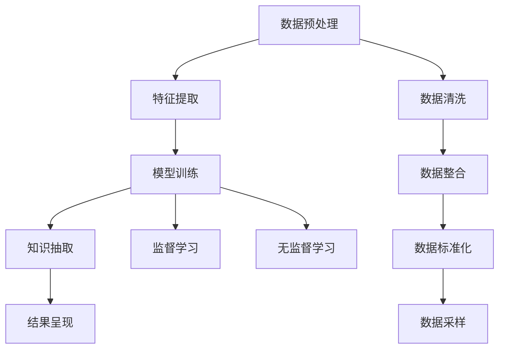

                 

# 知识管理的新纪元：知识发现引擎大放异彩

## 1. 背景介绍

### 1.1 问题由来
在当今信息爆炸的时代，知识管理的重要性愈发凸显。无论是企业组织、学术研究还是个人学习，如何高效地组织、检索和利用知识，已成为提升工作效率、加速创新进程的关键。传统的数据库和信息检索系统已难以应对日益复杂的知识需求。

**知识发现引擎（Knowledge Discovery Engine, KDE）**应运而生，它是一种利用人工智能和大数据技术，对海量知识数据进行挖掘、分析和利用的智能工具。通过对大数据进行高效抽取和分析，知识发现引擎能够发现隐藏在数据背后的有用信息，显著提高知识管理的效率和质量。

### 1.2 问题核心关键点
知识发现引擎的核心思想是通过数据挖掘、模式识别和机器学习等技术，对知识库中的数据进行自动化处理，揭示数据中的有价值模式和关系，从而为决策、研究和学习提供支持。其关键点包括：

- 数据预处理：清洗、整合和标准化数据，为后续分析奠定基础。
- 特征提取：从原始数据中提取出有用的特征，为机器学习模型提供输入。
- 模型训练：使用监督学习或无监督学习算法，对特征进行训练，形成知识发现模型。
- 知识抽取：将模型应用于新数据，抽取和验证知识。
- 结果呈现：以易于理解的形式（如报告、图表等）展示知识发现结果。

**知识发现引擎的应用**：

- **商业智能（Business Intelligence, BI）**：帮助企业进行市场分析、客户画像、销售预测等，优化决策支持。
- **学术研究**：挖掘科学文献中的知识关联，加速科研进程。
- **医疗健康**：分析临床数据，提供精准医疗方案。
- **金融风控**：通过数据挖掘，预防和识别金融风险。
- **智慧城市**：分析城市运行数据，优化城市管理。

## 2. 核心概念与联系

### 2.1 核心概念概述

为了更好地理解知识发现引擎，本文将介绍几个关键概念：

- **知识发现（Knowledge Discovery, KD）**：通过数据挖掘技术从海量数据中发现隐含的、先前未知的知识。
- **知识表示（Knowledge Representation, KR）**：将知识以结构化的形式组织起来，便于机器理解和处理。
- **数据挖掘（Data Mining）**：使用算法和技术从大量数据中发现有用的模式、关系和趋势。
- **机器学习（Machine Learning, ML）**：使机器能够自动学习和改进，从而做出预测或决策。

这些概念之间的联系可以通过以下Mermaid流程图展示：



这个流程图展示了知识发现引擎的核心流程：

1. 从原始数据中预处理、提取和标准化特征。
2. 使用监督或无监督学习算法对特征进行模型训练。
3. 应用模型对新数据进行知识抽取和验证。
4. 将知识以易于理解的形式呈现。

## 3. 核心算法原理 & 具体操作步骤
### 3.1 算法原理概述

知识发现引擎的核心算法原理可以概括为以下几个步骤：

1. **数据预处理**：清洗、整合、标准化数据，去除噪声和冗余，为后续分析提供干净、高质量的数据集。
2. **特征提取**：从清洗后的数据中提取出具有代表性的特征，用于描述数据的特点和关系。
3. **模型训练**：使用机器学习算法对特征进行训练，形成知识发现模型。
4. **知识抽取**：将模型应用于新数据，发现其中的模式、关系和趋势。
5. **结果呈现**：以报告、图表等形式将知识发现结果可视化，便于理解和应用。

### 3.2 算法步骤详解

以下是知识发现引擎的详细步骤：

1. **数据预处理**：
   - **数据清洗**：去除缺失值、重复记录和异常值。
   - **数据整合**：将分散在不同源的数据统一存储和格式。
   - **数据标准化**：将数据转换为统一的格式，如时间戳、货币单位等。
   - **数据采样**：对数据进行采样，减少计算复杂度，提升效率。

2. **特征提取**：
   - **特征选择**：选择与任务相关的特征，去除无关的特征。
   - **特征转换**：使用技术如主成分分析（PCA）、因子分析（FA）等对数据进行降维。
   - **特征构建**：构建新的特征，如文本挖掘中的TF-IDF、N-Gram等。

3. **模型训练**：
   - **监督学习**：使用带有标签的数据集进行训练，如回归、分类等。
   - **无监督学习**：使用未标记的数据集进行训练，如聚类、关联规则等。
   - **半监督学习**：结合少量标记数据和大量未标记数据进行训练，平衡两者优势。

4. **知识抽取**：
   - **关联规则挖掘**：发现数据中的频繁项集和关联规则。
   - **分类和聚类**：使用分类算法对数据进行分类，使用聚类算法对数据进行分组。
   - **异常检测**：识别数据中的异常点和异常行为。

5. **结果呈现**：
   - **可视化**：使用图表、地图等形式展示发现的知识。
   - **报告生成**：生成详细的知识发现报告，便于理解和决策。

### 3.3 算法优缺点

知识发现引擎具有以下优点：

- **高效性**：通过自动化处理大量数据，显著提高知识管理的效率。
- **灵活性**：支持多种数据类型和分析方法，满足不同领域的需求。
- **可解释性**：分析过程和结果具有可解释性，便于理解和应用。
- **可扩展性**：能够处理大规模数据，支持分布式计算和并行处理。

同时，知识发现引擎也存在一些局限性：

- **数据质量依赖**：分析结果的质量很大程度上依赖于数据的质量和完整性。
- **算法复杂性**：一些高级算法如深度学习、神经网络等，需要较强的计算资源和专业知识。
- **结果解释性**：复杂模型的决策过程和结果解释性较差，需要结合领域知识进行解释。

### 3.4 算法应用领域

知识发现引擎在多个领域得到了广泛应用：

- **商业智能（BI）**：通过分析客户数据、市场数据等，提供决策支持。
- **科学研究**：挖掘科学文献中的知识关联，加速科研进程。
- **医疗健康**：分析患者数据，提供个性化医疗方案。
- **金融风控**：通过数据分析，识别和预防金融风险。
- **智慧城市**：分析城市运行数据，优化城市管理。

## 4. 数学模型和公式 & 详细讲解 & 举例说明

### 4.1 数学模型构建

知识发现引擎的数学模型通常包括以下几个部分：

- **数据预处理**：涉及数据清洗、整合和标准化等步骤，可以使用简单的统计方法和技术。
- **特征提取**：如文本挖掘中的TF-IDF、N-Gram等方法。
- **模型训练**：如回归、分类、聚类等算法的数学模型。

### 4.2 公式推导过程

以回归分析为例，其公式推导如下：

假设数据集 $D=\{(x_i, y_i)\}_{i=1}^n$，其中 $x_i \in \mathbb{R}^d$ 为输入向量，$y_i \in \mathbb{R}$ 为输出变量。回归模型的目标是最小化均方误差损失函数：

$$
\mathcal{L}(w, b) = \frac{1}{2n}\sum_{i=1}^n (y_i - w^T x_i - b)^2
$$

其中 $w \in \mathbb{R}^d$ 为模型参数，$b \in \mathbb{R}$ 为偏置项。最小化损失函数的过程为：

$$
\min_{w, b} \mathcal{L}(w, b) = \frac{1}{2n} \sum_{i=1}^n (y_i - w^T x_i - b)^2
$$

通过求解该优化问题，可以得出最优的模型参数 $w$ 和 $b$。

### 4.3 案例分析与讲解

以下以金融风控为例，说明知识发现引擎的应用：

1. **数据预处理**：收集金融交易数据，清洗和整合数据，标准化日期和时间格式。
2. **特征提取**：提取交易金额、交易时间、交易地点等特征，构建特征向量。
3. **模型训练**：使用决策树、随机森林等算法对特征进行训练，形成风控模型。
4. **知识抽取**：将模型应用于新交易数据，识别高风险交易行为。
5. **结果呈现**：以报告形式展示风险交易的特征和频率。

## 5. 项目实践：代码实例和详细解释说明

### 5.1 开发环境搭建

为了实践知识发现引擎，需要搭建以下开发环境：

1. **安装Python**：从官网下载Python安装包，安装最新版。
2. **安装相关库**：安装NumPy、Pandas、Scikit-Learn、TensorFlow等库。
3. **数据准备**：准备训练集和测试集，可以使用公开数据集，如UCI机器学习库、Kaggle等。

### 5.2 源代码详细实现

以下是一个简单的知识发现引擎实现，包括数据预处理、特征提取和模型训练：

```python
import pandas as pd
from sklearn.model_selection import train_test_split
from sklearn.preprocessing import StandardScaler
from sklearn.ensemble import RandomForestClassifier
from sklearn.metrics import accuracy_score

# 数据预处理
data = pd.read_csv('data.csv')
data = data.dropna()  # 去除缺失值
data = data.drop_duplicates()  # 去除重复记录

# 特征提取
features = data[['特征1', '特征2', '特征3']]
labels = data['标签']
X_train, X_test, y_train, y_test = train_test_split(features, labels, test_size=0.2, random_state=42)

# 模型训练
scaler = StandardScaler()
X_train = scaler.fit_transform(X_train)
X_test = scaler.transform(X_test)
clf = RandomForestClassifier(n_estimators=100, random_state=42)
clf.fit(X_train, y_train)

# 结果呈现
y_pred = clf.predict(X_test)
accuracy = accuracy_score(y_test, y_pred)
print(f"Accuracy: {accuracy:.2f}")
```

### 5.3 代码解读与分析

上述代码实现了简单的数据预处理、特征提取和模型训练过程：

1. **数据预处理**：
   - 使用Pandas库读取数据文件。
   - 去除缺失值和重复记录，保证数据质量。

2. **特征提取**：
   - 使用Pandas库提取特征列。
   - 使用Scikit-Learn库进行数据分割。

3. **模型训练**：
   - 使用Scikit-Learn库进行标准化处理。
   - 使用RandomForestClassifier进行模型训练，并输出预测结果。

4. **结果呈现**：
   - 计算模型预测准确率，并输出结果。

## 6. 实际应用场景

### 6.1 商业智能（BI）

知识发现引擎在商业智能（BI）中具有重要应用。通过分析客户数据、市场数据等，企业可以洞察市场趋势、客户需求，优化决策支持。例如，零售商可以利用知识发现引擎分析销售数据，识别高销售量商品，优化库存管理和促销策略。

### 6.2 科学研究

科学研究中，知识发现引擎可以挖掘科学文献中的知识关联，加速科研进程。例如，生物医学领域可以利用知识发现引擎分析基因组数据，发现新的疾病基因和生物标记物，推动精准医疗的发展。

### 6.3 医疗健康

在医疗健康领域，知识发现引擎可以分析患者数据，提供个性化医疗方案。例如，医院可以利用知识发现引擎分析患者病历数据，发现疾病发展趋势，预测疾病风险，优化诊疗方案。

### 6.4 金融风控

金融领域中，知识发现引擎可以识别和预防金融风险。例如，银行可以利用知识发现引擎分析交易数据，识别欺诈行为，防范金融诈骗。

### 6.5 智慧城市

智慧城市中，知识发现引擎可以分析城市运行数据，优化城市管理。例如，城市可以利用知识发现引擎分析交通数据，优化交通流量，减少交通拥堵。

## 7. 工具和资源推荐

### 7.1 学习资源推荐

为了系统掌握知识发现引擎的理论和实践，以下是一些推荐的学习资源：

1. **《数据挖掘导论》**：由Ralf Smyth等作者撰写，深入浅出地介绍了数据挖掘的基本原理和算法。
2. **《机器学习实战》**：由Peter Harrington等作者撰写，提供了大量机器学习算法的实现案例。
3. **Coursera数据科学课程**：斯坦福大学开设的在线课程，涵盖了数据挖掘、机器学习、统计学等知识。
4. **Kaggle竞赛平台**：提供了大量公开数据集和竞赛，可以实践数据挖掘和机器学习技能。

### 7.2 开发工具推荐

为了提高知识发现引擎的开发效率，以下是一些推荐的开发工具：

1. **Jupyter Notebook**：强大的数据科学交互式开发环境，支持Python、R等多种语言。
2. **TensorFlow**：Google开发的深度学习框架，支持分布式计算和模型优化。
3. **PyTorch**：Facebook开发的深度学习框架，易于使用和扩展。
4. **Scikit-Learn**：Python的机器学习库，提供了多种经典算法实现。
5. **Apache Spark**：支持大规模数据处理的分布式计算框架。

### 7.3 相关论文推荐

为了深入了解知识发现引擎的研究现状和前沿技术，以下是一些推荐的相关论文：

1. **《数据挖掘：概念与技术》**：由Han J.P.等作者撰写，全面介绍了数据挖掘的算法和技术。
2. **《机器学习》**：由Tom Mitchell等作者撰写，介绍了机器学习的基本概念和算法。
3. **《数据挖掘技术与应用》**：由李良等作者撰写，介绍了数据挖掘在各个领域的应用。

## 8. 总结：未来发展趋势与挑战

### 8.1 总结

本文对知识发现引擎进行了全面系统的介绍。首先阐述了知识发现引擎的研究背景和应用意义，明确了其在商业智能、科学研究、医疗健康等多个领域的重要价值。其次，从原理到实践，详细讲解了知识发现引擎的核心算法和具体操作步骤，提供了具体的代码实现。同时，本文还探讨了知识发现引擎的未来发展趋势和面临的挑战。

通过本文的系统梳理，可以看到，知识发现引擎通过自动化处理大量数据，揭示其中的有用模式和关系，显著提高了知识管理的效率和质量。未来，伴随数据规模的不断扩大和计算能力的持续提升，知识发现引擎必将在更多领域得到广泛应用，为各行各业带来变革性影响。

### 8.2 未来发展趋势

展望未来，知识发现引擎的发展趋势如下：

1. **自动化水平提升**：随着自动化技术的发展，知识发现引擎将能够自动完成更多的数据预处理和特征提取工作，进一步提高效率。
2. **算法多样化**：将引入更多高级算法，如深度学习、强化学习等，提升分析的深度和广度。
3. **分布式处理**：支持更大规模的数据处理和分析，实现分布式计算和并行处理。
4. **多模态融合**：支持处理多种数据类型，如图像、文本、语音等，实现多模态数据的融合和分析。
5. **增强可解释性**：引入可解释性模型和工具，提升知识发现过程和结果的解释性。

### 8.3 面临的挑战

尽管知识发现引擎已经取得了显著进展，但在迈向更广泛应用的过程中，仍面临一些挑战：

1. **数据质量和多样性**：不同领域的数据质量和类型差异较大，难以进行统一处理和分析。
2. **算法复杂性**：一些高级算法需要较强的计算资源和专业知识，难以普及。
3. **结果解释性**：复杂模型的决策过程和结果解释性较差，难以满足用户需求。
4. **隐私和安全**：知识发现引擎处理的数据可能涉及敏感信息，需要加强隐私保护和安全控制。

### 8.4 研究展望

未来，知识发现引擎的研究方向可能包括：

1. **自动化和智能化的数据预处理**：利用自动化技术进一步提升数据预处理效率，实现智能化的特征选择和构建。
2. **多模态数据的融合和分析**：实现不同类型数据的整合和分析，提升知识发现的多样性和准确性。
3. **可解释性增强**：引入可解释性模型和工具，提升知识发现过程和结果的解释性，增强用户信任。
4. **隐私保护和安全控制**：加强数据隐私保护和安全性控制，确保数据使用的合规性和安全性。

## 9. 附录：常见问题与解答

**Q1：知识发现引擎有哪些优势和局限性？**

A: 知识发现引擎的优势包括：
- 自动化处理大量数据，提升效率。
- 支持多种数据类型和分析方法，灵活性高。
- 分析过程和结果具有可解释性，便于理解。

其局限性包括：
- 数据质量依赖：分析结果的质量很大程度上依赖于数据质量和完整性。
- 算法复杂性：一些高级算法需要较强的计算资源和专业知识。
- 结果解释性：复杂模型的决策过程和结果解释性较差。

**Q2：如何选择合适的特征用于知识发现？**

A: 特征选择是知识发现引擎的重要步骤，主要考虑以下几个方面：
- 相关性：选择与任务相关的特征，去除无关的特征。
- 完备性：确保选择的特征能够描述数据的主要特征。
- 可解释性：选择易于理解和解释的特征，便于解释模型的结果。
- 计算效率：选择计算复杂度较低的特征，提高模型训练和推理效率。

**Q3：知识发现引擎如何处理缺失值和异常值？**

A: 知识发现引擎可以通过以下方法处理缺失值和异常值：
- 缺失值处理：使用插值法、均值填补等方法填充缺失值。
- 异常值检测：使用统计方法如均值、标准差等检测异常值，使用鲁棒性算法如中位数、四分位距等处理异常值。
- 异常值标记：将异常值标记出来，进行进一步分析或处理。

**Q4：知识发现引擎的开发和部署需要注意哪些问题？**

A: 知识发现引擎的开发和部署需要注意以下问题：
- 数据预处理：确保数据质量，进行清洗、整合和标准化。
- 特征选择：选择与任务相关的特征，去除无关的特征。
- 模型选择：选择适合任务的模型，如回归、分类、聚类等。
- 模型训练：使用合适的算法和参数进行模型训练，避免过拟合和欠拟合。
- 模型评估：使用合适的评估指标评估模型性能，如准确率、召回率等。
- 模型部署：将模型部署到生产环境，确保稳定性和安全性。

**Q5：知识发现引擎如何结合领域知识进行优化？**

A: 知识发现引擎可以通过以下方法结合领域知识进行优化：
- 领域专家参与：邀请领域专家参与知识发现过程，提供指导和建议。
- 数据标注：利用领域专家的标注数据进行监督学习，提升模型性能。
- 知识融合：将领域知识与数据挖掘结果进行融合，提升知识发现的效果。
- 模型解释：利用领域知识解释模型的决策过程和结果，增强用户信任。

通过结合领域知识，知识发现引擎可以更好地理解和应用数据，提升分析和决策的准确性和可靠性。

---

作者：禅与计算机程序设计艺术 / Zen and the Art of Computer Programming

