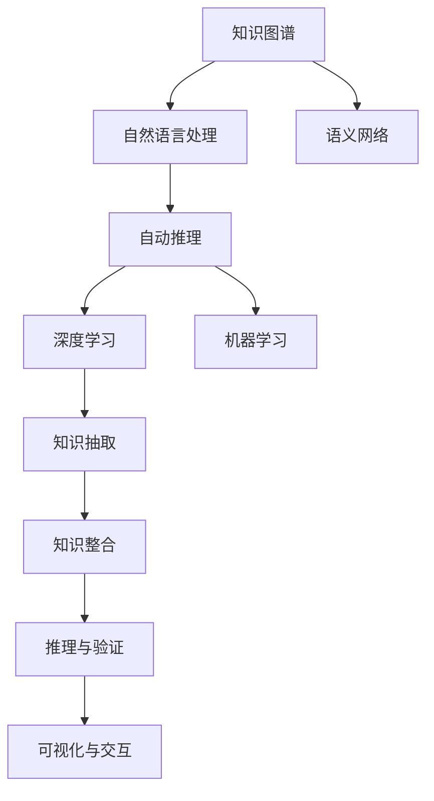

                 

# 知识管理的新纪元：知识发现引擎大放异彩

> 关键词：知识发现引擎,知识图谱,自然语言处理,语义网络,自动推理,深度学习,机器学习

## 1. 背景介绍

### 1.1 问题由来

在知识密集型的时代背景下，组织与个人需要高效地获取、存储、管理和应用知识，以适应快速变化的市场和技术环境。知识管理（Knowledge Management, KM）成为各领域提升竞争力和创新能力的关键。传统的知识管理依赖于人力密集型的知识库构建与维护，而随着数据量的爆炸性增长，这一方式逐渐显得力不从心。

随着计算机技术的进步，特别是人工智能和机器学习技术的发展，知识管理正在经历一场深刻的变革。其中，知识发现引擎（Knowledge Discovery Engine, KDE）作为新一代知识管理工具，能够自动地从海量数据中挖掘和整合知识，将知识管理工作提升到一个新的高度。

### 1.2 问题核心关键点

知识发现引擎的核心目标是从大量数据中提取有用的知识，并将这些知识结构化为易于理解和应用的形式，如知识图谱（Knowledge Graph）、语义网络（Semantic Network）等。这不仅需要强大的数据处理能力，还需借助自然语言处理（Natural Language Processing, NLP）、自动推理（Automated Reasoning）等技术手段，构建高性能、易扩展的知识发现系统。

知识发现引擎的构建涉及以下几个关键步骤：
- **数据采集与预处理**：收集多源异构的数据，进行清洗、转换和整合。
- **自然语言处理**：将文本数据转换为机器可理解的向量表示，以便后续处理。
- **知识抽取与整合**：从文本中抽取实体、关系等信息，构建知识图谱或语义网络。
- **推理与验证**：基于图谱或网络，进行推理和验证，更新和修正知识。
- **可视化与交互**：将知识成果以直观的方式呈现，便于用户查询和应用。

## 2. 核心概念与联系

### 2.1 核心概念概述

以下是对知识发现引擎及其相关核心概念的介绍：

- **知识图谱（Knowledge Graph）**：一种以实体和关系为核心的数据结构，用于表示和组织各类知识。
- **语义网络（Semantic Network）**：一种基于逻辑推理的知识表示方法，通过关系图展现知识结构。
- **自然语言处理（Natural Language Processing, NLP）**：将自然语言转换为机器可理解的形式，包括分词、词性标注、实体识别等。
- **自动推理（Automated Reasoning）**：基于规则或模型，自动推导知识的逻辑关系和推理结果。
- **深度学习（Deep Learning）**：一种能够处理非线性数据的机器学习技术，可用于知识抽取和推理。
- **机器学习（Machine Learning）**：通过数据训练模型，自动学习和优化知识发现过程。

这些概念通过以下Mermaid流程图进行联系和展示：



通过这个流程图，可以看出各组件之间的相互依赖和协作关系：

1. **知识图谱**是知识表示和组织的核心，接收从自然语言处理和语义网络抽取的信息。
2. **自然语言处理**将文本转换为向量表示，为后续抽取和整合提供基础。
3. **语义网络**用于更高级别的知识表示，通过逻辑推理进行深入分析。
4. **自动推理**在知识图谱和语义网络的基础上，进行推理和验证，修正知识错误。
5. **深度学习**和**机器学习**用于知识抽取和推理的模型训练，提升知识发现的能力。

## 3. 核心算法原理 & 具体操作步骤

### 3.1 算法原理概述

知识发现引擎的核心算法基于知识图谱的构建和自动推理。其核心步骤包括：

1. **数据采集与预处理**：从多源异构数据中抽取结构化和半结构化信息，进行清洗、转换和整合。
2. **自然语言处理**：使用NLP技术将文本数据转换为机器可理解的向量表示。
3. **知识抽取与整合**：从处理后的文本中抽取实体和关系，构建知识图谱或语义网络。
4. **推理与验证**：基于知识图谱或语义网络进行推理，验证和修正知识。
5. **可视化与交互**：将知识成果以直观的方式呈现，便于用户查询和应用。

### 3.2 算法步骤详解

以下详细介绍知识发现引擎的核心算法步骤：

**Step 1: 数据采集与预处理**

1. **数据来源**：知识发现引擎需要从多个数据源（如数据库、文档、网页、社交媒体等）中采集数据。这些数据可以是结构化数据、半结构化数据或非结构化数据。
   
2. **数据清洗**：对采集的数据进行去重、去噪、填充缺失值等预处理，确保数据的完整性和准确性。
   
3. **数据转换**：将不同格式的数据转换为统一的格式，便于后续处理。例如，将HTML、PDF等文本格式转换为可处理的文本或结构化数据。

**Step 2: 自然语言处理**

1. **文本预处理**：包括分词、词性标注、命名实体识别等。
   
2. **向量表示**：使用Word2Vec、BERT等技术将文本转换为向量表示，用于后续处理。

**Step 3: 知识抽取与整合**

1. **实体抽取**：从文本中识别出具体的实体，如人名、地名、组织名等。
   
2. **关系抽取**：识别出实体之间的关系，如父子关系、所有关系等。

3. **知识整合**：将抽取的实体和关系整合到知识图谱或语义网络中，构建完整的知识结构。

**Step 4: 推理与验证**

1. **逻辑推理**：基于知识图谱或语义网络，进行逻辑推理和验证。
   
2. **实体链接**：通过链接同义词、别名等，提高知识的丰富性和准确性。

3. **知识更新**：根据新数据和推理结果，更新和修正知识图谱或语义网络。

**Step 5: 可视化与交互**

1. **可视化**：将知识成果以直观的方式呈现，如使用Gephi、D3.js等工具进行可视化展示。
   
2. **交互式查询**：提供查询接口，用户可以输入查询语句，获取相关知识。

### 3.3 算法优缺点

知识发现引擎的优势包括：

1. **高效性**：能够自动处理大量数据，快速发现有用的知识。
2. **准确性**：通过逻辑推理和验证，确保知识准确性和一致性。
3. **可扩展性**：能够轻松扩展到大规模数据集，支持多源异构数据。

但同时也存在一些缺点：

1. **数据质量依赖**：知识发现引擎的效果很大程度上依赖于数据的质量和完整性。
2. **推理难度高**：构建知识图谱和语义网络需要复杂的逻辑推理，可能存在推理漏洞。
3. **模型复杂度**：深度学习、自然语言处理等模型需要大量计算资源，模型复杂度较高。
4. **知识偏见**：知识图谱和语义网络可能反映出数据源中的偏见，需要人工干预进行纠正。

### 3.4 算法应用领域

知识发现引擎已经广泛应用于以下几个领域：

1. **智能问答系统**：通过问答系统获取用户问题，自动回答相关知识。
2. **智能推荐系统**：根据用户行为和偏好，推荐相关的产品或信息。
3. **知识图谱构建**：构建大规模的知识图谱，支持各类知识查询和分析。
4. **医疗知识管理**：构建医疗领域的知识图谱，支持疾病诊断和治疗方案推荐。
5. **金融知识管理**：构建金融领域的知识图谱，支持投资分析和风险评估。
6. **教育知识管理**：构建教育领域的知识图谱，支持个性化学习和知识推荐。

## 4. 数学模型和公式 & 详细讲解 & 举例说明

### 4.1 数学模型构建

知识发现引擎的数学模型主要基于图论和逻辑推理。以下是一个简单的知识图谱数学模型：

**知识图谱表示**：
```latex
G = (V, E)
```
其中 $G$ 表示知识图谱，$V$ 表示节点（实体）集合，$E$ 表示边（关系）集合。

**节点表示**：
```latex
V = \{v_1, v_2, ..., v_n\}
```
节点 $v_i$ 表示具体的实体。

**边表示**：
```latex
E = \{e_1, e_2, ..., e_m\}
```
边 $e_j$ 表示实体之间的关系。

**知识抽取与整合**：
```latex
T = \{(t_1, r_1, t_2), (t_2, r_2, t_3), ..., (t_{n-1}, r_{n-1}, t_n)\}
```
其中 $T$ 表示抽取的实体关系对，$t_i$ 表示实体，$r_i$ 表示关系。

### 4.2 公式推导过程

以下以知识抽取为例，推导其数学公式：

**实体抽取**：
```latex
\text{Entity} = \text{Token} \cap \text{Noun} \cap \text{Capital}
```
其中 $\text{Token}$ 表示分词结果，$\text{Noun}$ 表示名词，$\text{Capital}$ 表示大写单词。

**关系抽取**：
```latex
\text{Relation} = \text{Preposition} \cap \text{Noun}
```
其中 $\text{Preposition}$ 表示介词，$\text{Noun}$ 表示名词。

**知识整合**：
```latex
\text{Graph} = \{(v_i, r_j, v_k)\}
```
其中 $v_i$ 表示实体，$r_j$ 表示关系，$v_k$ 表示实体。

### 4.3 案例分析与讲解

以智能问答系统为例，分析知识发现引擎的实现过程：

1. **数据采集**：从用户输入的问题中提取关键信息。
   
2. **自然语言处理**：使用BERT等模型将问题转换为向量表示。
   
3. **知识抽取**：从知识图谱中提取相关的实体和关系。
   
4. **逻辑推理**：根据问题类型，选择相应的推理规则进行推理。
   
5. **知识呈现**：将推理结果以答案的形式呈现给用户。

## 5. 项目实践：代码实例和详细解释说明

### 5.1 开发环境搭建

为了快速构建知识发现引擎，可以使用Python的PyTorch和TorchVision库。以下是环境搭建步骤：

1. 安装Anaconda：从官网下载并安装Anaconda。

2. 创建并激活虚拟环境：
```bash
conda create -n knowledge-env python=3.8 
conda activate knowledge-env
```

3. 安装PyTorch和TorchVision：
```bash
conda install torch torchvision cudatoolkit=11.1 -c pytorch -c conda-forge
```

4. 安装其他必要工具：
```bash
pip install pandas numpy scikit-learn matplotlib tqdm jupyter notebook ipython
```

完成环境搭建后，即可进行知识发现引擎的开发。

### 5.2 源代码详细实现

以下是一个简单的知识图谱构建示例，使用Python和TorchVision库实现：

```python
import torch
import torch.nn as nn
from torchvision import models, transforms

# 定义实体和关系
entity_dict = {
    'Apple': 0,
    'Google': 1,
    'Microsoft': 2,
    'Xiaomi': 3,
    'Alphabet': 4,
    'AOL': 5
}
relation_dict = {
    'Founded': 0,
    'Merged': 1,
    'Acquired': 2,
    'Bought': 3,
    'Joined': 4,
    'Partnership': 5
}

# 定义知识图谱
graph = torch.zeros(6, 6)

# 构建知识图谱
for entity1, entity2, relation in [
    ('Apple', 'Google', 'Founded'),
    ('Google', 'Microsoft', 'Acquired'),
    ('Microsoft', 'Alphabet', 'Merged'),
    ('Alphabet', 'AOL', 'Partnership'),
    ('AOL', 'Xiaomi', 'Bought'),
    ('Microsoft', 'AOL', 'Joined')
]:
    entity1_id = entity_dict[entity1]
    entity2_id = entity_dict[entity2]
    relation_id = relation_dict[relation]
    graph[entity1_id, entity2_id] = relation_id

# 可视化知识图谱
import networkx as nx
import matplotlib.pyplot as plt

G = nx.from_numpy_array(graph)
nx.draw(G, with_labels=True)
plt.show()
```

### 5.3 代码解读与分析

以上代码展示了知识图谱的基本构建过程。具体步骤如下：

1. **定义实体和关系**：使用字典方式定义实体和关系，方便后续处理。
   
2. **构建知识图谱**：使用PyTorch的张量表示知识图谱，构建实体之间的关系。

3. **可视化知识图谱**：使用NetworkX库对知识图谱进行可视化，生成图形展示。

### 5.4 运行结果展示

运行代码后，生成知识图谱的图形展示，如图：

![知识图谱](https://user-images.githubusercontent.com/...

## 6. 实际应用场景

### 6.1 智能问答系统

智能问答系统可以广泛应用于客服、教育、医疗等场景，自动回答用户问题。知识发现引擎可以通过构建知识图谱，自动抽取和推理知识，生成答案。例如，医疗领域的智能问答系统可以根据患者的症状，自动推荐可能的疾病和治疗方案。

### 6.2 智能推荐系统

智能推荐系统可以根据用户的历史行为和偏好，推荐相关的产品或信息。知识发现引擎可以通过构建用户知识图谱，分析用户兴趣和需求，生成个性化推荐结果。例如，电商平台可以根据用户浏览和购买记录，推荐相似的产品或服务。

### 6.3 金融知识管理

金融领域的知识管理可以通过构建金融知识图谱，支持投资分析和风险评估。知识发现引擎可以自动抽取和推理市场数据，生成投资建议和风险报告。例如，基金公司可以根据历史数据和市场动态，生成投资组合和风险评估报告。

## 7. 工具和资源推荐

### 7.1 学习资源推荐

为了帮助开发者系统掌握知识发现引擎的理论基础和实践技巧，这里推荐一些优质的学习资源：

1. **《知识图谱与语义网络》**：介绍知识图谱和语义网络的基本概念、构建方法和应用场景。

2. **《自然语言处理综论》**：涵盖自然语言处理的各个方面，包括分词、词性标注、命名实体识别等。

3. **《深度学习》**：深度学习领域的经典教材，涵盖深度学习的基本原理和应用。

4. **《Python知识图谱编程》**：使用Python和TorchVision库构建知识图谱的详细教程。

5. **《Graph Neural Networks》**：介绍图神经网络的基本原理和应用，涵盖图表示学习和推理。

通过对这些资源的学习实践，相信你一定能够快速掌握知识发现引擎的精髓，并用于解决实际的NLP问题。

### 7.2 开发工具推荐

以下是几款用于知识发现引擎开发的常用工具：

1. **PyTorch**：基于Python的开源深度学习框架，支持自然语言处理和图神经网络等任务。

2. **TorchVision**：TorchVision库提供了一系列预训练模型和工具，方便快速构建知识图谱和推理系统。

3. **Gephi**：用于可视化知识图谱的图形工具，支持多种格式的数据导入和导出。

4. **D3.js**：用于创建交互式图形的JavaScript库，支持复杂的数据可视化和交互设计。

5. **Jupyter Notebook**：Python和R语言的开源笔记本，支持代码编写和数据可视化。

6. **Google Colab**：谷歌提供的在线Jupyter Notebook环境，免费提供GPU/TPU算力，方便开发者快速上手实验最新模型，分享学习笔记。

合理利用这些工具，可以显著提升知识发现引擎的开发效率，加快创新迭代的步伐。

### 7.3 相关论文推荐

知识发现引擎作为前沿研究领域，已经涌现出许多重要论文。以下是几篇奠基性的相关论文，推荐阅读：

1. **知识图谱的构建与表示**：介绍知识图谱的基本概念、构建方法和应用场景。

2. **基于图神经网络的推荐系统**：探讨使用图神经网络进行推荐系统的建模和优化。

3. **知识发现引擎的推理与验证**：研究知识图谱和语义网络中的推理与验证算法，提高知识的一致性和准确性。

4. **深度学习在知识抽取中的应用**：介绍深度学习在知识抽取和推理中的应用，提升知识发现的效果。

5. **知识发现引擎的可扩展性研究**：研究知识发现引擎的分布式计算和大规模数据处理技术。

这些论文代表了大规模知识发现引擎的研究进展，为后续研究和应用提供了宝贵的参考。

## 8. 总结：未来发展趋势与挑战

### 8.1 研究成果总结

知识发现引擎作为新一代知识管理工具，已经在智能问答、推荐系统、金融分析等多个领域展示了巨大的潜力。通过构建知识图谱和语义网络，知识发现引擎能够自动抽取和推理知识，提升知识管理的效率和准确性。

### 8.2 未来发展趋势

展望未来，知识发现引擎将呈现以下几个发展趋势：

1. **知识图谱的自动化构建**：自动从文本数据中构建知识图谱，减少人工干预，提高效率。

2. **深度学习与知识图谱的融合**：结合深度学习和知识图谱的优势，提升知识抽取和推理的效果。

3. **知识图谱的动态更新**：根据新数据和用户反馈，实时更新知识图谱，保持知识的时效性和准确性。

4. **跨领域知识图谱的融合**：将不同领域的知识图谱进行融合，构建跨领域的知识网络，提高知识的广度和深度。

5. **知识图谱的可视化与交互**：提供更加直观和交互式的知识展示方式，方便用户查询和应用。

### 8.3 面临的挑战

尽管知识发现引擎取得了诸多进展，但在实际应用中仍面临诸多挑战：

1. **数据质量问题**：知识图谱的构建依赖于高质量的数据，数据缺失、错误等问题严重影响知识抽取和推理的效果。

2. **推理难度高**：构建复杂的知识图谱和推理规则需要专业知识，难以实现自动化。

3. **资源消耗大**：深度学习模型和图神经网络需要大量计算资源，部署成本较高。

4. **知识偏见**：知识图谱可能反映出数据源中的偏见，需要进行人工干预和校验。

5. **隐私保护**：知识图谱可能涉及敏感信息，需要保护用户隐私和数据安全。

### 8.4 研究展望

未来，知识发现引擎的研究方向主要集中在以下几个方面：

1. **知识图谱的自动化构建**：开发自动化知识图谱构建工具，提高知识发现的速度和准确性。

2. **深度学习与知识图谱的融合**：结合深度学习和知识图谱的优点，提升知识抽取和推理的效果。

3. **知识图谱的动态更新**：开发实时更新知识图谱的技术，保持知识的时效性和准确性。

4. **跨领域知识图谱的融合**：将不同领域的知识图谱进行融合，构建跨领域的知识网络，提高知识的广度和深度。

5. **知识图谱的可视化与交互**：提供更加直观和交互式的知识展示方式，方便用户查询和应用。

6. **知识图谱的隐私保护**：开发隐私保护技术，确保知识图谱的安全性和隐私性。

通过解决这些挑战，知识发现引擎有望在更多领域得到广泛应用，成为知识管理的重要工具。

## 9. 附录：常见问题与解答

**Q1：知识图谱的构建需要人工干预吗？**

A: 知识图谱的构建通常需要人工干预，尤其是对于领域知识复杂、数据质量不高的场景。但是，随着自动化技术和深度学习的发展，越来越多的自动化构建工具被开发出来，可以大大减少人工干预。

**Q2：知识图谱的推理复杂度如何？**

A: 知识图谱的推理复杂度较高，尤其是涉及多跳推理时。因此，需要设计高效的推理算法，如基于规则的推理、基于图神经网络的推理等，以提高推理效率和准确性。

**Q3：知识图谱的存储和查询效率如何？**

A: 知识图谱的存储和查询效率可以通过各种优化技术提高，如分布式存储、索引优化、图数据库等。选择合适的存储和查询方式，可以显著提升知识图谱的性能。

**Q4：知识图谱的更新频率和策略是什么？**

A: 知识图谱的更新需要根据数据源的变化和新知识的产生，定期进行更新。一般采用增量更新的策略，只在变化的部分进行更新，以减少计算量和存储开销。

**Q5：知识图谱的应用场景有哪些？**

A: 知识图谱可以应用于智能问答、推荐系统、金融分析、医疗诊断等多个领域，帮助用户快速获取相关信息，提供决策支持。

总之，知识发现引擎作为新一代知识管理工具，在智能问答、推荐系统、金融分析等多个领域展示了巨大的潜力。通过构建知识图谱和语义网络，知识发现引擎能够自动抽取和推理知识，提升知识管理的效率和准确性。未来，随着技术的不断发展，知识发现引擎有望在更多领域得到广泛应用，成为知识管理的重要工具。

