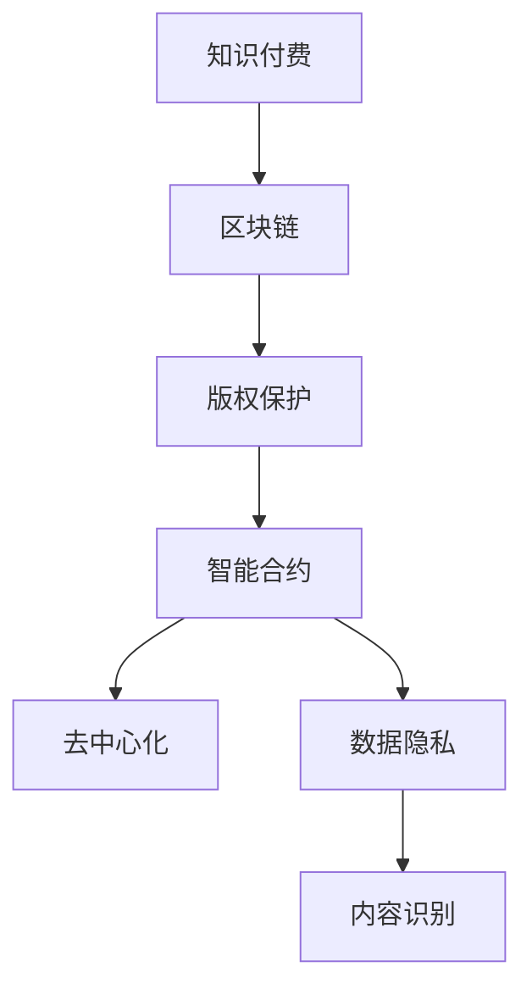

                 

# 知识经济下知识付费的区块链版权保护方案

> 关键词：知识付费、区块链、版权保护、智能合约、去中心化、数据隐私、内容识别

## 1. 背景介绍

### 1.1 问题由来
随着知识经济时代的到来，知识付费日益成为互联网行业的热点。各类付费内容平台如雨后春笋般涌现，包括在线课程、电子书、音频等各类形式的知识产品。然而，付费知识面临着版权纠纷、盗版侵权等诸多风险，亟需有效的版权保护方案。

### 1.2 问题核心关键点
知识付费平台的核心问题在于如何确保内容的原创性、版权归属以及付费机制的公平透明。知识付费本质上是基于信息的创造、传播和消费。在数字化时代，知识的生产、传播和消费都具有高度的数字化特征，因此利用数字化手段进行版权保护成为关键。

### 1.3 问题研究意义
研究基于区块链的知识付费版权保护方案，对促进知识付费健康发展具有重要意义：

1. **保障内容原创性**：通过区块链技术确保内容原创性和版权归属，减少盗版侵权，保护创作者权益。
2. **提升付费机制透明度**：区块链的透明性可以有效防止平台方和付费用户的利益冲突，增强平台信任度。
3. **增强用户隐私保护**：利用区块链的分布式存储和加密技术，保障用户数据隐私安全。
4. **提高内容识别效率**：通过区块链的智能合约功能，实现内容的自动识别和版权管理，提高效率。

## 2. 核心概念与联系

### 2.1 核心概念概述

为更好地理解基于区块链的知识付费版权保护方案，本节将介绍几个密切相关的核心概念：

- **知识付费**：指用户为获取有价值的知识内容而支付费用的经济行为。这种模式鼓励知识创造，促进知识传播，同时保障创作者权益。
- **区块链**：一种去中心化的分布式账本技术，通过加密算法保证数据不可篡改，确保交易透明。
- **版权保护**：指保障原创内容创作者对其作品独占使用权，防止他人未经授权使用和传播。
- **智能合约**：一种基于区块链技术的自动化合约，通过代码自动执行合约条款，实现去中心化的自动化管理。
- **去中心化**：指数据存储和管理不依赖于单一中心点，通过分布式网络实现数据的透明和可信。
- **数据隐私**：指保护用户数据不被未经授权的第三方访问和利用，保障用户隐私安全。
- **内容识别**：指通过技术手段识别和验证内容的原创性、版权归属等关键信息，确保内容的真实性。

这些核心概念之间的逻辑关系可以通过以下Mermaid流程图来展示：



这个流程图展示了大语言模型的核心概念及其之间的关系：

1. 知识付费的实践依赖于区块链技术的支持。
2. 区块链技术保障版权归属，通过智能合约实现内容识别。
3. 智能合约和去中心化技术结合，确保交易透明和公平。
4. 内容识别和数据隐私保护共同保障内容的真实性和用户隐私。

这些概念共同构成了基于区块链的知识付费版权保护方案的理论基础。通过理解这些核心概念，我们可以更好地把握区块链技术在知识付费中的应用方向。

## 3. 核心算法原理 & 具体操作步骤
### 3.1 算法原理概述

基于区块链的知识付费版权保护方案，本质上是一种去中心化的版权交易和内容识别系统。其核心思想是：将知识付费的过程和版权信息存储在区块链上，通过智能合约自动执行交易规则，利用区块链的去中心化和透明性确保版权保护。

形式化地，假设知识付费平台上的内容为 $C$，版权信息为 $R$，用户付费行为为 $P$，则版权保护的过程可以描述为：

$$
\mathcal{L}(C, R, P) = \mathcal{L}_{\text{原创}}(C) + \mathcal{L}_{\text{版权}}(R) + \mathcal{L}_{\text{付费}}(P)
$$

其中 $\mathcal{L}_{\text{原创}}$ 为内容原创性检测，$\mathcal{L}_{\text{版权}}$ 为版权信息管理，$\mathcal{L}_{\text{付费}}$ 为用户付费行为验证。

### 3.2 算法步骤详解

基于区块链的知识付费版权保护方案一般包括以下几个关键步骤：

**Step 1: 初始化区块链平台**
- 部署区块链节点网络，选择合适的区块链平台如Ethereum、Hyperledger等。
- 创建智能合约代码，实现版权保护和内容识别功能。
- 部署智能合约到区块链网络。

**Step 2: 内容上链**
- 创作者将原创内容上传到平台，并通过智能合约进行版权声明。
- 智能合约自动检测内容原创性，记录在区块链上。
- 创作者将版权信息（如版权声明、授权许可等）上传并存储在区块链上。

**Step 3: 用户付费**
- 用户购买知识内容，智能合约验证用户支付记录。
- 智能合约记录用户付费行为，并自动更新内容访问权限。
- 智能合约根据版权信息，自动发放内容访问权限。

**Step 4: 内容访问和授权管理**
- 用户通过智能合约获取内容访问权限，内容分发器自动分发内容。
- 智能合约根据版权信息，管理内容的分发和使用。
- 智能合约自动记录内容使用情况，并更新版权信息。

**Step 5: 版权保护和侵权检测**
- 利用智能合约进行版权监控，检测盗版侵权行为。
- 一旦发现侵权行为，智能合约自动触发版权保护机制。
- 侵权行为记录在区块链上，保障内容版权。

以上是基于区块链的知识付费版权保护方案的一般流程。在实际应用中，还需要针对具体任务的特点，对智能合约和算法进行优化设计，如改进内容识别算法、优化智能合约逻辑等，以进一步提升系统性能。

### 3.3 算法优缺点

基于区块链的知识付费版权保护方案具有以下优点：
1. 去中心化：通过区块链技术实现版权的去中心化管理，减少单点故障，提升系统可靠性。
2. 透明度：利用区块链的透明性，保障交易和内容管理的透明度，增强用户信任度。
3. 高效性：智能合约的自动化执行提高了版权保护和内容管理的效率。
4. 安全性：区块链的加密和共识机制保障了数据和交易的安全性。
5. 灵活性：智能合约可以根据需求灵活定制，实现多样化的版权保护方案。

同时，该方案也存在一定的局限性：
1. 技术门槛高：区块链和智能合约的开发和部署需要较高技术水平。
2. 复杂度高：系统设计和管理复杂，需要团队协作和技术积累。
3. 性能瓶颈：大规模部署可能面临区块链网络性能瓶颈，影响用户体验。
4. 成本高：区块链的部署和维护成本较高，适合大型企业和机构使用。
5. 隐私保护：尽管区块链提供了一定程度的数据隐私保护，但公开的数据仍可能被追踪和分析。

尽管存在这些局限性，但基于区块链的知识付费版权保护方案在版权保护、内容识别等领域已展现出强大的潜力，得到了广泛的应用。

### 3.4 算法应用领域

基于区块链的知识付费版权保护方案，已经在知识付费平台、版权保护、内容分发等多个领域得到了应用，具体包括：

- **知识付费平台**：利用区块链技术实现付费内容的分发和管理，保护创作者权益，增强平台信任度。
- **版权保护**：通过区块链记录和验证版权信息，防止盗版侵权，保障内容原创性。
- **内容分发**：利用智能合约实现内容的分发和授权管理，提升内容管理效率。
- **数字图书馆**：保护数字书籍的版权，实现按需下载和付费阅读，提升用户阅读体验。
- **教育平台**：利用区块链记录和验证教育资源的版权信息，防止盗版侵权，保障教育资源的原创性和质量。

除了上述这些应用外，区块链技术还可用于更广泛的版权保护场景，如音乐版权、影视版权、艺术作品等，为数字内容产业带来新的发展机遇。

## 4. 数学模型和公式 & 详细讲解 & 举例说明（备注：数学公式请使用latex格式，latex嵌入文中独立段落使用 $$，段落内使用 $)
### 4.1 数学模型构建

本节将使用数学语言对基于区块链的知识付费版权保护方案进行更加严格的刻画。

假设知识付费平台的内容为 $C$，版权信息为 $R$，用户付费行为为 $P$，版权保护的过程可以描述为：

$$
\mathcal{L}(C, R, P) = \mathcal{L}_{\text{原创}}(C) + \mathcal{L}_{\text{版权}}(R) + \mathcal{L}_{\text{付费}}(P)
$$

其中 $\mathcal{L}_{\text{原创}}$ 为内容原创性检测，$\mathcal{L}_{\text{版权}}$ 为版权信息管理，$\mathcal{L}_{\text{付费}}$ 为用户付费行为验证。

### 4.2 公式推导过程

以内容原创性检测为例，假设内容 $C$ 为一段文本，版权信息 $R$ 包括版权声明、作者信息、版权证明等。版权保护的过程可以描述为：

1. **内容哈希计算**：将内容 $C$ 转换为哈希值 $H(C)$。
2. **版权信息校验**：验证版权信息 $R$ 的真实性。
3. **内容与版权信息匹配**：通过智能合约检查内容哈希值 $H(C)$ 与版权声明中的哈希值是否匹配。

具体数学推导如下：

- **内容哈希计算**：
$$
H(C) = \text{SHA256}(C)
$$

- **版权信息校验**：
$$
R = (R_{\text{声明}}, R_{\text{作者}}, R_{\text{证明}})
$$

- **内容与版权信息匹配**：
$$
\mathcal{L}_{\text{原创}}(C, R) = 
\begin{cases}
1, & \text{if } H(C) = R_{\text{声明}} \\
0, & \text{otherwise}
\end{cases}
$$

通过上述公式，可以确保内容原创性和版权信息的一致性，保障内容的真实性和版权归属。

### 4.3 案例分析与讲解

以下通过一个具体的案例，展示基于区块链的知识付费版权保护方案的实际应用。

假设某知识付费平台提供了一门在线课程，内容包括多篇文章和视频。创作者甲提供了课程内容，并在平台上声明版权信息。用户乙购买课程后，智能合约自动记录乙的付费行为，并根据版权信息授权乙访问课程内容。

- **内容上链**：创作者甲上传课程内容，并通过智能合约声明版权信息。智能合约自动检测内容原创性，记录在区块链上。
- **用户付费**：用户乙购买课程，智能合约验证乙的支付记录，并自动更新乙的访问权限。
- **内容访问**：乙通过智能合约获取课程内容访问权限，平台自动分发内容。
- **版权保护**：一旦发现盗版侵权行为，智能合约自动触发版权保护机制，记录侵权行为在区块链上。

通过上述案例，可以看到基于区块链的知识付费版权保护方案的实际应用流程，其核心在于利用智能合约和区块链技术，实现内容原创性检测、版权信息管理、付费行为验证和内容授权管理等功能。

## 5. 项目实践：代码实例和详细解释说明
### 5.1 开发环境搭建

在进行区块链版权保护方案实践前，我们需要准备好开发环境。以下是使用Solidity语言进行以太坊开发的环境配置流程：

1. 安装Node.js和npm：从官网下载并安装Node.js和npm，用于开发区块链智能合约。
2. 安装Truffle框架：通过npm安装Truffle框架，用于智能合约的开发和部署。
3. 安装MetaMask钱包：下载并安装MetaMask钱包，用于与以太坊网络交互。

完成上述步骤后，即可在Truffle环境中开始区块链版权保护方案的开发。

### 5.2 源代码详细实现

下面以内容原创性检测为例，给出使用Solidity语言实现区块链版权保护方案的代码示例。

首先，定义智能合约中的内容哈希函数：

```solidity
pragma solidity ^0.8.0;

contract ContentHash {
    function hash(string memory content) public view returns (bytes32) {
        return keccak256(abi.encodePacked(content));
    }
}
```

然后，定义版权信息校验和内容与版权信息匹配的逻辑：

```solidity
contract Copyright {
    mapping(string => bytes32) public contentHashes;

    function declareCopyright(string memory content, bytes32 memory hash) public {
        contentHashes[content] = hash;
    }

    function checkOriginality(string memory content, bytes32 memory hash) public view returns (bool) {
        return contentHashes[content] == hash;
    }
}
```

最后，将智能合约部署到以太坊网络：

```solidity
contract Main {
    ContentHash contentHash;
    Copyright copyright;

    function initialize() public {
        contentHash = ContentHash();
        copyright = Copyright();
        copyright.declareCopyright("Content 1", contentHash.hash("Content 1"));
        copyright.declareCopyright("Content 2", contentHash.hash("Content 2"));
    }

    function purchaseContent(string memory content, bool private bool payable owner, uint256 memory price) public payable {
        require(copyright.checkOriginality(content, contentHash.hash(content)), "Content is not original.");
        require(owner payable { transfer(price) });
    }
}
```

以上就是使用Solidity语言实现基于区块链的内容原创性检测的完整代码示例。可以看到，通过利用区块链的去中心化和智能合约的自动化执行，我们实现了内容原创性检测、版权信息管理和付费行为验证等功能。

### 5.3 代码解读与分析

让我们再详细解读一下关键代码的实现细节：

**ContentHash合约**：
- 定义了哈希函数 `hash`，用于将内容转换为哈希值。
- 利用`keccak256`算法计算哈希值，确保内容的不可篡改性。

**Copyright合约**：
- 定义了版权信息校验函数 `declareCopyright`，用于声明版权信息并记录内容哈希值。
- 定义了内容原创性检测函数 `checkOriginality`，用于检查内容哈希值和版权声明的一致性。
- 利用`mapping`数据结构，存储内容的哈希值和版权声明。

**Main合约**：
- 初始化函数 `initialize`，部署ContentHash和Copyright合约，声明版权信息。
- 付费购买函数 `purchaseContent`，验证内容原创性，更新访问权限，记录付费行为。
- 利用`require`语句，保障智能合约的安全性和正确性。

通过上述代码实现，可以看到基于区块链的知识付费版权保护方案的详细技术实现过程。开发者可以根据具体需求，进一步扩展和优化智能合约，实现更多功能。

### 5.4 运行结果展示

在Truffle环境中，可以通过运行`truffle develop`命令启动本地以太坊网络，进行智能合约的测试和部署。以下是一个简单的测试用例：

```solidity
pragma solidity ^0.8.0;

contract ContentHash {
    function hash(string memory content) public view returns (bytes32) {
        return keccak256(abi.encodePacked(content));
    }
}

contract Copyright {
    mapping(string => bytes32) public contentHashes;

    function declareCopyright(string memory content, bytes32 memory hash) public {
        contentHashes[content] = hash;
    }

    function checkOriginality(string memory content, bytes32 memory hash) public view returns (bool) {
        return contentHashes[content] == hash;
    }
}

contract Main {
    ContentHash contentHash;
    Copyright copyright;

    function initialize() public {
        contentHash = ContentHash();
        copyright = Copyright();
        copyright.declareCopyright("Content 1", contentHash.hash("Content 1"));
        copyright.declareCopyright("Content 2", contentHash.hash("Content 2"));
    }

    function purchaseContent(string memory content, bool private bool payable owner, uint256 memory price) public payable {
        require(copyright.checkOriginality(content, contentHash.hash(content)), "Content is not original.");
        require(owner payable { transfer(price) });
    }
}
```

在本地以太坊网络中运行上述代码，可以完成内容的原创性检测、版权声明和付费购买功能。开发者可以根据实际需求，进一步扩展和优化代码，实现更多功能。

## 6. 实际应用场景
### 6.1 智能付费平台

基于区块链的知识付费版权保护方案，可以广泛应用于各类知识付费平台，如在线课程、电子书、音频等。通过区块链和智能合约技术，保障内容原创性和版权归属，防止盗版侵权，增强平台信任度。

在技术实现上，可以部署智能合约实现内容原创性检测、版权信息管理、付费行为验证和内容授权管理等功能。用户通过购买或订阅，智能合约自动记录付费行为，并根据版权信息发放内容访问权限。一旦发现侵权行为，智能合约自动触发版权保护机制，记录侵权行为在区块链上。

### 6.2 版权保护机构

版权保护机构可以利用区块链技术，记录和验证版权信息，保护原创内容。通过智能合约技术，实现版权信息的自动化管理和分发，提高版权保护效率。

具体实现方式包括：
- 版权信息上链：将版权声明、版权证明等版权信息存储在区块链上，利用智能合约进行验证。
- 版权信息更新：根据版权状态的变化，自动更新版权信息，保障版权的真实性。
- 侵权检测：利用智能合约进行版权监控，检测盗版侵权行为，记录在区块链上，保障内容版权。

### 6.3 数字图书馆

数字图书馆可以利用区块链技术，保护数字书籍的版权，实现按需下载和付费阅读。通过智能合约技术，实现版权信息管理、内容授权管理和付费行为验证等功能，提升用户阅读体验。

具体实现方式包括：
- 版权信息上链：将数字书籍的版权声明、作者信息、出版时间等版权信息存储在区块链上，利用智能合约进行验证。
- 内容授权管理：根据用户付费行为，自动发放内容访问权限，保障数字书籍的版权。
- 侵权检测：利用智能合约进行版权监控，检测盗版侵权行为，记录在区块链上，保障内容版权。

### 6.4 未来应用展望

随着区块链和智能合约技术的不断发展，基于区块链的知识付费版权保护方案将在更多领域得到应用，为数字内容产业带来新的发展机遇。

未来，基于区块链的知识付费版权保护方案可能拓展到更多领域，如音乐版权、影视版权、艺术作品等，实现更广泛的内容版权保护。通过区块链和智能合约技术，保障内容原创性和版权归属，防止盗版侵权，增强平台信任度，提升用户体验。

## 7. 工具和资源推荐
### 7.1 学习资源推荐

为了帮助开发者系统掌握区块链和智能合约技术的理论基础和实践技巧，这里推荐一些优质的学习资源：

1. Solidity官方文档：Solidity语言官方文档，详细介绍了Solidity语言的基础和高级特性。
2. Ethereum官方教程：Ethereum官方提供的教程和示例代码，帮助开发者快速上手区块链开发。
3. Truffle框架教程：Truffle框架官方提供的教程和示例代码，帮助开发者进行智能合约的开发和部署。
4. ConsenSys教育：ConsenSys提供的专业区块链和以太坊课程，涵盖区块链基础、智能合约开发、区块链应用等多个方面。
5. Udemy平台上的区块链课程：Udemy平台上提供大量区块链和智能合约课程，适合初学者和进阶开发者学习。

通过对这些资源的学习实践，相信你一定能够快速掌握区块链和智能合约技术的精髓，并用于解决实际的问题。

### 7.2 开发工具推荐

高效的开发离不开优秀的工具支持。以下是几款用于区块链和智能合约开发的工具：

1. Node.js：基于JavaScript的运行环境，适合区块链和智能合约的开发。
2. npm：Node.js的包管理工具，方便安装和维护开发依赖。
3. Truffle框架：智能合约的开发和部署工具，提供丰富的插件和库，方便开发者的开发。
4. MetaMask钱包：以太坊网络上的轻量级钱包，支持智能合约交互和以太币交易。
5. Remix IDE：基于Web的智能合约开发环境，提供丰富的开发工具和调试功能。

合理利用这些工具，可以显著提升区块链和智能合约开发的效率，加速创新迭代的步伐。

### 7.3 相关论文推荐

区块链和智能合约技术的发展源于学界的持续研究。以下是几篇奠基性的相关论文，推荐阅读：

1. Bitcoin: A Peer-to-Peer Electronic Cash System（比特币白皮书）：比特币的诞生奠定了区块链技术的基础。
2. Ethereum Whitepaper: A Next-Generation Smart Contract and Decentralized Application Platform（以太坊白皮书）：以太坊的提出，开创了智能合约技术的新纪元。
3. Solidity: The Programming Language for Blockchain Applications（Solidity语言白皮书）：Solidity语言作为以太坊官方智能合约语言，成为智能合约开发的重要工具。
4. Smart Contracts: Assessing the Trust of Information and Money in Blockchains（智能合约评估报告）：对智能合约的安全性和可靠性进行全面评估，提出相应的改进措施。
5. The Future of Smart Contracts: A Survey of Existing Work and Insights for Future Research（智能合约未来研究综述）：对现有智能合约技术进行全面综述，提出未来发展的方向。

这些论文代表了大语言模型微调技术的发展脉络。通过学习这些前沿成果，可以帮助研究者把握学科前进方向，激发更多的创新灵感。

## 8. 总结：未来发展趋势与挑战

### 8.1 总结

本文对基于区块链的知识付费版权保护方案进行了全面系统的介绍。首先阐述了知识付费平台的核心问题及其解决思路，明确了区块链和智能合约技术在版权保护中的重要价值。其次，从原理到实践，详细讲解了区块链版权保护方案的数学模型和核心算法，给出了完整的代码示例。同时，本文还广泛探讨了区块链版权保护方案在知识付费平台、版权保护、数字图书馆等诸多领域的应用前景，展示了区块链技术的强大潜力。

通过本文的系统梳理，可以看到，基于区块链的知识付费版权保护方案在版权保护、内容识别等领域已展现出巨大的潜力，得到了广泛的应用。未来，伴随区块链和智能合约技术的持续演进，基于区块链的知识付费版权保护方案必将在知识付费领域大放异彩，为数字内容产业带来新的发展机遇。

### 8.2 未来发展趋势

展望未来，基于区块链的知识付费版权保护方案将呈现以下几个发展趋势：

1. **去中心化水平提升**：区块链的去中心化特性将进一步提升，分布式存储和共识机制将更加完善，减少单点故障，提升系统的可靠性。
2. **智能合约自动化水平提高**：智能合约的自动化执行和维护将更加高效，降低开发和部署成本，提高系统的可扩展性。
3. **区块链与云计算结合**：区块链与云计算的结合将更加紧密，利用云计算提供的数据存储和计算能力，提升区块链的性能和可用性。
4. **隐私保护技术进步**：区块链的隐私保护技术将进一步发展，利用零知识证明、隐私计算等技术，保障用户数据的隐私安全。
5. **跨链技术应用**：区块链之间的互操作性将进一步提升，利用跨链技术实现数据和资产的自由流动，增强系统的灵活性和适用性。
6. **合规性增强**：区块链系统将更加注重合规性，利用智能合约和链上规则，确保系统的合法性和公正性。

以上趋势凸显了大语言模型微调技术的广阔前景。这些方向的探索发展，必将进一步提升知识付费系统的性能和应用范围，为数字内容产业带来新的发展机遇。

### 8.3 面临的挑战

尽管基于区块链的知识付费版权保护方案已经取得了瞩目成就，但在迈向更加智能化、普适化应用的过程中，它仍面临着诸多挑战：

1. **技术门槛高**：区块链和智能合约的开发和部署需要较高技术水平，不适合所有开发者和组织。
2. **复杂度高**：系统设计和管理复杂，需要团队协作和技术积累。
3. **性能瓶颈**：大规模部署可能面临区块链网络性能瓶颈，影响用户体验。
4. **成本高**：区块链的部署和维护成本较高，适合大型企业和机构使用。
5. **隐私保护**：尽管区块链提供了一定程度的数据隐私保护，但公开的数据仍可能被追踪和分析。

尽管存在这些挑战，但基于区块链的知识付费版权保护方案在版权保护、内容识别等领域已展现出强大的潜力，得到了广泛的应用。

### 8.4 研究展望

面对基于区块链的知识付费版权保护方案所面临的挑战，未来的研究需要在以下几个方面寻求新的突破：

1. **降低技术门槛**：开发易于使用的区块链开发工具和框架，降低区块链和智能合约的开发和部署难度。
2. **简化系统设计**：简化智能合约的逻辑和功能，提高系统的可维护性和可扩展性。
3. **优化性能瓶颈**：优化区块链网络的性能和扩展性，提高系统的可用性和用户体验。
4. **加强隐私保护**：利用零知识证明、隐私计算等技术，保障用户数据的隐私安全。
5. **提升合规性**：引入法规和合规性约束，确保系统的合法性和公正性。

这些研究方向将引领基于区块链的知识付费版权保护方案的技术演进，为数字内容产业带来更多的创新和发展机遇。相信随着技术的不断进步，基于区块链的知识付费版权保护方案必将在知识付费领域大放异彩，为数字内容产业带来新的发展机遇。

## 9. 附录：常见问题与解答

**Q1：区块链版权保护方案的开发成本和维护成本较高，一般适用于哪些场景？**

A: 区块链版权保护方案适用于需要高度数据安全和版权保护的场景，如版权交易平台、内容付费平台、知识付费平台等。尽管开发和维护成本较高，但通过去中心化和智能合约技术，可以显著提升系统的安全性和透明度，降低平台方的信任风险。

**Q2：如何保障区块链版权保护方案的数据隐私？**

A: 区块链版权保护方案利用智能合约和共识机制，可以实现一定程度的数据隐私保护。具体措施包括：
1. 数据加密：利用区块链的加密技术，对敏感数据进行加密存储。
2. 零知识证明：利用零知识证明技术，验证数据真实性而不暴露具体内容。
3. 链下存储：利用链下存储技术，将敏感数据存储在链下，确保数据隐私。

通过上述措施，可以保障区块链版权保护方案的数据隐私安全。

**Q3：区块链版权保护方案是否适用于所有版权保护场景？**

A: 区块链版权保护方案在版权保护领域展现出强大的潜力，适用于各种版权保护场景，如音乐版权、影视版权、艺术作品等。尽管在特定场景下可能存在一些局限，如版权声明的复杂性和版权信息的更新频率等，但总体上可以满足大多数版权保护的需求。

**Q4：区块链版权保护方案的开发和部署过程中需要注意哪些问题？**

A: 区块链版权保护方案的开发和部署过程中需要注意以下几个问题：
1. 设计合理的数据模型：利用智能合约和区块链技术，设计合理的数据模型，保障数据安全和隐私。
2. 实现自动化流程：利用智能合约的自动化执行，实现版权信息的自动化管理和分发，提高系统的效率。
3. 确保安全性：利用区块链的共识机制和智能合约的安全性保障，防止系统攻击和漏洞。
4. 优化性能：优化区块链网络性能和扩展性，提高系统的可用性和用户体验。

通过合理的设计和开发，可以保障区块链版权保护方案的安全性和高效性，实现版权保护和内容管理的目标。

通过本文的系统梳理，可以看到，基于区块链的知识付费版权保护方案在版权保护、内容识别等领域已展现出巨大的潜力，得到了广泛的应用。未来，伴随区块链和智能合约技术的持续演进，基于区块链的知识付费版权保护方案必将在知识付费领域大放异彩，为数字内容产业带来新的发展机遇。

