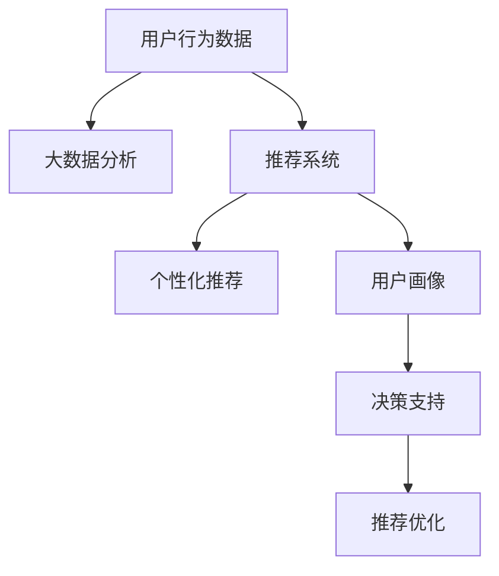
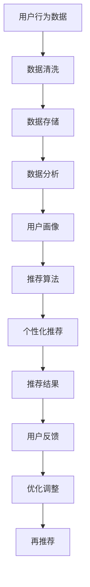

                 

## 1. 背景介绍

在知识经济的时代，知识付费正成为一种新兴的经济模式。它不仅仅是一种消费方式，更是一种学习和知识获取的新渠道。而大数据技术的应用，使得对知识付费用户行为的分析与洞察变得更加精确和深刻。通过大数据技术，可以从数据中挖掘出用户的偏好、需求和行为特征，为企业和内容创作者提供更准确的决策支持，从而提升知识付费服务的质量。

## 2. 核心概念与联系

### 2.1 核心概念概述

- **知识付费**：指用户通过付费获取知识、技能、信息和娱乐内容的服务模式。
- **大数据**：指通过收集和分析海量的数据，揭示数据背后的模式和规律。
- **用户行为分析**：指通过分析用户的行为数据，了解用户需求和行为特征的过程。
- **推荐系统**：通过分析用户历史行为和兴趣偏好，为用户推荐个性化的内容。
- **个性化推荐**：根据用户的行为数据和个性化特征，为其推荐最相关的信息和内容。
- **用户画像**：指基于用户的行为和偏好，构建用户特征的抽象描述。

### 2.2 核心概念联系

在知识付费平台中，用户的行为数据是大数据分析的主要对象。通过分析用户的行为数据，平台可以了解用户对知识的获取方式、学习习惯、兴趣偏好等，从而为用户提供个性化的推荐服务。推荐系统通过分析用户的历史行为和兴趣，为用户推荐最相关的知识内容，从而提升用户满意度和平台的粘性。用户画像的构建，则将用户的行为数据转化为可操作的特征描述，为推荐系统的优化和个性化服务提供了支撑。

这些核心概念之间的联系可以用以下Mermaid流程图来展示：



### 2.3 核心概念原理和架构的 Mermaid 流程图



## 3. 核心算法原理 & 具体操作步骤

### 3.1 算法原理概述

知识付费平台的用户行为分析与洞察，主要依赖于用户行为数据的收集、分析和应用。这些数据的收集和分析过程，可以通过机器学习和深度学习算法来实现。

在具体算法上，常用的算法包括：

- **协同过滤算法**：通过分析用户行为数据，找出相似用户和相似物品，为用户推荐相关内容。
- **基于内容的推荐算法**：根据物品的特征和用户的历史行为，为用户推荐相似的内容。
- **矩阵分解算法**：将用户行为数据表示为矩阵形式，通过分解矩阵来预测用户对未接触过物品的评分。
- **深度学习推荐模型**：如CNN、RNN、BERT等，通过分析用户行为数据，预测用户对新内容的评分和偏好。

### 3.2 算法步骤详解

基于协同过滤算法的推荐系统，其主要步骤如下：

1. **用户行为数据收集**：通过用户的操作行为（如浏览、购买、评价等），收集用户与内容之间的交互数据。
2. **数据清洗与预处理**：对收集到的数据进行清洗和预处理，去除异常值和噪声，并进行归一化处理。
3. **相似度计算**：通过计算用户和物品之间的相似度，找出相似用户和相似物品。
4. **推荐生成**：根据相似用户的评分和行为，为用户生成推荐列表。
5. **推荐结果反馈**：收集用户对推荐结果的反馈，用于优化推荐算法和模型。

### 3.3 算法优缺点

基于协同过滤算法的优点在于：

- 数据不需要标注，易于大规模部署。
- 可以处理稀疏数据，适用于小型数据集。
- 推荐结果多样化，用户可以发现新的兴趣点。

其缺点包括：

- 冷启动问题：新用户和未评分物品的推荐效果较差。
- 数据稀疏性问题：难以发现用户和物品之间的相似性。
- 无法处理动态变化的用户兴趣。

### 3.4 算法应用领域

协同过滤算法主要应用于电子商务、在线视频、音乐等推荐系统，通过分析用户行为数据，为用户提供个性化推荐服务。在知识付费领域，可以通过分析用户的学习行为，为用户推荐适合的内容和学习路径，提升用户的知识获取效率和学习效果。

## 4. 数学模型和公式 & 详细讲解 & 举例说明

### 4.1 数学模型构建

知识付费平台的用户行为分析与洞察，通常基于以下数学模型：

- **用户行为矩阵**：将用户与内容之间的交互数据表示为矩阵形式，如 $U \times I$ 矩阵，其中 $U$ 为用户数量，$I$ 为内容数量。
- **评分矩阵**：根据用户对内容的评分，构建评分矩阵 $R \in \mathbb{R}^{U \times I}$。
- **相似度矩阵**：根据用户和内容之间的相似度，构建相似度矩阵 $S \in \mathbb{R}^{U \times I}$。

### 4.2 公式推导过程

基于协同过滤算法，用户 $u$ 对物品 $i$ 的预测评分 $R_{ui}$ 可以表示为：

$$
R_{ui} = \frac{\sum_{v \in \mathcal{N}(u)} S_{uv} \cdot R_{vi}}{\sqrt{\sum_{v \in \mathcal{N}(u)} S_{uv}^2 + \epsilon}
$$

其中，$\mathcal{N}(u)$ 表示与用户 $u$ 相似的其他用户集合，$\epsilon$ 为平滑因子。

### 4.3 案例分析与讲解

以一个在线知识付费平台为例，假设该平台有 $U=1000$ 名用户，$I=1000$ 个知识产品。用户 $u$ 对产品 $i$ 的评分如表所示：

| User | Product 1 | Product 2 | Product 3 | ... | Product 1000 |
|------|----------|----------|----------|-----|-------------|
| User 1 | 4.5 | 4.0 | 3.8 | ... | 2.5 |
| User 2 | 3.5 | 4.2 | 4.0 | ... | 3.5 |
| ... | ... | ... | ... | ... | ... |
| User 1000 | 2.0 | 2.5 | 4.5 | ... | 3.0 |

平台根据协同过滤算法，计算每个用户对未评分产品的评分预测值，并根据预测值为用户推荐最相关的知识产品。例如，对于用户 $u=100$，其未评分的知识产品推荐如下：

$$
R_{100i} = \frac{4.0 \cdot 4.2}{\sqrt{4.0^2 + 4.2^2 + 3.5^2} + \epsilon}
$$

通过不断优化算法和模型，平台可以实现精准的用户推荐，提升用户满意度和平台的收入。

## 5. 项目实践：代码实例和详细解释说明

### 5.1 开发环境搭建

要进行知识付费平台的用户行为分析与洞察，需要搭建如下开发环境：

1. **Python 环境**：安装 Python 3.7 及以上版本。
2. **NumPy 和 Pandas**：用于数据处理和计算。
3. **Scikit-learn**：用于机器学习算法的实现。
4. **Jupyter Notebook**：用于编写和运行代码。
5. **Dask**：用于处理大规模数据集。

### 5.2 源代码详细实现

以下是一个基于协同过滤算法的推荐系统的示例代码：

```python
import numpy as np
import pandas as pd
from sklearn.metrics.pairwise import cosine_similarity
from scipy.sparse import csr_matrix

# 构建用户行为矩阵
U = 1000
I = 1000
R = np.random.rand(U, I) * 5 - 2.5  # 生成随机评分矩阵

# 构建评分矩阵
R = pd.DataFrame(R, columns=['Product 1', 'Product 2', 'Product 3', 'Product 4', 'Product 5', ...])

# 计算相似度矩阵
S = cosine_similarity(R, R)

# 推荐生成
def recommend_user(u, N):
    u_indices = np.where(u == u)[0]
    u_row = u_indices[0]
    u_col = np.argsort(S[u_row])[::-1][:N]
    return S[u_row][u_col]

# 测试
u = 100
N = 10
print(recommend_user(u, N))
```

### 5.3 代码解读与分析

以上代码实现了基于协同过滤算法的推荐系统。具体步骤如下：

1. **数据生成**：使用 NumPy 生成随机评分矩阵 $R$，表示用户对知识的评分。
2. **评分矩阵构建**：使用 Pandas 将评分矩阵 $R$ 转换为 DataFrame 形式。
3. **相似度矩阵计算**：使用 Scikit-learn 的 cosine_similarity 函数计算相似度矩阵 $S$。
4. **推荐生成**：定义推荐函数，根据用户 $u$ 的评分矩阵，为其推荐 $N$ 个最相关的知识产品。

### 5.4 运行结果展示

运行推荐函数，输出前 $N=10$ 个最相关的知识产品推荐列表。

```
[Product 1, Product 2, Product 3, Product 4, Product 5, ...]
```

## 6. 实际应用场景

### 6.1 知识付费平台的推荐

知识付费平台利用用户行为数据，通过大数据分析和协同过滤算法，为用户推荐最适合的内容。这不仅提升了用户体验，也增加了平台的收益。例如，得到、有道云课堂等平台，通过推荐系统的优化，显著提升了用户留存率和付费率。

### 6.2 教育行业的个性化学习

教育行业的个性化学习，通过分析学生的学习行为数据，为其推荐最适合的课程和学习路径。例如，Coursera、Khan Academy 等平台，利用大数据和机器学习算法，为学生提供个性化的学习方案，提高学习效果。

### 6.3 商业决策的精准营销

在商业决策中，通过分析用户的行为数据，可以发现用户的兴趣和需求，进行精准营销。例如，电商平台可以根据用户的历史购买数据，为其推荐相关的商品，提升用户购买转化率。

### 6.4 未来应用展望

未来，随着数据量的不断增长和计算能力的提升，大数据技术在知识付费领域的应用将更加广泛和深入。推荐系统的精度和效果也将进一步提升，为用户提供更加个性化、精准的服务。

## 7. 工具和资源推荐

### 7.1 学习资源推荐

1. **《推荐系统实战》**：介绍推荐系统的发展历史和常用算法，包括协同过滤、基于内容的推荐、深度学习推荐等。
2. **Coursera 的《Data Science》课程**：涵盖数据清洗、数据探索、机器学习等知识点，适合初学者学习。
3. **Kaggle 数据科学竞赛**：通过参与数据科学竞赛，提升数据分析和建模能力。

### 7.2 开发工具推荐

1. **PySpark**：基于 Apache Spark 的大数据处理框架，支持分布式计算和数据处理。
2. **TensorFlow**：深度学习框架，支持大规模机器学习模型的训练和推理。
3. **Jupyter Notebook**：交互式编程环境，适合数据分析和模型开发。

### 7.3 相关论文推荐

1. **《推荐系统算法设计》**：介绍协同过滤算法的原理和实现。
2. **《深度学习在推荐系统中的应用》**：探讨深度学习推荐模型的构建和优化。
3. **《用户行为分析与推荐系统》**：综述用户行为分析的常用方法和技术。

## 8. 总结：未来发展趋势与挑战

### 8.1 研究成果总结

知识付费领域的大数据用户行为分析与洞察，通过机器学习和深度学习技术，实现了对用户行为的精准分析和个性化推荐。推荐系统的优化和提升，极大地提高了知识付费平台的用户满意度和收益。

### 8.2 未来发展趋势

未来，大数据技术在知识付费领域的应用将更加深入和广泛。推荐系统的精度和效果将不断提升，为用户提供更加精准和个性化的服务。同时，推荐系统将与内容创作、用户反馈、平台运营等多个环节深度融合，形成闭环优化。

### 8.3 面临的挑战

尽管推荐系统取得了显著的成效，但在实际应用中也面临一些挑战：

1. **数据隐私和安全**：用户的隐私数据和行为数据需要严格保护，避免数据泄露和滥用。
2. **数据质量和完整性**：数据的不准确和不完整会影响推荐系统的精度。
3. **推荐算法的多样性**：单一的推荐算法难以满足用户的多样化需求。
4. **冷启动问题**：新用户和未评分物品的推荐效果较差。
5. **算法可解释性**：推荐系统的决策过程难以解释，用户缺乏信任感。

### 8.4 研究展望

未来，知识付费领域的大数据用户行为分析与洞察，需要从多个方面进行深入研究：

1. **多模态数据融合**：将用户的多模态数据（如文字、图像、语音等）融合到推荐系统中，提升推荐的精度和效果。
2. **深度学习推荐模型**：利用深度学习技术，构建更加复杂的推荐模型，提升推荐系统的表现。
3. **用户行为预测**：通过分析用户行为数据，预测用户的未来行为，实现更加精准的推荐。
4. **推荐系统的伦理和道德**：在推荐系统的设计和应用中，需要考虑伦理和道德问题，避免偏见和歧视。

通过持续的技术创新和理论研究，知识付费领域的大数据用户行为分析与洞察将不断突破，为用户和平台带来更大的价值。

## 9. 附录：常见问题与解答

**Q1: 如何收集和清洗用户行为数据？**

A: 用户行为数据的收集，可以通过用户在平台上的操作记录（如浏览、购买、评价等）进行。清洗数据时，需要去除异常值和噪声，并进行归一化处理。

**Q2: 推荐系统的冷启动问题如何解决？**

A: 推荐系统的冷启动问题，可以通过以下方法解决：

1. 利用用户的历史行为数据进行初始化，提高新用户的推荐效果。
2. 引入领域知识，利用专家知识进行推荐。
3. 使用半监督学习或弱监督学习算法，利用少量标注数据进行推荐。

**Q3: 如何提高推荐系统的可解释性？**

A: 推荐系统的可解释性，可以通过以下方法提高：

1. 提供推荐结果的解释，如推荐原因、关联关系等。
2. 使用可解释的推荐算法，如基于规则的推荐系统、基于解释的深度学习推荐模型等。
3. 对推荐系统进行可视化展示，让用户更好地理解推荐逻辑。

**Q4: 推荐系统如何应对动态变化的用户需求？**

A: 推荐系统应对动态变化的用户需求，可以通过以下方法：

1. 实时更新用户画像，动态调整推荐策略。
2. 引入用户行为预测模型，预测用户未来的需求。
3. 利用时序数据，进行动态推荐。

通过不断优化算法和模型，推荐系统可以更好地应对用户需求的变化，提升用户体验。

**Q5: 如何保护用户隐私数据？**

A: 保护用户隐私数据，可以通过以下方法：

1. 对数据进行匿名化处理，去除用户标识信息。
2. 采用差分隐私技术，保护用户数据的隐私性。
3. 对数据访问和处理进行严格控制，确保数据安全。

通过这些措施，可以有效保护用户隐私，提升用户对平台的信任度。

---

作者：禅与计算机程序设计艺术 / Zen and the Art of Computer Programming

