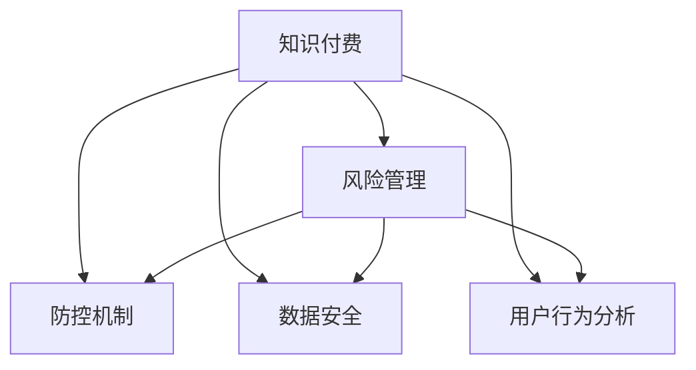

                 

# 知识经济下知识付费的风险管理与防控

> 关键词：知识付费,风险管理,防控,知识经济,互联网,数字经济

## 1. 背景介绍

### 1.1 问题由来

随着互联网和数字经济的飞速发展，知识付费逐渐成为一种重要的商业模式，受到越来越多用户的青睐。知识付费平台通过向用户提供高价值知识内容，实现货币化变现，形成了知识生产、传播和消费的良性生态系统。

然而，知识付费行业也面临着诸多风险挑战。包括但不限于内容质量参差不齐、盗版侵权频发、用户信任度低、市场竞争激烈等问题。这些问题不仅威胁到平台自身的生存和发展，也阻碍了整个知识经济的健康成长。

面对这些风险挑战，平台需要建立完善的风险管理体系，及时防范和应对潜在风险，以确保业务的稳定运行和可持续发展。

### 1.2 问题核心关键点

要建立完善的风险管理体系，首先需要明确知识付费平台面临的主要风险类型，并掌握相应的风险管理工具和方法。

具体来说，知识付费平台面临的主要风险包括：
- **市场风险**：竞争加剧、用户需求变化、行业政策变动等外部因素导致的运营不确定性。
- **技术风险**：平台基础设施、技术架构、数据安全等技术问题引发的运营风险。
- **内容风险**：内容侵权、版权纠纷、假冒伪劣内容等涉及知识产权和产品质量的内部风险。
- **用户风险**：用户欺诈、恶意行为、投诉维权等影响用户体验和平台声誉的行为风险。

针对这些风险，平台可以采取相应的风险管理措施，包括但不限于：
- **风险识别和评估**：通过定量和定性分析，评估不同风险的发生概率和影响程度。
- **风险控制和应对**：采取技术手段和业务措施，降低风险发生概率和减轻风险影响。
- **风险监测和预警**：建立实时监控系统，及时发现和预警潜在风险。
- **风险报告和改进**：定期发布风险报告，总结经验教训，不断优化风险管理流程。

## 2. 核心概念与联系

### 2.1 核心概念概述

为了系统性地进行风险管理与防控，本文介绍了几个关键概念及其相互关系：

- **知识付费**：指用户通过付费方式获取高质量知识内容的行为，涉及知识生产和消费的商业模式。
- **风险管理**：指识别、评估、控制和应对可能对业务产生负面影响的各类风险。
- **防控机制**：指通过技术、业务和管理手段，降低风险发生的概率和影响。
- **数据安全**：指保护知识内容、用户隐私、平台数据等敏感信息的安全。
- **用户行为分析**：指通过数据分析和行为建模，理解用户需求和行为，优化用户体验和平台运营。

这些概念通过以下Mermaid流程图进行展示：



## 3. 核心算法原理 & 具体操作步骤

### 3.1 算法原理概述

知识付费平台的风险管理与防控，本质上是一个风险识别、评估、控制和应对的动态过程。其核心思想是通过系统化的风险评估方法，结合技术和管理手段，持续优化风险管理策略，以应对各类潜在的风险。

形式化地，假设知识付费平台的风险集为 $R=\{R_1, R_2, \cdots, R_n\}$，其中 $R_i$ 表示第 $i$ 个风险。设 $P(R_i)$ 为风险 $R_i$ 的发生概率，$I(R_i)$ 为风险 $R_i$ 的影响程度。则风险的总体影响 $V$ 为：

$$
V = \sum_{i=1}^{n} P(R_i) \times I(R_i)
$$

风险管理的目标是最小化总体风险 $V$，即：

$$
\mathop{\min}_{P(R_i)} V
$$

在实际应用中，通常采用定量和定性相结合的方法，综合考虑风险的发生概率、影响程度、可控性等指标，制定相应的风险管理策略。

### 3.2 算法步骤详解

知识付费平台的风险管理与防控可以分为以下五个步骤：

**Step 1: 风险识别**

风险识别是风险管理的首要环节，主要通过内部评估和外部监控，识别潜在风险和已发生风险。

1. **内部评估**：平台内部可以通过定期审计、风险自查等方式，评估内部操作流程、技术架构、数据安全等方面存在的问题。
2. **外部监控**：通过行业报告、市场分析、用户投诉等方式，监控外部环境变化和市场趋势，识别潜在风险。

**Step 2: 风险评估**

风险评估是风险管理的关键环节，主要通过量化方法，评估不同风险的影响程度和发生概率。

1. **风险矩阵**：将风险的发生概率和影响程度映射到二维矩阵中，评估风险等级。
2. **定量分析**：利用历史数据和统计分析，量化风险的发生概率和影响程度。
3. **专家评估**：邀请行业专家，通过经验判断，对风险进行定性评估。

**Step 3: 风险控制**

风险控制是风险管理的核心环节，主要通过技术和管理手段，降低风险发生概率和减轻风险影响。

1. **技术手段**：如数据加密、安全认证、容灾备份等技术措施。
2. **管理措施**：如建立流程规范、加强员工培训、优化客户服务流程等。

**Step 4: 风险应对**

风险应对是风险管理的重要环节，主要通过应急预案和业务调整，应对已发生风险。

1. **应急预案**：制定应急预案，明确各环节的应急响应措施。
2. **业务调整**：根据风险影响，调整业务策略，减少风险影响。

**Step 5: 风险监测和预警**

风险监测和预警是风险管理的持续环节，主要通过实时监控和预警系统，及时发现和预警潜在风险。

1. **实时监控**：建立实时监控系统，持续监控风险事件。
2. **预警系统**：通过预警系统，及时发现潜在风险并发出预警。

### 3.3 算法优缺点

知识付费平台的风险管理与防控方法具有以下优点：
1. **系统性**：通过系统化的风险管理流程，确保风险管理的全面性和持续性。
2. **量化性**：通过定量和定性相结合的评估方法，对风险进行量化和优先级排序。
3. **技术性**：结合技术手段和管理措施，降低风险发生概率和减轻风险影响。
4. **及时性**：通过实时监控和预警系统，及时发现和应对风险事件。

同时，该方法也存在一定的局限性：
1. **数据依赖**：风险评估和控制需要大量数据支持，数据质量直接影响评估结果。
2. **复杂性**：风险管理流程涉及多个环节，复杂度较高。
3. **动态性**：风险环境变化快，需要持续优化风险管理策略。

尽管存在这些局限性，但就目前而言，这种系统化的风险管理方法仍然是知识付费平台风险管理的最佳实践。未来相关研究的重点在于如何进一步降低数据依赖，提高风险管理流程的自动化和智能化，以应对更加复杂多变的环境。

### 3.4 算法应用领域

知识付费平台的风险管理与防控方法广泛应用于互联网和数字经济领域的各个方面，包括但不限于：

- **知识付费平台**：如Coursera、Udemy、得到等平台，通过风险管理确保内容质量和用户体验。
- **在线教育**：如Khan Academy、TED-Ed等，通过风险管理优化教学内容和平台运营。
- **数字出版**：如Amazon Kindle、Apple Books等，通过风险管理保护版权和用户隐私。
- **内容创作者**：如Youtube、Bilibili等，通过风险管理保障内容质量和创作者权益。

这些领域通过应用风险管理与防控方法，有效应对了各类风险挑战，提升了业务运行的稳定性和用户满意度。

## 4. 数学模型和公式 & 详细讲解  
### 4.1 数学模型构建

本节将使用数学语言对知识付费平台的风险管理与防控过程进行更加严格的刻画。

记知识付费平台的风险集为 $R=\{R_1, R_2, \cdots, R_n\}$，其中 $R_i$ 表示第 $i$ 个风险。设 $P(R_i)$ 为风险 $R_i$ 的发生概率，$I(R_i)$ 为风险 $R_i$ 的影响程度。则风险的总体影响 $V$ 为：

$$
V = \sum_{i=1}^{n} P(R_i) \times I(R_i)
$$

平台的风险管理目标是最小化总体风险 $V$，即：

$$
\mathop{\min}_{P(R_i)} V
$$

在实际应用中，通常采用定量和定性相结合的方法，综合考虑风险的发生概率、影响程度、可控性等指标，制定相应的风险管理策略。

### 4.2 公式推导过程

以下我们以知识付费平台的用户欺诈风险为例，推导相应的数学模型。

假设用户欺诈事件的概率为 $P$，欺诈事件的影响程度为 $I$，则欺诈风险的总体影响为：

$$
V = P \times I
$$

根据历史数据分析，平台每年收到用户投诉的事件数量为 $N$，其中被确认为欺诈的事件数量为 $F$，则欺诈事件的发生概率为：

$$
P = \frac{F}{N}
$$

设欺诈事件的影响程度 $I$ 为系统损失金额，则：

$$
V = \frac{F}{N} \times I
$$

利用上述公式，平台可以量化欺诈风险的总体影响，并根据数据动态调整欺诈风险管理策略。

## 5. 项目实践：代码实例和详细解释说明
### 5.1 开发环境搭建

在进行风险管理与防控项目实践前，我们需要准备好开发环境。以下是使用Python进行项目开发的环境配置流程：

1. 安装Anaconda：从官网下载并安装Anaconda，用于创建独立的Python环境。

2. 创建并激活虚拟环境：
```bash
conda create -n risk-env python=3.8 
conda activate risk-env
```

3. 安装相关库：
```bash
conda install pandas numpy matplotlib jupyter notebook scikit-learn
```

完成上述步骤后，即可在`risk-env`环境中开始风险管理与防控项目实践。

### 5.2 源代码详细实现

下面我们以知识付费平台的用户欺诈风险管理为例，给出完整的代码实现。

```python
import pandas as pd
from sklearn.linear_model import LogisticRegression

# 准备数据集
data = pd.read_csv('fraud_data.csv')

# 数据预处理
features = ['user_id', 'transaction_amount', 'transaction_time', 'location']
labels = 'fraud_label'
X = data[features]
y = data[labels]

# 划分训练集和测试集
X_train, X_test, y_train, y_test = train_test_split(X, y, test_size=0.2, random_state=42)

# 训练逻辑回归模型
model = LogisticRegression()
model.fit(X_train, y_train)

# 评估模型性能
accuracy = model.score(X_test, y_test)
print(f"Model accuracy: {accuracy:.2f}")
```

### 5.3 代码解读与分析

让我们再详细解读一下关键代码的实现细节：

**数据准备**：
- 使用Pandas库读取用户欺诈数据集，并提取特征和标签。

**数据预处理**：
- 选择用户ID、交易金额、交易时间、地理位置作为特征，构建训练集和测试集。
- 划分数据集的比例为训练集占80%，测试集占20%，以保证模型泛化能力。

**模型训练**：
- 使用逻辑回归模型进行训练，利用训练集数据拟合模型参数。
- 通过模型评估函数，计算测试集上的准确率，评估模型性能。

**结果输出**：
- 输出模型在测试集上的准确率，以便后续进行模型调优和风险评估。

## 6. 实际应用场景
### 6.1 智能客服系统

知识付费平台通过智能客服系统，为用户提供24小时在线服务，帮助用户解决问题，提升用户体验。然而，智能客服系统也面临着欺诈风险和用户投诉等挑战。

在技术实现上，平台可以收集用户的历史行为数据，构建用户画像，并通过机器学习模型识别潜在欺诈行为。对于可疑行为，系统可以自动报警，由人工进行进一步核实，减少欺诈事件的发生。

### 6.2 内容审核系统

内容审核系统是知识付费平台的重要组成部分，通过自动审核用户上传的内容，确保内容质量和安全。然而，系统也面临大量误判和漏判的风险，影响用户体验。

在技术实现上，平台可以引入人工智能和自然语言处理技术，构建智能内容审核系统。通过训练多模态模型，结合文本、图片、语音等多种信息，提升内容审核的准确性和效率。

### 6.3 用户行为监测

用户行为监测系统是知识付费平台的重要工具，通过监测用户行为数据，发现异常行为和潜在欺诈风险。然而，系统也面临数据量大、实时性要求高等挑战。

在技术实现上，平台可以采用大数据和流计算技术，构建实时用户行为监测系统。通过分布式计算和流式处理，实时分析和识别用户行为中的异常点，及时发出预警，保障平台安全和用户利益。

### 6.4 未来应用展望

随着人工智能技术的不断进步，知识付费平台的风险管理与防控技术将进一步发展。

在智慧客服方面，平台将引入自然语言生成和知识图谱技术，构建更加智能的客服系统，提升用户体验和欺诈防范能力。

在内容审核方面，平台将引入多模态信息融合和深度学习技术，提升内容审核的准确性和效率。

在用户行为监测方面，平台将引入实时流计算和大数据技术，提升系统实时性和数据处理能力。

未来，知识付费平台的风险管理与防控将更加智能化、自动化，为平台提供更加可靠和安全的运营保障。

## 7. 工具和资源推荐
### 7.1 学习资源推荐

为了帮助开发者系统掌握知识付费平台的风险管理与防控技术，这里推荐一些优质的学习资源：

1. **《Python数据科学手册》**：由Stefanie Molin所著，全面介绍了Python在数据科学和机器学习中的应用，包括数据预处理、模型训练、风险评估等。

2. **Coursera《数据科学与机器学习》课程**：由Johns Hopkins University开设的在线课程，系统讲解了数据科学和机器学习的基本概念和技术。

3. **Kaggle数据科学竞赛**：Kaggle是世界上最大的数据科学竞赛平台，提供大量的数据集和竞赛机会，帮助你提升数据科学和机器学习的实战能力。

4. **GitHub开源项目**：GitHub上有大量的开源项目和代码库，可以通过阅读和复现这些项目，学习数据科学和机器学习的最佳实践。

通过对这些资源的学习实践，相信你一定能够快速掌握知识付费平台的风险管理与防控技术，并用于解决实际的风险问题。

### 7.2 开发工具推荐

高效的开发离不开优秀的工具支持。以下是几款用于知识付费平台风险管理与防控开发的常用工具：

1. **Jupyter Notebook**：一个开源的交互式计算环境，支持Python、R等多种编程语言，便于数据分析和模型训练。

2. **TensorFlow**：由Google主导开发的深度学习框架，灵活的计算图和高效的分布式计算能力，适合大规模模型训练。

3. **Scikit-learn**：一个Python科学计算库，包含大量的机器学习算法和工具，支持模型评估和特征工程。

4. **Pandas**：一个数据处理库，提供丰富的数据操作和分析功能，便于数据清洗和预处理。

5. **Matplotlib**：一个Python数据可视化库，支持绘制各种类型的图表，便于数据展示和分析。

6. **Seaborn**：一个基于Matplotlib的数据可视化库，提供更高级的统计图表和美观的样式，方便数据展示和分析。

合理利用这些工具，可以显著提升知识付费平台的风险管理与防控任务的开发效率，加快创新迭代的步伐。

### 7.3 相关论文推荐

知识付费平台的风险管理与防控技术的发展源于学界的持续研究。以下是几篇奠基性的相关论文，推荐阅读：

1. **《深度学习》**：Ian Goodfellow所著，全面介绍了深度学习的原理和应用，包括神经网络、卷积神经网络、循环神经网络等。

2. **《机器学习实战》**：Peter Harrington所著，通过大量实例，介绍了机器学习的基本概念和技术，包括分类、回归、聚类等。

3. **《数据挖掘与统计学习》**：Gareth James等所著，系统讲解了数据挖掘和统计学习的基本方法，包括特征工程、模型评估、风险管理等。

4. **《知识图谱》**：Vladimir Bulgakov等所著，介绍了知识图谱的构建和应用，包括实体识别、关系抽取、知识推理等。

5. **《智能客服系统》**：王斌所著，系统讲解了智能客服系统的设计和实现，包括自然语言处理、机器学习、用户行为分析等。

这些论文代表了大语言模型微调技术的发展脉络。通过学习这些前沿成果，可以帮助研究者把握学科前进方向，激发更多的创新灵感。

## 8. 总结：未来发展趋势与挑战

### 8.1 总结

本文对知识付费平台的风险管理与防控方法进行了全面系统的介绍。首先阐述了知识付费平台面临的主要风险类型，明确了风险管理的核心目标和方法。其次，从原理到实践，详细讲解了风险管理的数学模型和关键步骤，给出了风险管理任务开发的完整代码实例。同时，本文还广泛探讨了风险管理技术在知识付费平台的实际应用场景，展示了风险管理范式的巨大潜力。此外，本文精选了风险管理技术的各类学习资源，力求为读者提供全方位的技术指引。

通过本文的系统梳理，可以看到，知识付费平台的风险管理与防控技术正在成为平台运营的重要保障。通过合理应用风险管理方法，可以有效降低平台运营风险，提升用户体验，确保平台健康成长。

### 8.2 未来发展趋势

展望未来，知识付费平台的风险管理与防控技术将呈现以下几个发展趋势：

1. **智能化**：引入人工智能和自然语言处理技术，构建更加智能的风险管理与防控系统。
2. **自动化**：利用大数据和流计算技术，实现实时化和自动化的风险监测和预警。
3. **数据化**：引入更多的数据和多样化的数据来源，提升风险管理的准确性和全面性。
4. **多样化**：结合不同的风险管理手段和策略，形成多层次、多维度的风险管理体系。
5. **个性化**：根据用户行为和需求，实现更加个性化的风险管理和防控。

这些趋势凸显了知识付费平台风险管理技术的广阔前景。通过不断创新和优化，未来的风险管理技术将更加高效、全面、智能，为知识付费平台提供更可靠的保障。

### 8.3 面临的挑战

尽管知识付费平台的风险管理与防控技术已经取得了一定的进展，但在迈向更加智能化、普适化应用的过程中，仍面临着诸多挑战：

1. **数据质量和获取难度**：高质量数据对于风险管理至关重要，然而数据获取难度大、数据质量参差不齐，仍然是一大难题。
2. **算法复杂性**：风险管理涉及多种算法和模型，算法复杂性高，模型的可解释性差。
3. **实时性要求高**：平台需要实时监测和预警潜在风险，对实时性要求高。
4. **业务影响大**：风险管理直接影响到用户体验和平台运营，业务影响大。
5. **技术依赖性强**：风险管理技术需要依赖于大数据、人工智能等先进技术，技术门槛高。

正视风险管理面临的这些挑战，积极应对并寻求突破，将是大数据、人工智能技术走向成熟的重要方向。

### 8.4 研究展望

面对知识付费平台风险管理所面临的种种挑战，未来的研究需要在以下几个方面寻求新的突破：

1. **多源数据融合**：引入更多来源的数据，提升数据的质量和覆盖范围。
2. **模型集成与优化**：结合不同的模型和算法，提升风险管理的全面性和准确性。
3. **实时流处理**：引入实时流处理技术，实现高效、实时的风险监测和预警。
4. **隐私保护**：引入隐私保护技术，保护用户数据安全和隐私。
5. **可解释性增强**：提升模型的可解释性，增强用户信任。

这些研究方向将推动知识付费平台的风险管理技术不断进步，为平台提供更加可靠和安全的运营保障。

## 9. 附录：常见问题与解答

**Q1：如何构建高质量的数据集？**

A: 构建高质量的数据集需要遵循以下步骤：

1. **数据收集**：从多个渠道收集数据，包括用户行为数据、交易数据、投诉数据等。
2. **数据清洗**：去除噪声数据、异常数据和重复数据，保证数据质量。
3. **数据标注**：对数据进行标注，标注方式包括手动标注和自动化标注。
4. **数据划分**：将数据划分为训练集、验证集和测试集，保证模型在实际应用中的泛化能力。

**Q2：如何选择合适的风险评估方法？**

A: 选择合适的风险评估方法需要综合考虑数据特点和业务需求。

1. **定量分析**：利用历史数据和统计分析，量化风险的发生概率和影响程度。
2. **定性评估**：邀请行业专家，通过经验判断，对风险进行定性评估。
3. **综合评估**：结合定量分析和定性评估，综合考虑风险的各个方面。

**Q3：如何进行用户欺诈风险预警？**

A: 进行用户欺诈风险预警需要构建实时监控系统，并设计预警算法。

1. **实时监控**：建立实时监控系统，持续监控用户行为数据。
2. **预警算法**：设计预警算法，识别可疑行为并发出预警信号。
3. **人工干预**：结合人工审核，对预警信号进行进一步核实，避免误判和漏判。

**Q4：如何优化模型性能？**

A: 优化模型性能需要从多个方面进行改进：

1. **数据质量**：保证数据质量，避免数据噪声和异常值影响模型性能。
2. **模型选择**：选择适合的模型和算法，提升模型的准确性和泛化能力。
3. **超参数调优**：通过网格搜索、贝叶斯优化等方法，优化模型的超参数。
4. **模型集成**：结合多个模型的预测结果，提升模型的综合性能。

**Q5：如何进行模型可解释性分析？**

A: 进行模型可解释性分析需要结合多种工具和方法。

1. **可视化工具**：利用可视化工具，展示模型的特征重要性、决策边界等。
2. **特征工程**：通过特征工程，提升模型的可解释性和可理解性。
3. **模型评估**：结合模型评估指标，评估模型的泛化能力和可解释性。

这些解答帮助读者解决实际的风险管理问题，提供了详细的技术指引。通过不断学习和实践，相信你一定能够掌握知识付费平台的风险管理与防控技术，为平台运营提供强有力的保障。

---

作者：禅与计算机程序设计艺术 / Zen and the Art of Computer Programming

