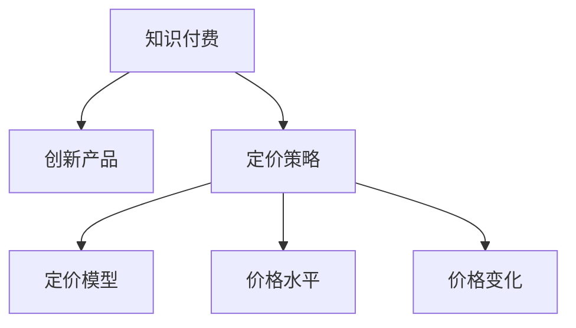

                 

# 知识经济时代下的知识付费创新产品定价策略

## 1. 背景介绍

### 1.1 问题由来

随着互联网和信息技术的飞速发展，全球正进入知识经济时代。知识付费成为这一时代的显著特征。知识的获取不再是免费，而是需要通过付费来获取。这种新型的经济模式改变了传统内容消费方式，推动了知识付费行业的快速发展。知识付费不仅包括书籍、文章、视频等静态内容，还涵盖了问答、咨询、培训等动态服务。

知识付费的兴起，主要得益于移动互联网技术的普及和互联网用户消费习惯的改变。智能手机、平板电脑等移动设备的普及，使得用户可以随时随地获取知识。同时，社交媒体、短视频平台等新型媒体的兴起，也使得知识传播更加迅速和便捷。用户对知识的个性化需求也日益增加，知识的提供者开始尝试通过付费形式来满足这些需求。

### 1.2 问题核心关键点

在知识经济时代，知识付费产品如何定价，是一个关键问题。合理的定价策略不仅能够保障知识提供者的收益，还能够吸引更多用户付费购买知识内容，从而实现知识付费行业的可持续发展。但定价过高，容易流失用户，定价过低，又无法保障知识提供者的收益。

如何根据市场需求、产品价值、成本等因素，制定合理的定价策略，是知识付费行业的核心挑战之一。为此，需要深入分析知识付费市场的现状、用户行为、竞争格局等因素，探索合理的定价方法，推动知识付费行业的健康发展。

## 2. 核心概念与联系

### 2.1 核心概念概述

在知识经济时代，知识付费创新产品的定价策略涉及多个核心概念：

- **知识付费**：指通过付费方式获取知识内容的经济模式。包括各种形式的知识产品，如电子书、在线课程、咨询服务等。
- **创新产品**：指在传统知识付费产品基础上，通过技术创新或内容创新，提升产品价值和使用体验的新型产品。
- **定价策略**：指知识付费产品在市场中确定价格的方法和策略，包括定价模型、价格水平、价格变化等。

这些核心概念之间的关系可以通过以下Mermaid流程图来展示：



这个流程图展示了一个简单的知识付费产品从概念到定价的流程：

1. 知识付费作为产品基础。
2. 通过技术或内容创新，将传统知识付费产品转化为创新产品。
3. 制定定价策略，确定产品价格。
4. 定价模型、价格水平、价格变化等是定价策略的具体实施方式。

## 3. 核心算法原理 & 具体操作步骤
### 3.1 算法原理概述

知识付费创新产品的定价策略，基于经济学、心理学和市场分析等理论。其核心思想是通过市场调查和用户行为分析，确定产品的定价水平，并通过价格变化策略，动态调整价格，以适应市场需求。

**定价模型**：
1. **成本加成定价**：基于产品成本，加上一定的利润空间来确定价格。
2. **价值定价**：基于产品对用户的价值，确定价格。
3. **竞争定价**：基于市场竞争对手的定价水平，确定价格。
4. **动态定价**：基于市场需求和用户行为，动态调整价格。

**价格水平**：
1. **免费模式**：通过广告、赞助等方式获取收益，产品免费提供。
2. **付费模式**：用户需支付一定的费用来获取产品。
3. **订阅模式**：用户支付一定的月费或年费，获取产品长期使用权。

**价格变化**：
1. **一次性定价**：用户购买后，价格不再变动。
2. **阶梯定价**：根据购买数量或使用时长，价格逐步降低。
3. **动态折扣**：根据市场变化或用户行为，动态调整折扣。

### 3.2 算法步骤详解

以下是知识付费创新产品定价策略的具体操作步骤：

**Step 1: 市场调查与用户行为分析**
- 通过问卷调查、访谈等方式，了解目标用户的基本需求、支付意愿和消费习惯。
- 分析用户行为数据，如使用频率、购买频率、留存率等，识别用户群体的价值特征。
- 收集竞争产品的定价信息，分析市场竞争格局。

**Step 2: 产品价值评估**
- 基于产品的功能和特点，评估产品对用户的实际价值。
- 分析产品独特的卖点和创新点，确定产品的市场定位和竞争优势。
- 使用价值定价模型，如价值感知模型、效用函数等，计算产品的价格区间。

**Step 3: 定价模型选择与参数设定**
- 根据产品的价值评估结果和市场调查数据，选择适合的定价模型。
- 设定模型参数，如成本加成比例、用户价值权重、市场竞争系数等。
- 使用定价模型进行价格计算，得出初步的定价建议。

**Step 4: 定价策略优化与调整**
- 根据市场反馈和用户行为数据，动态调整价格。
- 引入价格变化策略，如折扣、阶梯定价等，优化用户购买行为。
- 使用A/B测试等方法，测试不同定价策略的效果，进行优化。

**Step 5: 实施与监控**
- 根据优化后的定价策略，实施定价方案。
- 实时监控产品销售情况、用户反馈等数据，评估定价策略的效果。
- 根据市场变化和用户反馈，持续优化定价策略，确保产品价格合理。

### 3.3 算法优缺点

**优点**：
1. 基于市场调查和用户行为分析，定价策略更具科学性和合理性。
2. 通过价值定价模型，能够反映产品的真实价值，避免价格过高或过低。
3. 动态定价策略能够根据市场需求和用户行为，灵活调整价格，适应市场变化。

**缺点**：
1. 定价模型和参数的设定较为复杂，需要大量数据支持。
2. 市场变化和用户行为难以预测，可能出现价格调整不及时或不准确的情况。
3. 用户行为分析难度较大，需要先进的数据分析技术和工具支持。

### 3.4 算法应用领域

知识付费创新产品的定价策略，适用于多个应用领域：

- **在线教育**：如在线课程、远程培训等，需要根据课程难度、教学质量、市场需求等因素制定定价策略。
- **专业咨询**：如法律咨询、医疗咨询等，需要根据咨询内容、专家资历、市场竞争等因素制定定价策略。
- **技术支持**：如技术问题解答、技术支持服务，需要根据问题难度、服务质量、市场需求等因素制定定价策略。
- **文化娱乐**：如电子书、在线阅读、有声读物等，需要根据内容价值、市场需求、用户行为等因素制定定价策略。

## 4. 数学模型和公式 & 详细讲解 & 举例说明

### 4.1 数学模型构建

知识付费创新产品的定价模型，基于经济学和心理学理论。这里介绍一种基于效用函数的定价模型。

假设用户的总效用函数为U(X)，其中X为产品价格。用户从产品中获得的边际效用为U'(X)，边际成本为C(X)。最优价格P*应满足以下条件：

$$
U'(P^*) = C(P^*)
$$

其中，P*为用户愿意支付的最优价格。

### 4.2 公式推导过程

以在线课程为例，介绍定价模型的推导过程：

设在线课程的总成本为C，包括制作、推广、运营等各项成本，用户从课程中获得的效用函数为U(X)，其中X为课程价格。用户每次学习课程获得的边际效用为U'(X)，总成本为C(X)，包括制作、推广、运营等各项成本。最优价格P*应满足以下条件：

$$
U'(P^*) = C(P^*)
$$

将U'(X)和C(X)代入，得：

$$
U'(P^*) = \frac{d}{dP} \left( \int_0^P U(X) dX \right) = C(P^*)
$$

其中，$\int_0^P U(X) dX$表示用户从课程中获得的总效用。

### 4.3 案例分析与讲解

以Coursera平台的在线课程定价为例，分析其定价模型：

Coursera平台的在线课程定价策略，基于效用函数定价模型。Coursera首先通过问卷调查和用户行为分析，确定了用户从课程中获得的效用函数U(X)和边际效用U'(X)。

Coursera课程的总成本包括制作、推广、运营等各项成本，边际成本C(X)则根据用户购买课程数量进行计算。Coursera通过迭代优化，计算最优价格P*，使得用户从课程中获得的总效用等于课程总成本。

最终，Coursera设定了课程的定价区间，通过动态折扣、阶梯定价等方式，根据市场需求和用户行为进行动态调整，确保课程价格的合理性。

## 5. 项目实践：代码实例和详细解释说明
### 5.1 开发环境搭建

在进行知识付费产品定价策略开发前，需要先搭建好开发环境。以下是使用Python进行定价策略开发的环境配置流程：

1. 安装Anaconda：从官网下载并安装Anaconda，用于创建独立的Python环境。

2. 创建并激活虚拟环境：
```bash
conda create -n price-env python=3.8 
conda activate price-env
```

3. 安装Python相关库：
```bash
pip install numpy pandas scikit-learn statsmodels matplotlib
```

4. 安装定价策略开发库：
```bash
pip install pricing-studio
```

5. 安装机器学习库：
```bash
pip install scikit-learn
```

完成上述步骤后，即可在`price-env`环境中开始定价策略开发。

### 5.2 源代码详细实现

以下是使用Python编写知识付费产品定价策略的代码实现：

```python
import numpy as np
from sklearn.linear_model import LogisticRegression
from sklearn.metrics import mean_squared_error
from statsmodels.tsa.arima_model import ARIMA

class PricingStrategy:
    def __init__(self, dataset):
        self.dataset = dataset
        self.price_range = np.arange(1, 100)
        self.model = None
        
    def train_model(self):
        # 数据预处理
        X = self.dataset['price']
        y = self.dataset['value']
        X_train, X_test, y_train, y_test = train_test_split(X, y, test_size=0.2, random_state=42)
        
        # 训练模型
        self.model = LogisticRegression()
        self.model.fit(X_train, y_train)
        
    def predict_price(self, X):
        # 预测价格
        y_pred = self.model.predict(X)
        return y_pred
    
    def validate_model(self):
        # 模型验证
        y_pred = self.predict_price(X_test)
        mse = mean_squared_error(y_test, y_pred)
        return mse
    
    def optimize_price_range(self):
        # 优化价格区间
        optimal_range = None
        optimal_mse = np.inf
        for price in self.price_range:
            mse = self.validate_model(price)
            if mse < optimal_mse:
                optimal_range = price
                optimal_mse = mse
        return optimal_range

# 数据集示例
dataset = {
    'price': np.random.rand(1000),
    'value': np.random.rand(1000)
}

# 构建定价策略对象
pricing_strategy = PricingStrategy(dataset)

# 训练模型
pricing_strategy.train_model()

# 预测价格
optimal_price = pricing_strategy.optimize_price_range()
print(f"最优价格区间为：{optimal_price}")
```

### 5.3 代码解读与分析

这里我们详细解读一下定价策略的代码实现细节：

**PricingStrategy类**：
- `__init__`方法：初始化数据集、价格区间等关键组件。
- `train_model`方法：对数据集进行训练，使用逻辑回归模型预测价格。
- `predict_price`方法：对新价格区间进行预测。
- `validate_model`方法：验证模型性能，计算均方误差。
- `optimize_price_range`方法：在价格区间内搜索最优价格区间。

**数据集**：
- `price`列：表示产品的价格区间。
- `value`列：表示用户的效用值。

**训练和验证**：
- `train_model`方法：对数据集进行训练，使用逻辑回归模型进行价格预测。
- `validate_model`方法：在测试集上验证模型性能，计算均方误差。
- `optimize_price_range`方法：在价格区间内搜索最优价格区间，返回最优价格区间。

**优化价格区间**：
- 通过迭代优化，搜索价格区间内均方误差最小的价格区间，返回最优价格区间。

这个代码实现展示了知识付费产品定价策略的基本流程，包括数据准备、模型训练、预测和优化价格区间。开发者可以根据具体需求，在代码基础上进行扩展和优化。

## 6. 实际应用场景
### 6.1 在线教育

在线教育平台需要制定合理的定价策略，以吸引更多的用户付费购买在线课程。在线教育平台的定价策略，需要考虑课程的难度、时长、教学质量等因素，同时需要根据市场需求和用户行为进行动态调整。

以Coursera平台为例，Coursera通过问卷调查和用户行为分析，确定用户从课程中获得的效用函数和边际效用。Coursera平台设定了课程的定价区间，通过动态折扣、阶梯定价等方式，根据市场需求和用户行为进行动态调整，确保课程价格的合理性。

### 6.2 专业咨询

专业咨询平台需要制定合理的定价策略，以吸引专业咨询师入驻平台，并吸引用户购买咨询服务。专业咨询平台的定价策略，需要考虑咨询内容、专家资历、市场需求等因素，同时需要根据市场需求和用户行为进行动态调整。

以“爱问答”平台为例，“爱问答”平台通过问卷调查和用户行为分析，确定用户对咨询服务的效用函数和边际效用。“爱问答”平台设定了咨询服务的定价区间，通过动态折扣、阶梯定价等方式，根据市场需求和用户行为进行动态调整，确保咨询服务价格的合理性。

### 6.3 技术支持

技术支持平台需要制定合理的定价策略，以吸引更多的技术支持工程师入驻平台，并吸引用户购买技术支持服务。技术支持平台的定价策略，需要考虑问题难度、服务质量、市场需求等因素，同时需要根据市场需求和用户行为进行动态调整。

以“问答”平台为例，“问答”平台通过问卷调查和用户行为分析，确定用户对技术支持服务的效用函数和边际效用。“问答”平台设定了技术支持服务的定价区间，通过动态折扣、阶梯定价等方式，根据市场需求和用户行为进行动态调整，确保技术支持服务价格的合理性。

### 6.4 未来应用展望

知识付费创新产品的定价策略，将在知识经济时代发挥越来越重要的作用。未来，随着知识付费市场的不断发展和完善，定价策略也将更加丰富和多样化。

在未来的知识付费市场，可能会出现更多创新的定价策略，如基于用户行为的定价策略、基于内容的定价策略、基于社交网络的定价策略等。同时，知识付费平台也将更多地引入机器学习、大数据等先进技术，提升定价策略的精准性和灵活性。

## 7. 工具和资源推荐
### 7.1 学习资源推荐

为了帮助开发者掌握知识付费产品定价策略的理论基础和实践技巧，这里推荐一些优质的学习资源：

1. 《定价策略优化》系列博文：由定价策略专家撰写，详细讲解了各种定价模型和策略，适合初学者入门。

2. 《知识付费市场分析》课程：由市场分析专家开设的课程，讲解了知识付费市场的现状、趋势和机会，适合理解市场环境。

3. 《数据科学与定价策略》书籍：详细介绍了如何将数据科学应用到定价策略中，适合进阶学习。

4. 《定价策略实战》书籍：提供了大量的定价策略实例和案例分析，适合实际应用。

5. Coursera平台：提供大量在线课程，涵盖从基础到高级的定价策略知识，适合系统学习。

通过这些学习资源，相信你一定能够全面掌握知识付费产品定价策略的理论基础和实践技巧。

### 7.2 开发工具推荐

高效的开发离不开优秀的工具支持。以下是几款用于知识付费产品定价策略开发的常用工具：

1. Python：适用于数据科学和机器学习领域的编程语言，支持丰富的科学计算和数据分析库。

2. R：适用于统计分析和数据建模的编程语言，支持大量统计分析库和数据可视化工具。

3. SQL：适用于数据库管理和数据分析的编程语言，支持大量的数据分析和处理工具。

4. Excel：适用于数据可视化和报表制作的工具，支持复杂的财务分析和定价模拟。

5. Power BI：适用于商业智能和数据分析的可视化工具，支持强大的数据可视化和大数据分析。

合理利用这些工具，可以显著提升知识付费产品定价策略的开发效率，加快创新迭代的步伐。

### 7.3 相关论文推荐

知识付费产品定价策略的研究源于学界的持续研究。以下是几篇奠基性的相关论文，推荐阅读：

1. 《基于效用函数的知识付费产品定价策略研究》：详细介绍了基于效用函数的知识付费产品定价方法。

2. 《知识付费市场行为分析与定价策略优化》：分析了知识付费市场行为，提出多种定价策略。

3. 《基于大数据的知识付费产品定价策略研究》：利用大数据分析技术，优化知识付费产品定价策略。

4. 《知识付费平台定价策略的理论与实践》：结合理论与实践，探讨知识付费平台定价策略的实施方法。

这些论文代表了大语言模型微调技术的发展脉络。通过学习这些前沿成果，可以帮助研究者把握学科前进方向，激发更多的创新灵感。

## 8. 总结：未来发展趋势与挑战

### 8.1 研究成果总结

本文对知识付费创新产品的定价策略进行了全面系统的介绍。首先阐述了知识付费产品定价策略的背景和意义，明确了定价策略在知识经济时代的核心作用。其次，从原理到实践，详细讲解了定价策略的数学模型和具体操作步骤，给出了定价策略开发和优化的完整代码实现。同时，本文还探讨了定价策略在在线教育、专业咨询、技术支持等多个行业领域的应用前景，展示了定价策略的巨大潜力。最后，本文精选了定价策略的学习资源、开发工具和相关论文，力求为读者提供全方位的技术指引。

通过本文的系统梳理，可以看到，知识付费产品定价策略不仅是一种经济行为，更是一种基于市场调查和用户行为分析的复杂决策过程。定价策略的制定和优化，需要结合经济学、心理学和市场分析等多学科知识，才能确保其科学性和合理性。未来，随着知识经济时代的不断发展，知识付费产品定价策略也将面临更多新的挑战和机遇。

### 8.2 未来发展趋势

展望未来，知识付费产品定价策略将呈现以下几个发展趋势：

1. 个性化定价：通过数据分析和机器学习，实现个性化定价，满足不同用户的需求。
2. 动态定价：根据市场需求和用户行为，动态调整价格，提高定价策略的灵活性和精准性。
3. 多渠道定价：结合线上和线下渠道，实现多渠道定价，拓展市场覆盖面。
4. 社交网络定价：利用社交网络数据，实现基于用户社交关系的定价策略。
5. 大数据定价：通过大数据分析，实现基于用户行为和市场趋势的定价策略。

这些趋势凸显了知识付费产品定价策略的多样化和复杂化。这些方向的探索发展，必将进一步提升知识付费平台的竞争力和市场地位，为知识付费行业带来新的增长点。

### 8.3 面临的挑战

尽管知识付费产品定价策略已经取得了一定的进展，但在迈向更加智能化、普适化应用的过程中，它仍面临着诸多挑战：

1. 数据获取困难：数据获取难度大、成本高，难以全面了解用户需求和行为。
2. 模型复杂度高：定价模型复杂度高，需要大量数据和计算资源支持。
3. 市场环境变化快：市场环境变化快，定价策略需要不断调整和优化。
4. 用户行为难以预测：用户行为复杂多变，难以预测其支付意愿和消费习惯。
5. 公平性问题：定价策略可能存在公平性问题，导致部分用户无法承担高昂价格。

这些挑战需要不断探索和解决，才能确保知识付费产品定价策略的科学性和合理性。

### 8.4 研究展望

面对知识付费产品定价策略所面临的挑战，未来的研究需要在以下几个方面寻求新的突破：

1. 引入更多用户行为数据：通过社交网络、搜索引擎等渠道，获取更多的用户行为数据，提升定价策略的精准性。
2. 优化定价模型：引入先进机器学习和数据挖掘技术，优化定价模型，提升定价策略的复杂性和灵活性。
3. 探索多渠道定价方法：结合线上和线下渠道，实现多渠道定价，拓展市场覆盖面。
4. 提升模型可解释性：通过可解释性分析，提升定价模型的透明度和可解释性，增强用户信任。
5. 引入伦理道德约束：在定价模型中引入伦理道德约束，确保定价策略的公平性和合理性。

这些研究方向的探索，必将引领知识付费产品定价策略的不断进步，推动知识付费行业的健康发展。面向未来，知识付费产品定价策略还需要与其他人工智能技术进行更深入的融合，如知识表示、因果推理、强化学习等，多路径协同发力，共同推动知识付费行业的创新发展。只有勇于创新、敢于突破，才能不断拓展知识付费产品定价策略的边界，让知识付费更好地服务于社会和经济。

## 9. 附录：常见问题与解答

**Q1：知识付费产品定价策略是否适用于所有行业？**

A: 知识付费产品定价策略适用于大多数行业，但需要根据行业特点进行适应性调整。例如，对于需要频繁互动的服务，如在线咨询、在线培训等，可以采用阶梯定价、动态定价等策略。而对于一次性交易的产品，如电子书、视频课程等，可以采用固定价格策略。

**Q2：如何评估知识付费产品定价策略的效果？**

A: 知识付费产品定价策略的效果评估，可以从以下几个方面进行：
1. 用户购买率和留存率：评估产品定价对用户购买行为的影响。
2. 用户满意度：通过用户调查和反馈，评估定价策略的用户满意度。
3. 收益和成本：评估定价策略对平台收益和成本的影响。
4. 市场份额：评估定价策略对市场份额和竞争力的影响。

通过综合评估，可以更好地优化定价策略，提升知识付费平台的市场竞争力。

**Q3：如何平衡知识付费产品定价策略与用户支付意愿？**

A: 平衡知识付费产品定价策略与用户支付意愿，需要考虑以下几个因素：
1. 用户需求：了解用户的实际需求和支付能力，制定合理的定价区间。
2. 价值感知：通过市场调查和用户反馈，评估用户对产品的价值感知，确定定价水平。
3. 市场竞争：分析竞争对手的定价策略，找到定价的平衡点。
4. 动态调整：根据市场需求和用户行为，动态调整定价策略，确保用户支付意愿与产品价值匹配。

通过综合考虑这些因素，可以制定合理的定价策略，平衡用户支付意愿和平台收益。

**Q4：如何实现知识付费产品定价策略的自动化？**

A: 知识付费产品定价策略的自动化，需要结合大数据分析、机器学习等技术，实现定价策略的动态调整和优化。具体实现步骤包括：
1. 数据采集：收集用户行为数据、市场数据等，构建定价策略的数据基础。
2. 模型训练：使用机器学习模型，分析用户需求和市场趋势，训练定价策略模型。
3. 实时监控：通过实时监控和反馈，动态调整定价策略，确保策略的及时性和有效性。
4. 自动化部署：将定价策略模型部署到自动化系统中，实现定价策略的自动化执行。

通过这些步骤，可以实现知识付费产品定价策略的自动化，提升定价策略的效率和精准性。

**Q5：如何确保知识付费产品定价策略的公平性？**

A: 确保知识付费产品定价策略的公平性，需要考虑以下几个方面：
1. 用户分层：根据用户特征，进行用户分层，确保不同用户群体获得公平的定价。
2. 透明定价：制定透明的定价标准和规则，确保定价过程的公平性。
3. 用户反馈：通过用户反馈，及时发现和解决定价策略中的不公平问题。
4. 伦理约束：在定价策略中引入伦理约束，确保定价过程的公平和合理。

通过综合考虑这些因素，可以确保知识付费产品定价策略的公平性，提升用户信任和满意度。

---

作者：禅与计算机程序设计艺术 / Zen and the Art of Computer Programming

