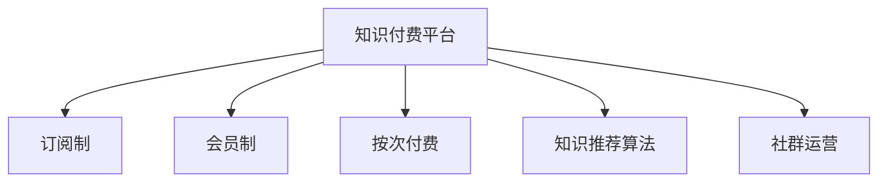

                 

# 知识经济时代下的知识付费创新商业模式复制

## 1. 背景介绍

### 1.1 问题由来

知识经济时代，全球进入知识价值化发展的全新阶段。各类创新企业如雨后春笋般涌现，纷纷通过知识付费平台变现知识资产。面对激烈的竞争环境，许多知识付费平台寻求差异化策略，通过知识付费创新商业模式破解市场发展瓶颈，以实现长期稳定发展。

在这一背景下，本文将详细解析知识付费平台的创新商业模式，并深入分析其实现机制，以期为相关企业提供有力的参考和指导。

### 1.2 问题核心关键点

知识付费平台的核心在于利用知识资产，打造高附加值产品，实现盈利。而在知识付费商业模式的创新方面，核心要素包括：

- **精准定位**：明晰目标用户群体，并根据不同用户群体的知识需求，制定个性化内容，提供差异化服务。
- **知识服务**：将知识转化为可交易的产品，如课程、讲座、图书等。
- **收费模式**：采用多样化收费方式，如按次付费、订阅制、会员制等。
- **技术支撑**：运用大数据、人工智能等技术，优化知识推荐算法，提升用户体验。
- **运营策略**：构建用户粘性，提升用户留存率，增强平台的品牌影响力。

### 1.3 问题研究意义

在知识经济时代，内容竞争成为市场竞争的核心。通过知识付费创新商业模式，知识付费平台可以更精准地挖掘和整合知识资源，提升平台粘性，建立竞争壁垒，从而在激烈的市场竞争中脱颖而出。

具体而言，知识付费商业模式的创新有助于：
1. **提升盈利能力**：通过差异化服务和高附加值产品，获得更多用户付费，实现商业变现。
2. **提升知识传播效率**：利用大数据和人工智能技术，优化内容推荐，提升知识传播的精准度和覆盖面。
3. **构建用户生态**：通过社群运营，提升用户参与度和满意度，增强平台的品牌黏性。

## 2. 核心概念与联系

### 2.1 核心概念概述

为更好地理解知识付费创新商业模式，本节将介绍几个密切相关的核心概念：

- **知识付费平台(Knowledge Pay-Per-Use Platform)**：将知识服务通过付费方式提供给用户的平台。
- **订阅制(Subscription Model)**：用户按月或按年订阅平台内容，享受相应特权。
- **会员制(Membership Model)**：用户加入平台会员，享受免费或优惠的高级内容和服务。
- **按次付费(Pay-Per-Use Model)**：用户根据单次使用需求付费。
- **知识推荐算法(Knowledge Recommendation Algorithm)**：利用大数据和AI技术，提升知识内容的推荐效果。
- **社群运营(Social Media Operation)**：通过建立用户社区，增强用户黏性，促进知识交流和传播。

这些概念之间的逻辑关系可以通过以下Mermaid流程图来展示：



这个流程图展示了一系列核心概念及其之间的关系：

1. 知识付费平台通过多种服务模式提供内容。
2. 订阅制、会员制和按次付费是主要的收费模式。
3. 知识推荐算法和社群运营是提升平台粘性的重要手段。

## 3. 核心算法原理 & 具体操作步骤
### 3.1 算法原理概述

知识付费平台的创新商业模式，其核心在于将知识服务进行精准定位和差异化封装，并通过多样化收费模式实现商业变现。核心算法原理主要包括以下几个方面：

- **用户画像分析**：通过数据分析，生成目标用户的详细画像，准确把握用户需求和偏好。
- **内容精准匹配**：根据用户画像，利用推荐算法，将最相关的内容推送给用户。
- **付费策略优化**：利用经济学和心理学原理，设计合理的收费策略，提升用户支付意愿。
- **数据驱动决策**：通过大数据分析，实时调整产品策略和内容推荐算法，提升平台盈利能力。

### 3.2 算法步骤详解

#### 3.2.1 用户画像分析

用户画像分析是知识付费平台创新的关键。这一过程主要包括以下几个步骤：

1. **数据收集**：通过用户注册、互动行为、消费记录等渠道，收集用户基本信息和行为数据。
2. **特征提取**：对用户数据进行特征提取，如年龄、职业、兴趣、浏览历史等，形成用户画像。
3. **聚类分析**：利用聚类算法，将用户划分为不同细分群体，为个性化服务提供基础。

#### 3.2.2 内容精准匹配

内容精准匹配的核心在于提升知识推荐的准确性，主要通过以下步骤实现：

1. **内容标签化**：对知识内容进行标签化处理，如课程名称、作者、话题等。
2. **用户兴趣分析**：利用机器学习算法，分析用户兴趣标签和行为数据，形成用户兴趣模型。
3. **推荐算法优化**：采用协同过滤、内容过滤、混合过滤等算法，提升知识推荐的精准度。

#### 3.2.3 付费策略优化

付费策略优化是知识付费平台创新的重要方面，主要通过以下方式实现：

1. **价格歧视**：根据用户行为和付费历史，提供不同价格层级的服务。
2. **积分系统**：引入积分系统，用户可以通过学习获得积分，兑换优惠或免费内容。
3. **弹性定价**：设置动态价格，根据市场需求和竞争环境调整价格策略。

#### 3.2.4 数据驱动决策

数据驱动决策是知识付费平台创新的核心驱动力，主要通过以下方式实现：

1. **实时监控**：实时监控平台各项指标，如用户留存率、知识付费转化率、用户满意度等。
2. **A/B测试**：通过A/B测试，优化产品功能和服务体验。
3. **预测分析**：利用预测模型，分析市场趋势和用户行为，指导内容生产和收费策略。

### 3.3 算法优缺点

知识付费平台的创新商业模式具有以下优点：

1. **精准定位**：利用大数据和机器学习算法，能够更精准地定位目标用户，提升内容服务的精准性。
2. **差异化服务**：通过订阅制、会员制、按次付费等多种模式，满足不同用户需求，提升用户满意度。
3. **高附加值**：通过优化推荐算法和付费策略，提高内容服务的附加值，增加用户粘性。

同时，该模式也存在以下局限性：

1. **数据依赖**：知识付费平台的数据分析高度依赖高质量的用户数据，数据不完整或数据偏差可能导致分析结果不准确。
2. **算法复杂性**：推荐算法和付费策略优化涉及复杂的数学模型，算法实现复杂，开发成本较高。
3. **用户转化难度**：付费策略设计不当可能导致用户转化率低，影响平台盈利能力。

尽管存在这些局限性，但就目前而言，知识付费平台的创新商业模式已经取得了显著的成功，成为知识变现的重要手段。未来相关研究的重点在于如何进一步降低数据依赖，提高算法效率，同时兼顾用户体验和商业转化，实现平台的长远发展。

### 3.4 算法应用领域

知识付费平台的创新商业模式已经在教育、医疗、科技等多个领域得到了广泛应用，例如：

- **在线教育**：平台通过课程订阅、讲师讲座等形式，提供高价值教育内容，满足用户个性化学习需求。
- **远程医疗**：医生通过平台提供在线问诊、远程诊疗等高附加值医疗服务，实现医疗资源的优化配置。
- **科技资讯**：科技媒体通过平台提供深度解读、科技前沿等内容，吸引技术爱好者和专业人士。

除了上述这些经典应用外，知识付费平台的创新模式还拓展到了更多场景中，如法律咨询、金融分析、企业培训等，为各行业提供了高效的知识传播和价值变现渠道。

## 4. 数学模型和公式 & 详细讲解  
### 4.1 数学模型构建

知识付费平台的推荐系统可以通过如下数学模型进行构建：

设平台用户数量为 $U$，知识内容数量为 $C$，用户画像向量为 $x_u \in \mathbb{R}^n$，内容特征向量为 $x_c \in \mathbb{R}^m$，用户与内容的交互矩阵为 $I \in \mathbb{R}^{U \times C}$。

知识推荐算法目标为最大化用户对推荐内容的满意度，即：

$$
\max_{I} \sum_{u=1}^{U} \sum_{c=1}^{C} w_{uc} \times \text{满意度}_{uc}
$$

其中 $w_{uc}$ 为内容 $c$ 对用户 $u$ 的权重，$\text{满意度}_{uc}$ 为用户对内容 $c$ 的满意度评分。

推荐系统分为冷启动和推荐两个阶段。冷启动阶段通过聚类和降维算法优化用户画像，推荐阶段通过协同过滤和深度学习算法优化推荐效果。

### 4.2 公式推导过程

#### 4.2.1 冷启动阶段

冷启动阶段的目标是根据用户行为数据，生成高质量的用户画像。这一过程主要通过以下公式实现：

$$
x_u = \frac{1}{|\mathcal{N}_u|} \sum_{i \in \mathcal{N}_u} x_i
$$

其中 $\mathcal{N}_u$ 为用户 $u$ 的邻居集合，$x_i$ 为邻居用户的画像向量。

#### 4.2.2 推荐阶段

推荐阶段的目标是根据用户画像和内容特征，生成推荐结果。这一过程主要通过以下公式实现：

$$
I_{uc} = f(x_u, x_c, \alpha)
$$

其中 $f$ 为推荐函数，$\alpha$ 为模型参数。

推荐函数 $f$ 可以采用协同过滤算法、内容过滤算法、混合过滤算法等，具体形式取决于推荐系统的复杂度和应用场景。

### 4.3 案例分析与讲解

以某在线教育平台为例，其知识推荐系统设计如下：

1. **用户画像分析**：通过用户注册和互动行为数据，生成用户画像向量 $x_u$。
2. **内容精准匹配**：对课程进行标签化处理，生成内容特征向量 $x_c$。
3. **推荐算法优化**：采用协同过滤算法，生成推荐矩阵 $I$。
4. **付费策略优化**：设置不同价格层级的课程，采用价格歧视策略。

该平台通过精准的用户画像分析和高效的推荐算法，提升了课程推荐的精准性，显著增加了用户付费率，成为行业内的领先者。

## 5. 项目实践：代码实例和详细解释说明
### 5.1 开发环境搭建

在进行知识付费平台开发前，我们需要准备好开发环境。以下是使用Python进行Flask开发的环境配置流程：

1. 安装Anaconda：从官网下载并安装Anaconda，用于创建独立的Python环境。

2. 创建并激活虚拟环境：
```bash
conda create -n knowledge-env python=3.8 
conda activate knowledge-env
```

3. 安装Flask：
```bash
pip install Flask
```

4. 安装Flask-SQLAlchemy：
```bash
pip install Flask-SQLAlchemy
```

5. 安装Flask-WTF：
```bash
pip install Flask-WTF
```

6. 安装Flask-Login：
```bash
pip install Flask-Login
```

完成上述步骤后，即可在`knowledge-env`环境中开始开发。

### 5.2 源代码详细实现

下面我们以知识付费平台的用户注册和登录模块为例，给出使用Flask开发的PyTorch代码实现。

```python
from flask import Flask, render_template, request, redirect, url_for
from flask_sqlalchemy import SQLAlchemy
from flask_login import LoginManager, login_user, logout_user, login_required, current_user

app = Flask(__name__)
app.config['SQLALCHEMY_DATABASE_URI'] = 'sqlite:///user.db'
db = SQLAlchemy(app)
login_manager = LoginManager(app)

class User(db.Model):
    id = db.Column(db.Integer, primary_key=True)
    username = db.Column(db.String(80), unique=True, nullable=False)
    password = db.Column(db.String(120), nullable=False)

@login_manager.user_loader
def load_user(user_id):
    return User.query.get(int(user_id))

@app.route('/')
def index():
    return render_template('index.html')

@app.route('/login', methods=['GET', 'POST'])
def login():
    if request.method == 'POST':
        username = request.form['username']
        password = request.form['password']
        user = User.query.filter_by(username=username).first()
        if user and user.password == password:
            login_user(user)
            return redirect(url_for('dashboard'))
    return render_template('login.html')

@app.route('/logout')
@login_required
def logout():
    logout_user()
    return redirect(url_for('index'))

@app.route('/dashboard')
@login_required
def dashboard():
    return render_template('dashboard.html')

if __name__ == '__main__':
    app.run(debug=True)
```

### 5.3 代码解读与分析

让我们再详细解读一下关键代码的实现细节：

**Flask应用**：
- 创建Flask应用实例，配置数据库连接。
- 定义用户模型 `User`，包括 `id`、`username`、`password` 字段。
- 定义用户认证器 `load_user`，用于从数据库中加载用户。

**路由定义**：
- 定义主页路由 `/`，渲染 `index.html` 模板。
- 定义登录路由 `/login`，处理用户登录请求。
- 定义退出路由 `/logout`，处理用户退出请求。
- 定义仪表盘路由 `/dashboard`，渲染 `dashboard.html` 模板。

**用户认证**：
- 利用 Flask-Login 库，实现用户登录和退出逻辑。
- 在仪表盘路由中使用 `@login_required` 装饰器，确保用户已登录才能访问。

以上代码实现了知识付费平台的基本用户认证功能，后续可以基于此框架扩展更多功能，如用户注册、课程推荐、知识付费等。

## 6. 实际应用场景
### 6.1 智能教育平台

智能教育平台通过知识付费模式，提供高价值教育内容，满足用户个性化学习需求。平台利用用户画像分析和内容精准匹配技术，提升课程推荐的准确性，从而提升用户满意度。

例如，某在线教育平台通过深度学习和协同过滤算法，为用户推荐最适合的学习内容。平台还设计了多样化收费模式，如按月订阅、单次购买等，提升用户粘性。此外，平台利用社群运营，构建用户社区，增强用户互动和参与度，进一步提升用户满意度。

### 6.2 远程医疗平台

远程医疗平台通过知识付费模式，提供高附加值的医疗服务，满足用户便捷、高效的医疗需求。平台利用用户画像分析和内容精准匹配技术，提升医疗服务的精准性，从而提升用户满意度。

例如，某远程医疗平台通过深度学习和协同过滤算法，为用户推荐最适合的医生和医疗内容。平台还设计了多样化收费模式，如按次付费、按年订阅等，提升用户粘性。此外，平台利用社群运营，构建医生和患者社区，增强用户互动和参与度，进一步提升用户满意度。

### 6.3 科技资讯平台

科技资讯平台通过知识付费模式，提供深度解读和科技前沿内容，吸引技术爱好者和专业人士。平台利用用户画像分析和内容精准匹配技术，提升内容推荐的准确性，从而提升用户满意度。

例如，某科技资讯平台通过深度学习和协同过滤算法，为用户推荐最适合的科技文章和视频。平台还设计了多样化收费模式，如按月订阅、单次购买等，提升用户粘性。此外，平台利用社群运营，构建用户社区，增强用户互动和参与度，进一步提升用户满意度。

### 6.4 未来应用展望

随着知识付费平台的发展，未来将出现更多创新应用场景，推动知识经济迈向新的高度。

在智慧城市治理中，知识付费平台可以通过提供智慧化解决方案，帮助政府提升治理效率和决策能力，实现精准治理。

在智能制造领域，知识付费平台可以为制造企业提供先进的知识库和服务，提升企业的智能化水平和竞争力。

在金融科技领域，知识付费平台可以提供金融分析和投资建议，帮助投资者做出更明智的决策，提升投资收益。

此外，在教育、医疗、法律、咨询等众多领域，知识付费平台将持续拓展应用场景，为各行各业提供高效的知识服务，推动社会的创新发展。

## 7. 工具和资源推荐
### 7.1 学习资源推荐

为了帮助开发者系统掌握知识付费平台的理论基础和实践技巧，这里推荐一些优质的学习资源：

1. **《知识付费平台开发实战》书籍**：全面介绍了知识付费平台的核心技术架构和开发实践，包括用户画像分析、内容推荐算法、付费策略优化等。
2. **《知识经济导论》课程**：由中国经济学家主讲，全面解读知识经济的内涵和机遇，为知识付费平台提供理论支持。
3. **《知识付费平台的创新实践》论文**：总结了知识付费平台的发展历程和创新实践，提供了丰富的案例和经验。
4. **HuggingFace官方文档**：提供了丰富的深度学习模型和工具，包括知识推荐算法和用户画像分析等。
5. **Kaggle知识付费平台竞赛**：通过竞赛形式，推动知识付费平台技术的创新和应用，提供了丰富的学习资源和实践机会。

通过对这些资源的学习实践，相信你一定能够快速掌握知识付费平台的技术精髓，并用于解决实际的业务问题。

### 7.2 开发工具推荐

高效的开发离不开优秀的工具支持。以下是几款用于知识付费平台开发的常用工具：

1. **Flask**：基于Python的轻量级Web框架，灵活高效，适合快速迭代研究。
2. **SQLAlchemy**：提供面向SQL数据库的对象关系映射(ORM)功能，方便数据库操作。
3. **Flask-Login**：提供用户认证和会话管理功能，方便用户登录和退出。
4. **Flask-SQLAlchemy**：提供Flask和SQLAlchemy的集成，简化数据库操作。
5. **Flask-WTF**：提供表单处理功能，方便用户输入数据。
6. **Jupyter Notebook**：提供交互式开发环境，方便快速迭代和调试代码。

合理利用这些工具，可以显著提升知识付费平台开发的效率，加快创新迭代的步伐。

### 7.3 相关论文推荐

知识付费平台的创新商业模式源于学界的持续研究。以下是几篇奠基性的相关论文，推荐阅读：

1. **《知识付费平台用户画像分析》论文**：研究了用户画像分析的方法和应用，提供了丰富的案例和经验。
2. **《知识付费平台推荐系统研究》论文**：总结了知识推荐系统的理论和实践，提供了多样化的推荐算法和优化策略。
3. **《知识付费平台的创新实践》论文**：总结了知识付费平台的发展历程和创新实践，提供了丰富的案例和经验。
4. **《知识付费平台的商业模型创新》论文**：研究了知识付费平台的商业模式创新，提出了多样化的收费策略和用户运营方法。

这些论文代表了大规模知识付费平台的技术发展和实践成果，为知识付费平台的创新提供了理论和实践的指导。

## 8. 总结：未来发展趋势与挑战

### 8.1 总结

本文对知识付费平台的创新商业模式进行了全面系统的介绍。首先阐述了知识付费平台的背景和意义，明确了商业模式的创新要素。其次，从原理到实践，详细讲解了知识推荐系统的构建和应用，给出了知识付费平台开发的完整代码实例。同时，本文还广泛探讨了知识付费平台在教育、医疗、科技等多个领域的应用前景，展示了知识付费平台的巨大潜力。此外，本文精选了知识付费平台的各类学习资源，力求为读者提供全方位的技术指引。

通过本文的系统梳理，可以看到，知识付费平台的创新商业模式正在成为知识变现的重要手段，极大地拓展了知识传播和商业变现的渠道。知识付费平台通过精准的用户画像分析和高效的内容推荐，显著提升了用户体验和满意度，推动了知识经济的快速发展。未来，伴随技术进步和市场需求的多样化，知识付费平台将持续创新，为知识变现和知识传播带来更多的可能性。

### 8.2 未来发展趋势

展望未来，知识付费平台的创新商业模式将呈现以下几个发展趋势：

1. **个性化推荐**：通过深度学习和协同过滤算法，提升内容推荐的精准性，满足用户个性化需求。
2. **用户社区建设**：构建用户社区，增强用户互动和参与度，提升用户黏性。
3. **多样化收费模式**：采用多种收费模式，如按月订阅、按次付费、会员制等，满足不同用户需求。
4. **数据驱动决策**：利用大数据和人工智能技术，实时调整产品策略和推荐算法，提升平台盈利能力。
5. **国际化发展**：拓展海外市场，提供多语言服务和内容，提升平台的国际影响力。

以上趋势凸显了知识付费平台的发展方向，这些方向的探索发展，必将进一步提升知识传播的效率和用户体验，推动知识付费平台走向更高的台阶。

### 8.3 面临的挑战

尽管知识付费平台的创新商业模式已经取得了显著的成功，但在迈向更加智能化、普适化应用的过程中，它仍面临诸多挑战：

1. **数据依赖**：知识付费平台的数据分析高度依赖高质量的用户数据，数据不完整或数据偏差可能导致分析结果不准确。
2. **算法复杂性**：推荐算法和付费策略优化涉及复杂的数学模型，算法实现复杂，开发成本较高。
3. **用户转化难度**：付费策略设计不当可能导致用户转化率低，影响平台盈利能力。
4. **用户粘性不足**：平台缺乏有效的内容和互动机制，难以长期吸引用户。
5. **竞争环境变化**：知识付费平台面临激烈的市场竞争，需要持续创新以保持竞争优势。

尽管存在这些挑战，但就目前而言，知识付费平台的创新商业模式已经取得了显著的成功，成为知识变现的重要手段。未来相关研究的重点在于如何进一步降低数据依赖，提高算法效率，同时兼顾用户体验和商业转化，实现平台的长远发展。

### 8.4 未来突破

面对知识付费平台所面临的挑战，未来的研究需要在以下几个方面寻求新的突破：

1. **深度学习技术应用**：引入深度学习技术，提升内容推荐的准确性，降低推荐算法复杂度。
2. **用户画像精细化**：通过更多维度的数据，提升用户画像的准确性和深度，增强推荐效果。
3. **付费策略优化**：设计更加合理的收费策略，提高用户转化率和粘性。
4. **社群运营强化**：构建用户社区，增强用户互动和参与度，提升用户满意度。
5. **国际化扩展**：拓展海外市场，提供多语言服务和内容，提升平台的国际影响力。

这些研究方向的探索，必将引领知识付费平台走向更高的台阶，为知识变现和知识传播带来更多的可能性。

## 9. 附录：常见问题与解答

**Q1：知识付费平台如何精准定位目标用户？**

A: 知识付费平台通过数据分析，生成目标用户的详细画像，包括年龄、职业、兴趣、行为等，从而实现精准定位。主要步骤如下：
1. 收集用户注册和互动行为数据。
2. 对数据进行特征提取，生成用户画像向量。
3. 利用聚类算法，将用户划分为不同细分群体，为个性化服务提供基础。

**Q2：知识付费平台如何提升用户粘性？**

A: 知识付费平台通过社群运营和个性化推荐，提升用户粘性。主要步骤如下：
1. 构建用户社区，增强用户互动和参与度。
2. 利用深度学习算法，提升内容推荐的精准性，满足用户个性化需求。
3. 设计多样化付费模式，如按月订阅、单次购买等，提高用户粘性。

**Q3：知识付费平台如何提升用户转化率？**

A: 知识付费平台通过优化付费策略和推荐算法，提升用户转化率。主要步骤如下：
1. 设计合理的收费策略，如价格歧视、积分系统等。
2. 利用深度学习算法，提升内容推荐的精准性，提高用户满意度。
3. 实时监控平台数据，优化推荐算法，提升用户转化率。

这些策略可以有效提升用户转化率，从而增加平台的盈利能力。

**Q4：知识付费平台如何应对市场竞争？**

A: 知识付费平台通过持续创新，应对市场竞争。主要步骤如下：
1. 引入深度学习技术，提升内容推荐的准确性。
2. 优化付费策略，设计多样化收费模式。
3. 增强社群运营，提升用户粘性。
4. 拓展海外市场，提供多语言服务和内容。

通过持续创新，知识付费平台可以在激烈的市场竞争中保持竞争优势，实现长期稳定发展。

**Q5：知识付费平台如何提升平台盈利能力？**

A: 知识付费平台通过优化推荐算法和付费策略，提升平台盈利能力。主要步骤如下：
1. 利用大数据和深度学习技术，提升内容推荐的精准性，提高用户满意度。
2. 设计多样化收费模式，如按月订阅、单次购买等，提高用户粘性。
3. 实时监控平台数据，优化推荐算法，提升用户转化率。

这些策略可以有效提升平台盈利能力，确保平台可持续发展。

---

作者：禅与计算机程序设计艺术 / Zen and the Art of Computer Programming

