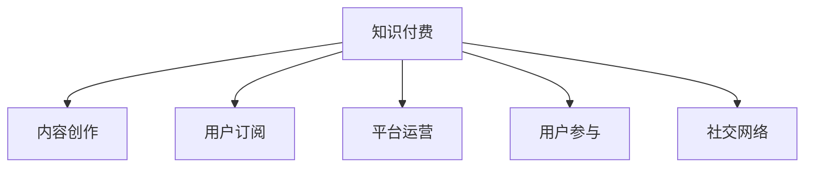

                 

# 知识经济时代下的知识付费创新商业模式运营

在信息爆炸的知识经济时代，知识的获取渠道日益多元，如何从中筛选出有价值的内容，并高效转化为自己所需的知识，成为众多专业人士和知识工作者亟待解决的问题。知识付费商业模式作为知识传播和消费的新模式，正是在这样的背景下应运而生。本文旨在深入分析知识付费商业模式的原理与实践，探讨其创新之处，并提出未来发展趋势与挑战。

## 1. 背景介绍

### 1.1 问题由来

随着互联网和移动通信技术的飞速发展，信息获取变得前所未有的便捷。从传统的书籍、报纸到如今的海量在线内容，人们几乎可以随时随地获取到各种知识。然而，信息的过载和噪声的存在，使得人们难以高效筛选出真正有价值的信息，增加了知识获取的成本。

知识付费商业模式应运而生，通过筛选优质内容、整合专业资源，提供有针对性的知识和信息服务，帮助用户节省信息搜索、甄别的时间，提高知识获取的效率。这种模式不仅提升了知识的传播效率，也为内容创作者提供了新的收入来源，促进了知识的创造和分享。

### 1.2 问题核心关键点

知识付费商业模式的核心在于内容与服务的精准匹配。其关键点包括：

- 内容质量：知识付费平台需严格筛选优质内容，避免低质量信息泛滥。
- 用户体验：需提供流畅的用户体验，确保内容的可访问性和互动性。
- 定价策略：需合理定价，兼顾内容价值与用户支付意愿。
- 生态构建：需构建健康的平台生态，促进内容创作者与用户的良性互动。
- 社会价值：需承担社会责任，推动知识的普及与传播。

## 2. 核心概念与联系

### 2.1 核心概念概述

为更好地理解知识付费商业模式的原理与实践，本节将介绍几个密切相关的核心概念：

- **知识付费**：指以付费方式获取知识或信息服务，通过付费筛选和筛选优质内容，提升知识获取效率和质量。
- **内容创作**：指知识付费平台上的专业内容创作者，通过撰写、制作、发布各类知识产品。
- **用户订阅**：指用户通过付费订阅获取特定内容或服务，支付相应费用以获取知识。
- **平台运营**：指知识付费平台的运营方，负责内容审核、市场推广、用户体验优化等工作。
- **用户参与**：指用户通过评论、点赞、分享等形式参与内容互动，提高内容可见性和质量。
- **社交网络**：指知识付费平台上的用户社交网络，通过互动和分享促进知识传播。

这些核心概念之间的逻辑关系可以通过以下Mermaid流程图来展示：



这个流程图展示的知识付费商业模式的各个环节：

1. 知识付费平台作为核心枢纽，连接内容创作者和用户。
2. 内容创作者通过创作优质内容，吸引用户订阅。
3. 用户通过订阅获取所需知识，并通过互动参与平台生态。
4. 平台运营方通过审核、推广和优化用户体验，保障平台健康发展。
5. 用户社交网络促进知识传播和互动，提升平台价值。

## 3. 核心算法原理 & 具体操作步骤

### 3.1 算法原理概述

知识付费商业模式的核心算法在于内容与用户需求的双向匹配，通过优化算法提升匹配效果。其核心思想是：

- 建立内容推荐系统，根据用户兴趣和行为历史，推荐符合其需求的内容。
- 引入竞价排名机制，通过竞价购买热门课程，提升课程曝光率。
- 提供个性化定价，根据内容价值和用户支付意愿，设定合理的价格区间。
- 构建用户反馈系统，根据用户评价和互动情况，优化内容推荐。

形式化地，假设知识付费平台上有 $N$ 个内容创作者，每个创作者发布 $M$ 个内容产品，用户有 $U$ 个，每个用户可以订阅 $K$ 个内容。内容 $i$ 的收益为 $R_i$，用户 $j$ 对内容 $i$ 的支付意愿为 $P_{ji}$。知识付费平台的优化目标是最小化推荐误差，即：

$$
\min_{\theta} \sum_{i=1}^{M} \sum_{j=1}^{U} (R_i - P_{ji})^2
$$

其中 $\theta$ 为推荐算法的参数，$R_i$ 为内容 $i$ 的实际收益，$P_{ji}$ 为用户 $j$ 对内容 $i$ 的支付意愿。

### 3.2 算法步骤详解

知识付费商业模式的算法步骤一般包括以下几个关键步骤：

**Step 1: 用户画像构建**
- 通过用户注册、行为数据等，构建用户画像，描述用户的基本属性和兴趣偏好。
- 使用机器学习算法（如协同过滤、深度学习等）预测用户对不同内容的支付意愿。

**Step 2: 内容推荐系统设计**
- 基于用户画像和内容标签，设计推荐算法。常见的推荐算法包括协同过滤、基于内容的推荐、混合推荐等。
- 引入排序算法（如PageRank、DNN等），对推荐结果进行排序。

**Step 3: 竞价排名机制实施**
- 设置竞价购买机制，热门课程可以通过竞价购买提高曝光率。
- 设计合理的竞价规则和限制条件，防止恶性竞价。

**Step 4: 个性化定价策略**
- 根据内容价值、创作者知名度、市场需求等因素，设定个性化定价策略。
- 引入动态定价机制，根据市场供需情况调整价格。

**Step 5: 用户反馈系统优化**
- 收集用户评价、互动数据，评估推荐效果。
- 根据反馈数据优化推荐算法和定价策略，提升用户体验。

### 3.3 算法优缺点

知识付费商业模式的算法具有以下优点：

- 提高内容匹配度：通过推荐算法精准匹配用户需求，提升知识获取效率。
- 激励内容创作：个性化定价和竞价排名机制，激励创作者提供优质内容。
- 优化用户体验：通过互动反馈系统，不断优化用户体验，提升用户满意度。
- 提升平台价值：通过精准匹配和个性化服务，提高平台的市场竞争力和用户粘性。

但该算法也存在一些局限性：

- 数据隐私问题：需要收集大量用户行为数据，可能引发隐私保护问题。
- 算法黑箱：推荐算法和定价机制复杂，难以解释和优化。
- 市场风险：竞价排名和个性化定价可能导致市场泡沫和经济波动。
- 用户依赖：过度依赖算法推荐，用户可能失去主动筛选和独立思考的能力。

### 3.4 算法应用领域

知识付费商业模式在多个领域得到了广泛应用，包括但不限于：

- 教育培训：提供各类在线课程、学习资料、教育咨询等。
- 职业技能：提供职业技能培训、技术教程、职业规划等服务。
- 健康医疗：提供健康知识、医疗咨询、远程诊疗等。
- 生活休闲：提供生活技巧、旅游攻略、娱乐休闲等服务。
- 商业管理：提供商业分析、管理咨询、企业培训等服务。
- 创意设计：提供设计灵感、创意工具、设计课程等服务。

除了上述这些经典应用外，知识付费商业模式还正在不断拓展新的应用场景，如金融理财、农业技术、科普教育等，为各行各业的知识传播和消费提供新的解决方案。

## 4. 数学模型和公式 & 详细讲解 & 举例说明

### 4.1 数学模型构建

本节将使用数学语言对知识付费商业模式的优化算法进行更加严格的刻画。

假设知识付费平台上有 $N$ 个内容创作者，每个创作者发布 $M$ 个内容产品，用户有 $U$ 个，每个用户可以订阅 $K$ 个内容。内容 $i$ 的收益为 $R_i$，用户 $j$ 对内容 $i$ 的支付意愿为 $P_{ji}$。平台优化目标为最小化推荐误差，即：

$$
\min_{\theta} \sum_{i=1}^{M} \sum_{j=1}^{U} (R_i - P_{ji})^2
$$

其中 $\theta$ 为推荐算法的参数，$R_i$ 为内容 $i$ 的实际收益，$P_{ji}$ 为用户 $j$ 对内容 $i$ 的支付意愿。

### 4.2 公式推导过程

以下我们以协同过滤推荐算法为例，推导协同过滤模型的优化过程。

设用户 $j$ 与内容 $i$ 的相似度为 $S_{ji}$，内容 $i$ 与内容 $i'$ 的相似度为 $S_{ii'}$。协同过滤模型的目标是最小化用户 $j$ 对内容 $i$ 的推荐误差：

$$
\min_{\theta} \sum_{j=1}^{U} \sum_{i=1}^{M} (P_{ji} - \sum_{i'=1}^{M} S_{ii'} P_{j{i'}})^2
$$

其中 $S_{ii'} = \frac{1}{\sqrt{\sigma + c_{i} + c_{i'}}$，$c_i$ 为用户 $j$ 对内容 $i$ 的评分。

对于每个用户 $j$，计算其对内容 $i$ 的预测评分：

$$
\hat{P}_{ji} = \sum_{i'=1}^{M} S_{ii'} P_{j{i'}}
$$

其中 $P_{j{i'}}$ 为用户 $j$ 对内容 $i'$ 的评分。

将预测评分 $\hat{P}_{ji}$ 与实际支付意愿 $P_{ji}$ 比较，计算误差：

$$
e_{ji} = P_{ji} - \hat{P}_{ji}
$$

利用均方误差损失函数 $L_{mse}$ 来最小化误差：

$$
L_{mse} = \frac{1}{U} \sum_{j=1}^{U} \sum_{i=1}^{M} e_{ji}^2
$$

利用梯度下降算法，更新协同过滤模型的参数 $\theta$：

$$
\theta \leftarrow \theta - \eta \nabla_{\theta} L_{mse}
$$

其中 $\eta$ 为学习率，$\nabla_{\theta} L_{mse}$ 为损失函数对参数 $\theta$ 的梯度，可通过反向传播算法高效计算。

### 4.3 案例分析与讲解

以Coursera平台为例，分析其知识付费商业模式的应用。

Coursera是一个知名的在线教育平台，提供各类高质量的课程和认证项目。平台通过以下几个步骤实现知识付费：

**Step 1: 用户画像构建**
- 通过用户注册、行为数据，构建用户画像，描述用户的基本属性和兴趣偏好。
- 使用机器学习算法预测用户对不同课程的支付意愿。

**Step 2: 内容推荐系统设计**
- 基于用户画像和课程标签，设计推荐算法。使用协同过滤算法，对课程进行推荐排序。
- 引入动态排序算法，根据用户行为数据实时调整推荐结果。

**Step 3: 竞价排名机制实施**
- 热门课程可以通过竞价购买提高曝光率。设置合理的竞价规则，防止恶性竞价。
- 竞价购买的资金用于平台运营和内容采购，提升平台资源。

**Step 4: 个性化定价策略**
- 根据课程难度、内容价值、市场需求等因素，设定个性化定价策略。
- 引入动态定价机制，根据市场供需情况调整价格。

**Step 5: 用户反馈系统优化**
- 收集用户评价、互动数据，评估推荐效果。
- 根据反馈数据优化推荐算法和定价策略，提升用户体验。

通过上述步骤，Coursera平台不仅提升了课程推荐效果，还吸引了大量高质量内容创作者，构建了健康的知识付费生态。

## 5. 项目实践：代码实例和详细解释说明

### 5.1 开发环境搭建

在进行知识付费商业模式开发前，我们需要准备好开发环境。以下是使用Python进行Flask框架开发的环境配置流程：

1. 安装Anaconda：从官网下载并安装Anaconda，用于创建独立的Python环境。

2. 创建并激活虚拟环境：
```bash
conda create -n knowledge-payment-env python=3.8 
conda activate knowledge-payment-env
```

3. 安装Flask：
```bash
pip install Flask
```

4. 安装相关依赖包：
```bash
pip install pandas SQLAlchemy gunicorn Flask-RESTful
```

5. 安装数据库：
```bash
pip install mysql-connector-python
```

完成上述步骤后，即可在`knowledge-payment-env`环境中开始知识付费商业模式的开发。

### 5.2 源代码详细实现

我们以知识付费平台的推荐系统为例，给出Flask框架下知识付费推荐系统的代码实现。

首先，定义用户和课程的表结构：

```python
from flask_sqlalchemy import SQLAlchemy

db = SQLAlchemy(app)

class User(db.Model):
    id = db.Column(db.Integer, primary_key=True)
    name = db.Column(db.String(50), nullable=False)
    email = db.Column(db.String(120), unique=True, nullable=False)

class Course(db.Model):
    id = db.Column(db.Integer, primary_key=True)
    title = db.Column(db.String(100), nullable=False)
    description = db.Column(db.Text, nullable=False)
    price = db.Column(db.Float, nullable=False)
    category = db.Column(db.String(50), nullable=False)
    user_id = db.Column(db.Integer, db.ForeignKey('user.id'), nullable=False)

class Rating(db.Model):
    id = db.Column(db.Integer, primary_key=True)
    rating = db.Column(db.Integer, nullable=False)
    comment = db.Column(db.Text, nullable=True)
    user_id = db.Column(db.Integer, db.ForeignKey('user.id'), nullable=False)
    course_id = db.Column(db.Integer, db.ForeignKey('course.id'), nullable=False)
```

然后，定义推荐算法模型：

```python
class RecommendationModel:
    def __init__(self):
        self.model = None

    def fit(self, data):
        # 训练模型
        self.model = self._train(data)

    def predict(self, user_id):
        # 预测推荐结果
        return self._predict(user_id)

    def _train(self, data):
        # 训练模型的内部逻辑
        pass

    def _predict(self, user_id):
        # 预测推荐结果的内部逻辑
        pass
```

接下来，定义Flask应用，实现推荐系统的前端页面和后端API：

```python
app = Flask(__name__)

@app.route('/recommend')
def recommend():
    # 根据用户ID获取推荐结果
    user_id = request.args.get('user_id')
    result = RecommendationModel().recommend(user_id)
    return jsonify(result)

if __name__ == '__main__':
    app.run(debug=True)
```

最后，启动Flask应用，并测试推荐系统：

```bash
flask run
```

在浏览器中访问`http://localhost:5000/recommend?user_id=1`，即可获取用户ID为1的推荐结果。

### 5.3 代码解读与分析

让我们再详细解读一下关键代码的实现细节：

**数据库设计**
- 使用SQLAlchemy框架，定义了用户、课程和评分表，用于存储用户数据和推荐信息。

**推荐算法模型**
- 定义了一个推荐模型类，包含训练和预测两个方法，分别对应训练模型和预测推荐结果。

**Flask应用**
- 使用Flask框架，实现了一个简单的推荐系统API，用于获取用户ID的推荐结果。
- 通过HTTP请求，将用户ID作为参数传递给推荐系统API，获取推荐结果并返回给前端页面。

**测试**
- 在命令行中启动Flask应用，使用浏览器访问API，获取推荐结果。

可以看到，通过Flask框架，我们成功实现了一个简单的知识付费推荐系统。在实际应用中，还需要进一步优化推荐算法，引入更多的业务逻辑和数据处理，才能更好地满足用户需求。

## 6. 实际应用场景

### 6.1 智能教育平台

知识付费商业模式在智能教育领域得到了广泛应用。传统教育模式面临师资力量不足、教学质量不均等问题，知识付费平台通过整合优质教育资源，提供各类课程和认证项目，帮助用户提升知识和技能。

智能教育平台通过以下几个步骤实现知识付费：

**Step 1: 用户画像构建**
- 通过用户注册、学习行为数据，构建用户画像，描述用户的学习兴趣和知识水平。
- 使用机器学习算法预测用户对不同课程的支付意愿。

**Step 2: 内容推荐系统设计**
- 基于用户画像和课程标签，设计推荐算法。使用协同过滤算法，对课程进行推荐排序。
- 引入动态排序算法，根据用户行为数据实时调整推荐结果。

**Step 3: 个性化定价策略**
- 根据课程难度、内容价值、市场需求等因素，设定个性化定价策略。
- 引入动态定价机制，根据市场供需情况调整价格。

**Step 4: 用户反馈系统优化**
- 收集用户评价、互动数据，评估推荐效果。
- 根据反馈数据优化推荐算法和定价策略，提升用户体验。

通过上述步骤，智能教育平台不仅提升了课程推荐效果，还吸引了大量高质量内容创作者，构建了健康的知识付费生态。

### 6.2 商业培训平台

知识付费商业模式在商业培训领域也有着广泛的应用。企业内部培训面临着师资力量不足、课程内容单一等问题，知识付费平台通过整合优质培训资源，提供各类在线课程和培训项目，帮助企业提升员工的专业能力和职业技能。

商业培训平台通过以下几个步骤实现知识付费：

**Step 1: 用户画像构建**
- 通过企业信息、员工培训数据，构建用户画像，描述企业的培训需求和员工的职业发展目标。
- 使用机器学习算法预测企业对不同课程的支付意愿。

**Step 2: 内容推荐系统设计**
- 基于用户画像和课程标签，设计推荐算法。使用协同过滤算法，对课程进行推荐排序。
- 引入动态排序算法，根据企业需求实时调整推荐结果。

**Step 3: 个性化定价策略**
- 根据课程难度、内容价值、市场需求等因素，设定个性化定价策略。
- 引入动态定价机制，根据市场供需情况调整价格。

**Step 4: 用户反馈系统优化**
- 收集企业评价、互动数据，评估推荐效果。
- 根据反馈数据优化推荐算法和定价策略，提升用户体验。

通过上述步骤，商业培训平台不仅提升了课程推荐效果，还吸引了大量高质量内容创作者，构建了健康的知识付费生态。

### 6.3 个人成长平台

知识付费商业模式在个人成长领域也有着广泛的应用。个人成长需求多样化，知识付费平台通过整合优质内容资源，提供各类技能培训、心理辅导、健康管理等服务，帮助用户实现自我提升和全面发展。

个人成长平台通过以下几个步骤实现知识付费：

**Step 1: 用户画像构建**
- 通过用户注册、行为数据，构建用户画像，描述用户的兴趣和成长需求。
- 使用机器学习算法预测用户对不同课程的支付意愿。

**Step 2: 内容推荐系统设计**
- 基于用户画像和课程标签，设计推荐算法。使用协同过滤算法，对课程进行推荐排序。
- 引入动态排序算法，根据用户行为数据实时调整推荐结果。

**Step 3: 个性化定价策略**
- 根据课程难度、内容价值、市场需求等因素，设定个性化定价策略。
- 引入动态定价机制，根据市场供需情况调整价格。

**Step 4: 用户反馈系统优化**
- 收集用户评价、互动数据，评估推荐效果。
- 根据反馈数据优化推荐算法和定价策略，提升用户体验。

通过上述步骤，个人成长平台不仅提升了课程推荐效果，还吸引了大量高质量内容创作者，构建了健康的知识付费生态。

### 6.4 未来应用展望

随着知识付费商业模式的发展，未来将在更多领域得到应用，为各行各业的知识传播和消费提供新的解决方案。

在智慧医疗领域，知识付费平台可以通过整合优质医疗资源，提供各类在线诊疗、健康咨询等服务，帮助用户节省时间和成本，提升医疗服务的可及性和质量。

在智能家居领域，知识付费平台可以通过整合智能家居知识，提供各类智能设备安装、维护、升级等服务，帮助用户提升家居智能水平。

在旅游休闲领域，知识付费平台可以通过整合旅游知识，提供各类旅游攻略、预订服务、导游讲解等服务，帮助用户提升旅游体验。

此外，在金融理财、农业技术、科普教育等众多领域，知识付费平台也将不断拓展新的应用场景，为各行各业的知识传播和消费提供新的解决方案。

## 7. 工具和资源推荐

### 7.1 学习资源推荐

为了帮助开发者系统掌握知识付费商业模式的原理与实践，这里推荐一些优质的学习资源：

1. 《深度学习与知识图谱》系列博文：由深度学习专家撰写，深入浅出地介绍了知识图谱在知识付费中的应用。

2. 《知识付费商业模式》课程：由商学院教授讲授，系统讲解了知识付费的原理、策略和案例。

3. 《知识付费运营手册》书籍：系统介绍了知识付费平台的运营策略、用户管理、内容分发等。

4. Coursera官方文档：提供了丰富的课程和认证项目，是知识付费平台的学习资源宝库。

5. WeChat小程序：知识付费平台通过微信公众号、小程序等渠道进行推广，可以学习知识付费营销和推广技巧。

通过对这些资源的学习实践，相信你一定能够快速掌握知识付费商业模式的精髓，并用于解决实际的业务问题。

### 7.2 开发工具推荐

高效的开发离不开优秀的工具支持。以下是几款用于知识付费商业模式开发的常用工具：

1. Flask：Python框架，用于快速构建Web应用，适合知识付费平台的前端开发。
2. SQLAlchemy：Python ORM框架，用于数据库操作，适合知识付费平台的数据管理。
3. Gunicorn：Python Web应用服务器，用于Flask应用的后端部署。
4. GitLab：DevOps工具，用于代码版本控制和持续集成。
5. Docker：容器技术，用于知识付费平台的快速部署和扩展。
6. Jupyter Notebook：Python交互式开发环境，适合知识付费平台的算法开发和数据分析。

合理利用这些工具，可以显著提升知识付费商业模式的开发效率，加快创新迭代的步伐。

### 7.3 相关论文推荐

知识付费商业模式的研究源于学界的持续研究。以下是几篇奠基性的相关论文，推荐阅读：

1. Knowledge as a Service: Opportunities and Challenges for Realizing Its Vision. 论文讨论了知识即服务（KaaS）的概念、挑战和实现路径。

2. Pay for Advice: An Empirical Study of Reputation in a Knowledge Exchange Community. 论文通过案例分析，探讨了知识付费平台中声誉机制的应用。

3. Multi-Task Learning for Recommendation in a Knowledge-Based Platform. 论文提出了多任务学习算法，用于知识付费平台的内容推荐。

4. Deep Learning for Recommendation in Knowledge-Based Platforms: A Survey. 论文综述了深度学习在知识付费平台中的应用，包括协同过滤、神经网络等推荐算法。

5. Scalable Personalization for Smart Education Platforms: A Systematic Review. 论文系统回顾了智能教育平台中的个性化推荐算法和系统设计。

这些论文代表了大规模知识付费商业模式的理论基础和发展趋势。通过学习这些前沿成果，可以帮助研究者把握学科前进方向，激发更多的创新灵感。

## 8. 总结：未来发展趋势与挑战

### 8.1 总结

本文对知识付费商业模式的原理与实践进行了全面系统的介绍。首先阐述了知识付费商业模式的背景和核心关键点，明确了推荐系统、竞价排名、个性化定价等关键环节。其次，从原理到实践，详细讲解了知识付费商业模式的算法步骤和推荐系统设计，给出了知识付费推荐系统的代码实现。同时，本文还广泛探讨了知识付费商业模式在智能教育、商业培训、个人成长等多个行业领域的应用前景，展示了知识付费商业模式的巨大潜力。此外，本文精选了知识付费商业模式的各类学习资源和开发工具，力求为读者提供全方位的技术指引。

通过本文的系统梳理，可以看到，知识付费商业模式正在成为知识传播和消费的重要范式，极大地提升了知识的传播效率和用户满意度。未来的知识付费平台需要继续优化推荐算法，引入更多业务逻辑和数据处理，才能更好地满足用户需求。

### 8.2 未来发展趋势

展望未来，知识付费商业模式将呈现以下几个发展趋势：

1. 推荐算法不断优化。随着深度学习、强化学习等技术的发展，推荐算法将不断优化，提升推荐效果。
2. 多渠道分发拓展。知识付费平台将不断拓展分发渠道，如微信小程序、App、PC端等，提高用户覆盖率。
3. 智能化水平提升。知识付费平台将引入更多AI技术，如语音识别、自然语言处理等，提升平台智能化水平。
4. 全球化市场拓展。知识付费平台将逐步拓展国际市场，为用户提供全球化的知识服务。
5. 社会责任增强。知识付费平台将更多地承担社会责任，推动知识普及和教育公平。
6. 生态系统构建。知识付费平台将构建更多元化的生态系统，促进内容创作者、平台运营方和用户之间的良性互动。

以上趋势凸显了知识付费商业模式的前景广阔，其发展将为各行各业的知识传播和消费提供新的解决方案。

### 8.3 面临的挑战

尽管知识付费商业模式已经取得了瞩目成就，但在迈向更加智能化、普适化应用的过程中，它仍面临诸多挑战：

1. 内容质量保证。知识付费平台需严格筛选优质内容，避免低质量信息泛滥，确保平台内容的质量和价值。
2. 用户支付意愿。需不断提升用户体验，满足用户的多样化需求，增强用户的支付意愿。
3. 推荐算法优化。推荐算法需不断优化，避免算法黑箱和过拟合问题。
4. 用户信任问题。需建立用户信任机制，确保平台和内容创作者的可信度。
5. 市场竞争压力。知识付费平台需面对来自传统教育和在线教育的竞争，保持平台的竞争力和用户粘性。
6. 数据隐私保护。需保障用户数据的安全和隐私，避免数据泄露和滥用。

### 8.4 研究展望

面对知识付费商业模式所面临的挑战，未来的研究需要在以下几个方面寻求新的突破：

1. 引入更多先验知识。将符号化的先验知识，如知识图谱、逻辑规则等，与神经网络模型进行巧妙融合，引导推荐系统学习更准确、合理的知识。
2. 引入因果分析和博弈论工具。将因果分析方法引入推荐系统，识别出推荐过程中的关键特征，增强推荐结果的可解释性和逻辑性。
3. 引入社交网络分析。利用社交网络分析技术，提升推荐系统的社交互动性和个性化推荐效果。
4. 引入数据增强和对抗训练。通过数据增强和对抗训练，提高推荐系统的鲁棒性和泛化能力。
5. 引入动态定价和竞价排名。设计更加灵活的动态定价和竞价排名机制，提升平台的市场竞争力和用户粘性。

这些研究方向的探索，必将引领知识付费商业模式走向更高的台阶，为构建安全、可靠、可解释、可控的知识服务平台铺平道路。面向未来，知识付费平台还需要与其他人工智能技术进行更深入的融合，如知识表示、因果推理、强化学习等，多路径协同发力，共同推动知识付费商业模式的发展。只有勇于创新、敢于突破，才能不断拓展知识付费商业模式的边界，让知识付费技术更好地服务于各行各业。

## 9. 附录：常见问题与解答

**Q1：知识付费商业模式是否适用于所有行业？**

A: 知识付费商业模式适用于大多数行业，特别是需要持续学习、技能提升和知识共享的领域。但对于一些特定领域，如医疗、法律等，知识付费的效果可能有限，需要结合其他方式进行知识传播。

**Q2：如何确保知识付费平台的内容质量？**

A: 知识付费平台需建立严格的内容筛选机制，通过专家评审、用户评价、数据验证等方式，确保内容的质量和价值。平台还需引入竞争机制，激励创作者提供高质量的内容。

**Q3：如何提升用户的支付意愿？**

A: 提升用户体验是提升用户支付意愿的关键。平台需提供流畅的操作体验、丰富的课程选择、高质量的推荐系统等，满足用户的多样化需求。此外，平台还需建立信任机制，增强用户对平台的信任感。

**Q4：知识付费平台的推荐算法如何优化？**

A: 知识付费平台的推荐算法需不断优化，引入更多深度学习、强化学习等技术，提升推荐效果。平台还需引入动态定价机制，根据市场供需情况调整价格。此外，平台还需引入数据增强和对抗训练，提高推荐系统的鲁棒性和泛化能力。

**Q5：如何构建知识付费平台的生态系统？**

A: 知识付费平台需构建多元化的生态系统，包括内容创作者、平台运营方、用户等。平台需提供丰富的激励机制，如分成、认证等，激励创作者提供高质量的内容。平台还需建立用户信任机制，增强用户的粘性和参与度。

综上所述，知识付费商业模式在知识经济时代具有广阔的应用前景。通过优化推荐算法、提升用户体验、构建健康生态，知识付费平台有望成为知识传播和消费的重要平台，推动各行各业的知识普及和创新发展。面向未来，知识付费商业模式需不断创新突破，才能更好地服务于用户需求，推动知识的传播和应用。

