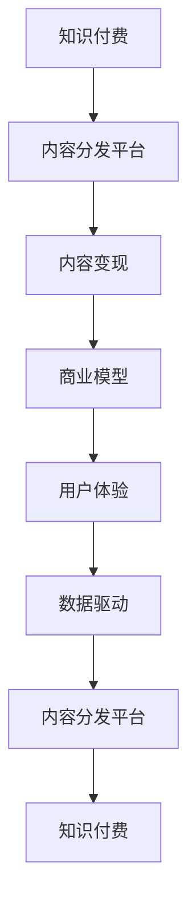

                 

# 知识经济时代下的知识付费创新商业模式运营

> 关键词：知识付费,商业模式创新,用户价值,市场定位,技术驱动

## 1. 背景介绍

### 1.1 问题由来
随着知识经济的蓬勃发展，知识付费已经成为数字经济的重要组成部分。知识付费不仅能够满足人们对知识的深层次需求，还能够推动社会进步和个体发展。在当前知识经济时代，如何实现知识付费商业模式的创新运营，成为企业和学术界共同关注的热点问题。

### 1.2 问题核心关键点
知识付费商业模式的创新运营，涉及知识内容的生产、分发、变现等多个环节，需要通过创新的商业模式设计和运营策略，来提升用户价值，增加用户黏性，实现盈利目标。以下是关键点：

- 内容质量：高质量的知识内容是知识付费平台的核心竞争力，如何吸引优质创作者和吸引用户付费，是商业模式创新的首要任务。
- 用户价值：提升用户体验，增加用户粘性，是知识付费平台持续运营的关键，需要通过个性化推荐、互动社区等功能，不断优化用户体验。
- 市场定位：明确目标用户群体，精准定位，通过细分市场，实现商业模式的差异化和定制化。
- 技术驱动：利用大数据、人工智能等先进技术，优化知识内容分发和变现模式，提高平台运营效率和用户满意度。
- 盈利模式：探索多样化的盈利模式，如广告、付费订阅、知识商品等，提升平台变现能力，实现商业可持续性。

## 2. 核心概念与联系

### 2.1 核心概念概述

为更好地理解知识付费商业模式的创新运营，本节将介绍几个密切相关的核心概念：

- 知识付费(Information Payment)：指用户通过付费获取知识产品或服务，包括但不限于在线课程、电子书、视频讲座、专业咨询等。
- 内容分发平台(Content Distribution Platform)：以互联网为载体，提供知识内容的搜索、推荐、订阅等功能，让用户便捷获取所需知识的平台。
- 内容变现(Content Monetization)：通过知识内容的有偿使用或知识商品销售，实现知识付费平台的盈利。
- 商业模型(Commercial Model)：指知识付费平台的收入来源、成本结构和盈利方式，是商业模式创新运营的核心。
- 用户体验(User Experience)：指用户在知识付费平台上的使用感受，通过技术手段和运营策略不断提升用户体验，增加用户粘性。
- 数据驱动(Data-Driven)：利用数据分析和机器学习技术，优化知识内容推荐和平台运营，实现精准定位和个性化服务。

这些核心概念之间的逻辑关系可以通过以下Mermaid流程图来展示：



这个流程图展示了一些核心概念及其之间的关系：

1. 知识付费是核心驱动力。
2. 内容分发平台是知识付费的载体，提供知识内容的搜索和推荐功能。
3. 内容变现是知识付费平台盈利的主要方式。
4. 商业模型是知识付费平台收入、成本和盈利的整体框架。
5. 用户体验是平台持续运营的关键，通过技术手段和运营策略不断优化。
6. 数据驱动通过技术手段，提升平台的运营效率和用户满意度。

## 3. 核心算法原理 & 具体操作步骤
### 3.1 算法原理概述

知识付费商业模式的创新运营，本质上是一个综合性的系统工程，涉及内容生产、分发、变现和运营等多个环节。其核心思想是：通过优质的内容吸引用户付费，利用先进的技术手段提升平台运营效率，实现盈利目标。

形式化地，假设知识付费平台为 $M_{\theta}$，其中 $\theta$ 为平台的运营策略、内容和用户数据等。给定目标市场 $T$，平台运营的目标是找到最优策略 $\hat{\theta}$，使得：

$$
\hat{\theta}=\mathop{\arg\min}_{\theta} \mathcal{L}(M_{\theta},T)
$$

其中 $\mathcal{L}$ 为针对市场 $T$ 设计的损失函数，用于衡量平台的运营效果。常见的损失函数包括用户留存率、内容付费率、平台收入等。

通过梯度下降等优化算法，平台运营过程不断更新策略 $\theta$，最小化损失函数 $\mathcal{L}$，使得平台运营效果逼近目标值。由于 $\theta$ 已经通过前期运营积累获得了较好的初始化，因此即便在复杂多变的市场环境中，也能较快收敛到理想的运营策略 $\hat{\theta}$。

### 3.2 算法步骤详解

知识付费商业模式的创新运营一般包括以下几个关键步骤：

**Step 1: 内容引入与生产**
- 吸引优质创作者入驻平台，提供激励机制和保障措施，鼓励其创作高质量内容。
- 利用数据分析工具，识别用户关注的热门主题，引导创作者生产相关内容。
- 引入AI技术，通过文本生成、图像识别等技术，丰富知识内容形式。

**Step 2: 用户画像与分析**
- 收集和分析用户行为数据，如浏览记录、购买历史、互动行为等，形成用户画像。
- 通过机器学习算法，对用户画像进行建模，预测用户偏好和潜在需求。
- 利用数据可视化工具，对用户画像进行可视化展示，便于运营决策。

**Step 3: 内容分发与推荐**
- 引入推荐算法，如协同过滤、基于内容的推荐、深度学习等，提升内容推荐准确率。
- 利用数据驱动的方法，实时调整推荐算法参数，提高推荐效果。
- 在推荐过程中引入个性化的提示语和导读，提升用户点击率和满意度。

**Step 4: 定价策略与变现**
- 采用多样化定价策略，如单次付费、订阅制、阶梯定价等，满足不同用户的需求。
- 利用数据分析工具，优化价格策略，提升用户购买率。
- 引入互动广告和知识商品销售，扩展变现渠道，实现商业模式的创新。

**Step 5: 用户体验与优化**
- 利用数据驱动的方法，实时监控用户反馈，优化用户体验。
- 引入人工智能技术，如聊天机器人、个性化推荐等，提升互动体验。
- 定期进行用户调研，收集用户意见和建议，持续改进平台服务。

**Step 6: 运营数据分析与决策**
- 利用大数据和人工智能技术，对运营数据进行深度分析，形成运营报告。
- 定期评估运营效果，优化运营策略，提升平台运营效率。
- 引入A/B测试方法，对新功能和新策略进行效果评估，不断迭代优化。

以上是知识付费商业模式的创新运营的一般流程。在实际应用中，还需要针对具体平台的业务特点和用户需求，对运营过程的各个环节进行优化设计，如改进内容推荐算法、探索新型的变现方式等，以进一步提升平台的用户价值和盈利能力。

### 3.3 算法优缺点

知识付费商业模式的创新运营具有以下优点：

1. 提升用户价值。通过优质的内容、个性化的推荐和互动社区等功能，提升用户粘性和满意度，增加平台用户数量。
2. 降低运营成本。利用数据驱动和AI技术，优化内容生产和分发，减少人工成本。
3. 提升变现能力。通过多样化的变现方式，如付费订阅、知识商品销售等，提升平台盈利能力。
4. 增强市场竞争力。通过精准的市场定位和差异化服务，增强平台的市场竞争力，实现市场份额增长。
5. 优化用户体验。通过不断优化用户体验，提升用户满意度和忠诚度，增加用户黏性。

同时，该方法也存在一定的局限性：

1. 对优质内容依赖大。平台运营对创作者提供的高质量内容依赖较大，创作者数量和质量直接影响平台的用户价值和商业变现能力。
2. 用户流失风险高。市场竞争激烈，用户随时可能流失到其他平台，如何保持用户粘性，需要持续的运营投入。
3. 技术复杂度高。数据驱动和AI技术的引入，对技术团队的要求较高，需要具备较高的技术储备和经验。
4. 数据隐私风险。平台运营过程中需要收集和分析用户数据，如何在保护用户隐私的同时，实现商业变现，需要严格的数据保护措施。
5. 盈利模式单一。当前知识付费平台主要以付费订阅和知识商品销售为主，如何探索更多元化的盈利模式，是平台长期发展的关键。

尽管存在这些局限性，但就目前而言，知识付费商业模式的创新运营已成为数字经济时代的重要趋势。未来相关研究的重点在于如何进一步降低对优质内容的依赖，提高用户粘性，同时兼顾技术复杂度和盈利模式多样性。

### 3.4 算法应用领域

知识付费商业模式的创新运营，已经在教育、金融、健康等多个领域得到了广泛应用，覆盖了教育培训、在线阅读、智能问答等诸多知识内容分发场景，具体如下：

- 教育培训：如Coursera、Udemy等平台，提供海量在线课程，满足不同层次和领域的学习需求。
- 在线阅读：如得到、微信读书等平台，提供精选书籍、文章和音频，丰富用户知识储备。
- 智能问答：如知乎、Quora等平台，通过智能算法和大数据分析，提供精准的知识问答服务。
- 在线咨询：如腾讯医典、丁香医生等平台，提供医疗健康、法律咨询等专业服务，解决用户实际问题。
- 职场培训：如网易云课堂、 Khan Academy等平台，提供职业技能培训，提升用户职业竞争力。
- 职业认证：如Coursera、Udacity等平台，提供专业认证课程，帮助用户获得行业认可。

除了上述这些经典应用外，知识付费商业模式还广泛应用于许多创新领域，如知识商品销售、智能推荐系统、知识图谱构建等，为知识内容的创新和高效分发提供了新的可能性。随着数据技术和AI技术的不断进步，知识付费商业模式的创新运营将迎来更广阔的发展空间。

## 4. 数学模型和公式 & 详细讲解 & 举例说明

### 4.1 数学模型构建

本节将使用数学语言对知识付费商业模式的创新运营过程进行更加严格的刻画。

记知识付费平台为 $M_{\theta}$，其中 $\theta$ 为平台的运营策略、内容和用户数据等。假设市场 $T$ 的需求为 $D_T$，平台的收入为 $R_{\theta}$。平台运营的目标是最大化收入 $R_{\theta}$，即：

$$
\hat{\theta}=\mathop{\arg\max}_{\theta} R_{\theta}(D_T)
$$

在实践中，我们通常使用基于梯度的优化算法（如SGD、Adam等）来近似求解上述最优化问题。设 $\eta$ 为学习率，则参数的更新公式为：

$$
\theta \leftarrow \theta - \eta \nabla_{\theta}R_{\theta}(D_T)
$$

其中 $\nabla_{\theta}R_{\theta}(D_T)$ 为收入函数对策略 $\theta$ 的梯度，可通过反向传播算法高效计算。

### 4.2 公式推导过程

以下我们以知识付费平台为例，推导收入函数的计算公式。

假设平台上的知识商品有 $n$ 种，每种商品的价格为 $p_i$，每种商品的需求量为 $d_i$。设平台的总收入为 $R_{\theta}$，则：

$$
R_{\theta} = \sum_{i=1}^{n} p_i d_i
$$

假设平台采用单次付费和订阅制的混合模式，对于单次付费的商品，需求量为 $d_i$；对于订阅制商品，需求量为 $d_{i\text{,sub}}$。设订阅制商品的价格为 $p_i$，则：

$$
d_i = \alpha_i d_{i\text{,sub}} + (1-\alpha_i) d_{i\text{,one}}
$$

其中 $\alpha_i$ 为订阅制商品在总商品中的占比，通常设定为 $0.6$。

在得到收入函数的梯度后，即可带入参数更新公式，完成平台的迭代优化。重复上述过程直至收敛，最终得到适应市场 $T$ 的最优策略 $\hat{\theta}$。

### 4.3 案例分析与讲解

**案例：Coursera平台的定价策略优化**

Coursera作为知名的在线教育平台，在定价策略上进行了多项创新。首先，Coursera采用了单次付费和订阅制的混合模式，满足不同用户的需求。其次，Coursera通过大数据分析，动态调整课程价格和订阅包内容，提升用户购买率和满意度。具体来说：

1. **定价模型**：Coursera采用动态定价模型，根据市场供需情况和用户行为数据，动态调整课程价格。通过分析历史数据和实时订单数据，预测市场需求，调整价格策略。例如，当某课程热门时，平台会适当提高价格，避免供不应求；当某课程销售不佳时，平台会降低价格，吸引用户购买。

2. **订阅包设计**：Coursera推出了多种订阅包，如基础包、专业包和大师包，每种订阅包包含不同数量的课程和功能。用户可以根据自己的需求和预算，选择合适的订阅包，节省费用。

3. **个性化推荐**：Coursera利用推荐算法，对用户行为数据进行分析，推荐与用户兴趣相符的课程。通过实时调整推荐算法参数，提升推荐效果，增加用户购买率。

4. **互动社区**：Coursera引入互动社区功能，允许用户交流学习心得、讨论问题。通过互动社区的建设，提升用户粘性，增加平台用户数量和留存率。

通过上述定价策略优化，Coursera不仅提高了平台的收入，还提升了用户满意度和忠诚度，实现了平台的长久运营和可持续性。

## 5. 项目实践：代码实例和详细解释说明
### 5.1 开发环境搭建

在进行知识付费商业模式的创新运营实践前，我们需要准备好开发环境。以下是使用Python进行PyTorch开发的环境配置流程：

1. 安装Anaconda：从官网下载并安装Anaconda，用于创建独立的Python环境。

2. 创建并激活虚拟环境：
```bash
conda create -n pytorch-env python=3.8 
conda activate pytorch-env
```

3. 安装PyTorch：根据CUDA版本，从官网获取对应的安装命令。例如：
```bash
conda install pytorch torchvision torchaudio cudatoolkit=11.1 -c pytorch -c conda-forge
```

4. 安装TensorFlow：由Google主导开发的开源深度学习框架，生产部署方便，适合大规模工程应用。同样有丰富的预训练语言模型资源。

5. 安装TensorFlow：
```bash
pip install tensorflow
```

6. 安装各类工具包：
```bash
pip install numpy pandas scikit-learn matplotlib tqdm jupyter notebook ipython
```

完成上述步骤后，即可在`pytorch-env`环境中开始知识付费商业模式的创新运营实践。

### 5.2 源代码详细实现

这里我们以在线课程平台为例，给出使用TensorFlow和Keras实现的知识付费商业模式的创新运营的PyTorch代码实现。

首先，定义知识付费平台的定价策略模型：

```python
import tensorflow as tf
from tensorflow.keras import layers

class PricingModel(tf.keras.Model):
    def __init__(self):
        super(PricingModel, self).__init__()
        self.dense1 = layers.Dense(64, activation='relu')
        self.dense2 = layers.Dense(1)
        
    def call(self, inputs):
        x = self.dense1(inputs)
        x = self.dense2(x)
        return x
```

然后，定义收入函数及其梯度计算：

```python
def loss_func(model, inputs, targets):
    outputs = model(inputs)
    return tf.reduce_mean(tf.square(outputs - targets))
    
def train_epoch(model, dataset, batch_size, optimizer):
    dataloader = tf.data.Dataset.from_tensor_slices(dataset).batch(batch_size)
    model.train()
    epoch_loss = 0
    for batch in dataloader:
        inputs = tf.expand_dims(batch[0], axis=1)
        targets = tf.expand_dims(batch[1], axis=1)
        optimizer.zero_grad()
        outputs = model(inputs)
        loss = loss_func(model, inputs, targets)
        loss.backward()
        optimizer.step()
        epoch_loss += loss.numpy().mean()
    return epoch_loss / len(dataloader)
```

接着，定义训练和评估函数：

```python
def evaluate(model, dataset, batch_size):
    dataloader = tf.data.Dataset.from_tensor_slices(dataset).batch(batch_size)
    model.eval()
    predictions, targets = [], []
    with tf.GradientTape() as tape:
        for batch in dataloader:
            inputs = tf.expand_dims(batch[0], axis=1)
            targets = tf.expand_dims(batch[1], axis=1)
            predictions.append(model(inputs))
            targets.append(targets)
    loss = loss_func(model, predictions, targets)
    return loss.numpy().mean()
```

最后，启动训练流程并在测试集上评估：

```python
epochs = 5
batch_size = 16

model = PricingModel()
optimizer = tf.keras.optimizers.Adam(learning_rate=0.01)

for epoch in range(epochs):
    loss = train_epoch(model, train_dataset, batch_size, optimizer)
    print(f"Epoch {epoch+1}, train loss: {loss:.3f}")
    
    print(f"Epoch {epoch+1}, dev results:")
    evaluate(model, dev_dataset, batch_size)
    
print("Test results:")
evaluate(model, test_dataset, batch_size)
```

以上就是使用TensorFlow和Keras对知识付费平台的定价策略模型进行训练的完整代码实现。可以看到，得益于TensorFlow的强大封装，我们可以用相对简洁的代码完成定价策略模型的训练和评估。

### 5.3 代码解读与分析

让我们再详细解读一下关键代码的实现细节：

**PricingModel类**：
- `__init__`方法：初始化模型层，包括两个全连接层。
- `call`方法：定义前向传播计算，将输入数据经过两个全连接层后返回预测结果。

**loss_func函数**：
- 定义收入函数对策略的损失函数，即预测价格与目标价格之差的平方均值。

**train_epoch函数**：
- 定义训练集的数据批处理，在每个批次上前向传播计算损失并反向传播更新模型参数，最后返回该epoch的平均损失。

**evaluate函数**：
- 定义测试集的数据批处理，在每个批次上进行预测，并将预测和目标结果存储下来，最后使用损失函数计算平均损失。

**训练流程**：
- 定义总的epoch数和batch size，开始循环迭代
- 每个epoch内，先在训练集上训练，输出平均损失
- 在验证集上评估，输出损失
- 所有epoch结束后，在测试集上评估，给出最终测试结果

可以看到，TensorFlow和Keras使得知识付费商业模式的创新运营的代码实现变得简洁高效。开发者可以将更多精力放在业务逻辑的实现和优化上，而不必过多关注底层的实现细节。

当然，工业级的系统实现还需考虑更多因素，如模型的保存和部署、超参数的自动搜索、更灵活的任务适配层等。但核心的微调范式基本与此类似。

## 6. 实际应用场景
### 6.1 智能培训教育

知识付费商业模式的创新运营在教育培训领域得到了广泛应用。传统的教育培训方式，往往难以满足用户个性化和灵活性的需求。而基于知识付费的智能培训教育平台，可以灵活适配用户需求，提供更加个性化和高效的培训服务。

在技术实现上，可以引入AI技术，如智能推荐、智能作业批改、虚拟助教等，提升培训效果。同时，平台还可以通过订阅制和课程包，满足不同层次和需求的用户，实现商业变现。如此构建的智能培训教育平台，能大幅提升用户培训效果和平台盈利能力。

### 6.2 专业技能培训

专业技能培训是知识付费的重要应用场景，如编程、设计、金融等专业领域的知识和技能培训。这类培训课程通常需要较高的技术门槛和专业背景，用户难以通过自学掌握。而通过知识付费平台的引入，用户可以以较低的成本，获取高质量的专业培训课程，提升自身技能水平。

在技术实现上，可以引入AI技术，如知识图谱构建、虚拟助教、智能推荐等，提升培训效果。同时，平台还可以通过课程包、认证考试等方式，满足不同层次和需求的用户，实现商业变现。如此构建的专业技能培训平台，能大幅提升用户技能水平和平台盈利能力。

### 6.3 健康医疗咨询

健康医疗咨询是知识付费的重要应用场景，如在线问诊、健康科普、医疗健康课程等。这类知识内容具有较高的专业性和可信度要求，用户通常更愿意通过付费方式获取专业医疗建议和知识。

在技术实现上，可以引入AI技术，如智能问答、知识图谱构建、虚拟助教等，提升咨询服务效果。同时，平台还可以通过付费订阅、在线咨询等方式，满足不同层次和需求的用户，实现商业变现。如此构建的健康医疗咨询平台，能大幅提升用户健康水平和平台盈利能力。

### 6.4 未来应用展望

随着知识付费商业模式的创新运营不断发展，其在更多领域得到了应用，为数字经济带来了新的发展机遇。

在智慧城市治理中，知识付费平台可以提供城市规划、公共服务、应急管理等方面的知识内容，提升城市管理的智能化水平。在智慧农业领域，知识付费平台可以提供农业科技、种植管理、市场分析等方面的知识内容，推动农业现代化进程。在智慧旅游领域，知识付费平台可以提供旅游攻略、文化历史、旅游管理等方面的知识内容，提升旅游服务质量。

此外，在教育、金融、健康、法律等众多领域，知识付费商业模式的应用还将不断拓展，为各行各业带来新的发展机遇。相信随着知识付费技术的持续演进，知识付费商业模式必将在更多行业领域大放异彩，为经济社会发展注入新的动力。

## 7. 工具和资源推荐
### 7.1 学习资源推荐

为了帮助开发者系统掌握知识付费商业模式的创新运营的理论基础和实践技巧，这里推荐一些优质的学习资源：

1. 《知识付费商业模式的创新运营》系列博文：由知识付费平台技术专家撰写，深入浅出地介绍了知识付费商业模式的创新运营的原理、流程和应用场景。

2. 《知识付费平台开发实战》课程：由知名在线教育平台开设，详细讲解知识付费平台开发的各个环节，包括用户需求分析、内容生产、用户运营等。

3. 《知识付费商业模式创新》书籍：介绍知识付费商业模式的理论基础、实际应用和发展前景，为知识付费平台的开发和运营提供系统性指导。

4. 《深度学习在知识付费中的应用》书籍：介绍深度学习技术在知识付费平台中的应用，包括内容推荐、智能问答、智能作业批改等。

5. 《知识付费平台运营手册》白皮书：提供知识付费平台运营的实践经验和方法，包括用户增长、内容生产、盈利模式等。

通过对这些资源的学习实践，相信你一定能够快速掌握知识付费商业模式的创新运营的精髓，并用于解决实际的业务问题。
###  7.2 开发工具推荐

高效的开发离不开优秀的工具支持。以下是几款用于知识付费平台开发和运营的常用工具：

1. TensorFlow：由Google主导开发的开源深度学习框架，生产部署方便，适合大规模工程应用。支持丰富的机器学习模型和工具。

2. Keras：基于TensorFlow的高层API，提供简单易用的接口，适合快速迭代研究。支持丰富的深度学习模型和工具。

3. PyTorch：基于Python的开源深度学习框架，灵活动态的计算图，适合快速迭代研究。大部分预训练语言模型都有PyTorch版本的实现。

4. Weights & Biases：模型训练的实验跟踪工具，可以记录和可视化模型训练过程中的各项指标，方便对比和调优。与主流深度学习框架无缝集成。

5. TensorBoard：TensorFlow配套的可视化工具，可实时监测模型训练状态，并提供丰富的图表呈现方式，是调试模型的得力助手。

6. Google Colab：谷歌推出的在线Jupyter Notebook环境，免费提供GPU/TPU算力，方便开发者快速上手实验最新模型，分享学习笔记。

合理利用这些工具，可以显著提升知识付费商业模式的创新运营的开发效率，加快创新迭代的步伐。

### 7.3 相关论文推荐

知识付费商业模式的创新运营的研究，涉及多个学科领域，以下是几篇奠基性的相关论文，推荐阅读：

1. 《知识付费平台的用户行为分析》：分析知识付费平台用户行为数据，发现用户付费意愿、留存率等关键指标，为平台优化运营策略提供依据。

2. 《基于知识图谱的个性化推荐系统》：提出基于知识图谱的个性化推荐算法，提升知识付费平台内容推荐的准确性和多样性，增强用户满意度。

3. 《深度学习在知识付费中的应用》：介绍深度学习技术在知识付费平台中的应用，包括内容推荐、智能问答、智能作业批改等。

4. 《知识付费平台的商业变现策略》：提出多样化的商业变现策略，如付费订阅、课程包、广告等，提升知识付费平台的盈利能力。

5. 《知识付费平台的运营优化》：分析知识付费平台运营中的关键问题，如用户流失、内容质量、平台运营效率等，提出优化方案。

这些论文代表了大语言模型微调技术的发展脉络。通过学习这些前沿成果，可以帮助研究者把握学科前进方向，激发更多的创新灵感。

## 8. 总结：未来发展趋势与挑战

### 8.1 总结

本文对知识付费商业模式的创新运营进行了全面系统的介绍。首先阐述了知识付费商业模式的创新运营的背景和意义，明确了知识付费商业模式创新运营的总体目标。其次，从原理到实践，详细讲解了知识付费商业模式的创新运营的数学原理和关键步骤，给出了知识付费平台开发的完整代码实例。同时，本文还广泛探讨了知识付费商业模式在教育、金融、健康等多个领域的应用前景，展示了知识付费商业模式创新运营的巨大潜力。此外，本文精选了知识付费商业模式的创新运营的各类学习资源，力求为读者提供全方位的技术指引。

通过本文的系统梳理，可以看到，知识付费商业模式的创新运营已经成为数字经济时代的重要趋势，具有广阔的发展前景。

### 8.2 未来发展趋势

展望未来，知识付费商业模式的创新运营将呈现以下几个发展趋势：

1. 内容多样化。知识付费平台将不仅仅局限于课程和书籍，还将拓展到音频、视频、直播等多种形式。

2. 技术深度融合。随着人工智能、大数据等技术的进步，知识付费平台将与这些技术深度融合，提升平台运营效率和用户体验。

3. 细分市场深入。知识付费平台将深入挖掘细分市场，提供更精准、个性化的服务，提升用户粘性和满意度。

4. 跨界融合创新。知识付费平台将与其他行业进行跨界融合，提供更全面、综合的服务，提升平台竞争力和盈利能力。

5. 全球化拓展。知识付费平台将拓展到全球市场，服务不同国家和地区的用户，提升平台影响力和市场份额。

6. 持续优化迭代。知识付费平台将不断优化运营策略，提升平台运营效率和盈利能力，实现持续迭代和创新。

以上趋势凸显了知识付费商业模式的创新运营的广阔前景。这些方向的探索发展，必将进一步提升知识付费平台的用户价值和盈利能力，为数字经济带来新的发展机遇。

### 8.3 面临的挑战

尽管知识付费商业模式的创新运营已经取得了瞩目成就，但在迈向更加智能化、普适化应用的过程中，它仍面临着诸多挑战：

1. 内容质量难以保证。知识付费平台需要持续引入高质量内容，但优质创作者的生产成本高、周期长，难以满足平台需求。

2. 用户流失风险大。市场竞争激烈，用户随时可能流失到其他平台，如何保持用户粘性，需要持续的运营投入。

3. 技术复杂度较高。知识付费平台的运营需要引入多项先进技术，如深度学习、推荐算法等，对技术团队的要求较高。

4. 数据隐私风险高。平台运营过程中需要收集和分析用户数据，如何在保护用户隐私的同时，实现商业变现，需要严格的数据保护措施。

5. 盈利模式单一。当前知识付费平台主要以付费订阅和知识商品销售为主，如何探索更多元化的盈利模式，是平台长期发展的关键。

尽管存在这些挑战，但就目前而言，知识付费商业模式的创新运营已成为数字经济时代的重要趋势。未来相关研究的重点在于如何进一步降低内容生产成本，提高用户粘性，同时兼顾技术复杂度和盈利模式多样性。

### 8.4 研究展望

面对知识付费商业模式的创新运营所面临的挑战，未来的研究需要在以下几个方面寻求新的突破：

1. 探索无监督和半监督的知识内容生产方法。摆脱对优质内容的依赖，利用自监督学习、主动学习等无监督和半监督范式，最大限度利用非结构化数据，实现知识内容的自动化生成。

2. 引入更多元化的盈利模式。探索知识付费平台的多元化盈利模式，如广告、付费订阅、知识商品销售等，提升平台变现能力，实现商业可持续性。

3. 增强平台的用户粘性和互动性。通过个性化推荐、互动社区等功能，提升用户体验，增加用户粘性，降低用户流失风险。

4. 引入先进的推荐算法。利用推荐算法，提升内容推荐准确率，增强平台的市场竞争力和用户满意度。

5. 优化平台的运营策略。通过数据驱动和AI技术，优化平台运营策略，提升平台运营效率和盈利能力。

6. 引入跨界融合技术。与其他行业进行跨界融合，提升平台服务范围和竞争能力，创造新的业务价值。

这些研究方向的探索，必将引领知识付费商业模式的创新运营技术迈向更高的台阶，为知识付费平台的发展和创新提供新思路。

## 9. 附录：常见问题与解答

**Q1：知识付费平台如何获取高质量内容？**

A: 知识付费平台可以通过以下方式获取高质量内容：

1. 吸引优质创作者入驻平台，提供激励机制和保障措施，鼓励其创作高质量内容。
2. 利用大数据分析，识别用户关注的热门主题，引导创作者生产相关内容。
3. 引入AI技术，通过文本生成、图像识别等技术，丰富知识内容形式。
4. 通过订阅制和课程包，满足不同层次和需求的用户，激励创作者提供高质量内容。

**Q2：知识付费平台的定价策略应如何设计？**

A: 知识付费平台的定价策略设计应考虑以下因素：

1. 根据市场供需情况和用户行为数据，动态调整课程价格。通过分析历史数据和实时订单数据，预测市场需求，调整价格策略。例如，当某课程热门时，平台会适当提高价格，避免供不应求；当某课程销售不佳时，平台会降低价格，吸引用户购买。

2. 采用多样化定价策略，如单次付费、订阅制、阶梯定价等，满足不同用户的需求。

3. 结合用户画像和行为数据，设计个性化定价策略，提升用户购买率和满意度。

**Q3：如何提升知识付费平台的用户粘性？**

A: 提升知识付费平台的用户粘性需要从以下几个方面入手：

1. 利用个性化推荐和互动社区，提升用户体验，增加用户黏性。
2. 引入AI技术，如智能问答、知识图谱构建、虚拟助教等，提升平台服务质量。
3. 通过订阅制和课程包，满足不同层次和需求的用户，增强用户满意度。
4. 定期进行用户调研，收集用户意见和建议，持续改进平台服务。

**Q4：知识付费平台的商业变现方式有哪些？**

A: 知识付费平台的商业变现方式包括以下几种：

1. 付费订阅：用户购买平台提供的订阅服务，定期获得新课程和内容。
2. 单次付费：用户购买单个课程或内容，获得一次性服务。
3. 知识商品销售：平台销售自编或授权的各类知识商品，如电子书、在线书籍、视频等。
4. 广告：平台在知识内容页面插入广告，获得广告收入。
5. 数据分析和报告：平台为用户提供数据驱动的分析报告，收取服务费用。
6. 课程包：将多门课程打包销售，提供更高性价比的服务。

**Q5：知识付费平台如何保障用户隐私？**

A: 知识付费平台保障用户隐私需要从以下几个方面入手：

1. 明确隐私政策，公开数据收集和使用方式，获得用户同意。
2. 加强数据加密和存储保护，防止数据泄露和滥用。
3. 引入隐私计算和联邦学习技术，保护用户隐私的同时，实现数据驱动的个性化服务。
4. 定期进行隐私和安全审计，发现和修复潜在的安全漏洞。

这些措施不仅能保障用户隐私，还能提升用户信任度和平台口碑。

---

作者：禅与计算机程序设计艺术 / Zen and the Art of Computer Programming

