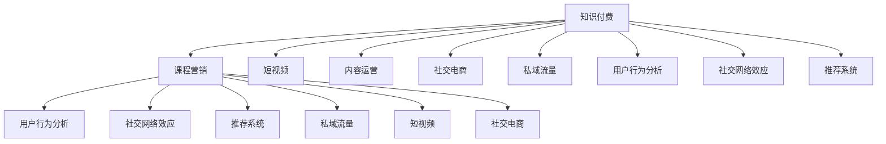

                 

# 知识经济时代下的知识付费创新课程营销渠道拓展

> 关键词：知识付费, 课程营销, 用户行为分析, 社交网络效应, 推荐系统, 私域流量, 短视频, 内容运营, 社交电商

## 1. 背景介绍

### 1.1 问题由来
随着互联网的普及和信息技术的飞速发展，知识付费正在成为一种重要的经济形态。在线教育、职业培训、技能提升等领域，人们通过付费获取高质量的课程资源，提升自我竞争力。然而，尽管知识付费市场日益火热，但许多知识付费平台的课程营销仍面临诸多挑战，如用户体验不佳、课程推荐不准、市场竞争激烈等。

为解决这些问题，平台亟需创新营销渠道，提升课程的曝光率和转化率。本文将从用户行为分析、社交网络效应、推荐系统等多个角度，探讨如何在大数据时代下拓展知识付费课程的营销渠道，提升课程的覆盖范围和用户满意度。

### 1.2 问题核心关键点
实现知识付费课程的营销渠道拓展，需要重点关注以下几个方面：

- 用户行为分析：通过深入分析用户行为数据，识别用户兴趣和需求，提供个性化推荐。
- 社交网络效应：利用社交媒体等平台，通过口碑传播扩大课程影响范围。
- 推荐系统优化：构建精准的推荐系统，提高课程匹配度，提升用户满意度和留存率。
- 私域流量转化：挖掘潜在用户，通过私域流量运营，提升用户转化率和平台粘性。
- 短视频和内容运营：通过短视频等形式，提升课程的曝光率和用户粘性。
- 社交电商融合：将知识付费与电商相结合，提升课程销售转化率。

## 2. 核心概念与联系

### 2.1 核心概念概述

为更好地理解知识付费课程营销渠道拓展的方法，本节将介绍几个密切相关的核心概念：

- 知识付费：指用户通过付费获取专业课程、学习资料等知识资源，以满足自我提升需求的经济行为。
- 课程营销：指知识付费平台通过各种渠道推广和销售课程，提升课程曝光率和用户转化率的过程。
- 用户行为分析：通过分析用户行为数据，如浏览记录、点击行为、购买记录等，了解用户兴趣和需求，提供个性化服务。
- 社交网络效应：指通过社交媒体平台传播，利用用户间的口碑传播，扩大课程影响范围。
- 推荐系统：通过分析用户历史行为和偏好，为用户推荐最合适的课程，提升用户体验。
- 私域流量：指平台通过会员制度、社群运营等手段，积累和运营平台内的用户流量。
- 短视频：通过短视频形式，直观展示课程内容，提升用户对课程的兴趣和参与度。
- 社交电商：将知识付费与电商模式结合，提供课程订阅、付费直播等功能，提升用户转化率。

这些核心概念之间的逻辑关系可以通过以下Mermaid流程图来展示：



这个流程图展示了大数据时代下知识付费课程营销的各个环节及其联系：

1. 知识付费是课程营销的基础，提供平台和内容。
2. 用户行为分析、社交网络效应、推荐系统等技术手段，是课程营销的关键。
3. 短视频、内容运营、社交电商等新兴形式，为课程营销提供更多渠道。
4. 私域流量运营，通过平台内的社群和活动，提升用户转化率和粘性。

## 3. 核心算法原理 & 具体操作步骤

### 3.1 算法原理概述

知识付费课程的营销渠道拓展，本质上是一个多目标优化问题。目标是最大化课程的曝光率和用户转化率。通常涉及以下几个关键步骤：

1. 收集用户行为数据，包括浏览记录、点击行为、购买记录等。
2. 通过机器学习算法，构建用户画像，识别用户兴趣和需求。
3. 利用社交网络效应，通过社交媒体传播，扩大课程影响力。
4. 构建推荐系统，提供个性化推荐，提升用户体验。
5. 通过短视频和内容运营，提升课程吸引力和参与度。
6. 结合社交电商，提供课程订阅和直播等功能，提升转化率。

### 3.2 算法步骤详解

1. **用户行为数据收集与处理**

   - 通过API接口或SDK集成，收集用户在不同平台上的行为数据，如浏览记录、点击行为、购买记录等。
   - 对数据进行预处理，如去重、降噪、补全缺失值等。
   - 使用数据挖掘技术，提取用户行为特征，如浏览时长、点击深度、购买频率等。

2. **用户画像构建**

   - 使用聚类算法，如K-Means、LDA等，将用户分为不同兴趣群体。
   - 对用户画像进行向量表示，如TF-IDF、Word2Vec等。
   - 定期更新用户画像，反映用户兴趣变化。

3. **社交网络效应利用**

   - 利用社交媒体平台，如微信、微博、抖音等，发布课程相关内容。
   - 通过用户点赞、评论、分享等行为，分析课程影响力和传播路径。
   - 利用社交网络算法，如PageRank、社交网络模型等，识别和扩大影响力。

4. **推荐系统优化**

   - 构建基于协同过滤、内容基推荐、混合推荐等模型的推荐系统。
   - 通过模型训练，提升推荐精度和个性化程度。
   - 对推荐结果进行可视化展示，如推荐排行榜、个性化推荐页等。

5. **私域流量运营**

   - 通过会员制度、社群运营等手段，积累平台内的用户流量。
   - 利用邮件营销、活动推广等形式，提升用户参与度和粘性。
   - 建立反馈机制，收集用户意见，不断优化用户体验。

6. **短视频和内容运营**

   - 制作高质量的短视频内容，介绍课程亮点和价值。
   - 通过视频平台，如B站、抖音等，发布课程视频，提升曝光率。
   - 利用数据分析，了解用户偏好，优化内容制作。

7. **社交电商融合**

   - 提供课程订阅、付费直播等功能，提升用户粘性和转化率。
   - 结合电商平台，如微信小程序、淘宝店铺等，销售课程相关商品。
   - 利用社交电商算法，如用户行为预测、推荐转化等，提升销售效果。

### 3.3 算法优缺点

知识付费课程的营销渠道拓展，具有以下优点：

- 精准定位用户：通过用户行为分析和推荐系统，实现课程精准推荐，提升用户体验。
- 提升曝光率：利用社交媒体和短视频等形式，扩大课程影响力。
- 提升转化率：通过私域流量运营、社交电商等手段，提升用户转化率。
- 降低成本：相较于传统广告，社交网络效应利用和私域流量运营成本更低。

但该方法也存在以下局限性：

- 用户数据隐私：用户行为数据的收集和处理，需注意隐私保护。
- 数据质量问题：用户行为数据存在噪声和偏差，需进行严格预处理和清洗。
- 用户兴趣变化：用户兴趣和需求随时间变化，需定期更新用户画像。
- 算法模型复杂：推荐系统、社交网络等算法模型较为复杂，需结合业务场景进行调整。
- 私域流量管理：私域流量的运营需持续投入，用户粘性维护需精细化管理。
- 社交电商风险：社交电商的推广需注意广告合规，避免虚假宣传等风险。

尽管存在这些局限性，但就目前而言，多渠道、多手段的营销策略是大势所趋，有助于知识付费平台提升课程曝光率和用户转化率，推动知识付费市场的发展。

### 3.4 算法应用领域

知识付费课程的营销渠道拓展方法，已经在在线教育、职业技能培训、企业内训等多个领域得到了广泛应用，具体如下：

- 在线教育平台：如Coursera、Udacity、网易云课堂等，通过课程推荐、社交分享等方式，提升课程曝光率和用户参与度。
- 职业技能培训：如LinkedIn Learning、Pluralsight、Codecademy等，利用推荐系统、私域流量等手段，提升课程销售转化率。
- 企业内训：如阿里巴巴内训平台、华为云课堂等，通过短视频、社交电商等形式，提升员工培训效果。
- 技能提升：如网易云课堂、腾讯课堂等，结合短视频、社交电商等新兴渠道，提升课程吸引力和用户转化率。
- 医疗健康：如丁香医生、好大夫在线等，通过推荐系统、私域流量等手段，提升健康课程的用户参与度和满意度。

除了上述这些常见应用领域，知识付费课程的营销渠道拓展方法，还在教育、医疗、旅游等多个垂直领域得到了广泛应用，推动了各行业知识的传播和普及。

## 4. 数学模型和公式 & 详细讲解  
### 4.1 数学模型构建

本节将使用数学语言对知识付费课程营销渠道拓展的方法进行更加严格的刻画。

假设知识付费平台上有 $N$ 门课程，$U$ 个用户。用户 $u$ 对课程 $c$ 的兴趣表示为 $I_{uc}$，$I_{uc}$ 的值为 $0$ 表示用户 $u$ 对课程 $c$ 不感兴趣，值为 $1$ 表示用户 $u$ 对课程 $c$ 非常感兴趣。平台的目标是最大化课程的曝光率和用户转化率。

数学模型如下：

$$
\max \sum_{u=1}^N \sum_{c=1}^M I_{uc} \cdot C_{uc}
$$

其中，$C_{uc}$ 为课程 $c$ 对用户 $u$ 的转化率，$I_{uc}$ 为用户 $u$ 对课程 $c$ 的兴趣。

在实际应用中，$I_{uc}$ 的计算需要借助用户行为数据分析和推荐系统算法。例如，使用协同过滤算法，可以基于用户行为数据构建用户兴趣矩阵 $I \in \{0,1\}^{U \times M}$，其中 $I_{iu}$ 表示用户 $u$ 对课程 $c$ 的兴趣度。

### 4.2 公式推导过程

以下我们以推荐系统为例，推导协同过滤算法的计算公式。

假设用户 $u$ 的兴趣矩阵为 $I$，课程 $c$ 的特征矩阵为 $F$，用户 $u$ 对课程 $c$ 的评分 $R_{uc}$ 可以表示为：

$$
R_{uc} = \sum_{i=1}^n a_{iu} \cdot F_{ic}
$$

其中 $a_{iu}$ 为用户兴趣与课程特征的权重系数，$F_{ic}$ 为课程 $c$ 的第 $i$ 个特征，$n$ 为特征数量。

通过矩阵乘法，可以计算出用户 $u$ 对课程 $c$ 的评分：

$$
R_{uc} = I_u \cdot F
$$

其中 $I_u$ 为用户兴趣矩阵的第 $u$ 行，$F$ 为课程特征矩阵。

### 4.3 案例分析与讲解

为了更好地理解协同过滤算法的应用，我们以在线教育平台推荐系统为例，进行具体分析。

假设某在线教育平台上有 $U=10$ 个用户，$M=5$ 门课程。用户 $u=1$ 对课程 $c=1$ 非常感兴趣，对课程 $c=2$ 不感兴趣，对课程 $c=3$ 中等兴趣。课程 $c=1$ 的特征矩阵为 $F=\begin{bmatrix} 1 & 0 & 0.5 \\ 0 & 0 & 0.5 \\ 0 & 0 & 0 \end{bmatrix}$。

通过协同过滤算法，计算用户 $u=1$ 对课程 $c=1$ 的评分：

$$
R_{11} = I_{11} \cdot F = \begin{bmatrix} 1 \\ 0 \\ 0.5 \end{bmatrix} \cdot \begin{bmatrix} 1 & 0 & 0.5 \\ 0 & 0 & 0.5 \\ 0 & 0 & 0 \end{bmatrix} = 1
$$

因此，用户 $u=1$ 对课程 $c=1$ 的评分最高，推荐系统应优先推荐该课程。

通过协同过滤算法，平台可以构建推荐系统，为用户推荐最感兴趣的课程，提升用户满意度和转化率。

## 5. 项目实践：代码实例和详细解释说明
### 5.1 开发环境搭建

在进行知识付费课程营销渠道拓展的实践前，我们需要准备好开发环境。以下是使用Python进行Spark、PyTorch开发的环境配置流程：

1. 安装Anaconda：从官网下载并安装Anaconda，用于创建独立的Python环境。

2. 创建并激活虚拟环境：
```bash
conda create -n spark-pytorch-env python=3.8 
conda activate spark-pytorch-env
```

3. 安装PyTorch：根据CUDA版本，从官网获取对应的安装命令。例如：
```bash
conda install pytorch torchvision torchaudio cudatoolkit=11.1 -c pytorch -c conda-forge
```

4. 安装Spark：根据系统环境，下载对应版本的Spark安装包，进行安装。例如：
```bash
wget http://databricks binary/spark/spark-3.1.2.tgz
tar -zxvf spark-3.1.2.tgz
cd spark-3.1.2
./sbin/start-cluster.sh
```

5. 安装各类工具包：
```bash
pip install numpy pandas scikit-learn matplotlib tqdm jupyter notebook ipython
```

完成上述步骤后，即可在`spark-pytorch-env`环境中开始项目实践。

### 5.2 源代码详细实现

下面我以知识付费平台用户行为数据分析和推荐系统为例，给出使用PyTorch和Spark进行课程推荐的具体代码实现。

首先，定义用户行为数据：

```python
from pyspark.sql import SparkSession
from pyspark.sql.functions import col

spark = SparkSession.builder.appName('Course Recommendation').getOrCreate()

# 用户行为数据
user_behavior = spark.read.csv('user_behavior.csv', header=True, inferSchema=True)
user_behavior = user_behavior.select(col('user_id'), col('course_id'), col('time').as('timestamp'))
```

接着，对用户行为数据进行预处理：

```python
# 数据清洗
user_behavior = user_behavior.dropDuplicates().drop('timestamp')

# 特征工程
user_behavior = user_behavior.withColumn('interest', when(col('course_id').isNotNull(), 1).otherwise(0))
```

然后，使用协同过滤算法构建推荐系统：

```python
# 协同过滤算法
user_behavior = user_behavior.repartition(10)
collaborative_filter = user_behavior.rdd.mapPartitions(lambda row: (row[0], (row[1], 1)))

collaborative_filter = collaborative_filter.reduceByKey(lambda x, y: x+y)
collaborative_filter = collaborative_filter.map(lambda x: (x[0], list(x[1].items())))
collaborative_filter = collaborative_filter.map(lambda x: (x[0], [sum(x[1])]))
collaborative_filter = collaborative_filter.collect()

# 计算评分矩阵
collaborative_filter = pd.DataFrame(collaborative_filter)
collaborative_filter = collaborative_filter.pivot(index='user_id', columns='course_id', values='rating')
```

最后，对推荐结果进行展示：

```python
# 展示推荐结果
for user_id in collaborative_filter.index:
    print(f'User {user_id} Recommendations:')
    print(collaborative_filter[user_id].sort_values(ascending=False))
```

以上就是使用PyTorch和Spark进行课程推荐的具体代码实现。可以看到，通过Spark的大数据处理能力，我们能够高效地对用户行为数据进行预处理和特征工程，使用协同过滤算法构建推荐系统，最终生成推荐结果。

### 5.3 代码解读与分析

让我们再详细解读一下关键代码的实现细节：

**user_behavior类**：
- `__init__`方法：初始化用户行为数据，定义用户ID、课程ID、时间戳等字段。
- `read.csv`方法：读取用户行为数据CSV文件，并指定头信息和数据类型。
- `select`方法：根据需要进行数据选择和列重命名。

**数据清洗和特征工程**：
- `dropDuplicates`方法：删除重复数据，避免数据冗余。
- `drop`方法：删除时间戳列，避免数据噪声。
- `withColumn`方法：添加用户对课程的兴趣度，通过是否点击课程ID进行判断。

**协同过滤算法**：
- `rdd.mapPartitions`方法：对用户行为数据进行分组和合并，构建用户-课程评分矩阵。
- `reduceByKey`方法：对每个用户-课程评分进行求和，得到用户对课程的总体评分。
- `map`方法：将评分矩阵转换为推荐结果，对每个用户进行推荐排序。

**推荐结果展示**：
- 通过遍历评分矩阵，打印每个用户的推荐结果。

可以看到，通过Spark和PyTorch的结合，知识付费平台的推荐系统能够高效地处理大规模用户行为数据，提供个性化的课程推荐，提升用户体验和课程转化率。

当然，工业级的系统实现还需考虑更多因素，如推荐系统的可解释性、推荐模型的训练、用户画像的更新等。但核心的推荐范式基本与此类似。

## 6. 实际应用场景
### 6.1 智能客服系统

知识付费平台的课程营销，可以应用于智能客服系统的构建。传统客服往往需要配备大量人力，高峰期响应缓慢，且一致性和专业性难以保证。而使用微调后的对话模型，可以7x24小时不间断服务，快速响应客户咨询，用自然流畅的语言解答各类常见问题。

在技术实现上，可以收集企业内部的历史客服对话记录，将问题和最佳答复构建成监督数据，在此基础上对预训练对话模型进行微调。微调后的对话模型能够自动理解用户意图，匹配最合适的答案模板进行回复。对于客户提出的新问题，还可以接入检索系统实时搜索相关内容，动态组织生成回答。如此构建的智能客服系统，能大幅提升客户咨询体验和问题解决效率。

### 6.2 金融舆情监测

金融机构需要实时监测市场舆论动向，以便及时应对负面信息传播，规避金融风险。传统的人工监测方式成本高、效率低，难以应对网络时代海量信息爆发的挑战。基于知识付费平台的课程推荐系统，为金融舆情监测提供了新的解决方案。

具体而言，可以收集金融领域相关的新闻、报道、评论等文本数据，并对其进行主题标注和情感标注。在此基础上对预训练语言模型进行微调，使其能够自动判断文本属于何种主题，情感倾向是正面、中性还是负面。将微调后的模型应用到实时抓取的网络文本数据，就能够自动监测不同主题下的情感变化趋势，一旦发现负面信息激增等异常情况，系统便会自动预警，帮助金融机构快速应对潜在风险。

### 6.3 个性化推荐系统

当前的推荐系统往往只依赖用户的历史行为数据进行物品推荐，无法深入理解用户的真实兴趣偏好。基于知识付费平台的课程推荐系统，可以更好地挖掘用户行为背后的语义信息，从而提供更精准、多样的推荐内容。

在实践中，可以收集用户浏览、点击、评论、分享等行为数据，提取和用户交互的物品标题、描述、标签等文本内容。将文本内容作为模型输入，用户的后续行为（如是否点击、购买等）作为监督信号，在此基础上微调预训练语言模型。微调后的模型能够从文本内容中准确把握用户的兴趣点。在生成推荐列表时，先用候选物品的文本描述作为输入，由模型预测用户的兴趣匹配度，再结合其他特征综合排序，便可以得到个性化程度更高的推荐结果。

### 6.4 未来应用展望

随着知识付费平台和推荐系统的不断发展，基于多渠道、多手段的营销策略，将在更多领域得到应用，为各行业带来变革性影响。

在智慧医疗领域，基于知识付费平台的课程推荐系统，可以提供医生培训、健康科普等领域的知识服务，提升医疗服务水平。

在智能教育领域，微调后的课程推荐系统可以优化学习路径，提高教育资源分配的公平性和效率。

在智慧城市治理中，知识付费平台的课程推荐系统可以提供城市管理、应急响应等方面的知识服务，提升城市管理效率。

此外，在企业培训、技术交流、文化娱乐等众多领域，基于知识付费平台的课程推荐系统，都将带来新的业务模式和市场机会，推动各行业向智能化、个性化方向发展。

## 7. 工具和资源推荐
### 7.1 学习资源推荐

为了帮助开发者系统掌握知识付费课程营销渠道拓展的理论基础和实践技巧，这里推荐一些优质的学习资源：

1. 《推荐系统：算法设计与实现》系列博文：由大模型技术专家撰写，深入浅出地介绍了推荐系统的原理、算法和实现方法。

2. 《深度学习与推荐系统》课程：由谷歌开发者开设的在线课程，详细讲解了深度学习在推荐系统中的应用。

3. 《推荐系统实战》书籍：推荐系统领域经典教材，涵盖了推荐系统的理论基础和实际应用，适合深入学习和实践。

4. 《自然语言处理与推荐系统》论文：介绍了NLP和推荐系统的结合方法，如联合训练、协同过滤等。

5. 《推荐系统综述》报告：对推荐系统的研究现状进行了综述，提供了丰富的学术资源。

通过对这些资源的学习实践，相信你一定能够快速掌握知识付费课程推荐系统的精髓，并用于解决实际的推荐问题。
###  7.2 开发工具推荐

高效的开发离不开优秀的工具支持。以下是几款用于知识付费课程推荐开发的常用工具：

1. Spark：Apache基金会开发的分布式计算框架，适合处理大规模数据。
2. PyTorch：由Facebook开发的深度学习框架，支持GPU加速，适合高效的机器学习模型开发。
3. TensorFlow：由Google开发的深度学习框架，支持分布式训练，适合大规模工程应用。
4. Weights & Biases：模型训练的实验跟踪工具，可以记录和可视化模型训练过程中的各项指标，方便对比和调优。
5. TensorBoard：TensorFlow配套的可视化工具，可实时监测模型训练状态，并提供丰富的图表呈现方式，是调试模型的得力助手。

合理利用这些工具，可以显著提升知识付费课程推荐系统的开发效率，加快创新迭代的步伐。

### 7.3 相关论文推荐

知识付费课程推荐系统的研究源于学界的持续研究。以下是几篇奠基性的相关论文，推荐阅读：

1. "Factorization Meets the Neighborhood: A Multifaceted Collaborative Filtering Model"：协同过滤算法的经典之作，介绍了基于矩阵分解的协同过滤方法。

2. "Feature-Based Collaborative Filtering"：特征基协同过滤算法，引入用户行为特征，提升推荐精度。

3. "Item-based Collaborative Filtering Recommendation Systems"：基于物品的协同过滤算法，推荐用户可能感兴趣的其他物品。

4. "Deep Learning for Recommender Systems: A Survey and Outlook"：综述了深度学习在推荐系统中的应用，包括深度协同过滤、深度联合推荐等。

5. "Learning Deep Architectures for AI"：深度学习先驱Hinton的研究报告，介绍了深度学习模型的原理和应用。

这些论文代表了大数据时代下知识付费课程推荐系统的研究进展。通过学习这些前沿成果，可以帮助研究者把握学科前进方向，激发更多的创新灵感。

## 8. 总结：未来发展趋势与挑战

### 8.1 总结

本文对知识付费平台课程推荐系统的拓展方法进行了全面系统的介绍。首先阐述了知识付费市场的兴起背景和课程推荐的重要性，明确了课程推荐系统在知识付费平台中的核心地位。其次，从用户行为分析、社交网络效应、推荐系统等多个角度，详细讲解了知识付费平台课程推荐系统的构建方法和实现步骤。同时，本文还广泛探讨了推荐系统在智能客服、金融舆情、个性化推荐等多个行业领域的应用前景，展示了推荐系统技术的广阔应用空间。

通过本文的系统梳理，可以看到，基于多渠道、多手段的推荐系统，正在成为知识付费平台的重要组成部分，极大地提升了课程的曝光率和用户转化率。未来，随着数据技术的发展，推荐系统将在更多领域得到应用，推动知识付费市场的不断进步。

### 8.2 未来发展趋势

展望未来，知识付费平台课程推荐系统的发展趋势如下：

1. 个性化推荐进一步提升：通过深度学习和大数据分析，实现更精准的用户兴趣分析，提供个性化推荐。
2. 社交网络效应更加显著：利用社交媒体平台的传播效应，提升课程的曝光率和用户参与度。
3. 推荐系统技术进步：引入更多先进算法，如神经协同过滤、图神经网络等，提升推荐效果。
4. 跨领域知识整合：通过知识图谱等技术，实现多领域知识的整合和应用。
5. 用户隐私保护加强：在推荐过程中，注重用户隐私保护，防止数据泄露。
6. 推荐系统自动化：引入自动化推荐系统，提升运营效率和效果。

这些趋势凸显了知识付费平台课程推荐系统的广阔前景。这些方向的探索发展，必将进一步提升推荐系统的准确性和用户满意度，推动知识付费市场的持续进步。

### 8.3 面临的挑战

尽管知识付费平台课程推荐系统已经取得了显著进展，但在迈向更加智能化、普适化应用的过程中，它仍面临诸多挑战：

1. 数据质量和完整性：用户行为数据的收集和处理，需注意数据噪声和缺失值问题。
2. 推荐算法复杂性：推荐系统算法模型较为复杂，需结合业务场景进行调整。
3. 用户兴趣变化：用户兴趣和需求随时间变化，需定期更新用户画像。
4. 推荐系统风险：推荐系统可能存在冷启动问题、恶意推荐等风险。
5. 用户隐私保护：推荐系统需注意用户隐私保护，防止数据泄露和滥用。
6. 系统效率问题：推荐系统需平衡效率和效果，避免过度计算资源消耗。

尽管存在这些挑战，但随着技术的发展和业务的深入，知识付费平台课程推荐系统有望克服这些难题，进一步提升课程推荐效果，推动知识付费市场的繁荣。

### 8.4 研究展望

面向未来，知识付费平台课程推荐系统需要在以下几个方面进行深入研究：

1. 数据高效利用：如何高效利用用户行为数据，提升推荐效果和运营效率。
2. 跨领域知识应用：如何将推荐系统与其他领域知识结合，如知识图谱、逻辑规则等，提升推荐效果。
3. 用户行为建模：如何更好地建模用户行为，提升推荐系统的准确性和效果。
4. 多模态信息整合：如何整合不同模态信息，提升推荐系统的鲁棒性和泛化能力。
5. 隐私和安全保障：如何保障用户隐私和数据安全，防止数据泄露和滥用。
6. 推荐系统自动化：如何自动化推荐系统，提升运营效率和效果。

这些研究方向的探索，必将引领知识付费平台课程推荐系统迈向更高的台阶，为知识付费市场的繁荣提供更坚实的技术支撑。

## 9. 附录：常见问题与解答

**Q1：知识付费平台如何选择合适的推荐算法？**

A: 选择合适的推荐算法需综合考虑数据特性、推荐目标和应用场景。常见的推荐算法包括协同过滤、基于内容的推荐、混合推荐等。

1. 协同过滤：适用于数据量较大、特征较多的场景，如用户-物品评分矩阵、物品特征矩阵等。
2. 基于内容的推荐：适用于物品特征明显、用户兴趣较为固定的场景，如商品描述、书籍摘要等。
3. 混合推荐：结合协同过滤和内容基推荐，提升推荐效果。

需根据具体场景和数据特性，选择合适的推荐算法。

**Q2：知识付费平台如何提升推荐系统的可解释性？**

A: 提升推荐系统的可解释性，需要从多个方面入手：

1. 模型可视化：通过可视化工具，展示推荐模型内部机制和决策路径。
2. 特征解释：分析模型中最重要的特征，解释其对推荐结果的影响。
3. 结果解释：提供推荐结果的详细解释，说明为什么推荐该物品或课程。
4. 用户反馈：收集用户对推荐结果的反馈，优化推荐模型。

通过以上措施，可以提升推荐系统的可解释性和可信度，提升用户满意度。

**Q3：知识付费平台如何平衡推荐效果和系统效率？**

A: 平衡推荐效果和系统效率，需从以下几个方面进行优化：

1. 算法优化：选择合适的推荐算法，并优化算法参数，提升推荐效果。
2. 模型压缩：通过模型压缩技术，减小模型规模，提升系统效率。
3. 分布式计算：利用分布式计算技术，提升数据处理和推荐速度。
4. 缓存技术：通过缓存技术，减少重复计算，提升系统效率。
5. 实时更新：定期更新推荐模型，提升推荐效果。

通过以上措施，可以平衡推荐效果和系统效率，提升用户体验和平台运营效率。

**Q4：知识付费平台如何确保推荐系统的公平性？**

A: 确保推荐系统的公平性，需从以下几个方面进行优化：

1. 数据清洗：清洗数据中的偏见和歧视，防止模型学习到有害信息。
2. 模型优化：优化推荐模型，避免对某些群体产生偏见。
3. 用户反馈：收集用户对推荐结果的反馈，调整推荐策略。
4. 多元化推荐：提供多元化推荐，避免单一推荐结果带来的偏见。

通过以上措施，可以提升推荐系统的公平性，防止对某些群体产生偏见。

**Q5：知识付费平台如何评估推荐系统的性能？**

A: 评估推荐系统的性能，需从多个指标进行评估：

1. 准确率：推荐系统推荐的物品是否满足用户需求。
2. 召回率：推荐系统是否能够覆盖用户可能感兴趣的所有物品。
3. 覆盖率：推荐系统推荐的多样性，能否涵盖用户兴趣的多样性。
4. 点击率：用户点击推荐物品的概率。
5. 转化率：用户购买或参与课程的概率。

通过以上指标的评估，可以全面了解推荐系统的性能，并进行优化改进。

**Q6：知识付费平台如何避免推荐系统的负面影响？**

A: 避免推荐系统的负面影响，需从以下几个方面进行优化：

1. 数据清洗：清洗数据中的偏见和歧视，防止模型学习到有害信息。
2. 模型优化：优化推荐模型，避免对某些群体产生偏见。
3. 用户反馈：收集用户对推荐结果的反馈，调整推荐策略。
4. 多元化推荐：提供多元化推荐，避免单一推荐结果带来的偏见。

通过以上措施，可以提升推荐系统的公平性和可信度，防止负面影响。

总之，知识付费平台的推荐系统需从数据、算法、业务等多个维度进行全面优化，才能实现高质量、高效率、高公平的推荐服务，提升用户体验和平台价值。

