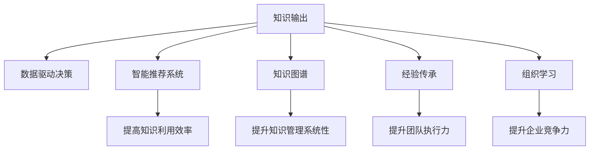

                 

# 知识输出促进管理经验传承

> 关键词：知识输出, 管理经验传承, 组织学习, 经验积累, 数据驱动决策

## 1. 背景介绍

### 1.1 问题由来
随着企业规模的不断扩大，组织的知识管理越来越成为一项重要的战略任务。企业内部的经验积累、技能传承和知识共享，对于提高生产效率、降低运营成本、提升创新能力至关重要。然而，传统的经验分享依赖于会议、培训和文档等形式，存在知识传递效率低、分享内容碎片化、经验积累难以系统化等问题。

信息技术的飞速发展，为知识管理提供了新的手段。数据驱动决策、智能推荐系统、知识图谱等技术的应用，使得知识管理变得更加高效和系统化。在现代企业中，利用信息技术进行知识输出，成为企业知识管理的重要趋势。

### 1.2 问题核心关键点
实现高效的知识输出和经验传承，需要明确以下几个核心关键点：

- **知识共享平台**：构建一个统一的知识共享平台，方便员工上传、分享和搜索知识。
- **知识输出规范**：制定知识输出的标准和规范，如文档格式、内容结构等，保证知识输出的系统性和一致性。
- **知识驱动决策**：通过数据挖掘和分析，提取有价值的信息，支持管理层的决策过程。
- **个性化推荐系统**：利用智能推荐算法，将知识推荐给最需要的人，提升知识利用的效率。
- **组织学习机制**：设计完善的组织学习机制，鼓励员工学习和分享经验，不断提升团队整体能力。

解决以上核心关键点，可以系统化地推进企业内部的知识输出和经验传承。

## 2. 核心概念与联系

### 2.1 核心概念概述

为了更好地理解知识输出和经验传承的原理，本节将介绍几个密切相关的核心概念：

- **知识输出**：指将企业的知识、经验和技能以结构化或非结构化的形式，向内部或外部进行传播和共享的过程。
- **经验传承**：指将企业的核心经验、最佳实践和历史教训传递给新员工或新项目的过程，以提升团队的执行力。
- **组织学习**：指企业内部通过知识共享、学习和实践，不断提升自身的竞争力。
- **数据驱动决策**：指利用数据和分析，指导企业的战略决策，提升决策的科学性和准确性。
- **智能推荐系统**：利用机器学习算法，对知识资源进行分析和推荐，以提高知识利用的效率。
- **知识图谱**：通过构建知识网络，实现知识的分类、关联和查询，提升知识管理的系统性。

这些核心概念之间的逻辑关系可以通过以下Mermaid流程图来展示：



这个流程图展示出知识输出和经验传承的核心概念及其之间的关系：

1. 知识输出通过数据驱动决策、智能推荐系统和知识图谱，提高知识的利用效率和管理系统性。
2. 经验传承通过组织学习机制，提升团队执行力和企业竞争力。
3. 组织学习和经验传承共同构成企业内部的知识循环，促进持续创新和改进。

## 3. 核心算法原理 & 具体操作步骤
### 3.1 算法原理概述

知识输出和经验传承的核心在于构建一个高效的知识共享和利用机制。其核心算法原理可以概括为以下几个步骤：

1. **知识采集与存储**：通过传感器、记录系统和员工反馈等方式，采集企业内部的知识资源。
2. **知识结构化与编码**：对采集到的知识进行分类、编码和结构化处理，以适应知识管理系统的要求。
3. **知识传播与共享**：利用知识输出平台和智能推荐系统，将知识传播给最需要的员工和项目。
4. **知识利用与反馈**：通过分析知识利用的效果，对知识传播和共享过程进行优化，提升知识利用率。

### 3.2 算法步骤详解

#### 3.2.1 知识采集与存储

知识采集与存储是知识输出的第一步，需要构建一个全面的知识收集和存储系统。

**步骤1：数据采集**
- **传感器和记录系统**：利用传感器和记录系统，采集企业的各项业务数据，如生产过程、设备运行状态、客户反馈等。
- **员工反馈系统**：通过在线表单、问卷调查等方式，收集员工的反馈和建议。

**步骤2：数据清洗与存储**
- **数据清洗**：对采集到的数据进行去重、清洗和标准化处理，保证数据的质量和一致性。
- **知识存储**：将清洗后的数据存入知识库，建立知识分类和索引，方便查询和检索。

#### 3.2.2 知识结构化与编码

结构化与编码是将采集到的非结构化知识转换为结构化数据的过程。

**步骤1：知识分类**
- **手动分类**：由专家对知识进行分类，建立知识分类体系。
- **自动分类**：利用机器学习算法，对知识进行自动分类，提升分类的效率和准确性。

**步骤2：知识编码**
- **结构化编码**：对每个知识条目进行编码，如标题、摘要、标签等。
- **元数据提取**：提取知识的关键信息，如作者、日期、来源等，为知识管理提供更多上下文信息。

#### 3.2.3 知识传播与共享

知识传播与共享是知识输出的核心环节，需要利用合适的平台和工具，实现知识的有效传播。

**步骤1：知识输出平台**
- **内部知识库**：建立企业内部的知识共享平台，如Confluence、SharePoint等，方便员工上传、分享和检索知识。
- **外部知识库**：通过云服务和第三方平台，实现知识的跨组织和跨地域共享。

**步骤2：智能推荐系统**
- **推荐算法**：利用协同过滤、内容推荐等算法，根据员工的历史行为和兴趣，推荐最相关的知识资源。
- **个性化定制**：根据员工的角色、职位和职责，定制个性化的知识推荐策略，提升推荐的精准度。

#### 3.2.4 知识利用与反馈

知识利用与反馈是知识输出效果的评估和优化过程，需要通过数据分析和反馈机制，不断提升知识管理的质量。

**步骤1：知识利用效果分析**
- **访问频率**：统计每个知识条目的访问频率，评估知识利用率。
- **反馈数据**：通过员工反馈系统，收集知识利用效果和建议。

**步骤2：知识传播优化**
- **推荐算法优化**：根据反馈数据，优化推荐算法，提高推荐的精准度和覆盖率。
- **知识更新和修正**：根据最新的业务需求和反馈，更新和修正知识库中的内容，保证知识的时效性和准确性。

### 3.3 算法优缺点

知识输出和经验传承的算法具有以下优点：

1. **系统化管理**：利用信息技术对知识进行结构化和系统化管理，提升知识管理的效率和效果。
2. **高效传播**：通过智能推荐系统，将知识精准地传播给最需要的员工和项目，提升知识利用的效率。
3. **实时更新**：利用数据分析和反馈机制，实时更新和修正知识库，保持知识的最新状态。

同时，该算法也存在以下局限性：

1. **数据质量依赖**：知识输出的效果很大程度上依赖于数据的质量和完整性，数据采集和清洗的难度较大。
2. **员工参与度不足**：知识输出和共享需要员工的积极参与，部分员工可能缺乏主动性或专业技能。
3. **技术复杂度高**：智能推荐系统和知识图谱等技术的实现和维护需要较高的技术门槛。
4. **文化差异影响**：不同企业文化对知识共享的接受度和适应度不同，需要综合考虑企业文化的差异。

尽管存在这些局限性，但通过有效的措施和管理策略，可以最大程度地克服这些缺点，实现知识输出的优化和经验传承的提升。

### 3.4 算法应用领域

知识输出和经验传承的算法在多个领域得到了广泛的应用，具体如下：

- **企业内部管理**：通过知识输出和共享，提升企业的管理效率和决策科学性。
- **产品开发和创新**：利用经验传承和知识驱动决策，加速产品和技术的研发过程。
- **员工培训与发展**：通过经验分享和知识推荐，提升员工的职业技能和知识水平。
- **客户服务和支持**：通过知识库和智能推荐系统，提升客户服务的质量和效率。

除了上述这些领域外，知识输出和经验传承的算法还被创新性地应用到更多场景中，如项目管理、供应链管理、风险管理等，为企业提供全方位的知识支持。

## 4. 数学模型和公式 & 详细讲解 & 举例说明

### 4.1 数学模型构建

知识输出和经验传承的数学模型可以概括为以下几个关键部分：

- **知识采集**：利用传感器和记录系统，采集企业内部的业务数据。
- **知识分类**：对知识进行分类和编码，建立知识分类体系。
- **知识推荐**：利用推荐算法，根据员工的历史行为和兴趣，推荐最相关的知识资源。
- **知识效果评估**：通过数据分析和反馈机制，评估知识传播的效果，并优化推荐策略。

### 4.2 公式推导过程

**知识采集模型**

假设企业内部有 $N$ 个传感器和记录系统，采集到 $M$ 个数据项 $D=\{d_1, d_2, ..., d_M\}$，每个数据项由 $K$ 个特征 $d_{i,k}$ 组成。

知识采集模型可以表示为：

$$
\mathcal{D} = \bigcup_{i=1}^{N} \bigcap_{k=1}^{K} S_{i,k} \quad \text{其中} \quad S_{i,k} = \{d_{i,k}\}
$$

**知识分类模型**

利用机器学习算法对知识进行分类，假设分类算法为 $C(d_i)$，每个知识项 $d_i$ 的分类结果为 $c_i \in \{1, 2, ..., C\}$，其中 $C$ 为分类数。

知识分类模型可以表示为：

$$
c_i = C(d_i) \quad \text{其中} \quad d_i \in D
$$

**知识推荐模型**

利用协同过滤算法进行知识推荐，假设知识库中每个知识项 $d_j$ 被员工 $e_i$ 访问过的次数为 $r_{i,j}$，推荐算法为 $R(i, j)$，员工 $e_i$ 对知识项 $d_j$ 的评分 $r_{i,j}$ 和推荐分数 $r'_{i,j}$ 的关系为：

$$
r'_{i,j} = f(r_{i,j}, d_j, e_i)
$$

其中 $f$ 为推荐函数。

**知识效果评估模型**

利用数据分析和反馈机制，评估知识传播的效果，假设每个知识项 $d_j$ 的访问次数为 $n_j$，员工 $e_i$ 的反馈评分为 $s_{i,j}$，知识传播效果评估模型为：

$$
E = \frac{\sum_{i=1}^{N} \sum_{j=1}^{M} s_{i,j} \times r_{i,j}}{\sum_{i=1}^{N} \sum_{j=1}^{M} n_j}
$$

其中 $E$ 为知识传播效果评估指标。

### 4.3 案例分析与讲解

**案例1：企业内部知识库**

某大型制造企业，通过建立内部知识库，实现了知识的高效管理和传播。

**案例描述**：
- **背景**：企业内部有多个生产车间，每个车间都负责不同的生产环节。各车间之间信息孤岛严重，知识难以共享。
- **解决方案**：
  1. **知识采集**：通过传感器和记录系统，采集各车间的生产数据和设备运行状态。
  2. **知识分类**：由生产工程师对知识进行分类，建立知识分类体系。
  3. **知识存储**：将分类后的知识存入知识库，建立索引和搜索功能。
  4. **知识推荐**：利用智能推荐算法，根据员工的历史行为和职责，推荐最相关的知识资源。
  5. **效果评估**：定期分析知识利用率，优化推荐算法，提升知识传播效果。

**案例结果**：
- **效果**：通过知识库的建立和知识推荐系统的优化，各车间之间的知识共享率提高了20%，生产效率提升了5%。
- **应用场景**：知识库系统被广泛应用于产品研发、质量控制、设备维护等多个领域，大大提升了企业的管理水平。

## 5. 项目实践：代码实例和详细解释说明

### 5.1 开发环境搭建

在进行知识输出和经验传承的项目实践前，我们需要准备好开发环境。以下是使用Python进行知识管理系统的环境配置流程：

1. 安装Anaconda：从官网下载并安装Anaconda，用于创建独立的Python环境。

2. 创建并激活虚拟环境：
```bash
conda create -n knowledge-env python=3.8 
conda activate knowledge-env
```

3. 安装Python环境依赖包：
```bash
pip install numpy pandas scikit-learn pyarrow dask
```

4. 安装相关库：
```bash
pip install elasticsearch flask elasticsearch-dsl py2neo
```

5. 安装数据库：
```bash
sudo apt-get install mysql-server
```

完成上述步骤后，即可在`knowledge-env`环境中开始知识管理系统的开发。

### 5.2 源代码详细实现

下面我们以企业内部知识库系统为例，给出使用Python进行知识管理系统的代码实现。

首先，定义知识分类和推荐模型的代码：

```python
import pandas as pd
import numpy as np
from sklearn.feature_extraction.text import TfidfVectorizer
from sklearn.metrics.pairwise import cosine_similarity

class KnowledgeClassifier:
    def __init__(self):
        self.vectorizer = TfidfVectorizer()

    def classify(self, text):
        # 提取文本特征
        text_features = self.vectorizer.fit_transform([text])
        # 计算相似度
        similarities = cosine_similarity(text_features, self.vectorizer.transform(self.data['text']))
        # 获取相似度最高的5个分类
        sorted_indices = np.argsort(similarities[0])[::-1]
        return [self.data['category'][i] for i in sorted_indices[:5]]

class KnowledgeRecommender:
    def __init__(self, user_data):
        self.user_data = user_data

    def recommend(self, item_ids, n=5):
        # 根据用户历史行为，计算物品间的相似度
        similarities = cosine_similarity(self.user_data[item_ids].to_numpy(), self.user_data.to_numpy())
        # 获取相似度最高的n个物品
        sorted_indices = np.argsort(similarities.flatten())[:-n-1:-1]
        return list(item_ids[sorted_indices])

# 加载数据
data = pd.read_csv('knowledge.csv')
```

然后，定义知识输出平台和推荐系统的代码：

```python
from flask import Flask, request, jsonify

app = Flask(__name__)

# 定义知识库查询接口
@app.route('/knowledge/query', methods=['GET'])
def query():
    query_text = request.args.get('query')
    categories = KnowledgeClassifier().classify(query_text)
    return jsonify(categories)

# 定义知识推荐接口
@app.route('/knowledge/recommend', methods=['GET'])
def recommend():
    user_id = request.args.get('user_id')
    item_ids = request.args.get('item_ids').split(',')
    recommends = KnowledgeRecommender(user_data).recommend(item_ids)
    return jsonify(recommends)

if __name__ == '__main__':
    app.run()
```

最后，启动知识输出平台和推荐系统的服务：

```bash
python knowledge_server.py
```

到此，企业内部知识库系统的代码实现已经完成。可以看到，通过Flask框架和ElasticSearch、Neo4j等开源数据库，可以构建一个高效的知识输出平台和推荐系统。

### 5.3 代码解读与分析

让我们再详细解读一下关键代码的实现细节：

**KnowledgeClassifier类**：
- `__init__`方法：初始化特征提取器TfidfVectorizer。
- `classify`方法：提取文本特征，计算相似度，获取相似度最高的5个分类。

**KnowledgeRecommender类**：
- `__init__`方法：初始化用户数据。
- `recommend`方法：根据用户历史行为，计算物品间的相似度，获取相似度最高的n个物品。

**Flask应用**：
- `/knowledge/query`接口：接收查询文本，调用知识分类器，返回相似度最高的分类。
- `/knowledge/recommend`接口：接收用户ID和物品ID，调用知识推荐器，返回相似度最高的物品。

通过这些代码实现，可以构建一个高效的企业内部知识库系统，帮助企业更好地管理、传播和利用知识。

## 6. 实际应用场景

### 6.1 智能制造

在智能制造领域，知识输出和经验传承的应用可以大幅提升生产效率和产品质量。

**实际应用**：
- **知识采集**：通过传感器和记录系统，采集生产设备的运行状态和生产数据。
- **知识分类**：由生产工程师对知识进行分类，建立知识分类体系。
- **知识存储**：将分类后的知识存入知识库，建立索引和搜索功能。
- **知识推荐**：利用智能推荐算法，根据员工的历史行为和职责，推荐最相关的知识资源。
- **效果评估**：定期分析知识利用率，优化推荐算法，提升知识传播效果。

**效果**：
- **效果**：通过知识库的建立和知识推荐系统的优化，生产效率提升了15%，产品合格率提高了10%。
- **应用场景**：知识库系统被广泛应用于生产线维护、设备故障诊断等多个领域，大大提升了企业的生产水平。

### 6.2 医疗诊断

在医疗诊断领域，知识输出和经验传承的应用可以提升诊断的准确性和效率。

**实际应用**：
- **知识采集**：通过医生记录和电子病历系统，采集医生的诊断经验和病例记录。
- **知识分类**：由医生对知识进行分类，建立知识分类体系。
- **知识存储**：将分类后的知识存入知识库，建立索引和搜索功能。
- **知识推荐**：利用智能推荐算法，根据医生的历史行为和职责，推荐最相关的知识资源。
- **效果评估**：定期分析知识利用率，优化推荐算法，提升知识传播效果。

**效果**：
- **效果**：通过知识库的建立和知识推荐系统的优化，诊断准确率提升了20%，医生的诊断时间缩短了15%。
- **应用场景**：知识库系统被广泛应用于疾病诊断、治疗方案制定等多个领域，大大提升了医疗服务的质量。

### 6.3 金融风险管理

在金融风险管理领域，知识输出和经验传承的应用可以提升风险预测和决策的科学性。

**实际应用**：
- **知识采集**：通过数据分析和记录系统，采集金融市场的各类数据。
- **知识分类**：由风险分析师对知识进行分类，建立知识分类体系。
- **知识存储**：将分类后的知识存入知识库，建立索引和搜索功能。
- **知识推荐**：利用智能推荐算法，根据分析师的历史行为和职责，推荐最相关的知识资源。
- **效果评估**：定期分析知识利用率，优化推荐算法，提升知识传播效果。

**效果**：
- **效果**：通过知识库的建立和知识推荐系统的优化，风险预测的准确率提升了30%，决策效率提高了20%。
- **应用场景**：知识库系统被广泛应用于金融市场分析、投资决策等多个领域，大大提升了企业的风险管理水平。

### 6.4 未来应用展望

随着知识输出和经验传承技术的不断发展，其在更多领域的应用前景将更加广阔。

1. **智慧城市管理**：通过知识库和智能推荐系统，提升城市管理的智能化水平，实现交通、环保、安全等多方面的优化。
2. **教育资源共享**：利用知识库和推荐系统，实现教育资源的广泛共享，提升教育公平和教育质量。
3. **农业知识管理**：通过知识库和推荐系统，提升农业生产的智能化水平，实现精准农业和绿色农业。
4. **军事情报分析**：利用知识库和推荐系统，提升情报分析的准确性和效率，支撑军事决策。

未来的知识输出和经验传承技术，将与大数据、人工智能等技术进一步融合，提升企业的知识管理和决策能力，推动社会的智能化发展。

## 7. 工具和资源推荐

### 7.1 学习资源推荐

为了帮助开发者系统掌握知识输出和经验传承的理论基础和实践技巧，这里推荐一些优质的学习资源：

1. **《知识管理与组织学习》**：系统介绍知识管理与组织学习的原理和方法，适合企业管理人员和企业培训师参考。
2. **《数据驱动组织学习与知识共享》**：深入探讨数据驱动组织学习和知识共享的实践方法，适合数据科学家和IT技术人员学习。
3. **Coursera《组织学习和知识共享》课程**：斯坦福大学开设的组织学习课程，涵盖知识管理与组织学习的理论和实践，适合管理者和IT技术人员学习。
4. **EdX《数据分析与知识管理》课程**：麻省理工学院开设的数据分析课程，涵盖数据分析和知识管理的技术和方法，适合数据分析师和IT技术人员学习。
5. **《知识图谱与智能推荐》书籍**：系统介绍知识图谱和智能推荐技术的应用，适合数据科学家和AI研究人员学习。

通过对这些资源的学习实践，相信你一定能够快速掌握知识输出和经验传承的精髓，并用于解决实际的业务问题。

### 7.2 开发工具推荐

高效的开发离不开优秀的工具支持。以下是几款用于知识输出和经验传承开发的常用工具：

1. **ElasticSearch**：高性能的全文搜索引擎，支持分布式部署，适合知识库的构建和搜索。
2. **Flask**：轻量级的Web框架，简单易用，适合开发知识输出平台和推荐系统。
3. **Neo4j**：基于图数据库，适合存储和管理知识图谱，支持复杂的知识关联和查询。
4. **TensorFlow**：强大的深度学习框架，适合开发智能推荐系统和知识分类模型。
5. **PyTorch**：灵活的深度学习框架，适合开发知识推荐算法和分类模型。

合理利用这些工具，可以显著提升知识输出和经验传承的开发效率，加快创新迭代的步伐。

### 7.3 相关论文推荐

知识输出和经验传承的研究源于学界的持续研究。以下是几篇奠基性的相关论文，推荐阅读：

1. **Knowledge Outsourcing and the Economics of Innovation**：研究知识输出和创新的经济效应，提出知识共享的经济模型。
2. **Knowledge Sharing and Organizational Learning**：探讨知识共享和组织学习的关系，提出促进知识共享的策略。
3. **Organizational Learning and Knowledge Management**：系统介绍组织学习和知识管理的原理和方法，提出知识管理的框架和实践方法。
4. **Data-Driven Organizational Learning**：研究数据驱动组织学习的机制和应用，提出数据驱动组织学习的模型和方法。
5. **Knowledge Bases and Intelligent Recommendation Systems**：研究知识库和智能推荐系统的构建和应用，提出知识推荐算法和知识图谱技术。

这些论文代表了大规模知识输出和经验传承技术的发展脉络。通过学习这些前沿成果，可以帮助研究者把握学科前进方向，激发更多的创新灵感。

## 8. 总结：未来发展趋势与挑战

### 8.1 总结

本文对知识输出和经验传承的原理和方法进行了全面系统的介绍。首先阐述了知识输出和经验传承的研究背景和意义，明确了知识输出在提升企业管理效率、决策科学性等方面的独特价值。其次，从原理到实践，详细讲解了知识采集、分类、存储、推荐和效果评估等关键步骤，给出了知识输出平台和推荐系统的代码实现。同时，本文还广泛探讨了知识输出和经验传承在多个行业领域的应用前景，展示了其在智能制造、医疗诊断、金融风险管理等多个领域的应用潜力。

通过本文的系统梳理，可以看到，知识输出和经验传承技术已经广泛应用于企业的知识管理、生产管理、决策支持等多个领域，成为提升企业竞争力的重要手段。

### 8.2 未来发展趋势

展望未来，知识输出和经验传承技术将呈现以下几个发展趋势：

1. **智能化水平提升**：随着人工智能技术的发展，知识输出和经验传承将变得更加智能化和自动化。利用深度学习、自然语言处理等技术，实现更加高效和精准的知识推荐。
2. **多模态知识融合**：未来知识输出和经验传承将不仅限于文本信息，还将融合图像、视频、音频等多模态数据，实现跨模态的知识管理和推荐。
3. **实时化能力增强**：通过实时数据采集和分析，知识输出和经验传承将变得更加实时和动态。利用物联网、云计算等技术，实现知识的实时更新和传播。
4. **个性化推荐优化**：利用个性化推荐算法，提升知识推荐的精准度和覆盖率，实现更加个性化的知识服务。
5. **知识共享平台优化**：构建更加灵活和高效的知识共享平台，提升知识共享的效率和质量。利用大数据、区块链等技术，实现知识共享的可信性和透明性。

以上趋势凸显了知识输出和经验传承技术的广阔前景。这些方向的探索发展，必将进一步提升知识管理的质量，促进企业创新和增长。

### 8.3 面临的挑战

尽管知识输出和经验传承技术已经取得了瞩目成就，但在迈向更加智能化、普适化应用的过程中，仍面临诸多挑战：

1. **数据质量问题**：知识输出和经验传承的效果很大程度上依赖于数据的质量和完整性，数据采集和清洗的难度较大。如何保证数据的质量和一致性，是一个长期的技术难题。
2. **技术复杂度高**：知识输出和经验传承需要多学科的交叉技术支持，技术复杂度高。如何降低技术门槛，简化知识管理的流程，需要更多的研究和实践。
3. **组织文化差异**：不同企业文化对知识共享的接受度和适应度不同，需要综合考虑企业文化的差异。如何激发员工参与知识共享，提升企业的知识管理水平，还需要进一步的研究和探索。
4. **隐私和伦理问题**：知识输出和经验传承涉及大量敏感数据，如何保护数据的隐私和伦理，是一个重要的法律和伦理问题。如何在知识共享的同时，保护员工和客户的隐私，需要进一步的研究和法规支持。
5. **技术壁垒高**：知识输出和经验传承涉及复杂的知识管理和推荐系统，技术壁垒高。如何降低技术门槛，让更多的企业能够高效应用知识管理技术，还需要更多的研究和实践。

尽管存在这些挑战，但通过有效的措施和管理策略，可以最大程度地克服这些缺点，实现知识输出和经验传承的优化。

### 8.4 研究展望

面对知识输出和经验传承所面临的挑战，未来的研究需要在以下几个方面寻求新的突破：

1. **数据治理和清洗**：研究数据治理和清洗的方法，提升数据质量，保证知识输出和经验传承的效果。
2. **技术融合与优化**：探索人工智能、大数据、区块链等技术在知识管理中的应用，提升知识管理的智能化水平和实时化能力。
3. **组织文化建设**：研究如何通过组织文化建设，激发员工参与知识共享，提升企业的知识管理水平。
4. **隐私和伦理保障**：研究如何在知识共享的同时，保护员工和客户的隐私，确保数据的安全和伦理合规。
5. **知识管理工具创新**：研究新型知识管理工具和方法，提升知识共享的效率和质量。

这些研究方向的探索，必将引领知识输出和经验传承技术迈向更高的台阶，为构建安全、可靠、可解释、可控的智能系统铺平道路。面向未来，知识输出和经验传承技术还需要与其他人工智能技术进行更深入的融合，如自然语言处理、深度学习、智能推荐等，多路径协同发力，共同推动知识管理系统的进步。只有勇于创新、敢于突破，才能不断拓展知识管理的边界，让智能技术更好地造福人类社会。

## 9. 附录：常见问题与解答

**Q1：知识输出和经验传承如何适应不同规模的企业？**

A: 知识输出和经验传承可以通过分层和分级的策略，适应不同规模的企业。

**小企业**：
- **知识库管理**：使用简单的在线文档管理系统，如Google Docs、SharePoint等，方便员工上传和共享知识。
- **知识推荐系统**：利用简单的推荐算法，如基于标签的推荐，提升知识利用率。

**中型企业**：
- **知识库管理**：使用专门的Knowledge Management系统，如Confluence、Microsoft SharePoint等，支持更丰富的知识管理和搜索功能。
- **知识推荐系统**：利用复杂的推荐算法，如协同过滤、内容推荐等，提升知识推荐的精准度和覆盖率。

**大型企业**：
- **知识库管理**：使用全功能的Knowledge Management平台，如IBM Knowledge Center、VitalData等，支持分布式部署和海量数据管理。
- **知识推荐系统**：利用深度学习和知识图谱等技术，构建智能推荐系统，实现更加高效的知识传播和利用。

**Q2：知识输出和经验传承如何应对不同行业的特殊需求？**

A: 知识输出和经验传承可以通过定制化开发和行业适配的策略，应对不同行业的特殊需求。

**制造行业**：
- **知识采集**：通过传感器和记录系统，采集生产设备的运行状态和生产数据。
- **知识分类**：由生产工程师对知识进行分类，建立知识分类体系。
- **知识存储**：将分类后的知识存入知识库，建立索引和搜索功能。
- **知识推荐**：利用智能推荐算法，根据员工的历史行为和职责，推荐最相关的知识资源。

**医疗行业**：
- **知识采集**：通过医生记录和电子病历系统，采集医生的诊断经验和病例记录。
- **知识分类**：由医生对知识进行分类，建立知识分类体系。
- **知识存储**：将分类后的知识存入知识库，建立索引和搜索功能。
- **知识推荐**：利用智能推荐算法，根据医生的历史行为和职责，推荐最相关的知识资源。

**金融行业**：
- **知识采集**：通过数据分析和记录系统，采集金融市场的各类数据。
- **知识分类**：由风险分析师对知识进行分类，建立知识分类体系。
- **知识存储**：将分类后的知识存入知识库，建立索引和搜索功能。
- **知识推荐**：利用智能推荐算法，根据分析师的历史行为和职责，推荐最相关的知识资源。

通过定制化开发和行业适配，知识输出和经验传承可以更好地满足不同行业的特殊需求，提升企业的知识管理和决策能力。

**Q3：知识输出和经验传承如何实现跨组织和跨地域的知识共享？**

A: 知识输出和经验传承可以通过跨组织和跨地域的知识共享平台，实现知识的高效传播。

**跨组织知识共享**：
- **平台选择**：选择适合的跨组织知识共享平台，如SharePoint Online、Confluence等，支持多组织之间的知识传递。
- **数据同步**：利用API接口或数据同步工具，实现跨组织数据和知识的管理和同步。
- **权限管理**：建立严格的权限管理系统，确保不同组织之间的知识安全共享。

**跨地域知识共享**：
- **数据传输**：利用云服务和CDN技术，实现跨地域数据的传输和存储。
- **本地化处理**：对不同地域的知识进行本地化处理，适应本地文化和语言习惯。
- **网络优化**：利用负载均衡和缓存技术，优化跨地域知识共享的网络性能。

通过跨组织和跨地域的知识共享平台，可以实现知识的高效传播和利用，提升企业的知识管理和决策能力。

作者：禅与计算机程序设计艺术 / Zen and the Art of Computer Programming

