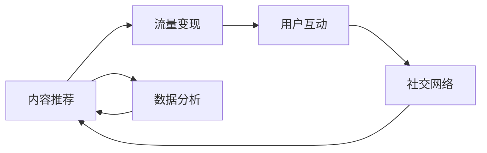

                 

# 短视频平台：注意力经济的新战场

## 1. 背景介绍

随着移动互联网技术的飞速发展，短视频平台已经成为全球用户使用频率最高的应用之一。据统计，截至2022年，全球短视频用户已超过20亿。在短视频平台上，用户通过沉浸式的视听体验，获取各类生活资讯、娱乐信息、专业知识，形成了以内容为核心的新型“注意力经济”。短视频平台成为了数字经济时代信息传播与互动的重要渠道，吸引了大量广告商和品牌商的关注。

短视频平台的兴起，不仅改变了传统媒体的传播方式，也重塑了用户的消费习惯和社交行为。短视频以其短小精悍、生动有趣的特点，迅速占领了用户的碎片化时间，成为新的内容消费和商业变现的重要手段。目前，国内短视频市场主要由抖音（字节跳动）、快手、微视（腾讯）、西瓜视频（阿里）等平台构成，其中抖音以强劲的用户增长和广告收入成为行业领头羊。

## 2. 核心概念与联系

### 2.1 核心概念概述

短视频平台的核心概念包括内容推荐、流量变现、用户互动和社交网络等，这些概念之间具有密切的联系和相互作用。

- **内容推荐**：指平台通过算法模型将内容精准推送给用户，提升用户观看体验和内容消费效率。
- **流量变现**：指平台通过广告、付费会员、电商直播等方式，将用户流量转化为实际收益，实现商业价值。
- **用户互动**：指用户通过点赞、评论、分享等行为参与内容创作和社交交流，形成活跃的用户社区。
- **社交网络**：指平台内用户间通过关注、互相关注、短视频互动等方式，建立起虚拟社交关系网络。

以上概念构成了短视频平台的核心业务架构，相互之间通过数据流和算法模型进行紧密耦合，共同支撑平台的持续运营和生态发展。

### 2.2 核心概念原理和架构的 Mermaid 流程图



在这个架构图中，内容推荐是核心，通过数据分析（如用户行为数据、视频特征等），不断优化推荐算法，精准推送内容，提升用户观看体验和消费效率。流量变现、用户互动和社交网络是内容推荐的具体体现，用户通过互动和社交，形成更强的粘性，从而带动更多流量，实现商业变现。

## 3. 核心算法原理 & 具体操作步骤

### 3.1 算法原理概述

短视频平台的推荐系统主要基于机器学习算法，其中最核心的算法包括协同过滤、基于内容的推荐和深度学习推荐。

- **协同过滤**：通过分析用户的历史行为数据，找到相似用户或相似物品，进行推荐。基于用户-物品的协同矩阵，推荐用户可能感兴趣的物品。
- **基于内容的推荐**：分析用户观看历史中内容的特点（如视频时长、内容类别、标签等），找到用户偏好相似的内容进行推荐。
- **深度学习推荐**：使用深度神经网络对用户行为数据、内容特征和用户画像进行建模，进行精准推荐。

### 3.2 算法步骤详解

#### 3.2.1 数据预处理

1. **用户行为数据收集**：收集用户在平台上的点赞、评论、收藏、观看时长等行为数据。
2. **内容特征提取**：提取视频标题、描述、标签、时长、播放量等特征信息。
3. **用户画像建立**：通过用户的历史行为数据和特征，建立用户画像，包括兴趣偏好、观看习惯等。

#### 3.2.2 模型训练

1. **协同过滤模型训练**：基于用户-物品的协同矩阵，使用矩阵分解技术（如SVD）进行模型训练，找到用户-物品的相关性。
2. **基于内容的推荐模型训练**：通过特征工程和分类算法（如决策树、随机森林）对内容特征进行建模，预测用户对内容的偏好。
3. **深度学习模型训练**：使用深度神经网络（如卷积神经网络、循环神经网络）对用户行为数据和内容特征进行建模，训练推荐模型。

#### 3.2.3 模型评估与调优

1. **评估指标**：使用点击率、转化率、覆盖率等指标评估模型效果。
2. **调优策略**：通过A/B测试、模型参数调整、特征工程改进等方法，不断优化推荐系统。

### 3.3 算法优缺点

#### 3.3.1 算法优点

- **精准推荐**：深度学习推荐系统能够利用丰富的数据和复杂的模型，进行精准的用户兴趣预测和内容匹配。
- **高效性**：基于内容的推荐和协同过滤模型可以在数据稀疏的情况下，快速计算推荐结果。
- **鲁棒性**：深度学习推荐模型对噪声和异常值有较强的鲁棒性，可以应对大规模数据的变化。

#### 3.3.2 算法缺点

- **冷启动问题**：新用户和新内容初始化时，缺乏足够的行为数据，难以进行有效推荐。
- **计算成本高**：深度学习推荐模型需要大量的训练数据和计算资源，训练时间较长。
- **数据隐私风险**：用户行为数据和内容特征的收集和使用，可能涉及隐私保护问题。

### 3.4 算法应用领域

短视频平台的内容推荐系统，已经广泛应用于各类用户行为分析和流量变现场景中，具体包括：

- **个性化推荐**：通过分析用户观看历史和行为特征，提供个性化的内容推荐。
- **广告投放**：基于用户画像和内容特征，进行精准广告投放，提升广告效果。
- **电商直播**：通过推荐算法匹配用户和商品，提升直播商品的曝光率和销售转化率。
- **搜索排序**：在用户输入搜索关键词后，通过推荐算法推荐相关视频，提升搜索体验。

## 4. 数学模型和公式 & 详细讲解 & 举例说明

### 4.1 数学模型构建

短视频平台的内容推荐模型通常基于以下数据构建：

- **用户行为数据**：包括点击、观看、点赞、评论等行为。
- **内容特征数据**：包括视频标题、描述、标签、时长等。
- **用户画像数据**：包括用户基本信息、兴趣偏好等。

推荐模型的目标是通过用户行为和内容特征，预测用户对某视频的兴趣，输出推荐结果。

### 4.2 公式推导过程

假设用户-物品的相关性可以用协同矩阵 $C \in \mathbb{R}^{n \times m}$ 表示，其中 $n$ 为物品数量，$m$ 为用户数量。设用户 $u$ 对物品 $i$ 的评分（如观看时长、点赞数等）为 $r_{ui}$。协同过滤模型可以表示为：

$$
\hat{r}_{ui} = \sum_{j=1}^m \alpha_{uj} \cdot r_{ij}
$$

其中，$\alpha_{uj}$ 为用户 $u$ 对物品 $i$ 的兴趣评分。通过矩阵分解，$\alpha_{uj}$ 可以用奇异值分解（SVD）表示：

$$
\alpha = U \cdot \Sigma \cdot V^T
$$

其中，$U$ 为左奇异向量矩阵，$\Sigma$ 为奇异值矩阵，$V^T$ 为右奇异向量矩阵。

### 4.3 案例分析与讲解

以抖音平台为例，其推荐系统采用了基于内容的推荐和深度学习推荐。抖音通过分析用户的历史观看记录和视频特征，提取用户的兴趣偏好，预测用户对新视频的兴趣。同时，使用深度神经网络对用户行为和内容特征进行建模，提升推荐精度。

抖音的推荐模型主要基于以下步骤：

1. **特征提取**：将用户行为数据和视频特征数据进行特征工程处理，提取有意义的特征向量。
2. **模型训练**：使用深度神经网络对特征向量进行建模，输出预测结果。
3. **模型融合**：将基于内容的推荐和深度学习推荐的预测结果进行融合，得到最终的推荐结果。

抖音在模型训练和推荐过程中，还采用了多任务学习（MTL）和对抗训练（Adversarial Training）等技术，进一步提升了推荐效果和鲁棒性。

## 5. 项目实践：代码实例和详细解释说明

### 5.1 开发环境搭建

要搭建短视频平台推荐系统的开发环境，需要以下工具和库：

1. **Python**：选择3.x版本，安装必要的库和工具。
2. **Pandas**：用于数据处理和分析。
3. **NumPy**：用于数值计算和矩阵运算。
4. **Scikit-learn**：用于特征工程和机器学习模型训练。
5. **TensorFlow或PyTorch**：用于深度学习模型构建和训练。
6. **Flask或FastAPI**：用于搭建Web服务接口，部署推荐模型。

### 5.2 源代码详细实现

以下是一个简单的基于内容的推荐系统示例代码：

```python
import pandas as pd
import numpy as np
from sklearn.ensemble import RandomForestClassifier
from sklearn.metrics import accuracy_score

# 构建用户行为数据集
data = pd.read_csv('user_behavior.csv')

# 提取特征
features = data[['watch_time', 'like_count', 'comment_count']]
labels = data['label']

# 特征工程
features = pd.get_dummies(features)

# 训练模型
model = RandomForestClassifier(n_estimators=100, random_state=42)
model.fit(features, labels)

# 预测
preds = model.predict(features)

# 评估
acc = accuracy_score(labels, preds)
print(f"Accuracy: {acc}")
```

在上述代码中，我们使用随机森林算法对用户行为数据进行建模，并使用Pandas和NumPy进行数据处理和特征工程。最后，通过评估指标（如准确率）评估模型效果。

### 5.3 代码解读与分析

**特征提取**：
- 我们使用`watch_time`、`like_count`、`comment_count`等特征，来表示用户对内容的兴趣。
- 使用`pd.get_dummies`将分类特征转换为独热编码，方便模型处理。

**模型训练**：
- 使用`RandomForestClassifier`构建随机森林模型，并通过`fit`方法进行训练。

**预测与评估**：
- 通过`predict`方法对测试集进行预测，使用`accuracy_score`计算预测准确率。

## 6. 实际应用场景

### 6.1 个性化推荐

个性化推荐是短视频平台的核心功能之一。抖音通过分析用户的行为数据和视频特征，生成个性化推荐列表，提升用户观看体验。以抖音的推荐系统为例，主要流程如下：

1. **数据收集**：收集用户的历史观看记录、点赞、评论等行为数据。
2. **特征提取**：提取视频的标签、时长、观看次数等特征，同时生成用户的兴趣向量。
3. **模型训练**：使用深度神经网络对用户行为数据和视频特征进行建模，预测用户对某视频的兴趣。
4. **推荐生成**：将预测结果和视频特征进行融合，生成个性化推荐列表。

### 6.2 广告投放

短视频平台的广告投放，主要是基于用户的兴趣偏好和观看行为，进行精准广告推荐。以快手平台的广告投放为例，主要流程如下：

1. **数据收集**：收集用户的行为数据和广告特征数据。
2. **模型训练**：使用协同过滤模型对用户-广告的协同矩阵进行建模。
3. **推荐生成**：根据用户画像和广告特征，生成广告推荐列表。

### 6.3 电商直播

电商直播是短视频平台的重要变现手段之一。电商平台通过推荐算法匹配用户和商品，提升直播商品的曝光率和销售转化率。以抖音电商直播为例，主要流程如下：

1. **数据收集**：收集用户的行为数据和商品特征数据。
2. **模型训练**：使用深度神经网络对用户行为数据和商品特征进行建模，生成推荐列表。
3. **直播互动**：通过推荐列表引导用户参与直播，提升直播商品的互动率和销售转化率。

### 6.4 未来应用展望

短视频平台的推荐系统，将在未来的技术发展中继续发挥重要作用。以下几方面将可能带来新的突破：

1. **深度学习模型的演进**：深度学习推荐模型将不断进化，通过更复杂的神经网络结构和大规模训练数据，提升推荐精度和鲁棒性。
2. **多模态融合**：结合视觉、语音、文本等多模态信息，提升推荐系统的理解和匹配能力。
3. **个性化推荐算法**：通过用户行为数据的深度挖掘和分析，生成更加精准的个性化推荐。
4. **隐私保护与伦理**：在推荐算法设计和数据处理过程中，加强隐私保护和伦理约束，确保数据使用的透明性和公正性。

## 7. 工具和资源推荐

### 7.1 学习资源推荐

1. **《深度学习》**：Ian Goodfellow、Yoshua Bengio和Aaron Courville所著的《深度学习》书籍，涵盖了深度学习的基本概念和算法。
2. **Coursera和edX**：提供多种机器学习课程，包括推荐系统、深度学习等，适合初学者和进阶者。
3. **Kaggle**：数据科学竞赛平台，通过实际数据集竞赛，提升推荐系统的实战能力。
4. **知乎、CSDN**：技术社区，提供丰富的技术文章和讨论，帮助理解和应用推荐算法。

### 7.2 开发工具推荐

1. **Python**：Python是推荐系统开发的首选语言，支持丰富的机器学习和深度学习库。
2. **TensorFlow和PyTorch**：主流的深度学习框架，支持高效的神经网络建模和训练。
3. **Scikit-learn**：简单易用的机器学习库，支持多种经典算法和模型。
4. **Flask和FastAPI**：轻量级Web框架，支持快速搭建推荐系统的API接口。
5. **Jupyter Notebook**：交互式开发环境，支持Python代码的快速编写和调试。

### 7.3 相关论文推荐

1. **《ClickBert: Automatic Feature Generation with BERT》**：介绍利用BERT生成推荐特征的方法，提升推荐系统的性能。
2. **《Adaptive Multimodal Recommender System》**：探讨结合视觉、语音、文本等多模态信息，提升推荐系统的理解能力。
3. **《Personalized Recommendation with Deep Learning: A Survey》**：综述深度学习在推荐系统中的应用，提供丰富的理论和实践参考。
4. **《Recommender Systems for Healthcare: A Survey》**：针对医疗领域推荐系统的研究和应用，提供有价值的参考。

## 8. 总结：未来发展趋势与挑战

### 8.1 总结

短视频平台的推荐系统，基于机器学习和大数据技术，通过精准推荐和流量变现，成为数字经济时代的重要内容分发机制。推荐系统的核心算法包括协同过滤、基于内容的推荐和深度学习推荐，能够通过用户行为数据和内容特征，预测用户对视频的兴趣，生成个性化推荐。短视频平台的推荐系统，已经广泛应用于个性化推荐、广告投放、电商直播等场景，推动了内容消费和商业变现的飞速发展。

### 8.2 未来发展趋势

短视频平台推荐系统的未来发展趋势包括：

1. **深度学习模型的演进**：随着算力提升和数据量的增加，深度学习模型将更加复杂和精确，提升推荐系统的性能。
2. **多模态融合**：结合视觉、语音、文本等多模态信息，提升推荐系统的理解能力和匹配精度。
3. **个性化推荐算法**：通过用户行为数据的深度挖掘和分析，生成更加精准的个性化推荐。
4. **隐私保护与伦理**：在推荐算法设计和数据处理过程中，加强隐私保护和伦理约束，确保数据使用的透明性和公正性。

### 8.3 面临的挑战

短视频平台推荐系统面临的挑战包括：

1. **计算资源消耗**：深度学习推荐模型需要大量的计算资源和存储空间，训练时间和成本较高。
2. **冷启动问题**：新用户和内容初始化时，缺乏足够的行为数据，难以进行有效推荐。
3. **数据隐私风险**：用户行为数据和内容特征的收集和使用，可能涉及隐私保护问题。
4. **模型鲁棒性**：推荐系统需要应对大规模数据的变化，提升模型的鲁棒性。

### 8.4 研究展望

短视频平台推荐系统的未来研究展望包括：

1. **模型压缩与优化**：通过模型压缩、稀疏化存储等技术，提升推荐系统的计算效率和存储效率。
2. **跨模态推荐**：结合视觉、语音、文本等多模态信息，提升推荐系统的理解能力和匹配精度。
3. **隐私保护与伦理**：在推荐算法设计和数据处理过程中，加强隐私保护和伦理约束，确保数据使用的透明性和公正性。
4. **实时推荐与迭代优化**：通过实时数据反馈和迭代优化，提升推荐系统的时效性和精度。

短视频平台推荐系统的发展前景广阔，但同时也面临诸多挑战。通过技术创新和工程实践，不断优化推荐算法和数据处理，提升推荐系统的性能和稳定性，将能够更好地满足用户需求，推动短视频平台和数字经济的持续发展。

## 9. 附录：常见问题与解答

**Q1: 短视频平台推荐系统的主要算法有哪些？**

A: 短视频平台推荐系统的主要算法包括协同过滤、基于内容的推荐和深度学习推荐。协同过滤通过分析用户的历史行为数据，找到相似用户或相似物品，进行推荐。基于内容的推荐通过分析用户观看历史中内容的特点，找到用户偏好相似的内容进行推荐。深度学习推荐使用深度神经网络对用户行为数据和内容特征进行建模，进行精准推荐。

**Q2: 如何优化短视频平台推荐系统的冷启动问题？**

A: 短视频平台推荐系统的冷启动问题可以通过以下方法解决：
1. 利用用户兴趣迁移算法，将新用户引导到相似用户的兴趣内容。
2. 通过预训练模型或预定义标签进行内容推荐，提升新用户的初始体验。
3. 引入专家知识库，通过人工干预和推荐，引导新用户快速建立兴趣偏好。

**Q3: 短视频平台推荐系统如何保护用户隐私？**

A: 短视频平台推荐系统可以通过以下方法保护用户隐私：
1. 匿名化处理：对用户行为数据进行匿名化处理，防止用户信息泄露。
2. 数据加密：对存储和传输的用户数据进行加密，确保数据安全。
3. 用户授权：在收集用户数据前，明确告知用户数据用途，获得用户授权。
4. 隐私保护算法：使用差分隐私、联邦学习等隐私保护算法，减少数据泄露风险。

**Q4: 短视频平台推荐系统的计算资源消耗如何优化？**

A: 短视频平台推荐系统的计算资源消耗可以通过以下方法优化：
1. 模型压缩：通过模型压缩技术，减少模型参数量和计算资源消耗。
2. 模型剪枝：去除不重要的模型层或参数，提升模型计算效率。
3. 分布式训练：利用多机多核计算，加速模型训练过程。
4. 模型缓存：对常用模型进行缓存，减少重复计算。

**Q5: 短视频平台推荐系统如何提高模型的鲁棒性？**

A: 短视频平台推荐系统可以通过以下方法提高模型的鲁棒性：
1. 引入对抗训练：通过对抗样本训练，提高模型的鲁棒性和泛化能力。
2. 多模型集成：构建多个推荐模型，通过模型融合提高系统的稳定性和鲁棒性。
3. 数据增强：通过数据增强技术，提升模型对噪声和异常值的鲁棒性。
4. 模型自适应：通过自适应学习算法，使模型能够快速适应新数据和新场景。

作者：禅与计算机程序设计艺术 / Zen and the Art of Computer Programming

