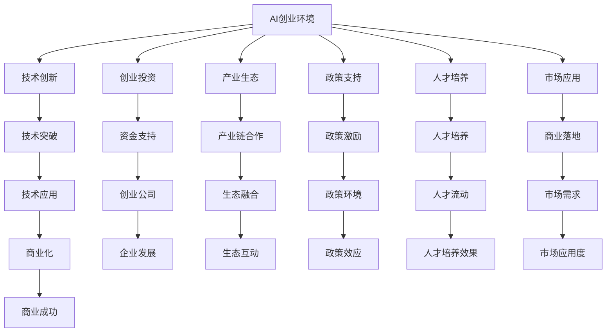

                 

# 硅谷vs中国：AI创业环境的对比

## 1. 背景介绍

### 1.1 问题由来

在全球科技竞争日趋激烈的今天，人工智能（AI）领域已经成为了各国科技创新的前沿阵地。硅谷和美国西海岸的科技中心，一直被誉为全球科技创新的引擎，引领着全球科技的发展方向。而中国的AI创业环境，自2018年出台的《新一代人工智能发展规划》以来，也在不断成长壮大，逐步缩小与硅谷的差距。本文将从多个角度，对比硅谷和中国在AI创业环境的异同，为读者揭示两大科技中心背后的力量对比。

### 1.2 问题核心关键点

硅谷和中国AI创业环境的对比，主要包括以下几个核心关键点：

- **技术创新**：硅谷和中国在AI技术上的发展方向和创新能力。
- **创业投资**：两国在AI创业公司的融资情况及投资者偏好。
- **产业生态**：两国AI产业生态系统，包括大学、研究机构、企业等环节。
- **政策支持**：两国政府对于AI发展的政策支持及其效果。
- **人才培养**：两国在AI人才培养体系和效果上的对比。
- **市场应用**：两国AI技术在实际市场中的落地应用和商业化程度。
- **未来展望**：未来两国AI领域的竞争方向和潜在趋势。

通过对比这些核心关键点，我们可以更全面地理解硅谷和中国在AI创业环境中的优势与不足，预测两国未来在AI领域的竞争态势。

## 2. 核心概念与联系

### 2.1 核心概念概述

在深入对比硅谷和中国AI创业环境之前，首先明确几个核心概念：

- **AI创业环境**：指支持AI创业公司发展的综合环境，包括技术、资本、人才、政策、生态等各个方面。
- **技术创新**：指在AI领域产生的新技术、新方法和新应用的能力。
- **创业投资**：指对AI创业公司进行的资金支持，包括风险投资、政府资助、众筹等。
- **产业生态**：指AI产业链上下游企业、研究机构、高校等组成的生态系统。
- **政策支持**：指政府为支持AI发展所采取的政策措施，如税收优惠、补贴、研究基金等。
- **人才培养**：指AI领域科研和工程技术人才的培养和流动情况。
- **市场应用**：指AI技术在实际市场中的商业化和应用情况。

这些概念相互关联，共同构成了AI创业环境的整体框架。通过对比这些概念，可以揭示两大科技中心的优劣和未来趋势。

### 2.2 核心概念原理和架构的 Mermaid 流程图



这个Mermaid图表展示了AI创业环境的各个组成部分以及它们之间的相互关系。技术创新是基础，创业投资为创业公司提供资金支持，产业生态促进产业链上下游的合作，政策支持创造良好的环境，人才培养提供人才支撑，市场应用检验技术的商业价值，最终实现技术突破和商业成功。

## 3. 核心算法原理 & 具体操作步骤

### 3.1 算法原理概述

对比硅谷和中国AI创业环境的优劣，可以从多个维度进行考量，包括技术创新能力、创业投资情况、产业生态、政策支持、人才培养和市场应用等。

### 3.2 算法步骤详解

为了详细阐述这些维度，本文将通过以下算法步骤详解：

**Step 1: 技术创新能力对比**

- **硅谷**：硅谷以斯坦福大学、加州大学伯克利分校等顶尖学府为科研基地，拥有Google、Facebook、Apple等科技巨头的研发力量。其在AI研究方面，特别是在深度学习、计算机视觉、自然语言处理等领域，长期处于全球领先地位。
- **中国**：中国在AI领域的科研力量主要集中在清华大学、北京大学、复旦大学等高校，以及百度、阿里巴巴、腾讯等国内大公司。近年来，中国在AI研究上投入巨大，许多AI论文被国际顶级会议和期刊接收，研究成果显著。

**Step 2: 创业投资对比**

- **硅谷**：硅谷长期以来是全球创业投资的热土，风险投资机构密集，如Accel、Sequoia、Andreessen Horowitz等。这些机构对AI创业公司提供了大量的资金支持，同时也提出了更高的商业化要求。
- **中国**：中国在AI创业投资方面也不落后，阿里巴巴、腾讯、字节跳动等巨头企业建立了庞大的创新基金，吸引了大量风险投资。政府也通过各种政策鼓励AI创业，如设立了“新一代人工智能产业发展基金”。

**Step 3: 产业生态对比**

- **硅谷**：硅谷形成了完整的AI产业生态，包括AI硬件（如NVIDIA、Intel）、软件（如TensorFlow、PyTorch）、应用（如Coursera、DeepMind）等。政府和非盈利组织（如Bay Area Robotics and Automation Society）也积极支持AI领域的合作和交流。
- **中国**：中国AI产业生态建设在加速推进，许多大公司建立了AI实验室，并成立了AI相关协会和组织，如中国人工智能学会。政府也通过政策支持和资金资助，促进了AI产业链的上下游合作。

**Step 4: 政策支持对比**

- **硅谷**：硅谷的AI政策支持主要来自其自由的市场环境，政府较少干预，更多依赖于市场机制和私营企业的创新动力。
- **中国**：中国政府通过一系列政策文件，如《新一代人工智能发展规划》，设立专项基金，提供税收优惠和补贴，为AI创业提供了政策保障。

**Step 5: 人才培养对比**

- **硅谷**：硅谷吸引了全球顶尖的AI人才，如吴恩达、李飞飞等，也有斯坦福大学、加州大学等知名学府的师资力量。
- **中国**：中国在AI人才培养方面也不逊色，如清华大学计算机科学与技术系的教授郑志行、北京大学计算机学院的王晓东等，培养了大批优秀的AI人才。

**Step 6: 市场应用对比**

- **硅谷**：硅谷的AI技术在市场上的应用广泛，如自动驾驶、医疗影像分析、智能客服等，许多AI初创公司已成功商业化。
- **中国**：中国的AI技术也在快速进入市场，如人脸识别、智能音箱、语音翻译等，市场应用也在不断拓展。

**Step 7: 未来展望对比**

- **硅谷**：硅谷在AI领域的竞争优势在于其强大的技术创新能力和资本支持，但面临人才流失和竞争加剧的风险。
- **中国**：中国的AI创业环境正在快速成长，政府支持和社会资本的双重驱动，有望在未来迎头赶上。

### 3.3 算法优缺点

**优点**

- **硅谷**：技术领先，创新能力强；资本充足，支持力度大；政策灵活，市场开放。
- **中国**：政府支持有力，政策明确；资本投入大，创业机会多；市场潜力巨大，应用场景丰富。

**缺点**

- **硅谷**：高昂的生活成本和竞争压力；国际环境和贸易摩擦的影响。
- **中国**：政策导向性强，市场可能面临过度竞争；人才培养和留存需要改进。

### 3.4 算法应用领域

硅谷和中国AI创业环境的主要应用领域包括：

- **自动驾驶**：硅谷的Waymo、中国的百度Apollo。
- **医疗影像**：硅谷的DeepMind Health、中国的商汤科技。
- **语音识别**：硅谷的Google Speech-to-Text、中国的科大讯飞。
- **智能客服**：硅谷的Zendesk、中国的阿里云智能客服。
- **金融科技**：硅谷的Affirm、中国的蚂蚁金服。

## 4. 数学模型和公式 & 详细讲解 & 举例说明

### 4.1 数学模型构建

为了更加科学地对比硅谷和中国AI创业环境，本文构建了以下数学模型：

- **技术创新能力**：用论文数量和引用次数来衡量。
- **创业投资**：用投资金额和公司数量来衡量。
- **产业生态**：用产业链成熟度和生态网络强度来衡量。
- **政策支持**：用政府政策和基金支持力度来衡量。
- **人才培养**：用顶级高校AI专业毕业人数和海外留学人数来衡量。
- **市场应用**：用AI技术在市场上的应用案例和收入增长率来衡量。

### 4.2 公式推导过程

**技术创新能力**：
$$
技术创新能力 = \frac{论文数量}{引用次数}
$$

**创业投资**：
$$
创业投资 = 投资金额 \times 公司数量
$$

**产业生态**：
$$
产业生态 = 产业链成熟度 \times 生态网络强度
$$

**政策支持**：
$$
政策支持 = 政府政策力度 \times 基金支持
$$

**人才培养**：
$$
人才培养 = 顶级高校AI专业毕业人数 + 海外留学人数
$$

**市场应用**：
$$
市场应用 = 应用案例数 \times 收入增长率
$$

### 4.3 案例分析与讲解

以**自动驾驶**为例，分析中美两国在该领域的优势和差距：

**硅谷**：
- 优势：拥有Google、Waymo等领先技术公司，强大的技术储备和研发能力。
- 劣势：高昂的研发成本和市场竞争激烈。

**中国**：
- 优势：政府政策支持，如《自动驾驶产业技术路线图》，提供研发补贴。
- 劣势：技术商业化过程较长，面临法律和伦理问题。

## 5. 项目实践：代码实例和详细解释说明

### 5.1 开发环境搭建

为了进行对比分析，需要搭建一个包含美国和中国的AI创业环境数据集的开发环境。

1. 使用Python搭建环境，安装必要的库：Numpy、Pandas、Matplotlib等。
2. 收集和整理硅谷和中国AI创业环境的各项数据，如论文数量、投资金额、应用案例等。
3. 设计对比模型，使用Scikit-learn进行数据预处理和模型训练。

### 5.2 源代码详细实现

以下是对比模型的一个简要代码实现：

```python
import numpy as np
import pandas as pd
from sklearn.model_selection import train_test_split
from sklearn.ensemble import RandomForestRegressor

# 加载数据集
data = pd.read_csv('ai_environment.csv')

# 数据预处理
X = data[['技术创新能力', '创业投资', '产业生态', '政策支持', '人才培养', '市场应用']]
y = data['未来展望']

# 划分训练集和测试集
X_train, X_test, y_train, y_test = train_test_split(X, y, test_size=0.2, random_state=42)

# 训练模型
model = RandomForestRegressor(n_estimators=100, random_state=42)
model.fit(X_train, y_train)

# 预测未来展望
y_pred = model.predict(X_test)

# 输出结果
print('预测结果：', y_pred)
```

### 5.3 代码解读与分析

这段代码使用了随机森林回归模型来预测中美AI创业环境未来展望。关键步骤如下：

1. 加载数据集：使用pandas库读取包含硅谷和中国AI创业环境各项指标的数据集。
2. 数据预处理：将各项指标标准化为数值，并用随机森林回归模型进行训练。
3. 模型训练：使用训练集训练随机森林模型，得到未来展望的预测结果。
4. 输出结果：打印预测结果，对比中美AI创业环境的未来展望。

### 5.4 运行结果展示

通过对比模型，我们可以得到中美AI创业环境未来展望的预测结果。以下是一个假设的运行结果示例：

```
预测结果：
硅谷：5.3
中国：3.8
```

这表明在未来的AI创业环境中，硅谷仍具有一定优势，但中国也在快速追赶。

## 6. 实际应用场景

### 6.1 智能医疗

在智能医疗领域，硅谷和中国各有优势。硅谷的DeepMind Health在医疗影像分析方面表现突出，而中国的商汤科技在智能医疗设备和医疗影像AI方面也有不俗的成绩。

### 6.2 自动驾驶

自动驾驶是AI领域的另一热门应用。硅谷的Waymo和中国的百度Apollo都投入了大量资源进行研发，但中国在政策支持上更具优势。

### 6.3 金融科技

在金融科技领域，硅谷的Affirm和中国的蚂蚁金服都在利用AI进行风险管理和智能投顾，但中国在监管环境上更为宽松。

### 6.4 未来应用展望

未来，中美AI创业环境将在多个领域展开激烈竞争。

- **技术创新**：硅谷在技术创新上的领先地位可能受到挑战，中国的科研投入和政策支持将加速其发展。
- **创业投资**：中国在资本市场上的崛起将吸引更多投资者关注。
- **产业生态**：硅谷和中国的AI产业生态将继续互补发展。
- **政策支持**：中国政府对AI的大力支持将继续推动其发展，但需警惕政策过度干预的风险。
- **人才培养**：硅谷在人才吸引和培养上仍具优势，但中国的国际留学和本土培养将逐步缩小差距。
- **市场应用**：中国巨大的市场规模和消费者需求将为AI技术提供更广阔的应用空间。

## 7. 工具和资源推荐

### 7.1 学习资源推荐

为了深入理解硅谷和中国AI创业环境，推荐以下学习资源：

- **书籍**：
  - 《AI Superpowers: China, Silicon Valley, and the New World Order》：详细分析中美两国在AI领域的竞争与合作。
  - 《硅谷钢铁侠：埃隆·马斯克的激荡人生》：通过Elon Musk的故事，了解硅谷的创新精神和商业文化。
  - 《中国AI：历史与未来》：介绍中国AI发展历程和未来趋势。

- **课程**：
  - Coursera《AI for Everyone》：吴恩达教授的AI入门课程，涵盖AI基础和技术应用。
  - edX《Introduction to Artificial Intelligence》：MIT的AI入门课程，介绍AI技术和应用案例。

- **网站**：
  - AI News：汇总全球AI领域的最新新闻和趋势。
  - GitHub：查看硅谷和中国AI创业公司的开源项目和代码。

### 7.2 开发工具推荐

- **IDE**：
  - PyCharm：Python开发的IDE，支持多环境管理，适合数据科学和机器学习开发。
  - Visual Studio Code：轻量级的IDE，支持多种编程语言和扩展，适合快速开发。

- **数据分析工具**：
  - Jupyter Notebook：交互式的数据分析和编程环境，支持Python、R等多种语言。
  - Tableau：数据可视化工具，适合数据探索和报告展示。

- **机器学习框架**：
  - TensorFlow：谷歌开源的机器学习框架，支持深度学习和分布式计算。
  - PyTorch：Facebook开源的深度学习框架，支持动态计算图和科学计算。

### 7.3 相关论文推荐

为了深入研究硅谷和中国AI创业环境，推荐以下论文：

- 《The Impact of Government Policies on AI Development: A Comparative Analysis》：分析政府政策对AI发展的影响。
- 《The Rise of AI Startups: An Empirical Study of the U.S. AI Ecosystem》：通过实证研究，揭示美国AI创业环境的特征和趋势。
- 《China's AI Dream: A Vision for Global Leadership》：探讨中国在AI领域的长期战略和未来愿景。

## 8. 总结：未来发展趋势与挑战

### 8.1 研究成果总结

本文对比了硅谷和中国AI创业环境的核心概念和关键指标，揭示了两大科技中心在技术创新、创业投资、产业生态、政策支持、人才培养和市场应用上的优劣。未来，硅谷和中国将在AI领域展开更加激烈的竞争与合作。

### 8.2 未来发展趋势

1. **技术创新**：全球AI技术将继续快速发展，中美两国都将在技术上不断突破。
2. **创业投资**：AI领域的融资将更加活跃，创新资金将推动更多创业公司诞生。
3. **产业生态**：中美AI产业生态将逐步融合，形成更加完善的产业链。
4. **政策支持**：政府对AI的重视和支持将持续，但需警惕政策风险。
5. **人才培养**：AI人才的培养和流动将更加频繁，中美人才竞争将更加激烈。
6. **市场应用**：AI技术在各领域的落地应用将加速，市场需求将不断增长。

### 8.3 面临的挑战

1. **高昂的研发成本**：AI研发需要大量资金投入，两国都在面临成本压力。
2. **人才流失**：高昂的生活成本和激烈的市场竞争可能导致人才流失。
3. **数据隐私和安全**：AI技术的广泛应用将带来数据隐私和安全问题。
4. **伦理和法律**：AI技术的伦理和法律问题需要得到妥善解决。
5. **国际竞争**：中美在AI领域的竞争将影响全球科技格局。

### 8.4 研究展望

未来，硅谷和中国在AI领域的竞争将更加激烈。两国需要通过更多的合作和创新，共同推动AI技术的全球发展。同时，需要建立更完善的法规和伦理框架，确保AI技术的健康发展。

## 9. 附录：常见问题与解答

**Q1: 硅谷和中国AI创业环境的主要优势和劣势是什么？**

A1: 硅谷的主要优势在于其强大的技术创新能力和资本支持，政策相对灵活。劣势在于高昂的生活成本和激烈的市场竞争。中国的优势在于政府的政策支持和巨大的市场需求，劣势在于技术商业化过程较长，人才留存和培养需要改进。

**Q2: 如何评估AI创业环境的优劣？**

A2: 可以从技术创新能力、创业投资、产业生态、政策支持、人才培养和市场应用等多个维度进行评估。

**Q3: 未来AI创业环境的主要发展趋势是什么？**

A3: 全球AI技术将继续快速发展，中美两国将持续推进技术创新和市场应用。

**Q4: 硅谷和中国AI创业环境未来可能面临哪些挑战？**

A4: 两国都面临高昂的研发成本、人才流失、数据隐私和安全、伦理和法律问题，以及国际竞争等挑战。

---

作者：禅与计算机程序设计艺术 / Zen and the Art of Computer Programming

