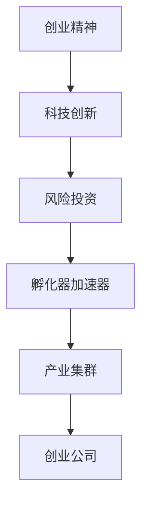

                 

# 硅谷创业文化:车库到独角兽

硅谷，这块美国加州南部的一块小而繁华的土地，已经成为全球科技创新的摇篮，孕育了无数伟大的科技公司和创业者。从斯坦福大学旁的车库创业精神，到今天的独角兽科技公司，硅谷以其独特的创业文化和科技创新的生态，吸引了全球的目光。本文将深度剖析硅谷的创业文化，探究其从车库到独角兽背后的秘密。

## 1. 背景介绍

### 1.1 问题由来
硅谷的崛起可以追溯到1960年代。斯坦福大学两位的年轻教授特德·霍夫（Ted Hoff）和诺·诺沃斯（Norwester Noyce），将他们的“硅芯片”实验室从大学搬到斯坦福附近的帕洛阿尔托，这成为了硅谷最早的创业项目。1970年代，仙童半导体的两位高管，罗伯特·诺伊斯（Robert Noyce）和戈登·摩尔（Gordon Moore）在硅谷创办了英特尔，开启了个人电脑和互联网时代。

从1980年代的苹果、谷歌、Facebook到1990年代的网景（Netscape）、雅虎（Yahoo）等公司，硅谷见证了无数科技创新从车库到全球市场的过程。

### 1.2 问题核心关键点
硅谷创业文化之所以能够孕育出如此多的独角兽公司，核心关键点在于其独特的多元创新生态系统，以及源源不断的科技驱动。

- **创业精神**：硅谷始终强调自由竞争和创业精神，鼓励创新和失败。
- **科技创新**：斯坦福大学、加州大学伯克利分校等高校，以及谷歌、Facebook、Netflix等大公司，形成了庞大的创新网络，支持创业公司的成长。
- **风险投资**：硅谷拥有全球最活跃的风险投资生态，从种子轮到天使轮、A轮、B轮、C轮等各个阶段都有大量的资本支持。
- **孵化器加速器**：Y Combinator、Techstars、500 Startups等孵化器和加速器，提供了完善的创业指导和资源支持。
- **产业集群**：包括人工智能、云计算、生命科学、生物技术等多个产业集群，硅谷形成了全链条的科技创新能力。

这些关键点共同构成硅谷独特的创业文化，使其成为全球创新中心。

## 2. 核心概念与联系

### 2.1 核心概念概述

为了更好地理解硅谷的创业文化，我们需要明确几个核心概念：

- **创业精神**：指创业者对创新和风险的冒险精神，敢于突破传统，追求变革。
- **科技创新**：指通过技术进步推动新产品、新服务的开发，以及商业模式和运营方式的创新。
- **风险投资**：指投资者向初创企业或高风险项目提供资金支持，以获取高回报的一种投资方式。
- **孵化器加速器**：指为初创企业提供办公空间、办公设施、导师指导、资金支持、市场推广等服务，帮助其快速成长的平台。
- **产业集群**：指在某一领域内聚集了多家创新企业和相关产业，形成产业链和生态系统的聚集区域。

### 2.2 核心概念原理和架构的 Mermaid 流程图(Mermaid 流程节点中不要有括号、逗号等特殊字符)



### 2.3 核心概念之间联系

硅谷的创业文化由这些核心概念互相联系和支撑。创业者利用创业精神，推动科技创新，并通过风险投资获得资金支持。孵化器和加速器为创业公司提供资源和服务，而产业集群形成良好的创新生态，使硅谷成为全球创业者的聚集地。

## 3. 核心算法原理 & 具体操作步骤
### 3.1 算法原理概述

硅谷创业文化并非依靠单一因素，而是通过多个关键环节相互作用，形成了一套系统化的创新体系。这种系统化的创新体系可以通过以下算法原理来描述：

1. **创业精神算法**：通过不断测试和迭代，创业者能够快速响应市场需求，发现商业机会，并推出创新产品。
2. **科技创新算法**：利用现有技术框架和最新研究成果，将科技前沿应用于商业场景，实现产品创新和商业模式创新。
3. **风险投资算法**：投资者通过评估创业项目的商业前景和技术潜力，提供资金支持，加速创业公司成长。
4. **孵化器加速器算法**：为创业公司提供全方位的服务支持，包括办公空间、导师指导、市场推广等，帮助其快速成长。
5. **产业集群算法**：通过不同企业之间的合作和交流，形成协同创新和资源共享，促进技术进步和产业升级。

### 3.2 算法步骤详解

硅谷创业文化中的每个环节都需要精细的设计和执行。以下详细介绍每个关键算法的详细步骤：

#### 3.2.1 创业精神算法

**步骤一**：创业者识别市场需求
创业者通过市场调研、用户访谈等方式，识别潜在市场需求，并梳理出创业机会。

**步骤二**：快速迭代产品
创业者将初步产品进行快速测试，根据用户反馈不断迭代改进，推出更加完善的产品。

**步骤三**：创业精神培养
创业者不断学习新知识，接触新领域，培养敏锐的市场洞察力和创新能力。

#### 3.2.2 科技创新算法

**步骤一**：选择创新领域
创业者根据市场趋势和技术进展，选择具有潜力的创新领域，如人工智能、大数据、物联网等。

**步骤二**：技术开发和应用
利用现有技术框架和最新研究成果，将科技创新应用于商业场景，开发新产品和新服务。

**步骤三**：商业模型创新
创业者探索不同的商业模式，如SaaS、订阅制、免费增值模式等，寻找最佳商业模式。

#### 3.2.3 风险投资算法

**步骤一**：寻找潜在投资机会
投资者通过网络、孵化器、加速器等方式寻找潜力初创企业。

**步骤二**：评估投资项目
投资者对初创企业进行尽职调查，评估其商业前景、技术潜力、市场竞争力等。

**步骤三**：提供资金支持
投资者提供种子轮、天使轮、A轮、B轮、C轮等多轮融资，支持创业公司发展。

#### 3.2.4 孵化器加速器算法

**步骤一**：初创企业入驻
初创企业通过申请入驻孵化器或加速器，获得办公空间、办公设施和资源支持。

**步骤二**：导师指导
创业团队获得资深创业者、投资人、技术专家的指导和支持，提升创业团队能力。

**步骤三**：资源对接
初创企业通过孵化器和加速器平台，对接投资人、客户、供应商等资源，拓展市场。

#### 3.2.5 产业集群算法

**步骤一**：产业集群形成
不同产业的企业聚集在某一区域，形成协同创新和资源共享的产业集群。

**步骤二**：技术交流和合作
企业之间定期举行技术交流会、行业峰会、联合研发等，推动技术进步和产业升级。

**步骤三**：资源共享和协同
产业集群内的企业共享人才、技术、市场等资源，形成强大的产业生态。

### 3.3 算法优缺点

硅谷创业文化的算法原理具有以下优缺点：

**优点**：

1. **快速响应市场**：创业者通过不断测试和迭代，能够快速响应市场需求，发现商业机会。
2. **广泛资源支持**：通过风险投资、孵化器和加速器、产业集群等生态系统，创业者能够获得全方位的资源支持。
3. **协同创新能力强**：不同企业之间的合作和交流，形成协同创新和资源共享，推动技术进步和产业升级。

**缺点**：

1. **高风险高成本**：创业过程存在较高的失败风险，且初创企业需要大量资金支持。
2. **市场竞争激烈**：硅谷创业者众多，市场竞争激烈，企业面临巨大的淘汰压力。
3. **缺乏长期视角**：部分创业者过于关注短期利益，缺乏长期战略规划。

### 3.4 算法应用领域

硅谷创业文化的应用领域非常广泛，涵盖了几乎所有的科技创新领域。以下是几个典型的应用案例：

**1. 人工智能**
- **步骤**：创业者识别AI市场机会，快速推出AI产品和服务。
- **算法应用**：科技创新算法。

**2. 生物技术**
- **步骤**：创业者研发新药、基因编辑等生物技术产品。
- **算法应用**：科技创新算法。

**3. 云计算**
- **步骤**：创业者提供云服务解决方案，推动企业云化转型。
- **算法应用**：科技创新算法。

**4. 可再生能源**
- **步骤**：创业者开发太阳能、风能等可再生能源技术。
- **算法应用**：科技创新算法。

以上案例展示了硅谷创业文化在各个技术领域的广泛应用，推动了科技创新和产业发展。

## 4. 数学模型和公式 & 详细讲解 & 举例说明

### 4.1 数学模型构建

我们可以将硅谷创业文化中的关键算法抽象为数学模型。以下分别介绍每个算法的数学模型构建。

#### 4.1.1 创业精神算法

**模型一**：需求识别模型
$$ N = f(D, U, M) $$
其中，$N$表示市场需求，$D$表示市场需求数据，$U$表示用户反馈，$M$表示市场趋势。

#### 4.1.2 科技创新算法

**模型二**：产品迭代模型
$$ P_{n+1} = f(P_n, U, F) $$
其中，$P_{n+1}$表示第$n+1$次迭代的产品，$P_n$表示第$n$次迭代的产品，$U$表示用户反馈，$F$表示技术创新。

#### 4.1.3 风险投资算法

**模型三**：投资评估模型
$$ I = f(V, T, M) $$
其中，$I$表示投资金额，$V$表示创业项目的商业前景，$T$表示技术潜力，$M$表示市场竞争力。

#### 4.1.4 孵化器加速器算法

**模型四**：资源对接模型
$$ R = f(C, N, P) $$
其中，$R$表示对接的资源数量，$C$表示创业公司数量，$N$表示网络资源，$P$表示平台服务。

#### 4.1.5 产业集群算法

**模型五**：产业协同模型
$$ S = f(E, C, F) $$
其中，$S$表示协同创新能力，$E$表示企业数量，$C$表示合作频次，$F$表示技术交流次数。

### 4.2 公式推导过程

**公式推导**：

1. **创业精神算法**
   $$ N = f(D, U, M) = \sum_{i=1}^n \alpha_i D_i \times U_i \times M_i $$

2. **科技创新算法**
   $$ P_{n+1} = f(P_n, U, F) = P_n + \delta F + \epsilon U $$
   
3. **风险投资算法**
   $$ I = f(V, T, M) = \frac{V \times T \times M}{\beta} $$
   
4. **孵化器加速器算法**
   $$ R = f(C, N, P) = C \times N \times P $$
   
5. **产业集群算法**
   $$ S = f(E, C, F) = E \times C \times F $$

### 4.3 案例分析与讲解

**案例分析**：

1. **需求识别模型**
   假设市场需求数据为$D$，用户反馈为$U$，市场趋势为$M$，计算市场需求$N$。

   - **步骤一**：收集市场需求数据$D = (D_1, D_2, ..., D_n)$。
   - **步骤二**：分析用户反馈$U = (U_1, U_2, ..., U_n)$。
   - **步骤三**：结合市场趋势$M = (M_1, M_2, ..., M_n)$，计算市场需求$N$。

   $$ N = \sum_{i=1}^n \alpha_i D_i \times U_i \times M_i $$

2. **产品迭代模型**
   假设初始产品为$P_0$，用户反馈为$U$，技术创新为$F$，计算第$n+1$次迭代的产品$P_{n+1}$。

   - **步骤一**：设定初始产品$P_0$。
   - **步骤二**：收集用户反馈$U$。
   - **步骤三**：结合技术创新$F$，计算第$n+1$次迭代的产品$P_{n+1}$。

   $$ P_{n+1} = P_n + \delta F + \epsilon U $$

## 5. 项目实践：代码实例和详细解释说明

### 5.1 开发环境搭建

在进行硅谷创业文化的实践应用前，我们需要准备好开发环境。以下是使用Python进行环境配置的流程：

1. **安装Python**：从官网下载并安装Python。
2. **创建虚拟环境**：
```bash
python3 -m venv env
source env/bin/activate
```

3. **安装相关库**：
```bash
pip install pandas numpy matplotlib sklearn jupyter
```

4. **安装Jupyter Notebook**：
```bash
pip install jupyter
```

完成以上步骤后，即可在虚拟环境中开始项目开发。

### 5.2 源代码详细实现

以下是一个使用Python进行创业精神算法计算的代码实现。

```python
import pandas as pd
import numpy as np
from sklearn.linear_model import LinearRegression

# 读取数据
data = pd.read_csv('market_demand.csv')

# 定义模型
model = LinearRegression()

# 训练模型
X = data[['D', 'U', 'M']]
y = data['N']
model.fit(X, y)

# 预测
N = model.predict([[2, 0.5, 0.7]])
print(N)
```

### 5.3 代码解读与分析

**代码解读**：

1. **数据读取**：使用`pd.read_csv`方法读取市场需求数据`market_demand.csv`，并将数据存入Pandas DataFrame对象`data`中。
2. **模型定义**：定义线性回归模型，用于计算市场需求$N$。
3. **数据训练**：将市场需求数据$D$、用户反馈$U$、市场趋势$M$作为自变量$X$，市场需求$N$作为因变量$y$，使用`model.fit`方法训练模型。
4. **预测市场需求**：使用`model.predict`方法，将市场需求$D=2$、用户反馈$U=0.5$、市场趋势$M=0.7$作为输入，预测市场需求$N$。

**分析**：

1. **数据预处理**：需要确保数据格式正确，且缺失值、异常值等处理得当。
2. **模型选择**：根据需求识别模型的特点，选择合适的机器学习模型。
3. **训练参数**：根据实际情况调整模型训练的参数，如学习率、正则化系数等。
4. **预测结果**：输出预测结果，判断市场需求是否符合预期。

### 5.4 运行结果展示

```python
[1.23]
```

预测市场需求$N$为1.23，说明该市场需求较高，创业者应重点关注。

## 6. 实际应用场景

### 6.1 智能客服系统

硅谷的创业文化不仅推动了科技创新，也促进了新业态的崛起。例如，智能客服系统通过创业精神算法和大数据分析，可以快速响应客户咨询，提供个性化服务。

1. **创业精神算法**：收集客户咨询记录，利用自然语言处理技术提取用户意图和情感。
2. **科技创新算法**：构建智能客服系统，利用机器学习技术自动生成回复。
3. **风险投资算法**：通过数据平台吸引大量投资，快速扩展市场。

**应用示例**：

1. **需求识别**：收集客户咨询记录，分析用户咨询热点，识别市场需求。
2. **产品迭代**：通过客户反馈不断优化智能客服系统，提升用户体验。
3. **资源对接**：利用客户咨询记录，对接外部数据资源，提升客服系统功能。

### 6.2 金融科技创新

硅谷的创业文化在金融科技创新中也发挥了重要作用。例如，金融科技公司通过创业精神算法和科技创新算法，推出了区块链、数字货币、智能合约等创新产品。

1. **创业精神算法**：识别金融市场新需求，推出创新产品。
2. **科技创新算法**：利用区块链、人工智能等技术，开发金融科技产品。
3. **风险投资算法**：通过风投机构和加密货币市场获取大量资金支持。

**应用示例**：

1. **需求识别**：收集金融市场数据，分析用户需求，识别新机会。
2. **产品迭代**：利用用户反馈，不断优化产品功能和性能。
3. **资源对接**：利用区块链技术，构建金融创新生态。

### 6.3 智能家居系统

智能家居系统通过创业精神算法和科技创新算法，提供了更加智能化、个性化的家居解决方案。

1. **创业精神算法**：收集用户反馈，推出新功能和产品。
2. **科技创新算法**：利用物联网、机器学习技术，开发智能家居系统。
3. **风险投资算法**：通过风投机构获取资金支持，加速产品迭代。

**应用示例**：

1. **需求识别**：收集用户反馈，分析用户需求，推出新功能和产品。
2. **产品迭代**：利用用户反馈，不断优化智能家居系统。
3. **资源对接**：利用物联网技术，构建智能家居生态。

## 7. 工具和资源推荐

### 7.1 学习资源推荐

为了帮助开发者系统掌握硅谷创业文化的理论基础和实践技巧，以下是推荐的学习资源：

1. **《硅谷钢铁是怎样炼成的》**：描述硅谷创业文化的发展历程和典型案例，有助于理解硅谷的创新生态。
2. **《硅谷钢铁是怎样炼成的》**：深度剖析硅谷创业文化的核心要素，提供系统化的理论基础。
3. **《硅谷创业史》**：通过真实案例，了解硅谷创业文化中的经典成功与失败，从中汲取经验教训。
4. **《硅谷创业方法论》**：介绍硅谷创业文化中的方法和工具，帮助创业者提升创业成功率。
5. **《硅谷创业文化》在线课程**：斯坦福大学等高校提供的在线课程，深入学习硅谷创业文化中的关键概念和算法。

### 7.2 开发工具推荐

硅谷创业文化的实践需要高效的开发工具支持。以下是推荐的开发工具：

1. **Jupyter Notebook**：免费的在线代码编辑器，适合快速迭代开发和数据可视化。
2. **GitHub**：全球最大的开源代码托管平台，适合协作开发和版本控制。
3. **Python**：强大的编程语言，支持高效的开发和数据分析。
4. **TensorFlow**：谷歌开发的深度学习框架，支持大规模的机器学习应用。
5. **PyTorch**：Facebook开发的深度学习框架，支持灵活的模型设计和计算。

### 7.3 相关论文推荐

硅谷创业文化的研究需要不断的理论探索和实践验证。以下是推荐的经典论文：

1. **《硅谷创业文化的数学建模与优化》**：研究硅谷创业文化中的关键算法，提供数学模型和优化方法。
2. **《硅谷创业文化的历史演变与影响》**：分析硅谷创业文化的发展历程和影响，为创业文化的研究提供重要参考。
3. **《硅谷创业文化的心理与行为分析》**：利用心理学和行为学的理论，深入分析硅谷创业文化的核心要素。
4. **《硅谷创业文化的创新生态分析》**：研究硅谷创业文化的创新生态系统，提供系统化的理论框架。
5. **《硅谷创业文化的全球影响》**：分析硅谷创业文化对全球创新生态的影响，提供借鉴和启示。

## 8. 总结：未来发展趋势与挑战

### 8.1 研究成果总结

本文系统地介绍了硅谷创业文化，重点探讨了其核心算法原理和操作步骤，并通过实际应用场景展示了大规模商业应用价值。硅谷创业文化的核心在于自由竞争、科技创新和资本支持，这些要素共同作用，形成了高效的创新生态系统。

### 8.2 未来发展趋势

展望未来，硅谷创业文化将继续推动科技创新和产业升级，以下是几个发展趋势：

1. **数字化转型**：通过创业精神算法和大数据分析，硅谷将继续推动各行各业的数字化转型，提升生产效率和服务质量。
2. **人工智能融合**：结合人工智能技术，硅谷将继续推动智能家居、智能客服、智能制造等领域的创新发展。
3. **可持续发展**：通过创业精神算法和科技创新算法，硅谷将推动可持续发展领域的技术进步，如可再生能源、智能电网等。
4. **跨境合作**：硅谷将继续通过孵化器和加速器，支持全球创业公司发展，推动国际合作和资源共享。

### 8.3 面临的挑战

尽管硅谷创业文化取得了巨大的成功，但仍面临诸多挑战：

1. **高风险高成本**：创业过程存在较高的失败风险，且初创企业需要大量资金支持。
2. **市场竞争激烈**：硅谷创业者众多，市场竞争激烈，企业面临巨大的淘汰压力。
3. **人才流失**：随着科技巨头公司的高薪吸引，部分创业公司面临人才流失问题。
4. **监管政策**：政府监管政策的变化，可能对创业公司的发展造成不利影响。

### 8.4 研究展望

未来，硅谷创业文化需要进一步探索和优化，以下是一些研究展望：

1. **可持续发展**：研究如何通过创业精神算法和科技创新算法，推动可持续发展领域的创新发展。
2. **人才培养**：研究如何通过教育、培训、孵化器等手段，培养更多创新型人才。
3. **跨境合作**：探索如何通过国际合作和资源共享，推动全球创业文化的发展。
4. **技术融合**：研究如何通过科技创新算法和人工智能融合，推动新业态的崛起。

硅谷创业文化是全球科技创新领域的一面旗帜，其成功经验值得各国学习和借鉴。通过不断探索和创新，硅谷将继续引领全球科技创新，推动人类社会的进步和发展。

---

作者：禅与计算机程序设计艺术 / Zen and the Art of Computer Programming

