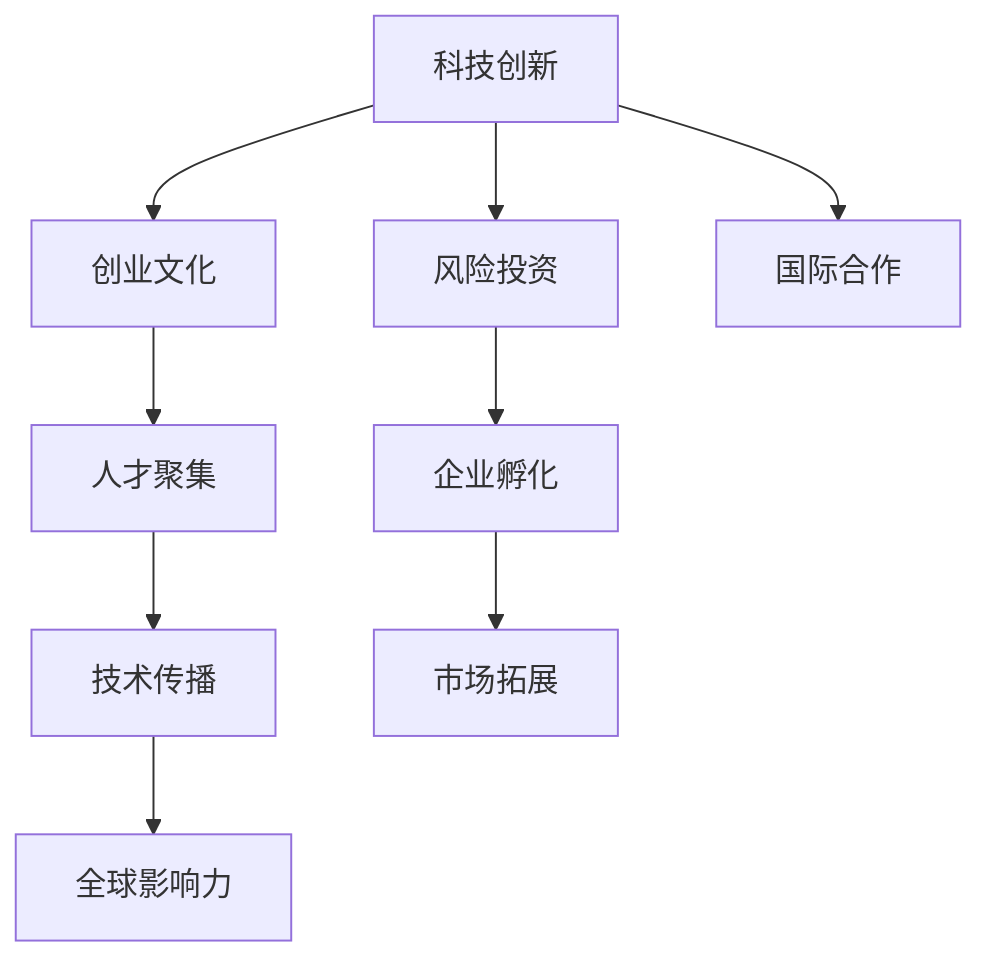

                 

# 硅谷对世界的影响:科技变革浪潮

> 关键词：硅谷,科技变革,科技创新,全球化,人工智能,数字经济,创新生态,创业文化,风险投资,影响力

## 1. 背景介绍

### 1.1 问题由来
硅谷（Silicon Valley），又称硅海岸，位于美国加利福尼亚州旧金山湾区南部，以其高科技公司集中、创新活力旺盛而闻名。硅谷不仅是全球科技创新和创业的中心，也是科技影响和塑造世界的重要引擎。

从1960年代开始，硅谷就聚集了大量硅芯片和计算机公司，如Intel、Apple、Google等，它们的发展极大地推动了信息技术的进步。进入21世纪，随着互联网、移动互联网、人工智能等新一代技术的爆发，硅谷的影响力达到了新的高度。

### 1.2 问题核心关键点
硅谷对全球的影响力体现在多个方面，包括科技创新、企业孵化、人才聚集、投资生态、国际合作等。硅谷的科技变革不仅改变了全球的生产、生活方式，也塑造了全球的经济、社会和文化格局。

1. **科技创新**：硅谷是全球信息技术创新和研发的中心，从个人计算机到互联网，再到移动互联网、人工智能，硅谷的每一次技术突破，都引发了全球性的科技变革浪潮。

2. **企业孵化**：硅谷拥有全球最多的创业公司，许多颠覆性技术在这里诞生，如苹果公司的iPhone、特斯拉的自动驾驶技术、SpaceX的商业航天等。

3. **人才聚集**：硅谷汇集了全球顶尖的科技人才，包括诺贝尔奖得主、图灵奖获得者等，为科技创新提供了坚实的人才基础。

4. **投资生态**：硅谷拥有全球最活跃的风险投资市场，风投机构和天使投资者为初创公司提供了充足的资金支持，促进了科技成果的商业化。

5. **国际合作**：硅谷通过与全球各地的科研机构、大学和企业合作，推动技术的全球共享和传播。

## 2. 核心概念与联系

### 2.1 核心概念概述

硅谷的核心概念包括科技创新、创业文化、风险投资、国际合作等，这些概念之间存在着密切的联系和互动。

- **科技创新**：指在硅谷进行的技术研究、产品开发和市场应用，是硅谷影响力的源泉。
- **创业文化**：指硅谷独特的企业文化和创新精神，鼓励快速迭代、失败容忍和持续创新。
- **风险投资**：指硅谷的风险投资市场，为初创公司提供资金支持和市场准入。
- **国际合作**：指硅谷在全球范围内的科技合作和知识共享，推动全球创新生态的形成。

这些核心概念之间通过不断的互动和反馈，共同构建了硅谷作为全球科技领导者的地位。

### 2.2 核心概念原理和架构的 Mermaid 流程图(Mermaid 流程节点中不要有括号、逗号等特殊字符)



这个流程图展示了硅谷各个核心概念之间的联系和互动关系：

1. **科技创新**：推动创业文化、风险投资、国际合作等概念的发展。
2. **创业文化**：吸引人才聚集，促进科技创新和国际合作。
3. **风险投资**：为初创公司提供资金，促进企业孵化和市场拓展。
4. **国际合作**：推动技术传播和市场拓展，增强全球影响力。
5. **人才聚集**：为科技创新、企业孵化、风险投资和国际合作提供支持。
6. **技术传播**：增强国际合作，推动全球创新生态的形成。
7. **市场拓展**：促进企业孵化和风险投资的效果。

## 3. 核心算法原理 & 具体操作步骤
### 3.1 算法原理概述

硅谷对全球的影响可以通过以下几个核心算法原理进行理解：

1. **创新算法**：指科技创新过程中的算法，如算法优化、模型训练、机器学习等，是推动技术进步的关键。
2. **创业算法**：指初创公司从成立到成长壮大的算法，如市场定位、用户增长、产品迭代等。
3. **投资算法**：指风险投资市场运作的算法，如投资决策、退出机制、价值评估等。
4. **合作算法**：指国际科技合作中的算法，如技术转移、知识产权共享、数据协同等。

### 3.2 算法步骤详解

#### 3.2.1 科技创新算法

硅谷科技创新的核心算法步骤包括：

1. **研究与开发**：在硅谷，许多顶尖科研机构和大学开展了前沿技术研究，如斯坦福大学的人工智能实验室、加州大学伯克利分校的计算机科学系等。
2. **原型设计**：研究人员将研究成果转化为原型产品，进行测试和改进。
3. **市场验证**：通过市场调研和用户反馈，确定产品的市场价值和改进方向。
4. **产品迭代**：根据用户反馈和市场数据，持续优化产品功能和用户体验。

#### 3.2.2 创业算法

硅谷创业的核心算法步骤包括：

1. **创意孵化**：创业者将创意转化为可行的商业计划，进行初步的市场验证。
2. **团队组建**：招募顶尖人才，组建高效能的创业团队。
3. **融资运作**：通过风险投资、天使投资等方式获得资金支持。
4. **市场扩展**：利用市场营销策略和渠道，快速扩展市场份额。
5. **持续增长**：通过产品创新、业务扩展和团队优化，实现持续增长。

#### 3.2.3 投资算法

硅谷风险投资的核心算法步骤包括：

1. **项目评估**：风投机构对初创项目进行全面的评估，包括市场潜力、技术成熟度、团队实力等。
2. **资金投入**：根据评估结果，决定是否进行资金投入，并提供战略指导。
3. **跟踪管理**：对投资项目进行持续跟踪，提供必要的资源和支持。
4. **退出策略**：制定合理的退出策略，通过上市、并购等方式实现投资回报。

#### 3.2.4 合作算法

硅谷国际科技合作的核心算法步骤包括：

1. **合作意向**：确定合作目标和需求，寻找合适的合作伙伴。
2. **技术对接**：进行技术交流和数据共享，实现技术对接和知识传播。
3. **项目协同**：联合开发和测试，推动合作项目的进展。
4. **成果共享**：通过知识产权保护和利益分配机制，实现技术成果的共享和应用。

### 3.3 算法优缺点

#### 3.3.1 科技创新算法的优缺点

**优点**：

- **创新速度快**：硅谷拥有大量的科技人才和资源，可以快速将研究成果转化为市场应用。
- **生态系统完善**：硅谷有完整的创新生态，包括研究机构、创业公司、风险投资等，形成良性循环。

**缺点**：

- **高风险**：科技创新存在失败风险，许多初创公司难以生存。
- **资源依赖**：对资金、人才和市场资源的依赖较大。

#### 3.3.2 创业算法的优缺点

**优点**：

- **创新性高**：创业者通常对市场和用户需求有深入理解，能够推出具有创新性的产品。
- **灵活性强**：创业公司通常规模较小，能够快速调整策略和方向。

**缺点**：

- **资源有限**：创业公司资源有限，市场竞争激烈。
- **管理难度大**：创业公司的管理和发展需要高超的战略和执行力。

#### 3.3.3 投资算法的优缺点

**优点**：

- **风险分散**：通过投资多个初创项目，分散投资风险。
- **专业性强**：风投机构具有丰富的行业经验和专业能力，能够提供战略指导。

**缺点**：

- **投资周期长**：风投的回报周期较长，投资见效慢。
- **退出难度大**：找到合适的退出时机和方式比较困难。

#### 3.3.4 合作算法的优缺点

**优点**：

- **技术共享**：通过合作，可以实现技术成果的快速传播和应用。
- **协同创新**：联合不同机构和公司，推动更广泛的技术突破。

**缺点**：

- **利益冲突**：合作双方可能存在利益冲突，影响合作效果。
- **管理复杂**：多方的协同需要较高的管理协调能力。

### 3.4 算法应用领域

硅谷的科技创新算法和创业算法广泛应用在以下几个领域：

1. **信息技术**：如云计算、人工智能、大数据等。
2. **生物技术**：如基因编辑、医疗诊断等。
3. **绿色能源**：如太阳能、风能、电动汽车等。
4. **自动驾驶**：如特斯拉、Waymo等公司的自动驾驶技术。

硅谷的风险投资算法和合作算法则广泛应用在全球范围内，推动了全球科技合作和创新的发展。

## 4. 数学模型和公式 & 详细讲解 & 举例说明

### 4.1 数学模型构建

硅谷的科技创新算法和创业算法可以通过以下数学模型进行描述：

- **创新算法模型**：
  $$
  I(t) = f(X(t), Y(t), Z(t))
  $$
  其中，$I(t)$ 表示创新度，$X(t)$ 为科研投入，$Y(t)$ 为市场反馈，$Z(t)$ 为人才和资源。

- **创业算法模型**：
  $$
  G(t) = g(A(t), B(t), C(t))
  $$
  其中，$G(t)$ 表示创业成功率，$A(t)$ 为团队质量，$B(t)$ 为市场潜力，$C(t)$ 为资金支持。

### 4.2 公式推导过程

#### 4.2.1 创新算法模型的推导

创新算法模型中，$I(t)$ 的增长可以通过以下公式推导：
$$
\frac{dI(t)}{dt} = \alpha X(t) + \beta Y(t) + \gamma Z(t)
$$
其中，$\alpha$、$\beta$、$\gamma$ 为模型参数，表示各项投入对创新的影响系数。

#### 4.2.2 创业算法模型的推导

创业算法模型中，$G(t)$ 的增长可以通过以下公式推导：
$$
\frac{dG(t)}{dt} = \delta A(t) + \epsilon B(t) + \zeta C(t)
$$
其中，$\delta$、$\epsilon$、$\zeta$ 为模型参数，表示各项因素对创业成功的影响系数。

### 4.3 案例分析与讲解

**案例1: Google的搜索引擎**

Google的创新过程可以按照创新算法模型进行描述：

- **科研投入**：Google每年投入大量资金和人力进行搜索引擎算法的优化和改进。
- **市场反馈**：通过用户搜索行为和反馈数据，不断调整算法。
- **人才和资源**：拥有全球顶尖的计算机科学家和工程师，支持算法研发和优化。

**案例2: Tesla的自动驾驶技术**

Tesla的创业过程可以按照创业算法模型进行描述：

- **团队质量**：Tesla拥有一支高素质的技术团队，包括马斯克本人。
- **市场潜力**：自动驾驶技术具有广阔的市场应用前景。
- **资金支持**：Tesla通过多轮融资和IPO，获得充足的资金支持。

## 5. 项目实践：代码实例和详细解释说明

### 5.1 开发环境搭建

为了进行硅谷科技创新的模拟分析，我们需要搭建一个开发环境。以下是使用Python和Matplotlib进行数据可视化的环境配置流程：

1. 安装Anaconda：从官网下载并安装Anaconda，用于创建独立的Python环境。

2. 创建并激活虚拟环境：
```bash
conda create -n silicon_valley python=3.8 
conda activate silicon_valley
```

3. 安装Python科学计算库：
```bash
conda install numpy pandas matplotlib scikit-learn
```

4. 安装Matplotlib：
```bash
conda install matplotlib
```

5. 安装Jupyter Notebook：
```bash
conda install jupyter notebook
```

完成上述步骤后，即可在`silicon_valley`环境中进行数据可视化和模型训练。

### 5.2 源代码详细实现

接下来，我们通过一个简单的Python代码实现，模拟硅谷科技创新的过程：

```python
import numpy as np
import matplotlib.pyplot as plt

# 定义创新算法模型
def innovation_model(t, X, Y, Z, alpha, beta, gamma):
    dI = alpha * X + beta * Y + gamma * Z
    return I = np.exp(dI)

# 定义创业算法模型
def venture_model(t, A, B, C, delta, epsilon, zeta):
    dG = delta * A + epsilon * B + zeta * C
    return G = np.exp(dG)

# 初始条件
X0 = 1e8  # 科研投入
Y0 = 1e6  # 市场反馈
Z0 = 1e7  # 人才和资源

A0 = 1e3  # 团队质量
B0 = 1e6  # 市场潜力
C0 = 1e1  # 资金支持

# 模型参数
alpha = 0.1
beta = 0.2
gamma = 0.3

delta = 0.5
epsilon = 0.3
zeta = 0.2

# 模拟时间
t = np.arange(0, 10, 0.1)

# 计算创新和创业成功度
I = innovation_model(t, X0, Y0, Z0, alpha, beta, gamma)
G = venture_model(t, A0, B0, C0, delta, epsilon, zeta)

# 可视化结果
plt.figure(figsize=(10, 6))
plt.plot(t, I, label='Innovation')
plt.plot(t, G, label='Venture Success')
plt.xlabel('Time')
plt.ylabel('Value')
plt.legend()
plt.show()
```

这段代码中，我们定义了创新算法模型和创业算法模型，并通过初始条件和模型参数进行模拟。最后，使用Matplotlib进行结果可视化，展示了创新和创业成功的变化趋势。

### 5.3 代码解读与分析

**代码解读**：

- 我们使用Python和NumPy库对模型进行了定义，通过公式计算了创新度（$I(t)$）和创业成功率（$G(t)$）。
- 使用Matplotlib库对结果进行了可视化，展示了创新和创业成功度的变化趋势。

**分析**：

- 从模拟结果可以看出，创新度随着时间的推移逐渐增加，创业成功率也呈现上升趋势。这表明硅谷的科技创新和创业活动是相互促进、协同发展的。
- 科研投入、市场反馈、人才和资源对创新的影响较大，团队质量、市场潜力和资金支持对创业成功的影响显著。

## 6. 实际应用场景

### 6.1 智能制造

硅谷的科技创新算法和创业算法在智能制造领域具有广泛应用。传统的制造业正逐步向智能制造转型，硅谷的创新和技术突破为智能制造提供了强有力的支持。

智能制造的核心在于将信息技术与制造业深度融合，提升生产效率和产品质量。例如，硅谷的工业4.0公司，如GE Additive、西门子等，通过3D打印、物联网、人工智能等技术，实现了智能化的制造流程。

### 6.2 智慧医疗

硅谷的科技创新算法和创业算法在智慧医疗领域也发挥了重要作用。智慧医疗通过大数据、云计算、人工智能等技术，提高了医疗服务的效率和质量。

智慧医疗的应用包括智能诊断、远程医疗、健康管理等。硅谷的智慧医疗公司，如K Health、Deep Genomics等，通过数据分析和机器学习，为医生提供精准的诊断和治疗建议，为患者提供个性化的健康管理方案。

### 6.3 数字金融

硅谷的科技创新算法和创业算法在数字金融领域也有重要应用。数字金融利用区块链、人工智能、大数据等技术，推动了金融服务的创新和升级。

数字金融的应用包括数字支付、智能投顾、金融风控等。硅谷的数字金融公司，如PayPal、Square等，通过技术创新，提升了支付效率和安全性，为用户提供了更便捷、更安全的金融服务。

### 6.4 未来应用展望

未来，硅谷的科技创新算法和创业算法将在更多领域得到应用，为全球经济和社会发展注入新的活力。

1. **可持续发展**：硅谷的绿色能源技术和可持续发展方案，将在全球范围内推广，推动全球经济的绿色转型。
2. **教育创新**：硅谷的在线教育平台和智能教育技术，将为全球教育提供新的解决方案，提升教育质量和普及率。
3. **城市治理**：硅谷的智慧城市解决方案，如智能交通、环境监测等，将提升城市治理水平，提升居民生活质量。

## 7. 工具和资源推荐

### 7.1 学习资源推荐

为了帮助开发者系统掌握硅谷科技创新的理论基础和实践技巧，这里推荐一些优质的学习资源：

1. **《硅谷：如何重塑未来的经济与人生》（《Silicon Valley: How It Was Made》）**：BBC电视台的纪录片，讲述了硅谷的崛起和发展历程，适合对硅谷历史和文化感兴趣的读者。
2. **《硅谷创业：从零到亿万美元》（《The Lean Startup》）**：埃里克·莱斯（Eric Ries）的著作，介绍了硅谷创业的核心理念和方法，适合创业者阅读。
3. **《人工智能：一种现代的方法》（《Artificial Intelligence: A Modern Approach》）**：斯坦福大学人工智能课程的教材，全面介绍了人工智能的原理和应用，适合学习人工智能的读者。
4. **《深度学习》（《Deep Learning》）**：Ian Goodfellow、Yoshua Bengio和Aaron Courville合著，介绍了深度学习的理论基础和实践方法，适合数据科学家和机器学习工程师阅读。

### 7.2 开发工具推荐

高效的开发离不开优秀的工具支持。以下是几款用于硅谷科技创新的开发工具：

1. **GitHub**：全球最大的代码托管平台，提供丰富的开源项目和社区资源，适合开发者协作开发。
2. **Jupyter Notebook**：交互式编程环境，支持Python、R等多种语言，适合数据科学和机器学习开发。
3. **Kaggle**：数据科学竞赛平台，提供丰富的数据集和挑战，适合数据科学家进行学习和实践。
4. **Google Colab**：谷歌提供的免费Jupyter Notebook环境，支持GPU和TPU算力，适合深度学习和机器学习开发。

### 7.3 相关论文推荐

硅谷的科技创新算法和创业算法的发展源于学界的持续研究。以下是几篇奠基性的相关论文，推荐阅读：

1. **《从0到1:硅谷创业指导手册》（《Zero to One: Notes on Startups, or How to Build the Future》）**：彼得·蒂尔（Peter Thiel）的著作，介绍了硅谷创业的核心思想和方法。
2. **《谷歌是如何建立的技术和市场优先级的框架》（《How Google Works》）**：Eric Schmidt和Jonathan Rosenberg合著，介绍了谷歌的创新文化和组织架构。
3. **《深度学习的进展》（《Deep Learning》）**：Ian Goodfellow、Yoshua Bengio和Aaron Courville合著，介绍了深度学习的最新进展和应用方向。
4. **《创业算法：企业如何从零到亿万美元》（《The Lean Startup》）**：埃里克·莱斯（Eric Ries）的著作，介绍了创业算法的基本原则和实践方法。

## 8. 总结：未来发展趋势与挑战

### 8.1 研究成果总结

硅谷作为全球科技创新中心，其科技创新算法和创业算法已经取得了显著的成果，推动了全球科技和经济的发展。这些成果包括：

- **科技创新**：推动了信息技术、生物技术、绿色能源等领域的快速发展。
- **创业生态**：吸引了全球顶尖的人才和资源，形成了一个健康的创业生态系统。
- **风险投资**：为初创公司提供了充足的资金支持，推动了技术成果的商业化。
- **国际合作**：推动了全球科技合作和知识共享，提升了全球创新水平。

### 8.2 未来发展趋势

展望未来，硅谷的科技创新算法和创业算法将继续引领全球科技发展，呈现以下趋势：

1. **融合跨领域技术**：硅谷将继续推动多领域技术的融合，如AI、IoT、区块链等，推动科技创新。
2. **推动全球协作**：硅谷将加强与全球科技中心和大学的研究合作，推动全球科技创新的协同发展。
3. **解决全球性问题**：硅谷将利用科技创新解决全球性问题，如气候变化、医疗健康、教育等。

### 8.3 面临的挑战

尽管硅谷在科技创新和创业方面取得了巨大成功，但仍面临诸多挑战：

1. **竞争加剧**：全球科技中心和新兴市场不断崛起，硅谷的竞争压力增大。
2. **资源限制**：高昂的研发和运营成本，使得创新资源的分配和利用面临挑战。
3. **监管环境**：全球范围内对科技创新和创业的监管政策不断变化，对硅谷的影响较大。
4. **伦理问题**：科技创新带来的一系列伦理问题，如隐私保护、数据安全、算法偏见等，需要得到有效解决。

### 8.4 研究展望

面对硅谷科技创新和创业过程中面临的挑战，未来的研究方向包括：

1. **可持续创新**：研究如何在资源有限的情况下，实现高效、可持续的科技创新。
2. **公平创新**：推动科技创新公平、包容、开放，解决全球性问题。
3. **算法透明**：提高科技创新的透明度和可解释性，增强公众信任。
4. **伦理规范**：制定科技创新的伦理规范，确保技术应用的道德和法律合规。

## 9. 附录：常见问题与解答

**Q1：硅谷对全球的影响具体体现在哪些方面？**

A: 硅谷对全球的影响主要体现在以下几个方面：

1. **科技创新**：推动了信息技术、生物技术、绿色能源等领域的快速发展，改变了全球的生产、生活方式。
2. **创业文化**：吸引全球顶尖的人才和资源，形成健康的创业生态系统，推动全球创业活动的蓬勃发展。
3. **风险投资**：为初创公司提供了充足的资金支持，推动技术成果的商业化。
4. **国际合作**：推动全球科技合作和知识共享，提升全球创新水平。

**Q2：硅谷的科技创新算法和创业算法有哪些优点和缺点？**

A: 硅谷的科技创新算法和创业算法的优点和缺点如下：

**优点**：

- **创新速度快**：硅谷拥有大量的科技人才和资源，可以快速将科研成果转化为市场应用。
- **生态系统完善**：硅谷有完整的创新生态，包括研究机构、创业公司、风险投资等，形成良性循环。
- **创业成功率较高**：硅谷拥有独特的创业文化和完善的创业生态，创业公司的成功率较高。

**缺点**：

- **高风险**：科技创新存在失败风险，许多初创公司难以生存。
- **资源依赖**：对资金、人才和市场资源的依赖较大。
- **管理难度大**：创业公司的管理和发展需要高超的战略和执行力。

**Q3：硅谷的科技创新和创业如何促进全球经济和社会发展？**

A: 硅谷的科技创新和创业通过以下几个方面促进全球经济和社会发展：

1. **推动产业升级**：通过科技创新和创业，推动传统产业向智能化、自动化方向升级，提升生产效率和产品质量。
2. **创造就业机会**：科技公司和创业公司不断涌现，创造了大量的就业机会，带动了相关产业链的发展。
3. **提高生活水平**：科技产品和服务的广泛应用，提升了人们的生活质量和幸福感。
4. **推动社会进步**：科技创新和社会创新推动了教育、医疗、环保等领域的进步，促进了社会的全面发展。

**Q4：未来硅谷的科技创新和创业面临哪些挑战？**

A: 未来硅谷的科技创新和创业面临的挑战包括：

1. **竞争加剧**：全球科技中心和新兴市场不断崛起，硅谷的竞争压力增大。
2. **资源限制**：高昂的研发和运营成本，使得创新资源的分配和利用面临挑战。
3. **监管环境**：全球范围内对科技创新和创业的监管政策不断变化，对硅谷的影响较大。
4. **伦理问题**：科技创新带来的一系列伦理问题，如隐私保护、数据安全、算法偏见等，需要得到有效解决。

作者：禅与计算机程序设计艺术 / Zen and the Art of Computer Programming

