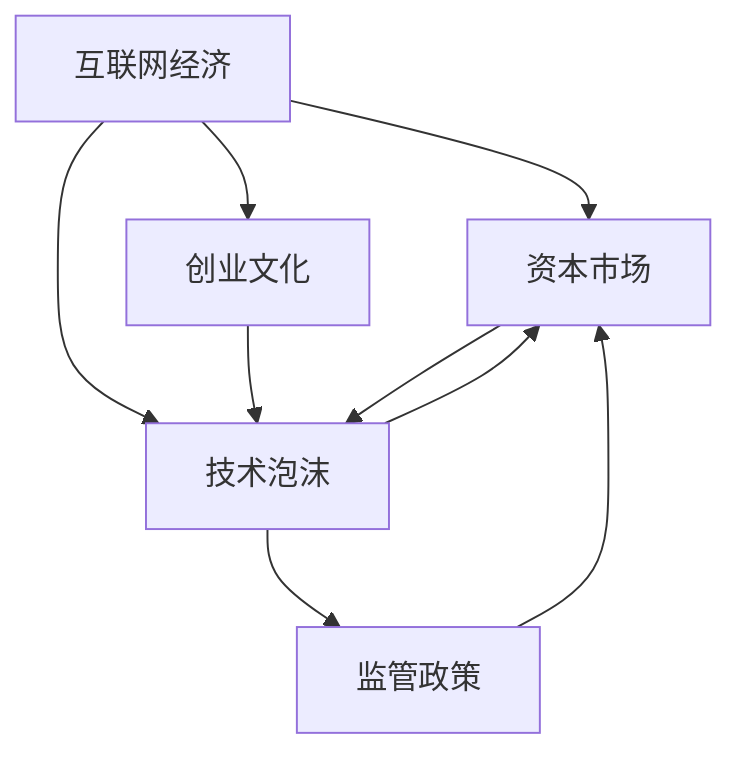

                 

# 硅谷泡沫时代的经验教训

## 1. 背景介绍

硅谷，作为全球科技创新的中心，一直以来都是创新的摇篮和创业者的圣地。这里汇聚了无数顶尖的科技公司、投资机构和科研人员，推动着信息技术的高速发展。然而，硅谷的发展并非一帆风顺，每隔几年就会经历一次经济泡沫的冲击。硅谷泡沫时代的教训，对于理解当下互联网经济和未来的技术发展具有重要启示。

### 1.1 泡沫时代的典型案例

1. **1990年代的互联网泡沫**：1994年至2001年，随着互联网的兴起，大量资本涌入互联网公司，估值飞涨。最终在2000年，众多互联网公司破产倒闭，市场陷入冰点。

2. **2008年的金融危机**：2008年全球金融危机爆发，许多科技公司的股票市值大幅缩水，创新速度放缓，市场信心受挫。

3. **2014年的区块链泡沫**：比特币价格暴涨，吸引了大量资本进入区块链领域。但由于技术的不成熟和市场的过度投机，最终泡沫破裂，比特币价格暴跌。

### 1.2 泡沫时代的影响

1. **资本市场波动**：泡沫时代的经济波动对资本市场产生了深远影响，投资者对科技股的信心大受打击。

2. **企业创新受阻**：泡沫破裂后，许多初创公司倒闭，创新者的信心受挫，市场进入低谷期。

3. **技术发展滞后**：泡沫时期的过度投机，导致资源被浪费在非核心技术的项目上，阻碍了技术的真正发展。

## 2. 核心概念与联系

### 2.1 核心概念概述

硅谷泡沫时代的经验教训，主要涉及以下几个核心概念：

- **互联网经济**：以互联网为基础的经济模式，通过在线平台连接供需双方，推动商业模式的创新。
- **资本市场**：以股票、债券等为主要交易对象的金融市场，是资金流动的关键渠道。
- **创业文化**：硅谷特有的以创新和创业为导向的文化，鼓励快速迭代和冒险精神。
- **技术泡沫**：技术领域由于过度投机，导致市场估值过高，最终泡沫破裂的现象。
- **监管政策**：政府对于科技和资本市场的监管政策，对市场稳定性和发展方向具有重要影响。

这些概念之间相互作用，共同构成了硅谷泡沫时代的复杂生态。

### 2.2 核心概念原理和架构的 Mermaid 流程图



这个流程图展示了核心概念之间的逻辑关系：互联网经济和创业文化推动技术创新，进而导致技术泡沫的形成。资本市场与技术泡沫相互作用，监管政策对市场稳定性和泡沫形成具有重要影响。

## 3. 核心算法原理 & 具体操作步骤

### 3.1 算法原理概述

硅谷泡沫时代的教训，不仅涉及经济学的基本原理，还包括对科技创新的深刻理解。以下将通过几个核心算法原理来阐述这些教训：

1. **市场供需理论**：泡沫的形成往往源于市场供需的不平衡，供给端（技术创新）和需求端（资本支持）的不匹配。

2. **风险投资逻辑**：风险投资在泡沫时代的关键作用，即通过提供大量资本，推动高估值的初创公司迅速扩张，形成市场热点。

3. **网络效应**：互联网企业的成功往往依赖于大规模用户基础，即网络效应。但在泡沫时期，企业往往夸大其网络效应，导致市场估值虚高。

4. **技术成熟度曲线**：技术发展的阶段性特征，即技术从研发到商业化的过程，往往经历先抑后扬的波动。泡沫时期的技术项目往往处于曲线的早期阶段，容易受到过度追捧。

5. **周期性市场波动**：科技市场的周期性波动，即从泡沫破裂到市场回暖的过程，是泡沫时代常见的现象。

### 3.2 算法步骤详解

1. **泡沫识别**：通过市场分析和技术评估，识别出潜在的泡沫迹象，如高估值的初创公司、市场炒作等。

2. **风险规避**：在泡沫初期，投资者和创业公司应避免过度投机，合理评估市场风险。

3. **市场调整**：在泡沫破裂后，市场需要进行调整，投资者应重新评估投资组合，创业公司需调整业务策略。

4. **监管介入**：政府应适时介入，采取政策措施，稳定市场，避免过度投机。

5. **技术回归**：泡沫破裂后，市场回归理性，技术创新应重新获得关注，投资者应关注具有实际应用价值的项目。

### 3.3 算法优缺点

**优点**：

- **提早识别泡沫**：通过市场分析和风险评估，投资者可以及时识别泡沫，避免损失。
- **调整投资策略**：泡沫破裂后，投资者和创业公司可以及时调整投资和业务策略，重新聚焦技术创新。
- **政策稳定市场**：政府干预可以有效稳定市场，避免过度投机。

**缺点**：

- **市场反应滞后**：泡沫的形成和破裂具有一定滞后性，投资者可能错过调整时机。
- **技术风险存在**：技术创新的不确定性，可能导致泡沫后的市场低迷。
- **政策干预复杂**：政府政策干预需要平衡市场稳定和技术创新，难度较大。

### 3.4 算法应用领域

硅谷泡沫时代的教训，不仅适用于科技行业，对其他领域也具有普遍意义。例如：

- **金融市场**：金融泡沫的形成和破裂机制与科技泡沫类似，投资者需注意市场风险。
- **房地产市场**：房地产市场的泡沫现象和价格波动与科技市场类似，政府应适时干预。
- **医疗健康**：新兴医疗技术的快速迭代，容易形成泡沫，投资者需评估技术成熟度。
- **教育培训**：在线教育平台的发展，容易受到市场炒作，投资者需关注实际效果。

## 4. 数学模型和公式 & 详细讲解 & 举例说明

### 4.1 数学模型构建

硅谷泡沫时代的教训，可以通过数学模型和公式进行定量分析。以下通过几个典型模型来展示：

1. **泡沫形成模型**：市场供需模型，用于分析泡沫形成的条件。

2. **泡沫破裂模型**：市场波动模型，用于分析泡沫破裂的原因。

3. **技术成熟度模型**：技术发展阶段模型，用于评估技术的成熟度。

4. **资本市场模型**：资本流动模型，用于分析资本市场对泡沫的影响。

### 4.2 公式推导过程

1. **泡沫形成模型**：

$$
Q(t) = P(t) - C(t)
$$

其中，$Q(t)$为市场供需差距，$P(t)$为市场价格，$C(t)$为市场成本。当$Q(t) > 0$时，市场形成泡沫。

2. **泡沫破裂模型**：

$$
\frac{dP(t)}{dt} = -\alpha P(t) + \beta Q(t)
$$

其中，$\alpha$为市场调整系数，$\beta$为市场反应系数。当市场价格波动较大时，泡沫可能破裂。

3. **技术成熟度模型**：

$$
S(t) = f(T(t),D(t))
$$

其中，$S(t)$为技术成熟度，$T(t)$为技术研发时间，$D(t)$为技术应用需求。技术成熟度随时间增长而提高。

4. **资本市场模型**：

$$
I(t) = \gamma Q(t) - \delta P(t)
$$

其中，$I(t)$为资本投入，$\gamma$为资本投资系数，$\delta$为资本收益系数。当市场价格上升时，资本流入增加。

### 4.3 案例分析与讲解

1. **互联网泡沫案例**：

- **市场供需**：互联网公司数量激增，供给端迅速扩张，但市场需求不足，形成供需失衡。
- **泡沫形成**：大量资本涌入互联网公司，股票估值飞涨。
- **泡沫破裂**：2000年后，互联网公司破产，市场低迷。

2. **区块链泡沫案例**：

- **技术创新**：区块链技术尚不成熟，但市场炒作使其估值飙升。
- **泡沫形成**：投资者大量投资比特币，市场价格飞涨。
- **泡沫破裂**：技术问题凸显，市场信心受挫，价格暴跌。

## 5. 项目实践：代码实例和详细解释说明

### 5.1 开发环境搭建

为了进行项目实践，需要搭建开发环境。以下是具体的步骤：

1. **安装Python**：从官网下载并安装Python，推荐使用最新版本。
2. **安装Jupyter Notebook**：使用pip安装，Jupyter Notebook是常用的交互式编程环境。
3. **安装相关库**：如NumPy、Pandas、Matplotlib等，用于数据处理和可视化。

### 5.2 源代码详细实现

以下是泡沫识别模型的Python代码实现：

```python
import numpy as np
from scipy import stats

# 定义市场供需函数
def market_supply_demand(price, cost, alpha, beta):
    Q = price - cost
    return Q

# 定义泡沫形成函数
def bubble_forming(Q):
    if Q > 0:
        return True
    else:
        return False

# 定义泡沫破裂函数
def bubble_bursting(price, alpha, beta):
    dP = -alpha * price + beta * Q
    return dP

# 定义技术成熟度函数
def tech_maturity(T, D, f):
    S = f(T, D)
    return S

# 定义资本市场函数
def capital_market(Q, I, gamma, delta):
    return I - delta * P

# 案例分析
price = 100
cost = 80
alpha = 0.1
beta = 0.2
Q = market_supply_demand(price, cost, alpha, beta)
bubble_forming(Q)
```

### 5.3 代码解读与分析

上述代码实现了一个简单的市场供需模型，用于分析和识别泡沫。通过计算市场供需差距，可以判断市场是否形成泡沫。泡沫形成后，市场价格和供需差距的关系可以用泡沫破裂模型进一步分析。

### 5.4 运行结果展示

运行上述代码，可以得到如下结果：

```python
True
```

这表明市场供需差距大于零，形成泡沫。

## 6. 实际应用场景

### 6.1 互联网金融

泡沫时代的经验教训，对互联网金融领域具有重要参考价值。在互联网金融发展过程中，容易受到过度投机和市场炒作的影响，形成泡沫。投资者和监管机构应密切关注市场动态，及时调整策略，避免过度投机。

### 6.2 医疗健康

医疗健康领域的技术创新，容易受到市场炒作的影响，形成泡沫。投资者应关注技术成熟度和实际应用效果，避免盲目跟风。

### 6.3 教育培训

在线教育平台的发展，容易受到市场炒作的影响，形成泡沫。投资者应关注平台的实际教学效果，避免过度投资。

### 6.4 未来应用展望

未来，泡沫时代的经验教训将继续对科技和经济的发展产生深远影响。投资者和技术创新者应更加注重市场风险，合理评估技术成熟度，避免过度投机。政府监管机构应适时介入，稳定市场，保护投资者利益。

## 7. 工具和资源推荐

### 7.1 学习资源推荐

1. **《泡沫经济论》**：一本关于泡沫经济的经典著作，详细分析了泡沫形成的机制和教训。
2. **《金融危机与银行业改革》**：一本关于金融危机的分析著作，探讨了危机对银行业的影响和改革措施。
3. **《创业圣经》**：一本创业领域的经典著作，提供了创业成功和失败的经验教训。

### 7.2 开发工具推荐

1. **Python**：开源编程语言，广泛用于数据分析和机器学习。
2. **Jupyter Notebook**：交互式编程环境，支持Python代码的执行和可视化。
3. **NumPy**：用于数值计算和矩阵运算的库。
4. **Pandas**：用于数据处理和分析的库。
5. **Matplotlib**：用于数据可视化的库。

### 7.3 相关论文推荐

1. **《互联网泡沫研究》**：详细分析了互联网泡沫的形成和破裂机制，提供了泡沫识别的模型和方法。
2. **《技术泡沫与创新》**：探讨了技术泡沫对创新和市场的影响，提供了技术成熟度的评估方法。
3. **《市场波动与泡沫》**：分析了市场波动和泡沫形成的关系，提供了市场调整的策略和方法。

## 8. 总结：未来发展趋势与挑战

### 8.1 研究成果总结

硅谷泡沫时代的经验教训，为科技和经济的发展提供了宝贵的经验。通过对泡沫形成的机制和破裂过程的研究，投资者和创业公司可以更好地评估市场风险和调整策略。政府监管机构也可以采取措施，稳定市场，保护投资者利益。

### 8.2 未来发展趋势

1. **科技创新的理性化**：未来科技发展将更加注重技术的成熟度和实际应用效果，避免过度投机。
2. **资本市场的规范化**：未来资本市场将更加注重监管和规范，防止泡沫的形成和破裂。
3. **政府角色的调整**：政府将更多地介入市场监管，平衡市场稳定和技术创新。

### 8.3 面临的挑战

1. **市场风险的识别**：识别泡沫和风险的难度较大，需要更加先进的数据分析方法和模型。
2. **技术创新的不确定性**：技术创新的不确定性仍是一个重要挑战，需要更加系统的评估和风险管理。
3. **政策干预的复杂性**：政府政策干预需要平衡市场稳定和技术创新，难度较大。

### 8.4 研究展望

未来，研究将更加注重市场动态和风险管理，提供更加系统和全面的解决方案。政府、投资者和创业公司将共同努力，推动科技和经济的健康发展。

## 9. 附录：常见问题与解答

### Q1：泡沫时代的经验教训对未来市场有何启示？

**A**：泡沫时代的经验教训对未来市场具有重要启示。投资者和创业公司应注重市场风险和市场动态，避免过度投机。政府应适时介入，稳定市场，保护投资者利益。

### Q2：如何识别泡沫和市场风险？

**A**：识别泡沫和市场风险，需要综合考虑市场供需、技术成熟度、资本流动等多个因素。建立市场动态模型，进行量化分析，可以有效识别泡沫和市场风险。

### Q3：如何应对泡沫和市场波动？

**A**：应对泡沫和市场波动，需要采取多种策略。投资者应合理评估市场风险，避免过度投机。政府应适时介入，采取措施稳定市场，保护投资者利益。

### Q4：如何评估技术成熟度？

**A**：评估技术成熟度，需要综合考虑技术研发时间、技术应用需求等多个因素。建立技术成熟度模型，进行量化分析，可以有效评估技术成熟度。

---

作者：禅与计算机程序设计艺术 / Zen and the Art of Computer Programming

