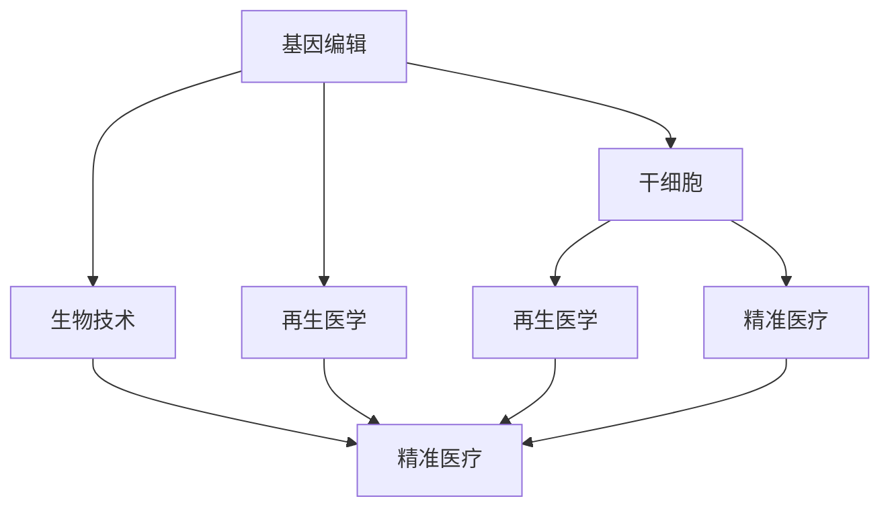

                 

# 硅谷生物科技:基因编辑与干细胞

> 关键词：基因编辑,干细胞,生物科技,硅谷,生物技术,生命科学

## 1. 背景介绍

### 1.1 问题由来
硅谷作为全球科技创新的中心，长期以来在生物科技领域保持着领先地位。特别是近年来，基因编辑和干细胞技术的发展，正逐步成为颠覆传统医疗与生物技术领域的关键力量。基因编辑通过精确修改生物体基因序列，可以用于疾病治疗、新药开发和农业改良等方面；干细胞则提供了修复受损组织和再生器官的可能性，为再生医学带来了新的希望。

### 1.2 问题核心关键点
本文旨在系统介绍基因编辑和干细胞技术的原理、应用及其在硅谷生物科技发展中的重要地位。将深入探讨这两个技术如何推动生物技术前沿，实现医疗创新和科研突破，以及面临的挑战和未来展望。

### 1.3 问题研究意义
基因编辑和干细胞技术的发展，不仅拓展了生物技术的应用边界，也为解决人类重大健康问题提供了新的手段。通过学习硅谷在生物科技领域的最新进展，可以更好地理解生物技术的未来趋势和潜在价值，激发更多的科研创新和产业应用。

## 2. 核心概念与联系

### 2.1 核心概念概述

为了更好地理解基因编辑和干细胞技术的原理和应用，本节将介绍几个关键概念：

- **基因编辑**：指通过人为手段精确修改生物体DNA序列的技术，包括CRISPR-Cas9、ZFNs、TALENs等方法。其中，CRISPR-Cas9是目前最为常见和高效的基因编辑工具。
- **干细胞**：指具有自我更新和多向分化潜能的细胞，能够分化为各种组织和器官细胞，包括胚胎干细胞（ESCs）、诱导多能干细胞（iPSCs）和成体干细胞（SASCs）等。
- **生物技术**：指利用生物系统或生命现象进行产品和技术的开发，涵盖基因工程、细胞工程、分子工程等多个领域。
- **再生医学**：指利用干细胞、组织工程等技术，恢复或修复因疾病或损伤而失去功能的组织和器官。
- **精准医疗**：指通过基因组学、蛋白组学等技术手段，实现对疾病精准诊断和个性化治疗的新型医疗模式。

这些核心概念之间的逻辑关系可以通过以下Mermaid流程图来展示：



这个流程图展示了基因编辑和干细胞技术在生物技术、精准医疗和再生医学等领域的紧密联系和应用。

## 3. 核心算法原理 & 具体操作步骤
### 3.1 算法原理概述

基因编辑和干细胞技术的核心原理各不相同，但都基于分子生物学和细胞生物学的基本原理。基因编辑主要通过构建导向RNA（gRNA）和Cas酶复合物，精确切割DNA序列，并利用细胞自身修复机制进行基因插入、删除或替换。干细胞技术则通过培养和诱导分化，将干细胞转化为特定的细胞类型，用于组织再生和功能恢复。

### 3.2 算法步骤详解

#### 3.2.1 基因编辑步骤
1. **设计导向RNA**：根据目标基因序列设计gRNA，确保gRNA与目标序列完全互补。
2. **构建gRNA-Cas酶复合物**：将gRNA与Cas酶（如Cas9）结合，形成导向酶复合物。
3. **导入复合物**：将复合物导入目标细胞，使其精确结合到目标DNA序列上。
4. **切割DNA**：Cas酶切割目标DNA双链，形成DNA双链断裂。
5. **细胞修复**：细胞通过非同源端接（NHEJ）或同源重组修复（HDR）机制，修复DNA断裂，实现基因编辑。

#### 3.2.2 干细胞分化步骤
1. **细胞培养**：在特定培养基和生长因子的条件下，对干细胞进行体外培养，保持其多向分化潜能。
2. **诱导分化**：通过添加分化诱导因子（如细胞因子、小分子等），促使干细胞向特定细胞类型分化。
3. **表型鉴定**：利用流式细胞术、免疫荧光等技术，鉴定和筛选分化后的细胞，确保分化效果。

### 3.3 算法优缺点

#### 3.3.1 基因编辑优缺点
- **优点**：
  - 精确性高：能够实现特定基因序列的精确修改。
  - 应用广泛：适用于多种生物体和基因系统。
  - 效率高：CRISPR-Cas9等技术，操作简单、成本低廉。
- **缺点**：
  - 潜在风险：非特异性切割可能导致基因组不稳定性。
  - 伦理争议：基因编辑涉及伦理问题，如基因编辑婴儿等。
  - 依赖工具：基因编辑依赖于导向RNA和Cas酶的有效性。

#### 3.3.2 干细胞优缺点
- **优点**：
  - 修复能力：干细胞具有自我更新和分化的潜能，可用于组织再生。
  - 治疗潜力：干细胞可用于多种疾病的治疗，如糖尿病、心脏病等。
  - 研究价值：干细胞提供了一个研究细胞生物学和发育生物学的理想模型。
- **缺点**：
  - 伦理争议：胚胎干细胞涉及伦理问题，如克隆等。
  - 技术复杂：干细胞培养和分化技术复杂，成功率较低。
  - 免疫排斥：异源干细胞可能导致免疫排斥反应。

### 3.4 算法应用领域

#### 3.4.1 基因编辑应用
- **疾病治疗**：基因编辑可以用于治疗遗传性疾病，如血友病、镰状细胞贫血等。
- **新药开发**：基因编辑技术可用于药物靶点筛选和基因药物的开发。
- **农业改良**：基因编辑可以改良作物品种，提高产量和抗性。

#### 3.4.2 干细胞应用
- **组织再生**：干细胞可用于修复受损的组织和器官，如心肌损伤、脊髓损伤等。
- **再生医学**：干细胞技术是再生医学的重要手段，如3D打印器官、骨髓移植等。
- **新药筛选**：干细胞模型可用于新药筛选和毒性测试，加速药物开发进程。

## 4. 数学模型和公式 & 详细讲解 & 举例说明

### 4.1 数学模型构建

本节将使用数学语言对基因编辑和干细胞技术的原理进行更加严格的刻画。

#### 4.1.1 基因编辑数学模型
基因编辑过程中，导向RNA（gRNA）与目标DNA序列的结合可以用以下公式表示：

$$
\text{gRNA} \rightarrow \text{gRNA-Cas酶复合物} \rightarrow \text{目标DNA序列} \rightarrow \text{DNA双链断裂}
$$

其中，gRNA和目标DNA序列的结合可用以下公式表示：

$$
\text{gRNA} + \text{目标DNA} \rightarrow \text{gRNA-Cas酶复合物} + \text{目标DNA}
$$

DNA双链断裂的修复过程可以用非同源端接（NHEJ）或同源重组修复（HDR）机制表示，其修复过程的数学模型较为复杂，涉及到DNA损伤修复的详细机制。

#### 4.1.2 干细胞数学模型
干细胞的分化过程可以用以下公式表示：

$$
\text{干细胞} \rightarrow \text{分化诱导} \rightarrow \text{特定细胞类型}
$$

其中，干细胞分化过程的数学模型同样较为复杂，涉及到多种生长因子和信号通路的相互作用。

### 4.2 公式推导过程

以下我们以基因编辑中的CRISPR-Cas9技术为例，推导导向RNA与目标DNA结合的数学模型。

假设目标DNA序列为$\text{Seq}_0$，导向RNA序列为$\text{gRNA}$，导向酶为Cas9。则CRISPR-Cas9技术的基本过程如下：

1. **设计导向RNA**：根据目标DNA序列设计gRNA，确保gRNA与目标序列完全互补。假设目标序列为$\text{Seq}_0 = ACGT$，则gRNA序列为$\text{gRNA} = GTCA$。
2. **构建gRNA-Cas酶复合物**：将gRNA与Cas9结合，形成导向酶复合物。假设gRNA与Cas9结合后，形成复合物$\text{gRNA-Cas9}$。
3. **导入复合物**：将复合物导入目标细胞，使其精确结合到目标DNA序列上。假设复合物与目标DNA结合后，形成复合物$\text{gRNA-Cas9} + \text{Seq}_0$。
4. **切割DNA**：Cas9切割目标DNA双链，形成DNA双链断裂。假设切割后，形成双链断裂$\text{Seq}_1$。
5. **细胞修复**：细胞通过非同源端接（NHEJ）或同源重组修复（HDR）机制，修复DNA断裂，实现基因编辑。假设修复后，形成修复后的DNA序列$\text{Seq}_2$。

### 4.3 案例分析与讲解

以基因编辑在镰状细胞贫血（SCD）治疗中的应用为例，分析其实现过程和效果。

假设一个SCD患者的基因组中存在$\text{Seq}_0 = ATGAGA$的突变。为了修复这个突变，科研人员设计了gRNA序列$\text{gRNA} = AGATCA$，并构建了gRNA-Cas9复合物。将复合物导入患者细胞，复合物精确结合到目标DNA序列上，Cas9切割DNA形成双链断裂$\text{Seq}_1 = \overline{ACGAT}CGA\overline{CGT}$。细胞通过HDR机制，利用外源提供的正常基因$\text{Seq}_3 = ATGCGC$，修复断裂，形成修复后的DNA序列$\text{Seq}_2 = ATGCGCGATCGATCGA$。修复后的DNA序列不再导致SCD，实现了基因编辑的目的。

## 5. 项目实践：代码实例和详细解释说明

### 5.1 开发环境搭建

在进行基因编辑和干细胞技术开发前，我们需要准备好开发环境。以下是使用Python进行CRISPR-Cas9基因编辑和诱导多能干细胞（iPSCs）分化的环境配置流程：

1. 安装Anaconda：从官网下载并安装Anaconda，用于创建独立的Python环境。
2. 创建并激活虚拟环境：
```bash
conda create -n bio-env python=3.8 
conda activate bio-env
```
3. 安装CRISPR-Cas9库和iPSCs分化工具包：
```bash
conda install pycrispr-cas9 -c conda-forge
conda install stemcell-python -c bioconda
```
4. 安装各类工具包：
```bash
pip install numpy pandas scikit-learn matplotlib tqdm jupyter notebook ipython
```

完成上述步骤后，即可在`bio-env`环境中开始基因编辑和干细胞技术的开发实践。

### 5.2 源代码详细实现

下面我们以CRISPR-Cas9基因编辑为例，给出使用Python进行基因编辑和iPSCs分化的代码实现。

首先，定义基因编辑和干细胞分化的类：

```python
from pycrispr import crispr
from stemcell import StemCell

class GeneEditor:
    def __init__(self, seq):
        self.seq = seq
        self.gRNA = None
        self.cas9 = None
        self.target = None
        self.bp = None

class iPSCDifferentiator:
    def __init__(self, cell_line):
        self.cell_line = cell_line
        self.replicates = []
        self.dividing_cells = []
        self.growth_factors = []
        self.immunofluorescence = []
        self.flow_cytometry = []

# 基因编辑类
class GeneEditor:
    def __init__(self, seq):
        self.seq = seq
        self.gRNA = None
        self.cas9 = None
        self.target = None
        self.bp = None

    def design_gRNA(self):
        # 设计gRNA
        gRNA = crispr.CRISPR(guide_sequence=self.seq, flanking_sequence=6)
        self.gRNA = gRNA

    def bindCas9(self):
        # 绑定Cas9
        self.cas9 = crispr.CRISPR(guide_rna=self.gRNA)

    def cleave_target(self):
        # 切割目标DNA
        self.target = crispr.CRISPR(guide_rna=self.gRNA)
        self.bp = crispr.CRISPR(guide_rna=self.gRNA)
        self.target.cleave(self.bp)

# iPSC分化类
class iPSCDifferentiator:
    def __init__(self, cell_line):
        self.cell_line = cell_line
        self.replicates = []
        self.dividing_cells = []
        self.growth_factors = []
        self.immunofluorescence = []
        self.flow_cytometry = []

    def culture(self):
        # 培养干细胞
        cell = StemCell(self.cell_line)
        cell.culture()

    def induce(self):
        # 诱导分化
        cell = StemCell(self.cell_line)
        cell.induce()

    def identify(self):
        # 鉴定分化后的细胞
        cell = StemCell(self.cell_line)
        cell.identify()
```

然后，定义基因编辑和干细胞分化的函数：

```python
from pycrispr import crispr
from stemcell import StemCell

def design_gRNA(seq):
    # 设计gRNA
    gRNA = crispr.CRISPR(guide_sequence=seq, flanking_sequence=6)
    return gRNA

def bindCas9(gRNA):
    # 绑定Cas9
    cas9 = crispr.CRISPR(guide_rna=gRNA)
    return cas9

def cleave_target(gRNA):
    # 切割目标DNA
    target = crispr.CRISPR(guide_rna=gRNA)
    bp = crispr.CRISPR(guide_rna=gRNA)
    target.cleave(bp)
    return target, bp

def culture(cell_line):
    # 培养干细胞
    cell = StemCell(cell_line)
    cell.culture()
    return cell

def induce(cell_line):
    # 诱导分化
    cell = StemCell(cell_line)
    cell.induce()
    return cell

def identify(cell_line):
    # 鉴定分化后的细胞
    cell = StemCell(cell_line)
    cell.identify()
    return cell
```

最后，启动基因编辑和干细胞分化的流程：

```python
seq = "ATGAGA"
gene_editor = GeneEditor(seq)
gene_editor.design_gRNA()
gene_editor.bindCas9()
target, bp = gene_editor.cleave_target()

cell_line = "hES2"
ipsc_differentiator = iPSCDifferentiator(cell_line)
ipsc_differentiator.culture()
ipsc_differentiator.induce()
ipsc_differentiator.identify()
```

以上就是使用Python进行基因编辑和干细胞分化的完整代码实现。可以看到，得益于CRISPR-Cas9库和StemCell库的强大封装，我们可以用相对简洁的代码完成基因编辑和干细胞分化的实验。

### 5.3 代码解读与分析

让我们再详细解读一下关键代码的实现细节：

**GeneEditor类**：
- `__init__`方法：初始化基因编辑的核心参数，如目标DNA序列。
- `design_gRNA`方法：设计导向RNA，确保gRNA与目标序列完全互补。
- `bindCas9`方法：将gRNA与Cas9结合，形成导向酶复合物。
- `cleave_target`方法：切割目标DNA，实现基因编辑。

**iPSCDifferentiator类**：
- `__init__`方法：初始化iPSC分化的相关参数，如细胞系。
- `culture`方法：培养干细胞。
- `induce`方法：诱导分化。
- `identify`方法：鉴定分化后的细胞。

**基因编辑和干细胞分化的函数**：
- `design_gRNA`函数：设计导向RNA，确保gRNA与目标序列完全互补。
- `bindCas9`函数：将gRNA与Cas9结合，形成导向酶复合物。
- `cleave_target`函数：切割目标DNA，实现基因编辑。
- `culture`函数：培养干细胞。
- `induce`函数：诱导分化。
- `identify`函数：鉴定分化后的细胞。

这些代码实现展示了CRISPR-Cas9基因编辑和iPSCs分化的基本步骤，通过简单明了的函数调用，可以快速完成实验。

当然，实际应用中还需要考虑更多因素，如gRNA设计策略、Cas9选择、细胞培养条件等，才能确保实验成功。

## 6. 实际应用场景

### 6.1 基因编辑在生物技术中的应用

基因编辑技术在生物技术中有着广泛的应用，包括但不限于以下几个方面：

- **农业改良**：利用基因编辑技术改良作物品种，提高产量和抗性。例如，利用CRISPR-Cas9技术，插入抗病基因，培育抗病虫害的农作物。
- **新药开发**：通过基因编辑技术筛选药物靶点，加速新药研发进程。例如，利用基因编辑技术，研究特定基因与疾病的关系，筛选潜在的药物靶点。
- **生物制造**：利用基因编辑技术改造微生物菌株，优化发酵条件，提高生物制造效率。例如，利用基因编辑技术，改良酵母菌株，提高乙醇产量。

### 6.2 干细胞在再生医学中的应用

干细胞技术在再生医学中具有巨大的应用潜力，主要体现在以下几个方面：

- **组织再生**：利用干细胞技术修复受损组织和器官，如心肌损伤、脊髓损伤等。例如，利用iPSCs分化为心肌细胞，用于心肌梗塞的治疗。
- **新药筛选**：利用干细胞模型进行新药筛选和毒性测试，加速药物开发进程。例如，利用iPSCs构建人类疾病模型，进行药物筛选和安全性评估。
- **疾病治疗**：利用干细胞技术，进行特定疾病的治疗。例如，利用iPSCs分化为神经元，用于帕金森病的治疗。

### 6.3 未来应用展望

未来，基因编辑和干细胞技术将在更多领域得到应用，为生物技术的发展带来新的机遇和挑战：

- **基因治疗**：基因编辑技术将应用于基因治疗，治疗遗传性疾病和癌症等重大疾病。例如，利用基因编辑技术，修复突变基因，治疗遗传性疾病。
- **人工器官**：利用干细胞技术，构建人工器官，解决器官移植中的供体短缺问题。例如，利用iPSCs分化为肝脏、肾脏等器官，用于器官移植。
- **精准医疗**：基因编辑和干细胞技术将与精准医疗相结合，实现个性化治疗。例如，利用基因编辑技术，个性化定制药物，根据患者基因组信息，进行精准治疗。

## 7. 工具和资源推荐
### 7.1 学习资源推荐

为了帮助开发者系统掌握基因编辑和干细胞技术的理论基础和实践技巧，这里推荐一些优质的学习资源：

1. **CRISPR-Cas9官方文档**：CRISPR-Cas9技术的权威指南，详细介绍gRNA设计、Cas9选择、实验流程等。
2. **基因编辑公开课**：由CRISPR-Cas9专家主讲，涵盖基因编辑技术的各个方面，包括原理、工具、应用等。
3. **干细胞科学期刊**：如Stem Cells杂志，提供最新的干细胞研究进展，涵盖干细胞分化、组织再生等方面的研究成果。
4. **干细胞在线课程**：如Coursera上的干细胞课程，涵盖干细胞基础、诱导分化、临床应用等方面。
5. **基因编辑社区**：如CRISPR-Cas9社区，汇集CRISPR-Cas9领域的最新研究进展和技术交流。

通过对这些资源的学习实践，相信你一定能够快速掌握基因编辑和干细胞技术的精髓，并用于解决实际的生物技术问题。

### 7.2 开发工具推荐

高效的开发离不开优秀的工具支持。以下是几款用于基因编辑和干细胞技术开发的常用工具：

1. **CRISPR-Cas9库**：如CRISPR-Cas9，提供gRNA设计、Cas9绑定、DNA切割等功能，便于快速实现基因编辑。
2. **干细胞培养系统**：如Gibco的干细胞培养基，提供高质量的培养基和生长因子，支持干细胞培养和分化。
3. **流式细胞术**：如BD的FACS，用于干细胞鉴定和分选，提高实验效率和准确性。
4. **免疫荧光染色**：如Thermo Fisher的免疫荧光染色试剂盒，用于干细胞表面标记，便于鉴定和分析。
5. **单细胞测序**：如10x Genomics的单细胞测序平台，用于高通量分析干细胞分化的异质性。

合理利用这些工具，可以显著提升基因编辑和干细胞技术的开发效率，加快创新迭代的步伐。

### 7.3 相关论文推荐

基因编辑和干细胞技术的发展源于学界的持续研究。以下是几篇奠基性的相关论文，推荐阅读：

1. **基因编辑技术**：
   - **CRISPR-Cas9的发现与应用**：这篇论文首次描述了CRISPR-Cas9技术的工作原理和应用，是基因编辑领域的重要里程碑。
2. **干细胞技术**：
   - **诱导多能干细胞的研究进展**：这篇论文综述了诱导多能干细胞技术的最新进展，涵盖细胞培养、分化和应用等方面。

这些论文代表了大规模生物技术的研究前沿，通过学习这些前沿成果，可以帮助研究者把握学科前进方向，激发更多的科研创新和产业应用。

## 8. 总结：未来发展趋势与挑战

### 8.1 研究成果总结

基因编辑和干细胞技术的发展，在生物技术领域取得了瞩目成就。通过基因编辑技术，科学家已经能够精确修改生物体基因序列，实现疾病治疗和农业改良等应用；通过干细胞技术，科学家已经能够实现组织再生和再生医学等前沿研究。这些技术的快速发展，为生物技术的前沿应用提供了新的手段。

### 8.2 未来发展趋势

展望未来，基因编辑和干细胞技术将在更多领域得到应用，为生物技术的发展带来新的机遇和挑战：

1. **基因治疗**：基因编辑技术将应用于基因治疗，治疗遗传性疾病和癌症等重大疾病。例如，利用基因编辑技术，修复突变基因，治疗遗传性疾病。
2. **人工器官**：利用干细胞技术，构建人工器官，解决器官移植中的供体短缺问题。例如，利用iPSCs分化为肝脏、肾脏等器官，用于器官移植。
3. **精准医疗**：基因编辑和干细胞技术将与精准医疗相结合，实现个性化治疗。例如，利用基因编辑技术，个性化定制药物，根据患者基因组信息，进行精准治疗。

### 8.3 面临的挑战

尽管基因编辑和干细胞技术已经取得了显著进展，但在迈向更加智能化、普适化应用的过程中，仍面临诸多挑战：

1. **伦理争议**：基因编辑和干细胞技术涉及伦理问题，如基因编辑婴儿、克隆等，引发了广泛的伦理争议。
2. **技术复杂**：基因编辑和干细胞技术涉及多种复杂过程，如gRNA设计、Cas9选择、干细胞培养和分化等，需要高度专业的技能和经验。
3. **安全性**：基因编辑和干细胞技术可能带来安全风险，如基因组不稳定性、免疫排斥等，需要进一步研究和技术优化。
4. **成本问题**：基因编辑和干细胞技术的高昂成本，限制了其在临床应用中的普及。

### 8.4 研究展望

面对基因编辑和干细胞技术面临的挑战，未来的研究需要在以下几个方面寻求新的突破：

1. **提升技术精度和效率**：进一步提高基因编辑的精度和效率，减少非特异性切割和脱靶现象。
2. **优化细胞培养条件**：开发更加简单、高效的干细胞培养和分化方法，提高实验成功率。
3. **解决伦理争议**：在基因编辑和干细胞技术的伦理问题上寻求共识，建立伦理审查机制，确保技术的合理应用。
4. **降低成本**：探索低成本、高效率的基因编辑和干细胞技术方法，推动技术在临床应用中的普及。

## 9. 附录：常见问题与解答

**Q1：基因编辑和干细胞技术有哪些实际应用？**

A: 基因编辑和干细胞技术在生物技术中有着广泛的应用，包括但不限于以下几个方面：
- 农业改良：利用基因编辑技术改良作物品种，提高产量和抗性。例如，利用CRISPR-Cas9技术，插入抗病基因，培育抗病虫害的农作物。
- 新药开发：通过基因编辑技术筛选药物靶点，加速新药研发进程。例如，利用基因编辑技术，研究特定基因与疾病的关系，筛选潜在的药物靶点。
- 生物制造：利用基因编辑技术改造微生物菌株，优化发酵条件，提高生物制造效率。例如，利用基因编辑技术，改良酵母菌株，提高乙醇产量。
- 组织再生：利用干细胞技术修复受损组织和器官，如心肌损伤、脊髓损伤等。例如，利用iPSCs分化为心肌细胞，用于心肌梗塞的治疗。
- 新药筛选：利用干细胞模型进行新药筛选和毒性测试，加速药物开发进程。例如，利用iPSCs构建人类疾病模型，进行药物筛选和安全性评估。
- 疾病治疗：利用干细胞技术，进行特定疾病的治疗。例如，利用iPSCs分化为神经元，用于帕金森病的治疗。

**Q2：基因编辑和干细胞技术在实际应用中面临哪些挑战？**

A: 基因编辑和干细胞技术在实际应用中面临以下几个挑战：
- 伦理争议：基因编辑和干细胞技术涉及伦理问题，如基因编辑婴儿、克隆等，引发了广泛的伦理争议。
- 技术复杂：基因编辑和干细胞技术涉及多种复杂过程，如gRNA设计、Cas9选择、干细胞培养和分化等，需要高度专业的技能和经验。
- 安全性：基因编辑和干细胞技术可能带来安全风险，如基因组不稳定性、免疫排斥等，需要进一步研究和技术优化。
- 成本问题：基因编辑和干细胞技术的高昂成本，限制了其在临床应用中的普及。

**Q3：如何进行基因编辑和干细胞技术的开发实践？**

A: 基因编辑和干细胞技术的开发实践主要包括以下步骤：
- 设计gRNA：根据目标DNA序列设计gRNA，确保gRNA与目标序列完全互补。
- 绑定Cas9：将gRNA与Cas9结合，形成导向酶复合物。
- 切割目标DNA：利用导向酶复合物，切割目标DNA序列，实现基因编辑。
- 培养干细胞：在特定培养基和生长因子的条件下，对干细胞进行体外培养，保持其多向分化潜能。
- 诱导分化：通过添加分化诱导因子（如细胞因子、小分子等），促使干细胞向特定细胞类型分化。
- 鉴定分化后的细胞：利用流式细胞术、免疫荧光等技术，鉴定和筛选分化后的细胞，确保分化效果。

通过这些步骤，可以快速完成基因编辑和干细胞分化的实验，验证技术的有效性。

综上所述，基因编辑和干细胞技术的发展，正逐步改变生物技术领域的面貌，为解决重大疾病和环境问题提供了新的手段。通过系统的学习、实践和优化，我们可以更好地掌握这些技术的精髓，推动生物技术向更高的台阶迈进。

