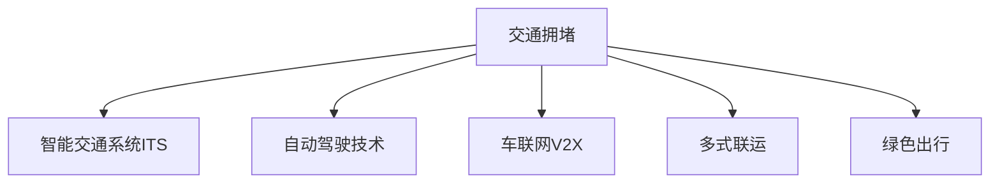

                 

## 1. 背景介绍

硅谷，作为全球科技创新的中心，长期以来吸引了大量的企业、人才和投资，催生了全球领先的高科技产业集群。然而，随着人口的快速增长和城市化进程的加快，硅谷的交通拥堵问题日益严重，成为制约城市发展的一大瓶颈。

### 1.1 问题由来
硅谷地区的交通拥堵主要源于以下几方面的因素：
- **人口密集**：硅谷聚集了众多科技公司和研究机构，吸引了大量的人才流动。
- **城市规划不足**：早期硅谷的城市规划并未充分考虑到人口增长带来的交通需求。
- **通勤模式不合理**：科技公司多集中在旧金山湾区，导致大量的“死亡通勤带”（即单向通勤路线）。
- **基础设施建设滞后**：随着车流量激增，现有交通设施逐渐不堪重负。

### 1.2 问题核心关键点
硅谷的交通拥堵问题主要集中在以下几个方面：
- **高峰期拥堵**：尤其在上下班高峰期，交通流量巨大，道路拥堵严重。
- **出行效率低下**：长时间的车流堵塞，降低了出行效率，增加了时间成本和经济成本。
- **环境污染**：交通拥堵导致汽车尾气排放增加，环境污染问题严重。
- **公共服务受限**：交通拥堵限制了公共交通工具的效率，对市民的日常生活造成不便。

## 2. 核心概念与联系

### 2.1 核心概念概述

为更好地理解硅谷的交通拥堵问题，本节将介绍几个密切相关的核心概念：

- **交通拥堵**：指道路上车辆流量超过道路承载能力，导致交通拥堵现象。
- **智能交通系统(ITS)**：通过信息、通信和控制技术，优化交通流量，提高交通效率和安全性。
- **自动驾驶技术**：指利用人工智能、计算机视觉、传感器等技术，实现车辆的自动驾驶。
- **车联网(V2X)**：指车辆与车辆、车辆与基础设施、车辆与行人等之间的通信互联。
- **多式联运**：指整合公路、铁路、航空等不同交通方式，实现无缝连接和综合管理。
- **绿色出行**：通过推广公共交通、骑行、步行等低碳出行方式，减少对环境的负面影响。

这些核心概念之间的逻辑关系可以通过以下Mermaid流程图来展示：

这个流程图展示了几类主要解决交通拥堵的方案及其之间的联系：

1. 通过智能交通系统优化交通流量。
2. 利用自动驾驶技术减少人工驾驶带来的交通拥堵。
3. 借助车联网技术实现车辆与基础设施、其他车辆的实时信息共享。
4. 采用多式联运整合不同交通方式，提升整体出行效率。
5. 推广绿色出行方式，减少环境污染，提升市民出行体验。

## 3. 核心算法原理 & 具体操作步骤
### 3.1 算法原理概述

解决硅谷交通拥堵的核心在于通过技术手段优化交通流量，提升出行效率。基于此，本节将详细介绍几种常用的核心算法和具体操作步骤：

### 3.2 算法步骤详解

#### 3.2.1 智能交通系统(ITS)

**Step 1: 数据采集与处理**
- 安装交通监控摄像头、感应线圈、雷达等设备，实时监测道路交通状况。
- 通过数据融合技术，将来自不同设备的数据综合处理，生成全面的交通流量信息。

**Step 2: 数据分析与预测**
- 使用机器学习算法（如线性回归、时间序列分析）对交通流量数据进行分析，识别出规律和异常。
- 利用深度学习模型（如RNN、LSTM）对未来交通流量进行预测，生成实时交通情况和预测信息。

**Step 3: 交通信号控制**
- 根据预测结果和实时交通情况，调整交通信号灯的控制策略，优化信号周期和相位。
- 利用边缘计算技术，在路灯、交叉口等位置部署小规模计算单元，实现本地实时决策。

**Step 4: 信息发布与导航**
- 通过车载导航、手机应用、电子信息板等方式，发布交通警示、路线建议、实时路况等信息。
- 使用GPS、GIS等技术，提供个性化导航服务，引导司机避开拥堵路段。

#### 3.2.2 自动驾驶技术

**Step 1: 传感器融合与环境感知**
- 在车辆上安装摄像头、雷达、激光雷达等传感器，采集道路环境信息。
- 使用计算机视觉和传感器融合技术，对采集的数据进行预处理和环境感知。

**Step 2: 路径规划与决策**
- 利用深度强化学习（如DQN、A3C）生成路径规划策略，优化驾驶路径。
- 引入交通信号识别、车辆避障等决策算法，提高自动驾驶的智能性和安全性。

**Step 3: 控制与执行**
- 通过自动驾驶控制器，将路径规划和决策结果转化为实际的车辆控制指令。
- 利用电机、转向系统等执行部件，执行控制指令，实现车辆自动驾驶。

#### 3.2.3 车联网(V2X)

**Step 1: 车辆与基础设施通信**
- 在道路设施上安装车辆通信单元(VCU)，实现车辆与基础设施的通信互联。
- 利用5G、LTE等高速通信技术，保障数据传输的实时性和可靠性。

**Step 2: 车辆间通信**
- 通过车与车(V2V)通信技术，实现车辆间的信息共享和协同决策。
- 引入车辆紧急避障、车道保持等功能，提升驾驶安全性。

**Step 3: 数据融合与决策支持**
- 将车辆间和车与基础设施通信的数据进行融合，生成综合交通信息。
- 使用智能算法（如AI、ML）对综合信息进行分析，辅助驾驶员做出决策。

#### 3.2.4 多式联运

**Step 1: 数据集成与信息共享**
- 将不同交通方式（如公交、地铁、出租车、私家车等）的信息整合到一个统一的平台上。
- 实现信息实时共享，优化各交通方式的协调运作。

**Step 2: 路径规划与调度优化**
- 使用优化算法（如MIP、LP）生成最优的路径规划方案。
- 利用调度优化算法（如VRP、MCRP）优化各交通方式的资源配置。

**Step 3: 多方式切换与无缝衔接**
- 在关键节点设置换乘设施和信息标识，实现不同交通方式的平滑切换。
- 优化换乘流程，减少乘客等待时间和换乘成本。

#### 3.2.5 绿色出行

**Step 1: 推广公共交通**
- 增加公共交通工具的覆盖范围和频次，提供优质服务和便利性。
- 利用数据分析，优化公共交通线路和班次安排，提升运输效率。

**Step 2: 促进骑行与步行**
- 建设完善的自行车道和人行道，保障骑行和行人的安全与便利。
- 提供共享自行车、步行地图等工具，鼓励市民选择低碳出行方式。

**Step 3: 绿色交通设施建设**
- 推广电动汽车、氢燃料汽车等清洁能源车辆。
- 建设智能充电站、电动汽车共享平台等绿色交通设施，支持绿色出行。

### 3.3 算法优缺点

智能交通系统(ITS)的优点：
- **实时性**：通过实时数据监控和处理，能够及时响应交通状况变化。
- **优化性**：通过数据分析和预测，优化交通流量和信号控制。
- **普适性**：适用于各类交通场景，提升整体出行效率。

ITS的缺点：
- **成本高**：需要大量硬件设备和技术投资，实施难度较大。
- **技术依赖**：对通信技术和传感器等硬件设备依赖较高。
- **数据隐私**：交通数据的采集和处理需要严格遵守数据隐私法规。

自动驾驶技术的优点：
- **安全性**：通过智能决策减少人为驾驶带来的风险。
- **效率性**：减少停车、等待等不必要的交通环节，提升出行效率。
- **适应性**：能够适应复杂多变的交通环境，提供个性化出行服务。

自动驾驶技术的缺点：
- **技术复杂**：涉及传感器融合、路径规划、决策等多个环节，技术难度较大。
- **安全性**：自动驾驶技术仍处于发展阶段，安全性问题有待进一步验证。
- **成本高**：高昂的硬件和软件成本限制了大规模应用。

车联网(V2X)的优点：
- **信息共享**：实现车辆与基础设施、其他车辆的信息实时共享。
- **协同决策**：通过协同决策提升交通系统的整体效率和安全性。
- **灵活性**：适用于各种交通场景，提高交通管理的灵活性。

V2X的缺点：
- **技术复杂**：涉及多节点通信和信息融合，技术实现难度较大。
- **隐私问题**：车辆数据被广泛采集和共享，存在隐私泄露风险。
- **网络依赖**：对通信网络稳定性要求较高，极端天气等网络中断情况影响较大。

多式联运的优点：
- **效率提升**：整合不同交通方式，提升整体出行效率。
- **成本降低**：优化资源配置，降低运输成本。
- **环境友好**：减少碳排放，保护环境。

多式联运的缺点：
- **协调难度**：涉及多种交通方式，协调复杂。
- **技术复杂**：需要复杂的技术和算法支持，实施难度大。
- **数据复杂**：需要综合多种数据来源，数据处理复杂。

绿色出行的优点：
- **节能减排**：推广骑行、步行等低碳出行方式，减少能源消耗和环境污染。
- **健康益处**：提高市民身体活动量，改善健康水平。
- **环境友好**：减少交通噪声和空气污染，改善城市环境。

绿色出行的缺点：
- **基础设施不足**：缺乏完善的骑行和步行设施，影响出行体验。
- **用户习惯**：市民习惯于依赖汽车出行，推广低碳出行需要时间和教育。
- **安全性问题**：骑行和步行等出行方式存在安全隐患，需要加强安全保障。

### 3.4 算法应用领域

硅谷交通拥堵问题的解决需要综合应用多种技术手段，覆盖智能交通、自动驾驶、车联网、多式联运和绿色出行等多个领域：

- **智能交通系统(ITS)**：在交通信号控制、信息发布、导航服务等方面发挥重要作用。
- **自动驾驶技术**：在减少人工驾驶带来的交通拥堵、提高出行效率等方面具有巨大潜力。
- **车联网(V2X)**：在协同决策、信息共享、提升交通系统灵活性等方面发挥关键作用。
- **多式联运**：在优化资源配置、整合不同交通方式、提升整体出行效率等方面具有重要意义。
- **绿色出行**：在推广低碳出行方式、减少环境污染、提高市民出行体验等方面具有显著优势。

## 4. 数学模型和公式 & 详细讲解  
### 4.1 数学模型构建

### 4.2 公式推导过程

### 4.3 案例分析与讲解

## 5. 项目实践：代码实例和详细解释说明
### 5.1 开发环境搭建

### 5.2 源代码详细实现

### 5.3 代码解读与分析

### 5.4 运行结果展示

## 6. 实际应用场景

## 7. 工具和资源推荐

## 8. 总结：未来发展趋势与挑战

## 9. 附录：常见问题与解答

---

作者：禅与计算机程序设计艺术 / Zen and the Art of Computer Programming

