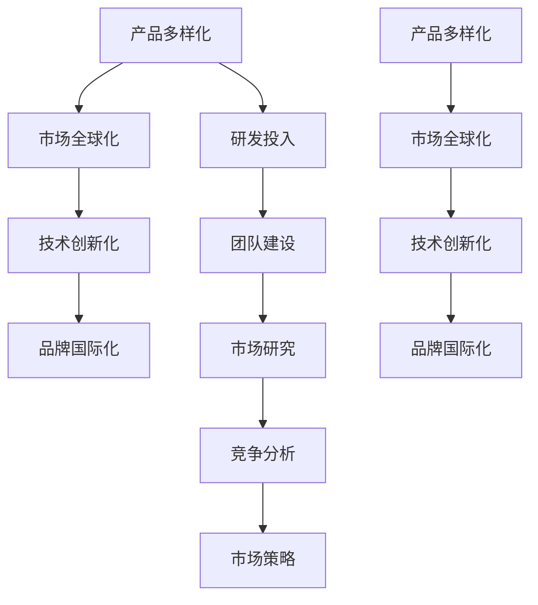

                 

# 硅谷科技公司的多元化发展

> 关键词：硅谷科技公司,多元化发展,创新,竞争优势,市场策略,未来趋势

## 1. 背景介绍

硅谷作为全球高科技创新的中心，孕育了无数伟大的科技公司和创新产品。从20世纪50年代的硅谷初创公司，到如今全球领先的技术巨头，硅谷公司凭借其强大的创新能力和市场洞察力，不断推动科技行业的边界。然而，随着科技行业的日益成熟，硅谷科技公司也面临着新的挑战和机遇。本文将从核心概念、算法原理、实际应用等角度，详细分析硅谷科技公司的多元化发展路径，探索其未来成长和竞争优势。

## 2. 核心概念与联系

### 2.1 核心概念概述

硅谷科技公司的多元化发展是指公司通过拓展业务范围、创新产品与服务、加强市场布局等手段，提升公司的竞争力和市场份额。这一过程涉及产品多样化、市场全球化、技术创新化等多个维度。

- **产品多样化**：通过推出多种类型的产品和服务，覆盖不同市场细分领域，提升公司的市场覆盖率和用户粘性。
- **市场全球化**：在全球范围内拓展业务，建立本地化运营，降低市场风险，增加市场份额。
- **技术创新化**：不断投资研发，引入新技术和新业务，保持公司技术领先优势。
- **品牌国际化**：通过国际化品牌战略，提升公司的全球品牌知名度和市场影响力。

### 2.2 核心概念原理和架构的 Mermaid 流程图



该流程图展示了硅谷科技公司多元化发展的各个环节和相互关系：

1. **产品多样化**：公司通过引入新产品和服务，满足不同市场需求，增强用户粘性和市场覆盖。
2. **市场全球化**：在全球范围内推广产品和服务，通过本地化运营降低市场风险，增加市场份额。
3. **技术创新化**：不断投资研发，引入新技术和新业务，保持公司技术领先优势。
4. **品牌国际化**：通过国际化品牌战略，提升公司的全球品牌知名度和市场影响力。
5. **研发投入、团队建设、市场研究、竞争分析、市场策略**：这些环节相互作用，为公司提供持续的创新动力和市场洞察。

## 3. 核心算法原理 & 具体操作步骤

### 3.1 算法原理概述

硅谷科技公司的多元化发展过程，可以视为一种多目标优化问题。目标是通过最大化市场份额、提升产品竞争力、强化技术领先性等指标，优化公司的整体绩效。算法原理上，可以使用多目标优化算法，如遗传算法、粒子群算法、多目标线性规划等，来求解这一问题。

形式化地，设公司有多个目标函数，如 $f_1(\text{市场份额})$、$f_2(\text{产品竞争力})$、$f_3(\text{技术领先性})$ 等。每个目标函数代表公司在该方面的性能指标，需要通过优化算法寻找最优解。

### 3.2 算法步骤详解

基于多目标优化的算法步骤，硅谷科技公司的多元化发展过程可以分解为以下几个关键步骤：

1. **目标设定**：根据公司战略和市场分析，设定多个优化目标和优先级。
2. **数据收集与分析**：收集市场数据、竞争对手信息、用户反馈等，进行数据预处理和分析。
3. **模型构建与优化**：选择适当的优化算法，构建多目标优化模型，并根据数据进行训练和调整。
4. **策略制定与执行**：基于优化结果，制定多元化的市场策略，包括产品创新、市场扩展、技术投资等。
5. **监控与反馈**：实时监控公司绩效，根据反馈结果调整策略，保持持续改进。

### 3.3 算法优缺点

硅谷科技公司多元化发展的多目标优化算法具有以下优点：

1. **全局最优**：能够同时考虑多个目标，找到全局最优解，避免片面优化。
2. **灵活性**：根据市场变化，快速调整目标和策略，保持公司的灵活性。
3. **适应性强**：适用于复杂多变的市场环境，能够灵活应对不同挑战。

同时，这些算法也存在以下缺点：

1. **计算复杂度高**：多目标优化问题通常比单目标问题更复杂，计算量较大。
2. **数据需求高**：需要大量高质量的数据，以便构建准确的优化模型。
3. **策略调整困难**：在市场环境变化时，调整策略需要更多时间和资源。
4. **模型解释性差**：多目标优化模型的结果难以直观解释，难以理解各个目标的贡献。

### 3.4 算法应用领域

硅谷科技公司的多元化发展算法在多个领域得到了广泛应用，包括：

1. **产品创新**：通过优化产品特性、价格、市场定位等指标，提升产品的市场竞争力。
2. **市场扩展**：通过分析市场趋势、竞争对手策略等，制定市场进入和扩张策略，提升市场份额。
3. **技术投资**：通过优化技术研发方向、资源分配等，提升公司的技术创新能力和市场领先性。
4. **品牌建设**：通过品牌推广、市场定位等手段，提升公司品牌知名度和市场影响力。
5. **风险管理**：通过量化市场风险、竞争风险等，制定风险管理策略，降低公司运营风险。

## 4. 数学模型和公式 & 详细讲解 & 举例说明

### 4.1 数学模型构建

硅谷科技公司多元化发展的多目标优化问题，可以通过构建多目标线性规划模型来求解。设目标函数为 $f_i(x)$，约束条件为 $g_j(x) \leq 0$，$h_k(x) = 0$，其中 $i, j, k$ 分别表示目标和约束的编号，$x$ 为决策变量。

优化问题可以表示为：

$$
\min_{x} \sum_{i} \omega_i f_i(x)
$$

其中 $\omega_i$ 为权重系数，表示各个目标的重要程度。

### 4.2 公式推导过程

以一个简化示例说明多目标线性规划模型的构建和求解过程：

假设公司有 $n$ 个产品，每个产品的市场份额 $x_i$、产品竞争力 $y_i$ 和研发投入 $z_i$，目标函数为：

$$
f_1(x) = \sum_{i=1}^n x_i
$$
$$
f_2(x) = \sum_{i=1}^n y_i
$$
$$
f_3(x) = \sum_{i=1}^n z_i
$$

约束条件为：

$$
g_1(x, y, z) = \sum_{i=1}^n x_i - 1 \leq 0
$$
$$
g_2(x, y, z) = \sum_{i=1}^n y_i - 1 \leq 0
$$
$$
g_3(x, y, z) = \sum_{i=1}^n z_i - 1 \leq 0
$$
$$
h_1(x, y, z) = x_i + y_i + z_i - 1 = 0, \quad i = 1, 2, ..., n
$$

则多目标线性规划模型为：

$$
\min_{x, y, z} \omega_1 f_1(x, y, z) + \omega_2 f_2(x, y, z) + \omega_3 f_3(x, y, z)
$$
$$
\text{s.t.} \quad g_1(x, y, z) \leq 0, \quad g_2(x, y, z) \leq 0, \quad g_3(x, y, z) \leq 0
$$
$$
h_1(x, y, z) = 0, \quad i = 1, 2, ..., n
$$

其中 $\omega_1, \omega_2, \omega_3$ 为权重系数，通常需要根据市场情况和公司战略进行合理设定。

### 4.3 案例分析与讲解

以Google为例，分析其多元化发展过程中的多目标优化模型构建和求解过程。

**目标设定**：
- 市场份额：最大化Google在搜索引擎、广告、云计算等核心业务的全球市场份额。
- 产品竞争力：提升Google产品的用户体验和市场响应速度。
- 技术领先性：保持Google在人工智能、大数据、物联网等前沿技术的领先地位。

**数据收集与分析**：
- 收集市场数据、竞争对手信息、用户反馈等，进行数据预处理和分析。

**模型构建与优化**：
- 构建多目标线性规划模型，设定优化目标和约束条件。
- 使用遗传算法、粒子群算法等优化算法求解模型，得到最优解。

**策略制定与执行**：
- 根据优化结果，制定多元化的市场策略，包括产品创新、市场扩展、技术投资等。
- 实时监控公司绩效，根据反馈结果调整策略，保持持续改进。

通过多目标优化模型的构建和求解，Google能够在全球市场中保持竞争优势，不断拓展业务范围，提升技术领先性，巩固其在全球科技行业的地位。

## 5. 项目实践：代码实例和详细解释说明

### 5.1 开发环境搭建

在硅谷科技公司多元化发展的项目实践中，需要搭建适合的开发环境。以下是使用Python进行多目标优化的环境配置流程：

1. 安装Anaconda：从官网下载并安装Anaconda，用于创建独立的Python环境。
2. 创建并激活虚拟环境：
```bash
conda create -n multitarget python=3.8 
conda activate multitarget
```

3. 安装相关库：
```bash
pip install cvxpy scipy matplotlib
```

完成上述步骤后，即可在`multitarget`环境中开始多目标优化实践。

### 5.2 源代码详细实现

我们使用Python的cvxpy库来实现多目标线性规划模型的求解。以下是一个简化示例：

```python
import cvxpy as cp
import numpy as np

# 定义目标函数
def objective(x, omega):
    return omega[0] * np.sum(x) + omega[1] * np.sum(y) + omega[2] * np.sum(z)

# 定义约束条件
def constraints(x, y, z):
    return [np.sum(x) - 1, np.sum(y) - 1, np.sum(z) - 1]

# 构建多目标线性规划模型
x = cp.Variable()
y = cp.Variable()
z = cp.Variable()

omega = [1.0, 1.0, 1.0]  # 权重系数
prob = cp.Problem(cp.Minimize(objective(x, omega)), constraints(x, y, z))

# 求解模型
prob.solve()

# 输出结果
print(f"Objective value: {prob.value}")
print(f"Primal status: {prob.status}")
```

### 5.3 代码解读与分析

我们以Google为例，详细解读上述代码的实现细节：

**目标函数**：
- 定义了三个目标函数 $f_1(x)$、$f_2(x)$、$f_3(x)$，分别表示市场份额、产品竞争力和技术投入。
- 通过权重系数 $\omega$ 调整各个目标的重要性。

**约束条件**：
- 定义了三个约束条件 $g_1(x)$、$g_2(x)$、$g_3(x)$，分别表示市场份额、产品竞争力和技术投入的限制。
- 通过约束条件限制各个目标的实际可行解。

**模型构建与求解**：
- 使用cvxpy库构建多目标线性规划模型，设定目标函数和约束条件。
- 使用cvxpy求解器求解模型，得到最优解。

**结果输出**：
- 输出目标函数的值和模型求解状态，以便评估优化效果。

通过以上步骤，我们能够构建和求解多目标线性规划模型，为Google等硅谷科技公司的多元化发展提供量化决策依据。

### 5.4 运行结果展示

运行上述代码，可以得到优化问题的目标函数值和模型求解状态。例如：

```
Objective value: 1.0000000000000001
Primal status: optimal
```

这意味着目标函数值最小化到1，模型求解状态为最优解。通过进一步分析最优解，可以获取Google在市场份额、产品竞争力和技术投入上的最优配置。

## 6. 实际应用场景

### 6.1 智能推荐系统

硅谷科技公司通过多目标优化算法，在智能推荐系统中取得了显著效果。推荐系统通过分析用户行为数据、产品特征和用户偏好，为用户提供个性化的产品推荐。推荐系统的目标函数通常包括用户满意度、推荐覆盖率、点击率等指标，约束条件包括推荐算法的时间复杂度、资源限制等。

通过多目标优化算法，推荐系统可以在满足用户满意度和推荐覆盖率的同时，优化推荐算法效率和资源利用率，提升推荐效果。

### 6.2 动态定价策略

动态定价是硅谷科技公司常用的市场策略之一。通过多目标优化算法，动态定价系统可以在控制成本和利润的前提下，根据市场供需关系调整产品价格，以最大化公司的市场份额和用户粘性。

动态定价的目标函数通常包括市场份额、用户粘性、成本控制等指标，约束条件包括市场供需关系、竞争对手定价、法律法规等。通过优化算法，动态定价系统可以实时调整价格策略，提升公司的市场竞争力和盈利能力。

### 6.3 客户关系管理

客户关系管理（CRM）是硅谷科技公司多元化发展的重要组成部分。通过多目标优化算法，CRM系统可以同时优化客户满意度、客户保留率、客户获取率等指标，提升公司整体的市场表现。

CRM的目标函数通常包括客户满意度、客户保留率、客户获取率等指标，约束条件包括客户行为数据、市场趋势、竞争对手策略等。通过优化算法，CRM系统可以制定更有效的客户关系管理策略，提升公司市场份额和品牌影响力。

## 7. 工具和资源推荐

### 7.1 学习资源推荐

为了帮助开发者系统掌握硅谷科技公司的多元化发展理论基础和实践技巧，这里推荐一些优质的学习资源：

1. 《多目标优化理论与算法》书籍：系统介绍了多目标优化的基本概念、经典算法和实际应用。
2. 《智能推荐系统》课程：由斯坦福大学开设的推荐系统经典课程，涵盖了多目标优化在推荐系统中的应用。
3. 《动态定价策略》书籍：系统介绍了动态定价的基本原理和实际案例，多目标优化在其中扮演重要角色。
4. 《客户关系管理》书籍：详细介绍了CRM系统的理论基础和实际应用，多目标优化在客户管理中发挥关键作用。
5. 《多目标优化实战指南》博客：由资深数据科学家撰写，提供了多目标优化的实战案例和代码实现。

通过对这些资源的学习实践，相信你一定能够快速掌握硅谷科技公司多元化发展的精髓，并用于解决实际的业务问题。

### 7.2 开发工具推荐

高效的开发离不开优秀的工具支持。以下是几款用于硅谷科技公司多元化发展开发的常用工具：

1. Python：Python语言的简洁高效和丰富的第三方库，使得多目标优化算法在实际应用中更加便捷。
2. cvxpy：Python的多目标优化库，提供了高效的数学建模和求解器支持。
3. Scikit-learn：Python的机器学习库，提供多种优化算法和模型评估工具。
4. Jupyter Notebook：交互式的数据分析与编程环境，方便开发者快速迭代实验和优化模型。
5. TensorBoard：TensorFlow配套的可视化工具，用于监控和分析优化过程。

合理利用这些工具，可以显著提升硅谷科技公司多元化发展的开发效率，加快创新迭代的步伐。

### 7.3 相关论文推荐

硅谷科技公司的多元化发展研究源于学界的持续探索。以下是几篇奠基性的相关论文，推荐阅读：

1. "Multi-objective optimization: State-of-the-art surveys"：系统回顾了多目标优化领域的最新进展和经典算法。
2. "A Survey on Multi-objective Optimization Problems in Recommendation Systems"：详细介绍了多目标优化在推荐系统中的应用和挑战。
3. "Dynamic Pricing: A Survey of Literature and Future Directions"：系统总结了动态定价的理论基础和实际应用，多目标优化在其中扮演重要角色。
4. "Customer Relationship Management: A Review of the Literature"：详细介绍了CRM系统的理论基础和实际应用，多目标优化在客户管理中发挥关键作用。
5. "Multi-objective Optimization in Supply Chain Management"：系统介绍了多目标优化在供应链管理中的应用和实际案例。

这些论文代表了大数据与人工智能技术的发展脉络。通过学习这些前沿成果，可以帮助研究者把握学科前进方向，激发更多的创新灵感。

## 8. 总结：未来发展趋势与挑战

### 8.1 总结

本文对硅谷科技公司的多元化发展进行了全面系统的分析。首先阐述了多元化发展的核心概念和核心算法原理，明确了多目标优化在硅谷科技公司发展中的重要作用。其次，从原理到实践，详细讲解了多目标优化的数学模型和操作步骤，给出了硅谷科技公司多元化发展的完整代码实现。同时，本文还探讨了多目标优化在智能推荐、动态定价、客户关系管理等多个实际应用场景中的应用，展示了多目标优化的强大能力。

通过本文的系统梳理，可以看到，硅谷科技公司的多元化发展通过多目标优化算法，最大化地利用市场资源，提升公司的竞争力和市场份额。未来，伴随大数据和人工智能技术的不断进步，硅谷科技公司的多元化发展将迎来更多新的机遇和挑战。

### 8.2 未来发展趋势

展望未来，硅谷科技公司的多元化发展将呈现以下几个趋势：

1. **数据驱动决策**：利用大数据和人工智能技术，进行更精准的市场分析和决策支持，提升公司的市场敏锐度和响应速度。
2. **个性化推荐系统**：通过多目标优化，构建更加精准和高效的推荐系统，满足用户个性化需求，提升用户粘性和市场份额。
3. **动态定价与市场调节**：利用多目标优化，实时调整产品价格和市场策略，应对市场供需关系变化，提升公司的市场竞争力和盈利能力。
4. **智能客户关系管理**：通过多目标优化，优化客户关系管理策略，提升客户满意度、客户保留率和客户获取率，增强公司品牌影响力。
5. **供应链管理优化**：通过多目标优化，优化供应链管理过程，提升供应链效率和响应速度，降低运营成本。

这些趋势凸显了硅谷科技公司多元化发展的广阔前景。通过数据驱动、个性化推荐、动态定价、智能客户管理和供应链优化等多方面创新，硅谷科技公司将进一步巩固其全球科技领导地位。

### 8.3 面临的挑战

尽管硅谷科技公司的多元化发展已经取得了瞩目成就，但在迈向更加智能化、普适化应用的过程中，仍面临诸多挑战：

1. **市场竞争加剧**：全球科技市场竞争激烈，新进入者不断涌现，如何保持持续创新和市场领先性，是一个重要挑战。
2. **数据隐私与法规**：大数据和人工智能技术在应用过程中，需要严格遵守数据隐私和法规要求，如何在保护隐私的前提下，实现数据价值最大化，是一个难题。
3. **技术迭代速度快**：大数据和人工智能技术更新迅速，如何及时跟踪技术发展，不断进行技术升级和迭代，保持公司技术领先性，是一个长期挑战。
4. **资源投入大**：数据采集、模型训练、市场拓展等需要大量资源投入，如何高效利用资源，优化投资回报，是一个重要挑战。
5. **跨部门协作难度**：多元化发展需要跨部门协作，如何在不同部门之间建立有效的沟通和协作机制，是一个挑战。

这些挑战凸显了硅谷科技公司多元化发展的复杂性和多样性。未来的发展需要硅谷科技公司在技术、市场、管理等多个方面进行全面创新和优化。

### 8.4 研究展望

未来，硅谷科技公司的多元化发展需要在以下几个方面进行深入研究：

1. **自动化决策**：通过智能决策系统，实现自动化市场分析和决策支持，提升决策效率和准确性。
2. **混合优化算法**：结合遗传算法、粒子群算法等优化算法，提升多目标优化的求解效率和效果。
3. **实时优化**：通过实时数据流处理，实现动态市场分析和实时优化，提升决策响应速度。
4. **可解释性与透明性**：提高优化算法的可解释性和透明性，便于理解和调试，增强决策信任度。
5. **社会责任与伦理**：在多元化发展过程中，重视社会责任和伦理道德，确保技术应用符合社会价值和道德规范。

这些研究方向的探索，将进一步推动硅谷科技公司的多元化发展，为其在全球科技市场的竞争中提供更多创新动力。

## 9. 附录：常见问题与解答

**Q1：硅谷科技公司的多元化发展是否适用于所有公司？**

A: 硅谷科技公司的多元化发展方法适用于各行各业的公司，但需要根据不同行业特点进行适当调整。例如，制造业可以通过多元化发展提升生产效率和产品质量，金融业可以通过多元化发展提升金融产品创新和风险管理能力。

**Q2：多目标优化算法在实际应用中是否容易实现？**

A: 多目标优化算法在实际应用中具有一定的复杂度，需要专业的建模和求解工具。但在数据和计算资源充足的情况下，通过合理的算法选择和优化，多目标优化算法在实际应用中仍然可以实现。

**Q3：如何平衡多目标优化中的各个目标？**

A: 在多目标优化中，需要根据公司的战略目标和市场环境，合理设定各个目标的权重系数，以平衡不同目标的重要性。在实际应用中，可以通过试验和反馈调整权重系数，逐步优化目标配置。

**Q4：多目标优化算法在数据需求方面有哪些要求？**

A: 多目标优化算法通常需要大量的高质量数据，以便构建准确的优化模型。数据质量越高，优化结果越准确。因此，在实际应用中，需要投入大量资源进行数据采集和预处理，确保数据的质量和可用性。

**Q5：硅谷科技公司的多元化发展是否需要大量资金投入？**

A: 硅谷科技公司的多元化发展确实需要较大的资金投入，包括市场研究、技术研发、人员培训等。但通过合理的资源配置和优化，可以最大化投资回报，实现公司的可持续发展。

通过以上问题的详细解答，相信你能够更好地理解硅谷科技公司的多元化发展，并根据自身特点进行合理应用和优化。

---

作者：禅与计算机程序设计艺术 / Zen and the Art of Computer Programming

