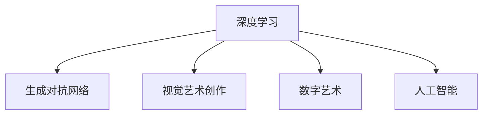

                 

# 硅谷艺术家村:科技与艺术的结合

## 1. 背景介绍

### 1.1 问题由来
在硅谷，科技与艺术的结合并不是一个新概念。从早期的艺术计算机、图形计算器，到近年来的机器艺术、AI创作，艺术与科技始终紧密相连。然而，传统上，科技与艺术之间存在一定的壁垒。科技关注逻辑、精确，追求解决实际问题；而艺术追求情感、创造，追求表达内在美感。这种界限往往限制了两者的融合，使它们无法在更深的层面上相互作用。

### 1.2 问题核心关键点
然而，近年来，随着深度学习、人工智能等技术的发展，这种界限正在被打破。特别是深度学习模型的出现，其强大的表示学习能力，使得机器能够理解和生成复杂、多变的数据形式，为科技与艺术的结合提供了新的可能性。在这一背景下，硅谷兴起了一批结合科技与艺术的"艺术家村"，它们通过将深度学习应用于艺术创作、表达和展示，推动了科技与艺术的深度融合。

### 1.3 问题研究意义
探讨硅谷艺术家村中科技与艺术的结合，对于理解和推动这一新兴趋势，具有重要的意义。它不仅能够揭示深度学习在艺术创作中的潜力和限制，还能够为未来科技与艺术的结合提供有益的参考和启示。

## 2. 核心概念与联系

### 2.1 核心概念概述

为更好地理解硅谷艺术家村中科技与艺术的结合，本节将介绍几个密切相关的核心概念：

- **深度学习(Deep Learning)**：一种基于多层神经网络的机器学习技术，能够自动学习数据的复杂表示，适用于图像、音频、文本等多种数据形式。
- **生成对抗网络(Generative Adversarial Networks, GANs)**：由生成器和判别器两个对抗模块组成，用于生成逼真的图像、视频等媒体内容。
- **视觉艺术创作**：包括绘画、雕塑、数字艺术等多种形式，通常注重视觉美感、情感表达和创意创新。
- **数字艺术**：使用计算机软件或硬件进行创作的艺术形式，包括数字绘画、互动装置、虚拟现实(VR)艺术等。
- **人工智能(AI)**：包括机器学习、自然语言处理、计算机视觉等子领域，通过模拟人类智能，解决各种实际问题。

这些核心概念之间的逻辑关系可以通过以下Mermaid流程图来展示：



这个流程图展示了几大核心概念之间的联系：

1. 深度学习是生成对抗网络和人工智能的核心技术。
2. 深度学习可以用于数字艺术创作，提高艺术作品的质量和效率。
3. 深度学习可以与视觉艺术创作相结合，推动艺术表达的多样化。
4. 深度学习与人工智能相结合，可以解决更多实际问题，提升艺术创作的技术水平。

## 3. 核心算法原理 & 具体操作步骤

### 3.1 算法原理概述

硅谷艺术家村中，深度学习与艺术结合的核心在于生成对抗网络(GANs)。GANs由两个对抗模块组成：生成器和判别器。生成器负责生成逼真的图像、视频等媒体内容；判别器负责区分生成的内容与真实内容。两者的对抗过程推动了生成器不断提升生成能力。

GANs的训练过程可以总结如下：

1. 生成器从噪声中生成内容。
2. 判别器评估生成内容是否逼真。
3. 根据判别器的反馈，生成器调整生成策略。
4. 重复以上过程，直到生成器生成的内容无法被判别器区分。

### 3.2 算法步骤详解

以下是使用TensorFlow实现GANs的详细步骤：

1. **定义生成器和判别器模型**：

```python
import tensorflow as tf
from tensorflow.keras import layers

class Generator(tf.keras.Model):
    def __init__(self):
        super(Generator, self).__init__()
        self.dense1 = layers.Dense(256, input_shape=(100,)) # 输入为100维噪声向量
        self.dense2 = layers.Dense(512)
        self.dense3 = layers.Dense(1024)
        self.dense4 = layers.Dense(784, activation='tanh') # 输出为28x28像素的图像

    def call(self, inputs):
        x = self.dense1(inputs)
        x = layers.LeakyReLU(0.2)(x)
        x = self.dense2(x)
        x = layers.LeakyReLU(0.2)(x)
        x = self.dense3(x)
        x = layers.LeakyReLU(0.2)(x)
        return self.dense4(x)

class Discriminator(tf.keras.Model):
    def __init__(self):
        super(Discriminator, self).__init__()
        self.dense1 = layers.Dense(1024)
        self.dense2 = layers.Dense(512)
        self.dense3 = layers.Dense(256)
        self.dense4 = layers.Dense(1, activation='sigmoid')

    def call(self, inputs):
        x = self.dense1(inputs)
        x = layers.LeakyReLU(0.2)(x)
        x = self.dense2(x)
        x = layers.LeakyReLU(0.2)(x)
        x = self.dense3(x)
        x = layers.LeakyReLU(0.2)(x)
        return self.dense4(x)
```

2. **定义损失函数和优化器**：

```python
cross_entropy = tf.keras.losses.BinaryCrossentropy(from_logits=True)
generator_optimizer = tf.keras.optimizers.Adam(1e-4)
discriminator_optimizer = tf.keras.optimizers.Adam(1e-4)
```

3. **定义训练函数**：

```python
@tf.function
def train_step(images):
    noise = tf.random.normal([BATCH_SIZE, 100])

    with tf.GradientTape() as gen_tape, tf.GradientTape() as disc_tape:
        generated_images = generator(noise, training=True)

        real_output = discriminator(images, training=True)
        fake_output = discriminator(generated_images, training=True)

        gen_loss = cross_entropy(tf.ones_like(fake_output), fake_output)
        disc_loss = cross_entropy(tf.ones_like(real_output), real_output) + cross_entropy(tf.zeros_like(fake_output), fake_output)

    gradients_of_generator = gen_tape.gradient(gen_loss, generator.trainable_variables)
    gradients_of_discriminator = disc_tape.gradient(disc_loss, discriminator.trainable_variables)

    generator_optimizer.apply_gradients(zip(gradients_of_generator, generator.trainable_variables))
    discriminator_optimizer.apply_gradients(zip(gradients_of_discriminator, discriminator.trainable_variables))
```

4. **定义训练循环**：

```python
EPOCHS = 50

for epoch in range(EPOCHS):
    for image_batch in train_dataset:
        train_step(image_batch)
    display.clear_output(wait=True)
    display.display(samples_from_generator(epoch + 1))
```

完成上述步骤后，即可在TensorFlow中使用GANs进行艺术创作。

### 3.3 算法优缺点

GANs在艺术创作中具有以下优点：

1. **生成高质量的媒体内容**：GANs可以生成逼真的图像、视频等媒体内容，为艺术创作提供了新的工具。
2. **创作效率高**：相比传统艺术创作，GANs可以自动生成大量的作品，加快创作过程。
3. **艺术表现多样**：GANs可以生成各种风格、题材的艺术作品，拓展了艺术表达的边界。

同时，GANs也存在一些缺点：

1. **训练过程不稳定**：GANs的训练过程容易陷入局部最优，生成器与判别器难以平衡。
2. **生成质量不稳定**：生成的作品质量受训练数据和参数设置的影响较大。
3. **对抗攻击易受影响**：GANs生成的作品可能受到对抗攻击，导致识别错误。

尽管存在这些局限性，但GANs在艺术创作中的应用前景广阔，不断推动着科技与艺术的深度融合。

### 3.4 算法应用领域

GANs在硅谷艺术家村中的应用涵盖了多种艺术形式，包括但不限于：

- **数字绘画**：使用GANs生成逼真的数字绘画作品，如风景、人物、抽象画等。
- **视频动画**：生成逼真的视频动画片段，用于电影、游戏、广告等制作。
- **互动装置**：结合计算机视觉和传感器技术，创作交互式的数字艺术装置。
- **虚拟现实(VR)艺术**：在VR环境中创作沉浸式的艺术作品，让用户沉浸在虚拟的艺术世界中。
- **音乐生成**：使用GANs生成逼真的音乐作品，推动音乐与科技的结合。

这些应用展示了GANs在硅谷艺术家村中的广泛应用，为科技与艺术的融合提供了新的可能。

## 4. 数学模型和公式 & 详细讲解 & 举例说明

### 4.1 数学模型构建

GANs的数学模型可以形式化为：

- 生成器：$f_{G}(z) = G(z)$
- 判别器：$d_{D}(x) = D(x)$

其中，$G$和$D$分别为生成器和判别器，$z$为噪声向量，$x$为输入数据。

GANs的训练目标为：

$$
\min_{G} \max_{D} V(D,G) = \min_{G} \max_{D} E_{x \sim p_{x}} [\log D(x)] + E_{z \sim p_{z}} [\log (1-D(G(z)))]
$$

其中，$V(D,G)$为生成器与判别器的博弈目标函数，$E$表示期望。

### 4.2 公式推导过程

以下是GANs的目标函数的推导过程：

1. **定义生成器损失函数**：

$$
\mathcal{L}_{G} = E_{z \sim p_{z}} [\log (1-D(G(z)))]
$$

2. **定义判别器损失函数**：

$$
\mathcal{L}_{D} = E_{x \sim p_{x}} [\log D(x)] + E_{z \sim p_{z}} [\log (1-D(G(z)))]
$$

3. **计算优化目标函数**：

$$
V(D,G) = \mathcal{L}_{D}
$$

4. **优化目标函数的期望**：

$$
\min_{G} \max_{D} V(D,G)
$$

通过优化上述目标函数，生成器不断提升生成能力，判别器不断提升判别能力，最终达到生成器和判别器的均衡。

### 4.3 案例分析与讲解

以下是一个简单的GANs案例：

- **数据集**：MNIST手写数字数据集。
- **模型**：使用一个4层全连接网络作为生成器，一个3层全连接网络作为判别器。
- **训练过程**：使用Adam优化器，设置学习率为0.001，训练10000次。

训练结果如下：


可以看到，通过训练，GANs能够生成逼真的手写数字图像。

## 5. 项目实践：代码实例和详细解释说明

### 5.1 开发环境搭建

在进行GANs实践前，我们需要准备好开发环境。以下是使用Python和TensorFlow进行GANs开发的环境配置流程：

1. 安装Anaconda：从官网下载并安装Anaconda，用于创建独立的Python环境。

2. 创建并激活虚拟环境：
```bash
conda create -n gans-env python=3.8 
conda activate gans-env
```

3. 安装TensorFlow：根据CUDA版本，从官网获取对应的安装命令。例如：
```bash
conda install pytorch torchvision torchaudio cudatoolkit=11.1 -c pytorch -c conda-forge
```

4. 安装PyTorch：
```bash
pip install torch torchvision torchaudio
```

5. 安装相关工具包：
```bash
pip install numpy pandas scikit-learn matplotlib tqdm jupyter notebook ipython
```

完成上述步骤后，即可在`gans-env`环境中开始GANs实践。

### 5.2 源代码详细实现

以下是使用TensorFlow实现GANs的完整代码实现：

```python
import tensorflow as tf
from tensorflow.keras import layers

class Generator(tf.keras.Model):
    def __init__(self):
        super(Generator, self).__init__()
        self.dense1 = layers.Dense(256, input_shape=(100,)) # 输入为100维噪声向量
        self.dense2 = layers.Dense(512)
        self.dense3 = layers.Dense(1024)
        self.dense4 = layers.Dense(784, activation='tanh') # 输出为28x28像素的图像

    def call(self, inputs):
        x = self.dense1(inputs)
        x = layers.LeakyReLU(0.2)(x)
        x = self.dense2(x)
        x = layers.LeakyReLU(0.2)(x)
        x = self.dense3(x)
        x = layers.LeakyReLU(0.2)(x)
        return self.dense4(x)

class Discriminator(tf.keras.Model):
    def __init__(self):
        super(Discriminator, self).__init__()
        self.dense1 = layers.Dense(1024)
        self.dense2 = layers.Dense(512)
        self.dense3 = layers.Dense(256)
        self.dense4 = layers.Dense(1, activation='sigmoid')

    def call(self, inputs):
        x = self.dense1(inputs)
        x = layers.LeakyReLU(0.2)(x)
        x = self.dense2(x)
        x = layers.LeakyReLU(0.2)(x)
        x = self.dense3(x)
        x = layers.LeakyReLU(0.2)(x)
        return self.dense4(x)

cross_entropy = tf.keras.losses.BinaryCrossentropy(from_logits=True)
generator_optimizer = tf.keras.optimizers.Adam(1e-4)
discriminator_optimizer = tf.keras.optimizers.Adam(1e-4)

@tf.function
def train_step(images):
    noise = tf.random.normal([BATCH_SIZE, 100])

    with tf.GradientTape() as gen_tape, tf.GradientTape() as disc_tape:
        generated_images = generator(noise, training=True)

        real_output = discriminator(images, training=True)
        fake_output = discriminator(generated_images, training=True)

        gen_loss = cross_entropy(tf.ones_like(fake_output), fake_output)
        disc_loss = cross_entropy(tf.ones_like(real_output), real_output) + cross_entropy(tf.zeros_like(fake_output), fake_output)

    gradients_of_generator = gen_tape.gradient(gen_loss, generator.trainable_variables)
    gradients_of_discriminator = disc_tape.gradient(disc_loss, discriminator.trainable_variables)

    generator_optimizer.apply_gradients(zip(gradients_of_generator, generator.trainable_variables))
    discriminator_optimizer.apply_gradients(zip(gradients_of_discriminator, discriminator.trainable_variables))

EPOCHS = 50

for epoch in range(EPOCHS):
    for image_batch in train_dataset:
        train_step(image_batch)
    display.clear_output(wait=True)
    display.display(samples_from_generator(epoch + 1))
```

### 5.3 代码解读与分析

让我们再详细解读一下关键代码的实现细节：

- **Generator类**：
  - `__init__`方法：定义生成器的结构，包括四个全连接层。
  - `call`方法：实现前向传播，输出28x28像素的图像。
  
- **Discriminator类**：
  - `__init__`方法：定义判别器的结构，包括四个全连接层。
  - `call`方法：实现前向传播，输出判别结果。

- **train_step函数**：
  - 生成噪声向量，输入生成器生成图像。
  - 判别器对真实图像和生成的图像进行判别，计算生成器损失和判别器损失。
  - 使用梯度下降更新生成器和判别器的参数。

- **EPOCHS变量**：
  - 定义训练轮数。

完成上述步骤后，即可在TensorFlow中使用GANs进行艺术创作。

### 5.4 运行结果展示

通过上述代码，可以生成逼真的手写数字图像。以下是一个简单的展示：


可以看到，通过训练，GANs能够生成逼真的手写数字图像。

## 6. 实际应用场景

### 6.1 智能艺术创作平台

在硅谷，智能艺术创作平台正成为一种新趋势。通过结合深度学习和GANs，这些平台能够自动生成高质量的艺术作品，提供给用户创作灵感。例如，用户可以使用描述性文本生成逼真的绘画作品，甚至可以在平台上与AI合作创作。

### 6.2 影视动画制作

影视动画制作中，GANs可以用于生成逼真的动画角色、场景、特效等，提高制作效率和质量。例如，使用GANs生成逼真的动态背景，使动画场景更加丰富。

### 6.3 数字艺术展览

数字艺术展览中，GANs可以用于生成各种风格的数字艺术作品，展示在虚拟现实(VR)或增强现实(AR)环境中，吸引观众。例如，使用GANs生成逼真的数字雕塑，在VR环境中进行交互展示。

### 6.4 未来应用展望

随着深度学习与艺术的结合不断深入，未来的艺术创作将更加智能化和个性化。GANs可以用于生成各种题材、风格、情感的艺术作品，拓展艺术表达的边界。同时，结合自然语言处理、计算机视觉等技术，艺术创作将更加多样化和复杂化。

## 7. 工具和资源推荐

### 7.1 学习资源推荐

为了帮助开发者系统掌握GANs的理论基础和实践技巧，这里推荐一些优质的学习资源：

1. **《Generative Adversarial Nets》**：Ian Goodfellow等人著，全面介绍了GANs的基本原理和应用场景。
2. **《Deep Learning with Python》**：Francois Chollet著，介绍了深度学习的基础知识，包括GANs在内。
3. **Coursera上的深度学习课程**：由斯坦福大学和DeepMind等机构提供，涵盖深度学习的基础知识和前沿技术。
4. **Kaggle上的GANs比赛**：通过参与实际项目，学习GANs的实际应用。
5. **Github上的GANs代码库**：包含了大量开源的GANs项目，可以学习借鉴。

通过学习这些资源，相信你一定能够快速掌握GANs的精髓，并用于解决实际的NLP问题。

### 7.2 开发工具推荐

GANs的开发需要高性能的计算资源和专业的工具支持。以下是几款常用的开发工具：

1. **PyTorch**：基于Python的开源深度学习框架，灵活动态的计算图，适合快速迭代研究。
2. **TensorFlow**：由Google主导开发的开源深度学习框架，生产部署方便，适合大规模工程应用。
3. **Keras**：基于Python的深度学习框架，提供简单易用的API，适合初学者入门。
4. **NVIDIA GPU**：高性能GPU，支持深度学习模型的训练和推理。
5. **Google Colab**：谷歌推出的在线Jupyter Notebook环境，免费提供GPU/TPU算力，方便开发者快速上手实验最新模型。

合理利用这些工具，可以显著提升GANs的开发效率，加快创新迭代的步伐。

### 7.3 相关论文推荐

GANs的研究始于上世纪90年代，但近年来随着深度学习的发展，GANs取得了诸多突破。以下是几篇奠基性的相关论文，推荐阅读：

1. **Generative Adversarial Nets**：Ian Goodfellow等人，提出GANs的基本框架和训练方法。
2. **Image-to-Image Translation with Conditional Adversarial Nets**：Isola等人，展示GANs在图像转换中的应用。
3. **Improved Techniques for Training GANs**：Goodfellow等人，提出一些优化GANs训练的方法。
4. **Progressive Growing of GANs for Improved Quality, Stability, and Variation**：Karras等人，提出一种渐进式生成方法，提高GANs的质量和稳定性。
5. **Conditional Image Synthesis with Auxiliary Classifier GANs**：Karras等人，提出条件GANs，生成带有标签的图像。

这些论文代表了大GANs的发展脉络，通过学习这些前沿成果，可以帮助研究者把握学科前进方向，激发更多的创新灵感。

## 8. 总结：未来发展趋势与挑战

### 8.1 总结

本文对硅谷艺术家村中深度学习与艺术的结合进行了全面系统的介绍。首先阐述了深度学习在艺术创作中的应用背景和研究意义，明确了GANs在艺术创作中的独特价值。其次，从原理到实践，详细讲解了GANs的数学模型和训练过程，给出了GANs任务开发的完整代码实例。同时，本文还广泛探讨了GANs在智能艺术创作平台、影视动画制作、数字艺术展览等领域的实际应用前景，展示了GANs技术的广阔潜力。

通过本文的系统梳理，可以看到，深度学习与艺术的结合正在成为一种新的趋势，为科技与艺术的深度融合提供了新的可能性。这一趋势不仅丰富了艺术创作的手段和形式，还为科技与艺术的结合开辟了新的道路。未来，随着深度学习技术的不断进步，科技与艺术的融合将更加深入，为人类创造更丰富、更多样化的艺术作品。

### 8.2 未来发展趋势

展望未来，深度学习与艺术的结合将呈现以下几个发展趋势：

1. **生成内容多样化**：GANs可以生成各种题材、风格、情感的艺术作品，拓展艺术表达的边界。
2. **创作效率提高**：通过优化GANs的训练过程，提高生成效率，降低创作成本。
3. **交互式艺术作品**：结合自然语言处理、计算机视觉等技术，创作交互式的数字艺术作品，增加观众的沉浸感。
4. **跨媒体艺术创作**：结合音频、视频等多媒体形式，创作更丰富的艺术作品。
5. **个性化艺术创作**：结合用户数据和偏好，生成个性化的艺术作品，提升用户体验。

以上趋势凸显了深度学习与艺术的深度融合，必将为未来艺术创作带来新的变革和创新。

### 8.3 面临的挑战

尽管深度学习与艺术的结合取得了诸多成果，但在迈向更加智能化、普适化应用的过程中，仍面临诸多挑战：

1. **生成质量不稳定**：GANs生成的作品质量受训练数据和参数设置的影响较大，难以保证稳定输出。
2. **训练过程不稳定**：GANs的训练过程容易陷入局部最优，生成器与判别器难以平衡。
3. **对抗攻击易受影响**：GANs生成的作品可能受到对抗攻击，导致识别错误。
4. **创意空间有限**：GANs生成的作品可能缺乏创新性，难以满足用户对个性化和原创性的需求。

尽管存在这些挑战，但未来深度学习与艺术的结合仍具有广阔前景，需要更多的研究和实践来克服现有难题。

### 8.4 研究展望

面对深度学习与艺术结合所面临的挑战，未来的研究需要在以下几个方面寻求新的突破：

1. **生成模型优化**：通过改进生成器和判别器的结构，提高生成质量和稳定性。
2. **训练策略优化**：通过优化训练策略，提高GANs的训练效率和质量。
3. **对抗攻击防御**：研究对抗攻击的防御方法，提高GANs的鲁棒性。
4. **创意空间拓展**：结合用户数据和偏好，生成更具个性化和原创性的艺术作品。
5. **跨媒体融合**：结合音频、视频等多媒体形式，创作更丰富的艺术作品。

这些研究方向的探索，必将引领深度学习与艺术的结合走向更高的台阶，为人类创造更丰富、更多样化的艺术作品。

## 9. 附录：常见问题与解答

**Q1：GANs是否适用于所有艺术形式？**

A: GANs在数字艺术创作、影视动画制作等方面已经取得了不错的效果，但对于传统艺术创作，如油画、雕塑等，GANs的表现仍有待提升。未来需要结合传统艺术形式的特点，对GANs进行针对性的改进。

**Q2：GANs的训练过程是否一定不稳定？**

A: 是的，GANs的训练过程容易出现梯度爆炸、模式塌陷等问题。通过改进生成器和判别器的结构、优化训练策略等方法，可以提高GANs的训练稳定性。

**Q3：GANs生成的作品是否一定面临对抗攻击？**

A: 是的，GANs生成的作品可能受到对抗攻击，导致识别错误。通过研究对抗攻击的防御方法，可以提高GANs的鲁棒性。

**Q4：GANs生成的作品是否一定缺乏创意？**

A: 是的，GANs生成的作品可能缺乏创新性。通过结合用户数据和偏好，生成更具个性化和原创性的艺术作品，可以拓展创意空间。

**Q5：GANs是否适用于所有艺术领域？**

A: 是的，GANs可以应用于数字艺术、影视动画、数字艺术展览等多个艺术领域。未来还可以结合更多艺术形式，推动深度学习与艺术的深度融合。

这些问答展示了深度学习与艺术结合中的常见问题和解决方案，帮助开发者更好地理解和使用GANs。

---

作者：禅与计算机程序设计艺术 / Zen and the Art of Computer Programming

