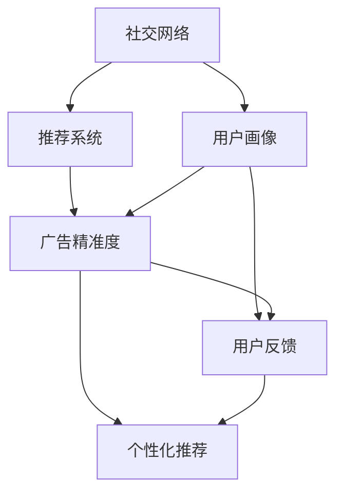

                 

# 社交电商创业：社交+购物的完美结合

> 关键词：社交电商,社交网络,电商平台,推荐系统,用户行为分析,数据驱动,市场营销,用户体验,个性化推荐

## 1. 背景介绍

### 1.1 问题由来

随着移动互联网的迅猛发展，社交网络已成为人们日常生活的重要组成部分，其对电商行业的影响也日益凸显。用户倾向于通过社交网络获取商品信息、分享购物体验、交流消费心得，社交电商的潜力随之被充分挖掘。

社交电商是指利用社交网络的用户关系网络（Social Network），对电商业务进行优化和扩展的电商形态。它将社交和购物的元素融合在一起，通过社交网络的推广和推荐，提升了用户购物体验，促进了电商业务的发展。

### 1.2 问题核心关键点

社交电商的独特之处在于：它利用了社交网络的强关系传播效应，通过朋友、粉丝、社区等社交关系推荐商品，从而在降低广告成本的同时，提高转化率。具体来说，社交电商的核心在于以下几个方面：

1. **社交网络的构建和维护**：通过社交网络平台，形成用户群体和用户间的互动关系。
2. **商品推荐和广告精准度**：利用用户画像和行为数据，向用户推荐个性化商品，同时通过精准广告提升点击率和转化率。
3. **用户反馈和内容推荐**：收集用户评价、评分和反馈，用于商品和广告内容的优化。
4. **用户体验的提升**：通过社交元素（如评论、点赞、分享）增强购物的互动性，提升用户满意度和粘性。

### 1.3 问题研究意义

社交电商不仅改变了传统电商的运营模式，也为社交网络提供了新的盈利点。以下是社交电商研究的重要意义：

1. **成本降低**：社交电商利用社交关系网络进行推广，相较于传统的付费广告，可以显著降低推广成本。
2. **转化率提升**：社交网络的强信任关系，使推荐商品更容易被用户接受，转化率更高。
3. **市场扩充**：社交电商拓宽了商品的传播渠道，扩大了电商市场。
4. **数据驱动决策**：社交电商平台通过数据驱动的决策，提升商品推荐和广告投放的精准度。
5. **用户体验优化**：通过社交互动增强购物体验，使用户在购物过程中更加愉悦和满意。

## 2. 核心概念与联系

### 2.1 核心概念概述

为更好地理解社交电商的核心概念，本节将介绍几个关键概念及其之间的联系：

- **社交网络(Social Network)**：由节点（用户）和边（关系）构成的网络结构，描述用户之间的关系。
- **推荐系统(Recommendation System)**：根据用户的行为数据和兴趣特征，为用户推荐商品或内容。
- **用户画像(User Profile)**：通过用户行为数据构建的、描述用户特征的模型，用于个性化推荐。
- **广告精准度(Ad Precision)**：广告投放的精准度，衡量广告被目标用户点击和转化的比例。
- **用户反馈(User Feedback)**：用户对商品和广告的评价和反馈，用于优化推荐内容和广告投放。
- **个性化推荐(Personalized Recommendation)**：根据用户画像，为每个用户推荐最符合其兴趣的商品。

这些概念之间的关系可以通过以下Mermaid流程图来展示：



这个流程图展示了几大核心概念之间的逻辑关系：

1. 社交网络是推荐系统和用户画像的基础，提供用户间关系的图结构。
2. 用户画像由用户行为数据构成，用于推荐系统的用户特征表示。
3. 推荐系统根据用户画像，为用户推荐商品，并衡量广告精准度。
4. 用户反馈用于优化推荐内容和广告投放，提升个性化推荐的准确性。

这些概念共同构成了社交电商的核心技术架构，使得平台能够通过社交网络进行商品推荐，实现精准的电商营销和用户互动。

## 3. 核心算法原理 & 具体操作步骤

### 3.1 算法原理概述

社交电商的算法原理主要包括社交网络构建、用户画像生成、推荐系统设计、广告精准度评估和用户反馈处理。通过这些算法，社交电商平台能够实现个性化推荐和精准广告投放。

社交电商的核心在于利用社交网络关系进行用户画像构建和推荐。其基本流程为：

1. **社交网络构建**：通过用户行为数据（如点赞、评论、分享等）构建用户社交关系图。
2. **用户画像生成**：根据社交关系图和用户行为数据，生成用户画像，描述用户特征。
3. **推荐系统设计**：利用用户画像和商品特征，设计推荐算法，生成个性化推荐。
4. **广告精准度评估**：通过广告点击率和转化率，评估广告投放的精准度。
5. **用户反馈处理**：收集用户对商品和广告的评价和反馈，用于优化推荐和广告。

### 3.2 算法步骤详解

社交电商算法的详细步骤包括：

**Step 1: 社交网络构建**

社交网络构建的目的是描述用户之间的关系，构建社交图结构。社交网络由用户节点和关系边组成，用户节点表示平台上的用户，关系边表示用户间的互动关系。

1. **用户行为数据采集**：通过平台行为数据（如点赞、评论、分享等）收集用户间的互动关系。
2. **社交图生成**：根据用户行为数据，生成社交图，描述用户间的连接关系。

**Step 2: 用户画像生成**

用户画像是通过用户行为数据和社交网络关系，构建的用户特征表示。用户画像通常包括用户的基本信息、兴趣偏好、行为习惯等。

1. **特征提取**：从用户行为数据中提取用户特征，如浏览历史、购买记录等。
2. **画像构建**：利用社交关系图，结合用户行为数据，生成用户画像。

**Step 3: 推荐系统设计**

推荐系统是社交电商的核心算法，用于为用户推荐个性化商品。推荐系统通常分为基于协同过滤、内容过滤和混合过滤等方法。

1. **协同过滤推荐**：基于用户行为数据和用户画像，推荐相似用户的商品。
2. **内容过滤推荐**：根据商品特征和用户画像，推荐符合用户兴趣的商品。
3. **混合过滤推荐**：结合协同过滤和内容过滤，生成更精准的推荐结果。

**Step 4: 广告精准度评估**

广告精准度评估是衡量广告投放效果的重要指标。通过广告点击率和转化率，可以评估广告的精准度，并优化广告投放策略。

1. **广告投放**：根据用户画像和广告策略，向用户展示广告。
2. **点击率和转化率统计**：记录广告的点击率和用户转化率。
3. **精准度评估**：通过点击率和转化率，评估广告的精准度。

**Step 5: 用户反馈处理**

用户反馈处理是社交电商优化推荐算法的重要环节。通过收集用户对商品和广告的评价和反馈，可以优化推荐内容和广告投放。

1. **用户反馈采集**：收集用户对商品和广告的评价和反馈数据。
2. **反馈分析**：分析用户反馈，提取有用信息。
3. **推荐优化**：根据用户反馈，优化推荐算法和广告策略。

### 3.3 算法优缺点

社交电商算法具有以下优点：

1. **精准推荐**：利用社交关系和用户画像，可以生成更加精准的个性化推荐。
2. **低成本推广**：通过社交关系网络进行推广，降低广告成本。
3. **用户体验提升**：社交元素增强了购物的互动性，提升用户满意度。
4. **数据驱动决策**：通过数据驱动的决策，优化推荐算法和广告投放。

但同时，这些算法也存在一些缺点：

1. **数据隐私问题**：用户行为数据和社交关系涉及用户隐私，数据收集和使用需要遵守相关法规。
2. **冷启动问题**：新用户缺乏足够行为数据和社交关系，难以生成准确的用户画像。
3. **过拟合风险**：用户画像和推荐算法可能过拟合历史数据，影响新用户的推荐效果。
4. **广告欺诈风险**：部分用户可能通过虚假点击和恶意广告行为影响广告效果。

### 3.4 算法应用领域

社交电商算法在多个领域得到了广泛应用，具体包括：

- **电商平台**：利用社交关系网络进行个性化推荐和精准广告投放。
- **社交媒体**：通过社交网络平台，推荐商品和内容，提升用户互动和粘性。
- **旅游平台**：通过社交网络，推荐旅游目的地和旅游服务，提升用户体验。
- **餐饮平台**：利用用户评价和社交关系，推荐餐厅和菜品，提升用户满意度。
- **金融平台**：通过社交网络关系，推荐金融产品和服务，提升用户转化率。

除了以上领域外，社交电商算法还可应用于教育、医疗、物流等更多场景，为不同行业的电商业务提供精准的解决方案。

## 4. 数学模型和公式 & 详细讲解 & 举例说明

### 4.1 数学模型构建

社交电商算法的数学模型主要包括社交网络构建、用户画像生成和推荐系统设计。这里以推荐系统为例，详细讲解其数学模型构建过程。

**协同过滤推荐模型**

协同过滤推荐基于用户行为数据和用户画像，生成相似用户的推荐。常见的协同过滤算法包括基于用户的协同过滤和基于物品的协同过滤。

1. **基于用户的协同过滤**：根据用户行为数据，生成相似用户的推荐。

$$
\text{Similarity}(u,v) = \frac{\sum_{i=1}^n (x_{ui} \cdot x_{vi})}{\sqrt{\sum_{i=1}^n x_{ui}^2} \cdot \sqrt{\sum_{i=1}^n x_{vi}^2}}
$$

其中，$x_{ui}$ 和 $x_{vi}$ 分别表示用户 $u$ 和 $v$ 对商品 $i$ 的行为评分，$\text{Similarity}(u,v)$ 表示用户 $u$ 和 $v$ 的相似度。

2. **基于物品的协同过滤**：根据商品特征和用户画像，生成推荐商品。

$$
\text{Similarity}(i,j) = \frac{\sum_{u=1}^m (x_{ui} \cdot x_{uj})}{\sqrt{\sum_{u=1}^m x_{ui}^2} \cdot \sqrt{\sum_{u=1}^m x_{uj}^2}}
$$

其中，$x_{ui}$ 和 $x_{uj}$ 分别表示用户 $u$ 对商品 $i$ 和 $j$ 的行为评分，$\text{Similarity}(i,j)$ 表示商品 $i$ 和 $j$ 的相似度。

### 4.2 公式推导过程

**基于用户画像的内容过滤推荐**

基于用户画像的内容过滤推荐，通过分析用户画像和商品特征，生成个性化推荐。假设用户画像为 $P$，商品特征为 $F$，推荐模型为 $M$，推荐函数为 $R(P,F,M)$。

1. **用户画像表示**

用户画像 $P$ 可以表示为向量形式 $P = (p_1, p_2, ..., p_n)$，其中 $p_i$ 表示用户对第 $i$ 个特征的评分。

2. **商品特征表示**

商品特征 $F$ 可以表示为向量形式 $F = (f_1, f_2, ..., f_m)$，其中 $f_i$ 表示商品对第 $i$ 个特征的评分。

3. **推荐函数设计**

推荐函数 $R(P,F,M)$ 用于生成推荐结果，可以根据不同的推荐算法进行选择。

**基于深度学习的推荐模型**

深度学习推荐模型通过神经网络对用户行为数据和商品特征进行建模，生成推荐结果。假设深度学习模型为 $M$，推荐函数为 $R(P,F,M)$。

1. **神经网络结构**

推荐模型 $M$ 可以设计为多层神经网络，每个层对输入特征进行非线性映射。

2. **推荐函数设计**

推荐函数 $R(P,F,M)$ 可以表示为：

$$
R(P,F,M) = M(F, P)
$$

其中 $M(F, P)$ 为神经网络模型，将商品特征 $F$ 和用户画像 $P$ 映射为推荐结果。

### 4.3 案例分析与讲解

**案例分析**

以一个电商平台为例，分析社交电商算法的具体应用。

1. **社交网络构建**

通过用户行为数据（如点赞、评论、分享等），构建用户社交关系图。社交图结构为：

$$
G(V,E) = \{(u,v)|\text{交互关系}(u,v)\}
$$

其中 $V$ 为节点集合，$E$ 为边集合。

2. **用户画像生成**

利用用户行为数据和社交网络关系，生成用户画像。假设用户画像 $P$ 为向量形式 $P = (p_1, p_2, ..., p_n)$，其中 $p_i$ 表示用户对第 $i$ 个特征的评分。

3. **推荐系统设计**

设计基于协同过滤的推荐算法，生成推荐结果。假设用户 $u$ 对商品 $i$ 的评分向量为 $x_{ui}$，推荐函数为 $R(P,F,M)$，推荐结果为 $r_{ui}$。

4. **广告精准度评估**

评估广告投放的精准度，假设广告点击率为 $c$，广告转化率为 $t$，广告精准度为 $p$。

5. **用户反馈处理**

收集用户对商品和广告的评价和反馈，用于优化推荐算法和广告投放。

**详细讲解**

1. **用户行为数据采集**

通过电商平台的行为数据采集器，收集用户对商品的行为数据，包括浏览历史、购买记录等。

2. **社交图生成**

根据用户行为数据，生成用户社交关系图。社交图结构为：

$$
G(V,E) = \{(u,v)|\text{交互关系}(u,v)\}
$$

其中 $V$ 为节点集合，$E$ 为边集合。

3. **用户画像构建**

利用用户行为数据和社交网络关系，生成用户画像。假设用户画像 $P$ 为向量形式 $P = (p_1, p_2, ..., p_n)$，其中 $p_i$ 表示用户对第 $i$ 个特征的评分。

4. **协同过滤推荐**

基于用户行为数据和用户画像，生成相似用户的推荐。假设用户 $u$ 对商品 $i$ 的评分向量为 $x_{ui}$，推荐函数为 $R(P,F,M)$，推荐结果为 $r_{ui}$。

5. **广告精准度评估**

通过广告点击率和转化率，评估广告投放的精准度。假设广告点击率为 $c$，广告转化率为 $t$，广告精准度为 $p$。

6. **用户反馈处理**

收集用户对商品和广告的评价和反馈，用于优化推荐算法和广告投放。

## 5. 项目实践：代码实例和详细解释说明

### 5.1 开发环境搭建

在进行社交电商项目实践前，我们需要准备好开发环境。以下是使用Python进行Flask开发的环境配置流程：

1. 安装Anaconda：从官网下载并安装Anaconda，用于创建独立的Python环境。

2. 创建并激活虚拟环境：
```bash
conda create -n social-e-commerce python=3.8 
conda activate social-e-commerce
```

3. 安装Flask：
```bash
pip install flask
```

4. 安装所需库：
```bash
pip install pandas numpy scikit-learn SQLAlchemy 
```

5. 安装SQLite数据库：
```bash
pip install sqlite3
```

完成上述步骤后，即可在`social-e-commerce`环境中开始项目实践。

### 5.2 源代码详细实现

下面我们以一个社交电商平台的推荐系统为例，给出使用Flask实现个性化推荐的Python代码实现。

```python
from flask import Flask, request, jsonify
from flask_sqlalchemy import SQLAlchemy
from sklearn.metrics.pairwise import cosine_similarity
import pandas as pd
import numpy as np

app = Flask(__name__)
app.config['SQLALCHEMY_DATABASE_URI'] = 'sqlite:////tmp/test.db'
db = SQLAlchemy(app)

class User(db.Model):
    id = db.Column(db.Integer, primary_key=True)
    name = db.Column(db.String(100))
    interests = db.Column(db.String(500))
    items = db.relationship('Item', backref='users')

class Item(db.Model):
    id = db.Column(db.Integer, primary_key=True)
    name = db.Column(db.String(100))
    features = db.Column(db.String(500))
    users = db.relationship('User', backref='items')

@app.route('/recommend', methods=['POST'])
def recommend():
    data = request.get_json()
    user_id = data['user_id']
    item_id = data['item_id']
    
    user = User.query.get(user_id)
    item = Item.query.get(item_id)
    
    user_interests = [int(i) for i in user.interests.split(',')]
    item_features = [int(f) for f in item.features.split(',')]
    
    user_score = np.array([int(u.interests.split(',').index(f)) for u in user.users])
    item_similarity = cosine_similarity(user_score.reshape(1, -1), np.array([int(i.interests.split(',').index(f)) for i in item.users]))
    
    top_items = np.argsort(item_similarity[0])[::-1][:10]
    
    return jsonify({'recommendations': [i.name for i in Item.query.filter(Item.id.in_(top_items)).all()]})

if __name__ == '__main__':
    app.run(debug=True)
```

以上代码实现了基于用户兴趣和商品特征的推荐系统，用户可以通过API接口获取推荐商品列表。具体实现步骤如下：

1. 定义数据库模型：用户和商品类，记录用户兴趣和商品特征。
2. 定义API接口：定义推荐系统API，接收用户ID和商品ID，返回推荐商品列表。
3. 推荐算法实现：计算用户和商品间的相似度，生成推荐商品列表。

### 5.3 代码解读与分析

让我们再详细解读一下关键代码的实现细节：

**User类和Item类**：
- `User`类和`Item`类分别表示用户和商品，包含用户ID、用户名、兴趣、商品ID、商品名和特征等属性。
- 通过SQLAlchemy进行数据库模型映射，支持CRUD操作。

**API接口设计**：
- 定义`/recommend`接口，接收用户ID和商品ID作为输入，返回推荐商品列表。
- 使用Flask的`request.get_json()`方法获取请求数据。
- 查询用户和商品信息，并提取用户兴趣和商品特征。

**推荐算法实现**：
- 通过用户ID和商品ID查询用户和商品信息，提取用户兴趣和商品特征。
- 计算用户和商品间的相似度，生成推荐商品列表。
- 使用`cosine_similarity`计算用户和商品的相似度，返回推荐商品列表。

**API接口响应**：
- 使用Flask的`jsonify`方法将推荐商品列表转化为JSON格式，返回API响应。

通过以上代码实现，可以看出Flask和SQLAlchemy使得社交电商推荐系统的开发变得更加简洁高效。开发者可以将更多精力放在推荐算法的设计和优化上，而不必过多关注底层的实现细节。

当然，工业级的系统实现还需考虑更多因素，如推荐算法的扩展、用户行为的监控、数据的安全性等。但核心的推荐范式基本与此类似。

## 6. 实际应用场景

### 6.1 智能客服系统

社交电商平台的智能客服系统，通过分析用户行为和社交关系，自动解答用户咨询，提升客户体验。具体应用场景包括：

1. **用户咨询自动解答**：根据用户咨询问题和历史聊天记录，推荐相关商品和FAQ。
2. **购物流程引导**：通过社交关系网络，推荐用户可能感兴趣的商品，引导用户完成购物流程。
3. **售后服务支持**：分析用户投诉和反馈，自动回复和处理用户问题，提升售后服务质量。

### 6.2 个性化推荐系统

社交电商平台的个性化推荐系统，通过用户行为和社交关系，生成个性化商品推荐。具体应用场景包括：

1. **商品推荐**：根据用户浏览历史和社交关系，生成个性化商品推荐列表。
2. **活动推荐**：根据用户兴趣和行为数据，推荐商品促销和优惠活动。
3. **内容推荐**：根据用户阅读历史和社交关系，推荐相关文章和视频。

### 6.3 广告投放优化

社交电商平台的广告投放优化，通过社交网络关系和用户行为，优化广告投放策略。具体应用场景包括：

1. **精准广告投放**：根据用户画像和社交关系，生成精准的广告投放方案。
2. **广告效果评估**：收集用户对广告的反馈和点击率，评估广告投放效果。
3. **广告优化策略**：根据广告投放效果，优化广告创意和投放策略。

### 6.4 未来应用展望

随着社交电商技术的不断发展，未来将在更多领域得到应用，为电商业务带来变革性影响。

1. **智慧零售**：社交电商与智慧零售结合，提供实时推荐和个性化服务，提升零售效率。
2. **社交电商直播**：通过直播形式，与用户实时互动，提升商品展示效果和购买转化率。
3. **社交电商金融**：利用社交网络关系和用户画像，提供金融产品推荐和风险评估。
4. **社交电商旅游**：结合社交网络和旅游数据，提供个性化的旅游推荐和行程规划。
5. **社交电商教育**：通过社交网络关系和用户行为，提供个性化教育内容推荐。

## 7. 工具和资源推荐

### 7.1 学习资源推荐

为了帮助开发者系统掌握社交电商的技术基础和实践技巧，这里推荐一些优质的学习资源：

1. **《社交电商运营实战指南》**：一本系统介绍社交电商运营的书籍，涵盖社交电商的市场趋势、用户画像构建、推荐系统设计等内容。
2. **《深度学习实战》**：一本系统介绍深度学习应用的书籍，涵盖深度学习推荐系统、用户行为分析等内容。
3. **《Flask Web开发实战》**：一本系统介绍Flask框架应用的书籍，涵盖Flask的基础和高级应用、API开发等内容。
4. **《Python数据分析实战》**：一本系统介绍Python数据分析的书籍，涵盖数据分析、机器学习、数据可视化等内容。
5. **《社交电商用户行为分析》**：一本系统介绍社交电商用户行为分析的书籍，涵盖用户行为建模、用户画像构建等内容。

通过对这些资源的学习实践，相信你一定能够快速掌握社交电商的核心技术，并用于解决实际的电商问题。

### 7.2 开发工具推荐

高效的开发离不开优秀的工具支持。以下是几款用于社交电商开发常用的工具：

1. **Flask**：轻量级的Web框架，适合快速开发API接口和Web应用。
2. **SQLAlchemy**：Python的ORM框架，支持数据库操作和模型映射。
3. **Pandas**：数据处理和分析库，支持数据的导入、处理和分析。
4. **Numpy**：数值计算库，支持高效的数值运算和矩阵计算。
5. **Scikit-learn**：机器学习库，支持多种算法和模型构建。

合理利用这些工具，可以显著提升社交电商项目的开发效率，加快创新迭代的步伐。

### 7.3 相关论文推荐

社交电商的研究始于学界的持续探索。以下是几篇奠基性的相关论文，推荐阅读：

1. **《基于社交网络的商品推荐》**：介绍利用社交网络关系进行商品推荐的方法，展示了社交电商技术的潜在应用。
2. **《深度学习推荐系统》**：系统介绍深度学习推荐系统的原理和算法，展示了深度学习在推荐系统中的应用。
3. **《社交电商用户行为分析》**：探讨社交电商用户的购物行为和偏好，提出基于用户画像的商品推荐方法。
4. **《社交电商广告精准投放》**：分析社交电商广告投放的精准度，提出基于用户画像和社交关系的广告优化策略。

这些论文代表了大电商电商技术的演进脉络。通过学习这些前沿成果，可以帮助研究者把握学科前进方向，激发更多的创新灵感。

## 8. 总结：未来发展趋势与挑战

### 8.1 总结

本文对社交电商的核心概念和算法原理进行了详细讲解，通过案例分析展示了社交电商技术在实际应用中的具体应用。通过本文的系统梳理，可以看到，社交电商不仅改变了传统电商的运营模式，也为社交网络提供了新的盈利点。社交电商算法通过社交网络关系进行用户画像构建和推荐，实现了精准的电商营销和用户互动。

### 8.2 未来发展趋势

展望未来，社交电商技术将呈现以下几个发展趋势：

1. **数据驱动决策**：通过数据分析，优化推荐算法和广告投放策略，提升用户转化率和满意度。
2. **深度学习应用**：利用深度学习技术，提升推荐系统的准确性和鲁棒性。
3. **多模态数据融合**：结合社交网络、用户行为、商品特征等多模态数据，提升推荐系统的综合性能。
4. **实时推荐系统**：通过实时数据分析，提供更加动态、个性化的推荐服务。
5. **跨平台集成**：将社交电商技术与第三方平台集成，提供更加便捷的购物体验。

### 8.3 面临的挑战

尽管社交电商技术已经取得了显著成果，但在进一步发展和应用的过程中，仍面临以下挑战：

1. **数据隐私问题**：社交电商涉及大量用户数据，如何保护用户隐私，遵守相关法规，是亟待解决的问题。
2. **数据质量问题**：社交电商平台需要收集和处理大量数据，如何保证数据的质量和准确性，是必须解决的问题。
3. **推荐算法复杂度**：社交电商推荐算法需要处理复杂的社交网络关系和用户画像，如何设计高效的推荐算法，是亟待解决的问题。
4. **用户粘性问题**：社交电商平台需要吸引用户长时间停留在平台，如何提升用户粘性，是必须解决的问题。
5. **跨平台集成问题**：将社交电商技术与第三方平台集成，需要解决跨平台数据一致性和算法优化等问题。

### 8.4 研究展望

面向未来，社交电商技术的探索方向包括：

1. **深度学习与大数据结合**：利用深度学习和大数据技术，提升社交电商平台的推荐系统精度和效率。
2. **跨领域融合**：将社交电商技术与NLP、计算机视觉等其他领域技术结合，拓展应用场景和功能。
3. **人工智能伦理**：研究社交电商平台的算法公平性和伦理性，保障用户权益。
4. **用户隐私保护**：研究社交电商平台的数据隐私保护技术，保障用户隐私安全。
5. **实时推荐系统**：研究实时推荐算法，提升用户互动和购物体验。

这些研究方向将进一步推动社交电商技术的进步，提升电商平台的市场竞争力和用户体验。

## 9. 附录：常见问题与解答

**Q1：社交电商与传统电商有何区别？**

A: 社交电商与传统电商的最大区别在于，社交电商利用了社交网络关系进行推广和推荐，降低了广告成本，提升了用户体验。社交电商通过用户间的强关系传播，使推荐内容更具可信度和影响力，从而提高转化率。

**Q2：社交电商的优势和劣势是什么？**

A: 社交电商的优势在于：
1. 降低推广成本：利用社交网络关系进行推广，减少广告投放费用。
2. 提升转化率：通过强关系传播，推荐内容更具可信度，提升用户转化率。
3. 增强用户粘性：通过社交互动，提升用户满意度和粘性。

劣势在于：
1. 数据隐私问题：涉及大量用户数据，保护用户隐私是一大挑战。
2. 冷启动问题：新用户缺乏足够数据，难以生成准确的用户画像。
3. 推荐算法复杂：需要处理复杂的社交网络关系和用户画像，设计高效的推荐算法。

**Q3：如何构建高质量的社交电商推荐系统？**

A: 构建高质量的社交电商推荐系统需要综合考虑以下几个方面：
1. 数据采集和预处理：收集高质量的用户行为数据和社交网络关系数据。
2. 用户画像构建：利用用户行为数据和社交网络关系，生成准确的用户画像。
3. 推荐算法设计：选择合适的推荐算法，并根据实际情况进行优化。
4. 模型评估和优化：通过A/B测试和用户反馈，评估推荐系统的效果，并进行优化。
5. 数据隐私保护：遵守相关法规，保护用户隐私。

这些方面的综合考虑，将有助于构建高质量的社交电商推荐系统，提升平台的用户体验和竞争力。

**Q4：社交电商如何平衡推荐准确性和用户隐私？**

A: 社交电商需要在推荐准确性和用户隐私之间寻找平衡，可以通过以下措施：
1. 数据匿名化：在数据处理和分析过程中，采用数据匿名化技术，保护用户隐私。
2. 用户选择权：允许用户选择是否使用推荐系统，保护用户隐私。
3. 差分隐私：在数据处理和分析过程中，采用差分隐私技术，保护用户隐私。
4. 用户反馈机制：通过用户反馈，优化推荐算法和数据处理方式，提升推荐准确性。

这些措施将有助于平衡推荐准确性和用户隐私，提升社交电商平台的综合性能。

**Q5：社交电商的未来发展方向是什么？**

A: 社交电商的未来发展方向包括：
1. 深度学习应用：利用深度学习技术，提升推荐系统的准确性和鲁棒性。
2. 跨领域融合：将社交电商技术与NLP、计算机视觉等其他领域技术结合，拓展应用场景和功能。
3. 实时推荐系统：研究实时推荐算法，提升用户互动和购物体验。
4. 人工智能伦理：研究社交电商平台的算法公平性和伦理性，保障用户权益。
5. 用户隐私保护：研究社交电商平台的数据隐私保护技术，保障用户隐私安全。

这些方向将进一步推动社交电商技术的进步，提升电商平台的市场竞争力和用户体验。

---

作者：禅与计算机程序设计艺术 / Zen and the Art of Computer Programming

