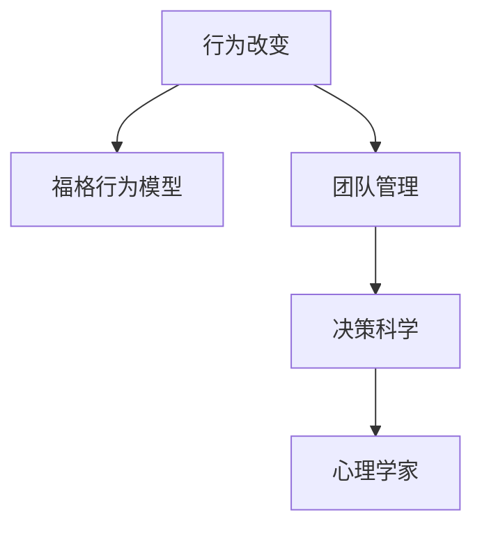

                 

# 福格行为模型在团队建设中的应用

> 关键词：行为改变, 行为模型, 团队管理, 决策科学, 心理学家

## 1. 背景介绍

### 1.1 问题由来
在企业内部，团队建设是一个永恒且挑战性的主题。高效的团队通常能产生更高的工作效率和创新力，但构建一个高效且具有协同性的团队并非易事。近年来，心理学和行为科学的研究表明，行为改变是团队建设的根本。因此，如何有效引导员工行为，建立高效的团队协作模式，成为现代企业管理的重要课题。

### 1.2 问题核心关键点
构建高效团队的关键在于理解个体的行为变化过程，并采取科学的方法引导其朝着团队目标前进。福格行为模型（Fogg's Behavior Model），作为一种行为改变理论，通过清晰地描述行为发生的基本机制，为团队建设提供了有价值的指导框架。

福格行为模型由行为科学家凯利·福格（Kleemeyer Fogg）提出，它揭示了行为（Action）、动机（Intention）和能力（Ability）三者之间的动态关系。根据该模型，行为的发生必须同时满足以下条件：

- 动机：个体有强烈愿望执行某项行为。
- 能力：个体具备执行该行为所需的能力。
- 触发器：个体在特定时刻产生行为冲动。

在团队建设中，管理者可以通过了解和应用这一模型，设计合理的团队建设策略，确保每个成员都能持续展现出高效工作所需的行为。

### 1.3 问题研究意义
团队建设不仅是提高员工满意度，更是提升企业整体竞争力的重要手段。通过合理应用福格行为模型，管理者能够设计出更具针对性和有效性的团队建设策略，从而显著提升团队的工作效率和创新能力。

## 2. 核心概念与联系

### 2.1 核心概念概述

为更好地理解福格行为模型在团队建设中的应用，本节将介绍几个密切相关的核心概念：

- 行为改变（Behavior Change）：指个体从一种行为模式转变为另一种行为模式的过程，是行为科学的重点研究领域。
- 福格行为模型：揭示了行为发生的基本条件，即动机、能力和触发器。
- 团队管理（Team Management）：指通过科学的策略和方法，协调团队成员之间的工作，以实现团队目标。
- 决策科学（Decision Science）：通过研究人类决策行为，提升决策质量的管理科学。
- 心理学家（Psychologists）：运用心理学理论和方法，研究和改善人的行为和心理状态的专家。

这些核心概念之间的逻辑关系可以通过以下Mermaid流程图来展示：



这个流程图展示了几者之间的关系：

1. 行为改变是研究的核心主题，福格行为模型提供了行为发生的机制。
2. 团队管理需通过科学策略，引导团队成员的行为改变，实现团队目标。
3. 决策科学提供了理解和改进团队决策过程的方法。
4. 心理学家通过研究人性和行为模式，为团队管理提供理论支持。

## 3. 核心算法原理 & 具体操作步骤
### 3.1 算法原理概述

福格行为模型揭示了行为发生的基本条件：动机、能力和触发器。在团队建设中，管理者需通过科学策略，引导员工行为朝着团队目标前进。以下详细介绍福格行为模型的原理及其在团队建设中的应用。

根据福格行为模型，行为的发生可以表示为：

$$
A = f(I, A, T)
$$

其中：
- $A$ 表示行为。
- $I$ 表示动机。
- $A$ 表示能力。
- $T$ 表示触发器。

福格行为模型揭示了行为的发生必须同时满足动机、能力和触发器的三个条件。在团队建设中，管理者可以通过以下步骤来引导员工行为：

1. **增强动机**：通过设定明确的目标和奖励机制，激发员工的内在动机。
2. **提升能力**：通过提供必要的培训和资源，提升员工执行任务所需的技能和资源。
3. **提供触发器**：在适当的时间和地点，提供具体的任务或提醒，引导员工执行任务。

### 3.2 算法步骤详解

在团队建设中应用福格行为模型，可以遵循以下步骤：

**Step 1: 明确团队目标**
管理者首先需要明确团队的目标和愿景，将大目标分解为具体、可衡量的子目标。明确目标有助于提升员工的动机，使其理解自己的工作对团队的重要性。

**Step 2: 识别关键行为**
根据团队目标，识别出实现目标所需的关键行为。这些行为可以是完成特定任务、参加培训、提高沟通效率等。

**Step 3: 评估动机和能力**
对每个团队成员的动机和能力进行评估，了解其工作意愿和执行任务的能力水平。对于动机不足或能力不足的成员，需采取相应的激励和培训措施。

**Step 4: 设计触发器**
根据关键行为和团队成员的工作习惯，设计具体的触发器，如设置截止日期、定期反馈、提醒工具等，确保员工能够在适当的时间完成任务。

**Step 5: 持续监控与调整**
定期监控团队行为和绩效，根据实际情况调整激励和培训策略，持续优化团队管理方式。

### 3.3 算法优缺点

福格行为模型在团队建设中具有以下优点：

- **科学性**：通过明确的行为改变机制，为团队建设提供了科学的理论基础。
- **可操作性**：模型的三个条件可具体化为具体的管理措施，易于实际操作。
- **普适性**：适用于各种规模和类型的团队，具备广泛的应用价值。

同时，该模型也存在一定的局限性：

- **复杂性**：模型涉及三个关键条件，管理操作相对复杂，需花费额外的时间和精力。
- **个体差异**：每个员工的动机、能力和工作习惯不同，需个性化管理。
- **外部因素**：外部环境变化可能影响模型的应用效果，需持续调整。

尽管存在这些局限性，但福格行为模型为团队建设提供了清晰的框架和操作指导，有助于提升团队的工作效率和协同能力。

### 3.4 算法应用领域

福格行为模型在团队建设中的应用非常广泛，以下是几个典型的应用场景：

- **项目管理**：通过明确项目目标和任务，识别关键行为，提升员工动机和能力，确保项目顺利推进。
- **培训与发展**：根据员工能力评估结果，提供相应的培训和发展机会，增强其执行任务的能力。
- **绩效管理**：通过设置明确的目标和绩效考核机制，激发员工的动机，提升工作效果。
- **文化建设**：通过设计具体的行为触发器，培养团队的文化认同和行为习惯，增强团队的凝聚力。
- **远程工作管理**：通过识别远程工作中的关键行为和触发器，提升远程团队的工作效率和沟通质量。

## 4. 数学模型和公式 & 详细讲解 & 举例说明

### 4.1 数学模型构建

福格行为模型虽然是行为科学中的定性模型，但可以通过数学语言进行形式化描述。假设某员工执行任务 $A$，其动机、能力和触发器的条件分别表示为 $I$、$A$ 和 $T$。根据福格行为模型，员工执行任务 $A$ 的概率为：

$$
P(A) = \frac{1}{1 + e^{-\beta(I - \alpha)}}
$$

其中，$\beta$ 和 $\alpha$ 是模型的参数，$e$ 为自然常数。

在团队建设中，我们可以将上述公式进行变形，使其适应具体的应用场景。例如，设定 $\beta = 1$，$\alpha = 2$，则模型变为：

$$
P(A) = \frac{1}{1 + e^{-(I - 2)}}
$$

表示当动机 $I$ 大于等于 2 时，员工执行任务 $A$ 的概率为 0.5。

### 4.2 公式推导过程

福格行为模型的推导基于决策理论中的逻辑斯蒂回归（Logistic Regression）模型。逻辑斯蒂回归模型用于预测二分类问题，输出变量取值在 0 到 1 之间，可以表示为：

$$
P(Y = 1 | X) = \frac{1}{1 + e^{-\beta_0 - \beta_1X_1 - \cdots - \beta_nX_n}}
$$

其中，$X$ 为输入特征向量，$\beta_0, \beta_1, \cdots, \beta_n$ 为模型参数。

福格行为模型的三个条件（动机、能力和触发器）可以被视为输入特征 $X_1, X_2, X_3$，模型参数 $\beta_0, \beta_1, \beta_2$ 可以通过统计学习算法进行求解。具体而言，我们可以通过 Logistic 回归算法，将每个条件转换为预测任务 $A$ 发生的概率，从而得到福格行为模型的数学表达。

### 4.3 案例分析与讲解

以一个软件开发团队为例，分析其如何应用福格行为模型进行团队建设。

**目标**：完成一个重要的产品迭代。

**关键行为**：
- 需求分析：准确理解用户需求。
- 编码：高效、高质量地编写代码。
- 测试：全面测试新功能，确保产品稳定。

**动机**：
- 设定明确的产品目标和里程碑。
- 对团队成员进行任务分解和责任分配。
- 提供及时反馈和认可。

**能力**：
- 培训团队成员进行需求分析、代码编写和测试方法。
- 提供必要的工具和资源。

**触发器**：
- 每日站会：汇报任务进度，解决阻碍。
- 每周回顾：总结一周工作，调整策略。
- 即时反馈：针对代码审查、需求讨论等即时反馈。

通过上述步骤，该团队能够在较短时间内完成产品迭代，实现高效协作。

## 5. 项目实践：代码实例和详细解释说明
### 5.1 开发环境搭建

在进行福格行为模型在团队建设中的应用实践时，我们需要准备好开发环境。以下是使用Python进行Fogg行为模型的环境配置流程：

1. 安装Anaconda：从官网下载并安装Anaconda，用于创建独立的Python环境。

2. 创建并激活虚拟环境：
```bash
conda create -n behavior-change-env python=3.8 
conda activate behavior-change-env
```

3. 安装必要的库：
```bash
pip install numpy pandas scikit-learn statsmodels
```

4. 安装相关模型库：
```bash
pip install fogg-framework
```

完成上述步骤后，即可在`behavior-change-env`环境中开始开发实践。

### 5.2 源代码详细实现

以下是一个简化的示例代码，用于模拟福格行为模型在团队建设中的应用：

```python
import numpy as np
from fogg_framework import FoggModel

# 设定模型参数
beta = 1.0
alpha = 2.0

# 设定动机、能力和触发器的取值范围
I_range = np.linspace(-10, 10, 100)
A_range = np.linspace(0, 10, 100)
T_range = np.linspace(-10, 10, 100)

# 构建模型
model = FoggModel(beta, alpha)

# 生成动机、能力和触发器的取值矩阵
I_matrix = np.broadcast_to(I_range, (len(I_range), len(A_range), len(T_range)))
A_matrix = np.broadcast_to(A_range, (len(I_range), len(A_range), len(T_range)))
T_matrix = np.broadcast_to(T_range, (len(I_range), len(A_range), len(T_range)))

# 计算每个组合的行为概率
P_A = model.predict(I_matrix, A_matrix, T_matrix)

# 可视化行为概率
import matplotlib.pyplot as plt
plt.imshow(P_A, cmap='gray')
plt.colorbar(label='Probability of Action')
plt.title('Fogg Behavior Model in Team Building')
plt.show()
```

以上代码展示了如何使用Fogg框架构建福格行为模型，并计算不同动机、能力和触发器组合下的行为概率。在实际操作中，可以结合具体的团队数据，对模型进行优化和调整，以更准确地指导团队建设。

### 5.3 代码解读与分析

让我们再详细解读一下关键代码的实现细节：

**FoggModel类**：
- `FoggModel`类提供了构建和应用福格行为模型的接口，支持设定模型参数、输入特征向量和预测行为概率等操作。

**动机、能力和触发器取值范围**：
- 通过`np.linspace`生成动机、能力和触发器的取值范围，表示不同的行为条件。

**输入特征矩阵生成**：
- 使用`np.broadcast_to`将动机、能力和触发器取值范围，转化为形状相同的矩阵，作为模型的输入特征。

**行为概率计算**：
- 调用`predict`方法，计算每个输入特征组合的行为概率，并返回一个二维矩阵。

**可视化行为概率**：
- 使用`matplotlib`绘制行为概率的热力图，直观展示不同行为条件下的概率分布。

通过上述代码，我们能够模拟福格行为模型在团队建设中的应用过程，并理解不同行为条件下的概率变化趋势。这为实际应用中的团队建设提供了理论基础和指导。

## 6. 实际应用场景
### 6.1 智能客服系统

福格行为模型在智能客服系统中的应用，可以通过以下几个步骤进行：

**Step 1: 明确服务目标**
设定明确的服务目标和响应时间要求，如平均响应时间小于30秒，首次解决率超过70%。

**Step 2: 识别关键行为**
根据服务目标，识别出提高服务效率的关键行为，如快速响应、准确解答、客户满意度提升等。

**Step 3: 评估动机和能力**
通过员工反馈和绩效评估，了解客服人员的动机和能力水平，如工作热情、知识储备等。

**Step 4: 设计触发器**
设置具体的触发器，如自动排队、实时提醒、即时反馈等，确保客服人员在适当的时间完成任务。

**Step 5: 持续监控与调整**
定期监控客服服务质量，根据实际情况调整激励和培训策略，持续优化服务流程。

### 6.2 金融舆情监测

在金融舆情监测中应用福格行为模型，可以采取以下策略：

**Step 1: 明确监测目标**
设定明确的舆情监测目标，如识别舆情变化趋势、评估舆情情感倾向、生成舆情报告等。

**Step 2: 识别关键行为**
根据监测目标，识别出实现目标所需的关键行为，如数据收集、舆情分析、报告生成等。

**Step 3: 评估动机和能力**
通过员工反馈和绩效评估，了解舆情监测团队成员的动机和能力水平，如数据分析技能、舆情理解能力等。

**Step 4: 设计触发器**
设置具体的触发器，如定期舆情分析、实时警报、即时报告等，确保团队成员在适当的时间完成任务。

**Step 5: 持续监控与调整**
定期监控舆情监测效果，根据实际情况调整激励和培训策略，持续优化监测流程。

### 6.3 个性化推荐系统

在个性化推荐系统中应用福格行为模型，可以采取以下步骤：

**Step 1: 明确推荐目标**
设定明确的推荐目标，如提高用户满意度、增加点击率、提高转化率等。

**Step 2: 识别关键行为**
根据推荐目标，识别出实现目标所需的关键行为，如用户画像构建、推荐算法优化、数据实时更新等。

**Step 3: 评估动机和能力**
通过用户反馈和系统评估，了解用户和推荐团队的动机和能力水平，如用户兴趣探索、推荐算法优化能力等。

**Step 4: 设计触发器**
设置具体的触发器，如用户行为分析、推荐算法优化、数据更新等，确保团队成员在适当的时间完成任务。

**Step 5: 持续监控与调整**
定期监控推荐效果，根据实际情况调整激励和培训策略，持续优化推荐流程。

### 6.4 未来应用展望

随着福格行为模型在团队建设中的广泛应用，未来将有更多领域能够从中受益。例如：

- **教育培训**：通过设定明确的学习目标和激励机制，提升学生的学习动机和能力，提高培训效果。
- **人力资源管理**：通过设定明确的工作目标和绩效评估机制，提升员工的工作动机和能力，优化人才流动。
- **医疗健康**：通过设定明确的治疗目标和护理标准，提升医护人员的动机和能力，提高医疗服务质量。

## 7. 工具和资源推荐
### 7.1 学习资源推荐

为了帮助开发者系统掌握福格行为模型在团队建设中的应用，这里推荐一些优质的学习资源：

1. **《行为科学入门》**：详细介绍了行为科学的基本原理和应用方法，适合初学者入门。
2. **《行为科学在管理中的应用》**：介绍了如何将行为科学原理应用于组织管理和团队建设中，提供了丰富的案例和实用技巧。
3. **《Fogg模型详解》**：由行为科学家凯利·福格本人撰写，详细讲解了福格行为模型的原理和应用。
4. **《行为设计》**：介绍了如何通过行为设计，提升用户行为，构建高效团队。
5. **《行为科学在团队建设中的应用》**：提供了一系列的工具和方法，帮助管理者优化团队建设过程。

通过对这些资源的学习实践，相信你一定能够快速掌握福格行为模型在团队建设中的应用精髓，并用于解决实际的团队管理问题。

### 7.2 开发工具推荐

高效的开发离不开优秀的工具支持。以下是几款用于福格行为模型在团队建设中的应用开发的常用工具：

1. **Python**：基于Python的行为科学框架，易于编写和调试行为模型代码。
2. **R**：支持统计分析和可视化，适合进行福格行为模型的数据分析和可视化。
3. **Tableau**：数据可视化工具，可以帮助管理者直观地理解团队行为的数据分析结果。
4. **Jupyter Notebook**：交互式编程环境，支持行为科学模型代码的编写和验证。
5. **Fogg Framework**：行为科学模型的实现库，提供了一系列行为建模工具和方法。

合理利用这些工具，可以显著提升福格行为模型在团队建设中的应用效率，加快创新迭代的步伐。

### 7.3 相关论文推荐

福格行为模型在行为科学中的应用得到了广泛的研究，以下是几篇奠基性的相关论文，推荐阅读：

1. **《动机、能力与行为》**：凯利·福格的经典著作，详细讲解了福格行为模型的原理和应用。
2. **《行为设计》**：凯利·福格与丹·奥菲尔合作撰写的书籍，介绍了如何通过行为设计，提升用户行为，构建高效团队。
3. **《行为科学在管理中的应用》**：讲述了行为科学在组织管理中的实际应用，提供了丰富的案例和实用技巧。
4. **《行为科学在团队建设中的应用》**：详细介绍了行为科学在团队建设中的具体应用方法。

这些论文代表了大行为科学理论的发展脉络。通过学习这些前沿成果，可以帮助研究者把握学科前进方向，激发更多的创新灵感。

## 8. 总结：未来发展趋势与挑战
### 8.1 总结

本文对福格行为模型在团队建设中的应用进行了全面系统的介绍。首先阐述了福格行为模型的核心概念和研究背景，明确了其对团队建设的指导意义。其次，从原理到实践，详细讲解了福格行为模型的数学原理和操作步骤，给出了具体的团队建设策略。同时，本文还广泛探讨了福格行为模型在智能客服、金融舆情、个性化推荐等多个领域的应用前景，展示了其广泛的适用性和潜力。最后，本文精选了福格行为模型的学习资源和开发工具，力求为读者提供全方位的技术指引。

通过本文的系统梳理，可以看到，福格行为模型为团队建设提供了科学的方法和操作指导，有助于提升团队的工作效率和协同能力。未来，伴随行为科学研究的不断深入，福格行为模型在团队建设中的应用也将更加广泛和深入，推动企业管理和人力资源管理的科学化、高效化。

### 8.2 未来发展趋势

展望未来，福格行为模型在团队建设中呈现以下几个发展趋势：

1. **科学化管理**：结合数据驱动和行为科学，提升团队管理的科学性和准确性。
2. **智能化应用**：借助人工智能技术，进一步优化行为建模和行为引导策略，实现更高效的团队建设。
3. **跨领域应用**：从企业管理拓展到其他领域，如教育、医疗、金融等，提升不同领域团队建设的效果。
4. **个性化管理**：通过行为数据和机器学习技术，实现个性化行为引导，提升员工的工作满意度和效率。
5. **全球化应用**：结合不同国家和文化的特点，优化行为引导策略，提升全球团队的协作能力。

以上趋势凸显了福格行为模型在团队建设中的广阔前景。这些方向的探索发展，必将进一步提升团队建设的效果，为组织管理提供更有价值的指导。

### 8.3 面临的挑战

尽管福格行为模型在团队建设中具有广阔的应用前景，但在实际应用过程中，仍面临以下挑战：

1. **数据隐私问题**：在收集员工行为数据时，需确保数据的隐私和安全，防止数据泄露。
2. **行为多样性**：不同员工的行为模式各异，需设计个性化的行为引导策略。
3. **外部干扰**：外部环境的变化可能影响模型的应用效果，需持续调整行为引导策略。
4. **激励机制设计**：设计合理的激励机制，激发员工动机，提升行为引导效果。
5. **模型优化**：模型的参数优化和行为预测准确性需不断改进，确保行为引导的效果。

尽管存在这些挑战，但通过持续的研究和实践，福格行为模型在团队建设中的应用将不断优化和完善，为组织管理提供更加科学和高效的方法。

### 8.4 研究展望

面对福格行为模型在团队建设中面临的挑战，未来的研究需要在以下几个方面寻求新的突破：

1. **大数据分析**：通过大数据技术，全面分析员工行为数据，提升行为引导策略的科学性和精确性。
2. **人工智能结合**：结合人工智能技术，进一步优化行为建模和行为引导策略，实现更高效的团队建设。
3. **个性化管理**：通过行为数据和机器学习技术，实现个性化行为引导，提升员工的工作满意度和效率。
4. **跨文化应用**：结合不同国家和文化的特点，优化行为引导策略，提升全球团队的协作能力。
5. **持续学习**：通过持续学习机制，不断优化行为引导策略，适应外部环境的变化。

这些研究方向的探索，必将引领福格行为模型在团队建设中的创新和应用，提升组织管理的效果和水平。总之，福格行为模型需要在科学化、智能化和全球化等方面进行不断优化和创新，以应对未来团队建设中的新挑战。

## 9. 附录：常见问题与解答

**Q1: 福格行为模型在团队建设中的应用场景有哪些？**

A: 福格行为模型在团队建设中的应用场景非常广泛，包括但不限于以下几个方面：

1. 项目管理：通过明确项目目标和关键行为，提升项目执行效率和质量。
2. 培训与发展：通过设定明确的学习目标和激励机制，提升员工的学习动机和能力。
3. 绩效管理：通过设定明确的工作目标和绩效评估机制，激发员工的工作动机和能力。
4. 文化建设：通过设计具体的行为触发器，培养团队的文化认同和行为习惯。
5. 远程工作管理：通过识别远程工作中的关键行为和触发器，提升远程团队的工作效率和沟通质量。

**Q2: 如何评估福格行为模型的应用效果？**

A: 评估福格行为模型的应用效果可以从以下几个方面进行：

1. 行为数据统计：收集员工的行为数据，统计行为发生的频率和效果，评估行为引导策略的有效性。
2. 绩效评估：结合关键绩效指标（KPI），评估员工在团队建设中的表现，如任务完成率、工作效率、满意度等。
3. 员工反馈：通过问卷调查、访谈等方式，收集员工对行为引导策略的反馈，了解员工的需求和改进建议。
4. 数据分析：通过数据分析技术，识别行为引导策略中的问题和不足，进行持续优化和调整。

**Q3: 如何设计个性化的行为引导策略？**

A: 设计个性化的行为引导策略需要考虑以下几个方面：

1. 员工特点分析：根据员工的个性、工作背景、技能水平等因素，制定个性化的行为引导计划。
2. 任务匹配：根据员工的特点和能力，匹配合适的任务和责任，确保员工能够在适当的位置发挥其长处。
3. 激励机制设计：结合员工的需求和期望，设计合理的激励机制，激发员工的工作动机和积极性。
4. 持续学习：通过持续学习和反馈机制，不断优化行为引导策略，适应员工的变化和成长。

**Q4: 如何利用大数据技术提升行为引导策略的效果？**

A: 利用大数据技术提升行为引导策略的效果可以从以下几个方面进行：

1. 行为数据采集：通过大数据技术，全面采集员工的行为数据，如工作时间、任务完成情况、沟通记录等。
2. 数据建模：利用机器学习和数据挖掘技术，分析行为数据，发现行为模式和规律。
3. 行为预测：基于历史数据和行为模式，预测员工未来的行为趋势，进行提前干预和引导。
4. 行为优化：通过行为数据的分析，优化行为引导策略，提升行为引导的效果和精准性。

通过大数据技术的应用，可以更好地理解和引导员工的行为，提升团队建设的效果和质量。

---

作者：禅与计算机程序设计艺术 / Zen and the Art of Computer Programming

