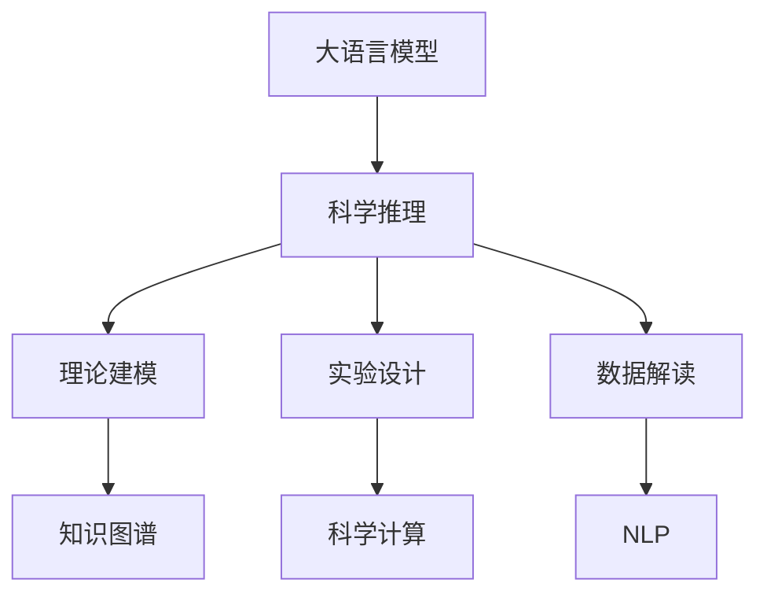

                 

# 科学推理：LLM 协助理论和实验研究

> 关键词：科学推理,LLM,理论建模,实验设计,自然语言处理,NLP,知识图谱,科学计算,科研自动化

## 1. 背景介绍

### 1.1 问题由来

在科学研究和工程实践中，科学推理扮演着至关重要的角色。它不仅帮助我们理解自然界的规律，更是设计和验证科学假设、指导实验步骤、解读实验结果的关键工具。然而，传统的科学推理过程往往依赖于人工分析，耗时费力，容易受到个体认知局限的影响。近年来，随着人工智能技术，尤其是大语言模型(LLM)的飞速发展，借助计算机辅助科学推理成为了新的研究热点。

### 1.2 问题核心关键点

大语言模型，特别是深度学习驱动的Transformer架构模型，凭借其强大的语言理解和生成能力，在自然语言处理(NLP)领域取得了重大突破。它们不仅能够理解并生成自然语言文本，还能利用海量文本数据进行预训练，学习到丰富的语言知识和常识。因此，将大语言模型应用于科学推理任务，不仅可以提升推理的自动化水平，还能扩展知识覆盖面，辅助人类进行复杂的理论建模和实验设计。

### 1.3 问题研究意义

通过将大语言模型引入科学推理，可以实现以下目标：

1. **加速科学发现**：自动化地处理大规模文献和数据，快速提取关键信息和潜在关联，缩短从问题发现到理论验证的时间。
2. **增强科研效率**：减轻科学家对复杂数据和文献的人工分析负担，提高科研工作的效率和精度。
3. **促进跨学科研究**：通过跨领域的知识整合，促进不同学科之间的交流和合作，推动科学进步。
4. **科学计算辅助**：在复杂的数学建模和数值计算中，利用大语言模型的符号计算和数值分析能力，提供辅助工具和解决方案。
5. **科研自动化**：构建自动化科研工作流程，从数据采集到结果分析，大幅降低科研过程中的人工干预。

## 2. 核心概念与联系

### 2.1 核心概念概述

- **大语言模型(LLM)**：以Transformer为代表的大规模预训练语言模型。通过在大规模无标签文本数据上预训练，学习通用语言表示，具备强大的语言理解和生成能力。
- **科学推理**：科学探究中用于建立假设和验证结论的过程。包括理论建模、实验设计、数据解读等步骤。
- **知识图谱**：一种以图结构形式存储实体间关系的知识表示方法。用于整合多源异构数据，支持复杂推理和查询。
- **科学计算**：利用计算机算法解决科学问题，包括数值模拟、优化计算、数据可视化等。
- **自然语言处理(NLP)**：研究计算机如何理解和生成人类语言的技术。包括语言理解、生成、翻译、信息检索等任务。

这些核心概念之间的逻辑关系可以通过以下Mermaid流程图来展示：



这个流程图展示了大语言模型在科学推理过程中的关键作用，以及与其它核心概念的紧密联系。

## 3. 核心算法原理 & 具体操作步骤
### 3.1 算法原理概述

大语言模型在科学推理中的应用主要体现在以下几个方面：

1. **知识抽取**：从大规模文献和数据中提取关键信息，构建知识图谱，辅助理论建模和实验设计。
2. **假设生成**：根据已有知识和文献信息，自动生成科学假设和命题，提供新思路和研究方向。
3. **实验设计**：利用自然语言理解和生成能力，设计实验方案和步骤，提高实验设计的系统性和可执行性。
4. **数据分析**：在实验结果的解读和分析中，利用语言模型的符号计算和数值分析能力，进行数据整合和结果解释。

### 3.2 算法步骤详解

以科学推理中的“实验设计”为例，下面详细介绍大语言模型在实验设计中的应用流程：

**Step 1: 预处理实验数据和文献**

- 收集与实验相关的背景资料和文献，如综述文章、研究报告、科学论文等。
- 使用NLP技术对文本进行预处理，包括分词、去除停用词、提取关键句子等。
- 将处理后的文本数据输入大语言模型，进行语义理解和特征提取。

**Step 2: 构建实验设计问题**

- 定义实验设计问题，明确需要验证的假设和目标。
- 将问题转化为自然语言形式，利用大语言模型的自然语言处理能力，生成实验方案草案。
- 对草案进行微调，确保其符合科学实验的要求和逻辑。

**Step 3: 自动化生成实验步骤**

- 根据问题定义和文献信息，利用大语言模型生成实验步骤和细节。
- 通过多轮迭代，优化实验步骤，确保其科学性和可行性。
- 将实验步骤转化为具体的实验指令和操作流程，生成实验方案文档。

**Step 4: 实验方案验证**

- 使用专家评审或模型评估，验证实验方案的合理性和有效性。
- 根据反馈调整实验设计，进一步完善方案。
- 最终确定实验方案，准备实验数据和设备，进行实验验证。

### 3.3 算法优缺点

大语言模型在科学推理中的应用具有以下优点：

1. **高效性**：利用大语言模型的自动处理能力，可以快速分析和处理大规模文献和数据，节省人工时间。
2. **灵活性**：大语言模型可以灵活地处理不同形式的数据和信息，支持复杂的推理和逻辑。
3. **创新性**：利用语言模型的自然语言生成能力，自动生成科学假设和命题，提供新的研究方向。
4. **可扩展性**：大语言模型可以与知识图谱、科学计算等技术结合，构建综合性的科研平台。

然而，大语言模型在科学推理中也存在一些局限性：

1. **准确性**：大语言模型的输出依赖于输入数据的质量和处理方式，可能存在错误和歧义。
2. **理解深度**：语言模型对某些专业术语和复杂结构的理解可能不足，需要人工辅助修正。
3. **领域限制**：模型的性能受限于训练数据和领域知识，对于特定领域的知识整合能力有限。
4. **伦理和安全性**：语言模型可能引入偏见或有害信息，需要严格筛选和监控。

### 3.4 算法应用领域

大语言模型在科学推理中的应用领域非常广泛，涵盖了从理论建模到实验设计的多个环节。以下是几个典型应用案例：

1. **生物学研究**：利用语言模型解析基因组数据，自动生成生物学假设，设计实验验证。
2. **物理学实验**：通过语言模型理解物理定律和实验设计，生成实验步骤和数据处理方案。
3. **化学合成**：借助语言模型分析化学反应过程，自动生成合成路线和实验条件。
4. **天文学观测**：利用语言模型处理天体观测数据，生成观测方案和数据分析方法。
5. **环境科学**：结合环境数据和文献信息，自动设计实验方案，研究环境变化和影响因素。

## 4. 数学模型和公式 & 详细讲解 & 举例说明（备注：数学公式请使用latex格式，latex嵌入文中独立段落使用 $$，段落内使用 $)
### 4.1 数学模型构建

假设有一个科学问题 $P$，通过大语言模型抽取的关键信息为 $\mathcal{K}$。我们希望利用这些信息构建一个科学假设 $H$，并设计一系列实验步骤 $S$ 来验证假设。

形式化地，我们可以将问题 $P$ 和关键信息 $\mathcal{K}$ 视为输入，大语言模型 $M$ 视为中间处理过程，最终输出为科学假设 $H$ 和实验步骤 $S$。

### 4.2 公式推导过程

**Step 1: 信息抽取**

- 将问题 $P$ 和关键信息 $\mathcal{K}$ 输入语言模型 $M$，进行语义理解和特征提取。
- 模型输出一个关于 $P$ 和 $\mathcal{K}$ 的向量表示 $v$，包含问题和关键信息的语义信息。

**Step 2: 假设生成**

- 利用生成式模型，如GPT或T5，根据向量表示 $v$ 生成一个科学假设 $H$。
- 假设生成过程可以看作是求解优化问题：

$$
\hat{H} = \mathop{\arg\max}_{H} P(H \mid P, \mathcal{K}) = \mathop{\arg\max}_{H} \log P(H \mid P, \mathcal{K})
$$

其中 $P$ 表示概率分布，$\mathcal{K}$ 为上下文信息，$H$ 为生成的假设。

**Step 3: 实验设计**

- 设计实验步骤 $S$，使其满足假设 $H$ 的验证需求。
- 实验设计可以看作是求解另一个优化问题：

$$
\hat{S} = \mathop{\arg\min}_{S} \mathcal{L}(S, H, P, \mathcal{K})
$$

其中 $\mathcal{L}$ 为损失函数，用于衡量实验步骤 $S$ 与假设 $H$ 和问题 $P$ 的匹配度。

### 4.3 案例分析与讲解

以生物学中的人类基因组研究为例，我们希望验证“人类基因组中的某些基因突变与某种疾病的发病率有关”这一假设。利用大语言模型，我们可以自动化地进行以下步骤：

1. **信息抽取**：从已有的基因组数据和相关文献中，抽取与基因突变和疾病发病率相关的关键信息。
2. **假设生成**：基于提取的关键信息，生成一个关于基因突变与疾病关系的科学假设。
3. **实验设计**：根据假设，设计一系列实验步骤，如基因突变筛选、疾病发病率统计等。
4. **数据分析**：对实验结果进行数据分析，验证假设是否成立。

## 5. 项目实践：代码实例和详细解释说明
### 5.1 开发环境搭建

为了进行科学推理相关的大语言模型应用开发，我们需要一个包含大量科研文献和数据的开发环境。以下是搭建开发环境的详细步骤：

1. **安装Python**：从官网下载安装Python，推荐使用3.8及以上版本。
2. **安装Anaconda**：从官网下载安装Anaconda，创建虚拟环境，并激活。
3. **安装相关库**：安装NLP相关的库，如NLTK、spaCy、gensim等，用于文本处理和分析。
4. **下载预训练模型**：从HuggingFace等平台下载预训练的科学推理大语言模型。
5. **准备数据集**：收集和整理与科学问题相关的文献和数据，构建用于实验设计的任务数据集。

### 5.2 源代码详细实现

以下是一个简单的Python代码示例，用于展示大语言模型在科学推理中的应用。

```python
import torch
from transformers import AutoTokenizer, AutoModelForCausalLM

# 加载预训练模型和分词器
model_name = 'gpt2'
tokenizer = AutoTokenizer.from_pretrained(model_name)
model = AutoModelForCausalLM.from_pretrained(model_name)

# 定义科学问题
question = "人类基因组中的哪些基因突变与某种疾病的发病率有关？"

# 使用大语言模型进行假设生成
inputs = tokenizer(question, return_tensors='pt')
outputs = model.generate(inputs['input_ids'])
hypothesis = tokenizer.decode(outputs[0], skip_special_tokens=True)

# 输出假设
print("科学假设：", hypothesis)
```

### 5.3 代码解读与分析

**代码解释**：

1. **导入库**：使用PyTorch和Transformers库，加载预训练模型和分词器。
2. **加载模型**：从预训练模型仓库中下载并加载GPT-2模型。
3. **定义问题**：定义科学问题，作为输入输入模型。
4. **生成假设**：使用模型生成与问题相关的科学假设，解码输出并打印。

**代码分析**：

- **问题定义**：科学问题的定义需要精确和具体，以便模型能够生成有意义的假设。
- **模型选择**：选择合适的预训练模型，如GPT-2，根据问题的复杂度进行调整。
- **生成假设**：利用模型生成假设，解码输出并进行筛选，确保假设的科学性。
- **假设验证**：根据假设设计实验，验证其是否成立。

## 6. 实际应用场景

### 6.1 生命科学研究

在生命科学研究中，大语言模型可以帮助研究人员快速理解和提取基因组数据、蛋白质结构数据等关键信息，辅助理论建模和实验设计。例如，在癌症研究中，大语言模型可以自动生成药物靶点、基因突变与疾病关系等假设，并设计实验方案进行验证。

### 6.2 天文学观测

天文学家可以利用大语言模型处理海量天文观测数据，自动化地生成观测方案和数据处理流程。例如，基于已有的黑洞观测数据，模型可以自动设计新的观测方案，并预测可能发现的黑洞特性。

### 6.3 材料科学应用

在材料科学中，研究人员可以利用大语言模型解析复杂的材料结构和性能数据，生成新的材料设计和合成方案。例如，基于现有材料的分子结构和性能数据，模型可以自动生成新的材料设计和合成路线，并进行实验验证。

### 6.4 未来应用展望

随着大语言模型的进一步发展，其在科学推理中的应用也将不断拓展和深化。未来，大语言模型有望在以下几个方面取得更大进展：

1. **跨领域知识整合**：通过跨领域的知识图谱和数据融合，提升模型的知识整合能力，支持更复杂的科学推理。
2. **智能实验设计**：利用模型生成多轮实验方案，自动优化和选择最优方案，提高实验设计的效率和精度。
3. **符号计算与数值分析**：在数学建模和数值计算中，利用语言模型的符号计算和数值分析能力，提供辅助工具和解决方案。
4. **科研自动化平台**：构建综合性的科研自动化平台，涵盖文献处理、假设生成、实验设计、数据分析等多个环节，提高科研工作的系统性和自动化水平。

## 7. 工具和资源推荐

### 7.1 学习资源推荐

为了帮助开发者系统掌握大语言模型在科学推理中的应用，以下是一些优质的学习资源：

1. **《科学计算与人工智能》课程**：斯坦福大学开设的课程，涵盖科学计算、人工智能和机器学习的基础知识和应用。
2. **《自然语言处理与科学推理》书籍**：介绍NLP在科学推理中的应用，涵盖文献处理、假设生成、实验设计等多个环节。
3. **HuggingFace官方文档**：提供大量预训练模型的详细说明和样例代码，适合初学者和进阶开发者。
4. **Kaggle竞赛**：参与NLP和科学推理相关的Kaggle竞赛，实战练习和提升技能。

### 7.2 开发工具推荐

以下是一些用于大语言模型在科学推理中的应用开发的常用工具：

1. **Jupyter Notebook**：强大的交互式编程环境，适合快速实验和数据处理。
2. **TensorBoard**：可视化工具，可以实时监测模型训练状态和性能指标。
3. **Weights & Biases**：实验跟踪工具，记录和可视化实验过程，便于调优和分享。
4. **NLTK**：自然语言处理工具包，提供丰富的NLP功能，如分词、词性标注等。
5. **spaCy**：NLP库，支持高效的文本处理和分析，适合大规模数据集。

### 7.3 相关论文推荐

为了深入理解大语言模型在科学推理中的应用，以下是几篇奠基性的相关论文：

1. **《科学推理中的大语言模型》**：探讨大语言模型在科学推理中的各种应用场景，如假设生成、实验设计、数据分析等。
2. **《利用大语言模型进行科学知识整合》**：介绍如何使用大语言模型整合跨领域的知识图谱，支持复杂的科学推理。
3. **《大语言模型辅助材料设计》**：展示大语言模型在材料科学中的应用，生成新的材料设计和合成方案。
4. **《基于大语言模型的天文学数据分析》**：介绍大语言模型在天文观测数据处理中的应用，自动化设计观测方案。

## 8. 总结：未来发展趋势与挑战

### 8.1 研究成果总结

本文通过介绍大语言模型在科学推理中的应用，展示了其强大的语言理解和生成能力，能够辅助研究人员进行理论建模、实验设计、数据分析等任务。通过科学的算法原理和操作步骤，我们详细说明了如何使用大语言模型生成假设、设计实验、验证结论，显著提高了科研工作的效率和精度。

### 8.2 未来发展趋势

未来，大语言模型在科学推理中的应用将呈现以下几个趋势：

1. **跨领域知识融合**：通过跨领域的知识图谱和数据整合，提升模型的知识整合能力，支持更复杂的科学推理。
2. **智能实验设计**：利用模型生成多轮实验方案，自动优化和选择最优方案，提高实验设计的效率和精度。
3. **符号计算与数值分析**：在数学建模和数值计算中，利用语言模型的符号计算和数值分析能力，提供辅助工具和解决方案。
4. **科研自动化平台**：构建综合性的科研自动化平台，涵盖文献处理、假设生成、实验设计、数据分析等多个环节，提高科研工作的系统性和自动化水平。

### 8.3 面临的挑战

尽管大语言模型在科学推理中的应用前景广阔，但也面临以下挑战：

1. **数据依赖性**：大语言模型的性能依赖于输入数据的数量和质量，对于小规模数据集可能效果不佳。
2. **推理准确性**：模型生成的假设和实验方案需要经过人工验证，确保其科学性和可行性。
3. **模型复杂性**：大语言模型的结构和参数复杂，需要大量的计算资源和时间进行训练和优化。
4. **伦理和安全性**：语言模型可能引入偏见或有害信息，需要严格筛选和监控，确保输出的伦理和安全。

### 8.4 研究展望

为应对以上挑战，未来的研究需要在以下几个方面进行突破：

1. **数据增强和迁移学习**：通过数据增强和迁移学习技术，提高模型对小规模数据集的适应能力。
2. **优化算法和模型结构**：开发更高效的优化算法和模型结构，降低计算资源和时间成本。
3. **伦理和安全机制**：建立模型输出的伦理和安全机制，确保输出的公平性和无害性。
4. **跨学科协作**：加强与科研人员、伦理学家等的跨学科协作，推动科学推理技术的全面发展。

## 9. 附录：常见问题与解答

**Q1: 大语言模型在科学推理中是否适用于所有科研领域？**

A: 大语言模型在科学推理中的应用具有一定的局限性。对于某些需要复杂实验设计和严格数据验证的领域，如化学合成、材料科学等，模型生成的假设和实验方案仍需经过人工验证和修正。

**Q2: 大语言模型生成的假设和实验方案需要经过哪些步骤验证？**

A: 大语言模型生成的假设和实验方案需要经过以下步骤验证：

1. **专家评审**：邀请领域专家对生成的假设和方案进行评审，评估其科学性和可行性。
2. **文献对比**：将生成的假设和方案与已有的文献进行对比，确保其新颖性和创新性。
3. **实验验证**：设计实验验证生成的假设和方案，通过实验结果进行检验和修正。

**Q3: 大语言模型在科学推理中的计算资源需求如何？**

A: 大语言模型在科学推理中的计算资源需求较高，主要体现在以下几个方面：

1. **模型训练**：大规模模型的训练需要高性能的GPU或TPU设备，训练时间较长。
2. **实验设计**：生成复杂实验方案需要大量计算资源，特别是在处理大规模数据集时。
3. **数据处理**：大规模文献和数据处理需要足够的内存和存储资源。

**Q4: 大语言模型生成的假设和方案如何进行优化？**

A: 大语言模型生成的假设和方案可以通过以下方法进行优化：

1. **人工修正**：根据专家的评审意见和文献对比结果，对生成的假设和方案进行人工修正。
2. **多轮迭代**：通过多轮迭代，逐步优化假设和方案，提高其科学性和可行性。
3. **模型微调**：对模型进行微调，优化其参数和结构，提升生成假设和方案的质量。

**Q5: 大语言模型在科学推理中的伦理和安全问题如何解决？**

A: 大语言模型在科学推理中的伦理和安全问题可以通过以下方法解决：

1. **数据筛选**：严格筛选输入数据，避免引入偏见和有害信息。
2. **模型监控**：建立模型输出的监控机制，及时发现和纠正可能的不公平或有害输出。
3. **专家参与**：邀请伦理学家和领域专家参与模型训练和应用，确保模型的伦理和安全。

---

作者：禅与计算机程序设计艺术 / Zen and the Art of Computer Programming

