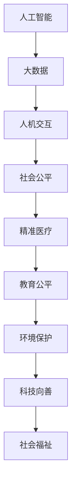

                 

# 科技向善：用科技的力量解决社会难题

> 关键词：科技向善, 社会问题, 人工智能, 大数据, 人机交互, 公平正义, 精准医疗, 教育公平, 环境保护

## 1. 背景介绍

### 1.1 问题由来
科技向善(Tech for Good)正逐渐成为全球科技界和业界的主流价值观。在信息技术的快速发展与普及应用下，科技在推动社会进步、解决社会问题方面展现出巨大潜能。近年来，基于大数据、人工智能、物联网等技术的解决方案，已经深入到教育、医疗、环境保护、城市治理等多个社会问题的应对中，极大地改善了人们的生活质量。然而，科技的快速发展也带来了一些新的社会问题，如数据隐私、算法偏见、技术伦理等，如何在使用科技的过程中保持正确价值观和责任担当，成为一个亟待回答的问题。

### 1.2 问题核心关键点
科技向善的核心在于利用科技解决社会问题，提升社会福祉，同时确保科技应用符合伦理道德、社会公平和人类尊严。这一过程包括：

- **科技应用**：通过科技手段解决实际社会问题，如疾病预防、环境保护、贫困救助等。
- **伦理规范**：科技应用时必须遵守伦理道德规范，避免对人的尊严、权利的侵犯。
- **社会公平**：确保科技应用带来的利益能够公平地惠及所有人，而不是少数特权群体。
- **数据隐私**：保护用户数据隐私，避免数据滥用和泄露。

## 2. 核心概念与联系

### 2.1 核心概念概述

为了更好地理解科技向善，我们先介绍几个关键概念：

- **科技向善(Tech for Good)**：利用科技手段解决社会问题，提升社会福祉，实现可持续发展。
- **人工智能(AI)**：通过机器学习、深度学习等技术，使计算机系统具备类似人的智能行为。
- **大数据(Big Data)**：利用先进的技术和工具，从各种数据源中收集、整理、分析和利用大量数据，以获得洞察力、指导决策。
- **人机交互(Human-Computer Interaction, HCI)**：研究如何设计和实现人与计算机之间的有效沟通和协作。
- **社会公平(Social Equity)**：指在社会各个领域中，所有人都能获得平等的机会和待遇。
- **精准医疗(Personalized Medicine)**：利用基因组信息、电子健康记录等数据，为个体提供个性化、针对性的医疗方案。
- **教育公平(Educational Equity)**：确保所有人都能获得公平的教育资源和机会。
- **环境保护(Environmental Protection)**：通过科技手段减少对自然环境的破坏，推动可持续发展。

这些核心概念之间的逻辑关系可以通过以下Mermaid流程图来展示：



这个流程图展示了大数据、人工智能、人机交互、社会公平等关键概念，通过科技手段实现精准医疗、教育公平、环境保护，最终推动科技向善和提升社会福祉。

## 3. 核心算法原理 & 具体操作步骤
### 3.1 算法原理概述

科技向善的核心算法原理是通过科技手段收集、分析和利用数据，利用人工智能模型进行预测和决策，最终用于解决实际社会问题。核心流程如下：

1. **数据收集**：利用传感器、互联网、社交媒体等技术手段，收集与问题相关的数据。
2. **数据处理**：对收集到的数据进行清洗、转换、整合，以获得高质量的数据集。
3. **模型训练**：选择适当的算法和模型结构，在大规模数据上进行训练，学习数据的特征和规律。
4. **模型应用**：将训练好的模型应用于实际问题中，进行预测、决策或优化。
5. **效果评估**：对模型应用的效果进行评估，确保其有效性和可靠性。
6. **迭代优化**：根据评估结果，调整模型参数或算法，进行迭代优化，提升模型的性能。

### 3.2 算法步骤详解

以下详细介绍科技向善的每个步骤：

**Step 1: 数据收集**

数据收集是科技向善的基础。可以通过以下方式进行数据收集：

- 传感器：收集环境、健康、行为等实时数据。
- 互联网：从社交媒体、论坛、新闻网站等网络平台获取信息。
- 调查问卷：通过线上线下的问卷调查获取用户反馈。
- 公开数据集：使用政府、非政府组织等提供的公开数据。

**Step 2: 数据处理**

数据处理包括数据清洗、数据转换和数据整合，主要目的是将数据标准化，以便于后续分析。常用的数据处理技术包括：

- 数据清洗：去除噪音、重复、异常值等，确保数据质量。
- 数据转换：使用特征工程等技术，将原始数据转换为模型所需的形式。
- 数据整合：将来自不同来源的数据进行整合，以获得更全面的信息。

**Step 3: 模型训练**

模型训练是科技向善的核心。常用的算法包括监督学习、无监督学习、半监督学习和强化学习。模型训练步骤如下：

- 数据划分：将数据划分为训练集、验证集和测试集。
- 选择合适的算法：根据任务类型选择合适的算法。
- 训练模型：在训练集上训练模型，调整模型参数。
- 验证模型：在验证集上评估模型性能，避免过拟合。
- 迭代优化：根据验证结果调整模型参数，进行迭代优化。

**Step 4: 模型应用**

模型应用是将科技应用于实际问题的关键步骤。可以通过以下方式进行模型应用：

- 实时预测：将模型应用于实时数据流，进行实时预测和决策。
- 模拟分析：在模拟环境中测试模型效果。
- 优化决策：使用模型辅助决策，提高决策效率和质量。

**Step 5: 效果评估**

效果评估是确保模型有效性和可靠性的重要步骤。常用的评估指标包括：

- 准确率、召回率和F1分数：用于分类任务。
- MAE、RMSE和R²值：用于回归任务。
- ROC曲线和AUC值：用于二分类任务。
- 效率指标：计算模型处理数据的速度和消耗的资源。

**Step 6: 迭代优化**

迭代优化是提升模型性能的关键。常用的优化策略包括：

- 调整模型参数：根据评估结果调整模型结构和参数。
- 数据增强：通过数据增强技术，增加训练数据的多样性。
- 正则化：使用L2正则化、Dropout等技术，避免过拟合。
- 模型集成：使用集成学习技术，将多个模型进行组合，提高模型性能。

### 3.3 算法优缺点

科技向善的算法具有以下优点：

- **数据驱动**：基于数据驱动的决策和预测，提高了决策的科学性和有效性。
- **实时性**：通过实时数据处理和分析，可以迅速响应突发事件和变化。
- **普适性**：科技手段适用于多种场景和问题，具有广泛应用潜力。

同时，也存在以下缺点：

- **数据隐私**：科技应用过程中可能涉及敏感数据，需要严格保护数据隐私。
- **算法偏见**：算法可能继承数据中的偏见，导致不公平的决策和预测。
- **技术伦理**：科技应用过程中可能存在伦理问题，如隐私侵犯、道德冲突等。
- **技术复杂性**：科技应用过程涉及复杂的技术和算法，需要高水平的专业知识。

### 3.4 算法应用领域

科技向善在多个领域具有广泛应用：

- **精准医疗**：利用基因组信息、电子健康记录等数据，为个体提供个性化、针对性的医疗方案。
- **教育公平**：通过科技手段，为偏远地区和弱势群体提供教育资源。
- **环境保护**：利用物联网、大数据等技术，进行环境监测和污染控制。
- **智慧城市**：通过智慧交通、智慧环保等手段，提升城市治理水平。
- **灾害应对**：利用大数据、AI技术，进行灾害预警和应急响应。

## 4. 数学模型和公式 & 详细讲解 & 举例说明

### 4.1 数学模型构建

在本节中，我们将以精准医疗为例，构建数学模型。假设有一个医疗数据集 $D=\{(x_i, y_i)\}_{i=1}^N$，其中 $x_i$ 是患者的基因组数据，$y_i$ 是患者的治疗结果。我们的目标是根据 $x_i$ 预测 $y_i$。

### 4.2 公式推导过程

我们采用深度学习中的神经网络模型进行预测。设神经网络模型为 $f(x; \theta)$，其中 $\theta$ 为模型参数。模型的预测结果为：

$$
\hat{y} = f(x; \theta)
$$

在训练过程中，我们使用损失函数 $\ell(\hat{y}, y)$ 衡量预测结果和真实结果的差距。常用的损失函数包括均方误差 (MSE) 和交叉熵损失 (CELoss)。例如，交叉熵损失函数为：

$$
\ell(\hat{y}, y) = -\frac{1}{N}\sum_{i=1}^N y_i \log(\hat{y}_i)
$$

其中 $y_i$ 为实际结果，$\hat{y}_i$ 为预测结果。模型的参数 $\theta$ 通过最小化损失函数进行优化，常用的优化算法包括梯度下降 (GD) 和随机梯度下降 (SGD)。

### 4.3 案例分析与讲解

以精准医疗为例，我们如何使用神经网络进行基因组数据的预测和分类：

- **数据预处理**：将基因组数据转换为模型所需的格式，如将基因型转换为向量形式。
- **模型设计**：设计一个深度神经网络模型，包含多个隐藏层和全连接层。
- **模型训练**：在训练集上训练模型，调整参数，最小化交叉熵损失。
- **模型评估**：在验证集上评估模型效果，调整参数。
- **模型应用**：将训练好的模型应用于新样本，进行基因型分类和疾病预测。

## 5. 项目实践：代码实例和详细解释说明

### 5.1 开发环境搭建

在进行科技向善项目实践前，我们需要准备好开发环境。以下是使用Python进行PyTorch开发的环境配置流程：

1. 安装Anaconda：从官网下载并安装Anaconda，用于创建独立的Python环境。

2. 创建并激活虚拟环境：
```bash
conda create -n pytorch-env python=3.8 
conda activate pytorch-env
```

3. 安装PyTorch：根据CUDA版本，从官网获取对应的安装命令。例如：
```bash
conda install pytorch torchvision torchaudio cudatoolkit=11.1 -c pytorch -c conda-forge
```

4. 安装TensorFlow：
```bash
pip install tensorflow
```

5. 安装各类工具包：
```bash
pip install numpy pandas scikit-learn matplotlib tqdm jupyter notebook ipython
```

完成上述步骤后，即可在`pytorch-env`环境中开始项目实践。

### 5.2 源代码详细实现

下面以精准医疗项目为例，给出使用PyTorch进行基因组数据预测的PyTorch代码实现。

```python
import torch
import torch.nn as nn
import torch.optim as optim
from torch.utils.data import Dataset, DataLoader
from sklearn.model_selection import train_test_split
from sklearn.preprocessing import StandardScaler

class GenomicData(Dataset):
    def __init__(self, data, targets, scaler):
        self.data = data
        self.targets = targets
        self.scaler = scaler
        
    def __len__(self):
        return len(self.data)
    
    def __getitem__(self, item):
        sample = self.data[item]
        target = self.targets[item]
        
        sample = self.scaler.transform(sample)
        return torch.tensor(sample, dtype=torch.float), target

# 加载数据集
data, targets = load_genomic_data()
scaler = StandardScaler()
scaled_data, _ = scaler.fit_transform(data)
scaled_data = torch.tensor(scaled_data, dtype=torch.float)

# 划分数据集
train_data, test_data, train_targets, test_targets = train_test_split(scaled_data, targets, test_size=0.2)

# 创建数据集
train_dataset = GenomicData(train_data, train_targets, scaler)
test_dataset = GenomicData(test_data, test_targets, scaler)

# 创建数据加载器
train_loader = DataLoader(train_dataset, batch_size=32, shuffle=True)
test_loader = DataLoader(test_dataset, batch_size=32, shuffle=False)

# 定义模型
class GenomicModel(nn.Module):
    def __init__(self):
        super(GenomicModel, self).__init__()
        self.fc1 = nn.Linear(100, 64)
        self.fc2 = nn.Linear(64, 32)
        self.fc3 = nn.Linear(32, 2)
    
    def forward(self, x):
        x = torch.relu(self.fc1(x))
        x = torch.relu(self.fc2(x))
        x = self.fc3(x)
        return x

# 定义损失函数和优化器
model = GenomicModel()
criterion = nn.CrossEntropyLoss()
optimizer = optim.SGD(model.parameters(), lr=0.01)

# 训练模型
for epoch in range(100):
    model.train()
    for data, target in train_loader:
        optimizer.zero_grad()
        output = model(data)
        loss = criterion(output, target)
        loss.backward()
        optimizer.step()

    model.eval()
    correct = 0
    total = 0
    with torch.no_grad():
        for data, target in test_loader:
            output = model(data)
            _, predicted = torch.max(output.data, 1)
            total += target.size(0)
            correct += (predicted == target).sum().item()
    print(f'Epoch {epoch+1}, Accuracy: {100 * correct / total:.2f}%')
```

### 5.3 代码解读与分析

让我们再详细解读一下关键代码的实现细节：

**GenomicData类**：
- `__init__`方法：初始化基因组数据、标签和标准化器。
- `__len__`方法：返回数据集的长度。
- `__getitem__`方法：对单个样本进行处理，将数据标准化，并返回模型所需的输入和标签。

**模型定义**：
- 定义一个简单的全连接神经网络模型，包含三个隐藏层和输出层。

**损失函数和优化器**：
- 使用交叉熵损失函数进行模型训练，使用随机梯度下降优化器。

**训练和评估**：
- 在训练集上进行模型训练，调整参数，最小化交叉熵损失。
- 在验证集上评估模型效果，计算准确率。

## 6. 实际应用场景

### 6.1 精准医疗

精准医疗利用基因组数据进行疾病预测和个性化治疗，能够大幅提升疾病的诊断和治疗效果。例如，通过分析患者的基因组数据，预测其患某种疾病的概率，并根据基因型匹配最适合的治疗方案。

在技术实现上，可以使用深度学习模型，如神经网络，对基因组数据进行特征提取和分类。通过不断训练和优化模型，提高预测的准确性和鲁棒性。精准医疗的应用场景包括：

- **癌症检测和治疗**：利用基因组数据预测患者患癌症的概率，并根据基因型匹配最佳治疗方案。
- **罕见病诊断**：通过基因组数据，诊断和预测罕见病的发生和发展。
- **个性化药物**：根据患者的基因组数据，推荐最适合的药物和剂量。

### 6.2 教育公平

教育公平是社会公平的重要组成部分，通过科技手段，可以缩小城乡、贫富之间的教育差距。例如，通过在线教育平台，为偏远地区和弱势群体提供优质教育资源。

在技术实现上，可以使用自然语言处理和计算机视觉技术，开发智能助教和教学管理系统。通过分析学生的学习行为和成绩，提供个性化的学习建议和辅导，提升学习效果。教育公平的应用场景包括：

- **在线教育平台**：提供高质量的在线课程和辅导资源，覆盖偏远地区和弱势群体。
- **智能助教**：分析学生的学习行为，提供个性化的学习建议和辅导。
- **教学管理系统**：通过数据分析，优化教学资源配置和教学方法。

### 6.3 环境保护

环境保护是社会可持续发展的重要组成部分，通过科技手段，可以实时监测和控制环境污染。例如，通过物联网技术，监测空气质量、水质等环境指标，及时预警和应对突发事件。

在技术实现上，可以使用大数据和人工智能技术，分析环境监测数据，预测环境污染趋势。通过实时监测和预警，控制污染源头，提升环境治理效果。环境保护的应用场景包括：

- **环境监测系统**：实时监测空气质量、水质等环境指标。
- **污染预警系统**：根据监测数据，预测环境污染趋势，及时预警和应对突发事件。
- **智能调度系统**：优化环境污染治理的资源配置和调度。

### 6.4 未来应用展望

随着科技向善的发展，未来的应用场景将更加广泛和深入。以下是一些未来应用展望：

- **智慧农业**：利用物联网和大数据技术，实时监测和管理农业生产，提升农业生产效率和质量。
- **智能交通**：通过交通数据分析，优化交通流量，提升交通运行效率和安全。
- **灾害预警和应急响应**：利用大数据和人工智能技术，实时监测和预警自然灾害，优化应急响应流程。
- **智慧城市**：通过城市数据分析，优化城市治理和资源配置，提升城市居民的生活质量。

## 7. 工具和资源推荐

### 7.1 学习资源推荐

为了帮助开发者系统掌握科技向善的理论基础和实践技巧，这里推荐一些优质的学习资源：

1. **《科技向善：AI与人类未来》系列博文**：由科技向善领域的专家撰写，深入浅出地介绍了AI技术在各个领域的应用和挑战。
2. **《大数据与人工智能》课程**：多所大学的在线课程，涵盖大数据、人工智能和机器学习的理论和实践。
3. **《科技向善：AI在社会中的应用》书籍**：介绍AI技术在社会各个领域的应用案例和实际效果。
4. **Hugging Face官方文档**：提供丰富的预训练模型和代码样例，帮助开发者快速上手AI技术。
5. **TensorFlow官方文档**：详细介绍了TensorFlow的API和工具，帮助开发者进行模型训练和推理。

通过对这些资源的学习实践，相信你一定能够快速掌握科技向善的精髓，并用于解决实际的科技问题。

### 7.2 开发工具推荐

高效的开发离不开优秀的工具支持。以下是几款用于科技向善开发的常用工具：

1. **PyTorch**：基于Python的开源深度学习框架，灵活动态的计算图，适合快速迭代研究。
2. **TensorFlow**：由Google主导开发的开源深度学习框架，生产部署方便，适合大规模工程应用。
3. **Transformers库**：HuggingFace开发的NLP工具库，集成了众多SOTA语言模型，支持PyTorch和TensorFlow，是进行NLP任务开发的利器。
4. **Weights & Biases**：模型训练的实验跟踪工具，可以记录和可视化模型训练过程中的各项指标，方便对比和调优。
5. **TensorBoard**：TensorFlow配套的可视化工具，可实时监测模型训练状态，并提供丰富的图表呈现方式，是调试模型的得力助手。
6. **Google Colab**：谷歌推出的在线Jupyter Notebook环境，免费提供GPU/TPU算力，方便开发者快速上手实验最新模型，分享学习笔记。

合理利用这些工具，可以显著提升科技向善项目的开发效率，加快创新迭代的步伐。

### 7.3 相关论文推荐

科技向善的研究源于学界的持续研究。以下是几篇奠基性的相关论文，推荐阅读：

1. **《科技向善：AI与人类未来》**：综述了AI技术在各个领域的应用和挑战，提出了科技向善的伦理和社会责任。
2. **《大数据与AI在精准医疗中的应用》**：介绍大数据和AI技术在精准医疗中的应用，探讨了基因组数据的处理和分析方法。
3. **《教育公平与科技向善》**：研究了科技手段在教育公平中的应用，提出了基于AI的教育资源推荐和智能助教技术。
4. **《环境保护与科技向善》**：探讨了科技手段在环境保护中的应用，提出了基于物联网的环境监测和预警系统。

这些论文代表了大数据和AI技术在社会问题解决中的应用方向，通过学习这些前沿成果，可以帮助研究者把握学科前进方向，激发更多的创新灵感。

## 8. 总结：未来发展趋势与挑战

### 8.1 研究成果总结

本文对科技向善的概念、核心算法和操作步骤进行了全面系统的介绍。首先阐述了科技向善的背景和意义，明确了科技向善在解决社会问题、提升社会福祉方面的独特价值。其次，从原理到实践，详细讲解了科技向善的数学模型和关键步骤，给出了科技向善任务开发的完整代码实例。同时，本文还广泛探讨了科技向善方法在精准医疗、教育公平、环境保护等多个领域的应用前景，展示了科技向善范式的巨大潜力。

### 8.2 未来发展趋势

展望未来，科技向善的发展趋势将呈现以下几个方向：

1. **技术融合**：科技向善将与其他前沿技术如区块链、量子计算等深度融合，提升技术的综合实力和应用范围。
2. **数据共享**：建立数据共享机制，促进不同机构和组织之间的数据合作，提升数据利用效率。
3. **伦理监管**：加强科技向善的伦理监管，制定规范和标准，保障用户隐私和数据安全。
4. **全球合作**：促进全球科技向善的合作与交流，共同应对全球性社会问题。
5. **可持续发展**：推动科技向善的可持续发展，实现技术应用与环境保护的平衡。

### 8.3 面临的挑战

尽管科技向善已经取得了诸多成就，但在迈向更加智能化、普适化应用的过程中，仍面临诸多挑战：

1. **数据隐私**：科技应用过程中可能涉及敏感数据，需要严格保护数据隐私。
2. **算法偏见**：算法可能继承数据中的偏见，导致不公平的决策和预测。
3. **技术伦理**：科技应用过程中可能存在伦理问题，如隐私侵犯、道德冲突等。
4. **技术复杂性**：科技应用过程涉及复杂的技术和算法，需要高水平的专业知识。
5. **资源限制**：科技向善的应用往往需要高性能计算资源，可能面临资源瓶颈。

### 8.4 研究展望

面对科技向善面临的挑战，未来的研究需要在以下几个方面寻求新的突破：

1. **隐私保护技术**：开发隐私保护技术，如差分隐私、联邦学习等，保护用户数据隐私。
2. **公平算法**：研究公平算法，消除数据和算法中的偏见，提升模型的公平性。
3. **伦理模型**：引入伦理模型和规范，指导科技向善的应用实践，确保技术的伦理性和安全性。
4. **跨学科研究**：推动跨学科研究，结合社会学、伦理学、法学等多个领域的知识，提升科技向善的研究深度和广度。

这些研究方向的探索，必将引领科技向善技术迈向更高的台阶，为构建安全、可靠、可解释、可控的智能系统铺平道路。面向未来，科技向善技术还需要与其他人工智能技术进行更深入的融合，如知识表示、因果推理、强化学习等，多路径协同发力，共同推动科技向善技术的进步。只有勇于创新、敢于突破，才能不断拓展科技向善的边界，让科技力量更好地造福人类社会。

## 9. 附录：常见问题与解答

**Q1：如何确保科技向善中的数据隐私？**

A: 确保科技向善中的数据隐私，可以通过以下措施：

1. **数据匿名化**：对数据进行去标识化处理，确保数据无法被追踪到个人。
2. **差分隐私**：使用差分隐私技术，添加噪音扰动，保护数据隐私。
3. **联邦学习**：在分布式环境中，将数据分布式存储和训练，减少数据泄露风险。
4. **安全计算**：使用安全计算技术，如多方安全计算、同态加密等，保护数据隐私。

**Q2：如何消除科技向善中的算法偏见？**

A: 消除科技向善中的算法偏见，可以通过以下方法：

1. **数据清洗**：对数据进行清洗和预处理，去除有偏见的数据点。
2. **模型公平**：选择和训练公平算法，如Adversarial Debiasing、Equalized Odds等，消除算法偏见。
3. **偏见检测**：在模型训练过程中，引入偏见检测机制，及时发现和修正偏见。
4. **多模态融合**：结合多种数据源和模型，提升模型的泛化能力和公平性。

**Q3：如何提高科技向善的伦理规范？**

A: 提高科技向善的伦理规范，可以通过以下措施：

1. **伦理框架**：制定和推广科技向善的伦理框架，指导科技应用实践。
2. **伦理审查**：建立伦理审查机制，对科技应用进行审查和监督。
3. **伦理培训**：对开发者和用户进行伦理培训，提升伦理意识。
4. **透明报告**：公开科技应用的伦理报告和评估结果，增强透明度和可信度。

**Q4：如何提升科技向善的技术复杂性？**

A: 提升科技向善的技术复杂性，可以通过以下方法：

1. **跨学科合作**：推动跨学科合作，结合社会学、伦理学、法学等多个领域的知识，提升科技向善的研究深度和广度。
2. **开源共享**：建立开源社区，分享和交流最新的技术成果和实践经验。
3. **持续学习**：持续学习和更新技术知识，跟上科技向善发展的最新动态。
4. **技术创新**：鼓励技术创新，开发新的算法和工具，提升科技向善的实践水平。

这些方法能够帮助提升科技向善的技术复杂性，推动科技向善的持续进步和发展。

**Q5：如何应对科技向善中的资源限制？**

A: 应对科技向善中的资源限制，可以通过以下方法：

1. **资源优化**：优化算法和模型结构，减少计算资源消耗。
2. **分布式计算**：使用分布式计算技术，如Hadoop、Spark等，提高计算效率。
3. **边缘计算**：在边缘设备上进行计算和存储，减少数据传输和资源消耗。
4. **资源管理**：优化资源管理，合理分配和调度计算资源，提高资源利用率。

这些方法能够帮助应对科技向善中的资源限制，推动科技向善的规模化和应用普及。

---

作者：禅与计算机程序设计艺术 / Zen and the Art of Computer Programming

