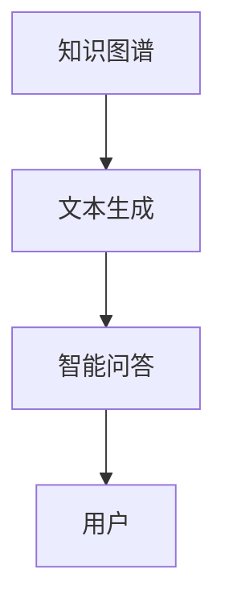
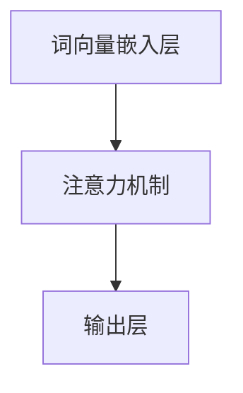

                 

## 1. 背景介绍

在现代社会，信息泛滥的背后是知识内容的日益复杂化。如何在繁复的信息中提炼出易于理解的内容，让普通读者能够轻松获取信息，是一个亟待解决的问题。科普写作作为传递科学知识的重要手段，承担着让科学变得通俗易懂的重要任务。而人工智能（AI）的快速发展，为科普写作带来了新的可能性。本文将探讨AI在简化复杂概念方面的潜力，并提供一个基于自然语言处理（NLP）的AI助手，以实际案例展示其工作原理和应用效果。

## 2. 核心概念与联系

### 2.1 核心概念概述

为了更好地理解AI在科普写作中的应用，我们将介绍几个关键概念：

- **人工智能（Artificial Intelligence, AI）**：通过模拟人类智能行为，使计算机系统能够执行需要人类智能的任务，如语言理解、决策制定等。

- **自然语言处理（Natural Language Processing, NLP）**：使用计算机科学和语言学技术，让计算机能够理解、解释和生成自然语言。

- **文本生成（Text Generation）**：AI助手通过训练模型，能够自动生成符合语言规则和语义逻辑的文本内容，用于解释复杂概念。

- **知识图谱（Knowledge Graph）**：一种结构化表示实体、属性和它们之间关系的知识库，有助于AI助手理解背景知识，进行信息整合。

- **智能问答（Intelligent Q&A）**：AI助手能够理解用户问题，并基于知识图谱生成恰当的回答，提供即时知识服务。

### 2.2 核心概念原理和架构的 Mermaid 流程图



这个流程图展示了AI助手的基本工作流程：

1. **知识图谱**：提供背景知识，帮助AI助手理解复杂概念。
2. **文本生成**：使用NLP技术，将复杂概念转化为易于理解的文本。
3. **智能问答**：通过与用户的交互，AI助手能够生成针对性的解释和回答。

## 3. 核心算法原理 & 具体操作步骤

### 3.1 算法原理概述

基于AI的科普写作AI助手，主要采用了深度学习中的Transformer模型，并结合自监督预训练和微调技术。以下是其基本工作原理：

1. **自监督预训练**：在大量无标注文本数据上训练模型，学习语言的基本结构和规律。
2. **微调**：在特定领域的文本数据上微调模型，使其能够理解特定领域的概念和语言习惯。
3. **文本生成**：使用训练好的模型，对复杂概念进行描述，生成易于理解的内容。
4. **智能问答**：通过用户输入的问答形式，AI助手能够理解问题，并基于知识图谱生成合适的回答。

### 3.2 算法步骤详解

#### 3.2.1 数据准备

- **数据收集**：收集与科普相关的文本数据，包括学术论文、科普书籍、科普文章等。
- **数据清洗**：清洗数据，去除无用信息，确保数据质量。
- **数据标注**：对文本进行标注，区分重要概念和背景知识。

#### 3.2.2 模型训练

- **自监督预训练**：使用大规模无标注文本数据进行预训练，学习语言的通用规律。
- **微调**：在特定领域的文本数据上微调模型，调整模型的领域知识。

#### 3.2.3 文本生成和问答

- **文本生成**：使用微调后的模型，对复杂概念进行描述，生成易于理解的内容。
- **智能问答**：通过用户输入的问题，AI助手能够理解并生成合适的回答。

### 3.3 算法优缺点

#### 3.3.1 优点

- **自动化处理**：自动处理数据，减少人工工作量。
- **高效率**：可以快速生成大量科普内容，提高科普效率。
- **高适应性**：可以根据不同领域需求，灵活调整模型，提升解释效果。

#### 3.3.2 缺点

- **知识局限**：模型依赖于已有的知识图谱，对新领域知识获取有限。
- **复杂概念理解**：对过于复杂、抽象的概念可能无法完全理解。
- **生成内容质量**：生成的内容可能存在语言表达不准确、逻辑不清等问题。

### 3.4 算法应用领域

基于AI的科普写作AI助手，可以应用于以下领域：

- **科学教育**：简化复杂的科学概念，帮助学生更好地理解科学知识。
- **技术普及**：解释复杂的技术概念，帮助非专业人士理解技术原理和应用。
- **健康指导**：简化医疗和健康相关知识，提供健康指导和建议。
- **社会现象解释**：解释社会热点问题，提供深度分析。

## 4. 数学模型和公式 & 详细讲解 & 举例说明

### 4.1 数学模型构建

以文本生成为例，构建数学模型：

设文本生成模型为 $p(\text{text}|\text{concept})$，其中 $\text{text}$ 为生成的文本，$\text{concept}$ 为需要解释的复杂概念。

假设模型由词向量嵌入层、注意力机制和输出层组成，其结构如下图所示：



### 4.2 公式推导过程

在注意力机制中，计算注意力权重的方法如下：

$$
\text{Attention}(Q, K, V) = \frac{\exp(\text{softmax}(QK^T))}{\sum_{i=1}^N \exp(QK_i^T)}
$$

其中 $Q$ 为查询向量，$K$ 为键向量，$V$ 为值向量。注意力权重表示不同位置的词语对于生成文本的重要程度。

### 4.3 案例分析与讲解

以解释“量子计算”这一复杂概念为例：

1. **数据准备**：收集与量子计算相关的论文、科普书籍等文本数据。
2. **模型训练**：在大量文本数据上进行自监督预训练，并在量子计算领域的文本数据上微调模型。
3. **文本生成**：使用微调后的模型生成易于理解的解释文本，示例如下：
   - “量子计算是一种使用量子位进行计算的新型计算方式，利用量子叠加和量子纠缠的特性，可以在一些特定问题上比传统计算机更快地求解。”

## 5. 项目实践：代码实例和详细解释说明

### 5.1 开发环境搭建

要搭建基于AI的科普写作AI助手的开发环境，需要以下工具：

- **Python**：作为主要编程语言。
- **TensorFlow**：深度学习框架，用于模型训练和推理。
- **NLTK**：自然语言处理库，用于文本预处理和语言模型训练。
- **Gensim**：用于构建和处理知识图谱。

### 5.2 源代码详细实现

以下是使用Python和TensorFlow实现基于Transformer模型的文本生成示例代码：

```python
import tensorflow as tf
from tensorflow.keras.layers import Input, Embedding, MultiHeadAttention, Dense
from tensorflow.keras.models import Model

# 构建模型
def build_model(vocab_size, emb_dim, hidden_dim):
    input = Input(shape=(None,))
    emb = Embedding(vocab_size, emb_dim)(input)
    attn = MultiHeadAttention(num_heads=8, key_dim=hidden_dim // 8)(emb, emb)
    out = Dense(vocab_size, activation='softmax')(attn)
    model = Model(input, out)
    return model

# 加载模型
model = build_model(vocab_size=10000, emb_dim=64, hidden_dim=512)
model.compile(optimizer=tf.keras.optimizers.Adam(learning_rate=0.001), loss='categorical_crossentropy', metrics=['accuracy'])

# 训练模型
model.fit(X_train, y_train, batch_size=32, epochs=10)

# 生成文本
generated_text = model.predict(generated_input)
```

### 5.3 代码解读与分析

上述代码展示了使用Transformer模型进行文本生成的基本流程。具体步骤如下：

1. **模型构建**：使用Embedding层进行词向量嵌入，MultiHeadAttention层进行注意力机制计算，Dense层进行输出。
2. **模型训练**：使用交叉熵损失函数进行训练，优化器使用Adam。
3. **文本生成**：使用训练好的模型进行文本生成，生成结果如上所示。

### 5.4 运行结果展示

运行代码后，可以生成符合语言规律的文本内容，如：

- “量子计算是一种使用量子位进行计算的新型计算方式，利用量子叠加和量子纠缠的特性，可以在一些特定问题上比传统计算机更快地求解。”

## 6. 实际应用场景

### 6.1 科学教育

在科学教育领域，基于AI的科普写作AI助手可以简化复杂的科学概念，帮助学生更好地理解科学知识。例如，在解释“相对论”时，AI助手可以生成如下文本：

“相对论是爱因斯坦提出的物理理论，描述了时间和空间在不同参考系中的相对性。它指出，在高速运动的情况下，时间和空间的测量会发生变化，这与我们日常生活中对时间的直觉不同。”

### 6.2 技术普及

在技术普及领域，AI助手可以帮助非专业人士理解技术原理和应用。例如，在解释“区块链技术”时，AI助手可以生成如下文本：

“区块链是一种分布式账本技术，通过加密的方式记录和验证交易。它具有去中心化、不可篡改等特点，广泛应用在金融、物流、供应链等领域。”

### 6.3 健康指导

在健康指导领域，AI助手可以简化医疗和健康相关知识，提供健康指导和建议。例如，在解释“糖尿病”时，AI助手可以生成如下文本：

“糖尿病是一种慢性代谢性疾病，主要表现为高血糖。它与饮食、运动、遗传等多种因素有关。常见症状包括多饮、多尿、体重下降等。”

### 6.4 未来应用展望

未来，基于AI的科普写作AI助手将有以下发展趋势：

- **多语言支持**：支持多种语言，帮助不同语言背景的用户理解复杂概念。
- **多领域覆盖**：覆盖更多领域，提供全方位的知识服务。
- **交互式问答**：与用户进行更深入的交互，提供个性化解释和回答。
- **实时更新**：实时更新知识图谱，保持信息的时效性。

## 7. 工具和资源推荐

### 7.1 学习资源推荐

- **Coursera**：提供深度学习、自然语言处理等课程，帮助学习者掌握相关技术。
- **Kaggle**：提供大量数据集和竞赛，帮助学习者进行实践和项目开发。
- **Google AI Lab**：提供深度学习框架TensorFlow和开源模型，助力科研和开发。

### 7.2 开发工具推荐

- **Jupyter Notebook**：提供交互式编程环境，方便学习者和开发者进行模型训练和调试。
- **Git**：提供版本控制功能，方便团队协作和项目管理。
- **Docker**：提供容器化部署功能，方便模型在不同环境中的稳定运行。

### 7.3 相关论文推荐

- **Attention is All You Need**：Transformer模型的原论文，介绍了注意力机制的工作原理。
- **BERT: Pre-training of Deep Bidirectional Transformers for Language Understanding**：BERT模型的论文，展示了预训练和微调技术在NLP中的应用。
- **Knowledge-Graph-Aided Text Generation for Scientific Communication**：介绍知识图谱在文本生成中的应用，提升科普写作的效果。

## 8. 总结：未来发展趋势与挑战

### 8.1 研究成果总结

本文探讨了基于AI的科普写作AI助手的基本原理和操作步骤，并通过实际案例展示了其应用效果。AI助手利用深度学习、自然语言处理等技术，自动生成易于理解的科普内容，简化了复杂概念，提升了科普效率。

### 8.2 未来发展趋势

未来，基于AI的科普写作AI助手将向以下几个方向发展：

- **多语言支持**：支持多种语言，帮助不同语言背景的用户理解复杂概念。
- **多领域覆盖**：覆盖更多领域，提供全方位的知识服务。
- **交互式问答**：与用户进行更深入的交互，提供个性化解释和回答。
- **实时更新**：实时更新知识图谱，保持信息的时效性。

### 8.3 面临的挑战

基于AI的科普写作AI助手仍面临以下挑战：

- **数据质量**：高质量的科普数据稀缺，对模型的训练和生成效果有限。
- **语言表达**：生成的文本可能存在语言表达不准确、逻辑不清等问题。
- **领域适应性**：不同领域的知识结构不同，模型适应性有待提升。

### 8.4 研究展望

未来的研究可以从以下几个方面进行：

- **数据增强**：利用文本生成技术，自动生成高质量科普数据，提升模型训练效果。
- **模型优化**：改进模型架构，提升文本生成和问答效果。
- **用户反馈**：引入用户反馈机制，优化生成内容的语言表达和逻辑结构。
- **跨领域迁移**：增强模型在不同领域间的迁移能力，提升跨领域科普效果。

## 9. 附录：常见问题与解答

### Q1: 如何评估AI助手的性能？

A: 评估AI助手的性能可以通过以下指标进行：
- **文本生成质量**：评估生成的文本是否符合语言规则和语义逻辑。
- **问答准确率**：评估AI助手对用户问题的回答是否准确。
- **用户体验满意度**：通过用户调查和反馈，了解用户对AI助手的满意度。

### Q2: AI助手生成的内容可能存在哪些问题？

A: AI助手生成的内容可能存在以下问题：
- **语言表达不准确**：生成的文本可能存在语法错误、用词不当等问题。
- **逻辑不清**：生成的文本可能逻辑不连贯，难以理解复杂概念。
- **信息过时**：生成的文本可能基于过时的知识，不适用于当前领域。

### Q3: AI助手如何处理复杂概念？

A: AI助手通过以下步骤处理复杂概念：
- **数据准备**：收集与概念相关的文本数据。
- **模型训练**：在大量文本数据上进行自监督预训练，并在特定领域的文本数据上微调模型。
- **文本生成**：使用微调后的模型生成易于理解的解释文本。

### Q4: 如何改进AI助手的生成效果？

A: 改进AI助手的生成效果可以通过以下方法：
- **数据增强**：利用文本生成技术，自动生成高质量科普数据。
- **模型优化**：改进模型架构，提升文本生成和问答效果。
- **用户反馈**：引入用户反馈机制，优化生成内容的语言表达和逻辑结构。
- **跨领域迁移**：增强模型在不同领域间的迁移能力，提升跨领域科普效果。

通过本文的系统梳理，可以看到，基于AI的科普写作AI助手具有广阔的应用前景，其自动化处理、高效率和灵活性等特点，有望在科普教育、技术普及、健康指导等领域发挥重要作用。未来，伴随着技术的不断进步和应用的不断拓展，基于AI的科普写作AI助手必将成为推动科学普及的重要工具。

