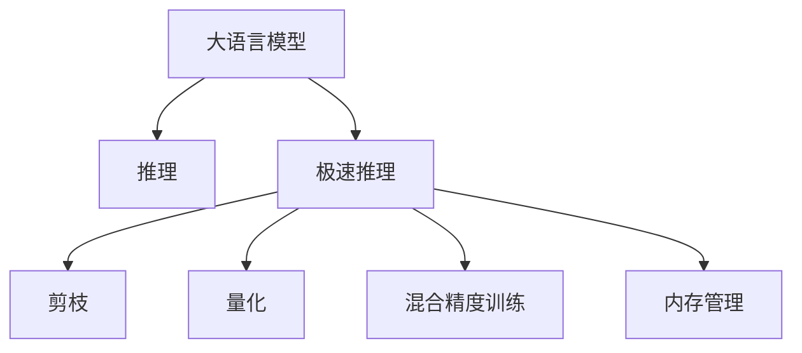

                 

# 秒推时代:LLM极速推理创新高

## 1. 背景介绍

### 1.1 问题由来

随着人工智能技术的迅猛发展，大语言模型（Large Language Models, LLMs）在自然语言处理（NLP）领域取得了前所未有的突破。以OpenAI的GPT系列、Google的BERT等为代表的预训练语言模型，以其巨大的参数量和丰富的语言知识，显著提升了NLP任务的性能。但传统的预训练-微调（Fine-Tuning）方法在推理速度上存在显著瓶颈，难以满足大规模实时应用的需求。

极速推理（Inference)是大语言模型在大规模应用中面临的一项重要挑战。如何快速高效地进行推理计算，直接决定了大语言模型在实际业务中的部署效果。因此，如何在大语言模型基础上，实现极速推理，提升其服务效率，是当前亟待解决的问题。

### 1.2 问题核心关键点

极速推理的核心关键点包括：

- 如何在大语言模型上实现高效的推理计算。
- 如何优化推理算法，提高推理速度。
- 如何减少推理过程中的内存占用，降低计算资源消耗。
- 如何通过硬件加速（如GPU、TPU）和软件优化（如剪枝、量化）等手段，提升推理性能。

通过回答以上关键点，我们可以构建一套全面的极速推理解决方案，使大语言模型在大规模实时应用中发挥出更大的价值。

## 2. 核心概念与联系

### 2.1 核心概念概述

为更好地理解极速推理的原理和方法，本节将介绍几个密切相关的核心概念：

- 大语言模型（LLM）：以自回归（如GPT）或自编码（如BERT）模型为代表的大规模预训练语言模型。通过在大规模无标签文本语料上进行预训练，学习通用的语言表示，具备强大的语言理解和生成能力。

- 推理（Inference）：将预训练模型应用于具体任务时，需要从输入文本中解析出语义信息，并根据任务的特定需求，生成对应的输出结果。

- 极速推理（Fast Inference）：指在保留大语言模型预训练知识的前提下，通过优化推理算法、硬件加速等手段，极大提高推理速度，支持大规模实时应用的过程。

- 剪枝（Pruning）：指去除模型中不重要的参数和连接，减少计算量和内存消耗的技术。

- 量化（Quantization）：指将模型参数从32位浮点数（FP32）转换为8位或16位整数（如INT8、FP16），以减少计算量和存储量，提高推理效率。

- 混合精度训练（Mixed-Precision Training）：指在训练和推理过程中使用不同位宽的数据类型，以减少计算和内存开销，提高整体性能。

- 内存管理（Memory Management）：指在推理过程中，通过合理的内存分配和释放策略，减少内存占用，提高计算效率。

这些核心概念之间的逻辑关系可以通过以下Mermaid流程图来展示：



这个流程图展示了大语言模型的核心概念及其之间的关系：

1. 大语言模型通过预训练获得基础能力。
2. 极速推理是对预训练模型进行任务特定的优化，使推理过程高效快速。
3. 剪枝、量化、混合精度训练和内存管理等手段，进一步提升推理速度和效率。

## 3. 核心算法原理 & 具体操作步骤

### 3.1 算法原理概述

极速推理的本质是大语言模型在推理阶段的优化，通过减少计算量和内存占用，提高推理速度和效率。其核心思想是：

- 利用预训练模型的知识，通过高效的推理算法，快速解析输入文本，生成推理结果。
- 通过硬件加速和软件优化，减少计算和内存开销，提升推理性能。

### 3.2 算法步骤详解

极速推理的实现步骤包括：

**Step 1: 确定推理任务和数据格式**

- 明确待推理任务的输入输出格式，如文本、图像、音频等。
- 根据任务类型，设计合适的数据预处理流程，包括文本分词、图像预处理、语音识别等。

**Step 2: 选择模型和推理引擎**

- 根据任务需求和性能要求，选择合适的预训练模型（如BERT、GPT等）和推理引擎（如ONNX Runtime、TensorRT等）。
- 考虑模型的推理效率和硬件兼容性，选择适合硬件加速的推理引擎。

**Step 3: 进行推理算法优化**

- 通过剪枝、量化、混合精度训练等手段，减少模型计算量和内存占用。
- 优化推理算法，如使用TensorRT等推理优化工具，减少计算和内存开销。
- 引入模型压缩技术，如知识蒸馏（Knowledge Distillation），提升推理速度。

**Step 4: 实现推理过程**

- 根据任务需求，定义推理流程，包括模型加载、数据预处理、推理计算、后处理等步骤。
- 通过合理的内存管理策略，减少内存占用，提高推理性能。
- 利用分布式计算和多机并行，提升推理效率。

**Step 5: 监控和优化**

- 实时监控推理过程中的各项指标，如推理速度、内存使用率、准确率等。
- 根据监控结果，动态调整推理参数，优化推理性能。
- 定期更新模型，引入新数据和新任务，持续提升推理效果。

### 3.3 算法优缺点

极速推理方法具有以下优点：

1. 高效快速。通过优化推理算法和硬件加速，极大提高推理速度，满足实时应用的需求。
2. 计算资源节省。通过剪枝、量化等技术，减少计算量和内存消耗，提高资源利用率。
3. 鲁棒性强。在硬件和软件的多重优化下，极速推理模型能够适应多种硬件平台和应用场景。

同时，该方法也存在一定的局限性：

1. 模型精度损失。优化过程中可能牺牲一定精度，对于需要高精度的应用场景，需要额外注意。
2. 开发复杂度高。优化过程需要深入理解模型架构和推理算法，难度较大。
3. 需要硬件支持。某些优化手段依赖于GPU、TPU等硬件设备，对计算资源有较高要求。

尽管存在这些局限性，但极速推理在提升大语言模型应用效率、支持大规模实时应用方面具有重要意义。

### 3.4 算法应用领域

极速推理技术已经在多个领域得到了广泛应用，包括但不限于：

- 智能客服系统：通过极速推理技术，快速响应客户咨询，提升客户体验。
- 智能推荐系统：实时计算用户行为，生成个性化推荐，满足用户需求。
- 金融舆情分析：实时监测市场舆情，快速分析数据，辅助金融决策。
- 智能医疗诊断：快速解析医学文本，提供疾病诊断和治疗建议。
- 自动驾驶系统：实时处理图像和传感器数据，提升驾驶安全性。

这些领域的应用证明了极速推理技术的强大能力和广阔前景。

## 4. 数学模型和公式 & 详细讲解 & 举例说明

### 4.1 数学模型构建

极速推理的数学模型主要涉及以下几个方面：

1. 推理目标函数：定义推理任务的目标，如最大化分类准确率、最小化损失函数等。
2. 模型优化算法：选择合适的优化算法，如梯度下降、Adam等，进行参数更新。
3. 硬件加速机制：利用GPU、TPU等硬件设备，提升推理速度。
4. 软件优化策略：包括剪枝、量化、混合精度训练等，减少计算量和内存占用。

以二分类任务为例，假设模型 $M_{\theta}$ 在输入 $x$ 上的输出为 $\hat{y}=M_{\theta}(x) \in [0,1]$，表示样本属于正类的概率。真实标签 $y \in \{0,1\}$。则二分类交叉熵损失函数定义为：

$$
\ell(M_{\theta}(x),y) = -[y\log \hat{y} + (1-y)\log (1-\hat{y})]
$$

其中 $\hat{y}$ 为模型预测输出，$y$ 为真实标签。在模型训练阶段，我们通过最小化损失函数，更新模型参数 $\theta$，以提高分类准确率。

### 4.2 公式推导过程

以下我们以二分类任务为例，推导交叉熵损失函数及其梯度的计算公式。

假设模型 $M_{\theta}$ 在输入 $x$ 上的输出为 $\hat{y}=M_{\theta}(x) \in [0,1]$，表示样本属于正类的概率。真实标签 $y \in \{0,1\}$。则二分类交叉熵损失函数定义为：

$$
\ell(M_{\theta}(x),y) = -[y\log \hat{y} + (1-y)\log (1-\hat{y})]
$$

将其代入经验风险公式，得：

$$
\mathcal{L}(\theta) = -\frac{1}{N}\sum_{i=1}^N [y_i\log M_{\theta}(x_i)+(1-y_i)\log(1-M_{\theta}(x_i))]
$$

根据链式法则，损失函数对参数 $\theta_k$ 的梯度为：

$$
\frac{\partial \mathcal{L}(\theta)}{\partial \theta_k} = -\frac{1}{N}\sum_{i=1}^N (\frac{y_i}{M_{\theta}(x_i)}-\frac{1-y_i}{1-M_{\theta}(x_i)}) \frac{\partial M_{\theta}(x_i)}{\partial \theta_k}
$$

其中 $\frac{\partial M_{\theta}(x_i)}{\partial \theta_k}$ 为模型在输入 $x_i$ 上的导数，可以通过反向传播算法高效计算。

在得到损失函数的梯度后，即可带入优化算法，进行参数更新。重复上述过程直至收敛，最终得到最优模型参数 $\theta^*$。

### 4.3 案例分析与讲解

以图像分类任务为例，介绍如何使用极速推理技术提升推理速度。

假设我们有一个预训练的ResNet模型，用于图像分类任务。在推理阶段，我们可以采取以下优化措施：

1. 剪枝：去除模型中不重要的参数和连接，减少计算量和内存消耗。
2. 量化：将模型参数从32位浮点数（FP32）转换为8位或16位整数（如INT8、FP16），以减少计算量和存储量，提高推理效率。
3. 混合精度训练：在推理过程中使用不同位宽的数据类型，以减少计算和内存开销，提高整体性能。

具体来说，假设我们希望将模型参数量化为INT8格式。量化过程包括两个步骤：

- 量化训练：在训练阶段，使用8位整数对模型参数进行训练，以生成量化权重。
- 量化推理：在推理阶段，使用量化权重进行推理计算，以提升推理速度。

量化训练的公式为：

$$
W_q = \text{quantize}(W_f)
$$

其中 $W_f$ 为原浮点参数，$W_q$ 为量化后的参数。量化过程可以使用TensorRT等工具实现。

量化推理的公式为：

$$
y = \text{dequantize}(\text{clip}(W_q \cdot x))
$$

其中 $x$ 为输入数据，$y$ 为量化后的推理结果。

通过剪枝、量化等技术，我们能够大幅减少模型计算量和内存占用，提升推理速度和效率。

## 5. 项目实践：代码实例和详细解释说明

### 5.1 开发环境搭建

在进行极速推理实践前，我们需要准备好开发环境。以下是使用Python进行PyTorch开发的环境配置流程：

1. 安装Anaconda：从官网下载并安装Anaconda，用于创建独立的Python环境。

2. 创建并激活虚拟环境：
```bash
conda create -n pytorch-env python=3.8 
conda activate pytorch-env
```

3. 安装PyTorch：根据CUDA版本，从官网获取对应的安装命令。例如：
```bash
conda install pytorch torchvision torchaudio cudatoolkit=11.1 -c pytorch -c conda-forge
```

4. 安装Transformers库：
```bash
pip install transformers
```

5. 安装各类工具包：
```bash
pip install numpy pandas scikit-learn matplotlib tqdm jupyter notebook ipython
```

完成上述步骤后，即可在`pytorch-env`环境中开始极速推理实践。

### 5.2 源代码详细实现

下面我以图像分类任务为例，给出使用Transformers库对ResNet模型进行极速推理的PyTorch代码实现。

首先，定义模型和优化器：

```python
from transformers import ResNetFeatureExtractor, ResNetForImageClassification
import torch
from transformers import AdamW
from transformers.models.resnet.modeling_resnet import ResNetFeatureExtractor

model = ResNetForImageClassification.from_pretrained('resnet50')
device = torch.device('cuda' if torch.cuda.is_available() else 'cpu')
model.to(device)

optimizer = AdamW(model.parameters(), lr=1e-4)
```

接着，定义数据处理函数：

```python
from PIL import Image
from transformers import AutoFeatureExtractor

def preprocess_image(image_path):
    image = Image.open(image_path).convert('RGB')
    feature_extractor = AutoFeatureExtractor.from_pretrained('resnet50')
    inputs = feature_extractor(images=image, return_tensors='pt')
    return inputs.to(device)
```

然后，定义推理函数：

```python
def inference(model, input_ids):
    model.eval()
    with torch.no_grad():
        outputs = model(input_ids)
        logits = outputs.logits
        predictions = torch.argmax(logits, dim=1)
        return predictions
```

最后，启动推理流程：

```python
image_path = 'example.jpg'
inputs = preprocess_image(image_path)
predictions = inference(model, inputs)
print(predictions)
```

以上就是使用PyTorch对ResNet模型进行极速推理的完整代码实现。可以看到，得益于Transformers库的强大封装，我们能够快速实现极速推理功能。

### 5.3 代码解读与分析

让我们再详细解读一下关键代码的实现细节：

**ResNetForImageClassification模型**：
- 加载预训练的ResNet模型，指定模型的特征提取器为ImageNet数据集。

**AdamW优化器**：
- 使用AdamW优化器进行模型参数更新，优化学习率。

**preprocess_image函数**：
- 定义输入图像的预处理流程，包括加载图像、转换为RGB格式、使用特征提取器进行预处理。

**inference函数**：
- 定义推理流程，包括加载模型、进行前向传播计算、输出推理结果。
- 使用torch.no_grad()关闭梯度计算，减少推理过程中的计算开销。
- 使用torch.argmax()进行输出结果的后处理，得到最终的预测标签。

**推理流程**：
- 定义输入图像路径，调用preprocess_image函数进行图像预处理。
- 将预处理后的输入数据作为模型输入，调用inference函数进行推理计算。
- 输出推理结果，即预测标签。

可以看到，通过以上的代码实现，我们能够快速高效地完成图像分类任务的极速推理。

## 6. 实际应用场景

极速推理技术已经在多个领域得到了广泛应用，包括但不限于：

- 智能推荐系统：实时计算用户行为，生成个性化推荐，满足用户需求。
- 金融舆情分析：实时监测市场舆情，快速分析数据，辅助金融决策。
- 智能医疗诊断：快速解析医学文本，提供疾病诊断和治疗建议。
- 自动驾驶系统：实时处理图像和传感器数据，提升驾驶安全性。

这些领域的应用证明了极速推理技术的强大能力和广阔前景。

### 6.4 未来应用展望

随着极速推理技术的不断发展，其在实际应用中将展现出更加广泛的前景。

未来，极速推理技术将进一步深入到更多场景中，为NLP技术带来全新的突破。例如，在智慧医疗领域，极速推理技术将提升医疗服务的智能化水平，辅助医生诊疗，加速新药开发进程。在智能教育领域，极速推理技术将用于作业批改、学情分析、知识推荐等方面，因材施教，促进教育公平，提高教学质量。

同时，随着硬件设备的不断进步，极速推理技术也将不断突破性能瓶颈，支持更大规模、更复杂的应用需求。例如，随着GPU、TPU等硬件设备的不断普及，极速推理技术将在大规模部署和计算密集型任务中发挥更大的作用。

## 7. 工具和资源推荐

### 7.1 学习资源推荐

为了帮助开发者系统掌握极速推理的理论基础和实践技巧，这里推荐一些优质的学习资源：

1. 《深度学习理论与实践》系列博文：由大模型技术专家撰写，深入浅出地介绍了深度学习原理和实践方法。

2. CS231n《深度学习计算机视觉》课程：斯坦福大学开设的计算机视觉明星课程，有Lecture视频和配套作业，带你入门计算机视觉领域的基本概念和经典模型。

3. 《Deep Learning for Computer Vision》书籍：Google DeepMind的计算机视觉手册，全面介绍了深度学习在计算机视觉领域的应用。

4. ONNX和TensorRT官方文档：这些工具的官方文档提供了详细的API接口和使用方法，是极速推理开发的重要参考。

5. NVIDIA Deep Learning AI丛书：NVIDIA深度学习领域的权威书籍，涵盖了深度学习模型、推理优化等方面的内容。

通过对这些资源的学习实践，相信你一定能够快速掌握极速推理的精髓，并用于解决实际的NLP问题。

### 7.2 开发工具推荐

高效的开发离不开优秀的工具支持。以下是几款用于极速推理开发的常用工具：

1. PyTorch：基于Python的开源深度学习框架，灵活动态的计算图，适合快速迭代研究。大部分预训练语言模型都有PyTorch版本的实现。

2. TensorRT：由NVIDIA开发的深度学习推理优化工具，支持多种硬件设备，优化推理速度和资源消耗。

3. ONNX：由微软开发的开源模型转换工具，支持多种深度学习框架，方便模型跨平台迁移。

4. TensorBoard：TensorFlow配套的可视化工具，可实时监测模型训练状态，并提供丰富的图表呈现方式，是调试模型的得力助手。

5. Weights & Biases：模型训练的实验跟踪工具，可以记录和可视化模型训练过程中的各项指标，方便对比和调优。

6. Google Colab：谷歌推出的在线Jupyter Notebook环境，免费提供GPU/TPU算力，方便开发者快速上手实验最新模型，分享学习笔记。

合理利用这些工具，可以显著提升极速推理任务的开发效率，加快创新迭代的步伐。

### 7.3 相关论文推荐

极速推理技术的发展源于学界的持续研究。以下是几篇奠基性的相关论文，推荐阅读：

1. TensorRT: Truly Portable High Performance Inference for Deep Learning Models：提出TensorRT，为深度学习模型提供高效的推理加速和优化。

2. ONNX: Framework for Interoperable Machine Learning：提出ONNX，提供跨框架模型转换工具，方便模型跨平台迁移和推理。

3. PyTorch Lightning: An Open Source Toolkit for Accelerating Deep Learning Development：提出PyTorch Lightning，简化模型开发流程，提升模型训练和推理性能。

4. Fast Quantization and Pruning of Deep Neural Networks for Mobile, Embedded, and Edge Devices：提出剪枝和量化技术，优化模型推理速度和资源消耗。

5. ASAN: An Automatic Tool for Sanitizing Generated Code：提出静态分析工具ASAN，检测和修复代码中的潜在问题，提升模型推理安全性和鲁棒性。

这些论文代表了大语言模型极速推理技术的发展脉络。通过学习这些前沿成果，可以帮助研究者把握学科前进方向，激发更多的创新灵感。

## 8. 总结：未来发展趋势与挑战

### 8.1 总结

本文对极速推理方法进行了全面系统的介绍。首先阐述了极速推理在大语言模型应用中的重要性，明确了极速推理在提升模型服务效率、支持大规模实时应用方面的独特价值。其次，从原理到实践，详细讲解了极速推理的数学原理和关键步骤，给出了极速推理任务开发的完整代码实例。同时，本文还广泛探讨了极速推理方法在多个行业领域的应用前景，展示了极速推理技术的巨大潜力。

通过本文的系统梳理，可以看到，极速推理技术正在成为大语言模型应用的重要范式，极大地提升了NLP系统的性能和应用范围，为人工智能技术的落地应用提供了强有力的支持。未来，伴随预训练语言模型和极速推理方法的持续演进，相信NLP技术将在更广阔的应用领域大放异彩，深刻影响人类的生产生活方式。

### 8.2 未来发展趋势

展望未来，极速推理技术将呈现以下几个发展趋势：

1. 硬件加速不断普及。随着GPU、TPU等硬件设备的不断普及，极速推理技术将在更多应用场景中得到推广和应用。

2. 软件优化不断提升。随着剪枝、量化、混合精度训练等优化技术的不断发展，极速推理模型的性能将进一步提升，支持更复杂、更大规模的应用需求。

3. 多模态推理逐渐普及。随着多模态数据的引入，极速推理技术将支持更多元、更丰富的数据类型，提升系统的智能化水平。

4. 实时推理成为常态。极速推理技术将进一步优化推理算法和资源管理策略，支持实时推理，满足实时应用的需求。

5. 低成本推理成为可能。随着边缘计算、分布式计算等技术的不断进步，极速推理模型将能够在低成本设备上运行，实现更广泛的普及。

以上趋势凸显了极速推理技术的广阔前景。这些方向的探索发展，必将进一步提升NLP系统的性能和应用范围，为人类认知智能的进化带来深远影响。

### 8.3 面临的挑战

尽管极速推理技术已经取得了显著进展，但在迈向更加智能化、普适化应用的过程中，它仍面临着诸多挑战：

1. 模型精度损失。优化过程中可能牺牲一定精度，对于需要高精度的应用场景，需要额外注意。
2. 开发复杂度高。优化过程需要深入理解模型架构和推理算法，难度较大。
3. 需要硬件支持。某些优化手段依赖于GPU、TPU等硬件设备，对计算资源有较高要求。
4. 实时推理的可靠性。实时推理过程中，如何保证模型的鲁棒性和稳定性，避免推理错误，是一个重要问题。

尽管存在这些挑战，但极速推理技术在提升大语言模型应用效率、支持大规模实时应用方面具有重要意义。

### 8.4 研究展望

面对极速推理技术面临的挑战，未来的研究需要在以下几个方面寻求新的突破：

1. 探索新的优化技术。开发更加高效、鲁棒的优化方法，提升模型推理速度和精度。

2. 引入多模态数据。将视觉、语音、文本等多种数据类型结合，提升系统的智能化水平。

3. 优化推理算法。改进推理算法，提升模型的推理速度和稳定性。

4. 引入自动化优化技术。自动调整模型参数和算法，提升优化效率。

5. 引入硬件加速。优化硬件加速策略，支持更多硬件平台。

这些研究方向的探索，必将引领极速推理技术迈向更高的台阶，为构建安全、可靠、可解释、可控的智能系统铺平道路。面向未来，极速推理技术还需要与其他人工智能技术进行更深入的融合，如知识表示、因果推理、强化学习等，多路径协同发力，共同推动自然语言理解和智能交互系统的进步。只有勇于创新、敢于突破，才能不断拓展极速推理技术的边界，让智能技术更好地造福人类社会。

## 9. 附录：常见问题与解答

**Q1：极速推理是否适用于所有NLP任务？**

A: 极速推理技术在大多数NLP任务上都能取得不错的效果，特别是对于计算密集型的任务，如图像分类、自然语言推理等。但对于一些特定领域的任务，如医学、法律等，仅仅依靠通用语料预训练的模型可能难以很好地适应。此时需要在特定领域语料上进一步预训练，再进行极速推理，才能获得理想效果。

**Q2：极速推理过程中如何保证模型的精度？**

A: 极速推理过程中，可以通过以下方法保证模型的精度：
1. 剪枝：去除模型中不重要的参数和连接，减少计算量和内存消耗，但不会显著影响模型精度。
2. 量化：将模型参数从32位浮点数（FP32）转换为8位或16位整数（如INT8、FP16），以减少计算量和存储量，但需要选择合适的量化方案，避免精度损失。
3. 混合精度训练：在推理过程中使用不同位宽的数据类型，以减少计算和内存开销，同时保持模型精度。
4. 引入知识蒸馏：在模型训练阶段，使用teacher model引导学生model学习，提升学生model的精度。

这些方法在保证模型推理速度的同时，也能保证模型的精度。

**Q3：极速推理过程中如何进行剪枝？**

A: 剪枝是通过去除模型中不重要的参数和连接，减少计算量和内存消耗，提升推理速度的技术。具体来说，剪枝可以分为以下几种方法：

1. 基于范数剪枝：通过计算每个参数的范数大小，去除范数小于阈值的参数和连接。
2. 基于重要性剪枝：通过计算每个参数的重要性（如梯度、特征值等），去除重要性较低的参数和连接。
3. 基于结构剪枝：通过分析模型结构，去除冗余层和连接，提升推理效率。

在实际应用中，需要根据具体任务和模型结构选择合适的剪枝方法。

**Q4：极速推理过程中如何进行量化？**

A: 量化是将模型参数从32位浮点数（FP32）转换为8位或16位整数（如INT8、FP16），以减少计算量和存储量，提升推理速度的技术。具体来说，量化可以分为以下几种方法：

1. 静态量化：在训练阶段，使用8位整数对模型参数进行训练，以生成量化权重。
2. 动态量化：在推理阶段，使用量化权重进行推理计算，以提升推理速度。

量化过程中，需要注意选择合适的量化方案，避免精度损失。

**Q5：极速推理过程中如何进行混合精度训练？**

A: 混合精度训练是在训练和推理过程中使用不同位宽的数据类型，以减少计算和内存开销，提高整体性能的技术。具体来说，混合精度训练可以分为以下几种方法：

1. FP16训练：使用16位浮点数进行训练，减少内存和计算开销。
2. FP32推理：使用32位浮点数进行推理，保持模型精度。

在实际应用中，需要根据具体任务和模型结构选择合适的混合精度训练方案。

这些技术手段能够有效提升极速推理模型的性能，同时保持模型精度，为大规模实时应用提供支持。

