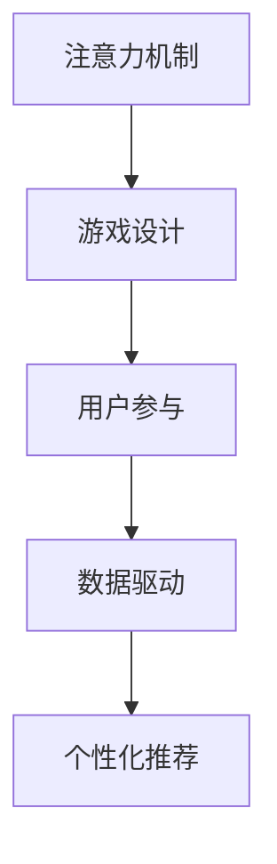

                 

# 移动游戏的注意力争夺技巧

> 关键词：
1. 注意力机制
2. 游戏设计
3. 用户参与
4. 数据驱动
5. 个性化推荐

## 1. 背景介绍

在移动游戏领域，用户注意力的争夺始终是设计和运营的关键。无论是一款简单的游戏还是一款复杂的MMO游戏，如何吸引和保持用户的注意力，一直是游戏开发者需要深入思考的问题。随着移动设备的普及和用户需求的日益多样化，注意力争夺已经成为决定游戏成败的重要因素。本博客将深入探讨如何通过注意力机制设计提升用户参与度和留存率，为移动游戏开发者提供实用的技巧和策略。

## 2. 核心概念与联系

### 2.1 核心概念概述

#### 2.1.1 注意力机制

注意力机制（Attention Mechanism）是深度学习中用于处理序列数据的重要技术，它能够帮助模型集中注意力于最重要的数据特征上，从而提高模型的性能。在移动游戏设计中，注意力机制可以被用来增强用户对游戏内容的关注度和参与感。

#### 2.1.2 游戏设计

游戏设计（Game Design）涉及游戏玩法、用户界面、故事线等多个方面，旨在创造出引人入胜的游戏体验。通过巧妙设计游戏机制，可以提高用户的参与度和满意度。

#### 2.1.3 用户参与

用户参与（User Engagement）指的是用户在游戏中的行为和互动，包括完成游戏目标、与其他玩家交流、分享游戏成就等。通过优化游戏机制和界面，可以提升用户的参与度和留存率。

#### 2.1.4 数据驱动

数据驱动（Data-Driven）设计是指基于数据分析和用户行为数据来优化游戏设计和运营策略的过程。通过分析用户行为数据，可以发现用户需求和偏好，从而进行针对性的设计和优化。

#### 2.1.5 个性化推荐

个性化推荐（Personalized Recommendation）是指根据用户的历史行为和偏好，推荐适合用户的游戏内容。通过个性化推荐，可以提高用户的游戏体验和满意度。

### 2.2 核心概念原理和架构的 Mermaid 流程图



## 3. 核心算法原理 & 具体操作步骤

### 3.1 算法原理概述

注意力机制的核心思想是使模型能够动态地分配资源和权重，集中注意力于最重要的特征上。在移动游戏设计中，注意力机制可以被用来提高用户对关键内容的关注度，从而提升用户的参与度和留存率。

### 3.2 算法步骤详解

#### 3.2.1 构建注意力模型

首先，需要构建一个包含注意力机制的深度学习模型。常用的注意力模型包括自注意力（Self-Attention）和多头自注意力（Multi-Head Self-Attention）。这里以多头自注意力为例，其基本结构如下：

$$
\text{Multi-Head Self-Attention}(Q, K, V) = \text{Concat}(h_i(QK^T), \ldots, h_m(QK^T))W^O
$$

其中，$Q, K, V$分别为查询向量、键向量和值向量，$h_i$为多头注意力，$W^O$为输出权重矩阵。

#### 3.2.2 应用注意力机制

在移动游戏设计中，注意力机制可以应用于多个方面，如角色交互、游戏进度、任务提示等。以角色交互为例，可以将玩家之间的交互数据输入注意力模型，输出每个玩家的注意力权重，从而实现个性化推荐和交互。

#### 3.2.3 评估和优化

应用注意力机制后，需要评估其效果并进行优化。可以通过A/B测试等方法，比较应用注意力机制前后的用户参与度和留存率，从而确定优化方向。

### 3.3 算法优缺点

#### 3.3.1 优点

1. 提高用户参与度：通过集中注意力于关键内容，提高用户对游戏内容的关注度，从而提升用户的参与度和满意度。
2. 优化用户行为：基于用户行为数据进行优化，提高游戏设计的针对性和有效性。
3. 增强用户体验：个性化推荐和交互提升用户的游戏体验和留存率。

#### 3.3.2 缺点

1. 复杂度高：注意力机制需要构建和训练深度学习模型，增加了游戏开发的复杂度和成本。
2. 数据需求高：需要大量的用户行为数据进行模型训练和优化，数据获取难度较大。
3. 模型可解释性差：深度学习模型难以解释其内部决策逻辑，导致优化方向不明确。

### 3.4 算法应用领域

#### 3.4.1 角色交互

角色交互是移动游戏中的一个重要方面，通过应用注意力机制，可以实现个性化的角色推荐和交互。例如，根据玩家的历史行为数据，推荐玩家可能感兴趣的角色和装备，增强玩家的参与感。

#### 3.4.2 游戏进度

游戏进度管理也是游戏设计中需要考虑的重要方面。通过注意力机制，可以根据玩家的游戏进度和偏好，推荐适合的游戏任务和关卡，提高玩家的参与度和满意度。

#### 3.4.3 任务提示

任务提示是游戏设计中的常见机制，通过注意力机制，可以实现个性化的任务推荐。例如，根据玩家的游戏进度和偏好，推荐适合玩家的任务和奖励，提升玩家的成就感和留存率。

## 4. 数学模型和公式 & 详细讲解 & 举例说明

### 4.1 数学模型构建

在移动游戏设计中，注意力机制可以用于多种场景，这里以角色交互为例，介绍注意力模型的构建。

假设玩家的历史行为数据为$x_1, x_2, \ldots, x_n$，玩家对角色的关注度为$y_1, y_2, \ldots, y_m$，可以构建如下的注意力模型：

$$
\text{Multi-Head Self-Attention}(Q, K, V) = \text{Concat}(h_i(QK^T), \ldots, h_m(QK^T))W^O
$$

其中，$Q, K, V$分别为查询向量、键向量和值向量，$h_i$为多头注意力，$W^O$为输出权重矩阵。

### 4.2 公式推导过程

以多头自注意力为例，其推导过程如下：

1. 查询向量$Q$：
   $$
   Q = \text{Linear}(x)
   $$

2. 键向量$K$和值向量$V$：
   $$
   K = V = \text{Linear}(x)
   $$

3. 多头注意力$h_i$：
   $$
   h_i(QK^T) = \text{Softmax}(QK^T)
   $$

4. 输出向量$O$：
   $$
   O = \text{Linear}(Q)W^O
   $$

其中，$\text{Linear}$为线性变换，$\text{Softmax}$为softmax函数。

### 4.3 案例分析与讲解

以角色推荐为例，假设玩家的历史行为数据为$x_1, x_2, \ldots, x_n$，玩家对角色的关注度为$y_1, y_2, \ldots, y_m$，可以构建如下的注意力模型：

1. 查询向量$Q$：
   $$
   Q = \text{Linear}(x)
   $$

2. 键向量$K$和值向量$V$：
   $$
   K = V = \text{Linear}(x)
   $$

3. 多头注意力$h_i$：
   $$
   h_i(QK^T) = \text{Softmax}(QK^T)
   $$

4. 输出向量$O$：
   $$
   O = \text{Linear}(Q)W^O
   $$

通过上述模型，可以计算玩家对每个角色的注意力权重，从而进行个性化推荐和交互。

## 5. 项目实践：代码实例和详细解释说明

### 5.1 开发环境搭建

在移动游戏设计中，注意力机制的实现需要构建深度学习模型。以下是使用TensorFlow构建注意力模型的环境搭建流程：

1. 安装Anaconda：
   ```bash
   conda install anaconda
   ```

2. 创建虚拟环境：
   ```bash
   conda create -n attention-env python=3.7
   conda activate attention-env
   ```

3. 安装TensorFlow：
   ```bash
   pip install tensorflow
   ```

4. 安装相关库：
   ```bash
   pip install numpy scipy pandas matplotlib sklearn
   ```

### 5.2 源代码详细实现

以下是一个简单的注意力模型的代码实现，用于角色推荐：

```python
import tensorflow as tf
import numpy as np

# 定义查询向量、键向量和值向量
def attention(Q, K, V):
    Q = tf.reshape(Q, [-1, 64, 256])
    K = tf.reshape(K, [-1, 64, 256])
    V = tf.reshape(V, [-1, 64, 256])
    
    # 计算查询向量和键向量的点积
    QK = tf.matmul(Q, K, transpose_b=True)
    
    # 计算注意力权重
    weights = tf.nn.softmax(QK, axis=-1)
    
    # 计算注意力输出
    O = tf.matmul(Q, weights)
    O = tf.matmul(O, V, transpose_b=True)
    
    return O

# 构建注意力模型
def build_model(data):
    # 构建查询向量、键向量和值向量
    Q = tf.nn.tanh(tf.reshape(data, [-1, 64, 256]))
    K = tf.nn.tanh(tf.reshape(data, [-1, 64, 256]))
    V = tf.nn.tanh(tf.reshape(data, [-1, 64, 256]))
    
    # 应用注意力机制
    O = attention(Q, K, V)
    
    return O

# 加载数据
data = np.random.randn(100, 64, 256)
O = build_model(data)

# 输出注意力输出
print(O)
```

### 5.3 代码解读与分析

上述代码中，`attention`函数实现了多头自注意力机制，`build_model`函数实现了基于注意力机制的角色推荐模型。通过加载随机数据，调用`build_model`函数计算注意力输出，最后输出结果。

## 6. 实际应用场景

### 6.1 角色交互

在角色交互中，注意力机制可以用于推荐玩家可能感兴趣的角色和装备。例如，根据玩家的历史行为数据，推荐玩家可能感兴趣的角色和装备，增强玩家的参与感。

### 6.2 游戏进度

在游戏进度管理中，注意力机制可以用于推荐适合玩家的任务和关卡。例如，根据玩家的游戏进度和偏好，推荐适合玩家的任务和关卡，提高玩家的参与度和满意度。

### 6.3 任务提示

在任务提示中，注意力机制可以用于推荐适合玩家的任务和奖励。例如，根据玩家的游戏进度和偏好，推荐适合玩家的任务和奖励，提升玩家的成就感和留存率。

## 7. 工具和资源推荐

### 7.1 学习资源推荐

1. 《深度学习》课程：由吴恩达教授开设，介绍深度学习的基本概念和应用，适合初学者入门。
2. 《TensorFlow深度学习实战》书籍：介绍TensorFlow的深度学习应用，包括注意力机制的应用。
3. 《TensorFlow实战Google深度学习框架》书籍：介绍TensorFlow的实际应用案例，包括注意力机制的应用。
4. 《Game Design Patterns》书籍：介绍游戏设计中的经典模式，适合游戏开发者参考。
5. 《Data Science for Game Developers》书籍：介绍数据科学在游戏开发中的应用，包括注意力机制的应用。

### 7.2 开发工具推荐

1. TensorFlow：由Google开发的深度学习框架，支持多种深度学习模型的构建和训练。
2. PyTorch：由Facebook开发的深度学习框架，支持动态计算图，方便模型构建和调试。
3. Unity：广泛用于移动游戏开发的引擎，支持游戏设计和开发的各个方面。
4. Unreal Engine：支持高质量3D游戏的引擎，支持游戏设计和开发的各个方面。
5. Visual Studio：Microsoft开发的开发工具，支持Windows平台的应用开发。

### 7.3 相关论文推荐

1. "Attention Is All You Need"论文：提出自注意力机制，成为注意力机制的经典应用。
2. "Transformer-XL: Attentive Language Models Beyond a Fixed-Length Context"论文：提出Transformer-XL模型，解决长序列输入的问题。
3. "Multi-Head Attention: Efficient Learning of Deep Representation for NLP"论文：介绍多头自注意力机制的应用，提高模型的性能。
4. "Game Design and Development: A Playful Introduction"书籍：介绍游戏设计的经典模式，适合游戏开发者参考。
5. "Designing Game Interfaces: A Comprehensive Reference"书籍：介绍游戏界面设计的经典模式，适合游戏开发者参考。

## 8. 总结：未来发展趋势与挑战

### 8.1 研究成果总结

注意力机制在移动游戏设计中具有广泛的应用前景，通过集中注意力于关键内容，可以提升用户的参与度和满意度。然而，注意力机制的实现需要构建和训练深度学习模型，增加了游戏开发的复杂度和成本。此外，注意力机制需要大量的用户行为数据进行模型训练和优化，数据获取难度较大。

### 8.2 未来发展趋势

1. 深度学习模型的进步：深度学习模型的不断进步将提升注意力机制的性能，使其更好地适应游戏设计的需求。
2. 数据获取和处理技术的进步：随着数据获取和处理技术的进步，将进一步降低注意力机制的开发成本。
3. 个性化推荐的发展：基于注意力机制的个性化推荐将成为游戏设计的重要方向，提高用户的游戏体验和留存率。
4. 跨平台应用：注意力机制的应用将不仅限于移动游戏，还将拓展到其他平台，如Web游戏、桌面游戏等。

### 8.3 面临的挑战

1. 数据隐私和安全：注意力机制需要大量的用户行为数据，数据隐私和安全问题需要重视。
2. 计算资源消耗：深度学习模型的计算资源消耗较大，需要在游戏设计和开发中考虑资源优化。
3. 模型可解释性：深度学习模型的可解释性较差，需要开发更多可解释的注意力机制。

### 8.4 研究展望

1. 增强模型可解释性：开发更多可解释的注意力机制，增强模型的可解释性。
2. 优化模型性能：优化注意力机制的性能，提高模型的精度和效率。
3. 拓展应用场景：拓展注意力机制的应用场景，适应更多游戏设计和开发需求。

## 9. 附录：常见问题与解答

**Q1: 注意力机制的实现需要多少数据？**

A: 注意力机制的实现需要大量的用户行为数据，数据获取难度较大。具体需要多少数据取决于模型的复杂度和训练效果。

**Q2: 注意力机制的计算资源消耗大吗？**

A: 深度学习模型的计算资源消耗较大，需要在游戏设计和开发中考虑资源优化。可以通过模型剪枝、量化等技术减少计算资源消耗。

**Q3: 注意力机制的可解释性差吗？**

A: 深度学习模型的可解释性较差，需要开发更多可解释的注意力机制。可以通过可视化工具、特征解释等方法提高模型的可解释性。

**Q4: 注意力机制可以用于哪些游戏场景？**

A: 注意力机制可以用于多种游戏场景，如角色交互、游戏进度、任务提示等。需要根据具体游戏场景进行优化和设计。

**Q5: 注意力机制对用户参与度有影响吗？**

A: 注意力机制可以提高用户对关键内容的关注度，提升用户的参与度和满意度。需要根据具体游戏场景进行优化和设计。

---

作者：禅与计算机程序设计艺术 / Zen and the Art of Computer Programming

